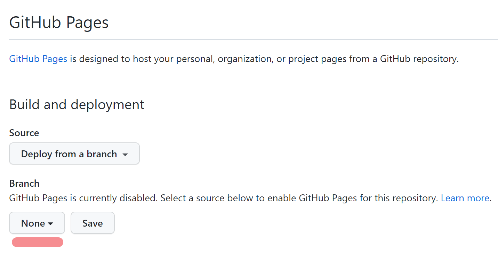

## Git命令行操作

### 1.1本地库初始化

`进入文件夹`

```bash
git init
# 注意：生成的 .git 目录中存放的是本地库相关文件，不要删除
```


### 1.2设置签名

- 项目(仓库)级别`仅在当前本地库有效`

    ```bash
    git config user.name tom  #设置用户名tom
    git config user.email liu@qq.com #设置用户邮箱
    ```

- 系统用户级别`仅在当前登录的操作系统用户有效`

  ```bash
  git config --global user.name tom
  git config --global user.email liu@qq.com
  ```

> 仅仅加了一个 `--global`
>
> 优先级别：`项目级别`  >  `系统级别`
>
> 信息保存位置：` ~/.gitconfig 文件 `   
>
- 查看全局配置
```bash
git config --lit --global
git config 单项
```


### 1.3基本操作

#### 1.3.1 状态查看

```bash
git status   #查看工作区、暂存区状态

git status -s #精简查看 
```


#### 1.3.2 添加

```bash
git add fileName  #指定文件
git add . #所有
说明：将工作区的文件添加到暂存区
```


#### 1.3.3 提交

```bash
git commit -m 'commit message' fileName
说明：将暂存区内容提交到本地库
```

当commit之后，git status 为空


跳过暂存区 直接将所有工作区的文件添加到本地git仓库

```bash
git commit -a -m 'commit message'
```


#### 1.3.4 文件差异比较

```bash
git diff #文件名
git diff commitID 文件名  #和历史中的一个版本比较
git diff  #不带文件名，则比较多个文件
```

#### 1.3.5 撤销对文件的修改/

```bash
# 若该文件显示已修改或者已删除
# 可撤销该文件的修改（工作区） 

git checkout filename 

git checkout . # 撤销工作区的所有修改
```

> https://blog.csdn.net/qq_45677671/article/details/129022522


#### 1.3.6 从暂存区中删除文件

```bash
git reset HEAD filename
```


#### 1.3.7 移除文件

- 从git仓库和工作区中同时移除

```bash
git rm -f fliename
```

- 只从git仓库中移除
```bash
git rm --cached fliename
```


#### 1.3.8 `.gitignore`

在根目录下创建`.gitignore`配置文件 即可实现忽略文件的效果


#### 1.3.9 查看历史提交版本

```bash
# git log 展示当前版本之前的历史版本
git log # 冒号后面 enter继续显示 q键退出显示

git log -n # 显示最近n次的提交历史

git log -n --pretty=oneline # 在一行上显示

git log --greph #图形显示,更直观
git log --oneline #简洁显示

# 展示所有的版本
git reflog
```


#### 1.3.10 版本前进后退

- 基于索引值`推荐`

  ```bash
  git reset --hard commitID
  ```
  
- 使用 **^** 符号`只能后退`

  ```bash
  git reset --hard HEAD^
  例子：git reset --hard HEAD^^
  # 注意：几个 ^ 表示后退几步
  ```

- 使用 **~** 符号`只能后退`

  ```bash
  git reset --hard HEAD~n
  例子：git reset --hard HEAD~3
  ```

- reset的三个参数比较

  ```
  soft: 
  - 仅本地库移动HEAD 指针
  mixed:
  - 在本地库移动HEAD指针
  - 重置暂存区
  hard:
  - 在本地库移动HEAD指针
  - 重置暂存区
  - 重置工作区
  ```


#### 1.3.11 其他命令
```
cd    ：  改变目录
cd ..    回退到上一个目录，直接cd进入默认目录
pwd   ： 显示当前所在的目录路径 
ls    ： 都是列出当前目录中的所有文件
touch :新建一个文件  如touch index.js就会在当前目录下新建一个index.js
rm  ：删除一个文件， rm index.js就会把index.js文件删除
mkdir  :新建一个目录，就是新建一个文件夹
rm -r 删除一个文件夹，rm -r src 删除src目录
mv  移动文件， mv index.html src        index.html 是我们要移动的文件，src是目标文件夹
reset 重新初始化终端/清屏
clear 清屏
history 查看命令历史
help 帮助
exit 退出
# 表示注释
esc 清空本行命令

复制: `ctrl + insert`

粘贴: `shift + insert`

清空：`clear`
```


### 2.2 分支管理

`hot_fix` `master` `feature_x` `feature_y`

#### 2.2.1 什么是分支管理

- 在版本控制中，使用推进多个任务

#### 2.2.2 分支的好处

- 同时并行推进多个功能开发，提高开发效率
- 某一分支开发失败，不会对其它分支有任何影响

#### 2.2.3 分支操作

- 创建分支

~~~bash
git branch 分支名 # 创建分支后并不会跳转到刚创建的分支上
~~~

- 查看分支

~~~bash
git branch
git branch -v 

git remote show 远程仓库名称 # 查看远程仓库所有分支
~~~

- 切换分支

~~~bash
git checkout 分支名
git checkout -b 分支名   #创建分支并直接切换到该分支
~~~

- 合并分支`相当于把修改了的文件拉过来`

~~~bash
git checkout master
git merge 分支名
~~~

- 删除分支

~~~bash
git branch -d 分支名

git push origin --delete 分支名 # 删除远程分支名
~~~

#### 2.2.4 解决冲突

- 冲突的表现
- 冲突的解决
  - 第一步：编辑，删除特殊标记`<<<` `===`
  - 第二步：修改到满意位置，保存退出
  - 第三步：添加到缓存区  `git  add 文件名`
  - 第四步：提交到本地库`git commit -m '日志信息' `  `注意：后面一定不能带文件名`

#### 2.2.5 跟踪分支

当远程仓库存在一个分支，而本地没有该分支则需要跟踪分支

```bash
git checkout 远程仓库分支名 # 在本地下载该分支

git checkout -b 本地分支名称 远程仓库名称/远程仓库分支名 # 下载并改名
```


## `Git` 结合`Github`

远程仓库名称：origin 

#### 1.1 连接

*注：本地的一个文件夹对应`Github`的一个仓库*

- 基于`https`连接

~~~bash
git remote add origin https://github.com/cocoonnu/WebProjects.git
git branch -M main
git push -u origin main # 第一次push 且需要登录
~~~

- 基于`ssh`连接

1、输入:`ssh-keygen -t rsa -C GitHub邮箱地址`  

2、进入`c/users/lenovo/.ssh`目录，复制`id_rsa.pub`文件内容

3、登录`GitHub`  `Settings`  --> `SSH and GPG keys ` --> `New SSH Key

```bash
git remote add origin git@github.com:cocoonnu/WebProjects.git
git branch -M main
git push -u origin main # 第一次push
```

#### 1.2 推送

~~~bash
git push # 推送主分支main（不是第一次）

git push -u origin 分支名 # 推送分支（第一次）
git push # 推送分支（不是第一次）
~~~

#### 1.3 克隆

克隆就是将仓库复制到本地生成一个文件夹

~~~bash
git clone  远程地址
~~~

#### 1.4 拉取

 将远程仓库的分支同步到本地

```bash
git pull # 默认主分支

git pull origin 分支名
```


#### 1.5 解决冲突

`注意：解决冲突后的提交是不能带文件名的`

`如果不是基于远程库最新版做的修改不能推送，必须先pull下来安装冲突办法解决`

#### 1.6 跨团队合作

`代码review之后合并`

- **适用于个人**

  **邀请成员**:`Settings` --> `Collaborators` -->`填写用户名` -->`打开链接接受邀请`

- **企业**   `创建一个组织` `方便管理`

- **review**

    `组织做review`  `通过Pull request`

- **给开源社区共享代码**

    `点击别人仓库的fork 到自己的仓库`   -- > `然后clone下来 修改后推送到远程库`  --> `点击Pull Request请求` --> `Create pull request发消息`

#### 1.7 Tag标签

`为了清晰的版本管理，公司一般不会直接使用commit提交`

```
git tag -a v1.0 -m '版本介绍'   #创建本地tag信息
git tag -d v1.0    		#删除tag
git push origin --tags   #将本地tag信息推送到远程库
git pull origin --tags    #拉取到本地

git checkout v.10    #切换tag
git clone -b v0.1 地址   #指定tag下载代码
```


#### 1.8 部署静态网站

将项目 dist 文件夹部署到一个仓库中，进入仓库的 `setting` -> `pages`




选择根路径然后点 `Save` 即可！


## Git工作流

*1、上传git时，node_modules可以加入.gitignore  但项目根目录一定要有package.json文件*


#### 1.1 概念

```
在项目开发过程中使用Git的方式
```

#### 1.2 分类

##### 1.2.1 集中式工作流

```
像SVN一样，集中式工作流有一个中央仓库，所有的修改都提交到了Master分支上
```

##### 1.2.2 `GitFlow`工作流 

主干分支`master`  开发分支`develop`  修复分支`hotfix`   预发布分支`release`  功能分支`feature`

```
GitFlow 有独立的分支，让发布迭代过程更流畅。
```

##### 1.2.3 Forking 工作流    

```
在 GitFlow 基础上， 充分利用了 Git 的 Fork 和 pull request 的功能以达到代码审核的目的。 
安全可靠地管理大团队的开发者
```


## Git 报错问题处理

### 删除工作区内容

即回到该版本初始状态

```bash
```


### 低于远程的版本

 报错：`Updates were rejected because the tip of your current branch is behind`：

原因是本地仓库中有部分代码版本低于远程的版本，肯定是版本回退导致的！！

```bash
git pull origin master //将远程代码拉取到本地，但存在冲突无法merge

git add -u  //将冲突的文件resolve掉之后才能成功pull，-u的意思是将文件的修改、文件的删除，添加到暂存区

git commit -m "注释"

git pull
```

之后手动解决冲突

```
<<<<<<< HEAD

本地代码

=======

拉下来的代码

>>>>>>>

```


解决完所有冲突后

```
git add. 
git commit -m "描述"//不加描述的话可能会弹出一个窗口要求填写描述信息，填上保存关掉即可
git push master origin
```


如果 `git push master origin` 还报错

```
// 重新尝试连接
git remote remove origin

git remote add origin git@github.com:cocoonnu/airbnb-ssr.git

// 推送
 git push --set-upstream origin main^
```

