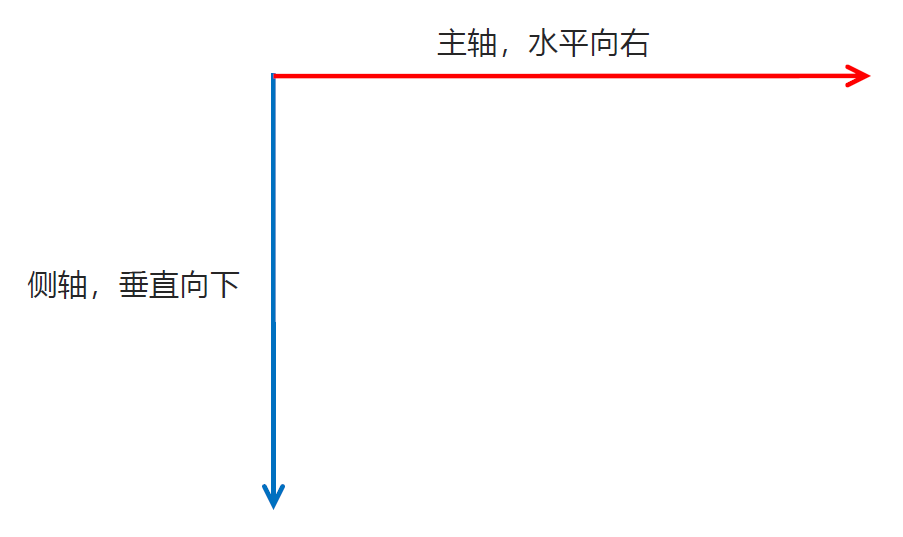
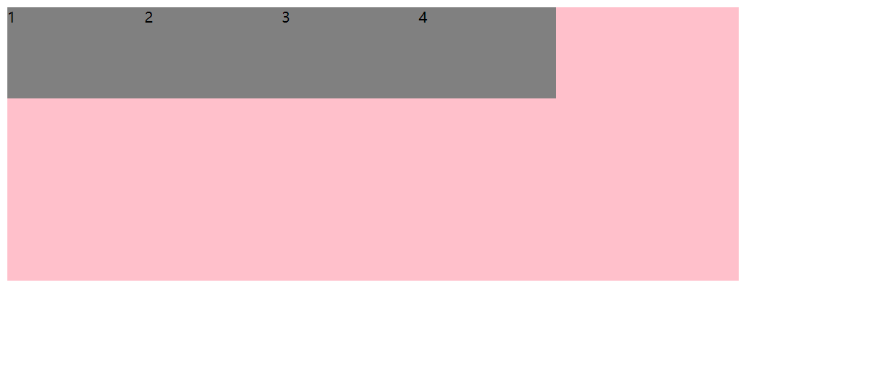
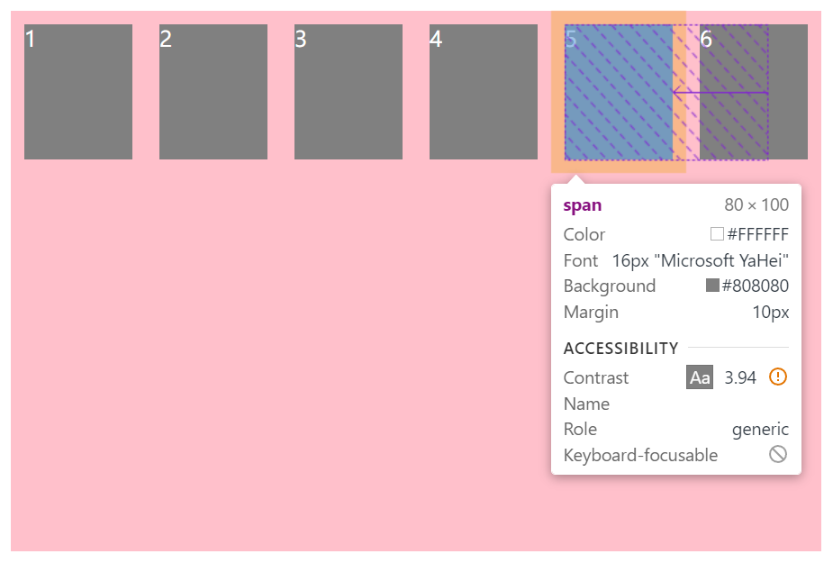
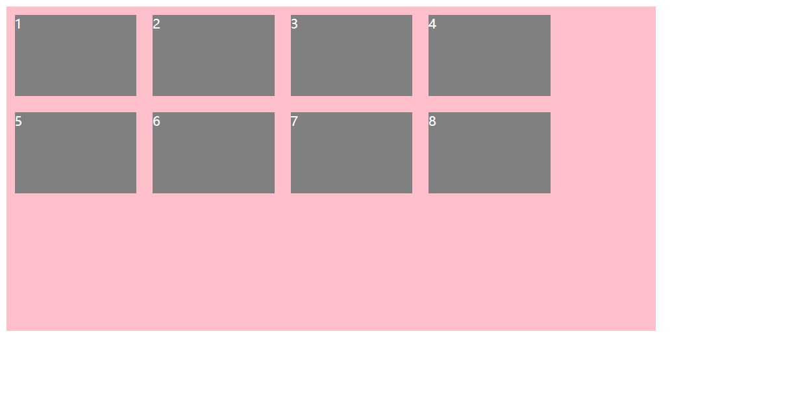
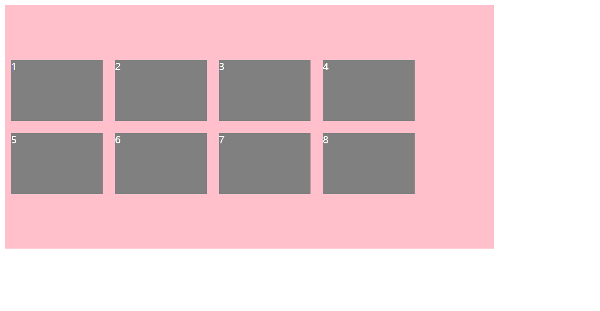
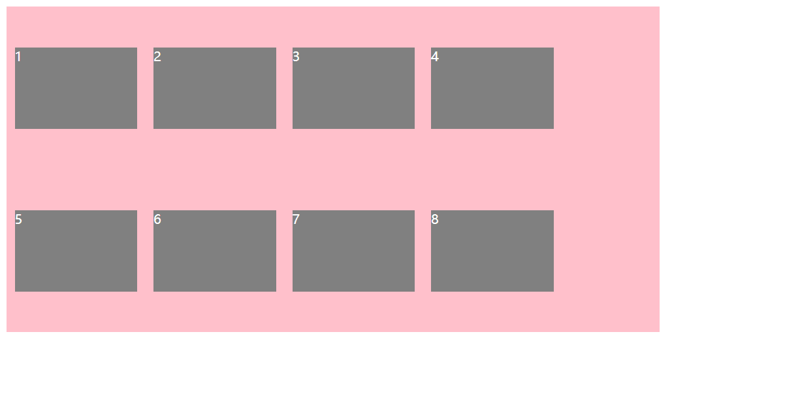
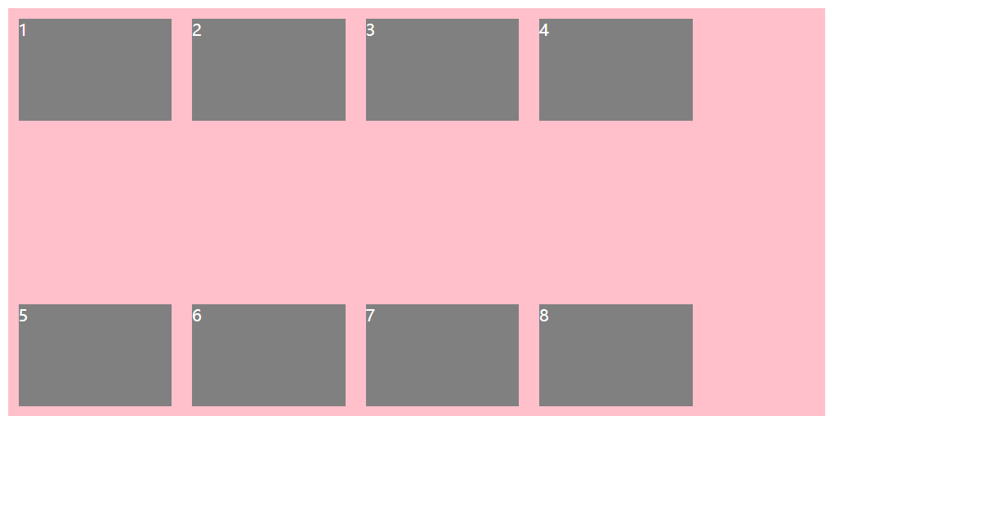
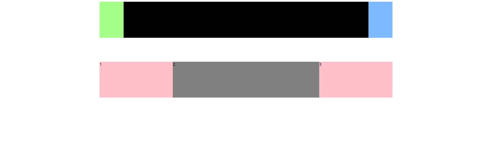
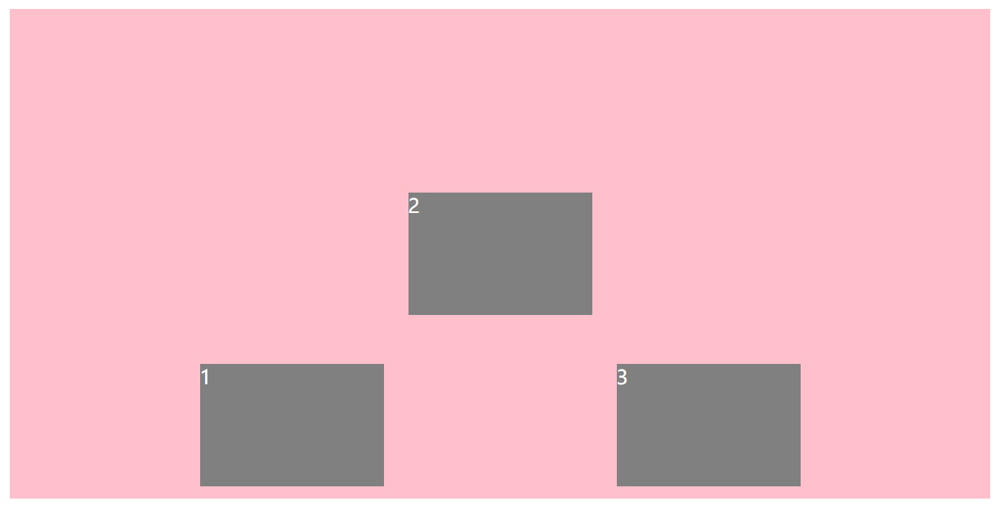
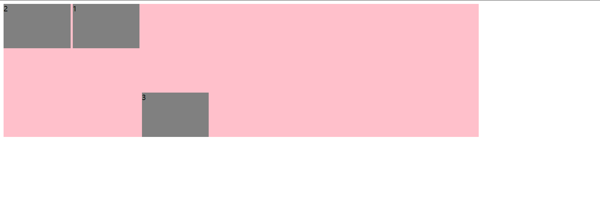

# 一、flex原理及模板

可参考文档：https://vue3js.cn/interview/css/flexbox.html


## 1.1 布局原理

flex 是 flexible Box 的缩写，意为 “弹性布局”，用来为盒状模型**提供最大的灵活性**，**任何一个容器都可以指定为 flex 布局**。

- 当我们为父盒子设为 flex 布局以后，子元素的 float（浮动功能）、clear（清除浮动功能）和 vertical-align（垂直居中功能）属性将失效。
- 伸缩布局 = 弹性布局 = 伸缩盒布局 = 弹性盒布局 = flex 布局

采用 flex 布局的元素，称为 flex 容器（flex container），简称 “容器”。它的所有子元素自动成为容器成员，称为 flex 项目（flex item），简称 “项目”。

- 上面的体验中 div 就是 flex 父容器
- 上面的体验中 span 就是子容器 flex 项目
- 子容器可以横向排列也可以纵向排列

【子容器横向排列时的图示】


【总结 flex 布局原理】

**就是通过给父盒子添加 flex 属性，来控制子盒子的位置和排列方式。**


## 1.2 flex 模板

这里介绍一下 flex 布局的分布图示

https://www.ruanyifeng.com/blog/2015/07/flex-grammar.html?utm_source=tuicool


# 二、flex布局父项属性

## 2.1 常见父项属性

将任何一个容器指定为块元素并且Flex布局。

```css
.box {
  display: flex;
}
```

将盒子变成**行内块元素并且flex布局**

```css
.box {
  display: inline-flex;
}
```


**常见父项的 6 个属性**

- `flex-direction`：设置主轴的方向
- `justify-content`：设置主轴上的子元素排列方式
- `flex-wrap`：设置子元素是否换行
- `align-content`：设置侧轴上的子元素的排列方式（多行）
- `align-items`：设置侧轴上的子元素排列方式（单行）
- `flex-flow`：复合属性，相当于同时设置了 flex-direction 和 flex-wrap
- `column-gap`：指定列子元素之间的的间隙大小
- `gap: row-gap column-gap;`：设置网格布局中行、列之间的间隙大小


## 2.2 flex-direction

**（1）主轴与侧轴**

在 flex 布局中，是分为主轴和侧轴两个方向，同样的叫法有：行 和 列、x轴 和 y轴

- 默认主轴方向就是 x轴 方向，水平向右
- 默认侧轴方向就是 y轴 方向，水平向下



**（2）属性值**

`flex-direction` 属性决定主轴的方向（即：项目的排列方向）

注意：主轴和侧轴是会变化的，就看 flex-direction 设置谁为主轴，剩下的就是侧轴。而我们的子元素是跟着主轴来排列的。

| 属性值           | 说明               |
| ---------------- | ------------------ |
| `row`            | 从左到右（默认值） |
| `row-reverse`    | 从右到左           |
| `column`         | 从上到下           |
| `column-reverse` | 从下到上           |


```html
<!doctype html>
<html lang="en">

<head>
    <meta charset="UTF-8">
    <meta name="viewport" content="width=device-width, initial-scale=1.0">
    <meta http-equiv="X-UA-Compatible" content="ie=edge">
    <title>02-flex主轴方向</title>
    <style>
        div {
            /* 给父级添加flex属性 */
            display: flex;
            width: 800px;
            height: 300px;
            background-color: pink;
            /* 默认的主轴是 x 轴,那么 y 轴就是侧轴喽 */
            /* 我们的元素是跟着主轴来排列的 */
            /* flex-direction: row; */
            /* 简单了解翻转即可 */
            flex-direction: row-reverse;
            /* 我们可以把我们的主轴设置为 y 轴 那么 x 轴就成了侧轴 */
            /* flex-direction: column; */
        }

        div span {
            width: 150px;
            height: 100px;
            background-color: purple;
        }
    </style>
</head>

<body>
    <div>
        <span>1</span>
        <span>2</span>
        <span>3</span>
    </div>
</body>

</html>
```


## 2.3 justify-content

`justify-content` 属性定义了项目在主轴上的对齐方式，**设置主轴上的子元素排列方式**

注意：使用这个属性之前一定要确定好主轴是哪个！

| 属性值          | 说明                                                 |
| --------------- | ---------------------------------------------------- |
| `flex-start`    | 从头部开始，如果主轴是 x轴，则从左到右**（默认值）** |
| `flex-end`      | 从尾部开始排列                                       |
| `center`        | 在主轴居中对齐（如果主轴是 x轴 则 水平居中）         |
| `space-around`  | 平分剩余空间                                         |
| `space-between` | 先两边贴边再平分剩余空间（重要）                     |


> 注：行内元素不生效，必须转换为块元素
>
> space-between 可以实现三个元素左中右布局


```html
<!doctype html>
<html lang="en">

<head>
    <meta charset="UTF-8">
    <meta name="viewport" content="width=device-width, initial-scale=1.0">
    <meta http-equiv="X-UA-Compatible" content="ie=edge">
    <title>03-flex设置主轴上的子元素排列方式1</title>
    <style>
        div {
            display: flex;
            width: 800px;
            height: 300px;
            background-color: pink;
            /* 默认的主轴是 x轴 row */
            flex-direction: row;
            /* justify-content: 是设置主轴上子元素的排列方式 */
            /* 从头部开始，如果主轴是 x轴，则从左到右（默认值） */
            justify-content: flex-start;
            /* 从尾部开始排列 */
            /* justify-content: flex-end; */
            /* 让我们子元素居中对齐 */
            /* justify-content: center; */
            /* 平分剩余空间 */
            /* justify-content: space-around; */
            /* 先两边贴边，在分配剩余的空间 */
            /* justify-content: space-between; */
        }

        div span {
            width: 150px;
            height: 100px;
            background-color: gray;
        }
    </style>
</head>

<body>
    <div>
        <span>1</span>
        <span>2</span>
        <span>3</span>
        <span>4</span>
    </div>
</body>

</html>
```



> 注意：以上例子并不能根据浏览器窗口大小自动调整子项之间的间距，因为父盒子的宽度是固定死 800px 的，假如我们把父盒子宽度设为 80%，那么就可以有效果了。

`div {width: 800px;}`


`div {width: 80%;}`


`div {width: 80%;}`

`div span {width: 80%;}`


## 2.4 flex-wrap

`flex-wrap`：设置子元素是否换行

默认情况下，项目都排在一条线（又称 “轴线”）上。flex-wrap 属性定义，flex 布局中默认是不换行的。

| 属性值   | 说明             |
| -------- | ---------------- |
| `nowrap` | 不换行（默认值） |
| `wrap`   | 换行             |


```html
<style>
    div {
        display: flex;
        width: 600px;
        height: 400px;
        background-color: pink;
        /* flex布局中，默认的子元素是不换行的， 如果装不开，会缩小子元素的宽度，放到父元素里面  */
        /* flex-wrap: nowrap; */
        /* 自动换行 */
        /* flex-wrap: wrap; */
    }

    div span {
        width: 150px;
        height: 100px;
        background-color: gray;
        color: #fff;
        margin: 10px;
    }
</style>

<body>
    <div>
        <span>1</span>
        <span>2</span>
        <span>3</span>
        <span>4</span>
        <span>5</span>
        <span>6</span>
    </div>
</body>
```




## 2.5 align-items

**设置侧轴上的子元素排列方式（子项只有单行的情况）**

该属性是控制子项在**侧轴**（默认是 y轴）上的排列方式，在子项为单项（单行）的时候使用。

| 属性值       | 说明                                   |
| ------------ | -------------------------------------- |
| `flex-start` | 从上到下                               |
| `flex-end`   | 从下到上                               |
| `center`     | 挤在一起居中                           |
| `stretch`    | **拉伸（默认值）**默认子元素等高或等宽 |


```html
<style>
    div {
        display: flex;
        width: 800px;
        height: 400px;
        background-color: pink;
        /* 默认的主轴是 x轴 row */
        flex-direction: row;
        justify-content: center;
        /* 设置侧轴：从上到下 */
        align-items: flex-start;
    }

    div span {
        width: 150px;
        height: 100px;
        background-color: gray;
        color: #fff;
        margin: 10px;
    }
</style>

<body>
    <div>
        <span>1</span>
        <span>2</span>
        <span>3</span>
    </div>
</body>
```


> align-items 只能统一对侧轴上的子元素排列方式，假如有多行子元素，要分别对不同的行设置不同的排列方式，那么此种方式就无法做了。


## 2.6 align-content 

**设置侧轴上的子元素的排列方式（子项为多行的情况）**

设置子项在侧轴上的排列方式并且只能用于子项出现 **换行** 的情况（多行），**在单行下是没有效果的**。

| 属性值          | 说明                                   |
| --------------- | -------------------------------------- |
| `flex-start`    | 在侧轴的头部开始排列                   |
| `flex-end`      | 在侧轴的尾部开始排列                   |
| `center`        | 在侧轴中间显示                         |
| `space-around`  | 子项在侧轴平方剩余空间                 |
| `space-between` | 子项在侧轴先分布在两头，再平分剩余空间 |
| `stretch`       | 行拉伸以占据剩余空间（默认值）         |


```html
<!doctype html>
<html lang="en">

<head>
    <meta charset="UTF-8">
    <meta name="viewport" content="width=device-width, initial-scale=1.0">
    <meta http-equiv="X-UA-Compatible" content="ie=edge">
    <title>07-flex设置侧轴上的子元素排列方式（多行）</title>
    <style>
        div {
            display: flex;
            width: 800px;
            height: 400px;
            background-color: pink;
            /* 换行 */
            flex-wrap: wrap;
            /* 因为有了换行，此时我们侧轴上控制子元素的对齐方式我们用 align-content */
            align-content: flex-start;
        }

        div span {
            width: 150px;
            height: 100px;
            background-color: gray;
            color: #fff;
            margin: 10px;
        }
    </style>
</head>

<body>
    <div>
        <span>1</span>
        <span>2</span>
        <span>3</span>
        <span>4</span>
        <span>5</span>
        <span>6</span>
        <span>7</span>
        <span>8</span>
    </div>
</body>

</html>
```



```css
align-content: center;
```



```css
align-content: space-around;
```



```css
align-content: space-between;
```



```css
align-content: stretch;
```


## 2.7 flex-flow

`flex-flow` 属性是 **flex-direction 和 flex-wrap 属性的复合属性**

语法：`flex-flow: row wrap;`


```html
<!doctype html>
<html lang="en">

<head>
    <meta charset="UTF-8">
    <meta name="viewport" content="width=device-width, initial-scale=1.0">
    <meta http-equiv="X-UA-Compatible" content="ie=edge">
    <title>08-flex-flow复合属性</title>
    <style>
        div {
            display: flex;
            width: 600px;
            height: 300px;
            background-color: pink;
            /* flex-direction: column;
            flex-wrap: wrap; */
            /* 把设置主轴方向和是否换行（换列）简写 */
            flex-flow: column wrap;
        }

        div span {
            width: 150px;
            height: 100px;
            background-color: gray;
        }
    </style>
</head>

<body>
    <div>
        <span>1</span>
        <span>2</span>
        <span>3</span>
        <span>4</span>
        <span>5</span>
    </div>
</body>

</html>
```


# 三、flex布局子项属性

主要介绍3个常见属性

- flex 子项目占的份数
- align-self 控制子项自己在侧轴的排列方式
- order 属性定义子项的排列顺序（前后顺序）
- **width：使用百分比，占父类的宽度 **+ flex-wrap 换行属性很方便！！


## 3.1 flex 属性

flex 属性定义子项目分配剩余空间，用 flex 来表示占多少份数。

```css
.item {
    flex: n; /* default 0 */
}
```

理解：

1、该子项占父盒子剩余空间的 n / sum  

2、sum= n1 + n2 + n3 （子项占有之和）


```html
<!doctype html>
<html lang="en">

<head>
    <meta charset="UTF-8">
    <meta name="viewport" content="width=device-width, initial-scale=1.0">
    <meta http-equiv="X-UA-Compatible" content="ie=edge">
    <title>09-flex子项flex份数</title>
    <style>
            section {
                display: flex;
                width: 60%;
                height: 150px;
                background-color: pink;
                margin: 0 auto;
            }

            section div:nth-child(1) {
                width: 100px;
                height: 150px;
                background-color: rgb(166, 255, 139);
            }

            section div:nth-child(2) {
                flex: 1;
                background-color: rgb(0, 0, 0);
            }

            section div:nth-child(3) {
                width: 100px;
                height: 150px;
                background-color: rgb(124, 185, 255);
            }

        p {
            display: flex;
            width: 60%;
            height: 150px;
            background-color: pink;
            margin: 100px auto;
        }

        p span {
            flex: 1;
        }

        p span:nth-child(2) {
            flex: 2;
            background-color: gray;
        }
    </style>
</head>

<body>
    <section>
        <div></div>
        <div></div>
        <div></div>
    </section>
    <p>
        <span>1</span>
        <span>2</span>
        <span>3</span>
    </p>
</body>

</html>
```



## 3.2 align-self

`align-self` ：**控制子项自己在侧轴上的排列方式**

允许单个项目有与其他项目不一样的对齐方式，**可覆盖 align-items 属性**。

| 属性值       | 说明                                                         |
| ------------ | ------------------------------------------------------------ |
| `flex-start` | 从上到下                                                     |
| `flex-end`   | 从下到上                                                     |
| `center`     | 挤在一起居中                                                 |
| `stretch`    | 拉伸，注：前提是子盒子没有指定高度，否则没有效果！           |
| `auto`       | 默认值，表示继承父元素 `align-items` 属性，如果没有父元素，则为 `stretch` |


```html
<!doctype html>
<html lang="en">

<head>
    <meta charset="UTF-8">
    <meta name="viewport" content="width=device-width, initial-scale=1.0">
    <meta http-equiv="X-UA-Compatible" content="ie=edge">
    <title>align-self控制子项自己在侧轴上的排列方式</title>
    <style>
        div {
            display: flex;
            width: 800px;
            height: 400px;
            background-color: pink;
            /* 默认的主轴是 x轴 row */
            flex-direction: row;
            justify-content: center;
            /* 设置侧轴：从下到上 */
            align-items: flex-end;
        }

        div span {
            width: 150px;
            height: 100px;
            background-color: gray;
            color: #fff;
            margin: 10px;
        }

        div span:nth-child(2) {
            align-self: center;
        }
    </style>
</head>

<body>
<div>
    <span>1</span>
    <span>2</span>
    <span>3</span>
</div>
</body>

</html>
```




## 3.3 order

`order`：**定义该子项目在父盒子中的排列顺序**，数值越小，排列越靠前，默认为 0。

```css
.item {
    order: n;
}
```


```html
<!doctype html>
<html lang="en">

<head>
    <meta charset="UTF-8">
    <meta name="viewport" content="width=device-width, initial-scale=1.0">
    <meta http-equiv="X-UA-Compatible" content="ie=edge">
    <title>10-align-self和order</title>
    <style>
        div {
            display: flex;
            width: 80%;
            height: 300px;
            background-color: pink;
            /* 让三个子盒子沿着侧轴底侧对齐 */
            /* align-items: flex-end; */
            /* 我们想只让3号盒子下来底侧 */
        }

        div span {
            width: 150px;
            height: 100px;
            background-color: gray;
            margin-right: 5px;
        }

        div span:nth-child(2) {
            /* 排列顺序 */
            /* 默认是0，-1比0小所以在前面 */
            order: -1;
        }

        div span:nth-child(3) {
            /* 单独设置 */
            align-self: flex-end;
        }
    </style>
</head>

<body>
    <div>
        <span>1</span>
        <span>2</span>
        <span>3</span>
    </div>
</body>

</html>
```



