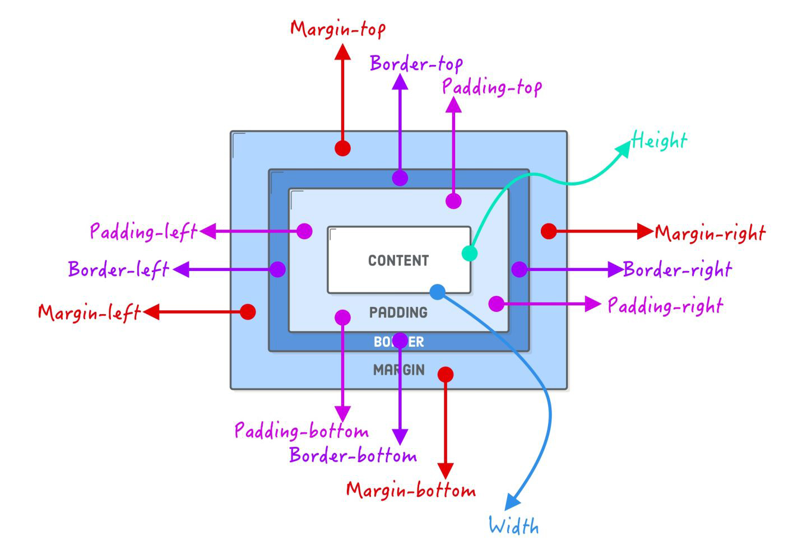
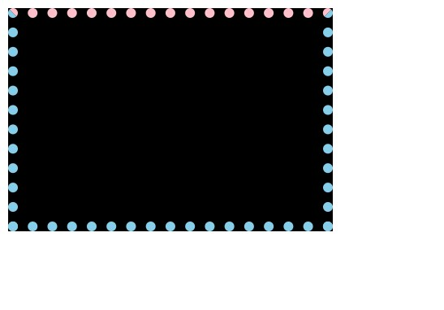
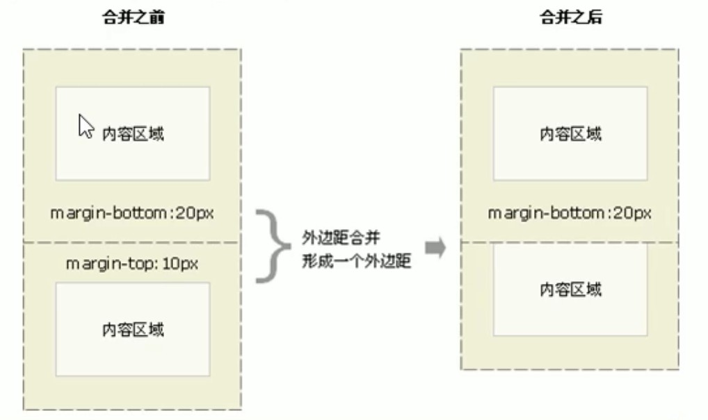

# 一、盒子模型

网页布局过程：

- 先准备好相关的网页元素，网页元素基本都是盒子

- 利用 CSS 设置好盒子样式，然后摆放到相应位置

- 往盒子里面装内容

网页**布局的核心**本质： 就是**利用 CSS 摆盒子！**


**盒子模型组成：**

所谓盒子模型：就是把 HTML 页面中的布局元素看作是一个矩形的盒子，也就是一个盛**装内容的容器**。
CSS 盒子模型本质上是一个盒子，封装周围的 HTML 元素，它包括：`边框`、`外边距`、`内边距`、和 `内容`。





# 二、盒子边框

`border` 可以设置元素的边框。

边框有三部分组成：`边框宽度（粗细）`、`边框样式`、`边框颜色`。

**语法：**

```css
border: border-width || border-style || border-color
```

| 属性           | 作用                      |
| -------------- | ------------------------- |
| `border-width` | 定义边框粗细，单位是 `px` |
| `border-style` | 边框的样式                |
| `border-color` | 边框颜色                  |


边框样式 border-style 可以设置如下值：

- `none`：没有边框，即忽略所有边框的宽度（默认值）
- `solid`：边框为单实线（最为常用的）
- `dashed`：边框为虚线
- `dotted`：边框为点线

**边框简写：**

```css
border: 1px solid red; 	/* 没有顺序 */
```

**边框分开写法：**

```css
border-top: 1px solid red; 		/* 只设定上边框，其余同理 */
```

**案例：**

```html
<!doctype html>
<html lang="en">

<head>
    <meta charset="UTF-8">
    <meta http-equiv="X-UA-Compatible" content="IE=edge">
    <meta name="viewport" content="width=device-width, initial-scale=1.0">
    <title>盒子模型之边框的复合写法</title>
    <style>
        div {
            width: 300px;
            height: 200px;
            /* 
            -- border-width 边框的粗细，一般情况下使用 px --
            border-width: 5px;
            -- border-width 边框的样式 solid 实线边框 dashed 虚线边框 dotted 点线边框 --
            border-style: solid;
            background-color: pink;
            */
            /* 边框的复合写法 简写： */
            border: 10px dotted skyblue;
            /* 利用 CSS 层叠性将上边框单独覆盖 */
            border-top: 10px dotted pink;
            background-color: black;
        }
    </style>
</head>

<body>
    <div></div>
</body>

</html>
```



## 2.1 表格的细线边框

表格中两个单元格相邻的边框会重叠在一起，呈现出加粗的效果。

```html
<!doctype html>
<html lang="en">

<head>
    <meta charset="UTF-8">
    <meta http-equiv="X-UA-Compatible" content="IE=edge">
    <meta name="viewport" content="width=device-width, initial-scale=1.0">
    <title>表格边框——今日小说排行榜</title>
    <style>
        table {
            width: 500px;
            height: 249px;
        }

        th {
            height: 35px;
        }

        table,
        td,
        th {
            border: 1px solid black;
            /* 合并相邻的边框 */
            /* border-collapse: collapse; */
            font-size: 14px;
            text-align: center;
        }
    </style>
</head>

<body>
    <table align="center" cellspacing="0">
        <thead>
            <tr>
                <th>排名</th>
                <th>关键词</th>
                <th>趋势</th>
                <th>进入搜索</th>
                <th>最近七日</th>
                <th>相关链接</th>
            </tr>
        </thead>
        <tbody>
            <tr>
                <td>1</td>
                <td>鬼吹灯</td>
                <td></td>
                <td>456</td>
                <td>123</td>
                <td> <a href="#">贴吧</a> <a href="#">图片</a> <a href="#">百科</a> </td>
            </tr>

            <tr>
                <td>1</td>
                <td>鬼吹灯</td>
                <td></td>
                <td>456</td>
                <td>123</td>
                <td> <a href="#">贴吧</a> <a href="#">图片</a> <a href="#">百科</a> </td>
            </tr>
            <tr>
                <td>3</td>
                <td>西游记</td>
                <td></td>
                <td>456</td>
                <td>123</td>
                <td> <a href="#">贴吧</a> <a href="#">图片</a> <a href="#">百科</a> </td>
            </tr>
            <tr>
                <td>1</td>
                <td>鬼吹灯</td>
                <td></td>
                <td>456</td>
                <td>123</td>
                <td> <a href="#">贴吧</a> <a href="#">图片</a> <a href="#">百科</a> </td>
            </tr>
            <tr>
                <td>1</td>
                <td>鬼吹灯</td>
                <td></td>
                <td>456</td>
                <td>123</td>
                <td> <a href="#">贴吧</a> <a href="#">图片</a> <a href="#">百科</a> </td>
            </tr>
            <tr>
                <td>1</td>
                <td>鬼吹灯</td>
                <td></td>
                <td>456</td>
                <td>123</td>
                <td> <a href="#">贴吧</a> <a href="#">图片</a> <a href="#">百科</a> </td>
            </tr>
        </tbody>
    </table>
</body>

</html>
```


`border-collapse` 属性控制浏览器绘制表格边框的方式。

它控制相邻单元格的边框。

**语法：**

```css
border-collapse: collapse;
```

- `collapse` 单词是合并的意思
- `border-collapse: collapse;` 表示相邻边框合并在一起

```css
	table,
	td,
	th {
	    border: 1px solid black;
	    /* 合并相邻的边框 */
	    border-collapse: collapse;
	    font-size: 14px;
	    text-align: center;
	}
```


## 2.2 边框会影响盒子实际大小

边框会额外增加盒子的实际区域大小。因此我们有两种方案解决：

- 测量盒子大小的时候，不量边框
- 如果测量的时候包含了边框，则需要 width、height 减去边框宽度（注意减单边还是双边）

> 注意：盒子实际区域大小 = 内容区大小 + 内边距大小 + 边框大小 + 外边距大小

案例：

```html
<!doctype html>
<html lang="en">

<head>
    <meta charset="UTF-8">
    <meta http-equiv="X-UA-Compatible" content="IE=edge">
    <meta name="viewport" content="width=device-width, initial-scale=1.0">
    <title>边框会影响盒子的实际大小</title>
    <style>
        /* 我们需要一个 200*200 的盒子, 但是这个盒子有 10 像素的红色边框 */
        div {
            width: 180px;
            height: 180px;
            background-color: pink;
            border: 10px solid black;
        }
    </style>
</head>

<body>
    <div></div>
</body>

</html>
```


# 三、内边距

padding 属性用于设置**内边距**，即**边框与内容之间的距离**。

**就是该盒子的子类或里面的内容距离该盒子边框的边距！！！**

```css
.mov-servers ul li {
    float: left;
    height: 50px;
    width: 240px;
    background-color: #b1191a;
    padding-left: 35px;
}
```


| 属性             | 作用     |
| ---------------- | -------- |
| `padding-left`   | 左内边距 |
| `padding-rigth`  | 右内边距 |
| `padding-top`    | 上内边距 |
| `padding-bottom` | 下内边距 |

padding 属性（简写属性）可以有一到四个值。

| 值的个数                       | 表达意思                                                     |
| ------------------------------ | ------------------------------------------------------------ |
| `padding: 5px;`                | 1 个值，代表上下左右都有 5 像素内边距                        |
| `padding: 5px 10px;`           | 2 个值，代表上下内边距是 5 像素，左右内边距是 10 像素        |
| `padding: 5px 10px 20px;`      | 3 个值，代码上内边距 5 像素，左右内边距 10 像素，下内边距 20 像素 |
| `padding: 5px 10px 20px 30px;` | 4 个值，上是 5 像素，右 10 像素，下 20 像素，左是 30 像素（顺时针） |

以上 4 种情况，我们实际开发都会遇到。

当我们给盒子指定 `padding` 值之后，发生了 2 件事情：

- 内容和边框有了距离，添加了内边距
- `padding` 影响了盒子实际区域大小

也就是说，如果盒子已经有了宽度和高度，此时再指定内边距，会撑大盒子区域！

解决方案：

- 如果保证盒子跟效果图大小保持一致，则让 width、height 减去多出来的内边距大小即可
- 如果盒子本身没有指定 width、height 属性，则此时 padding 不会撑开盒子区域大小

【padding 撑大盒子】

```html
<!doctype html>
<html lang="en">

<head>
    <meta charset="UTF-8">
    <meta http-equiv="X-UA-Compatible" content="IE=edge">
    <meta name="viewport" content="width=device-width, initial-scale=1.0">
    <title>padding 撑大盒子</title>
    <style>
        div {
            background-color: #000;
            width: 100px;
            height: 100px;
            /* padding: 30px; */
        }
    </style>
</head>

<body>
    <div></div>
</body>

</html>
```


```html
<!doctype html>
<html lang="en">

<head>
    <meta charset="UTF-8">
    <meta http-equiv="X-UA-Compatible" content="IE=edge">
    <meta name="viewport" content="width=device-width, initial-scale=1.0">
    <title>padding 撑大盒子</title>
    <style>
        div {
            background-color: #000;
            width: 100px;
            height: 100px;
            padding: 30px;
        }
    </style>
</head>

<body>
    <div></div>
</body>

</html>
```


案例：

```html
<!doctype html>
<html lang="en">

<head>
    <meta charset="UTF-8">
    <meta http-equiv="X-UA-Compatible" content="IE=edge">
    <meta name="viewport" content="width=device-width, initial-scale=1.0">
    <title>盒子模型之内边距</title>
    <style>
        div {
            width: 200px;
            height: 200px;
            background-color: pink;
            /*
            padding-top: 5px;
            padding-rigth: 10px;
            padding-bottom: 20px;
            padding-rigth: 30px;
             */
            /* 内边距复合写法（简写） 上、右、下、左 */
            padding: 5px 10px 20px 30px;
            /* 由于在对盒子指定高宽后，padding 会撑大盒子 */
            /* 所以，此时盒子大小为：240*225 */
            /* 注意：这里的“盒子大小”指的是盒子所占据的大小，盒子真实的 width 和 height 依旧是 200px */
        }
    </style>
</head>

<body>
    <div>
        盒子内容是 content，盒子内容是 content，盒子内容是 content
    </div>
</body>

</html>
```

padding 的使用技巧：


# 四、外边距

`margin` 属性用于设置**外边距**，即控制**盒子和盒子之间的距离**。

```
margin: 上 右 下 左
margin: 上下 左右
```


| 属性            | 作用     |
| --------------- | -------- |
| `margin-left`   | 左外边距 |
| `margin-right`  | 右外边距 |
| `margin-top`    | 上外边距 |
| `margin-bottom` | 下外边距 |

`margin` 简写方式代表的意义跟 `padding` 完全一致。

外边距典型应用：

外边距可以让**块级盒子水平居中**，但是必须满足两个条件：

- 盒子必须指定了宽度 `width`
- 盒子左右的外边距都设置为 `auto`

```css
.header { width: 960px; margin: 0 auto;}
```

常见的写法，以下三种都可以：

- `margin-left: auto; margin-right: auto;`
- `margin: auto;`
- `margin: 0 auto;`

注意：以上方法是让块级元素水平居中，行内元素或者行内块元素水平居中给其父元素添加 `text-align: center` 即可。

案例：

```html
<!doctype html>
<html lang="en">

<head>
    <meta charset="UTF-8">
    <meta http-equiv="X-UA-Compatible" content="IE=edge">
    <meta name="viewport" content="width=device-width, initial-scale=1.0">
    <title>盒子模型之外边距margin</title>
    <style>
        div {
            width: 200px;
            height: 200px;
            background-color: pink;
        }

        /* 
        .one {
            margin-bottom: 20px;
        } 
        */

        .two {
            margin-top: 20px;
        }
    </style>
</head>

<body>
    <div class="one">1</div>
    <div class="two">2</div>
</body>

</html>
```


```html
<!doctype html>
<html lang="en">

<head>
    <meta charset="UTF-8">
    <meta http-equiv="X-UA-Compatible" content="IE=edge">
    <meta name="viewport" content="width=device-width, initial-scale=1.0">
    <title>块级盒子水平居中对齐</title>
    <style>
        .header {
            width: 900px;
            height: 200px;
            background-color: pink;
            /* 上下 100 左右 auto */
            margin: 100px auto;
        }
    </style>
</head>

<body>
    <div class="header"></div>
</body>

</html>
```


```html
<!doctype html>
<html lang="en">

<head>
    <meta charset="UTF-8">
    <meta http-equiv="X-UA-Compatible" content="IE=edge">
    <meta name="viewport" content="width=device-width, initial-scale=1.0">
    <title>行内元素、行内块元素水平居中对齐</title>
    <style>
        .header {
            width: 900px;
            height: 200px;
            background-color: pink;
            margin: 100px auto;
            /* 行内元素或者行内块元素水平居中给其父元素添加 text-align: center 即可 */
            text-align: center;
        }

        /* 这样是不起作用的 */
        /* 
        span {
            margin: 0 auto;
        } 
        */
    </style>
</head>

<body>
    <div class="header">
        <span>里面的文字</span>
    </div>
    <div class="header">
        
    </div>
</body>

</html>
```


## 4.1 外边距合并

这里是 BFC 应用场景一：**防止 margin 重叠（塌陷）**


### 4.1.1 相邻块元素垂直外边距的合并

当上下相邻的两个块元素（兄弟关系）相遇时，如果上面的元素有下外边距 `margin-bottom`，下面的元素有上外边距 `margin-top` ，则他们之间的垂直间距不是 `margin-bottom` 与 `margin-top` 之和。而是取两个值中的**较大者**，这种现象被称为相邻块元素垂直外边距的合并（准确的描述应该是：**大的外边距覆盖小的**）。




**解决方案：**

尽量只给一个盒子添加 `margin` 值。

```html
<!doctype html>
<html lang="en">

<head>
    <meta charset="UTF-8">
    <meta http-equiv="X-UA-Compatible" content="IE=edge">
    <meta name="viewport" content="width=device-width, initial-scale=1.0">
    <title>相邻块元素垂直外边距的合并</title>
    <style>
        .one {
            width: 200px;
            height: 200px;
            background-color: hotpink;
            margin-bottom: 100px;
        }

        .two {
            width: 200px;
            height: 200px;
            background-color: skyblue;
            margin-top: 100px;
        }
    </style>
</head>

<body>
    <div class="one">one</div>
    <div class="two">two</div>
</body>

</html>
```


### 4.1.2 嵌套块元素垂直外边距的塌陷

对于两个嵌套关系（父子关系）的块元素，当子元素有上外边距，此时父元素会塌陷较大的外边距值（**外边距效果显示在父元素之上**）。

```html
<style>
    /* 嵌套块元素垂直外边距的塌陷 */

    div {
        margin: 0 auto;
        width: 200px;
        height: 200px;
        background-color: black;
    }

    /* 当子类盒子加了margin之后 实际上会带动父类一起margin */
    .qqq {
        margin-top: 10px;
        width: 100px;
        height: 100px;
        background-color: aliceblue;
    }

    /* 解决办法：给子类加绝对定位！！ 这样margin就只作用于子类了！*/
</style>

<body>
    <div>
        <div class="qqq"></div>
    </div>
</body>
```

**解决方案：**

- 可以为父元素定义上边框（比如：可以给一个透明 transparent 边框）
- 可以为父元素定义上内边距
- 可以为父元素添加 `overflow: hidden`
- 给子类盒子添加浮动、固定，绝对定位

**注意：外边距的合并在利用盒子布局页面的时候是经常发生的！**


# 五、圆角边框

CSS 3 新增了圆角边框样式。

border-radius 属性用于设置元素的外边框圆角。

语法：

```css
border-radius: length;
```

原理：

border-radius 顾名思义：边框半径。

（椭）圆与边框的交集形成圆角效果。

```html
<!doctype html>
<html lang="en">

<head>
    <meta charset="UTF-8">
    <meta name="viewport" content="width=device-width, initial-scale=1.0">
    <meta http-equiv="X-UA-Compatible" content="ie=edge">
    <title>圆角边框</title>
    <style>
        div {
            width: 300px;
            height: 150px;
            background-color: pink;
            border-radius: 24px;
        }
    </style>
</head>

<body>
    <div></div>
</body>

</html>
```

注意：

- 参数值可以为数值或百分比的形式
- 如果是正方形，想要设置为圆形，那么只需要把数值修改为高度或者宽度的一半即可，或者直接写为 50%
- 如果是个矩形，设置为高度的一半就可以做 “胶囊” 效果了
- 该属性是一个简写属性，可以跟多个值
  - 四个值：左上角、右上角、右下角、左下角（从左上开始顺时针）
  - 三个值：左上、右上+左下、右下（对角为一组）
  - 两个值：左上+右下、右上+左下（对角为一组）
- 同时可以对特定角单独设置
  - 左上角：`border-top-left-radius`
  - 右上角：`border-top-right-radius`
  - 右下角：`border-bottom-right-radius`
  - 左下角：`border-bottom-left-radius`

```html
<!doctype html>
<html lang="en">

<head>
    <meta charset="UTF-8">
    <meta name="viewport" content="width=device-width, initial-scale=1.0">
    <meta http-equiv="X-UA-Compatible" content="ie=edge">
    <title>圆角边框常用写法</title>
    <style>
        .yuanxing {
            width: 200px;
            height: 200px;
            background-color: pink;
            /* border-radius: 100px; */
            /* 50% 就是宽度和高度的一半  等价于 100px */
            border-radius: 50%;
        }

        .juxing {
            width: 300px;
            height: 100px;
            background-color: pink;
            /* 圆角矩形设置为高度的一半 */
            border-radius: 50px;
        }

        .radius {
            width: 200px;
            height: 200px;
            /* border-radius: 10px 20px 30px 40px; */
            /* border-radius: 10px 40px; */
            border-top-left-radius: 20px;
            background-color: pink;
        }
    </style>
</head>

<body>
    1. 圆形的做法:
    <div class="yuanxing"></div>
    2. 圆角矩形的做法:
    <div class="juxing"></div>
    3. 可以设置不同的圆角:
    <div class="radius"></div>
</body>

</html>
```


# 六、盒子阴影

参考网站：https://www.lingdaima.com/shadow/

CSS 3 新增了盒子阴影。box-shadow 属性用于为盒子添加阴影。

```css
box-shadow: h-shadow v-shadow blur spread color inset;
```

| 值         | 描述                                                         |
| ---------- | ------------------------------------------------------------ |
| `h-shadow` | 必须。水平阴影的位置，允许负值。                             |
| `v-shadow` | 必须。垂直阴影的位置，允许负值。                             |
| `blur`     | 可选。模糊程度 0px为不模糊                                   |
| `spread`   | 可选。阴影的尺寸（大小）。                                   |
| `color`    | 可选。阴影的颜色，请参阅 CSS 颜色值（阴影多为半透明颜色）。  |
| `inset`    | 可选。将外部阴影（outset）改为内部阴影（outset 不能指定，默认为空即可）。 |

```html
<!doctype html>
<html lang="en">

<head>
    <meta charset="UTF-8">
    <meta name="viewport" content="width=device-width, initial-scale=1.0">
    <meta http-equiv="X-UA-Compatible" content="ie=edge">
    <title>盒子阴影</title>
    <style>
        div {
            width: 200px;
            height: 200px;
            background-color: salmon;
            margin: 100px auto;
            /* box-shadow: 10px 10px; */
        }

        /* 伪类不仅仅可以用于 a 链接，还能用于其他标签 */
        /* 原先盒子没有影子,当我们鼠标经过盒子就添加阴影效果 */
        div:hover {
            box-shadow: 10px 10px 10px -4px rgba(0, 0, 0, .3);
        }
    </style>
</head>

<body>
    <div></div>
</body>

</html>
```


# 七、文字阴影

CSS 3 新增了文字阴影。

text-shadow 属性用于为文本添加阴影。

语法：

```css
text-shadow: h-shadow v-shadow blur color;
```

| 值         | 描述                                |
| ---------- | ----------------------------------- |
| `h-shadow` | 必须。水平阴影的位置。允许负值。    |
| `v-shadow` | 必须。垂直阴影的位置。允许负值。    |
| `blur`     | 可选。模糊的距离（虚实程度）。      |
| `color`    | 可选。阴影的颜色。参阅 CSS 颜色值。 |

```html
<!doctype html>
<html lang="en">

<head>
    <meta charset="UTF-8">
    <meta name="viewport" content="width=device-width, initial-scale=1.0">
    <meta http-equiv="X-UA-Compatible" content="ie=edge">
    <title>文字阴影</title>
    <style>
        div {
            font-size: 50px;
            color: salmon;
            font-weight: 700;
            text-shadow: 5px 5px 6px rgba(0, 0, 0, .3);
        }
    </style>
</head>

<body>
    <div>
        HTML css
    </div>
</body>

</html>
```
