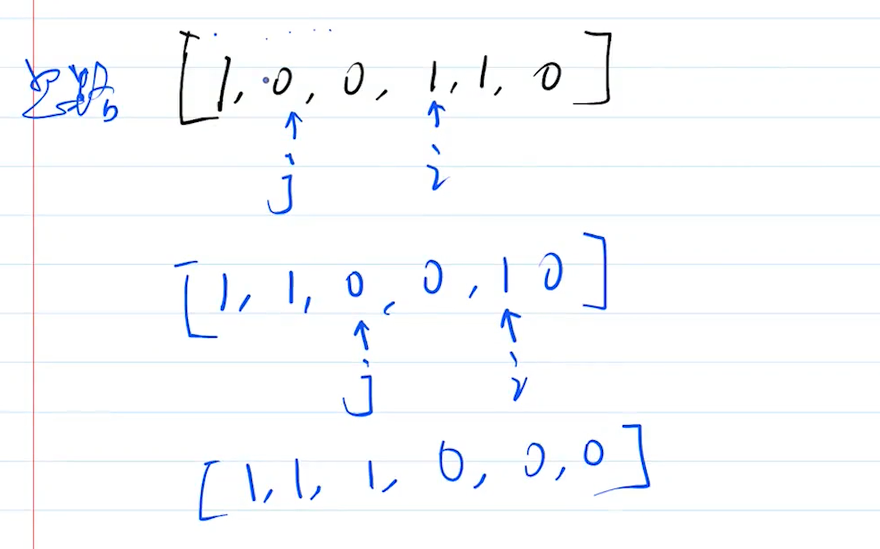

# 移动 0

## 题目

定义一个函数，将数组种所有的 `0` 都移动到末尾，例如输入 `[1, 0, 3, 0, 11, 0]` 输出 `[1, 3, 11, 0, 0, 0]`。要求：
- 只移动 `0` ，其他数字顺序不变
- 考虑时间复杂度
- 必须在原数组就行操作

## 如果不限制“必须在原数组修改”

- 定义 `part1` `part2` 两个空数组
- 遍历数组，非 `0` push 到 `part1` ，`0` push 到 `part2`
- 返回 `part1.concat(part2)`

时间复杂度 `O(n)` 空间复杂度 `O(n)` ，

所以，遇到类似问题，要提前问面试官：**是否能在原数组基础上修改？**

## 传统方式

思路
- 遍历数组
- 遇到 `0` 则 push 到数组末尾
- 然后用 splice 截取掉当前元素

分析性能
- 空间复杂度没有问题 `O(1)`
- 时间复杂度
    - 看似是 `O(n)`
    - 但实际上 `splice` 和 `unshift` 一样，修改数组结构，时间复杂度是 `O(n)`
    - 总体看来时间复杂度是 `O(n^2)`，不可用


## 双指针

思路（可画图解释，参考视频讲解）双指针的指向是重点！！！
- **指针1 指向第一个 0 ，指针2 指向第一个非 0**
- **把指针1 和 指针2 进行交换**
- 指针向后移

性能分析
- 时间复杂度 `O(n)`
- 空间复杂度 `O(1)`




## 答案

使用双指针，保证时间复杂度。参考 move-zero.ts

```js
function moveZero(arr) {
    let length = arr.length
    if (!length) return arr

    let i // 指向j指向的0后面第一个非零的数
    let j = -1 // 指向第一个0

    for (let i = 0; i < length; i++) {
        
        // 当第一个0出现时
        if (arr[i] == 0 && j == -1) j = i

        // 当i指向j指向的0后面第一个非零的数时
        if (arr[i] !=0 && j != -1) {

            // 将两个数进行交换
            let con = arr[i]
            arr[i] = arr[j]
            arr[j] = con

            // 交换之后j前面一定是0！！所以j++
            j++
        }
        
    }
}

const arr = [1, 0, 3, 4, 0, 0, 11, 0]
moveZero(arr)
console.log(arr)

```


## 划重点

- 咨询面试官，确认是否必须要修改原数据？
- 数组是有序结构，不能随意 `splice` `unshift`
- 双指针的思路
