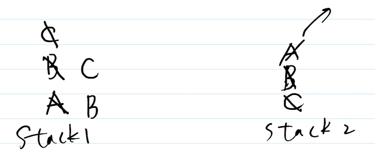

# 用两个栈实现一个队列

## 题目

请用两个栈，来实现队列的功能，实现功能 `add` `delete` `length` 。

## 队列 Queue

栈，先进后出

队列，先进先出，API 包括
- add
- delete
- length

常见的“消息队列”就是队列的一种应用场景
- A 系统向 B 系统持续发送海量的消息
- A 系统先把一条一条消息放在一个 queue
- B 系统再从 queue 中逐条消费（按顺序，先进先出）


**我们一般不用数组的 `pop`、`shift` 来实现队列，因为时间复杂度很高 O(n*2)**


## 逻辑结构和物理结构

队列和栈一样，是一种逻辑结构。它可以用数组、链表等实现。<br>
思考：用数组实现队列，性能会怎样 —— add 怎样？delete 怎样？

复杂场景下（如海量数据，内存不够用）需要单独设计。


## 题目分析

可画图分析：参考视频讲解

- 队列 add
    - 往 stack1 push 元素
- 队列 delete（返回队列顶部元素）
    - 将 stack1 所有元素 pop 出来，push 到 stack2
    - 将 stack2 执行一次 pop
    - 再将 stack2 所有元素 pop 出来，push 进 stack1
<div align=left>

</div>


## 答案

参考 two-stacks-one-queue.ts

```js
/**
 * @description 用两个栈实现一个队列
 * @description 封装一个队列 class
 */

class Queue {

    constructor() {
        this.stack1 = []
        this.stack2 = []
    }

    add(n) {
        this.stack1.push(n)     
    }

    delete() {
        // 第一步：将 stack1 所有元素移动到 stack2 中
        while (this.stack1.length) this.stack2.push(this.stack1.pop())

        // 第二步：stack2 移出栈顶元素
        let res = this.stack2.pop()

        // 第三步：将 stack2 所有元素还给 stack1
        while (this.stack2.length) this.stack1.push(this.stack2.pop())

        return res ? res : null
    }

    get length() {
        return this.stack1.length
    }
}

let q = new Queue()
q.add(100)
q.add(200)
q.add(300)
console.info(q.length)
console.info(q.delete())
console.info(q.length)
console.info(q.delete())
console.info(q.length)
console.info(q.delete())
console.info(q.length)
```


## 划重点

- 队列
- 画图，帮助梳理解题思路
