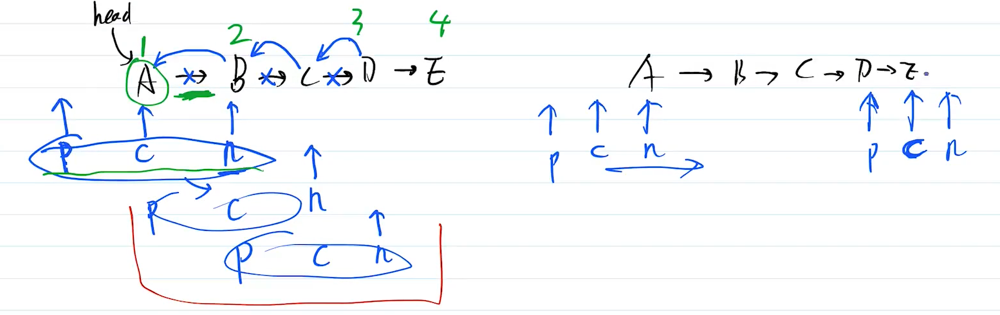
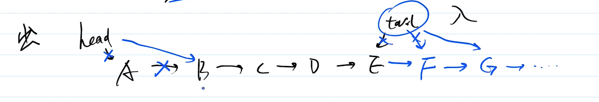

# 反转单向链表

## 题目

定义一个函数，输入一个单向链表的头节点，反转该链表，并输出反转之后的头节点


## 链表 linkList

链表是一种物理结构（非逻辑结构），是数组的补充。<br>
数组需要一段连续的内存空间，而链表不需要。**链表是一种零散结构**

数据结构
- 单向链表 `{ value, next }`
- 双向链表 `{ value, prev, next }`

两者对比
- 链表：查询慢，**新增和删除较快**
- 数组：查询快，新增和删除较慢


linkList：链表

curNode：链表头节点

> 链表等于链表头节点


**根据数组来创建链表**（从数组末尾往前逐渐生成）

```js
/**
 * @description 根据数组创建单向链表
 * @param arr
 */


// 返回链表(链表头节点)
function createLinkList(arr) {
    const length = arr.length

    if (length === 0) throw new Error('arr is empty')

    // 定义一个链表（也是头节点）
    let curNode = {
        value: arr[length - 1]
    }

    if (length === 1) return curNode

    for (let i = length - 2; i >= 0; i--) {
        curNode = {
            value: arr[i],
            next: curNode
        }
    }

    return curNode
}

const arr = [100, 200, 300, 400, 500]
const linkList = createLinkList(arr)
console.info(linkList)
```


## 分析

反转链表，画图很好理解。没有捷径，遍历一边，重新设置 next 指向即可。<br>
但实际写代码，却并不简单，很容易造成 nextNode 丢失。

因此，遍历过程中，至少要存储 3 个指针 `prevNode` `curNode` `nextNode`

时间复杂度 `O(n)`



> `prevNode` `curNode` `nextNode` 都是指针！指向谁就等于谁！！
>
> 右边的图表示三个节点的初始状态和结束状态


## 答案

参考 reverse-link-list.ts

```js
// 翻转链表
function reverseLinkList(linkList) {

    // 定义三个指针
    let prevNode = undefined
    let curNode = undefined
    let nextNode = linkList

    // 循环：直到 nextNode 指向空
    while (nextNode) {

        // 判断一：当 curNode 指向链表头节点时
        if (!prevNode && curNode) {
            
            // 删除链表头节点指向
            delete curNode.next
        }

        // 判断二：当三个指针都有指向时
        if (prevNode && curNode) {

            // 反转当前节点指向
            curNode.next = prevNode
        }

        // 三个节点向右移动
        prevNode = curNode
        curNode = nextNode
        nextNode = nextNode.next
    }

    // 结束状态：prevNode、curNode 指向最后两个节点 nextNode 指向空
    // 将最后一个节点反转指向
    curNode.next = prevNode

    // 返回链表头节点
    return curNode
}
```


## 划重点

- 链表
- 链表和数组的不同
    - 内存占用
    - 查询、新增、删除的效率
- 如何保证 nextNode 不丢失

## 扩展

思考：用数组和链表实现队列，哪个性能更好？

- 空间复杂度都是O(n)
- add 时间复杂度：链表 O(1)  数组 O(1)
- delete 时间复杂度：链表 O(1)  数组 O(n)


# 链表实现队列

我们创建两个指针，`head` 指向链表头节点，`tail` 指向链表尾节点


我们定义一个队列，用链表实现：队列从链表尾部插入数据，从链表头部删除数据




```js
class Queue {

    constructor() {
        this.head = null // 链表头节点指针
        this.tail = null // 链表尾节点指针
        this.length = 0 // 链表长度
    }

    // 从链表尾部插入队列
    add(n) {
        let newNode = {
            value: n,
            next: null
        }

        // 当链表为空时
        if (this.head == null) {

            this.head = newNode
        } 

        // 正常处理为尾部
        let tailNode = this.tail // 读取链表尾节点
        if (tailNode) tailNode.next = newNode
        this.tail = newNode

        this.length++
    }

    // 从链表头部移出队列
    delete() {
        if (!this.length || !this.head) return null

        let headNode = this.head
        this.head = headNode.next

        this.length--
        return headNode.value
    }

}

let q = new Queue()
q.add(100)
q.add(200)
q.add(300)
console.info(q.length)
console.info(q.delete())
console.info(q.length)
console.info(q.delete())
console.info(q.length)
console.info(q.delete())
console.info(q.length)
```
