## CSS 哪些属性可以被继承

字体

- font
- font-family
- font-size
- font-style
- font-variant
- font-weight
- color

文字展示

- letter-spacing
- visibility
- line-height
- text-align
- text-indent
- text-transform
- word-spacing


## px/em/rem/vw 如何区分

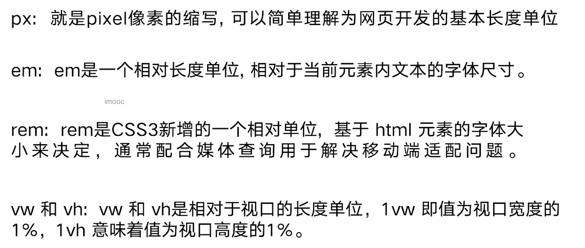


## CSS 实现左定宽右边自适应


```html
  <div class="box-wrapper">
    <div class="left-box">
      left-box 
    </div>
    <div class="right-box">
      right-box
    </div>
  </div>

```


- flex：通过 `flex: 1` 来占据父盒子剩余的大小

```css
.box-wrapper {
  width: 600px;
  height: 400px;
  border:1px solid #000;
  /* flex布局 */
  display: flex;
}   

.left-box {
  width: 200px;
  height: 100%;
  background: red;
}

.right-box {
  background: blue;
  flex: 1;
}
```


- grid：`grid-template-columns`：在父盒子中定义子盒子列宽

```css
.box-wrapper {
  width: 600px;
  height: 400px;
  border:1px solid #000;
  display: grid;
  /* 声明列的宽度 */
  grid-template-columns: 200px auto;
}

.left-box {
  background: red;
}

.right-box {
  background: blue;
}
```


## CSS 如何实现绝对居中

- (定宽高) 绝对定位 + margin auto

```css
.box {
  width: 100px;
  height: 100px;
  background: blue;
  /* 关键因素 */
  position: absolute;
  top: 0;
  left: 0;
  margin: auto;
}
```


- (不定宽高) 绝对定位 + transform

```css
.box {
  background: yellow;
  /* 关键因素 */
  position: absolute;
  left: 50%;
  top: 50%;
  transform: translate(-50%, -50%);
}
```


- (不定宽高) flex布局

```css
.box-wrapper {
  width: 300px;
  height: 300px;
  border: 1px solid red;
  /* 关键因素 */
  display: flex;
  justify-content: center;
  align-items: center;
}

.box {
  background: blue;
}
```


- (不定宽高) grid布局

```css
.box-wrapper {
  width: 300px;
  height: 300px;
  border: 1px solid red;
  /* 关键因素 */
  display: grid;
  place-items: center;
}

.box {
  background: blue;
}
```


## 清除浮动的方法以及为什么

为什么要清除浮动？

容器不设高度且子元素浮动时，容器高度不能被内容撑开。 此时，内容会溢出到容器外面而影响布局。这种现象被称为浮动（溢出）。

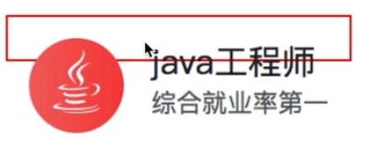


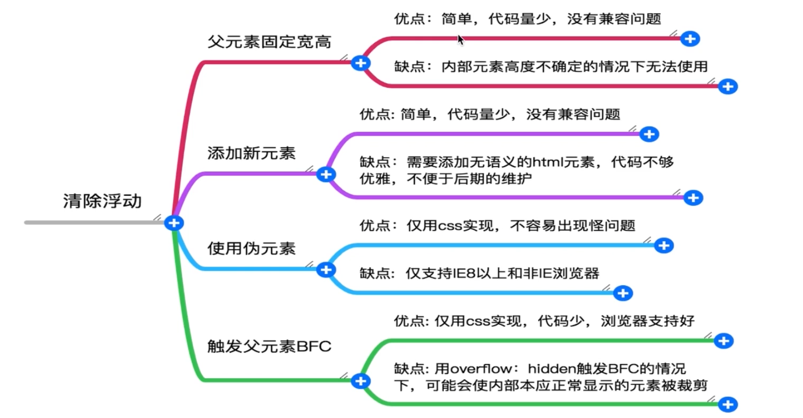

```html
<div class="box-container">
    
    <div class="right-box">
        <div class="right-box-title">java工程师</div>
        <div class="right-box-content">综合就业率第一</div>
    </div>
</div>
```


- 父元素固定宽高

```css
.box-container {
  width: 142px;

  /* 固定宽高 */
  height: 45px;
  padding: 10px;
  border: 1px solid red;
}

img {
  width: 45px;
  height: 105px;
  float: left;
  margin-right: 10px;
}

.right-box{
  float: right;
}
```


- 添加新元素

```html
<div class="box-container">
    
    <div class="right-box">
      <div class="right-box-title">java工程师</div>
      <div class="right-box-content">综合就业率第一</div>
    </div>

    <!-- 添加一个空元素，利用css提供的clear:both清除浮动 -->
    <div class="clear-element"></div>
</div>
```

```css
.box-container {
  width: 142px;
  padding: 10px;
  border: 1px solid red;
}
img {
  width: 45px;
  height: 45px;
  float: left;
  margin-right: 10px;
}
.right-box{
  float: right;
}

/* 添加新元素  */
.clear-element{
  clear: both;
}
```


- 使用伪元素

```css
/* 对父元素添加伪元素 */
.box-container::after{
  content: "";
  display: block;
  height: 0;
  clear:both;
}
```


- 触发父元素BFC

什么是BFC？https://blog.csdn.net/weixin_43974265/article/details/115416184 

```css
.box-container {
  width: 142px;
  border: 1px solid red;
  padding: 10px;
  overflow: hidden;
  /* float: left; */
  /* position: absolute; */
  /* display: inline-block */
  /* 以上属性均可触发BFC */
}
```


## 如何用CSS画一个三角形/箭头

画一个指向右边的三角形，然后指向上面就用 bottom

```css
.triangle {
  border: 10px solid transparent;
  border-left: 10px solid #f40;
}
```


画一个指向右边的箭头

https://blog.csdn.net/Allen_6/article/details/107497639

```css
.arrow-right{
  height: 120px;
  width: 60px;
  display :inline-block;
  position: relative;
}

.arrow-right::after {
  content: "";
  height: 60px;
  width: 60px;
  top: 12px;
  border-width: 8px 8px 0 0;
  border-color: blue;
  border-style: solid;
  transform: matrix(0.71, 0.71, -0.71, 0.71, 0, 0);
  position: absolute;
}
```

> 实现向左箭头只需修改旋转角度即可 `transform: matrix(-0.71, -0.71, 0.71, -0.71, 0, 0)`


## CSS 提高页面性能的方式有哪些

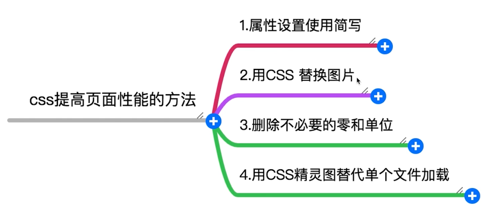

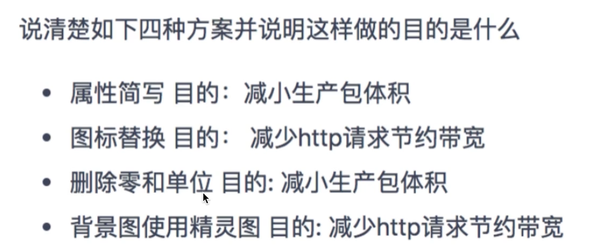


## 你对盒子模型理解多少

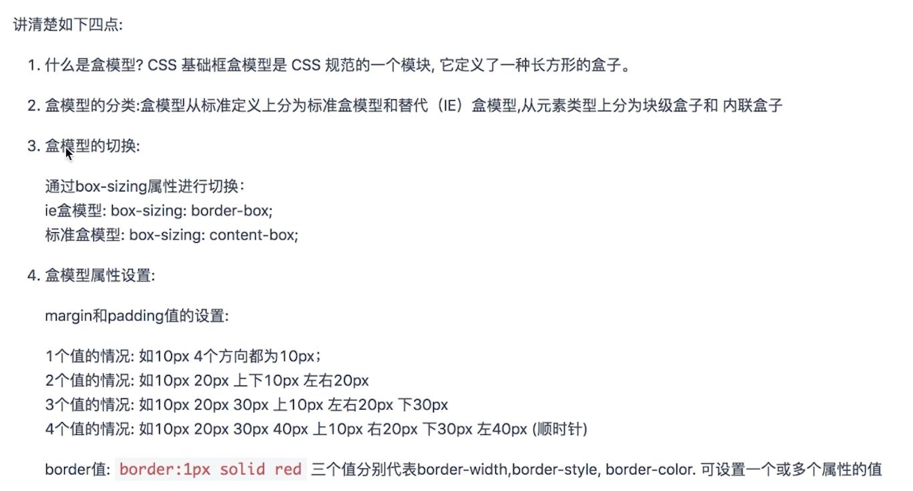


## 谈谈你对 BFC 的理解

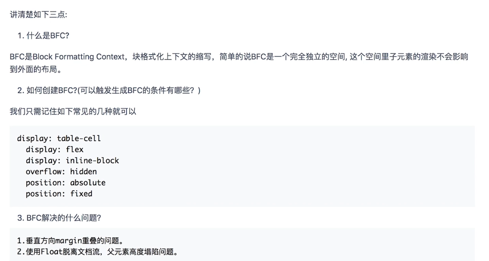


## 谈谈你对 CSS 选择器的理解

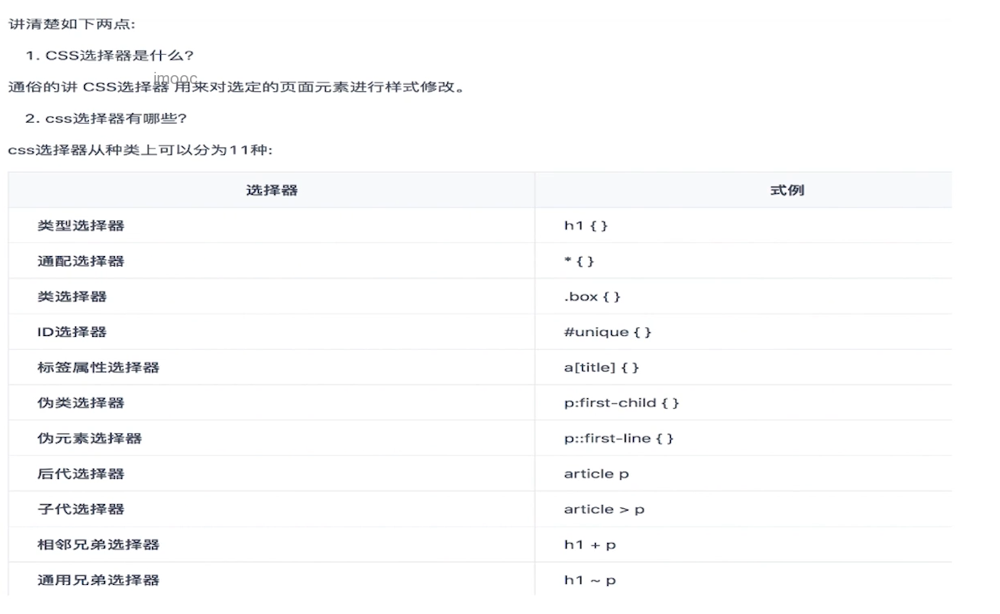

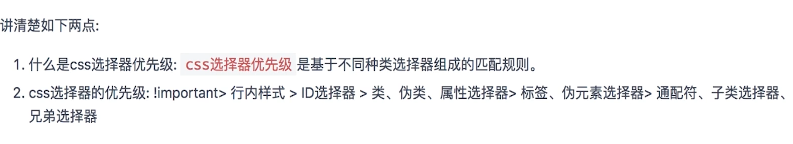

 	

## CSS 实现三栏布局有哪些方法

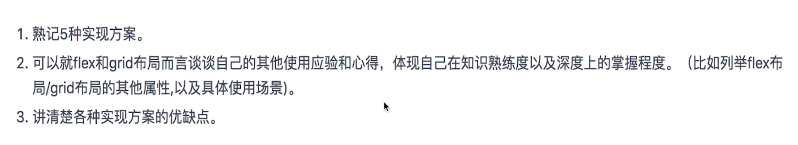

即左右固定中间自适应

```css
.left {
  float: left;
  width: 100px;
  background: red;
}

.center {
  background: green;
}

.right {
  float: right;
  width: 100px;
  background: blue;
}

.center {
  flex: 1;
  grid-template-columns: 100px 1fr 100px;
}
```


## call、apply、bind的区别及使用

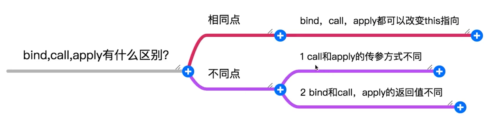

```js
const Tencent ={
  name: "freemen",
  company: "Tencent",
  time:"2021-11-31",
  address:"BeiJing",
  say(company){
    console.log(`my name is `, this.name);
    console.log(`my company is `, company);
  }
}

const Alibaba = {
  name:"vinko",
  time:"2021-11-31",
  address: "BeiJing",
  say(company){
    console.log(`my name is `, this.name);
    console.log(`my company is `, company);
  }
}
```

> 参数为：this 指向 + 函数传参


- call

```js
Tencent.say.call(Alibaba,'Alibaba');
```

- apply

```js
Tencent.say.apply(Alibaba, ['Alibaba'])
```

- bind

```js
function origin(a, b) {
    console.log(this.name);
    console.log([a, b]);
}

const obj = {
    name: "freemen"
}

// 定义时传参
const func = origin.bind(obj,2);

// 调用时传参，会合并定义时传参传的参数
func(1)
```


三个函数的使用场景

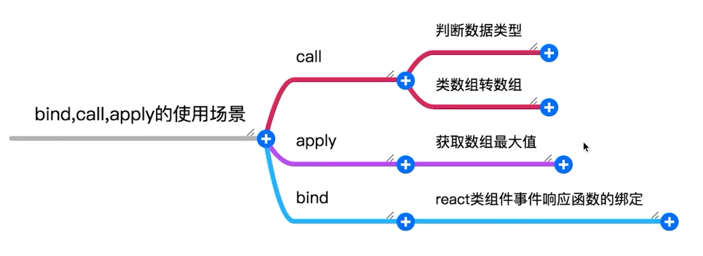

- call

```js
// * 判断数据类型

const array = [1,2,3,4];

const type = Object.prototype.toString.call(array);

console.log(`type`, type)
```

```js
// * 类数组转数组
const arrayLike = { 
  0: "name",
  1: "age",
  2: "gender",
  length: 3
}

const res =  Array.prototype.slice.call(arrayLike);
console.log(`res`, res)
// ["name","age","gender"]
```

- apply

```js
// apply  对给定数组求最大值/最小值

const array = [1,2,3,4,5];

const max = Math.max.apply(null,array)
const min = Math.min.apply(null,array)
Math.max(1,2,3,4,5)
console.log(`max`, max)
console.log(`min`, min)
```

- bind

```js
class App extends React.Component {
  constructor(props) {
    super(props);  
    this.name = 'freemen'
    this.handleClick = this.handleClick.bind(this)
  }
  handleClick(){
    console.log(`this.name`, this.name)
  }
  render(){
    return (
      <button onClick={this.handleClick}>
        点击
      </button>
    )
  }
}
```


## 数组的常用方法及拓展

在 JS 笔记中的数组那一章记录了，这里主要记录数组方法的拓展


- Array.from()方法就是将一个类数组对象或者可遍历对象转换成一个真正的数组，也是 ES6 的新增方法

https://blog.csdn.net/qq_27674439/article/details/108793223


- `...args` 剩余参数：将所有传入的参数都归于 `args` 数组中

```js
function fn(...args) {
    console.log(args);
}

fn(1,2,3) // [ 1, 2, 3 ]
```


- `arguments`：函数内部的参数类数组

```js
function fn(a,b,c) {
    console.log(arguments)
}

fn(1,2,3,4,5)

// [Arguments] { '0': 1, '1': 2, '2': 3, '3': 4, '4': 5 }
```


- **类数组转换为数组**

```js
// 类数组
const arguments = {
    '0': 123,
    '1': 'cocoon'
}
```

```js
// 将整个类数组转化
[].slice.call(arguments)

// 等效于
Array.prototype.slice.call(arguments)


// 将类数组某个区间转化（就是slice截取的使用）
[].slice.call(arguments, a, b)
```

```js
let arr = Array.from(argument)

let arr = [...argume]
```


- **获取并删除数组的第一个参数**

shift：删除数组的第一个元素

unshift：插入数组第一个元素

```js
let first = [].shift.call( array )

// 等效于
let first = Array.prototype.shift.call( array )
```


- **`array.some()` 的使用方法**

https://blog.csdn.net/qq_36695156/article/details/96840381

some() 方法会依次执行数组的每个元素：

- 如果有一个元素满足条件，则表达式返回*true* , 剩余的元素不会再执行检测。
- 如果没有满足条件的元素，则返回false。

```js
var arr = [3,6,9,12];
 
if(arr.some(function checknumber(number){return number == 12;})) {
    console.log(true)
}

// 简写：arr.some(item => item == 12)
 
//因为arr数组中有12的值，所以代码块会执行，而函数checknumber中传的参数number是从数组arr中读取
```


- **`array.reduce()` 使用方法**


https://blog.csdn.net/qq_38970408/article/details/121018660

```js
let array = [1,2,3,4,5]

// reduce 未给初始值，那prev初始值为数组第一项，后面prev都为前一个回调函数的返回值
const res = array.reduce(function(prev,current,currentIndex,sourceArray){
  console.log(prev, current, currentIndex, sourceArray);
  
  return prev+current;
})

log(res) // 15


// reduce 给了初始值，那prev初始值为5，后面prev都为前一个回调函数的返回值
const res = array.reduce(function(prev,current,currentIndex,sourceArray){
  console.log(prev, current, currentIndex, sourceArray);
  
  return prev+current;
}, 5)
```


- **concat 使用方法**

https://blog.csdn.net/qq_42356513/article/details/122907588

```js
// concat 直接将多个数组、多个数字拼接成一个数组！
let a= [].concat(1,2,3,[4,5],[6,7])

console.log(a); // [1,2,3,4,5,6,7]
```


- **判读数据类型**

```js
// 可判读所有数据类型
// 不过会加上前缀：[object type]
const type = Object.prototype.toString.call(array);
```


## 数组去重、对象数组去重的方法

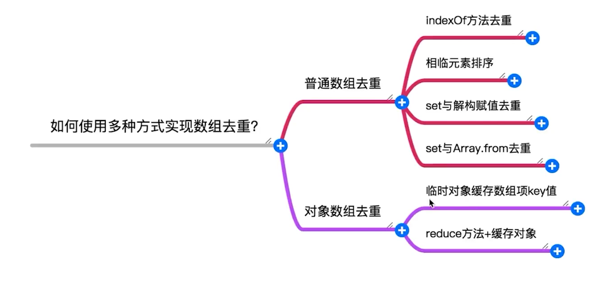

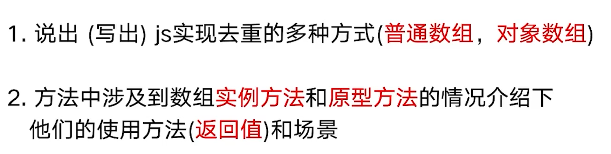

```js
// 数组的原型方法有
const array = [1,2,3,4,5];

// 查找元素并返回下标
const res = array.indexOf(2);


// 对数组进行排序（从大到小）并返回新数组
const res = array.sort((a,b)=>{
  return b-a
})


// reduce 未给初始值，那prev初始值为数组第一项，后面prev都为前一个回调函数的返回值
const res = array.reduce(function(prev,current,currentIndex,sourceArray){
  console.log(prev, current, currentIndex, sourceArray);
  
  return prev+current;
})


// 在数组末项进行插入
array.push(1)
```


- 数组去重方法一

```js
function handleError(array) {
    if (!Array.isArray(array)) {
        throw new Error("unique function params is not Array")
    }
}

const array = [1, 2, 3, 4, 5, 2, 3];

function unique(array) {
    hanlleError(array)
    
    // 如果两个下标不一致，说明这个数之前出现过
    return array.filter((item, index) => {
        return array.indexOf(item) === index
    })
}
```


- 数组去重方式二

```js
// 相邻元素排序（改变了原数组顺序）
function unique(array) {
    handleError(array)

    array = array.sort()
    let res = []

    for (let i = 0; i < array.length; i++) {
        if (array[i] !== array[i - 1]) {
            res.push(array[i])
        }
    }
    return res
}
```


- 数组去重方式三

`new Set(array)`：Set 是一种新集合类型，内部元素独一无二

`Array.from`：将类数组转化为数组

```js
// 3. Set 解构赋值

function unique(array){
  handleError(array)

  return [...new Set(array)]
}

function unique(array) {
  handleError(array)

  return Array.from(new Set(array))
}
```


- 对象数组去重方式一

```js
const array = [{name:"freemen",age:"20"},{name:"mukwang",age:"20"}]
```

> 针对 age 属性进行对象数组去重


```js
// 临时对象缓存数组项key值 

function unique(array, key) {
    handleError(array)

    let result = [] 
    let template = {} // 临时对象

    for (let i = 0; i < array.length; i++) {
        let keyName = array[i][key]
        
        if (template[keyName]) {
            continue
        }
        
        template[keyName] = true
        // template = {
        //     '20': true
        // }
     
        result.push(array[i])
    }
    
    return result
}
```


## 获取数组最大值有哪几种方法

```js
const res = Math.max.apply(null, array)


function getMax(array) {
    return array.reduce((prev, current) => {
        return current > prev ? current : prev
    })
}


function getMax(array) {
    const result = array.sort();
    return result[result.length - 1];
}
```


## JS 判断数据类型的方式有哪些

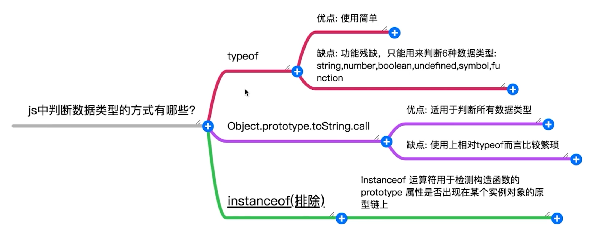

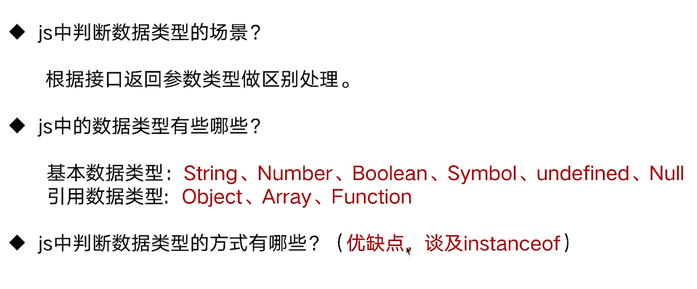

```js
const type = typeof array; // type object

const type = Object.prototype.toString.call(array);
```


## 如何实现一个节流函数

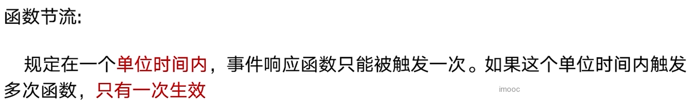


```js
// 1 返回值是一个函数，即对 函数fn进行节流
// 2 开启定时器
// 3 如果定时器存在直接返回 false
// 4 定时器内部清空定时器 并且把timmer 置为null 然后执行我们的事件响应函数

function throttle(fn, interval) {
    let timer;
    return (event) => {
        if (timer) {
            return false;
        }
        timer = setTimeout(() => {
            clearTimeout(timer);
            timer = null;
            fn(event)
        }, interval);
    }
}


window.onresize = throttle(function (event) {
    console.log(`event`, event)
}, 1000)
```


## 如何实现一个防抖函数

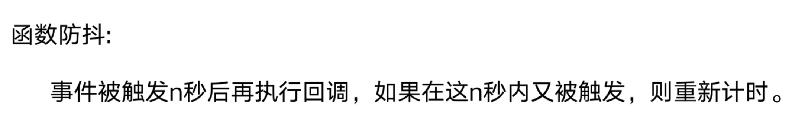

```html
<body>
    <input type="text" id="searchElement">

    <script>
        const searchElement = document.getElementById("searchElement");

        // 1.在最后一次事件触发调之后，再过initial秒才真正调用fn回调函数
        // 2.固定间隔执行·事件响应函数
        const debounce = (fn, initial) => {
            let timer = null;
            return () => {
                clearTimeout(timer)
                timer = setTimeout(fn, initial)
            }
        }

        searchElement.oninput = debounce(function (event) {
            const value = searchElement.value;
            console.log(`value`, value);
        }, 1000)

    </script>
</body>
```

> 使用场景：输入框输入的时候，等停止输入再发送输入请求


## 如何用多种方式实现数组拍平

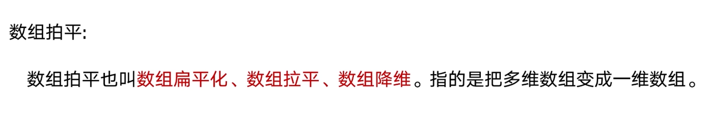

> 使用场景：用于复杂场景下的数据处理（echarts 做大数据展示）


- **reduce + 递归实现**

```js
// 初始值为一个空数组, 之后的prev都为该数组，最终返回这个结果数组
function flatten(array) {
    return array.reduce(function(prev, current) {

        // 递归获取展开数组或者单个数值
        let arr = Array.isArray(current) ? flatten(current) : current

        // 将arr拼接到结果数组中
        return prev.concat(arr)
    }, [])
}

const result = flatten(array);
console.log(`result`, result);
```


- **ES6 flat 函数，专门用来做数组扁平化处理**

使用方法：https://blog.csdn.net/weixin_43911758/article/details/120304962

```js
function flatten(array) {
    return array.flat(Infinity)
}
```


- **while + some**

```js
function flatten(array) {

    // 判断当前数组中是否还存在数组项
    while (array.some(item => Array.isArray(item))) {

        // 数组解构再合并数组，即去掉了一层数组
        array = [].concat(...array)
    }

    // 没有数组项了就返回
    return array;
}
```


## 如何实现一个  new 操作符

- **new 操作符的使用方法**

```js
// 创建一个构造函数（无返回值）
function Tmap(options) {
    this.name = options.name;
    this.address = options.address;
} 	

// 通过 new 操作符实例化一个对象
const map  = new Tmap({
    name: 'tmap',
    address:"BJ"
});

console.log('map :>> ', map); // Tmap { name: 'tmap', address: 'BJ' }
```

```js
// 创建一个构造函数（有返回值）
function Tmap(options) {
    this.name = options.name;
    this.address = options.address;

    return {
        name: 'map',
        address: 'sh'
    }
} 

// 通过 new 操作符实例化一个对象
const map  = new Tmap({
    name: 'tmap',
    address:"BJ"
});

console.log(map); // { name: 'map', address: 'sh' }
```

> new 的作用：实例化对象、构造函数中如果有返回值，那实例化后的对象就是这个返回值


- new 操作符通过手写 `ObjectFactory` 函数实现

`...args` 剩余参数：将所有传入的参数都归于 `args` 数组中

```js
const ObjectFactory = (...args) => {
    console.log(args);

    // 创建一个空的实例化对象
    const obj = {}

    // 获取第一个参数，定义为构造函数，并将 args 中的第一个参数删除
    const Constructor = [].shift.call(args)

    // 将实例化对象的隐私原型指向构造函数的原型
    obj.__proto__ = Constructor.prototype

    console.log(args);
    // 执行构造函数，将 this 指向 obj，并用 ret 接收返回值
    // args 此时为参数数组
    const ret = Constructor.apply(obj, args)

    // 如果 ret 为一个对象，说明构造函数有返回值，则返回 ret
    // 如果 ret 为空，说明构造函数没有返回值，则返回实例化对象 obj
    return typeof ret === 'object' ? ret : obj
}

const map = ObjectFactory(Tmap, { name: "MAP", address: "BJ" });

console.log('map :>> ', map);
```


## 如何实现一个 bind 函数

- bind 的使用

```js
function origin(a, b) {
    console.log(this.name);
    console.log([a, b]);
}

const obj = {
    name: "freemen"
}

// 定义时传参
const func = origin.bind(obj,2);

// 调用时传参，会合并定义时传参传的参数
func(1)
```


- bind 的实现

```js
Function.prototype.bindFn = function () {

    // arguments 为bindFn函数的参数类数组
    console.log(arguments)

    // 获取源函数（调用bindFn函数的函数）
    const fn = this

    // 获取目标对象（为第一个参数）
    const obj = arguments[0]

    // 获取源函数参数数组（将类数组转化为数组从下标为1开始）
    const args = [].slice.call(arguments, 1)

    console.log(args)

    // 返回一个函数
    return function () {

        // 获取返回函数的参数数组（arguments此时为返回函数的类数组）
        const returnArgs = [].slice.call(arguments)
        console.log(returnArgs)

        // 将定义时传参和调用时传参合并
        args.concat(returnArgs)

        // 执行源函数（改变指向，传入参数）
        fn.apply(obj, args)
    }
}

const func = origin.bindFn(obj, 1, 2, 3);
func(4,5)
```

```js
[Arguments] { '0': { name: 'freemen' }, '1': 1, '2': 2, '3': 3 }
[ 1, 2, 3 ]
[ 4, 5 ]
freemen
[ 1, 2 ]
```


## 如何实现 call/apply 函数

```js
// 数据
const obj = {
  name: "freemen"
}

function testFunc(a,b){
  console.log('a :>> ', a);
  console.log('b :>> ', b);
  console.log('this.name :>> ', this.name);
}

// testFunc.call(obj,'a','b')

// testFunc.apply(obj,['a','b'])
```


- call

```js
Function.prototype.callFn = function(obj, ...args) {
    // 判断传参是否为空 args为剩余参数数组
    args = args || []

    // 将源函数（调用callFn函数的函数）绑定到obj属性中
    const key = Symbol()
    obj[key] = this

    // 调用源函数，获取返回结果，将剩余参数数组解构
    const result = obj[key](...args)

    // 删除属性
    delete obj[key]

    // 返回最终结果
    return result
}

testFunc.callFn(obj,'a','b');

a :>>  a
b :>>  b
this.name :>>  freemen
```


- apply

```js
Function.prototype.applyFn = function (obj, args) {
    // 判断传参数组是否为空
    args = args || []

    // 将源函数（调用callFn函数的函数）绑定到obj属性中
    const key = Symbol()
    obj[key] = this

    // 调用源函数，获取返回结果，将参数数组解构
    const result = obj[key](...args)

    // 删除属性
    delete obj[key]

    // 返回最终结果
    return result
}

testFunc.applyFn(obj,['a','b']);
```

> ...args 改为 args即可


## 如何实现 instanceof 运算符

`instanceof` 运算符用于检测构造函数的 `prototype` 属性是否出现在某个实例对象的原型链上

- 使用方法

```js
function Persion(){
  this.name = "freemen"
}

const obj = new Persion

console.log(obj instanceof Persion)
```


- 实现方法

```js
function instanceOf(obj, Constructor) {
    // 获取实例对象的隐式原型
    let op = obj.__proto__

    // 获取构造函数的prototype属性
    let cp = Constructor.prototype

    while (true) {
        if (op == null) {
            return false
        } else if (op == cp) {
            return true
        }

        // 在原型链上不断查找 构造函数的显式原型
        op = op.__proto__
    }
}

console.log(instanceOf(obj, Persion))
```


## 如何实现一个类型判断函数

```ts
function getType(x: any): string {
    const originType = Object.prototype.toString.call(x) // '[object String]'
    
    const spaceIndex = originType.indexOf(' ')
    const type = originType.slice(spaceIndex + 1, -1) // 'String'
    
    return type.toLowerCase() // 'string'
}
```


## 如何深度和广度遍历DOM树

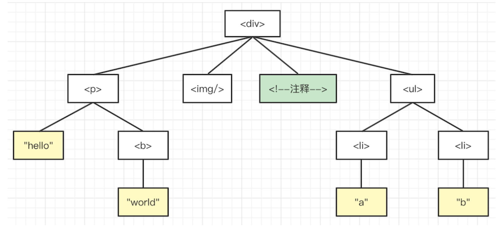

深度优先的结果 `<div> <p> "hello" <b> "world"  注释 <ul> <li> "a" <li> "b"`

广度优先的结果 `<div> <p>  注释 <ul> "hello" <b> <li> <li> "world" "a" "b"`


- 深度遍历

```ts
// 访问节点
function visitNode(n: Node) {
    if (n instanceof Comment) {
        // 注释
        console.info('Comment node ---', n.textContent)
    }
    if (n instanceof Text) {
        // 文本
        const t = n.textContent?.trim()
        if (t) {
            console.info('Text node ---', t)
        }
    }
    if (n instanceof HTMLElement) {
        // element
        console.info('Element node ---', `<${n.tagName.toLowerCase()}>`)
    }
}

// 深度优先遍历
function depthFirstTraverse1(root: Node) {
    visitNode(root)

    const childNodes = root.childNodes // .childNodes 和 .children 不一样
    if (childNodes.length) {
        childNodes.forEach(child => {
            depthFirstTraverse1(child) // 递归
        })
    }
}	
```


- 广度优先遍历

```ts
function breadthFirstTraverse(root: Node) {
    const queue: Node[] = [] // 数组 vs 链表

    // 根节点入队列
    queue.unshift(root)

    while (queue.length > 0) {
        const curNode = queue.pop()
        if (curNode == null) break

        visitNode(curNode)

        // 子节点入队
        const childNodes = curNode.childNodes
        if (childNodes.length) {
            childNodes.forEach(child => queue.unshift(child))
        }
    }
}

const box = document.getElementById('box')
if (box == null) throw new Error('box is null')
depthFirstTraverse2(box)
```


## 你对原型和原型链的了解有多少

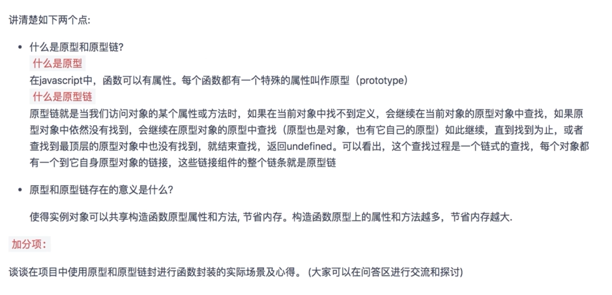

- prototype

每个构造函数（class 类）都有个特殊的对象属性叫原型（prototype），它的作用是使实例对象都有个共享属性

- `__proto__`

实例对象的一个属性，指向的是其构造函数的原型对象（prototype），使其可以使用这个共享对象

- 原型链

原型（prototype）也是一个对象，所以它也具有 `__proto__` ，指向的是 `Object.prototype`


## 你对闭包怎么理解

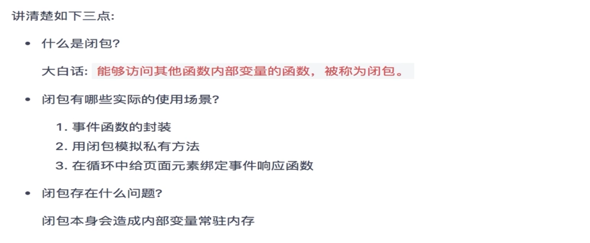


**简单理解闭包**

```js
function addCount(num) {
    let count = 0;
    
    return function(a) {
        count += 1;
        num += 1
        console.log(count, num, a);
    };
}

// 创建闭包函数
const fun1 = addCount(2);
const fun2 = addCount(2);

// 闭包函数各自独立
fun1(3) // 1 3 3
fun1(4) // 2 4 4

fun2(5) // 1 3 5
fun2(6) // 2 4 6
```

- 最外层的函数**传入的参数和内部定义的数据**都会被 闭包函数存储
- 闭包函数各自独立


- 两个闭包使用的例子

```js
function createCheckTemp(standardTemp) {
    
    function checkTemp(n) {
        if (n <= standardTemp) {
            alert('你的体温正常');
        } else {
            alert('你的体温偏高');
        }
    }
    
    return checkTemp;
}

// 创建一个 checkTemp 函数，它以 37.1 度为标准线
var checkTemp_A = createCheckTemp(37.1);

// 再创建一个 checkTemp 函数， 它以 37.3 度为标准线
var checkTemp_B = createCheckTemp(37.3);

// 闭包函数自身参数n = 37.2
checkTemp_A(37.2);	// "你的体温偏高"
checkTemp_A(37.0);	// "你的体温正常"

checkTemp_B(37.2);	// "你的体温正常"
checkTemp_B(37.6);	// "你的体温偏高"
```


```js
// 2秒后打印0-5
for (let index = 0; index < 5; index++) {
    
    (function(i) {

        setTimeout(function() {
            console.log(i);
        },2000)

    })(index)
    
}
```

> 利用立即执行函数使延时器的函数变成闭包函数


## 如何理解作用域和作用域链

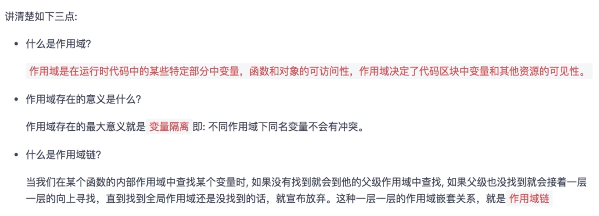


## let、const 和 var 的区别

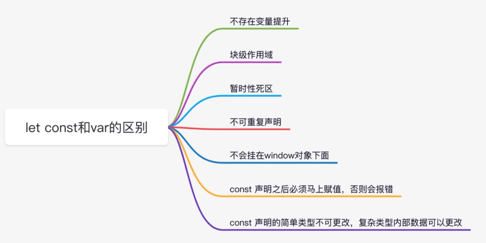


前面五个let、const都具备，var都不具备。暂时性死去是指在声明变量之前，不能给它赋值


## 普通函数和箭头函数的区别

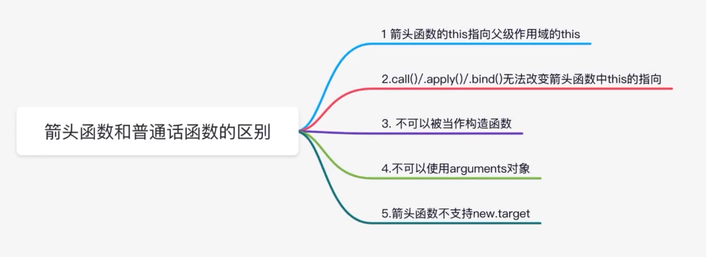

> new.target 为当前构造函数
>
>  class 也不可以使用 call apply bind 的方式来改变他的this指向


## ES6 对象新增方法有哪些

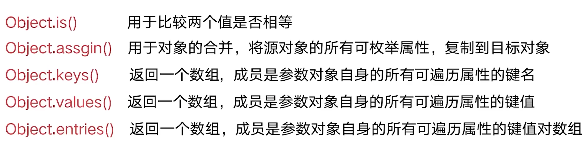

```js
const result = Object.is(numOne,numTwo);

// 1、不仅可以对值类型进行正常处理而且对象类型的值也可以进行判断
// 2、对于特殊的值 NaN 也可以进行正常的处理
```


```js
// 将第二个对象的属性添加到第一个对象中，结果为第一个对象
const result = Object.assign(obj,objTwo);
```


## forEach、for in、for of 三者的区别

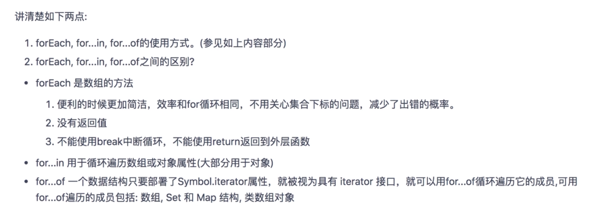

- forEach

```js
// 不改变原数组
// 没有返回值
array.forEach(function(value, index, array) {
})
```


- for in

```js
const object = {
    name:"freemen",
    age:18
}

for (const key in object) {
    console.log(key, object[key])
}
```


- for of

```js
for (const item of arr) {
    ...
}
```


## vue 的生命周期你了解多少


- 创建阶段：beforeCreate

```js
beforeCreate() {
    // 实例刚在内存中创建出来，还没有初始化 data和 methods
    console.log(`beforeCreate`)
    console.log(`this.fullName`, this.fullName)
    console.log(`this.handleClick`, this.handleClick)
},
```


- created

```js
created() {
    // 实例已经在内存中创建完成，此时data和methods已经创建完成
    console.log(`created`)
    console.log(`this.fullName`, this.fullName)
    console.log(`this.handleClick`, this.handleClick)
},
```


- beforeMount

```js
beforeMount() {
    // 此时已经完成了模版的编译，只是还没有渲染到界面中去
    console.log(`beforeMount`)
    console.log(`this.$refs`, this.$refs.container)
},
```


- mounted

```js
mounted() {
    // 模版已经渲染到了浏览器，创建阶段结束，即将进入运行阶段
    console.log(`mounted`)
    console.log(`this.$refs`, this.$refs.container)
},
```


- 运行阶段

```js
beforeUpdate() {
    // 数据更新时调用,这里适合在更新之前访问现有的DOM
    console.log(`beforeUpdate`);
    console.log(`this.fullName `, this.fullName)
},

    
updated() {
    // 页面重新渲染完毕，页面中的数据和data保持一致
    console.log(`updated`)
    console.log(`更新结束，页面数据已更新`)
},
```


- 销毁阶段

```js
// 销毁阶段
beforeDestroy() {
    // 实例销毁之前调用。在这一步，实例仍然完全可用。
    console.log(`beforeDestroy`)
},
    
    
destroyed() {
    // 实例销毁后调用。该钩子被调用后，对应 Vue 实例的所有指令都被解绑，所有的事件监听器被移除，所有的子实例也都被销毁。
    console.log(`destroyed`)
},
```


**一般在哪个生命周期发送请求**

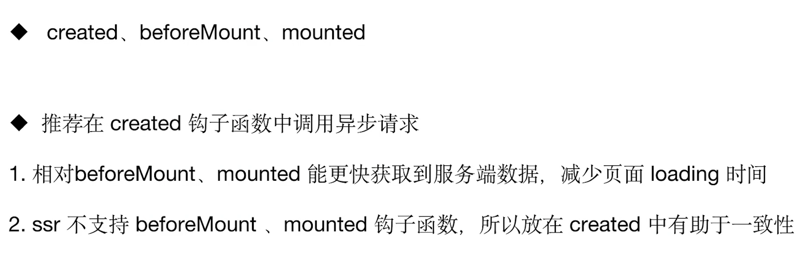


## vue父子组件生命周期调用顺序

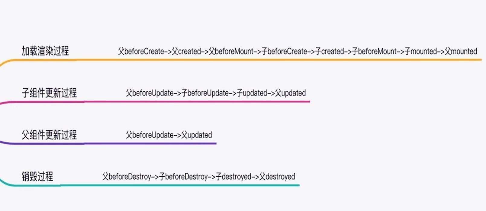


## 谈谈你对 keep-alive 组件的了解

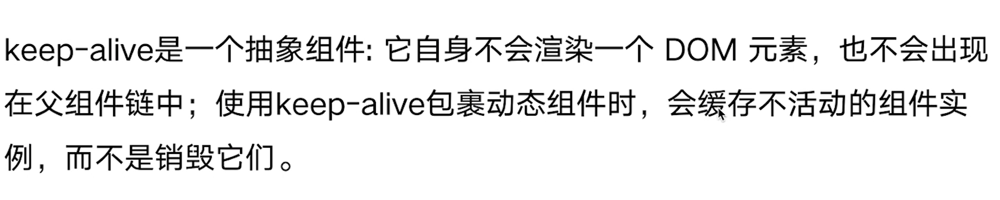

> 谈及定义以及使用场景即可


```vue
<keep-alive>
    <component :is="view"></component>
</keep-alive>
```

将子组件被切换时，依然会缓存之前的状态，数据什么的不会销毁


## v-if 和 v-show 的区别

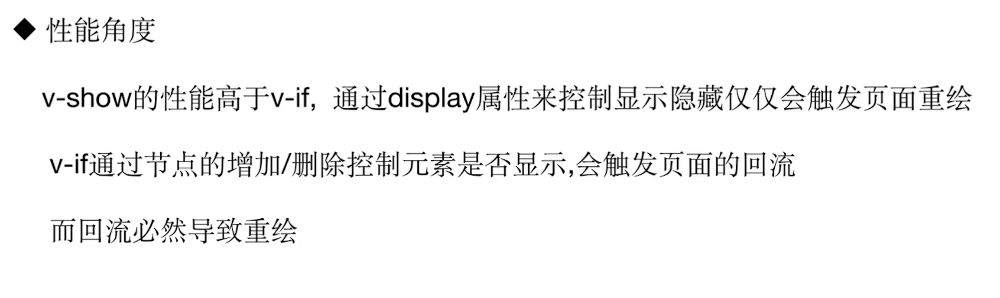

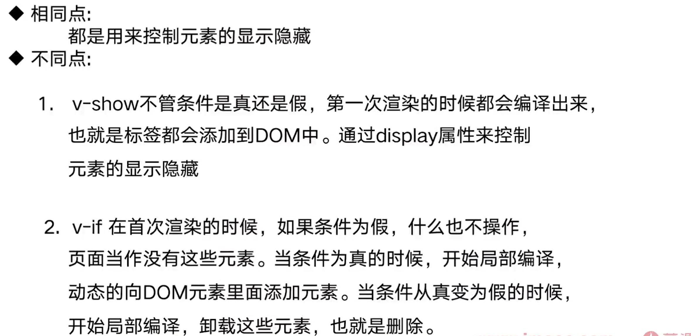


## http 请求相关的面试题

- 常见的状态码及其含义
<div align=left>
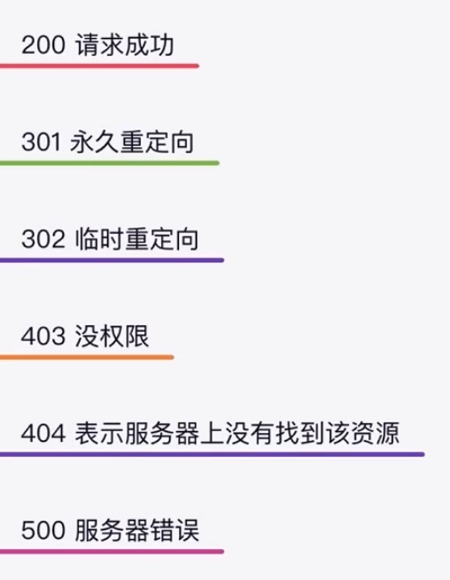
</div>


- 请求方式有哪些？Get 和 Post 的区别？

get、post、detele、put
<div align=left>
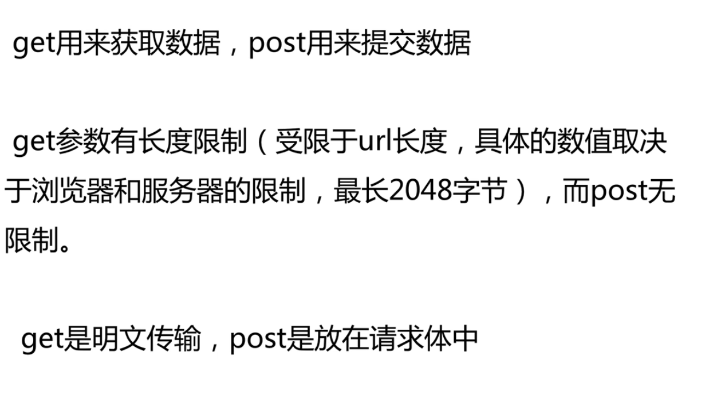
</div>


- http协议中header及含义？


## 浏览器事件传输机制

事件传输机制 冒泡 和 捕获 都是为了解决事件流（事件发生顺序）的问题

事件触发的三个阶段：捕获、目标、冒泡阶段


## 浏览器的渲染过程是怎样的

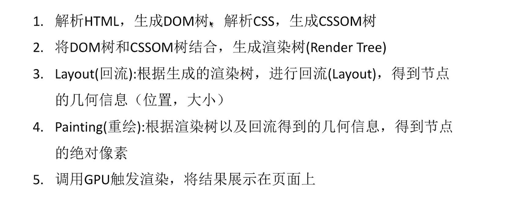

## 回流和重绘的概念
<div align=left>
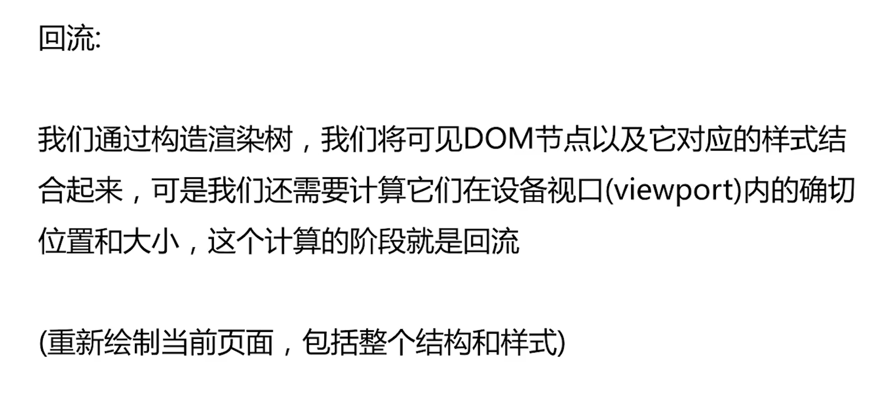
</div>

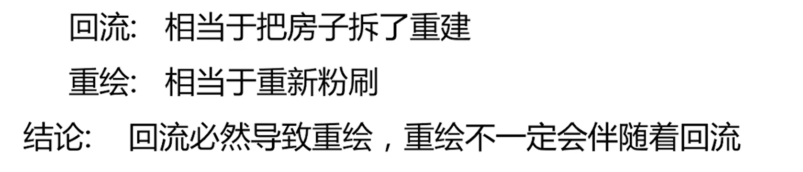

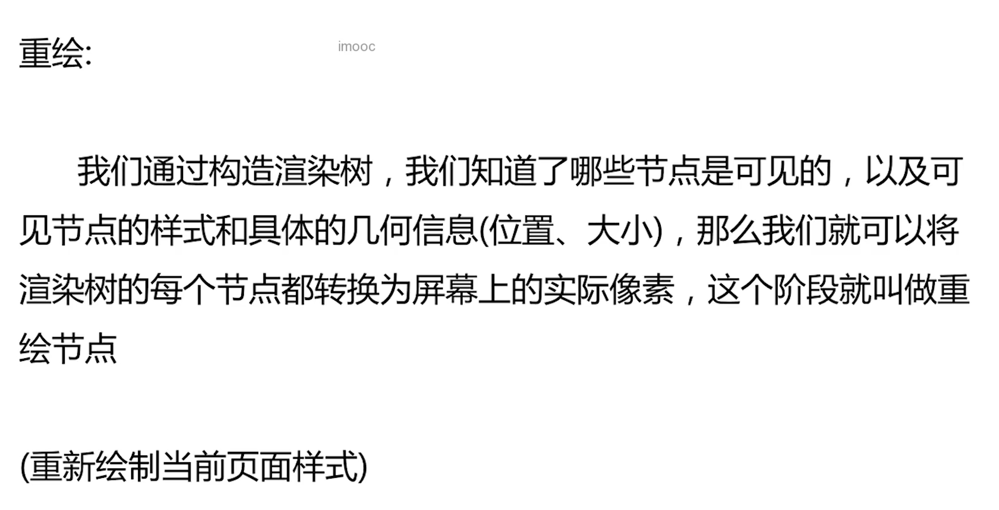

## 何时会触发回流与重绘，如何避免？

触发：

- 添加或删除可见的DOM元素
- 元素的内容、位置或尺寸发送变化
- 页面一开始渲染的时候
- 浏览器的窗口尺寸变化

如何避免
<div align=left>
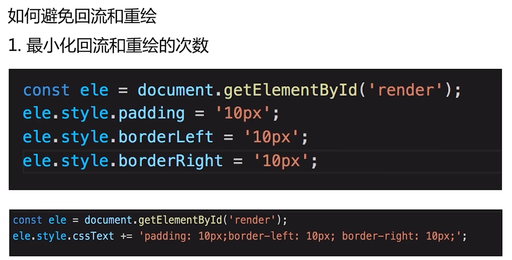
</div>
<div align=left>
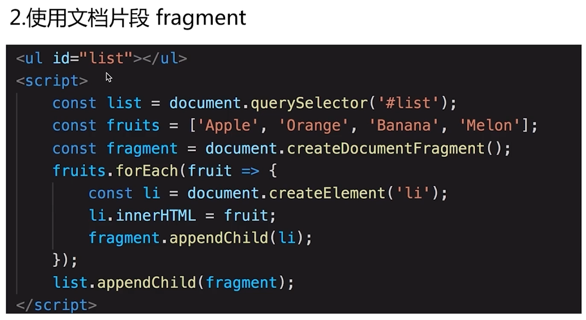
</div>
> 就是就将多个小 li 集成到一个 fragment 元素里，再插入父元素中，不要一个一个插入！


## 你对跨域了解多少

- 同源策略

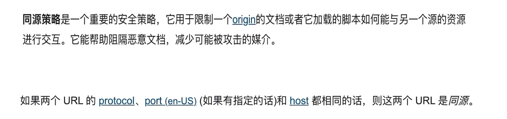

- 什么是跨域

如网址：https://www.imooc.com:433/course/list

- https（协议）
- www.imooc.com（域名）
- 443（端口号）
- /course/list（路径）

**只要 协议、域名、端口号 任何一个不一样，就是跨域！**


- jsonp

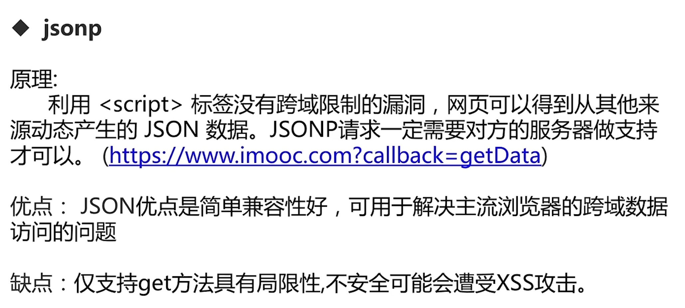

- cors

可以在 API 的后端代码，设置跨域资源共享。

当后端设置了 CORS 后，那么前端请求后端时，返回的响应头中会有 `Access-Control-Allow-Origin: *` 表示允许所有的域名来跨域请求它，* 是通配符，没有任何限制。

使用 CORS 跨域的过程：

1. 后端在响应头中添加 Access-Control-Allow-Origin 头信息

2. 浏览器发送跨域请求
3. 浏览器接收到响应
4. 如果是同域下的请求，浏览器不会额外做什么，相当于通信完成
5. 如果是不同域下的请求，浏览器就会从响应头中查找是否允许跨域访问
6. 如果允许跨域，通信完成
7. 如果没有找到就丢弃响应结果


- nginx 反向代理
<div align=left>
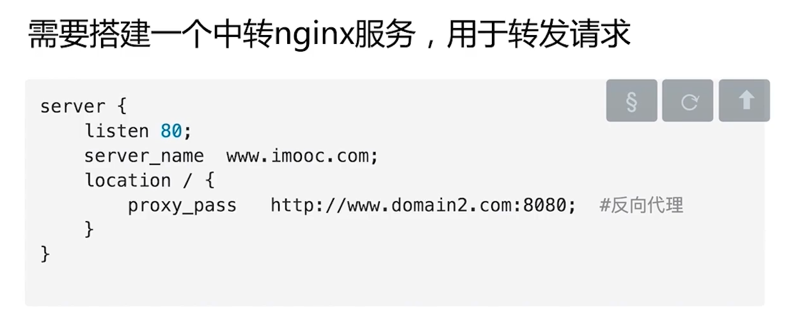
</div>


## 浏览器的主要组成部分是什么

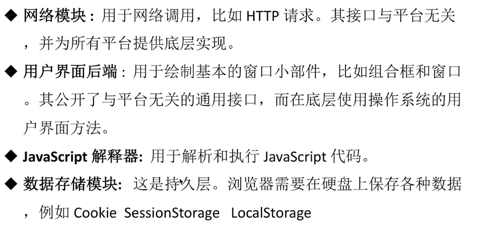