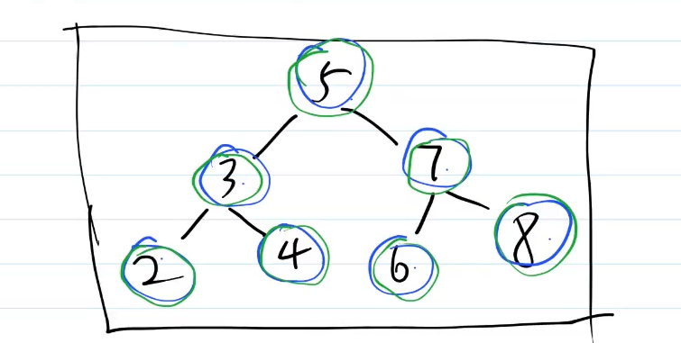

# 求二叉搜索树的第 K 小的值

## 题目

一个二叉搜索树，求其中的第 K 小的节点的值。
如下图，第 3 小的节点是 `4`


## 二叉树

树，大家应该都知道，如前端常见的 DOM 树、vdom 结构。

二叉树，顾名思义，就是每个节点最多能有两个子节点。

```ts
interface ITreeNode {
    value: number // 或其他类型
    left?: ITreeNode
    right?: ITreeNode
}
```


## 二叉树的遍历

- 前序遍历：root -> left -> right
- 中序遍历：left -> root -> right
- 后序遍历：left -> right -> root



前序遍历：5  324  768

后序遍历：243  687  5

> 就是先把上面的写好，留下空格补充下面的顺序

```js
// 全局数组
let orderArr = []


// 前序遍历
function prevOrderTraverse(node) {
    if (!node) return


    orderArr.push(node.value)
    prevOrderTraverse(node.left)
    prevOrderTraverse(node.right)
}

// 中序遍历
function inOrderTraverse(node) {
    if (!node) return

    inOrderTraverse(node.left)
    orderArr.push(node.value)
    inOrderTraverse(node.right)
}

// 后序遍历
function postOrderTraverse(node) {
    if (!node) return

    postOrderTraverse(node.left)
    postOrderTraverse(node.right)
    orderArr.push(node.value)
}
```


## 二叉搜索树 BST

- 左节点（包括其后代） 小于或等于 根节点大小
- 右节点（包括其后代） 大于或等于 根节点大小 

> 上图那个二叉树就是二叉搜索树


## 分析题目

一个二叉搜索树，求其中的第 K 小的节点的值。根据 BST 的特点，中序遍历的结果，正好是按照从小到大排序的结果。所以，中序遍历，求数组的 `arr[k]` 即可。


## 答案

代码 binary-search-tree-k-value.ts

```js
// 查找第k小的值
function getKthValue(node, k) {
    inOrderTraverse(node)

    return orderArr[k]
}


// 一个二叉搜索树
const bst = {
    value: 5,
    left: {
        value: 3,
        left: {
            value: 2,
            left: null,
            right: null
        },
        right: {
            value: 4,
            left: null,
            right: null,
        }
    },
    right: {
        value: 7,
        left: {
            value: 6,
            left: null,
            right: null
        },
        right: {
            value: 8,
            left: null,
            right: null
        }
    }
}

console.log(getKthValue(bst, 3))
```


## 划重点

- 二叉搜索树的特点
- 前序、中序、后序遍历
