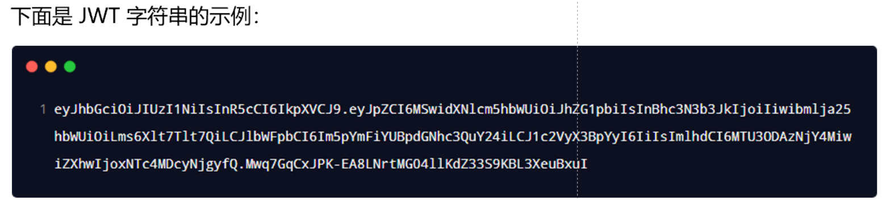

# 一、浏览器本地存储

## 1.1 Cookie

### 1.1.1 初始Cookie

Cookie 是什么？

Cookie 全称 HTTP Cookie，简称 Cookie，是浏览器存储数据的一种方式，因为存储在用户本地，而不是存储在服务器上，是本地存储。

同时，Cookie 一般会自动跟随着浏览器每次请求发送到服务器端。

Cookie 有什么用？

利用 Cookie 跟踪统计用户访问该网站的习惯，比如说以什么语言访问，在哪里访问，什么时间访问，访问了哪些页面，在每一个页面的停留时间等。

如何查看 Cookie？

F12 打开浏览器控制台，选择 Application（应用程序）中的 Storage（存储）中的 Cookies，里面就能看到当前页面的 Cookie 了。

Cookie 一般都是以 网址 或 IP 的形式进行标识。

每个 Cookie 中，以 `名=值` 的形式存储一系列记录，记录与记录之间用 `;`+ ` ` 隔开。

当浏览器向服务器发送请求时，会连同一起发送 Cookie。


### 1.1.2 Cookie的基本用法

读取 Cookie：`document.cookie`（返回一个由名值对构成的字符串，名值对之间用 “一个分号+一个空格” 隔开）。

注意：读取的 Cookie 是全部的 Cookie，不能通过“名”单独读出某条“名值对”。

写入 Cookie：`document.cookie = 'username=jerry'`。

注意：不能同时设置多个 Cookie `document.cookie = 'username=jerry; age=18'`，只能一个一个设置。


### 1.1.3 Cookie的属性

- Cookie 的名称（Name）：（必须属性）

- Cookei 的值（Value）：（必须属性）

> Cookie 的名称或值如果包含非英文字母，则写入时需要使用 encodeURIComponent() 编码，读取时使用 decodeURIComponent() 解码：
>
> ```javascript
> document.cookie = `username=${encodeURIComponent('张三')}`;
> document.cookie = `${encodeURIComponent('用户名')}=zhangsan`;
> // 一般名称使用英文字母，不要使用中文，值可以使用中文，但是要编码
> ```

- 失效（到期）时间：对于失效的 Cookie，会被浏览器清除（非必须属性，有默认值）

> 如果没有设置失效时间，那么这样的 Cookie 默认称为：会话 Cookie（默认值为 Session），它存在内存中，当会话结束，也就是浏览器关闭时，Cookie 会消失。
>
> 想长时间存在，设置 Expires 或 Max-Age：
>
> 【Expires】：值为 Date 类型
>
> ```javascript
> document.cookie = `username=alex; expires=${new Date('2050-1-01 00:00:00')}`;
> ```
>
> 【Max-Age】：值为数字，表示当前时间 + 多少秒后过期，单位是秒
>
> ```javascript
> // 5 秒
> document.cookie = 'username=alex; max-age=5';
> // 30 天
> document.cookie = `username=alex; max-age=${24 * 3600 * 30}`;
> // 0：立即删除
> documetn.cookie = 'username=alex; max-age=0';
> // 负数：立即删除
> documetn.cookie = 'username=alex; max-age=-1';
> ```

- Domain 域：限定了同一站点下不同域名访问 Cookie 的范围（了解即可）（非必须属性，有默认值）

> 可以通过 Domain 设置同一站点下不同域名对 Cookie 的访问范围。
>
> 比如：www.zjr.com 和 www.m.zjr.com 是一个网站的网页端和移动端，但是这两个页面只能访问到添加了其域名或父域名 Domain 的对应 Cookie。
>
> 【添加 Domain】（默认值为当前域名）
>
> ```javascript
> // 注意：我们只能读写当前域或父域的 Cookie，无法读写其它域的 Cookie       
> // 比如：当前我们在 www.zjr.com，那么父域是 .zjr.com
> document.cookie='username=alex; domain=www.zjr.com';
> document.cookie='username=alex; domain=.zjr.com';
> // 比如：当前我们在 www.m.zjr.com，那么父域是 .zjr.com
> document.cookie='username=alex; domain=www.m.zjr.com';
> document.cookie='username=alex; domain=.zjr.com';
> // 通过设置父域名，就可以同时访问到该 Cookie
> ```

- Path 路径：限定了同一站点下同一域名下不同路径访问 Cookie 的范围（了解即可）（非必须属性，有默认值）

>可以通过 Path 设置同一站点下同一域名下不同路径访问 Cookie 的范围。
>
>比如：www.zjr.com 和 www.zjr.com/course 和 www.zjr.com/course/list 是同一域名的不同路径，但这些路径下的页面只能访问到添加了其路径或父路径 Path 的对应的 Cookie。
>
>【添加 Path】（默认值为根路径 `/`）
>
>```javascript
>// 注意：不能在上一级路径下读写下一级路径到 Path
>// 当前在 www.zjr.com
>document.cookie = 'username=alex; path=/';	// 该路径下全部都能访问
>// 当前在 www.zjr.com/course;
>document.cookie = 'username=alex; path=/';	// 该路径下全部都能访问
>document.cookie = 'username=alex; path=/course';	// /course 路径后的能访问
>// 当前在 www.zjr.com/course/list
>document.cookie = 'username=alex; path=/';	// 该路径下全部都能访问
>document.cookie = 'username=alex; path=/course';	// /course 路径后的能访问
>document.cookie = 'username=alex; path=/course/list';	// /course/list 路径后的能访问
>```

> 注意：只有当 Name、Domain、Path 这 3 个属性都同时相等的时候，才是同一个 Dookie。

- HttpOnly：设置了 HttpOnly 属性的 Cookie 不能通过 JS 去访问（为了安全性）
- Secure 安全标志：限定了只有在使用了 https 而不是 http 的情况下才可以发送给服务端


### 1.1.4 Cookie的封装

JS 对 Cookie 的原生操作方式比较繁琐，我们一般都是对其封装后再使用：

我们将 Cookie 封装为一个模块，对外提供三个方法：set、get、remove。

```html
<!DOCTYPE html>
<html lang="en">
  <head>
    <meta charset="UTF-8" />
    <title>Cookie 的封装</title>
  </head>
  <body>
    <button id="cn">中文</button>
    <button id="en">英文</button>

    <script type="module">

      // 使用封装好的 Cookie 实现网站语言切换
      import { set } from './cookie.js';
      const cnBtn = document.getElementById('cn');
      const enBtn = document.getElementById('en');

      cnBtn.addEventListener(
          'click',
          () => {
              set('language', 'cn', {
                  maxAge: 30 * 24 * 3600
              });
              // 每次点击后就刷新该页面（浏览器重新带着 Cookie 请求服务器)
              window.location = './2-6.Cookie 的封装.html';
          },
          false
      );
        enBtn.addEventListener(
            'click',
            () => {
                set('language', 'en', {
                    maxAge: 30 * 24 * 3600
                });
                // 每次点击后就刷新该页面（浏览器重新带着 Cookie 请求服务器)
                window.location = './2-6.Cookie 的封装.html';
            },
            false
        );
    </script>
  </body>
</html>
```

```java
// cookie.js
// 写入 Cookie
const set = (name, value, { maxAge, domain, path, secure } = {}) => {
    let cookieText = `${encodeURIComponent(name)}=${encodeURIComponent(value)}`;
    
    if (typeof maxAge === 'number') {
        cookieText += `; max-age=${maxAge}`;
    }
    
    if (domain) {
        cookieText += `; domain=${domain}`;
    }
    
    if (path) {
        cookieText += `; path=${path}`;
    }
    
    if (secure) {
        cookieText += `; secure`;
    }
    
    document.cookie = cookieText;
};

// 通过 name 获取 cookie 的值
const get = name => {
    name = `${encodeURIComponent(name)}`;
    
    // 通过 ; 拆分字符串为数组
    const cookies = document.cookie.split('; ');
    
    for (const item of cookies) {
        // 通过 = 拆分字符串为数组
        const [cookieName, cookieValue] = item.split('=');
        
        if (cookieName === name) {
            return decodeURIComponent(cookieValue);
        }
  }
    
  return;
};

// 'username=alex; age=18; sex=male'
// ["username=alex", "age=18", "sex=male"]
// ["username","alex"]

// get('用户名');

// 根据 name、domain 和 path 删除 Cookie
const remove = (name, { domain, path } = {}) => {
    set(name, '', { domain, path, maxAge: -1 });
};

export { set, get, remove };
```


### 1.1.5 Cookie注意事项

- 前后端都可以写入和获取 Cookie
  - 前端可以生成 Cookie 并通过请求发送给服务器后端进行读取
  - 后端可以生成 Cookie 并通过响应返回给浏览器，然后浏览器进行存储
- Cookie 有数量限制
  - 每个域名下的 Cookie 数量有限制（大概 20~50）
- Cookie 有大小限制 
  - 每个 Cookie 的存储容量很小，最多只有 4KB 左右


## 1.2 LocalStorage

### 1.2.1 初始localStorage

【localStrorage 是什么】

 localStrorage 也是一种浏览器存储数据的方式（本地存储），它只是存储在本地，不会发送到服务器端。

单个域名下的 localStrorage 总大小有限制。

localStrorage 是 key-value 形式。


【基本用法】

```java
// 查看 localStrorage 
console.log(localStrorage);
// 存数据
localStorage.setItem('username', 'alex');
localStorage.setItem('username', 'zs');
localStorage.setItem('age', 18);
localStorage.setItem('sex', 'male');
// 获取长度
console.log(localStrorage.length);
// 获取数据
console.log(localStorage.getItem('username'));
console.log(localStorage.getItem('name'));	// 获取不存在的会返回 null
// 删除数据
localStorage.removeItem('age');
localStorage.removeItem('name');	// 删除不存在的数据不会报错
// 清空数据
localStorage.clear();
```

**当value为一个对象时需要用到解析：**

```js
localStorage.setItem('todoList', JSON.stringify(value));
```

```js
todoList: JSON.parse(localStorage.getItem('todoList')) || []
```


【案例】

使用 localStorage 实现自动填充功能：

```html
<!DOCTYPE html>
<html lang="en">
<head>
    <meta charset="UTF-8">
    <meta http-equiv="X-UA-Compatible" content="IE=edge">
    <meta name="viewport" content="width=device-width, initial-scale=1.0">
    <title>Document</title>
</head>
<body>
    <form class="login" action="http://127.0.0.1:8000/user" method="get">
        <input type="text" name="username" placeholder="username">
        <input type="password" name="password" placeholder="password">
        <input type="submit" name="submitBtn">
    </form>

    <script>
        const loginForm = document.querySelector('.login');

        let username = localStorage.getItem('username');
        if (username) {
            loginForm.username.value = username;
        }

        let password = localStorage.getItem('password');
        if (password) {
            loginForm.password.value = password;
        }

        loginForm.submitBtn.addEventListener('click',function(e) {
            e.preventDefault();
          
            localStorage.setItem('username', loginForm.username.value);
            localStorage.setItem('password', loginForm.password.value);

            loginForm.submit();
        })

        
    </script>
</body>
</html>
```


### 1.2.2 localStorage的注意事项

- localStorage 的存储期限
  - localStorage 是持久化的本地存储，除非手动清除（比如通过 JS 删除，或者清除浏览器缓存），否则数据是永远不会过期的
- localStorage 键和值的类型
  - 其键和值的类型只能是字符串，不是字符串类型也会先转为字符串类型再存进去 
- 不同域名下能否共用 localStorage 
  - 不能！
- localStorage 的兼容性
  - IE7 及以下版本不支持。

### 1.2.3 sessionStorage

sessionStorage 当会话结束（比如关闭浏览器）的时候，sessionStorage 中的数据会被清空，其它用法与 localStorage 一致


# 二、前后端身份认证


HTTP 协议的无状态性，指的是客户端**的每次** **HTTP** **请求都是独立的**，连续多个请求之间没有直接的关系，**服务器不会主动保留每次** **HTTP** **请求的状态**。

所以这个时候需要借助工具实现身份认证：session、jwt


## 2.1 session

理解：session 存储在服务器中，但是以 cookie 作为载体。把 session 放入 cookie 中发送给客户端，客户端每次请求在以 cookie 作为载体发送 session 过来


cookie特点：不同域名下的 cookie 各自独立，每当客户端发起请求时，会**自动**把**当前域名下**所有**未过期的** **cookie** 一同发送到服务器。


### 2.1.1 session工作原理


### 2.1.2 session的使用

案例：当用户访问 `http://127.0.0.1:8000/` 时，身份认证过就进入index  否则进入login

地址：D:\文档\学习文件\Web Projects\Projects\Session实例


#### 2.1.2.1 初始化

下载 `express-session`  + 其他配置

```js
const express = require('express');
const mysql = require('mysql');
const session = require('express-session');

const app = express();
app.use(express.json()); 
app.use(express.urlencoded({ extended: false }));

// 托管静态文件：index、login等html文件
app.use('/html', express.static('./html'));

// 连接数据库
const db = mysql.createPool({
  host: '127.0.0.1',
  user: 'root',
  password: 'admin123',
  database: 'my_db_01'
})

app.use(function(req,res,next) {
  // 全局设置响应头
  res.setHeader('Access-Control-Allow-Origin', '*');
  res.setHeader('Access-Control-Allow-Headers', '*');
  res.setHeader("Access-Control-Allow-Method", '*');

  // 一定要调用next()
  next();
})
```

  

#### 2.1.2.2 配置session

默认属性配置

```js
let maxAge = 30 * 24 * 60 * 60;
app.use(session({
    secret: 'cocoon', // 不知道有啥用
    name: 'sessionID', // sessionID的名字
    cookie: { maxAge: maxAge }, // cookie有效期
    resave: false, 
    saveUninitialized: true,
  })
)
```


#### 2.1.2.3 判断session

当用户访问 `http://127.0.0.1:8000/` 时，身份认证过就进入index  否则进入login

```js
app.get('/',function(req,res) {
    console.log(req.session);
    // 判断是否已经登录（判断session）
    if (!req.session.isLogin) {
        // 里面只能放本地文件地址!!!!
        res.sendFile(__dirname + '/html/login.html');
    } else {
        res.sendFile(__dirname + '/html/index.html');
    }

})
```


#### 2.1.2.4 创建session

当登录成功时，则创建session属性isLogin  实现身份认证 下次就免登录了在 `http://127.0.0.1:8000/` 

响应登录请求：

```js
app.get('/login',function(req,res) {
    let userInput = req.query; // 储存输入的值

    let flag = 0;
    for (let user of users) // users为数据库中的用户信息
    {
        // 匹配
        if (user.username == userInput.usernameInput && user.password == userInput.passwordInput) {

            // 创建session属性
            req.session.isLogin = 1;
            flag = 1;
            break;
        }
    }

    // 响应体
    if (flag) {
        const data = {
            statue: 1,
            msg: '登录成功'
        };

        res.send(data);
    } else {
        const data = {
            statue: 0,
            msg: '登录失败'
        };

        res.send(data);
    }

})

```

登录时的请求：

```js
let url = 'http://127.0.0.1:8000/login';
axios.get(url, {
    //url参数
    params: {
        usernameInput: usernameInput.value,
        passwordInput: passwordInput.value
    },
}).then(value => {
    if (value.data.statue) {
        alert(value.data.msg);

        // 里面居然不能放本地文件地址？
        location.href = 'http://127.0.0.1:8000/html/index.html';

    } else {
        alert(value.data.msg);
    }
})
```


#### 2.1.2.5 销毁session 

```js
app.get('/signout',function(req,res) {
    req.session.destroy();

    const data = {
        statue: 1,
        msg: '退出登录成功'
    };

    res.send(data);     
})
```


## 2.2 JWT

一个生成特殊字符串的工具，一般用于前后端身份认证。


JWT 工作流程

在服务器中利用 JWT 将一个对象（一般是用户数据对象）   生成一个 `Token` 字符串，在服务器和客户端之间传输。`Token` 字符串通过 `localStrorage` （或其他存储方式）储存在客户端中。在下次发送请求时携带该字符串一起发送至服务器。服务器再通过 JWT 解析字符串获取用户数据对象，从而进行身份认证

```js
// 设置 TOKEN 请求头 JWT 固定格式
const token = localStorage.getItem('TOKEN') || ''
config.headers['Authorization'] = `Bearer ${token}`
```


### 2.2.1 JWT的组成

JWT 的三个组成部分，从前到后分别是 Header、Payload、Signature。

其中：

- **Payload** 部分**才是真正的用户信息**，它是用户信息经过加密之后生成的字符串。

- Header 和 Signature 是**安全性相关**的部分，只是为了保证 Token 的安全性。


客户端收到服务器返回的 JWT 之后，通常会将它储存在 localStorage 或 sessionStorage 中。

此后，客户端每次与服务器通信，都要带上这个 JWT 的字符串，从而进行身份认证。推荐的做法是**把** **JWT** **放在** **HTTP** **请求头的** **Authorization** **字段中**。





### 2.2.2 JWT的使用

案例：设置进入首页时，如果没登录则进入登录页面，登录过则可以进入首页

github：https://github.com/auth0/node-jsonwebtoken


#### 2.2.2.1 初始化

```js
// 1、安装jsonwebtoken
npm i jsonwebtoken

// 2、引入模块 
const jwt = require('jsonwebtoken'); // 生成token字符串
const secretKey = 'jwtSecret'; // 定义 secret 密钥
```


#### 2.2.2.2 生成`token`并发送

当登录时用户信息匹配后

```js
// 生成token字符串 配置：属性 + secretKey + 有效期
var token = jwt.sign({
    username: user.username,
    statue: 1,
},secretKey,{ expiresIn: '24h' })

const data = {
    statue: 1,
    msg: '登录成功',
    token: token // 将token字符串响应给客户端
};

res.send(data);
```


#### 2.2.2.3 客户端存储token

客户端获取token，并保存在浏览器中（这里使用localStorage）

```js
if (value.data.statue) {
    // 登录成功
    alert(value.data.msg);

    // 在浏览器中存储token
    localStorage.setItem('token', value.data.token);

    // 跳转至首页
    location.href = 'http://127.0.0.1:8000/html/index.html';

} else {
    alert(value.data.msg);
}
```


#### 2.2.2.4 客户端发送token

进入首页时，发送请求（请求体带token）

```js
// 发送请求实现：如果没登录则进入登录页面，登录过则直接进入
axios.post('http://127.0.0.1:8000/index', {
    'token': localStorage.getItem('token')
}, {
}).then(response => {
    if (!response.data.statue) {
        location.href = 'http://127.0.0.1:8000/html/login.html';
    } else {
        console.log(response.data.decoded);
        alert(`欢迎回来 ${response.data.decoded.username}`)
    }
})
```


#### 2.2.2.5 解析token

服务器响应请求时解析 token 成对象，利用 `jwt.verify()`

```js
app.post('/index',function(req,res) {
    console.log(req.body);

    // 解析 token 判断是否已经登录           
    jwt.verify(req.body.token, secretKey, function(err,decoded) {
        if (err) {
            const data = {
                statue: 0,
                msg: 'token无效',
            };

            res.send(data);

        } else {
            const data = {
                statue: 1,
                msg: 'token有效',
                decoded: decoded // 一个对象，里面有解密后的jwt
            };

            res.send(data);
        }
    })
})
```