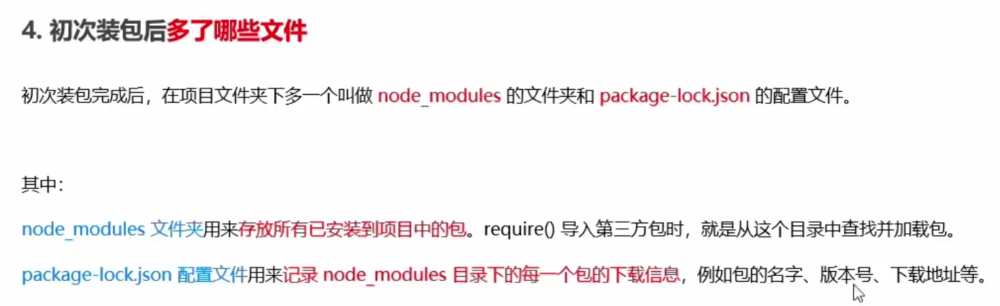
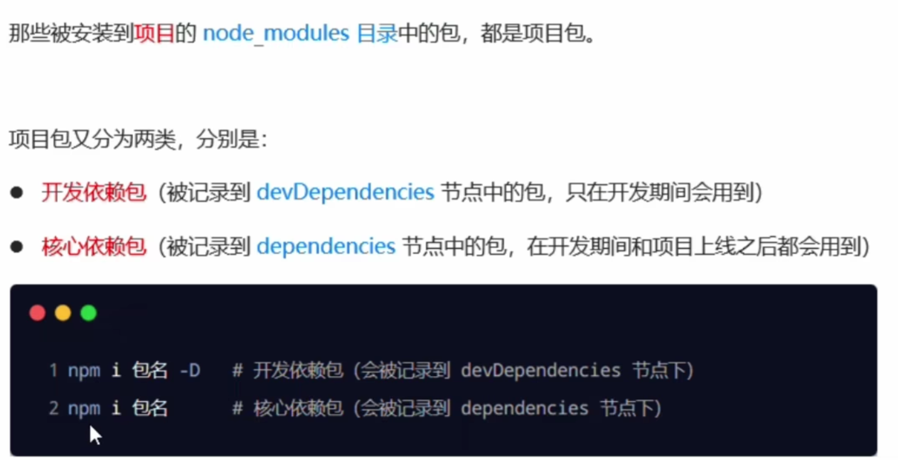
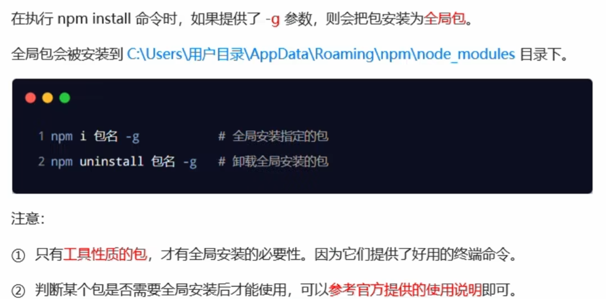

# 一、什么是 Node.js


**Node.js 是  JavaScript  语言的服务器运行环境。**

- Node.js 就是运行在服务端的 JavaScript。
- Node.js 是一个基于Chrome JavaScript 运行时建立的一个平台。
- Node.js是一个事件驱动I/O服务端JavaScript环境，基于Google的V8引擎，V8引擎执行Javascript的速度非常快，性能非常好。


**为什么要用 Node.js ？**

javaScript 语言本身是完善的函数式语言，在前端开发时，开发人员往往写得比较随意，让人感觉JavaScript就是个玩具语言。无法像其他编程语言一样满足工程的需要。

但是，在Node环境下，通过模块化的JavaScript代码，加上函数式编程，并且无需考虑浏览器兼容性问题，直接使用最新的ECMAScript 6标准，可以完全满足工程上的需求。

 

**Node.js 适合以下场景:**

1、实时性应用，比如在线多人协作工具，网页聊天应用等。

2、以 I/O 为主的高并发应用，比如为客户端提供 API，读取数据库。

3、流式应用，比如客户端经常上传文件。

4、前后端分离。


**Node.js 学习任务：**

- Node.js 的模块化

- JS、ES6+ 语法
- Node.js 内置 API
- Node.js 包管理
- Node.js 第三方工具
- mysql 数据库基础使用


## 1.1 Node.js 安装


Node.js 安装与环境配置：https://blog.csdn.net/qq_43557395/article/details/124325563

历史版本下载：https://nodejs.org/en/download/releases/


## 1.2 nvm 安装及使用

 

在工作中，我们可能同时在进行2个或者多个不同的项目开发，每个项目的需求不同，进而**不同项目必须依赖不同版本的NodeJS运行环境**，并且一些低版本的第三方库，可能需要降低版本才能安装成功。所以使用 nvm 方便的在同一台设备上进行多个 node 版本之间切换。


安装教程：https://blog.csdn.net/qq_30376375/article/details/115877446


使用方式如下：

```js
nvm off                     // 禁用node.js版本管理(不卸载任何东西)
nvm on                      // 启用node.js版本管理
nvm install <version>       // 安装node.js的命名 version是版本号 例如：nvm install 8.12.0
nvm uninstall <version>     // 卸载node.js是的命令，卸载指定版本的nodejs，当安装失败时卸载使用
nvm ls                      // 显示所有安装的node.js版本
nvm list available          // 显示可以安装的所有node.js的版本
nvm use <version>           // 切换到使用指定的nodejs版本
nvm v                       // 显示nvm版本
nvm install stable          // 安装最新稳定版
```


# 二、Node.js 的模块化


Node应用是由模块组成，**遵循的是 CommonJS 模块规范**。 CommonJS 是一套代码规范, 目的是为了构建 JavaScript 在浏览器之外的生态系统 (服务器端, 桌面端)。 

> 通过该规范使JavaScript具备开发复杂应用、跨平台的能力


 **CommonJS模块规范化的内容**

- 导出模块：`moudle.exports.xxx` 或 `exports.xxx` 
- 导入模块：`require('模块名称')`


参考博客：[CommonJs 详解](https://blog.csdn.net/weixin_43877799)


## 2.1 初始 module

 

 每个模块内部，都有一个 `module` 对象（直接使用），代表当前模块。它有以下属性：

- `module.id` 模块的识别符，通常是带有绝对路径的模块文件名。
- `module.filename` 模块的文件名，带有绝对路径。
- `module.loaded` 返回一个布尔值，表示模块是否已经完成加载。
- `module.parent` 返回一个对象，表示调用该模块的模块。
- `module.children` 返回一个数组，表示该模块要用到的其他模块。
- `module.exports` 表示模块对外输出的值。


```js
// 输出看看
console.log(module.filename)
console.log(module.loaded)
```


## 2.2 module 导出

使用导出功能有两种方式：

- module.exports
- exports


**（一）module.exports**


```js
// 设置导出变量属性
module.exports.name = 'cocoon';

module.exports.say = function() {
    console.log(module.exports.name);
}

// 设置导出变量对象（和上面不能混用！）
module.exports = {
    name: 'cocoon',
    say() {
        console.log(module.exports.name);
    }
}
```


**（二）exports**

为了方便，Node.js 为每个模块提供一个 `exports` 变量，指向 `module.exports`。这等同在每个模块头部，有一行这样的命令：

```js
var exports = module.exports
```

> 这使得 module.exports 完全可以替换成 exports，但是两个不要一起用！


## 2.3 module 导入

Node.js 使用 CommonJS 模块规范，内置的 `require` 命令用于加载模块文件。

`require` 命令的基本功能是，读入并执行一个 JavaScript 文件，然后返回该模块的`exports`对象。如果没有发现指定模块，会报错。


```js
// 返回一个导出的对象
const obj = require('./module')

// 也可以解构赋值
const { say, name } = require('./module')
```

> `require` 命令用于加载文件，后缀名默认为 `.js`


# 三、npm 包管理工具


**npm 是什么？**

npm（即 node package manager ）是 `Node` 的包管理工具，能解决 NodeJS 代码部署上的很多问题。 到目前为止，**npm 差不多收集了60万个别人写好的包**，其实每个包就是一个功能，一个需求。如果正好我们有这些需求，那么我们就没必要自己去写代码，完全可以用别人已经写好的包。


npm 官网：https://www.npmjs.com/


npm 是随同 Nodejs 一起安装的包管理工具，能解决Nodejs代码部署上的很多问题，常见的使用场景：

- 允许用户从NPM服务器下载别人编写的第三方包到本地使用。
- 允许用户从NPM服务器下载并安装别人编写的命令行程序到本地使用。
- 允许用户将自己编写的包或命令行程序上传到NPM服务器供别人使用

> npm -v 查看版本号


## 3.1 npm 包管理流程


三种命令：

1、`nodemon server.js`：运行js文件，一般是自建服务器运行


2、`npx 第三方库（库名）`：运行第三方库的命令

```js
npx webpack-dev-server
```


3、在package.json下的scripts对象中添加属性  `npm run 属性名` 简化命令

```js
"scripts": {
    "test": "echo \"Error: no test specified\" && exit 1",
    "build": "babel src -d dist",
    "webpack": "webpack --config webpack.config.js",
    "dev": "webpack-dev-server"
}

npm run dev  
npm run webpack
npm run build
```


## 5.1 安装介绍

- 官网：[https://www.npmjs.com](https://www.npmjs.com/)

- 包：第三方模板库就简称包

- npm：下载第三方模板库所用到的工具     跟着node.js一起安装好了 

  ```js
  // 安装包命令
  npm i moment （npm i moment@版本号）
  
  // 创建包对象
  const moment = require('moment')
  
  // 参考第三方库调用其API
  ```
  
- 目前只会在服务端调用。。。


## 5.2 包管理配置

### 5.2.1 配置文件初始化



- 上传git时，**node_modules可以加入.gitignore**  但项目根目录一定要有package.json文件

- package.json标记项目用了那些第三方库


### 5.2.2 创建package.json（项目初始化）

```js
// 在根目录下执行命令  （根目录不能带中文、空格）
// 安装完第三方库之后自动更新
npm init -y
```


### 5.2.3 安装所有第三方库

```js
// 可通过根目录下的package.json安装所有第三方库
npm i

// 卸载包
npm uninstall moment
```


### 5.2.4 包的分类

*包分为项目包和全局包*

- **项目包**

	package.json中存在两个节点




- 全局包

	**打开Windows PowerShell安装全局包**（路径最好加双引号）



### 5.2.5 解决下包速度慢的问题

- 手动设置

```bash
# 打开Windows PowerShell

# 查看当前的下载包镜像源
npm config get registry

# 将下载包镜像源切换为淘宝镜像源
npm config set registry=https://registry.npm.taobao.org

# 查看镜像源是否下载成功
npm config get registry
```

- 利用nrm工具
```bash
# 安装全局包nrm
npm i nrm -g

# 查看所有可用镜像源
nrm ls

# 切换镜像源
nrm use taobao
```


### 5.2.6 开发自定义包

*自定义功能介绍：dateFormat（提供格式化时间），HTMLEscape、htmlUnEscape（html转义字符转换）*

1、初始化

- 新建文件夹 里面包含package.json、index.js、src文件夹、README.md

2、package.json

```json
{
    "name": "itheima-tool-cocoon",
    "version": "1.0.0",
    "main": "index.js",
    "description": "提供格式化时间，HTMLEscape的功能",
    "keywords": ["cocoon","escape","dateFormat"],
    "license": "ISC"
}
```


3、src文件夹：存放js文件，实现不同功能

- dateFormat.js

  ```js
  function dateFormat(dateStr) {
    const dt = new Date(dateStr)
  
    const y = dt.getFullYear()
    const m = padZero(dt.getMonth() + 1)
    const d = padZero(dt.getDate())
  
    const hh = padZero(dt.getHours())
    const mm = padZero(dt.getMinutes())
    const ss = padZero(dt.getSeconds())
  
    return `${y}-${m}-${d} ${hh}:${mm}:${ss}`
  }
  
  // 定义一个补零的函数
  function padZero(n) {
    return n > 9 ? n : '0' + n
  }
  
  // 导出dateFormat
  module.exports = {
    dateFormat
  }
  ```

- HTMLEscape.js

  ```js
  // 定义转义 HTML 字符的函数
  function htmlEscape(htmlstr) {
    return htmlstr.replace(/<|>|"|&/g, match => {
      switch (match) {
        case '<':
          return '&lt;'
        case '>':
          return '&gt;'
        case '"':
          return '&quot;'
        case '&':
          return '&amp;'
      }
    })
  }
  
  // 定义还原 HTML 字符串的函数
  function htmlUnEscape(str) {
    return str.replace(/&lt;|&gt;|&quot;|&amp;/g, match => {
      switch (match) {
        case '&lt;':
          return '<'
        case '&gt;':
          return '>'
        case '&quot;':
          return '"'
        case '&amp;':
          return '&'
      }
    })
  }
  
  // 导出两个方法
  module.exports = {
    htmlEscape,
    htmlUnEscape
  }
  ```


4、index.js：接收所有src文件夹下导出的功能，并全部导出

```js
// 这是包的入口文件
const date = require('./src/dateFormat')
const escape = require('./src/htmlEscape')

// 导出所有方法 以对象展开形式！
module.exports = {
  ...date,
  ...escape
}
```


5、README.md：介绍所有功能的使用

```
dateFormat（提供格式化时间），HTMLEscape、htmlUnEscape（html转义字符转换）
```


### 5.2.7 npm发布包

```bash
# 注册npm账号后 进入终端
npm login

# 进入包的根目录  注：镜像要改为官方镜像
npm publish

# 删除包
npm unpublish 包名 --force
```

### 5.2.8 模块的加载机制

- **模块在第一次加载后会被缓存**。 这也意味着多次调用 require() 不会导致模块的代码被执行多次

- 内置模块的加载优先级最高

  


# 二、前后端身份认证

- HTTP 无状态性

HTTP 协议的无状态性，指的是客户端**的每次** **HTTP** **请求都是独立的**，连续多个请求之间没有直接的关系，**服务器不会主动保留每次** **HTTP** **请求的状态**。

所以这个时候需要借助工具实现身份认证：session、jwt


## 2.1 session

理解：session存储在服务器中，但是以cookie作为载体。把session放入cookie中发送给客户端，客户端每次请求在以cookie作为载体发送session过来


cookie特点：不同域名下的 Cookie 各自独立，每当客户端发起请求时，会**自动**把**当前域名下**所有**未过期的** **Cookie** 一同发送到服务器。


### 2.1.1 session工作原理


### 2.1.2 session的使用

案例：当用户访问 `http://127.0.0.1:8000/` 时，身份认证过就进入index  否则进入login

地址：D:\文档\学习文件\Web Projects\Projects\Session实例

#### 2.1.2.1 初始化

下载 `express-session`  + 其他配置

```js
const express = require('express');
const mysql = require('mysql');
const session = require('express-session');

const app = express();
app.use(express.json()); 
app.use(express.urlencoded({ extended: false }));

// 托管静态文件：index、login等html文件
app.use('/html', express.static('./html'));

// 连接数据库
const db = mysql.createPool({
  host: '127.0.0.1',
  user: 'root',
  password: 'admin123',
  database: 'my_db_01'
})

app.use(function(req,res,next) {
  // 全局设置响应头
  res.setHeader('Access-Control-Allow-Origin', '*');
  res.setHeader('Access-Control-Allow-Headers', '*');
  res.setHeader("Access-Control-Allow-Method", '*');

  // 一定要调用next()
  next();
})
```

  

#### 2.1.2.2 配置session

默认属性配置

```js
let maxAge = 30 * 24 * 60 * 60;
app.use(session({
    secret: 'cocoon', // 不知道有啥用
    name: 'sessionID', // sessionID的名字
    cookie: { maxAge: maxAge }, // cookie有效期
    resave: false, 
    saveUninitialized: true,
  })
)
```


#### 2.1.2.3 判断session

当用户访问 `http://127.0.0.1:8000/` 时，身份认证过就进入index  否则进入login

```js
app.get('/',function(req,res) {
    console.log(req.session);
    // 判断是否已经登录（判断session）
    if (!req.session.isLogin) {
        // 里面只能放本地文件地址!!!!
        res.sendFile(__dirname + '/html/login.html');
    } else {
        res.sendFile(__dirname + '/html/index.html');
    }

})
```


#### 2.1.2.4 创建session

当登录成功时，则创建session属性isLogin  实现身份认证 下次就免登录了在 `http://127.0.0.1:8000/` 

响应登录请求：

```js
app.get('/login',function(req,res) {
    let userInput = req.query; // 储存输入的值

    let flag = 0;
    for (let user of users) // users为数据库中的用户信息
    {
        // 匹配
        if (user.username == userInput.usernameInput && user.password == userInput.passwordInput) {

            // 创建session属性
            req.session.isLogin = 1;
            flag = 1;
            break;
        }
    }

    // 响应体
    if (flag) {
        const data = {
            statue: 1,
            msg: '登录成功'
        };

        res.send(data);
    } else {
        const data = {
            statue: 0,
            msg: '登录失败'
        };

        res.send(data);
    }

})

```

登录时的请求：

```js
let url = 'http://127.0.0.1:8000/login';
axios.get(url, {
    //url参数
    params: {
        usernameInput: usernameInput.value,
        passwordInput: passwordInput.value
    },
}).then(value => {
    if (value.data.statue) {
        alert(value.data.msg);

        // 里面居然不能放本地文件地址？
        location.href = 'http://127.0.0.1:8000/html/index.html';

    } else {
        alert(value.data.msg);
    }
})
```


#### 2.1.2.5 销毁session 

```js
app.get('/signout',function(req,res) {
    req.session.destroy();

    const data = {
        statue: 1,
        msg: '退出登录成功'
    };

    res.send(data);     
})
```


## 2.2 JWT

不需要cookie作为载体，不需要服务器存储，只需要生成一个`Token`字符串 在服务器和客户端之间传输，

`Token`字符串储存在客户端中，且支持跨域传输认证。

工作原理和session类似。


### 2.2.1 JWT的组成


1、JWT 的三个组成部分，从前到后分别是 Header、Payload、Signature。

其中：

- **Payload** 部分**才是真正的用户信息**，它是用户信息经过加密之后生成的字符串。

- Header 和 Signature 是**安全性相关**的部分，只是为了保证 Token 的安全性。


2、客户端收到服务器返回的 JWT 之后，通常会将它储存在 localStorage 或 sessionStorage 中。

此后，客户端每次与服务器通信，都要带上这个 JWT 的字符串，从而进行身份认证。推荐的做法是**把** **JWT** **放在** **HTTP** **请求头的** **Authorization** **字段中**，格式如下：


### 2.2.2 JWT的使用

案例：进入http://127.0.0.1:8000/html/index.html时，如果没登录则进入登录页面，登录过则直接进入

地址：

#### 2.2.2.1 初始化

```js
// 1、安装jsonwebtoken
npm i jsonwebtoken

// 2、引入模块 
const jwt = require('jsonwebtoken'); // 生成token字符串
const secretKey = 'jwtSecret'; // 定义 secret 密钥
```


#### 2.2.2.2 生成`token`并发送

当登录时用户信息匹配后

```js
// 生成token字符串 配置：属性 + secretKey + 有效期
var token = jwt.sign({
    username: user.username,
    statue: 1,
},secretKey,{ expiresIn: '24h' })

const data = {
    statue: 1,
    msg: '登录成功',
    token: token // 将token字符串响应给客户端
};

res.send(data);
```


#### 2.2.2.3 客户端存储token

客户端获取token，并保存在浏览器中（这里使用localStorage）

```js
if (value.data.statue) {
    // 登录成功
    alert(value.data.msg);

    // 在浏览器中存储token
    localStorage.setItem('token', value.data.token);

    // 跳转至首页
    location.href = 'http://127.0.0.1:8000/html/index.html';

} else {
    alert(value.data.msg);
}
```


#### 2.2.2.4 客户端发送token

进入首页时，发送请求（请求体带token）

```js
// 发送请求实现：如果没登录则进入登录页面，登录过则直接进入
axios.post('http://127.0.0.1:8000/index', {
    'token': localStorage.getItem('token')
}, {
}).then(response => {
    if (!response.data.statue) {
        location.href = 'http://127.0.0.1:8000/html/login.html';
    } else {
        console.log(response.data.decoded);
        alert(`欢迎回来 ${response.data.decoded.username}`)
    }
})
```


#### 2.2.2.5 解析token

服务器响应请求时解析token成js对象    jwt.verify() => **token解析对象decoded**

```js
app.post('/index',function(req,res) {
    console.log(req.body);

    // 判断是否已经登录            
    jwt.verify(req.body.token, secretKey, function(err,decoded) {
        if (err) {
            const data = {
                statue: 0,
                msg: 'token无效',
            };

            res.send(data);

        } else {
            const data = {
                statue: 1,
                msg: 'token有效',
                decoded: decoded
            };

            res.send(data);
        }
    })
})
```


# 三、部分模块介绍

## 3.1 文件处理模块


### 3.1.1 读文件

  ```js
  const fs = require('fs');
  
  fs.readFile('./files/1.txt', 'utf-8', function(err, data) {
      if (err) {
          return console.log('failed!' + err.message)
      }
  
      console.log('content:' + data)
  })
  ```


### 3.1.2 写文件

  ```js
  const fs = require('fs');
  
  fs.writeFile('./files/2.txt', '要写入的内容', function(err, data) {
      if (err) {
          return console.log('failed!' + err.message)
      }
  })
  
  fs.readFile('./files/2.txt', 'utf-8', function(err, data) {
      if (err) {
          return console.log('failed!' + err.message)
      }
  
      console.log('content:' + data)
  })
  
  ```


## 3.2 path模块

### 3.2.1 __dirnam

__dirname：表示当前目录地址

```js
console.log(__dirname);
```


### 3.2.2 path拼接

1、path.join()

```js
console.log(path.join(__dirname,'./index.html'));

// D:\文档\学习文件\Web Projects\Webpack\index.html
```


2、path.resolve()

```js
console.log(path.resolve(__dirname, './dist'));

// D:\文档\学习文件\Web Projects\Webpack\dist
```


3、path.basename：获取文件名

```js
const fpath = '/a/b/c/index.html'

const fullName = path.basename(fpath)
console.log(fullName) // index.html

const nameWithoutExt = path.basename(fpath, '.html')
console.log(nameWithoutExt) // index
```

  

## 3.3 http模块

- ip地址：每个web服务端都有一个ip地址 且是独一无二的       **一个ip地址再对应一个域名**

  ```
  在终端中查看域名的ip地址：ping 域名
  ```

  测试用的本地ip地址：`127.0.0.1`   对应域名为`localhost`


- 端口号：一个服务器有多个服务，而一个服务对应一个端口号

  注：1、每个端口号不能同时被多个服务占用      2、80端口在url里可以省略


### 3.3.1 配置http服务端

*前面ajax学了利用express框架配置服务端  **这里利用http模板***

推荐用express框架！

- 设置所有url的响应

```js
const http = require('http');

const app = http.createServer();

// 设置所有url的响应
app.on('request',function(req,res) {
 
    // 获取请求的url地址
    console.log(req.url);
    // 获取请求方式
    console.log(req.method);

    //设置响应头 设置允许跨域
    res.setHeader('Access-Control-Allow-Origin', '*');
    // 设置响应头 支持自定义请求头变量信息
    res.setHeader('Access-Control-Allow-Headers', '*');
    // 设置响应头 防止响应体中文乱码
    res.setHeader('Content-Type','text/html; charset=utf-8');

    // 设置响应体
    let str = '发送请求成功！'
    res.end(str);
})

app.listen(8000,function() {
    console.log('服务已经启动， 8000端口监听中....');
})
```

- 分配url响应   **url还可以带参数！！所以不太好判断！   一般是直接文件url请求**

```js
const http = require('http');

const app = http.createServer();

app.on('request',function(req,res) {
 
    // 获取请求的url地址
    let url = req.url;

    //设置响应头 设置允许跨域
    res.setHeader('Access-Control-Allow-Origin', '*');
    // 设置响应头 支持自定义请求头变量信息
    res.setHeader('Access-Control-Allow-Headers', '*');
    // 设置响应头 防止响应体中文乱码
    res.setHeader('Content-Type','text/html; charset=utf-8');

    let content = ''; // 响应体信息
    // 分配url响应  url不能带参数！！所以一般是文件url请求
    if (url == '/')
    {
        content = '首页';
    }
    if (url == '/ajax')
    {
        content = 'ajax';
    }
    if (url == '/index.html')
    {
        content = 'index.html';
    }

    res.end(content);
})

app.listen(8000,function() {
    console.log('服务已经启动， 8000端口监听中....');
})
```

# 四、本地存储

## 4.1 Cookie

### 4.1.1 初始Cookie

Cookie 是什么？

Cookie 全称 HTTP Cookie，简称 Cookie，是浏览器存储数据的一种方式，因为存储在用户本地，而不是存储在服务器上，是本地存储。

同时，Cookie 一般会自动跟随着浏览器每次请求发送到服务器端。

Cookie 有什么用？

利用 Cookie 跟踪统计用户访问该网站的习惯，比如说以什么语言访问，在哪里访问，什么时间访问，访问了哪些页面，在每一个页面的停留时间等。

如何查看 Cookie？

F12 打开浏览器控制台，选择 Application（应用程序）中的 Storage（存储）中的 Cookies，里面就能看到当前页面的 Cookie 了。

Cookie 一般都是以 网址 或 IP 的形式进行标识。

每个 Cookie 中，以 `名=值` 的形式存储一系列记录，记录与记录之间用 `;`+ ` ` 隔开。

当浏览器向服务器发送请求时，会连同一起发送 Cookie。


### 4.1.2 Cookie的基本用法

读取 Cookie：`document.cookie`（返回一个由名值对构成的字符串，名值对之间用 “一个分号+一个空格” 隔开）。

注意：读取的 Cookie 是全部的 Cookie，不能通过“名”单独读出某条“名值对”。

写入 Cookie：`document.cookie = 'username=jerry'`。

注意：不能同时设置多个 Cookie `document.cookie = 'username=jerry; age=18'`，只能一个一个设置。

### 4.1.3 Cookie的属性

- Cookie 的名称（Name）：（必须属性）

- Cookei 的值（Value）：（必须属性）

> Cookie 的名称或值如果包含非英文字母，则写入时需要使用 encodeURIComponent() 编码，读取时使用 decodeURIComponent() 解码：
>
> ```javascript
> document.cookie = `username=${encodeURIComponent('张三')}`;
> document.cookie = `${encodeURIComponent('用户名')}=zhangsan`;
> // 一般名称使用英文字母，不要使用中文，值可以使用中文，但是要编码
> ```

- 失效（到期）时间：对于失效的 Cookie，会被浏览器清除（非必须属性，有默认值）

> 如果没有设置失效时间，那么这样的 Cookie 默认称为：会话 Cookie（默认值为 Session），它存在内存中，当会话结束，也就是浏览器关闭时，Cookie 会消失。
>
> 想长时间存在，设置 Expires 或 Max-Age：
>
> 【Expires】：值为 Date 类型
>
> ```javascript
> document.cookie = `username=alex; expires=${new Date('2050-1-01 00:00:00')}`;
> ```
>
> 【Max-Age】：值为数字，表示当前时间 + 多少秒后过期，单位是秒
>
> ```javascript
> // 5 秒
> document.cookie = 'username=alex; max-age=5';
> // 30 天
> document.cookie = `username=alex; max-age=${24 * 3600 * 30}`;
> // 0：立即删除
> documetn.cookie = 'username=alex; max-age=0';
> // 负数：立即删除
> documetn.cookie = 'username=alex; max-age=-1';
> ```

- Domain 域：限定了同一站点下不同域名访问 Cookie 的范围（了解即可）（非必须属性，有默认值）

> 可以通过 Domain 设置同一站点下不同域名对 Cookie 的访问范围。
>
> 比如：www.zjr.com 和 www.m.zjr.com 是一个网站的网页端和移动端，但是这两个页面只能访问到添加了其域名或父域名 Domain 的对应 Cookie。
>
> 【添加 Domain】（默认值为当前域名）
>
> ```javascript
> // 注意：我们只能读写当前域或父域的 Cookie，无法读写其它域的 Cookie       
> // 比如：当前我们在 www.zjr.com，那么父域是 .zjr.com
> document.cookie='username=alex; domain=www.zjr.com';
> document.cookie='username=alex; domain=.zjr.com';
> // 比如：当前我们在 www.m.zjr.com，那么父域是 .zjr.com
> document.cookie='username=alex; domain=www.m.zjr.com';
> document.cookie='username=alex; domain=.zjr.com';
> // 通过设置父域名，就可以同时访问到该 Cookie
> ```

- Path 路径：限定了同一站点下同一域名下不同路径访问 Cookie 的范围（了解即可）（非必须属性，有默认值）

>可以通过 Path 设置同一站点下同一域名下不同路径访问 Cookie 的范围。
>
>比如：www.zjr.com 和 www.zjr.com/course 和 www.zjr.com/course/list 是同一域名的不同路径，但这些路径下的页面只能访问到添加了其路径或父路径 Path 的对应的 Cookie。
>
>【添加 Path】（默认值为根路径 `/`）
>
>```javascript
>// 注意：不能在上一级路径下读写下一级路径到 Path
>// 当前在 www.zjr.com
>document.cookie = 'username=alex; path=/';	// 该路径下全部都能访问
>// 当前在 www.zjr.com/course;
>document.cookie = 'username=alex; path=/';	// 该路径下全部都能访问
>document.cookie = 'username=alex; path=/course';	// /course 路径后的能访问
>// 当前在 www.zjr.com/course/list
>document.cookie = 'username=alex; path=/';	// 该路径下全部都能访问
>document.cookie = 'username=alex; path=/course';	// /course 路径后的能访问
>document.cookie = 'username=alex; path=/course/list';	// /course/list 路径后的能访问
>```

> 注意：只有当 Name、Domain、Path 这 3 个属性都同时相等的时候，才是同一个 Dookie。

- HttpOnly：设置了 HttpOnly 属性的 Cookie 不能通过 JS 去访问（为了安全性）
- Secure 安全标志：限定了只有在使用了 https 而不是 http 的情况下才可以发送给服务端

### 4.1.4 Cookie的封装

JS 对 Cookie 的原生操作方式比较繁琐，我们一般都是对其封装后再使用：

我们将 Cookie 封装为一个模块，对外提供三个方法：set、get、remove。

```html
<!DOCTYPE html>
<html lang="en">
  <head>
    <meta charset="UTF-8" />
    <title>Cookie 的封装</title>
  </head>
  <body>
    <button id="cn">中文</button>
    <button id="en">英文</button>

    <script type="module">
      // import { set, get, remove } from './cookie.js';
      // import { set, get, remove } from './cookie.js';
      // set('username', 'alex');
      // set('username', 'zs');
      // set('age', 18);
      // set('用户名', '张三');

      // set('sex', 'male', {
      //   maxAge: 30 * 24 * 3600
      // });

      // remove('username');
      // remove('用户名');

      // console.log(get('username'));
      // console.log(get('age'));
      // console.log(get('用户名'));
      // console.log(get('sex'));

      // 使用封装好的 Cookie 实现网站语言切换
      import { set } from './cookie.js';
      const cnBtn = document.getElementById('cn');
      const enBtn = document.getElementById('en');

      cnBtn.addEventListener(
          'click',
          () => {
              set('language', 'cn', {
                  maxAge: 30 * 24 * 3600
              });
              // 每次点击后就刷新该页面（浏览器重新带着 Cookie 请求服务器)
              window.location = './2-6.Cookie 的封装.html';
          },
          false
      );
        enBtn.addEventListener(
            'click',
            () => {
                set('language', 'en', {
                    maxAge: 30 * 24 * 3600
                });
                // 每次点击后就刷新该页面（浏览器重新带着 Cookie 请求服务器)
                window.location = './2-6.Cookie 的封装.html';
            },
            false
        );
    </script>
  </body>
</html>
```

```java
// cookie.js
// 写入 Cookie
const set = (name, value, { maxAge, domain, path, secure } = {}) => {
    let cookieText = `${encodeURIComponent(name)}=${encodeURIComponent(value)}`;
    
    if (typeof maxAge === 'number') {
        cookieText += `; max-age=${maxAge}`;
    }
    
    if (domain) {
        cookieText += `; domain=${domain}`;
    }
    
    if (path) {
        cookieText += `; path=${path}`;
    }
    
    if (secure) {
        cookieText += `; secure`;
    }
    
    document.cookie = cookieText;
};

// 通过 name 获取 cookie 的值
const get = name => {
    name = `${encodeURIComponent(name)}`;
    
    // 通过 ; 拆分字符串为数组
    const cookies = document.cookie.split('; ');
    
    for (const item of cookies) {
        // 通过 = 拆分字符串为数组
        const [cookieName, cookieValue] = item.split('=');
        
        if (cookieName === name) {
            return decodeURIComponent(cookieValue);
        }
  }
    
  return;
};

// 'username=alex; age=18; sex=male'
// ["username=alex", "age=18", "sex=male"]
// ["username","alex"]

// get('用户名');

// 根据 name、domain 和 path 删除 Cookie
const remove = (name, { domain, path } = {}) => {
    set(name, '', { domain, path, maxAge: -1 });
};

export { set, get, remove };
```

### 4.1.5 Cookie注意事项

- 前后端都可以写入和获取 Cookie
  - 前端可以生成 Cookie 并通过请求发送给服务器后端进行读取
  - 后端可以生成 Cookie 并通过响应返回给浏览器，然后浏览器进行存储
- Cookie 有数量限制
  - 每个域名下的 Cookie 数量有限制（大概 20~50）
- Cookie 有大小限制 
  - 每个 Cookie 的存储容量很小，最多只有 4KB 左右


## 4.2 LocalStorage

### 4.2.1 初始localStorage

【localStrorage 是什么】

 localStrorage 也是一种浏览器存储数据的方式（本地存储），它只是存储在本地，不会发送到服务器端。

单个域名下的 localStrorage 总大小有限制。

localStrorage 是 key-value 形式。


【基本用法】

```java
// 查看 localStrorage 
console.log(localStrorage);
// 存数据
localStorage.setItem('username', 'alex');
localStorage.setItem('username', 'zs');
localStorage.setItem('age', 18);
localStorage.setItem('sex', 'male');
// 获取长度
console.log(localStrorage.length);
// 获取数据
console.log(localStorage.getItem('username'));
console.log(localStorage.getItem('name'));	// 获取不存在的会返回 null
// 删除数据
localStorage.removeItem('age');
localStorage.removeItem('name');	// 删除不存在的数据不会报错
// 清空数据
localStorage.clear();
```

**当value为一个对象时需要用到解析：**

```js
localStorage.setItem('todoList', JSON.stringify(value));
```

```js
todoList: JSON.parse(localStorage.getItem('todoList')) || []
```


【案例】

使用 localStorage 实现自动填充功能：

```html
<!DOCTYPE html>
<html lang="en">
<head>
    <meta charset="UTF-8">
    <meta http-equiv="X-UA-Compatible" content="IE=edge">
    <meta name="viewport" content="width=device-width, initial-scale=1.0">
    <title>Document</title>
</head>
<body>
    <form class="login" action="http://127.0.0.1:8000/user" method="get">
        <input type="text" name="username" placeholder="username">
        <input type="password" name="password" placeholder="password">
        <input type="submit" name="submitBtn">
    </form>

    <script>
        const loginForm = document.querySelector('.login');

        let username = localStorage.getItem('username');
        if (username) {
            loginForm.username.value = username;
        }

        let password = localStorage.getItem('password');
        if (password) {
            loginForm.password.value = password;
        }

        loginForm.submitBtn.addEventListener('click',function(e) {
            e.preventDefault();
          
            localStorage.setItem('username', loginForm.username.value);
            localStorage.setItem('password', loginForm.password.value);

            loginForm.submit();
        })

        
    </script>
</body>
</html>
```

### 4.2.2 localStorage的注意事项

- localStorage 的存储期限
  - localStorage 是持久化的本地存储，除非手动清除（比如通过 JS 删除，或者清除浏览器缓存），否则数据是永远不会过期的
- localStorage 键和值的类型
  - 其键和值的类型只能是字符串，不是字符串类型也会先转为字符串类型再存进去 
- 不同域名下能否共用 localStorage 
  - 不能！
- localStorage 的兼容性
  - IE7 及以下版本不支持。

### 4.2.3 sessionStorage

sessionStorage 当会话结束（比如关闭浏览器）的时候，sessionStorage 中的数据会被清空，其它用法与 localStorage 一致


## 5.3 第三方库

### 5.3.1 moment、day

一个获取当前时间格式的包     学习网址：http://momentjs.cn/docs/#/use-it/

```js
const moment = require('moment');

// format里面写入时间格式
let date = moment().format();

console.log(date);
```


**day.js**

轻量级且一样功能的包：https://www.bootcdn.cn/dayjs/

学习网址：https://github.com/iamkun/dayjs/blob/dev/docs/zh-cn/README.zh-CN.md

```
dayjs()：时间戳为当前时间

dayjs(传入指定)
```


### 5.3.2 i5ting_toc

将md文档转化为html （不好看！）   网址：https://www.npmjs.com/package/i5ting_toc

```bash
# 安装全局包
npm i -g i5ting_toc

# 在md文档根目录下执行
i5ting_toc -f 文件名 -o
```


### 5.3.3 Express*

什么是 Express:

- 官方给出的概念：Express 是基于 Node.js 平台，快速、开放、极简的 Web 开发框架。 
- Express 的作用和 Node.js 内置的 http 模块类似，是专门用来创建 Web 服务器的。
-  Express 的本质：就是一个 npm 上的第三方包，提供了快速创建 Web 服务器的便捷方法。 
- Express 的中文官网： http://www.expressjs.com.cn
- **在项目根目录下安装Express**：`npm i express@4.17.1`

全局安装nodemon（可自动重启服务器）：`npm i -g nodemon`

#### 5.3.3.1 创建基本web服务器

```js
// 基本web服务器结构
const express = require('express');

const app = express();


// 全局中间件
app.use(function(req,res,next) {
    // 全局设置响应头
    res.setHeader('Access-Control-Allow-Origin', '*');
    res.setHeader('Access-Control-Allow-Headers', '*');
    res.setHeader("Access-Control-Allow-Method", '*');

    // 一定要调用next()
    next();
})


// 导入路由模块
const userRouter = require('./router/user');
// 实现路由模块
app.use(userRouter);


// 创建错误中间件（写在所有路由之后）
app.use(function(err,req,res,next) {
    console.log('err:' + err.message);
    res.send(err.message);
}) 

// 监听端口
app.listen(8000,function() {
    console.log("8000端口监听中...");
})
```


#### 5.3.3.2 res设置响应头

常用的响应头：

```js
//设置响应头 设置允许跨域
res.setHeader('Access-Control-Allow-Origin', '*');

// 设置响应头 支持自定义请求头变量信息
res.setHeader('Access-Control-Allow-Headers', '*');

// 设置响应头 防止响应体中文乱码
res.setHeader('Content-Type','text/html; charset=utf-8');

// 设置允许任意请求类型
response.setHeader("Access-Control-Allow-Method", '*');
```


#### 5.3.3.3 req获取url参数

- req.query： 返回url中的静态参数对象

- **req.params**：返回动态参数

  ```js
  // ajax:
  let url = 'http://127.0.0.1:8000/axios';    
  let ids = 12;
  axios.get(url, {
      //url参数 (现在是动态参数)
      params: {
          id: ids,
          vip: 7
      },
      //请求头信息
      headers: {
          name: 'cocoon',
          age: 20
      }
  }).then(value => {
      // 响应体
      console.log(value.data);
  })
  ```
  
  ```js
  app.all('/axios',(req,res) => {
      res.setHeader('Access-Control-Allow-Origin', '*');
      res.setHeader('Access-Control-Allow-Headers', '*')
   
      const date = {
          "reqQuery": req.query,
          "reqParams": req.params
      };
      let jsonStr = JSON.stringify(date);
  
      res.send(jsonStr);
  })
  ```
  


#### 5.3.3.4 req获取请求体

req.body：获取post的请求体

如果从未解析过请求体数据，则req.body默认为undefined

```js
// 添加express内置中间件 解析请求体数据

// 两种
app.use(express.json()); // 写在所有路由之前！

app.use(express.urlencoded({ extended: false }))
```

```js
axios.post(url, {
    //请求体  json格式
    "admin": 'admin',
    'num': 2020210832
}, {
    //url参数 请求行
    params: {
        id: 200,
        vip: 9
    },
    //请求头参数
    headers: {
        height: 100,
        weight: 180,
    }
}).then(response => {
    console.log(response.data);
})
```


#### 5.3.3.5 托管静态文件

  **express.static**：将公开目录下的所有文件对外访问     *通常路径前缀与公开目录名相同*

和本地文件访问不同！！这是http://127.0.0.1:8000支持的访问

```js
app.use('路径前缀',express.static('公开目录'));
```

```js
app.use('/files', express.static('./files'))

// 若files下存在index.html 则可访问http://127.0.0.1:8000/files/index.html
```


http://127.0.0.1:8000/默认打开index.html！！！


#### 5.3.4.6 模块化路由

1、什么是路由？

- 服务器中的`app.method(path,handler)`就是路由模块
- 在 Express 中，路由指的是客户端的请求与服务器处理函数之间的映射关系。
- 路由分 3 部分组成，分别是请求的类型、请求的 URL 地址、处理函数


模块化路由：
1. 在项目根目录中，新建 `router` 文件夹，用来存放所有的`路由`模块
  
   > 路由模块中，只存放客户端的请求与处理函数之间的映射关系
2. 在项目根目录中，新建 `router_handler` 文件夹，用来存放所有的 `路由处理函数模块`
  
   > 路由处理函数模块中，专门负责存放每个路由对应的处理函数


- 路由模块  `./router/user.js`

```js
// 路由模块：存放客户端的请求与处理函数之间的映射关系
const express = require('express');
const userRouter = express.Router();

// 导入路由处理函数模块
const userHandler = require('../router_handler/user');

// 响应
userRouter.post('/login',userHandler.login);

userRouter.post('/regUser',userHandler.regUser);

// 记得导出！
module.exports = userRouter
```

- 路由处理函数模块  `./router_handler/user.js`

```js
// 注册用户的处理函数
exports.regUser = (req, res) => {
  res.send('reguser OK')
}

// 登录的处理函数
exports.login = (req, res) => {
  res.send('login OK')
}
```

- 服务器导入路由模块：`./app.js`

```js
const express = require('express');
const app = express();

// 导入路由模块
const userRouter = require('./router/user');

// 实现路由模块
app.use(userRouter);

// app.use('/api',userRouter)：添加访问前缀
```


#### 5.3.4.7 中间件函数

中间件的作用：

- 中间件与路由之间，**共享同一份** **req** **和** **res**。基于这样的特性，我们可以在上游的中间件中，**统一**为 req 或 res 对象**添加自定义的属性或方法**，供下游的中间件或路由进行使用。

- 例如每个路由都要写相同的代码，则可以写入中间件里面

- **中间件一定要写在路由前面！**

  

1、全局中间件

```js
// app.use()实现全局中间件函数
app.use(function(req,res,next) {
    // 全局设置响应头
    res.setHeader('Access-Control-Allow-Origin', '*');
    res.setHeader('Access-Control-Allow-Headers', '*');
    res.setHeader("Access-Control-Allow-Method", '*');

    // 一定要调用next()
    next();
})

// 中间件函数按循序执行
app.use(function(req,res,next) {
    // 全局添加req自定义属性
    req.newDate = new Date();

    next();
})
```


2、局部中间件

```js
// 不是用app.user() 而直接在指定的路由里面添加
// 局部中间件
const mw1 = function(req,res,next) {
    console.log('局部中间件1');
    next();
}
const mw2 = function(req,res,next) {
    console.log('局部中间件2');
    next();
}

app.all('/mw', mw1, mw2, function(req,res) { 
    res.send('');
})

```


3、错误中间件

```js
// 创建错误中间件（写在所有路由之后）
app.use(function(err,req,res,next) {
    // 向服务器输出错误
    console.log('err:' + err.message);
    // 向客户端抒输出错误
    res.send(err.message);
}) 
```


4、Express内置的中间件

express.static 快速托管静态资源的内置中间件，例如： HTML 文件、图片、CSS 样式等

 express.json 解析 JSON 格式的请求体数据

 express.urlencoded 解析 URL-encoded 格式的请求体数据


5、第三方中间件（也是第三方库）

自行下载 自行使用 基于express

- body-parser：解析请求体数据  `npm i body-parser`

```js
// 导入
const bodyParser = require('body-parser');

// 使用：解析请求体json格式
app.use(bodyParser.json());
```


#### 5.3.4.8 模块化中间件

将中间件模块化： *新建文件夹  middleware 在里面写中间件模块*

- 中间件模块

```js
// 新建文件custom-body-parser.js 封装中间件函数

// 封装自定义中间件函数：解析json格式的请求体

const qs = require('querystring');

function customBodyParser(req,res,next) {
    let str = ''; // 储存请求体str

    // req.data改变时监听
    req.on('data',function(chunk) {
        str += chunk;
    })
    
    // req.end时监听
    req.on('end',function() {
        // 此时str为完整请求体str

        // 解析str为js对象 并赋予req.body
        req.body = qs.parse(str);

        next();
    }) 

}

// 导出函数
module.exports = customBodyParser;
```

- 服务器
```js
// 导入自定义中间件
const customBodyParser = require('./middleware/custom-body-parser');
app.use(customBodyParser);
```


## 1、表单数据合法验证

> 表单验证的原则：前端验证为辅，后端验证为主，后端**永远不要相信**前端提交过来的**任何内容**

在实际开发中，前后端都需要对表单的数据进行合法性的验证，而且，**后端做为数据合法性验证的最后一个关口**，在拦截非法数据方面，起到了至关重要的作用。

单纯的使用 `if...else...` 的形式对数据合法性进行验证，效率低下、出错率高、维护性差。因此，推荐使用**第三方数据验证模块**，来降低出错率、提高验证的效率与可维护性，**让后端程序员把更多的精力放在核心业务逻辑的处理上**。

1. 安装 `joi` 包，为表单中携带的每个数据项，定义验证规则：

```bash
npm install joi
```

2. 安装 `@escook/express-joi` 中间件，来实现自动对表单数据进行验证的功能：

```bash
npm i @escook/express-joi
```

3. 新建 `/schema/user.js` 用户信息验证规则模块，并初始化代码如下：

   

*导出验证规则（当前针对req.body  err在全局中间件  body中的属性必须和请求中的一致）*


```js
const joi = require('joi')

/*
 * string() 值必须是字符串
 * alphanum() 值只能是包含 a-zA-Z0-9 的字符串
 * min(length) 最小长度
 * max(length) 最大长度
 * required() 值是必填项，不能为 undefined
 * pattern(正则表达式) 值必须符合正则表达式的规则

   newPwd: joi.not(joi.ref('oldPwd')).concat(password)
	// 1. joi.ref('oldPwd') 表示 newPwd 的值必须和 oldPwd 的值保持一致
    // 2. joi.not(joi.ref('oldPwd')) 表示 newPwd 的值不能等于 oldPwd 的值
    // 3. .concat() 用于合并 joi.not(joi.ref('oldPwd')) 和 password 这两条验证规则

*/

// 用户名的验证规则
const username = joi.string().alphanum().min(1).max(10).required()
// 密码的验证规则
const password = joi
    .string()
    .pattern(/^[\S]{6,12}$/)
    .required()

// 导出验证规则

// 注册和登录表单的验证规则
exports.reg_login_schema = {
    body: {email, password}

    // 也可以对 req.parms 中的数据进行验证
}
```

4. 修改 `/router/user.js` 中的代码如下：

```js
const express = require('express')
const router = express.Router()

// 导入用户路由处理函数模块
const userHandler = require('../router_handler/user')

// 1. 导入验证表单数据的中间件
const expressJoi = require('@escook/express-joi')
// 2. 导入需要的验证规则对象
const { reg_login_schema } = require('../schema/user')

// 注册新用户
// 3. 在注册新用户的路由中，声明局部中间件，对当前请求中携带的数据进行验证
// 3.1 数据验证通过后，会把这次请求流转给后面的路由处理函数
// 3.2 数据验证失败后，终止后续代码的执行，并抛出一个全局的 Error 错误，进入全局错误级别中间件中进行处理
router.post('/reguser', expressJoi(reg_login_schema), userHandler.regUser)
// 登录
router.post('/login', userHandler.login)

module.exports = router
```

5. 在 `app.js` 的全局错误级别中间件中，捕获验证失败的错误，并把验证失败的结果响应给客户端：

```js
const joi = require('joi')

// 创建错误中间件（写在所有路由之后）
app.use(function(err,req,res,next) {
    
    // 表单验证失败错误
    if (err instanceof joi.ValidationError) {
        console.log(err.message);
        res.send({statue: 0, msg: '请填写正确的邮箱或密码', errmsg: err.message});
    } else {

        console.log(err.message);
        res.send({statue: 0, msg: err.message});
    }
    
}) 
```


## 2、对密码进行加密处理

> 为了保证密码的安全性，不建议在数据库以 `明文` 的形式保存用户密码，推荐对密码进行 `加密存储`

---

在当前项目中，使用 `bcryptjs` 对用户密码进行加密，优点：

- 加密之后的密码，**无法被逆向破解**
- 同一明文密码多次加密，得到的**加密结果各不相同**，保证了安全性

---

1. 运行如下命令，安装指定版本的 `bcryptjs` ：

```bash
npm i bcryptjs
```

2. 在 `/router_handler/user.js` 中，导入 `bcryptjs` ：

```js
const bcrypt = require('bcryptjs')
```

3. 在注册用户的处理函数中，确认用户名可用之后，调用 `bcrypt.hashSync(明文密码, 随机盐的长度)` 方法，对用户的密码进行加密处理：

```js
// 对用户的密码,进行 bcrype 加密，返回值是加密之后的密码字符串
userinfo.password = bcrypt.hashSync(userinfo.password, 10)
```

4. 判断用户输入的密码是否正确

```js
// 拿着用户输入的密码,和数据库中存储的密码进行对比
const compareResult = bcrypt.compareSync(userinfo.password, results[0].password)

// 返回bool值
```


## 3、生成唯一字符串

用到一个迷你版的库：`nanoid`

- 安装：`npm i nanoid`
- `ES6`引入：`import { nanoid } from 'nanoid'`
- 使用：`const str = nanoid()`


## 4、动画、过渡的`css`

**1、动画**

使用一个库：`Animate.css`    官网：https://animate.style/（可能进不去）

动画演示网址：https://www.dowebok.com/demo/2014/98/

安装和所有的动画效果都在官网，接下来介绍在vue里面怎么使用

当类名为`animate__animated + 动画类名` 时，就会展示动画

1、class绑定

```vue
<button 
    class="btn btn-danger animate__animated"
    :class="delClass" 
    @click="handleDelete()">删除</button>
```

```js
data() {
    return {
        // 动画类名初始化
        delClass: {'animate__rubberBand': false}
    }
}
```


2、当被点击时就展示动画

```js
handleDelete() {
    this.delClass.animate__rubberBand = true;
    setTimeout(()=> {
        this.delClass.animate__rubberBand = false;
    },500)
},

// 定时器里面的时间最小为动画时间！！！！
```


**2、 过渡**

一般用于元素的显示或消失的时候呈现过渡效果  `transition.css`

官网：https://www.transition.style/   github：https://github.com/argyleink/transition.css

使用：复制`css`样式，或者直接引入或下载库，然后在盒子里面添加样式

```html
<div class="imgBx" transition-style="in:circle:top-right" >
```

```css
@keyframes circle-in-top-right {
  from {
    clip-path: circle(0%);
  }
  to {
    clip-path: circle(150% at top right);
  }
}

[transition-style="in:circle:top-right"] {
  animation: 2.5s cubic-bezier(.25, 1, .30, 1) circle-in-top-right both;
}
```


搭配vue里面的