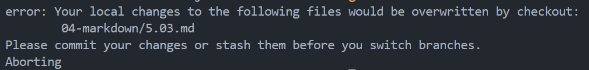
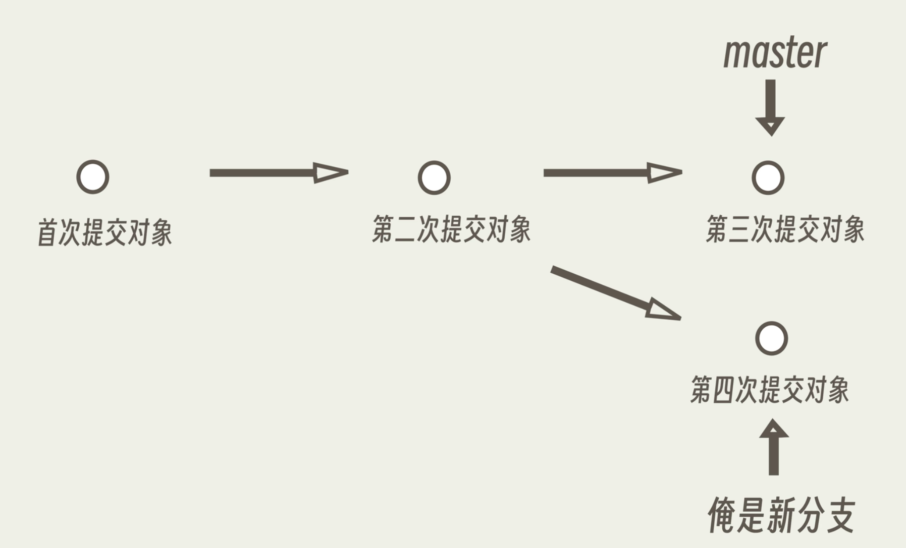
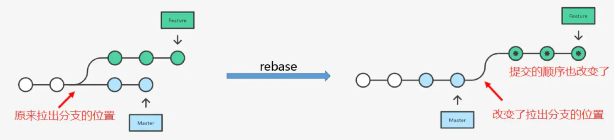
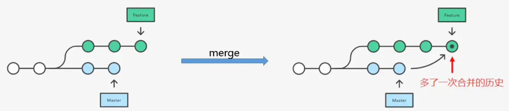
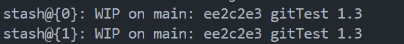
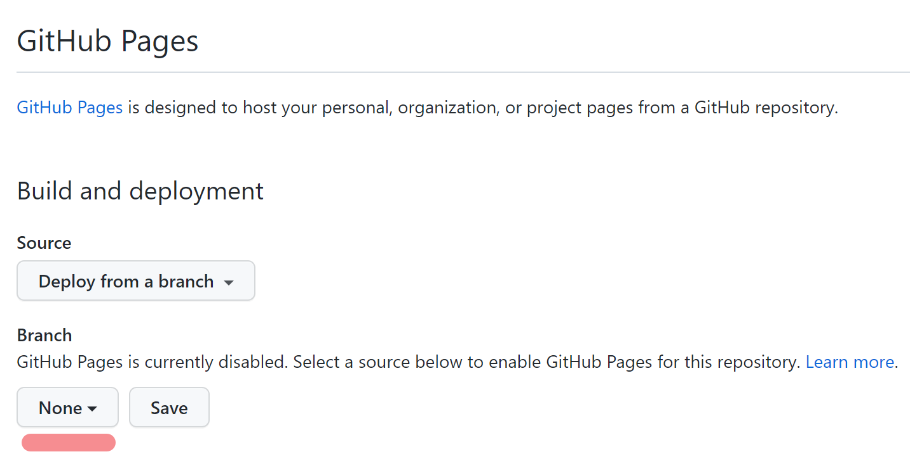
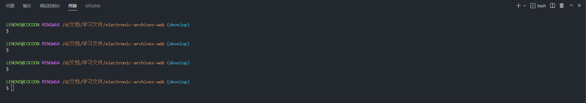

# 第一章 Git 命令行操作指南

**首先全局设置一下**

新版 Git 拉取代码时，默认是 crlf，如果每个文件行尾序列都被设置为 crlf，eslint 就会发出 warning，需要每个文件修改为 lf。修复方式一：修改项目的 eslint 和 prettier 配置，**修复方式二：直接修改一下 Git 的全局配置**

```bash
git config --global core.autocrlf false
```


**对 Git 仓库的理解**

首先一个文件有四种操作：跟踪、修改、删除、新增

- 新增一个文件：该文件默认为**未跟踪状态，无法监测文件状态**
- 修改、删除：已跟踪的文件进入修改、删除状态
- `git add .` ：将所有状态的文件添加至暂存区，**未跟踪状态的文件进入跟踪状态**
- `git commit`：版本提交，**所有暂存区的文件恢复成未修改状态**
- `git rm --cached`：移除跟踪指定的文件，在本地仓库的文件夹中保留该文件


区域分为工作区和暂存区

- `git add`：将工作区的文件提交至暂存区，状态变为未修改
- `add` 命令可多次执行，将将工作区的文件提交，以更新暂存区
- `git commit`：执行之后暂存区为空
- 当使用分支时，工作区和暂存区是共享的！！因此当工作区有文件状态被修改或者暂存区有文件时，但是又没有 commit，这个时候想切换分支 Git 是不支持的




简单介绍一下 Git 工作流程

```
1.在工作区开发，添加，修改文件。
2.将修改后的文件放入暂存区。
3.将暂存区域的文件提交到本地仓库。
4.将本地仓库的修改推送到远程仓库。
```


参考的文档和视频

- https://juejin.cn/post/6974184935804534815

- https://juejin.cn/post/6978812726411788295

- https://www.bilibili.com/video/BV1pX4y1S7Dq/?spm_id_from=444.41


## 1.1 本地库初始化

官网下载 Git：https://git-scm.com/download/

镜像高速下载：https://registry.npmmirror.com/binary.html?path=git-for-windows/


**设置签名**

```bash
# 初次配置 git 需要设置签名 随便填写即可
git config --global user.name cocoon
git config --global user.email 2806525575@qq.com
```


**初始化一个仓库**

```bash
# 先新建一个文件夹
git init
```


**使用 http 可以直接克隆一个仓库**

```bash
# 在父文件夹下克隆一个仓库 会在本地生成一个文件夹并带有git记录
git clone https://github.com/cocoonnu/WebProjects.git
```


**使用 ssh 克隆一个仓库**

```bash
# 先去gitlab-help-ssh中找到生成ssh密钥的命令
$ ssh-keygen -t rsa -b 2048 -C "<comment>"

# 进入"C:\Users\LENOVO\.ssh\id_rsa.pub"复制里面的内容

# 进入gitlab-设置中添加ssh密钥，粘贴复制的内容即可

# 最后通过ssh的方式克隆仓库
$ git clone git@git.ekuaibao.com:gaea/electronic-archives-web.git
```


**查看全局配置**

```bash
git config --list --global
git config 单项
```


## 1.2 Git 基本操作指令

### 1.2.1 状态修改指令

**git status**

```bash
git status # 会区分暂存区和工作区

git status -s #精简查看 
```


**git add**

```bash
# 把指定的文件（新增、修改、删除等状态）添加到暂存区中
$ git add 文件路径
$ git add . # 等同于 git add -A
```

```bash
# 以下命令省略文件路径则为当前目录

# 添加所有修改、已删除的文件到暂存区中
$ git add -u
$ git add -u 文件路径
$ git add --update 文件路径

# 添加所有修改、已删除、新增的文件到暂存区中
$ git add -A
$ git add -A 文件路径
$ git add --all 文件路径

# 查看所有修改、已删除但没有提交的文件，进入一个子命令系统
$ git add -i
$ git add -i 文件路径
$ git add --interactive 文件路径
```


**git commit**

```bash
# 把暂存区中的文件提交到本地仓库，调用文本编辑器输入该次提交的描述信息
$ git commit

# 把暂存区中的文件提交到本地仓库中并添加描述信息
$ git commit -m "<提交的描述信息>"

# 把所有修改、已删除的文件提交到本地仓库中
# 不包括新增文件或其他未跟踪的文件，等同于先调用了 "git add -u"
$ git commit -a -m "<提交的描述信息>"

# 修改上次提交的描述信息
$ git commit --amend
```


### 1.2.2 信息查询指令

**git diff**

文件差异比较，同时不使用该指令而是使用 vscode 插件

```bash
# 比较暂存区中的文件和上次提交时的差异
$ git diff --cached
$ git diff --staged

# 比较当前文件和上次提交时的差异
$ git diff HEAD

# 查看从指定的版本之后改动的内容
$ git diff <commit ID>

# 比较两个分支之间的差异
$ git diff <分支名称> <分支名称>
```


**git log**

```bash
# 打印当前分支的所有提交记录
$ git log # 输入 enter 继续显示 q 退出显示

# 展示所有的版本
git reflog

# 打印从第一次提交到指定的提交的记录
$ git log <commit ID>

# 打印指定数量的最新提交的记录
$ git log -n

$ git log --graph # 图形显示 	

$ git log --oneline # 简洁显示
```

```bash
# 查看所有分支的提交记录
$ git log --all --graph
```


**git config**

使用文档：https://juejin.cn/post/6978812726411788295#heading-7


### 1.2.3 状态撤销指令

**git checkout**

```bash
# 可撤销对工作区中指定文件的修改或删除
# 新增的文件和已经添加到暂存区的文件不受影响
$ git checkout -- 文件路径 

$ git checkout . # 撤销工作区的所有修改和删除
```


**git rm**

```bash
# 移除跟踪指定的文件，并从本地仓库的文件夹中删除
$ git rm 文件路径

# 移除跟踪指定的文件夹，并从本地仓库的文件夹中删除
$ git rm -r 文件夹路径

# 移除跟踪指定的文件，在本地仓库的文件夹中保留该文件
$ git rm --cached 文件路径
```


**git reset**

- 文件处理

```bash
# 将指定文件移出暂存区
$ git reset 文件路径
$ git reset # 移出所有暂存区文件
```

- 版本切换（将 HEAD 的指向改变）

```bash
# 回退到指定版本，并且前面提交的版本会被删（git log 时不再显示），暂存区清空
# 使用 --hard 会对工作区的文件也进行版本回退！ 
$ git reset --hard commitID

$ git reset --hard HEAD^ # 只能后退

$ git reset --hard HEAD~n # 只能后退
```
> 理解为删除前面的提价记录，并本地代码同步回退


```bash
# 回退到指定版本，并且前面提交的版本会被删除，暂存区清空
# 使用 --mixed 不会对工作区的文件进行版本回退
$ git reset --mixed commitID
```

> 可以理解为只是删除前面的提交记录


```bash
# 回退到指定版本，并且前面提交的版本会被删除，暂存区不清空
# 使用 --soft 不会对工作区的文件进行版本回退
$ git reset --soft commitID
```

>  相当于调用 git reset --mixed 命令后又做了一次 git add .


### 1.2.4 bash 指令整理
```bash
$ cd

$ cd ..

$ pwd 

$ ls

$ touch # 新建一个文件

$ rm # 删除一个文件

$ mkdir # 新建一个目录

$ rm -r # 删除一个文件夹

$ reset # 重新初始化终端/清屏

$ cls # 清屏

$ history # 查看命令历史

$ exit # 退出

$ esc # 清空本行命令

复制: `ctrl + insert`

粘贴: `shift + insert`
```


## 1.3 Git 分支管理指令

每一个分支可以理解为一个指针，默认使用的是 master/main 分支。header 指针永远指向最新的分支提交对象




### 1.3.1 分支基本操作指令

**git branch**

```bash
# 列出本地的所有分支，当前所在分支以 "*" 标出
$ git branch

# 列出本地的所有分支并显示最后一次提交，当前所在分支以 "*" 标出
$ git branch -v
$ git branch --list

# 创建新分支，新的分支基于上一次提交建立
$ git branch <分支名名称>
```

```bash
# 修改分支名称

# 如果不指定原分支名称则为当前所在分支
$ git branch -m <原分支名称> <新的分支名称>

# 强制修改分支名称
$ git branch -M <原分支名称> <新的分支名称>
```

```bash
# 删除指定的本地分支
$ git branch -d <分支名称>

# 强制删除指定的本地分支
$ git branch -D <分支名称>
```


**git checkout**

切换分支后，暂存区、工作区的文件内容也会跟着切换

```bash
# 切换到已存在的指定分支
$ git checkout <分支名称>

# 创建并切换到指定的分支，保留所有的提交记录
# 等同于 "git branch" 和 "git checkout" 两个命令合并
$ git checkout -b <分支名称>

# 创建并切换到指定的分支，删除所有的提交记录
$ git checkout --orphan <分支名称>
```


实际上当工作区有文件状态被修改，但是又没有 commit。这个时候想切换分支 Git 是不支持的。


### 1.3.2 合并分支与解决冲突






- `rebase` 并没有进行合并操作，只是提取了当前分支的修改，将其复制在了目标分支的最新提交后面
- `merge` 是一个合并操作，会将两个分支的修改合并在一起


**git merge**

把两个分支最新的2个 commit 合并成一个 commit。最后的分支树呈现非线性的结构

```bash
# 合并所有分支
$ git merge

# 把指定的分支合并到当前所在的分支下，并自动进行新的提交
$ git merge <分支名称>

# 把指定的分支合并到当前所在的分支下，不进行新的提交
$ git merge --no-commit <分支名称>
```

产生冲突后根据前后的比较，进行修改即可


**git  rebase**

git reabse 将需要合并的分支的当前 commit 复制到 master 的最新 commit 之后，会形成一个线性的分支树

```bash
$ git rebase <分支名称>
```


**使用 git rebase 合并多次 commit 的方法**

https://juejin.cn/post/6844903600976576519


## 1.4 Github 使用指南

### 1.4.1 Github 连接记录

- **基于 https 连接**

~~~bash
# 添加一个远程仓库
git remote add origin https://github.com/cocoonnu/WebProjects.git

# 修改主分支名称
git branch -M main

# 第一次 push 且需要登录
git push -u origin main 
~~~


- **基于 ssh 连接**

输入: `ssh-keygen -t rsa -C <GitHub注册的邮箱>`  

进入 `c/users/lenovo/.ssh` 目录，复制 `id_rsa.pub` 文件内容

登录 `GitHub`  `Settings`  ->  `SSH and GPG keys`  -> `New SSH Key`

```bash
git remote add origin git@github.com:cocoonnu/WebProjects.git
git branch -M main
git push -u origin main
```


### 1.4.2 远程仓库连接指令

**git remote**

```bash
# 添加远程仓库
$ git remote add <远程仓库的别名> <远程仓库的URL地址>

# 修改远程仓库的别名
$ git remote rename <原远程仓库的别名> <新的别名>
```

```bash
# 列出已经存在的远程仓库
$ git remote

# 列出远程仓库的详细信息，在别名后面列出URL地址
$ git remote -v
$ git remote --verbose

# 删除指定名称的远程仓库
$ git remote remove <远程仓库的别名>

# 修改远程仓库的 URL 地址
$ git remote set-url <远程仓库的别名> <新的远程仓库URL地址>
```


**git clone**

```bash
# 默认在当前目录下创建和版本库名相同的文件夹并下载版本到该文件夹下
$ git clone <远程仓库的网址>

# 指定本地仓库的目录
$ git clone <远程仓库的网址> <本地目录>

# -b 指定要克隆的分支，默认是主分支
$ git clone <远程仓库的网址> -b <分支名称> <本地目录>
```


### 1.4.3 远程仓库拉取指令

**git fetch**

只是将远程仓库的分支最新版本取回（拉取）到本地，**工作区无变化**

```bash
# 将远程仓库所有分支的最新版本全部取回到本地
$ git fetch <远程仓库的别名>

# 将远程仓库指定分支的最新版本取回到本地
$ git fetch <远程仓库的别名> <分支名>
```


**跟踪分支**

从远程仓库拉取分支之后，执行切换命令就自动变成本地分支了，并进行了跟踪

```bash
# 简写形式 从本地切换一下即可
git checkout 远程仓库分支名 

# 完整写法 切换分支并支持改名
git checkout -b 本地分支名称 远程仓库的别名/远程仓库分支名 
```


**git pull**

从远程仓库获取分支最新版本并合并到本地。 **首先会执行 `git fetch`，然后执行 `git merge`**，把获取的分支的 HEAD 合并到当前分支。工作区直接变化

```bash
# 从远程仓库获取当前分支的最新版本并合并
$ git pull

# 从远程仓库获取指定分支的最新版本并合并本地指定分支
git pull <远程仓库的别名> <远程分支名>:<本地分支名>

# 使用 rebase 的模式进行合并
git pull --rebase <远程仓库的别名> <远程分支名>:<本地分支名>
```

```bash
# 将远程主机 origin 的 master 分支拉取过来，与本地的 brantest 分支合并。
git pull origin master:brantest

# 如果远程分支是与当前分支合并，则冒号后面的部分可以省略。
git pull origin master
```


### 1.4.4 远程仓库提交指令

**git push**

```bash
# 把本地仓库的分支推送到远程仓库的指定分支
# 如果远程分支名和本地分支名同名则只需要写一个
$ git push <远程仓库名> <本地分支名>:<远程分支名>
$ git push origin master

# 如果当前分支与远程分支之间存在追踪关系，则本地分支和远程分支都可以省略
$ git push <远程仓库名>

# 指定 origin 为默认远程仓库
$ git push -u origin master

# 如果只有一个分支，并指定了默认远程仓库
$ git push
```

```bash
# 删除指定的远程仓库的分支
$ git push <远程仓库名> --delete <远程分支名>

# 等效
$ git push <远程仓库的别名> :<远程分支名>
```


**如果你的本地仓库版本落后于远程仓库版本，那么有两种方式**

拉取一下远程仓库的最新版本，解决冲突后再提交

```bash
$ git pull

$ git add .

$ git commit
```


直接强制提交，远程仓库的最新版本会被覆盖

```bash
$ git push -f
```


### 1.4.5 本地分支提交步骤

参考文档：https://juejin.cn/post/7012617882148274190

首先创建一个本地分支

```bash
# 创建一个基于远程仓库某个分支开辟的本地分支
$ git checkout -b 分支名 origin/远程分支名

# 或者直接创建一个基于当前分支开辟的分支
$ git checkout -b 分支名
```


然后提交至远程仓库

```bash
# 将本地分支推送至与其存在“追踪关系”的远程分支（一般两者是同名的）
# 若该远程分支不存在，则会自动新建一个同名的远程分支
$ git push <远程主机名> <分支名>

$ git push <远程仓库名> <本地分支名>:<远程分支名>
```


建立追踪关系并指定默认主机

```bash
# 首次提交需要
$ git push -u origin <分支名>

# 下一次提交直接
$ git push
```

> 切换不同分支也只需要 git push 即可


## 1.5 日常使用业务记录

### 1.5.1 使用 stash 来暂存文件

会有这么一个场景，现在你正在用你的 feature 分支上开发新功能。这时，生产环境上出现了一个 bug 需要紧急修复，但是你这部分代码还没开发完，不想提交，怎么办？这个时候可以用 `git stash` 命令先把工作区已经修改的文件暂存起来，然后切换到 hotfix 分支上进行 bug 的修复，修复完成后，切换回 feature 分支，从堆栈中恢复刚刚保存的内容。


**git  stash**

每次缓存之后，工作区就会变干净。

```bash
# 把本地工作区的改动暂存起来
$ git stash

# 执行存储时，添加备注，方便查找
$ git stash save "message"

# 应用最近一次暂存的修改，并删除暂存的记录
$ git stash pop 

# 应用某个存储,但不会把存储从存储列表中删除，默认使用第一个存储
$ git stash apply

# 应用某个指定的存储
$ git stash apply stash@{n}

# 查看 stash 有哪些存储
$ git stash list

# 删除所有缓存的 stash
$ git stash clear
```

存储以堆的形式将工作区的修改缓存，`stash@{0}` 永远指向最新的缓存

 


### 1.5.2 工作区撤销更改方式

对工作区的修改、删除进行撤销

```bash
$ git checkout -- <filename>
```


对暂存区文件进行删除并撤销修改

```bash
$ git reset <filename>

$ git checkout -- <filename>
```


### 1.5.3 Github 部署静态网站

将项目 dist 文件夹部署到一个仓库中，进入仓库的 `setting` -> `pages`，选择根路径然后点 `Save` 即可！




### 1.5.4 VScode 添加 Bash 窗口

在 VScode setting.json 中添加：

```json
// "terminal.integrated.defaultProfile.windows": "Command Prompt",

"terminal.integrated.defaultProfile.windows": "GitBash", // 默认打开bash命令窗口

"terminal.integrated.profiles.windows": {
    "GitBash": {
        "path": "D:\\Git\\bin\\bash.exe"
    },
},
```




最新版本的 VScode 已经自动集成 Git Bash 了
