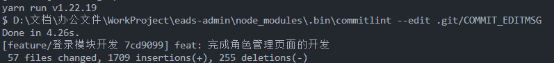

# 第一章 日期功能记录
## 6.27

入职第一天的步骤记录：

- 首先 HR 会要求你发送身份证、学生证、银行卡照片的电子稿。然后会发给你一份入职指南，按照上面的流程下载各个软件并注册


- 通常一个企业会使用企业微信或者钉钉进行团队管理沟通，另外会分配一个 SSO 账号（最好重置一下密码），以便登录公司的内置网站、系统和 Gitlab。其次就是用飞书来实现团队之间代码、文档的共享。不过注册飞书需要企业邀请码，这个可能需要排队


- 另外需要在企业微信中申请访问公司项目。**申请的审批下来了就可以 clone 公司的项目代码了，需要切换成开发版本的分支**。接下来就是配置项目所需要的环境：VScode 版本、Nodejs 版本、npm 或 yarn 的镜像源


- 最后下载依赖，阅读项目的介绍文档、前端开发代码规范、学习 Git、GitLens 的使用、学习代码管理


## 6.28

从拉取代码到配置环境再到运行代码整体流程:

- 修改 Git 全局配置和设置 VScode 默认换行符为 LF，防止 ESlint delete cr 报错

```bash
$ git config --global core.autocrlf false
```

```bash
# 在设置综合搜索 files:eol，将选项修改为 '/n'
```


- 下载 nvm、yarn、nrm

```bash
$ nvm use 14.7.0
$ nrm use ekb
$ yarn config set registry https://npm.ekuaibao.com/ # 公司镜像
$ yarn config set registry http://registry.npm.taobao.org/ # 淘宝
```


- 下载依赖，并运行项目，必须按照文档步骤来！！

```bash
$ yarn install
$ yarn run build:pre:dev
$ yarn run start
```


- 最好在本地新建一个分支进行个人开发

```bash
$ git checkout -b feature/N/czyTest
```


- 记住公司的项目端口号地址：http://localhost:9966/web/app.html


- VScode 工作区适配 prettier：.vscode/setting.json

```json
{
  "files.eol": "\n",
  "editor.tabSize": 2,
  "editor.codeActionsOnSave": {
    "source.fixAll.eslint": true // 设置自动保存
  }
}
```


- **将工作区 TS 的版本设置为项目所需的版本：**在右下角的编辑器语言里面进行 TS 版本的选择，在 @types/react 中查看项目对应的 TS 版本：www.npmjs.com/package/@types/react?activeTab=versions


## 6.29

Gitlab、公司 SSO 账户：chenzhiyi@hosecloud.com 2002CZYczy，记得申请电脑补贴！！

发送一个请求有这些参数：URL 上的参数，params（URL 参数键值对），请求体对象data，请求头对象

后端请求会接收到：Body 请求参数，Query 请求参数（对应 params），Header 请求参数，URL 上的参数

```json
{
  "code": 0,
  "data": {
    "userId": 1,
    "accessToken": "97c9adfaadf94a1fa41a5833ffb8a318",
    "refreshToken": "b9cb676eaa5e40a1a82eb893e6933b8b",
    "expiresTime": 1689329272575
  },
  "msg": ""
}
```


## 7.03

今天参照 archives-box 做了一个简单页面，包含了一下功能点

- 新增按钮，弹层页面展示，内部展示基础表单数据（有必填参数），点击确定的时候（打印出所有参数，并且把参数转换成后端正常的数据值），然后取消弹层

- 表单由公共表单组件 FormGenerator 生成，且在未填写必填参数时，点击确认不可取消弹层

-  通过调用接口展示一个列表，有分页、搜索功能，列表由 TableWrapper 组件生成

  列表具有缓存能力，切换左侧菜单之后，再切换回来的时候，能够读取上次操作数据，缓存的数据有搜索、分页（PS：例如分页切换到第五页时，切换到其它页面菜单后，在切换回来的时候，此页面正常是展示第五页的列表数据）


## 7.04

一般我们的语法没报错的时候，我们注入一个 VM，或者函数组件使用 VM、引入一个内部封装好的组件比如 FormGenerator、BaseLayer 等常用表单页面组件之后报错时，**那么大部分情况下重启一下项目就可以解决！**


今天整理了一下各个功能点的使用，主要还是熟悉表单组件，弹窗页面生成的流程和规范。明天要实现一个存储多个路由数据的功能，实现性能优化


昨天的话实现了志强哥关于页面提的几个功能点比如熟悉表单组件、弹窗页面生成的流程和规范还有存储路由数据的功能等，今天的话就还是完成志强哥给的任务吧，然后就是继续熟悉项目


## 7.05

昨天的话整体还是熟悉表单组件的使用吧，实现了几个复杂表单项的配置，深入了解了由一个表单的配置对象到表单渲染的大致流程。然后的话还熟悉了几个表单组件 API 的使用。今天的话就是继续完成志强哥给的任务，熟悉一下那个公共的页面组件，和一些细节方面的使用。

```ts
setTimeout(() => {
  runInAction(() => {
    delete vm.formHelpType?.directoryFormId
    vm.formHelpType = { ...vm.formHelpType }
  })
}, 1000)
```

> 异步修改 mobx 数据时需要用到 runInAction，删除对象属性并实现响应式用下面这两行代码


## 7.06 

我昨天把那个前台中台的公共页面组件大致看了一些，了解了一些组件复用的逻辑。然后就是完成了志强哥之前安排的一个任务，在 Layout.vm 中封装了一个能一次存储多个路由 key-value 对象的方法，内部是用了一个 map 数据类型来实现的。然后今天主要就是催一下那个飞书账号的申请，之后就是看一下日钦哥昨天发的那几个 PRD。最后就是今天继续深入了解一下那个公共页面组件的逻辑


## 7.07

PRD发布
1、业务检测模块升级
https://hose2019.feishu.cn/docx/HaHudfD8couJrCxgQlfc3XeTnQe
2、扫描仪接入
https://hose2019.feishu.cn/docx/XT1ndyASuo7IBbxbujmcXS4tnhc
3、项目需求回头看
https://hose2019.feishu.cn/docx/OBeWdQuO5oj0xUxQtA5ckKSknWe


产研+UI交互协议方案：https://hose2019.feishu.cn/docx/N861da82soKZrEx6JiUcegmwnOe
dev环境：【开发自己玩的分支，没有提测就不要合并到dev分支】
    命名空间：efile-base-dev、efile-app
    登陆地址：http://ea.dev.ekuaibao.com.cn/web/app.html
    数据库地址：192.168.100.133:4306  
    数据库用户名/密码：root/efiledev@soft
    minio网页：http://minio-efile.dev.ekuaibao.com.cn
    minio用户名/密码：minio/minio123
test环境：【部署dev分支，测试稳定使用】
    命名空间：efile-base-test、efile-app-test
    登陆地址：http://ea-test.dev.ekuaibao.com.cn/web/app.html
    数据库地址：192.168.100.133:5306  
    数据库用户名/密码：root/efiletest@soft
    minio网页：http://minio-efile-test.dev.ekuaibao.com.cn
    minio用户名/密码：minio/minio123

短信升级方式（从202301版本开始）：https://hose2019.feishu.cn/docx/LoVDde9D6oEqoGxuvnbcAWiKnLc

kkview 版本：
registry-prod.ekuaibao.com/kkfileview/kkfileview:20230515174407-86-master-Ekd

版式文件时区：
在printer-setting.json配置文件加上这行配置（需要升级打印服务版本1.21.0以上）
ZERO_REQUEST_OFFSET下面 加 "ZERO_TIMEZONE_OFFSET": "28800",


### electronic-archive

electronic-archive 的每个页面通过路由获取 `id：center_aebd0e80bc2d28802000:salesInvoiceDocument`

再通过 this.layoutVM.menuIdMap[id] 获取当前页面的 menu，从 menu 可以解析出 config，就是顶部 Cascader 组件的 option 下拉菜单

每个下拉菜单又对应一个 directoryFormId，通过这个 id 可以从后端获取当前菜单的数据，把数据中的 templateAndPath 存储在 this.layoutVM.currentGroupTabList 里面，即路由存储

electronic-archive.vm 里面封装了一个 this.document 用来存储从后端获取来的当前页面的所有数据，根据当前页面唯一 id 获取从而实现动态响应式

可以从 this.document 中提取出 TableWrapper 需要的 columns

可以从 this.document 中提取出 TableWrapper 头部搜索栏的表单配置 this.document.filterTemplate


周五的话我首先是还是继续熟悉那个前台中台的公共页面组件，理解了它的一些数据状态交互逻辑。然后的话还拉取了一下那个小程序的项目并跑通了，然后了解项目的基本结构。另外还学了一下重构项目需要用到的一个状态管理库。最后的话就是我那飞书账号已经批下来了，到时候可以看一下prd需求了。今天就是继续熟悉项目，然后为那个重构项目做一些前期准备吧


## 7.10

权限功能设计、包含按钮
动态菜单怎么创建，后端使用接口！
共用组件库，前端目录及架构


PS：基于react项目业务重构思想，依赖vue项目（权限、创建菜单）

新后台：vue后端接口，利用现有老的react业务梳理，做新react后台项目


### Vue2 项目合思采集平台功能预览

**登录权限功能设计**

**AccessToken** 决定用户的权限

登录路由权限聚焦与这几个文件：`src\permission.js`（路由前置守卫）、`src\utils\request.js`（axios 拦截器）、`src\store\modules\user.js`（用户登录功能函数）、`src\utils\auth.js` 储存 AccessToken


**按钮权限功能设计**

`src\store\modules\user.js`：内部的 permissions 数组存储了所有的用户权限，在 GetInfo 函数中加载

`src\directive\permission\hasPermi.js`：添加一个 v-hasPermi 指令，按钮添加指令后 ，如果权限不存在则直接把按钮删除

`src\plugins\auth.js`：导出判断权限函数


**路由菜单侧边栏实现**

`src\router\index.js`：配置了一个初始化路由表，一些基础页面都在里面

`src\store\modules\permission.js`：该文件中的 GenerateRoutes 函数向后端申请了路由表字符信息，并转换为路由表配置存储在仓库中

`src\permission.js`：当用户登录后加载用户信息并根据用户权限加载路由菜单，并添加进 route

`views\*`：路由 URL 严格对应该文件的文件目录对应的组件，大部分组件的父路由组件是 layout 组件

  ```js
  component: 'system/user' -> 
  component: (resolve) => require([`@/views/system/user`], resolve)
  ```


电档 React 项目菜单存储于 `this.layout.menuData`，根据菜单 id 和 URL 对应进行组件匹配 

电档 React 项目权限功能（包含按钮）是如何设计的


我昨天主要是针对 那个 Vue2 的后台管理项目进行了一些功能的分析，比如它的登录权限拦截、按钮权限功能和动态菜单的实现。另外还看了它的后端接口和发送请求的流程，再利用现有的那个 react 项目做了一些业务梳理，看看如何把这些功能实践到重构项目里。今天的话主要会看一下那个项目优化需求的prd，另外会针对那个 react 项目进行功能分析，比如它的 layout 组件渲染、动态菜单的实现还有它的权限功能是如何设计的这一方面的问题吧


## 7.11 

### PRD：项目需求回头看

**功能2 凭证号段检索 -- 2. 检索模式 -- a** 

1、对应组件位置：`src\plugins\document-storage\component\scan-pack-box\left-page\search-mode\table-header.tsx`

2、凭证号原表单单项配置：


3、凭证号目标表单单项配置：


**功能2 凭证号段检索 -- 2. 检索模式 -- b** 

1、当检索后，默认勾选上检索后的数据行，代码位置：

Table 组件位置：`src\plugins\document-storage\component\scan-pack-box\left-page\search-mode\index.tsx`

查询按钮位置：`src\plugins\document-storage\component\scan-pack-box\left-page\search-mode\table-header.tsx` -- queryData 函数

2、测试代码：`src\plugins\archives-box\vms\archives-box.vm.ts` -- searchData 函数

3、缺点：只能全选中第一页的数据


**功能2 凭证号段检索 -- 3. 扫码模式**

代码位置：`src\plugins\document-storage\component\scan-pack-box\left-page\search-mode\index.tsx`，是处理哪个表单字段？

```js
str.replace(/^0+/, '') // 字符串去除前置的0
```

 

**功能2 凭证号段检索 -- 4. 文案修改**

代码位置：`src\plugins\document-storage\component\scan-pack-box\left-page\scan-mode\dash-board.tsx`，修改一下 echars 配置即可


**功能6：每页列表数据**

代码位置：`src\plugins\document-storage\component\right\TableComponet.tsx`

分页器处添加：

```ts
pageSizeOptions: [20, 50, 100, 500, 1000]
```


我昨天的话主要是针对项目需求回头看那个prd进行了几个功能点的分析，然后在项目中做了部分实践。今天的话就是继续分析那个prd的需求，另外就是针对那个重构项目做一些前期基础功能的设计方案。比如登录权限功能、按钮权限架构设计这一方面的内容


## 7.12

**凭证号表单单项配置**

```ts
  {
    type: FORM_TYPE.numberRange, // 纯数字输入框
    field: 'voucherNumber',
    label: getI18n('凭证号'),
    maxLength: { start: 11, end: 11 },
    validator: validatorRule, // 只作为显示的校验规则（组件内部自己封装），不作为实际校验规则
    endPlaceholder: '截止凭证号',
    startPlaceholder: '起始凭证号',
    optional: false
  }

// 校验规则
const validatorRule = (start, end) => {
  const isOrder = parseInt(start) > parseInt(end)
  return { validatorRes: isOrder, message: getI18n('起始凭证号必须小于等于截止凭证号') }
}
```

组件位置：`src\plugins\common\components\Fields\FieldRange\index.tsx`

`src\plugins\test\components\TestMain\columns.tsx`


**当检索后，默认勾选上检索后的数据行**

`src\plugins\document-storage\vms\scan-pack-box.vm.ts` 

queryDocument 函数里面写入 checkTableData 函数，实现点击查询、分页之后自动选中当前页的列表数据

```ts
  // scan-pack-box.vm 内部定义一个函数
  /** 当检索后，默认勾选上检索后的数据行 */
  checkTableData = () => {
    const filterRows = this.searchModeTableData?.filter((item) => {
      const isArrivalOrder = this.modeType === ScanPackBoxModeType.arrivalOrder
      const unionID = isArrivalOrder ? item?.id : item?.id + ':' + item?.relationFormData?.docId
      return !this.tableDataMap[unionID] && !this.searchModeTableErrorMap[unionID]
    })
    this.searchModeTableSelectRows = {
      ...this.searchModeTableSelectRows,
      [this.searchModeTableCurrentPage]: filterRows
    }
  }
```


**功能5：业务单据档案盒类型 下拉菜单选择的一些矛盾**

可能要通过树的向上查找，找到当前字段的上级字段。但是回显的是当前字段还是上级字段呢？


**功能7：凭证分录序号 **

凭证分录序号字段类型变更：后端返回的表单配置中的 type 属性设置为 number

表单新增兼容：记账凭证的分录手工新增时，按分录新增先后顺序，默认从1开始计数自动赋值，该单项只读

当删除一列数据时，存在问题

 代码位置：

`src\plugins\electronic-archive\layers\import-layer.tsx`

```ts
  // 添加【分录数据】表格行数据
  const addHandler = async () => {
    const res: any[] = await app.open('@accounting-voucher:ImportSubComponentsLayer', {
      title: getI18n('分录数据导入'),
      subComponents,
      tableDatas // 传入当前表格的数据
    })
    setTableDatas([...tableDatas, res])
  }
```

`src\plugins\electronic-archive\layers\import-subcomponents-layer.tsx`

```ts
// 给这个组件多传一个参数，指定分录序号的初始值
formRef.current.setFieldsValue({
  number: tableDatas.length + 1
})

disabledItems={['number']} // 分录序号只读
```


昨天依然是针对那个项目需求回头看那个prd进行功能分析，比如功能2里面的凭证号表单单项的配置设计、还有就是检索之后，默认勾选检索后的数据行，当然这里也有一个问题，不知道它是需要勾选全部数据行还是只需要勾选当前页，然后的话已经在文档里提问了。另外还处理了功能7凭证分录序号那一块的内容，像凭证分录序号字段类型变更和新增表单时凭证分录序号自动赋值等功能

然后今天的话就是把pingcode开通，然后关于那个重构项目志强哥在pingcode里给我创建了几个任务点，之后就主要是针对里面的任务进行重构项目的开发了


## 7.13

可以在第三方库的 package.json 里面查看这个库导出了哪些文件，又可以从那些文件里查看导出了哪些变量


less 文件使用  global 时，里面的样式变成全局样式，引入时不要用模块化导入！！！

```less
:global {
    .test {
        color: red;
    }
}
```

```tsx
<div className='test'><div/> // 直接用类名！！！
```


TS enum 类型：https://juejin.cn/post/6998318291420708900


## 7.17

无法输出错误 + 是否需要请求接口返回数据的类型

我上周五主要是开发重构项目的登录页面，完成了三个功能点，静态页面的样式和登录表单的使用，还有通过接口文档，写完了登录登出请求，实现了项目登录登出流程。

今天的话就是根据上周的代码做一个 code review，然后继续实现登录页面接口联调集成和权限管理的功能


## 7.18

我昨天的话首先是对重构项目里的表单组件进行了功能和样式的一个修复，另外还集成了：获取登录用户权限信息和刷新令牌这两个接口。今天的话就是继续完成昨天的任务，利用 react 路由实现一个路由守卫和无感知刷新令牌的功能


## 7.19

我昨天的话首先是实现了登录权限拦截的功能，然后 ping code 里的登录模块开发里面的任务大致已经完成了。另外昨天还进行了一个 code review，然后一些功能点像一些组件的调整、发送请求的流程和一些代码层面还需要进行一个修改。所以今天的话主要是处理 code review 的任务，另外还会进行菜单组件的一个开发


## 7.20

昨天的话修复了登录模块一些残留的问题，完成 code review 的里的任务，另外还添加了一个选择企业的静态页面。今天就继续完成 ping code 里那个菜单组件的任务，大概这两天完成，然后星期一 code review


## 7.24

我上周四周五的话主要是开发layout组件，首先进行那个获取权限菜单的接口联调，后面就是开发左侧导航栏和的顶部标签栏的功能。然后接下来会进行一个code review处理一些代码上的问题。今天的话就是开始那个菜单管理页面的开发包括一些公共组件的封装、接口联调和表单的封装所以大概会花三天的时间


## 7.25

我昨天的话首先是code review了一下然后对layout组件进行了一个收尾。另外就是开发菜单管理页面，完成了获取菜单信息的接口联调和菜单表格的渲染。然后今天的话首先是迁移一个search bar顶部搜索组件，和实现一个弹窗表单，另外就是对剩下的几个接口进行联调，然后主要就是这些


## 7.26

我昨天的话主要是集成了一个search bar组件，和一个表单组件，另外就是菜单管理页面的按钮渲染和样式调整。

然后这个页面就只剩下一个弹窗表单，和几个接口的联调，今天应该可以开发完成


## 7.27

我昨天的话主要是集成了三个公共表单组件，然后把那个弹窗表单的功能完成了。另外就是联调了剩下的几个接口，然后这个菜单管理页面的功能大致开发完了。今天的话主要会进行一个 code review，优化代码和修复一些bug，后面的话就是开发按钮权限功能这个任务。


## 7.28

我昨天的话主要是实现了项目的按钮权限功能，另外的话就是进行了一个code review。优化了一些代码和修复了一些 bug。还调整了弹窗表单的一个架构。今天的话主要是完成几个公共组件的封装和首页的一个开发。


## 7.31

我上周五的话首先是集成了选择图标表单组件，确定了弹窗表单的目录架构。另外就是把首页的接口进行了联调，完成了数据的适配和展示。今天的话主要是先完成那个表格页面组件的封装，然后再进行角色管理页面的开发


## 8.01

我昨天的话主要是把那个公共的表格页面组件开发完成了，然后页面开发完成了80%。今天的话主要是开发几个弹窗表单和接口联调。然后这个任务的功能点今天就可以完成。




## 8.02

我昨天主要是把角色管理页面开发完成了，完成了弹窗表单和接口联调。今天的话就是继续开发部门管理页面，然后这个今天就可以完成。


## 8.03

我昨天主要是把部门管理页面开发完成，然后用户管理开发了30%，今天的话主要就是继续开发这个页面。然后的话就是我昨天对这些任务做了一个时间安排，后面的进度就是按照这个排版来完成。


## 8.09

我昨天的话是完成了通知公告、敏感词管理两个页面，然后根据code review处理了一些问题。今天的话就是继续完成在线管理和应用管理两个页面。今天可以完成。


```ts
{
  type: 'attachments',
  field: 'uploadFile',
  label: getI18n('请上传导入文件'),
  optional: false,
  accept: 'application/vnd.openxmlformats-officedocument.spreadsheetml.sheet',
  acceptMessage: '.xlsx',
  mark: getI18n('请上传“.xlsx”格式的文件')
}
```


## 8.10

我昨天的话主要是完成了重构项目的在线管理和应用管理两个页面。然后今天的话首先是会去深入了解那个电档项目。然后会开始跟进一些prd需求的开发。然后有时间的话会继续把重构项目剩下的页面给完成


## 8.14

我上周五的话首先是把重构项目进行了一些功能优化，然后在Gitlab上提交了一个pr，后面有时间的话会继续开发新页面。然后的话就是对电档项目的那个前台中台的公共页面进行了了解。今天的话就是继续了解电档系统和开发新页面


## 8.15

我昨天的话主要是开发了短信渠道和短信模板两个页面，今天的话就是继续完成剩下的短信日志，然后再继续完成下一个任务


## 8.16

我昨天的话主要是开发完成了操作日志和登录日志那两个页面，那今天的话就是继续完成下一个数据源的任务


## 8.17

我昨天的话是开发完成了数据源配置那个页面和一些iframe页面，今天的话主要是开发配置管理和API日志两个任务


## 8.18

我昨天的话主要是完成配置管理页面，另外就是一个树形表单组件的封装，今天的话就是继续完成这个任务，还有API日志页面的开发，正好 1000 条！！！


## 8.21

我上周五的话主要是完成树形表单组件的一个封装和API日志两个页面的开发，今天的话就是完成继续完成错误日志和服务监控页面的开发


## 8.22

我昨天的话主要是完成了错误日志和定时任务两个页面的开发，今天的话是继续完成调度日志和文件管理两个任务


## 8.23

我昨天的话主要是完成调度日志和文件配置两个页面，今天的话主要是完善一下文件上传的功能和Redis监控页面的开发


## 8.24

我昨天的话主要是完成重构项目里文件管理和Redis监控页面的开发，今天的话主要是开发电档项目里新的prd需求，然后完成志强哥派发的子任务


## 8.25

我昨天的话主要是一个任务管理-编辑任务弹层的开发，今天的话就是继续完成这个，然后还有一个执行日志弹层的开发

字段映射任务 - 编辑

```tsx
const fieldMapTaskOptions = [
  { label: '循环执行', value: COLLECTION_PLAN_TYPE.circulate },
  { label: '按日执行', value: COLLECTION_PLAN_TYPE.perDayRange }
]

    // {
  //   type: FORM_TYPE.select,
  //   field: 'executionPlan',
  //   label: getI18n('任务执行计划'),
  //   showMinutes: true,
  //   optional: false,
  //   headerFieldArr: ['任务生成', '任务执行']
  // }
```


## 8.28

我上周五的话主要是任务管理页面的静态开发，包括执行日志和任务编辑弹窗。今天的话主要是完成数据恢复站页面的开发


## 8.30

我昨天的话主要是把系统监控里数据回收站的静态页面完成了，然后的话还修复了重构项目里的一些已知问题。今天的话会进行tab标签页的右键功能一个开发


## 8.31

我昨天的话主要是修复了重构项目里的一些bug和tab标签页右键的功能。今天的话主要是看看项目里还有什么其他问题


## 9.01

我昨天的话主要是处理了重构项目里表格右上方操作栏的一些问题，今天的话就是继续做一个优化处理

```ts
    // 通过checkedList和lockedFields过滤组件
    const filterColumns = () => {
      const newColumns: any[] = []
      _columns
        ?.sort((a, b) => {
          return getNumber(a.fixed) - getNumber(b.fixed)
        })
        ?.forEach((item) => {
          // 兼容部分数据，无key情况！
          const currentKey = item.key || item.dataIndex
          if (isShowTableHeader && !checkedList.includes(currentKey)) return
          if (currentKey) {
            newColumns.push({
              key: currentKey,
              ...item,
              fixed: currentKey in _lockedFields ? _lockedFields?.[currentKey] : item.fixed,
            })
            return
          }
          newColumns.push(item)
        })

      console.log('newColumns', newColumns)
      return newColumns
    }

```

```ts
  const leftFixedColumns: any[] = []
  const noFixedColumns: any[] = []
  const rightFixedColumns: any[] = []
  newColumns.forEach((item) => {
    if (item.fixed === 'left') leftFixedColumns.push(item)
    if (!item.fixed) noFixedColumns.push(item)
    if (item.fixed === 'right') rightFixedColumns.push(item)
  })
  const sortColumns = [...leftFixedColumns, ...noFixedColumns, ...rightFixedColumns]
```


# 第二章 电档项目功能记录

## 2.1 使用 MobX5 流程
项目使用 Mobx5 进行对一个页面的数据仓库的管理，一个页面仓库就是一个 vm，本质是一个类实例

在当前页面文件夹下创建 vms 文件夹存储 MobX vm：新建 `ekb-collection.vm.ts`

```ts
import { action, observable, reaction } from 'mobx'
import { fetchCollectionSourceList } from '@/servers/collection.server'
import { tabPage } from '../ekb-collection'

export class EkbCollectionVM {
  @observable activeTab = tabPage[0].key
  @observable tableList = []
  ......

  @action
  changePageTab = (activeKey) => {
    this.activeTab = activeKey
    if (this.currentPage === 1) this.fetchTableList()
    else this.currentPage = 1
  }

  /** 初始化页面操作 */
  initPage = () => {
    reaction(
      () => [this.currentPage, this.pageSize],
      (data, reaction) => {
        this.fetchTableList()
      },
      { fireImmediately: true }
    )
  }

  /** 获取表格数据 */
  fetchTableList = async () => {
    let res = null
    const limit = { start: (this.currentPage - 1) * this.pageSize, count: this.pageSize }
    this.loading = true
    switch (this.activeTab) {
      case tabPage[0].key:
        res = await fetchCollectionSourceList({ limit })
        break
      case tabPage[1].key:
        res = await fetchCollectionTaskList({ limit })
        break
      default:
        res = await fetchCollectionTaskLog({ limit })
    }
    this.loading = false
    if (res?.data) {
      this.tableList = res.data
      this.totalCount = res?.meta?.count ?? 0
    }
  }
}

export default EkbCollectionVM
```


最外层页面组件必须使用类组件，类组件中注入 VM 并实现响应式的方式如下：

```tsx
import EkbCollectionVM from './vms/ekb-collection.vm'
import { inject, provider } from '@ekuaibao/react-ioc'
import { observer } from 'mobx-react'

@provider(EkbCollectionVM) // 提供之后就可以直接this.props访问VM里的属性了
@observer
export class EkbCollection extends React.Component {
  @inject vm: EkbCollectionVM // 注入一下会更方便使用


  render(): React.ReactNode {
    console.log(this.vm)
      
    return (
      <div className={styles['box-wrapper']}>
        <HeaderAction actions={this.renderActions()} />
        <div className={styles['tab-content']}>
          <TableListComponet />
        </div>
      </div>
    )
  }
}
```


页面组件内部的子组件用函数组件，注入 VM 并实现响应式的方式如下（前提是外层的页面组件注入了 VM）：

```tsx
import { useInstance } from '@ekuaibao/react-ioc'
import { useObserver } from 'mobx-react-lite'

export const Operation = (value, record) => {
  const vm = useInstance(EkbCollectionVM)

  return useObserver(() => {
      
    return (
        ......
    )
      
  })
}
```


在 VM 注入一个其他的 VM 方式如下：

```ts
import LayoutVM from '@/plugins/layout/vms/layout.vm'
import FormTestVM from './formTest.vm'
import { inject } from '@ekuaibao/react-ioc'

export class TestVM {
  @inject layoutVM: LayoutVM

  // this.layoutVM 直接使用即可
```


打印一个被 Mobx 观察的数组：点击 $mobx 里面的 value 进行查看它的值，而不是看外层的其他数据


## 2.2 发送请求 API 流程

URL = proxyURL（代理成本地） + baseAPI + 具体业务 api


webpack.config.js 里面配置 proxyURL 代理跨域

```js
let proxyURL = ''
// proxyURL = 'http://ea.dev.ekuaibao.com.cn/' // dev环境
proxyURL = 'http://ea-test.dev.ekuaibao.com.cn/' // test环境
// proxyURL = 'https://efile.hosecloud.com/' // sass 生产环境
// proxyURL = 'https://efile-pre.hosecloud.com/' // 预发布环境
// proxyURL = 'http://192.168.200.128:1338/' // 本地
// proxyURL = 'http://ea-debug.k8s03.ekuaibao.net/' // 南昌本地环境（最新）

config.devServer
  .contentBase(path.resolve(process.cwd(), 'src'))
  .host('0.0.0.0')
  // .https(true)
  .port(9966)
  .watchContentBase(true)
  .disableHostCheck(true)
  .proxy([{ context: ['/api/**', '/static/**'], changeOrigin: true, target: proxyURL }])
  .publicPath('/web')
  .stats('errors-only')

module.exports = config.toConfig()
```


src/lib/baseApi.ts 存储 baseAPI 用到的所有常量并导出


src/servers 文件夹中的文件导出请求函数，项目使用封装好的 `app.collection.request` 或者 `fetch` 而不是 axios 进行接口请求

```js
app.collection.request(endPoint, opstions) // endPoint主要是请求url的前半部分，options为请求接口的其他选项

opstions: {
    action: '/computed', // 是请求的后半部分
    method: 'POST',  // 是请求的类型
    data: Object, // 请求体参数对象
    params: Object, // 添加在请求url上的键值对参数对象
}
```

```js
app.collection.fetch(model, opstions)
//model是datx的model，这个model一般在另外一个项目electronic-archives-definition中定义，然后在电档项目引入model
//options主要参数和request类似
```


请求函数定义如下，和写过的项目一样返回一个 Promise 对象，所以使用方式就是处理 Promise

```ts
import { app } from '@ekuaibao/whispered'
import { DIRECTORY_V1 } from '@/lib/baseApi'
const COLLECTION_URL = DIRECTORY_V1 + '/ekbFusion'

/**
 * 获取采集来源页面的表格数据
 * @see https://console-docs.apipost.cn/preview/......
 */
export const fetchCollectionSourceList = ({ limit }: { limit: PaginationOpts }) => {
  return app.collection.request(COLLECTION_URL, {
    action: '/collection/queryCollection',
    method: 'POST',
    data: { limit }
  })
}
```


## 2.3 存储路由数据流程

当我们在左侧菜单来回切换页面的时候，将页面中的数据存储的的方式如下：

利用 Layout 组件里面的 Layout.vm，因为每个页面都会包含一个 Layout 组件

代码参考 `src/electronic-archive/electronic-archive.vm.ts`

```ts
// 首先注入
import LayoutVM from '@/plugins/layout/vms/layout.vm'
import { inject } from '@ekuaibao/react-ioc'
import { getFrontRoute } from '@/lib/utils'

export default class ElectronicArchiceVM extends DocumentV2VM {
  @inject('collection') collection: Collection
  @inject layoutVM: LayoutVM
  ......
  
  
  // 在路由中存储templateAndPath数据
  recordTemplateAndPath = (template, path) => {
    const route = getFrontRoute()
    this.layoutVM.changeGroupTabsListAttr({
      route,
      key: 'templateAndPath',
      value: { filterTemplate: template, path }
    })
  }

  // this.layoutVM.currentGroupTabList 这个变量存的是所有路由页面存储的数据
  getTemplateAndPath = () => {
    const route = getFrontRoute()
    const cacheRouteData = this.layoutVM.currentGroupTabList?.find((item) => {
      return item?.route === route 
    })

    if (cacheRouteData?.templateAndPath) return tcacheRouteData?.templateAndPath
    else return {}
  }  
```


具体源码实现可以去 `@/plugins/layout/vms/layout.vm` 查看


## 2.4 FormGenerator 表单组件

### 2.4.1 表单组件的基本使用

使用一个表单组件，只需要配置一个 formComponents 对象即可 

整个表单组件路径：`src\plugins\common\components\index.ts`

FormGeneratorProps：`src\plugins\common\components\types.ts`

```tsx
  <FormGenerator
    formRef={formRef}
    isDraft={true}
    span={24}
    itemLayout={{
      labelCol: { span: 6 },
      wrapperCol: { span: 18 }
    }}
    noTransferDir={true}
    noFullHeight={true}
    components={this.renderComponents()}
    selectOptionsData={{
      collectingStatus: this.radioOptions
    }}
  />
```


renderComponents 函数返回一个表单单项的配置

对应属性 components，参数 FormComponentModel：：`src\plugins\common\components\types.ts`

```tsx
  renderComponents = () => {
    const components: any[] = [
      {
        type: FORM_TYPE.radioGroup,
        field: 'collectingStatus',
        label: getI18n('状态'),
        optional: true,
        direction: 'horizontal'
      },
      {
        type: FORM_TYPE.text,
        field: 'collectingName',
        label: getI18n('采集源名称'),
        optional: true
      },
      {
        type: FORM_TYPE.text,
        field: 'collectingCode',
        label: getI18n('采集源编码'),
        optional: false
      }
    ]

    return components
  }
```


对表单的校验和输入默认值通过 formRef 进行设置，一下代码是在 VM 中写的

```ts
// 设置表单值
this.formRef.current.setFieldsValue({
  collectingStatus: data?.status,
  collectingName: data?.name,
  collectingCode: data?.code
})

// 校验表单
const formValue = await this.formRef.current.validateFields()
```


设置某些表单项只读（禁用），并设置初始化的值

```tsx
import { FormInstance } from 'antd/lib/form'
formRef = React.createRef<FormInstance>()
this.formRef.current?.setFieldsValue({
    documentNumberCode: '123'
})

<FormGenerator
    formRef={formRef}
    disabledItems={['documentNumberCode']}
 />
```


设置某些表单项的自定义规则，直接添加一个 rules  属性即可

规则定义参考：https://ant-design.antgroup.com/components/form-cn#rule

```ts
  {
    type: FORM_TYPE.text,
    field: 'documentNumberCode',
    label: getI18n('档案盒号'),
    optional: true,
    rules: [
      { pattern: /^\w+$/, message: '用户名只能是字母数字下划线' },
      { required: true, message: '用户名不能为空！' }
    ]
  },
```


### 2.4.2 自定义表单单项流程

以 FieldTextInput 组件为例，它是一个默认 text 输入框的表单单项，整体渲染流程如下：

我们也直接通过一个配置渲染出来：

```tsx
  renderComponents = () => {
    const components: any[] = [
      {
        type: FORM_TYPE.text,
        field: 'collectingStatus',
        label: getI18n('状态'),
        optional: true,
        direction: 'horizontal'
      },
    ]

    return components
  }
  
  <FormGenerator
    components={this.renderComponents()}
  />  
```


首先我们进入 `src\plugins\common\components\Fields\index.tsx`，这是表单单项组件渲染入口文件

```tsx
export const renderField = (opts: RenderFieldOpts) => {
  const {
    item, // 这个变量就是我们定义的components对象，类型为FormComponentModel
    data,
    isDraft,
    disabledDateObj,
    disabledItems = [],
    value,
    warnings,
    customRenderField,
    previewMode,
    readOnlyFormList = [],
    observerData
  } = opts
}
```

> 该渲染函数在 FormGenerator 中被使用，所以传入的不止是 item：components 配置项


根据 item.type 进行组件匹配，props 基本是将 item 的配置参数依次传入即可

```tsx
import FieldTextInput from './FieldTextInput' 

switch (item.type) {   
    case FORM_TYPE.text:
      return (
        <FieldTextInput
          {...getAntdOptions(item)} // 包装过滤item的一些基本参数然后依次传入 
          style={item.style}
          placeholder={placeholder.text} // placeholder由一个封装好的函数获得
          disabled={disabled}
          maxLength={item.maxLength}
          prefix={item.prefix}
          suffix={item.suffix}
          readOnly={isReadOnly}
          tipsEnable={item.tipsEnable}
          tipsPlacement={item.tipsPlacement}
          customizeBtn={item.customizeBtn}
        />
      )
 }
```


接下来就是写 FieldTextInput 组件了：src\plugins\common\components\Fields\FieldTextInput\index.tsx

这个组件获取的 props 参数可以获取所有的基础配置参数，另外还可以定义自己独有的参数

**大部分的基础配置参数在 FormGenerator 里面已经配置好了，参数参考 FormComponentModel**

```tsx
interface FieldTextInputProps extends FormItemCommonProps {
  disabled: boolean
  maxLength: number
  prefix?: React.ReactNode
  suffix?: React.ReactNode
  customizeBtn?: React.ReactNode
  size: SizeType
  allowClear: boolean
  onPressEnter: any
}

const FieldTextInput = ({
  value,
  onChange, // 回馈的表单单项的值
  style,
  placeholder,
  disabled,
  readOnly,
  maxLength,
  prefix,
  suffix,
  tipsPlacement,
  tipsEnable,
  customizeBtn,
  size,
  allowClear,
  onPressEnter
}: FieldTextInputProps) => {
    ......<Input />
}
export default FieldTextInput
```


这就是由一个 item 配置对象生成一个表单单项的大致流程

```tsx
  {
    type: FORM_TYPE.text,
    field: 'collectingStatus',
    label: getI18n('状态'),
    optional: true,
    direction: 'horizontal'
  },
```

> 参数类型经过 renderField 封装之后由 FormComponentModel 变成  FormItemCommonProps + FieldTextInputProps


## 2.5 TableWrapper 表格组件

渲染一个表格组件，必填项：columns、dataSource，数据由后端返回，服务于 columns 每一项的 key

**columns 参考如下：**

```ts
// 列表表格的columns
export const getColumns = () => {
  const columns: ColumnType<any>[] = [
    {
      title: getI18n('档案盒号'),
      dataIndex: 'documentNumberCode',
      key: 'documentNumberCode',
      width: 160,
      sorter: {
        compare: (a, b) => {
          return tableSorterStr(a?.documentNumberCode, b?.documentNumberCode)
        },
        multiple: 1
      },
      render: (data) => data ?? '-'
    },
    {
      title: getI18n('档案盒类型'),
      dataIndex: 'directoryFormId',
      key: 'directoryFormId',
      width: 110,
      render: (data) => data?.name ?? '-'
    },
  ]

  return columns
}
```


**TableWrapper 同时支持插入一个头部搜索组件，本质为一个表单**

```ts
header={{
  ......
  form: {
    formRef: searchFormRef,
    onSearch: searchData,
    components: formComponets
  }
}}
```

当一个表单作为表格头部的搜索栏时，components 配置可以不需要 type 属性，而是指定一个 **filterType** 属性进行表单单项的渲染


**还支持在表格上面左侧添加一些按钮**

```tsx
tableHeader={<TableHeaderBtn />}
```


**TableWrapper 同时支持分页器功能**

```tsx
pagination={{
  total: totalCount,
  current: currentPage,
  pageSize: pageSize,
  onChange: updateListPage
}}
```


**渲染 TableWrapper**

```tsx
  <TableWrapper
    className={styles['table-wrap']}
      
    header={{
      form: {
        formRef,
        onSearch: searchData,
        components: formComponets
      }
    }}
   
    tableHeader={<TableHeaderBtn />}  
      
    columns={getColumns()}
    dataSource={tableDatas}
   
    isShowTableHeader
    loading={loading}
    bordered={true}
    size="small"
    resize={false}
    pagination={{
      total: totalCount,
      current: currentPage,
      pageSize: pageSize,
      onChange: updateListPage
    }}
      
    emptyText={getI18n('当前档案盒为空')}
  />
```


## 2.6 新建弹窗页面流程

页面文件夹中配置一下

```ts
export default [
  {
    id: '@test',
    path: '/test',
    ref: '/',
    onload: () => import('./test')
  },
  {
    point: '@@layers',
    prefix: '@test',
    onload: () => require('./layers').default
  }
]
```


新建 layers 文件夹，每一个弹窗页面在单独作为一个文件夹，在最外层写一个所有的弹窗配置

内部配置参数参考 antd  modal：https://ant-design.antgroup.com/components/modal-cn#api

有一个生成默认弹窗参数的函数： getModelDefaultOptions

```ts
// layers/index.ts
import { getModelDefaultOptions } from '@/lib/layerOptions'
import { getI18n } from '@/lib/tools/i18n'

export default [
  // //配置方式一
  {
    key: 'TestLayer',
    getComponent: () => import('./TestLayer'),
    enhancerOptions: {
      title: '',
      footer: null,
      bodyStyle: { padding: 0, display: 'flex', flexDirection: 'column' }
    },
    maskClosable: true,
    width: 800
  },
    
  // 配置方式二
  {
    ...getModelDefaultOptions({
      hiddleHeader: true,
      enhancer: 'drawer'
    }),
    key: 'AddTestBoxLayer',
    getComponent: () => import('./AddTestBoxLayer'),
    maskClosable: true,
    width: 800
  }
]
```

> getModelDefaultOptions 封装了一些默认参数，可以代替 enhancerOptions
>
> enhancerOptions 将一些参数做了一个整合，但像 width、maskClosable 这两个常用参数就放在外面
>
> 弹窗页面一般都是隐藏 modal 框的头部和底部的，组件里面自己会写头部和底部


AddTestBoxLayer/index.tsx：固定最外层类组件，并命名为 PreviewLayer，注入对应的 VM

```tsx
import React, { Component } from 'react'
import AddTestBoxLayer, { AddTestBoxLayerProps } from './hook'
import { provider } from '@ekuaibao/react-ioc'
import { AddTestBoxVM } from '@/plugins/test/vms/add-test-box.vm'

@provider(AddTestBoxVM)
class PreviewLayer extends Component<AddTestBoxLayerProps> {
  render() {
    return <AddTestBoxLayer {...this.props} />
  }
}

export default PreviewLayer
```

**this.props 默认会有一个 layer 对象，用于处理该弹窗**，在打开弹窗时还可以接收其他参数


AddTestBoxLayer/hook.tsx：作为函数组件，且为弹窗主组件

```tsx
import React, { FC } from 'react'
import { useInstance } from '@ekuaibao/react-ioc'
import { useObserver } from 'mobx-react-lite'
import { ILayerProps } from '@ekd/enhance-layer-manager'
import { AddTestBoxVM } from '@/plugins/test/vms/add-test-box.vm'

export interface AddTestBoxLayerProps extends ILayerProps {
  title?: string
}

const AddTestBoxLayer: FC<AddTestBoxLayerProps> = ({ title, layer }) => {
  const vm = useInstance(AddTestBoxVM)

  return useObserver(() => {
    return <div>111</div>
  })
}

export default AddTestBoxLayer
```


**弹出弹窗方式，第二个参数作为 PreviewLayer 入口组件的 props 传入**

**返回结果为弹窗表单的 formValue，怎么做到的？？？都是 app.open 的功劳！**

```ts
onAddTestBox = async () => {
  const result: any = await app.open('@test:AddTestBoxLayer', { title: '添加档案盒' })
  if (result.res) this.resetList()
}
```


**关闭弹窗方式，利用默认传入的 layer 对象**

```tsx
cancelHandler = () => {
  this.props.layer.emitCancel()
}

saveHandler = async () => {
  const res = await this.vm.saveForm()
  if (res) this.props.layer.emitOk({ res })
}
```


## 2.7 全局路由

项目中可以直接使用一个全局路由变量 location


## 2.8 路由数据批量存储函数

**路由信息数组**

this.layout.currentGroupTabList 里面存储所有右上方路由信息数组，内部存在默认三个参数：

**route**、**label**、**filterValue**

```ts
// 本质是一个computed
@computed get currentGroupTabList() {
   return this.groupTabsList[this.currentGroup || this.defaultMenuGroup] ?? []
}
```


通过 changeGroupTabsListAttrBatch 函数可实现批量添加

```ts
  @action
  changeGroupTabsListAttrBatch = ({ route, routeData }: { route: string; routeData: RouteDataItem[] }) => {
    const currentList = this.groupTabsList[this.currentGroup]?.map((item) => {
      if (item.route === route) {
        routeData.forEach((routeDataItem) => {
          const key = routeDataItem.key
          if (!['route', 'label', 'filterValue'].includes(key)) item[key] = routeDataItem.value
        })
      }

      return item
    })
    this.groupTabsList[this.currentGroup] = currentList
  }
```


`import {  RouteDataItem } from '../types/layout.types'`

```ts
export interface RouteDataItem {
  key: string
  value: any
}
```


使用如下

```ts
  recordRouteDataDatch = () => {
    const route = getFrontRoute()
    this.layoutVM.changeGroupTabsListAttrBatch({
      route,
      routeData: [
        {
          key: 'test-vm-data',
          value: {
            testCurrentPage: this.currentPage,
            testFilterValue: this.filterValue
          }
        },
        {
          key: 'table-data',
          value: {
            totalCount: this.totalCount,
            tableDatas: this.tableDatas
          }
        }
      ]
    })
  }

```


打印 this.layout.currentGroupTabList


# 第三章 采集平台开发记录

## 3.1 efile-ui-admin router 

路由文件

```js
import Vue from 'vue'
import Router from 'vue-router'
/* Layout */
import Layout from '@/layout'

Vue.use(Router)

/**
 * Note: 路由配置项
 *
 * hidden: true                   // 当设置 true 的时候该路由不会再侧边栏出现 如401，login等页面，或者如一些编辑页面/edit/1
 * alwaysShow: true               // 当你一个路由下面的 children 声明的路由大于1个时，自动会变成嵌套的模式--如组件页面
 *                                // 只有一个时，会将那个子路由当做根路由显示在侧边栏--如引导页面
 *                                // 若你想不管路由下面的 children 声明的个数都显示你的根路由
 *                                // 你可以设置 alwaysShow: true，这样它就会忽略之前定义的规则，一直显示根路由
 * redirect: noRedirect           // 当设置 noRedirect 的时候该路由在面包屑导航中不可被点击
 * name:'router-name'             // 设定路由的名字，一定要填写不然使用<keep-alive>时会出现各种问题
 * meta : {
    noCache: true                // 如果设置为true，则不会被 <keep-alive> 缓存(默认 false)
    title: 'title'               // 设置该路由在侧边栏和面包屑中展示的名字
    icon: 'svg-name'             // 设置该路由的图标，对应路径src/assets/icons/svg
    breadcrumb: false            // 如果设置为false，则不会在breadcrumb面包屑中显示
    activeMenu: '/system/user'   // 当路由设置了该属性，则会高亮相对应的侧边栏。
  }
 */

// 公共路由
export const constantRoutes = [
  {
    path: '/redirect',
    component: Layout,
    hidden: true,
    children: [
      {
        path: '/redirect/:path(.*)',
        component: (resolve) => require(['@/views/redirect'], resolve)
      }
    ]
  },
  {
    path: '/login',
    component: (resolve) => require(['@/views/login'], resolve),
    hidden: true
  },
  {
    path: '/404',
    component: (resolve) => require(['@/views/error/404'], resolve),
    hidden: true
  },
  {
    path: '/401',
    component: (resolve) => require(['@/views/error/401'], resolve),
    hidden: true
  },
  {
    path: '/test',
    component: (resolve) => require(['@/views/skill/file'], resolve)
  },
  {
    path: '',
    component: Layout,
    redirect: 'index',
    children: [
      {
        path: 'index',
        component: (resolve) => require(['@/views/index'], resolve),
        name: '首页',
        meta: { title: '首页', icon: 'dashboard', affix: true }
      }]
  },
  {
    path: '/user',
    component: Layout,
    hidden: true,
    redirect: 'noredirect',
    children: [
      {
        path: 'profile',
        component: (resolve) =>
          require(['@/views/system/user/profile/index'], resolve),
        name: 'Profile',
        meta: { title: '个人中心', icon: 'user' }
      }
    ]
  },
  {
    path: '/dict',
    component: Layout,
    hidden: true,
    children: [
      {
        path: 'type/data/:dictId(\\d+)',
        component: (resolve) => require(['@/views/system/dict/data'], resolve),
        name: 'Data',
        meta: { title: '字典数据', icon: '', activeMenu: '/system/dict' }
      }
    ]
  },
  {
    path: '/voucher',
    component: Layout,
    hidden: true,
    children: [
      {
        path: 'detail/data/:voucherId(\\d+)',
        component: (resolve) =>
          require(['@/views/directory/voucher/data'], resolve),
        name: 'Data',
        meta: { title: '分录数据', icon: '', activeMenu: '/directory/voucher' }
      }
    ]
  },
  {
    path: '/dyform',
    component: Layout,
    hidden: true,
    children: [
      {
        path: '/dyform/form/detail/data/:formId(\\d+)/:formType?',
        component: (resolve) =>
          require(['@/views/system/dyForm/form/data'], resolve),
        name: 'FormDetail',
        meta: { title: '表单列', icon: '', activeMenu: '/system/dyform' }
      }
    ]
  },
  {
    path: '/job',
    component: Layout,
    hidden: true,
    children: [
      {
        path: 'log',
        component: (resolve) => require(['@/views/skill/job/log'], resolve),
        name: 'JobLog',
        meta: { title: '调度日志', activeMenu: '/skill/job' }
      }
    ]
  },
  {
    path: '/codegen',
    component: Layout,
    hidden: true,
    children: [
      {
        path: 'edit/:tableId(\\d+)',
        component: (resolve) =>
          require(['@/views/skill/codegen/editTable'], resolve),
        name: 'GenEdit',
        meta: { title: '修改生成配置', activeMenu: '/skill/codegen' }
      }
    ]
  },
  {
    path: '/bpm',
    component: Layout,
    hidden: true,
    redirect: 'noredirect',
    children: [
      {
        path: 'oa/leave/create',
        component: (resolve) =>
          require(['@/views/bpm/oa/leave/create'], resolve),
        name: '发起 OA 请假',
        meta: {
          title: '发起 OA 请假',
          icon: 'form',
          activeMenu: '/bpm/oa/leave'
        }
      },
      {
        path: 'oa/leave/detail',
        component: (resolve) =>
          require(['@/views/bpm/oa/leave/detail'], resolve),
        name: '查看 OA 请假',
        meta: {
          title: '查看 OA 请假',
          icon: 'view',
          activeMenu: '/bpm/oa/leave'
        }
      }
    ]
  },
  {
    path: '/bpm',
    component: Layout,
    hidden: true,
    children: [
      {
        path: 'manager/form/edit',
        component: (resolve) =>
          require(['@/views/bpm/form/formEditor'], resolve),
        name: '流程表单-编辑',
        meta: { title: '流程表单-编辑', activeMenu: '/bpm/manager/form' }
      },
      {
        path: 'manager/definition',
        component: (resolve) =>
          require(['@/views/bpm/definition/index'], resolve),
        name: '流程定义',
        meta: { title: '流程定义', activeMenu: '/bpm/manager/model' }
      },
      {
        path: 'manager/model/design',
        component: (resolve) =>
          require(['@/views/bpm/model/modelEditor'], resolve),
        name: '设计流程',
        meta: { title: '设计流程', activeMenu: '/bpm/manager/model' }
      },
      {
        path: 'process-instance/create',
        component: (resolve) =>
          require(['@/views/bpm/processInstance/create'], resolve),
        name: '发起流程',
        meta: { title: '发起流程', activeMenu: '/bpm/task/my' }
      },
      {
        path: 'process-instance/detail',
        component: (resolve) =>
          require(['@/views/bpm/processInstance/detail'], resolve),
        name: '流程详情',
        meta: { title: '流程详情', activeMenu: '/bpm/task/my' }
      }
    ]
  }
]
```


## 3.2 配置代理

配置代理文件位置：`D:\文档\办公文件\WorkProject\eads-admin\config\setupProxy.js`

```ts
'/admin-api/*': {
  target: 'http://erecord-efile-dev.ekuaibao.com',
  changeOrigin: true,
  secure: false,
},
```

```ts
// 每个请求都有一个公共前缀
export const login = (data: LoginData) => {
  const url = '/admin-api/system/auth/login'
  return request.post<LoginReturnData>(url, { data })
}
```


## 3.3 登录权限设计

登录之后可以获得 

```ts
/** 用户登录令牌 */
export const AccessTokenKey = 'ACCESS_TOKEN'

/** 用户刷新令牌 */
export const RefreshTokenKey = 'REFRESH_TOKEN'
```


提交登录之后通过登录令牌可获取用户信息，登录令牌具有使用期限

通过刷新令牌可无需再次登录并向后端发送请求继续获取新的登录令牌（所以可以和 rememberFlag 捆绑）


**登录权限拦截设置**

1. 如何判断用户是登录状态还是未登录状态，以及如何更新该状态
2. 当用户未登录时，无法进入其他页面，除了白名单上的页面。


**判断用户是否登录的逻辑** 


**点击登出按钮逻辑**

删除存储的 AccessToken、RefreshToken，重置 user.store 仓库的用户信息，返回登录页


**user.store**

定义一个全局仓库，存储登录用户的权限和信息。内部封装登录用户信息属性、获取用户信息函数。


## 3.4 Axios 请求设计


这里是老项目的请求成功的返回，没有直接返回 data


当响应状态码为 200，成功时直接返回成功态，数据直接为 response.data 即后端返回的数据

```ts
{
    code: number
    msg: string
    data: ...
}
```


当响应状态码不为 200，也返回成功态，数据为一个包含 error 的对象 

```ts
{
    error: response：AxiosResponse
}
```


所以当调用接口时，不会返回失败态，会继续执行后面的代码

```ts
  submit: async () => {
    try {
      set({ loading: true })
      const { getLoginValue, currentLoginMethod } = get()
      const loginValue = await getLoginValue(currentLoginMethod)
      const res = await login(loginValue)

      if (!res.error) {
        if (res?.data) {
          setAccessToken(res.data.accessToken)
          setRefreshToken(res.data.refreshToken)
          navigate('/')
        } else {
          message.error(res.msg)
        }
      }

      set(() => ({ loading: false }))
    } catch (error) {
      set(() => ({ loading: false }))
      message.error('请填写正确的信息')
    }
  }
```

> 这里的表单校验需要用到 try catch 捕获表单提交失败的情况


# 第四章 Code Review

## 4.1 代码规范

- **在一个代码块里面函数调用只使用一次，并解构**

```ts
// 错误写法！  
const loginValue = await get().getLoginValue(get().currentLoginMethod)

// 正确写法
const { getLoginValue, currentLoginMethod } = get()
const loginValue = await getLoginValue(currentLoginMethod)
```


- **路由路径必须严格对应 view 文件夹下的子路由，必须讨论目录结构，给出对应的规范文档！！**

components 文件夹中有大组件必须使用文件夹！layers 文件夹必须使用文件夹，主要防止后续有其他业务！

```ts
// 外层根路由 
{
  path: '/login',
  component: () => import('@/views/Login')
},
```

```ts
// layout内部路由，直接写在文件夹的router.ts下
{
 path: '/app/home',
component: () => import('@/views/Home'),
},
```


**样式问题：变量添加 --eui 后还是无效，则直接查看老项目把值给定死！**


**进行表单校验必须使用 try - catch，不然会报底层错误**

```ts
    try {
      const res = await ref.current?.validateFields()
      console.log('res', res)
    } catch (error) {
      console.log('', error)
    }
```


**必须考虑性能优化，避免一个组件重复或多余的渲染！**

```ts
const hasBtnAuthority = useAccountStore((state) => state.hasBtnAuthority)
```


最好利用 type 来区分表单类型，可以使用枚举

```ts
export interface MenuManageLayerProps extends ILayerProps {
  /** 弹窗表单类型 */
  layerType: LayerType
  /** 弹窗标题 */
  title?: string
  /** 父级菜单id */
  parentId?: number
  /** 菜单项 */
  menuItem?: MenuManageListItem
}
```


## 4.2 初始化功能配置

**实现路由权限拦截的功能**

1. 聚焦于 `src\routers\PrivateRoute.tsx` 组件的开发，并熟悉 KeepAliveWrapper 组件的功能！
2. 直接根据是否有 AccessToken 来进行路由权限的拦截


**登录权限拦截功能**

1. 首次进入页面时，如果用户未登录则跳转到登录页，且不再输出重复消息

2. 当调用一个接口时发现登录过期，也跳转到登录页且不再输出重复消息

```ts
  // 最开始调用的函数
  getUserPermissionInfo: async () => {
    const res = await fetchUserPermissionInfo()
    if (res.error) {
      showNetErrorMsg(res)
      return false
    }
    if (!res.data) {
      const { userLogout } = get()
      message.error(res.msg)
      userLogout()
      return false
    }

    set({ roles: res.data.roles, user: res.data.user, isUserLogin: true })
    const permissionsArr = res.data.permissions
    for (let index = 0; index < permissionsArr.length; index++) {
      set((state) => ({ permissions: new Map(state.permissions).set(permissionsArr[index], true) }))
    }
    return true
  },
```

```ts
  init: async () => {
    const { getNavMenuList } = get()
    const { idleInit } = useGlobalCommonStore.getState()
    const { getUserPermissionInfo } = useAccountStore.getState()

    // 首次进入页面
    const res = await getUserPermissionInfo()
    if (res) {
      getNavMenuList()
      idleInit()
    }
  },
```


**实现发送请求后的 message 输出**

消息输出分为三个类型：请求失败、后端返回 msg、后端返回成功的数据（无 msg）`src\utils\utils.tsx`

初始化页面时有多个请求下，通过判断 isUserLogin 来阻止请求失败消息的同时输出。同时在 getUserInfo 函数中特殊登录问题的处理消息输出，避免输出 “用户未登录” 的重复信息，**后端应该修改 “账号未登录” 字段成“登录过期，请重新登录”，语义化更强！**

1. 请求失败处理函数

```ts
export const showFetchErrorMsg = (res: ResponseDataType) => {
  const { isUserLogin, userLogout } = useAccountStore.getState()
  if (!isUserLogin) return

  if (res.msg && !res.error) {
    // 如果登录过期则执行退出登录
    if (res.code === 401) userLogout()
    message.error(res.msg)
    return
  }
  showNetErrorMsg(res)
}
```

2. 后端返回成功的数据：直接个性化输出业务消息

```ts
const res = await fetchAuthMenuList()
if (!res.data) {
  showFetchErrorMsg(res)
  return
}

message.success(msg)
... // 其他业务
```


**RequestCatchServer 通用缓存类**

当获取短时间内不会更新的后端数据时，可以走缓存函数：

https://npm.ekuaibao.com/-/web/detail/@ekd/fe-pangu-utils

```ts
  /** 获取在线预览文件解析url */
  getDocLink = async () => {
    const catchResData = await catchServer.deltaCatchFn({
      key: DB_CATCH_KEYS.docLink,
      fn: async () => {
        const res: any = await getDocLinkHost()
        if (res?.data) {
          return res.data?.host
        }
        return null
      },
      callback: (data) => {
        window.docLink = data
      },
      diffDataFn: (oldData, newData) => {
        if (oldData === newData) return false
        return true
      }
    })
    window.docLink = catchResData
  }
```


## 4.3 菜单管理页面开发

**规范菜单属性字段 path、component**

后期需要规范菜单的 path 或 component 唯一化，并且字段要符合 ` authority` 或 `app/system/menu` 格式

菜单类型为目录则只需要填 path（目录路径标识），为菜单的话需要填 component（组件位置）

字段规范化之后，前端这段定制化代码就可以删除


**菜单类型的理解**

后端把 **目录、菜单、按钮** 的管理统称为菜单管理，而根据菜单类型来进行菜单区分

按钮里的**菜单查询**对应的就是在侧边导航栏是否实现该菜单目录


**按钮权限标识 permission**

菜单类型为目录或按钮可以选择填写权限标识，但是后端没有做字段规范。

调用接口后，前端获取到的 permissions 为一个存储全部权限标识的数组，在仓库中构造为一个 permissions map，所以当判断是否有某个按钮权限时会更方便，性能会提升。

菜单目录不需要做权限判断，因为用户只会获取到他授权过的菜单目录，所以只需要实现按钮权限功能，使用 AuthorityBase 组件进行权限判断，有权限才渲染按钮。那么有一个场景就是当三个按钮都没有权限时，只有一个空的操作栏就没有意义了。所有要设置为当按钮都没有权限时不渲染操作栏：

- account.store.ts

```tsx
  hasBtnAuthority: (key) => {
    const { permissions } = get()
    // 如果未定义权限或者存在权限都为真
    if (!permissions || !key || permissions.get(key)) return true
    return false
  },

  hasBtnArrAuthority: (keyArr) => {
    if (!keyArr) return { result: false, btnNumber: 0 }
    const { hasBtnAuthority } = get()
    let result = false
    let btnNumber = 0
    for (let index = 0; index < keyArr.length; index++) {
      const hasAuthority = hasBtnAuthority(keyArr[index])
      result = result || hasAuthority
      if (hasAuthority) btnNumber++
    }
    return { result, btnNumber }
  }

```

- Operation

```tsx
Operation.needRender = () => {
  const { hasBtnArrAuthority } = useAccountStore.getState()
  return hasBtnArrAuthority([changeMenuKey, deleteMenuKey, addMenuKey])
}
```

- columns

```ts
  const { result, btnNumber } = Operation.needRender()
  if (result) {
    columns.push({
      title: '操作',
      dataIndex: 'operation',
      key: 'operation',
      fixed: 'right',
      align: 'left',
      width: 55 * btnNumber,
      render: Operation.render,
    })
  }
```

> 操作列的宽度也实现了动态变化


**点击展开全部菜单时，会有一秒渲染延迟，看看可以利用虚拟列表能不能解决！！！**


## 4.4 弹窗表单与 FormGenerator

**弹窗组件要用 forwardRef 包裹一下。不然会有警告**


**FormGenerator 内部的表单组件实现受控的流程**

表单组件类型继承 FormItemCommonProps，并且内部自行封装 props

```ts
export interface FieldSelectIconProps extends FormItemCommonProps {
  /** 默认选中的图标 */
  defaultValue?: string
}
```

那么在填写表单单项配置时，可以填写的 props 为这些类型：FieldSelectIconProps + FormComponentItem

```ts
  {
    type: FORM_TYPE.selectIcon,
    field: 'icon',
    label: '菜单图标',
    defaultValue: 'config'
    optional: true,
  },
```

每个表单组件必然接收两个参数：value、onChange，并应用于你的输入框内，那么这样就可以实现： formRef.current 中获取到该表单组件的值。当在输入框内输入值的时候表单组件的 value 会改变，通过使用 onChange(newValue) 也可以直接修改 value 的值！！

```tsx
  <Input
    value={value}
    onChange={onChange}
    placeholder={placeholder}
    disabled={disabled}
  />
```


##  4.5 globalCommon 初始化进程

globalCommonStore 仓库中存储所有**公共组件**所需的后端接口数据，因此它的初始化时间比较特殊。页面中要用到就在页面里面初始化。**比如获取一个用户列表的信息，初始化获取一次，然后修改用户管理页之后再获取一次，删除的时候也要获取一次**

```ts
  useEffect(() => {
    getDeptManageData()
  }, [filterValue, getDeptManageData])

	// 页面自行初始化要用的数据
  useEffect(() => {
    getSimpleUserList()
  }, [getSimpleUserList])
```


以下是实现在网站空闲进程时初始化 global 数据功能的实现流程：

- 下载 `yarn add @ekd/fe-pangu-utils`：https://npm.ekuaibao.com/-/web/detail/@ekd/fe-pangu-utils，可能需要切换镜像源，利用 FetchQueue 队列类


- 直接调用函数即可进行异步进程，这个函数 idleInit 有点没看懂

```ts
  const queue = new FetchQueue({ 
maxNum: 5 // 最大同时可请求数量
  })
  
  idleInit: () => {
    const { idleInitFlag, idleInitGlobal, idleInit } = get()
    const startTime = Date.now()
    requestAnimationFrame(() => {
      if (Date.now() - startTime > 16.6 && !idleInitFlag) {
        set({ idleInitFlag: true })
        // Promise.all([getCorporation()]) // 设置优先调用的函数
        idleInitGlobal()
        return
      }
      if (!idleInitFlag) idleInit()
    })
  },

  idleInitGlobal: () => {
    const { getMenuList } = get()
    queue.addQueues([
      async () => getMenuList(),
      ......
    ])
  },
```


- 在 layout 组件中进行页面初始化调用

```ts
  init: async () => {
    const { getMenusList } = get()
    const isLogin = !!getAccessToken() // 如果存在token则已登录
    const { idleInit } = useGlobalCommonStore.getState()
    const { isUserInfoEmpty, getUserInfo } = useAccountStore.getState()

    if (isLogin && isUserInfoEmpty) {
      await getUserInfo()
      await getMenusList()
    }

    idleInit()
  },
```


## 4.6 TableWrapper 组件

**按照 div 的 class 来区分如下盒子：** 

TableWrapper：表格页面组件，包括顶部搜索、中间按钮和表格

TableMain：表格页面内容区，包括中间按钮和表格

TableContent：包裹表格的盒子，只有表格


**监听表格高度变化 自动计算_scrollY**

ScrollY 为计算出来的**表格数据区** `eui-table-body` 的滚动高度，等于表格高度减去列高。于是内部会设置一个 `max-height: ScrollY`，在样式里面设置以下属性最小高度为视图剩余高度，使得表格数据少时不会显示滚动条，**但是使得滚动条位置失调！！**要不直接套一层外层的 loading 组件？

```less
.eui-table-container {
  overflow: hidden;
  height: 100%;
  display: flex;
  flex-direction: column;

  .eui-table-body {
    flex: 1;
  }
}
```

```ts
  useEffect(() => {
    if (!height && tableWrapper?.current && tableWrapper?.current?.clientHeight > 10) {
      let newScrollY: any = scrollY
        ? Math.max(tableWrapper?.current.clientHeight, scrollY) - overHeight
        : tableWrapper?.current.clientHeight - overHeight

      if (newScrollY < 150) newScrollY = 150 // 最小Y值容错

      // 如果计算出的newScrollY为空或者0，则添加一个200的默认值防止表格没有高度
      newScrollY = handleDiffScrollY({
        newScrollY: newScrollY || 200,
        tableWrapper,
        dataSource,
        scroll,
      })
      if (_scrollY !== newScrollY) setScrollY(newScrollY)
    }
  }, [
    tableWrapper?.current?.clientHeight,
    reCalCulateHeight,
    height,
    scrollY,
    overHeight,
    dataSource?.length,
    scroll?.y,
    dataSource,
    scroll,
    _scrollY,
  ])
```


**全屏无法显示弹窗，可以将全局页面的id全屏，但是只显示表格页面，然后弹窗在全局生效**


**loading 效果总是在表格数据渲染完之后才消失，按理来说应该在此之前消失，不然会闪一下！**


**这个函数是干嘛用的？？**

```ts
  idleInit: () => {
    const { idleInitFlag, idleInitGlobal, idleInit } = get()
    const startTime = Date.now()
    requestAnimationFrame(() => {
      if (Date.now() - startTime > 16.6 && !idleInitFlag) {
        set({ idleInitFlag: true })
        // Promise.all([getCorporation()]) // 设置优先调用的函数
        idleInitGlobal()
        return
      }
      if (!idleInitFlag) idleInit()
    })
  },

```


**列的拖拽功能和右侧列工具栏都不太好用！！**


**TableWrapper 横向滚动条无法出现**


**表格 loading 的问题，每次都是页面渲染完毕 loading 才结束**


## 4.7 开发细节记录

**后端返回和接收的单个时间对象都是时间戳！！，但是搜索框中 `endCreateTime、beginCreateTime` 是时间字符串**


**角色管理页面的显示顺序后面并没有做排序**


**顶部搜索表单自适应宽度适配的问题**


**已经登录了在新开一个标签进行登录看看旧标签是否能自动退出账号**


## 4.5 ECharts 学习

**数据集的使用：https://echarts.apache.org/handbook/zh/concepts/dataset**

在 dataset 里面定义数据集，可以把它当成是一个二维数组，横着看每一列就是一个维度，通常第一排是维度名数组。然后在 series 里每一项的 encode 里面设置对应的维度，利用起来。不写的话可以去看 encode 的默认配置


**不使用数据集则是直接在 series 里面的 data 中写数据项，其实就是写了一个维度**


## 4.6 code review&8.07

表格 loading（设置最小高度没用，主要是请求的太快，导致loading时间过短）、TableWrapper 横向滚动条（单独传入）、idleInit（防止阻塞js渲染进程）、初始化进程实现（页面里单独初始化）、导出接口无效（返回文件的接口特殊处理请求失败情况）、表格里的searchBar 使用组件形式传入、TreeSelect 封装成公共组件


## 4.7 实现导入导出功能

**导出功能的实现**

调用一个导出文件接口，返回一个 blob 对象或者一个包含 error 的对象

```ts
import type { ExportRd } from './types/base.types'

export const exportSensitiveWordList = (queryData?: FetchSensitiveWordList) => {
  const url = '/admin-api/system/sensitive-word/export-excel'
  return request.get<ExportRd>(url, {
    params: queryData,
    responseType: 'blob',
  })
}
```


文件导出功能和消息输出的实现，如果没获取到文件则 blob 对象的 type 为 RES_JSON，不含分页功能

```ts
import { RES_JSON } from '@/utils/request'
import { download } from '@/utils/tools/download'
import { showFetchErrorMsg } from '@/utils/utils'

exportManageData: async () => {
  const { filterValue } = get()
  set({ exportLoading: true })
  const res = await exportSensitiveWordList(filterValue)
  set({ exportLoading: false })

  if (res.error || res.type === RES_JSON) {
    showFetchErrorMsg(res)
    return
  }
  download.excel(res, '敏感词数据.xlsx')
}
```


**导入功能的实现**

封装了导入表单组件：`src\components\FormGenerator\Fields\FieldUploader\index.tsx`

但是用户页导入用户和在线管理页导入应用图标后端都是系统异常。。


## 4.8 实现按钮权限功能

1. 首先在 useAccountStore 里面定义一个函数判断按钮是否有权限

```ts
  // 单个按钮
	hasBtnAuthority: (key) => {
    const { permissions } = get()
    // 如果未定义权限或者存在权限都为真
    if (!permissions || !key || permissions.get(key)) return true
    return false
  },

  // 多个按钮
  hasBtnArrAuthority: (keyArr) => {
    if (!keyArr) return { result: false, btnNumber: 0 }
    const { hasBtnAuthority } = get()
    let result = false
    let btnNumber = 0
    for (let index = 0; index < keyArr.length; index++) {
      const hasAuthority = hasBtnAuthority(keyArr[index])
      result = result || hasAuthority
      if (hasAuthority) btnNumber++
    }
    return { result, btnNumber }
  }
```


2. 单个按钮：然后在结合 EKBbtn 组件进行单个按钮的判断，如果没权限则不渲染

```tsx
	const addKey = AUTHORITY_KEY['系统管理_字典管理_字典新增']
	(<EkdButton
    type="primary"
    size="middle"
    icon={<OutlinedTipsAdd />}
    onClick={addItem}
    authorityKey={addKey}
    enableAuthority={true}
  >
    新增
  </EkdButton>)
```


3. 多个按钮：如果所有按钮都无权限则不显示操作栏或者头部按钮区域

```ts
// 是否显示操作栏
Operation.needRender = () => {
  const { hasBtnArrAuthority } = useAccountStore.getState()
  return hasBtnArrAuthority([changeKey, deleteKey, resetRole, resetPassword])
}

// 是否显示头部按钮区域（默认显示，如果无权限则不显示）
const hasBtnArrAuthority = useAccountStore((state) => state.hasBtnArrAuthority)
useEffect(() => {
  const res = hasBtnArrAuthority([addKey, exportKey])
  if (!res.result) useDictMainStore.setState({ isShowTableHeader: false })
}, [hasBtnArrAuthority])
```


## 4.9 权限冲突情况！！

一般不要把普通角色赋予 **角色管理** 的权限，因为角色权限和菜单权限时捆绑的。可能有其他不同的权限也是捆绑在一起的。所以角色管理里的菜单权限是一个很重要的操作！

另外给用户分配角色也是也是一个很重要的操作！！


1. 修改了当前登录用户的角色，则需要强制刷新页面，重新获取登录用户权限信息
2. 如果给当前登录用户的重新分配了角色，也需要强制刷新页面，重新获取登录用户权限信息


## 4.10 下拉框数据渲染

下拉框的数据来源有三种可能：1、const 里定义的常量  2、获取动态精简列表  3、dict 里定义的字典数据


**dict 里定义的字典数据**

在字典管理页存储着所有字典类型，以及类型对应的字典数据（数组）。前端通过一个 map 来存储获取。

一般字典类型的字段不变，可变的是里面的字典数据，所以当数据变化时需要调用 getDictDataList 刷新

```ts
getDictDataList: async () => {
  const res = await fetchDictDataList()
  if (!res.data) {
    showFetchErrorMsg(res)
    return
  }
  const dictDataMap = new Map()
  res.data.forEach((item) => {
    const dictData = dictDataMap.get(item.dictType) || []
    dictData.push(item)
    dictDataMap.set(item.dictType, dictData)
  })
  set({ dictDataMap })
},

// 根据类型获取字典数据（数组）
getDictDataByType: (dictType) => {
  const { dictDataMap } = get()
  return dictDataMap.get(dictType) || []
},
```

```ts
// 用于下拉框的情况
const selectOptionsData = {
  type: getDictDataByType(DICT_TYPE.SYSTEM_NOTICE_TYPE).map((item) => ({
    value: item.value,
    label: item.label,
  })),
}
```


## 4.11 code review&8.16

数据源表数据无法开发、


## 4.12 分配角色权限菜单

分配角色权限菜单：封装一个菜单树形控件表单，antd 默认逻辑是父子节点联动，要全部勾选上子节点，父节点才会被选中。但是后端接口要求的 menuIds 逻辑是有一个子节点选中，父节点就选中。

```ts
// 其实可以直接这样返回就行
onChange([...checkedKeys, info.halfCheckedKeys])
```


但是获取初始值的时候会获得一个 menuIds 数组包含父节点，如果直接赋值树形控件的话会把没勾选的子节点自动勾选。赋予初始值的时候尝试了开启 checkStrictly 模式，即父子节点不联动，然后赋值完就关闭

```js
// vue2的实现逻辑
// 设置为严格，避免设置父节点自动选中子节点，解决半选中问题
this.form.menuCheckStrictly = true;
// 设置选中
this.$refs.menu.setCheckedKeys(response.data);
// 设置为非严格，继续使用半选中
this.form.menuCheckStrictly = false;
```

但是对于 antd 的逻辑不通用，因为 antd 会以父节点为标准，只要父节点选中了，子节点依然会自动选中

 

最后只能是这样：全称开启 checkStrictly 模式，自主实现选中、取消选中父节点，子节点自动选中、取消选中，

然后直接返回 checkedKeys 选中的节点就行。强化训练 Field 表单组件的封装！！


# 第五章 周末处理事项

**通知公告页富文本编辑器的实现**


帮我将这段数据变成ts interface类型


```tsx
<EkdCard.ProgramCard
  cardStatus={true}
  alwaysShowActions={false}
  className={styles['ekb-card']}
  title={<Tooltip title={'关联关系任务'}>{'关联关系任务'}</Tooltip>}
  metaContent={renderAssociationContent()}
  customActions={renderActions(ACTION_KEY.association_relationship_task)}
/>
<EkdCard.ProgramCard
  cardStatus={true}
  alwaysShowActions={false}
  className={styles['ekb-card']}
  title={<Tooltip title={'字段映射任务'}>{'字段映射任务'}</Tooltip>}
  metaContent={renderFieldContent()}
  customActions={renderActions(ACTION_KEY.field_mapping_task)}
/>
```

```tsx
  /** 生成关联关系任务卡片内容 */
  const renderAssociationContent = () => {
    return (
      <div className={styles['card-body-box']}>
        <div className={styles['row-wrapper']}>
          <span className={styles['row-wrapper-text']}>{getI18n('任务执行计划:')}</span>
          <Tooltip title={'按日执行'}>
            <span className="ellipsis">{'按日执行'}</span>
          </Tooltip>
        </div>
        <div className={styles['row-wrapper']}>
          <span className={styles['row-wrapper-text']}>{getI18n('任务生成时间')}</span>
          <Tooltip title={'01:00'}>
            <span className="ellipsis">{'01:00'}</span>
          </Tooltip>
        </div>
        <div className={styles['row-wrapper']}>
          <span className={styles['row-wrapper-text']}>{getI18n('任务执行时间')}</span>
          <Tooltip title={'04:00'}>
            <span className="ellipsis">{'04:00'}</span>
          </Tooltip>
        </div>
      </div>
    )
  }

  /** 生成关联关系任务卡片内容 */
  const renderFieldContent = () => {
    return (
      <div className={styles['card-body-box']}>
        <div className={styles['row-wrapper']}>
          <span className={styles['row-wrapper-text']}>{getI18n('任务执行计划:')}</span>
          <Tooltip title={'循环执行'}>
            <span className="ellipsis">{'循环执行'}</span>
          </Tooltip>
        </div>
        <div className={styles['row-wrapper']}>
          <span className={styles['row-wrapper-text']}>{getI18n('任务执行时间')}</span>
          <Tooltip title={'每天 01:00 开始执行任务'}>
            <span className="ellipsis">{'每天 01:00 开始执行任务'}</span>
          </Tooltip>
        </div>
        <div className={styles['row-wrapper']}>
          <span className={styles['row-wrapper-text']}>{getI18n('循环执行周期')}</span>
          <Tooltip title={'间隔 3 小时循环一次'}>
            <span className="ellipsis">{'间隔 3 小时循环一次'}</span>
          </Tooltip>
        </div>
      </div>
    )
  }

```


map 无法监听到变化


