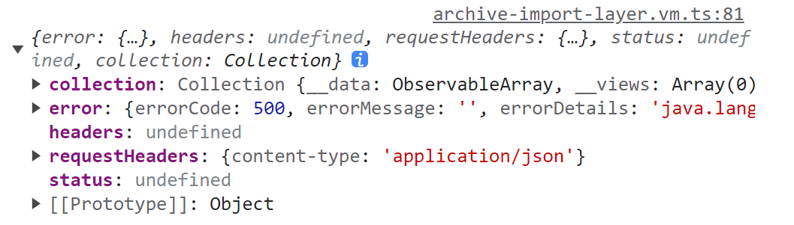
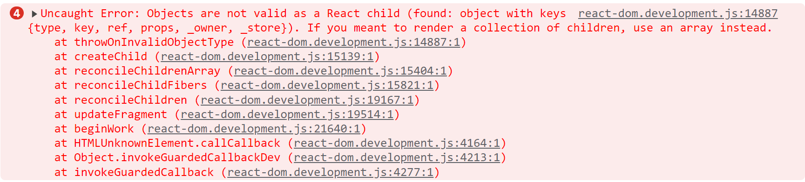

# 第一章 日常开发记录

## Internship-Log

我昨天的话主要对是档案号方案优化任务的一个分析和开发，今天的话主要是继续这边的一个开发，然后还有打印盒脊的一个接口联调


12月1日-11日：归档方案升级&归档管理统计

12月12日-18日：多组织批量重新归档

12月19日-至今：分类装盒系列升级


## PRD-批量导入升级

### 数据导入页面开发

**数据导入弹窗封装**

目前是中台的 **导入数据** 按钮和PRD-数据导入页面的 **档案导入** 按钮用的是同一个弹窗。因此可以封装成一个弹窗组件合二为一

```md
中台的导入数据按钮的弹窗地址
@accounting-voucher:CurrencyImport
src\plugins\electronic-archive\layers\currency-import.tsx

中台的导入数据按钮的地址
src\plugins\electronic-archive\components\ElectronicArchiveList\CommonPageHeader\CenterBtns.tsx
```

```md
PRD-数据导入页面的弹窗地址
src\plugins\manual-import\layers\archive-import-layer.tsx

新开发的弹窗地址
src\plugins\archive-import\layers\ArchiveImportLayer\index.tsx
```


**档案导入接口**

导入失败的结果，一般是接口参数传递错误导致的。用户端会不会报错。导入成功status为204



```ts
代码位置 src\plugins\archive-import\vms\archive-import-layer.vm.ts
```


**点击档案导入确认按钮**

点击之后进行loading效果，状态轮询（参考 OCR 识别），状态结果为第二步

1. 30s之内查询到成功结果则进行第三步，显示档案导入成功，点击可进入查看详细弹窗，查看成功的列表
2. 30s之内查询到失败结果则进行第三步，显示档案导入失败，点击可进入【导入数据】页面
3. 30s之后还没查询到结果，则进行第三步，显示档案导入时间过长，点击可进入【导入数据】页面

​	

**正在轮询时如果点击关闭键（底部按钮已取消）**


**查看详细列表列的渲染**

```ts
document?.template?.forEach((item) => {
  // 中前台不展示明细字段
  if (!item.hidden && item.type !== 'datalink') {
    columns.push({
      sorter: !vm?.isActiveRelationView && item?.sorter ? { multiple: 1 } : false,
      title: item.label,
      sortOrder: vm?.getSortOrder(document, item.field),
      dataIndex: item.field,
      key: item.field,
      width: renderWidth(item),
      ellipsis: { showTitle: false },
      render: (value, record) => renderTemplateTableItem({ value, record, templateItem: item, vm })
    })
  }
})
```


### 导入模板库页面开发

查询接口联调，表单过滤数据需要使用统一 format

```ts
  getListData = async (options?: { pageNum?: number }) => {
    const { pageNum } = options || {}
    this.loading = true
    const filterBy = formatFilterBy({
      data: this.filterValue,
      dictMap: {
        name: FilterByDictMapValue.contains,
        filingTime: FilterByDictMapValue.dateRange,
        rebateNumber: FilterByDictMapValue.contains,
        invoiceNumber: FilterByDictMapValue.contains,
        rebateTime: FilterByDictMapValue.dateRange,
        operatorId: FilterByDictMapValue.contains,
        financeManager: FilterByDictMapValue.contains,
        status: FilterByDictMapValue.select
      }
    })
    if (pageNum) {
      this.currentPageNum = pageNum
    }
    const data: any = {
      limit: {
        start: ((pageNum || this.currentPageNum) - 1) * this.pageSize,
        count: this.pageSize
      }
    }
    if (filterBy) data.filterBy = filterBy

    const result = await searchDocumentFilingList(data)
    this.loading = false
    if (result.data) {
      this.tableDatas = result.data as any[]
      this.totalCount = result.meta.count
    }
    return result
  }
```


模板 Excel 导入规则

```ts
数据导入填写须知：
<1> 字段标记为（必填）是必填字段，导入时会校验必填性
<2> 时间字段按照【yyyy-MM-dd】格式填写，需要精确时分秒导入按照【yyyy-MM-dd HH:mm:ss】格式填写 ; 会计期间字段按照【yyyyMM】格式填写
<3> 导入Excel模版的单元格属性默认为文本，不要修改单元格属性，避免读取数据和实际填写数据存在格式差异
<4> 导入excel表格的表头字段严格按照生成导入模版格式，不可自行删除、修改否则无法正确导入数据
<5> 需要导入的数据包含分录或明细字段时，主表字段可只填入首行或每行重复填写，但主键字段和必填性字段每行不可为空
<6> 单次模版批量导入的数据量限制5000条
```


###  addRequestUrlCorpId*

目前是志强哥这边开发的分支已经产生冲突，不过还好只针对下载文件问题，已知改动点：

1. src\plugins\common\components\Fields\FieldHasDownloadBtn\index.tsx（无冲突）

```ts
const downloadHandler = () => {
  downloadFile(
    addRequestUrlCorpId({
      requestUrl: `${downloadUrl}/$${value}`,
      params: {
        'ea-token': session.get('ea-token')
      }
    })
  )
}
```

2. src\plugins\import-template-library\components\Operation.tsx（下载档案模板，他那边改的是原文件）

```ts
// 替换前
const downloadHandler = () => {
  downloadFile(
    `/api/directory/v1/preDocumentUploadTemplate/template/$${record.id}?corpId=${session.get(
      'ea-corpId'
    )}&ea-token=${session.get('ea-token')}`
  )
}
```

```ts
// 替换后
const downloadHandler = () => {
  downloadFile(
    addRequestUrlCorpId({
      requestUrl: `/api/directory/v1/preDocumentUploadTemplate/template/$${record.id}`,
      params: {
        'ea-token': session.get('ea-token')
      }
    })
  )
}
```


### 后期测试 Debug

查看详细列表的金额字段可能是一个对象，就这一个字段记得需要特殊处理一下


## PRD-归档方案升级

### 业务组织组件替换

目前业务较多，还是替换不了... 到时候到哪里要升级了在替换吧。归档方案弹窗这里可以先替换

业务组织选择就是一个数组，然后包含业务组织 id

```ts
{
  label: getI18n('业务组织'),
  type: 'select',
  field: 'affiliation',
  optional: false,
  multiple: true,
  withEditMultiple: true
},
{
  label: getI18n('业务组织'),
  type: FORM_TYPE.legalEntity,
  field: 'affiliation',
  placeholder: '请选择业务组织',
  multiple: true,
  treeCheckable: true,
  maxTagTextLength: 16,
  isAllAffiliation: false,
  legalRolePermissionData: globalCommonStore?.legalRolePermission || []
}
```


### 接口提供记录

1. 编辑归档任务：提供编辑归档任务接口
2. 批量重新归档：提供批量重新归档接口


## PRD-分类装盒升级

### 接口提供记录

1. 导入装盒清单：导入清单接口、查询导入清单结果接口

2. 管理实物档案类型：查询选择的管理实物档案类型接口，提交弹窗选中的管理实物档案类型接口

3. 打印档案盒脊模板（档案目录页面）：获取档案盒脊模板选项接口、支持提交档案盒脊模板接

   


# 第二章 electronic-archives

**注意事项：**

1. 需要重新启动服务的情况：修改新增路由配置、编译出现问题修复之后也必须重新编译
2. 本地没有问题，但是当合并代码的时候出现问题则需要对比一下哪些文件有修改就行了！！
2. 公司镜像设置

```bash
$ yarn config set registry https://npm.ekuaibao.com/ # 公司镜像
$ yarn config set registry http://registry.npm.taobao.org/ # 淘宝
```

4. antd 底层是 3.9 版本


**测试环境发版：**

1. 先将代码合并到 develop 分支，测试环境一般就是启动这个分支的代码
2. 进入 https://ci.ekuaibao.com/v1/projects/detail/efile/detail 的 ea-test-web-flow 的项目进行发版
2. 前端发版流程：https://hose2019.feishu.cn/docx/doxcnIWjoMucTtQRehkFDpM23nh


**预发环境发版：**

1. 本地代码开发完成后，合并一下最新的 master
2. 然后在此条分支上新建预发分支，命名规则：`hotfix/20231102-master`
3. 修改 Tag 为最新版本，提交并推送到远程仓库
4. 下载 `npm i jh-tag -g`，执行命令 `yarn tag:pre`，远程仓库会自动根据最新的 Tag 进行打包
5. https://dashboard.dev.qhose.net/efile-pre/clusters/default/projects/efile-apps/deployments/website/resource-status 更新配置文件的 Tag 版本后会自动重新部署


## 2.1 使用 MobX 流程
### 2.1.1 Mobx 开发介绍

项目使用 Mobx5 进行对一个页面的数据仓库的管理，一个页面仓库就是一个 vm，本质是一个类实例

在当前页面文件夹下创建 vms 文件夹存储 MobX vm：新建 `ekb-collection.vm.ts`

```ts
import { action, observable, reaction } from 'mobx'
import { fetchCollectionSourceList } from '@/servers/collection.server'
import { tabPage } from '../ekb-collection'

export class EkbCollectionVM {
  @observable activeTab = tabPage[0].key
  @observable tableList = []
  ......

  @action
  changePageTab = (activeKey) => {
    this.activeTab = activeKey
    if (this.currentPage === 1) this.fetchTableList()
    else this.currentPage = 1
  }

  /** 初始化页面操作 */
  initPage = () => {
    reaction(
      () => [this.currentPage, this.pageSize],
      (data, reaction) => {
        this.fetchTableList()
      },
      { fireImmediately: true }
    )
  }

  /** 获取表格数据 */
  fetchTableList = async () => {
    let res = null
    const limit = { start: (this.currentPage - 1) * this.pageSize, count: this.pageSize }
    this.loading = true
    switch (this.activeTab) {
      case tabPage[0].key:
        res = await fetchCollectionSourceList({ limit })
        break
      case tabPage[1].key:
        res = await fetchCollectionTaskList({ limit })
        break
      default:
        res = await fetchCollectionTaskLog({ limit })
    }
    this.loading = false
    if (res?.data) {
      this.tableList = res.data
      this.totalCount = res?.meta?.count ?? 0
    }
  }
}

export default EkbCollectionVM
```


最外层页面组件必须使用类组件，类组件中注入 VM 并实现响应式的方式如下：

```tsx
import EkbCollectionVM from './vms/ekb-collection.vm'
import { inject, provider } from '@ekuaibao/react-ioc'
import { observer } from 'mobx-react'

@provider(EkbCollectionVM) // 提供之后就可以直接this.props访问VM里的属性了
@observer
export class EkbCollection extends React.Component {
  @inject vm: EkbCollectionVM // 注入一下会更方便使用


  render(): React.ReactNode {
    console.log(this.vm)
      
    return (
      <div className={styles['box-wrapper']}>
        <HeaderAction actions={this.renderActions()} />
        <div className={styles['tab-content']}>
          <TableListComponet />
        </div>
      </div>
    )
  }
}
```


页面组件内部的子组件用函数组件，注入 VM 并实现响应式的方式如下（前提是外层的页面组件注入了 VM）：

```tsx
import { useInstance } from '@ekuaibao/react-ioc'
import { useObserver } from 'mobx-react-lite'

export const Operation = (value, record) => {
  const vm = useInstance(EkbCollectionVM)

  return useObserver(() => {
      
    return (
        ......
    )
      
  })
}
```


在 VM 注入一个其他的 VM 方式如下：

```ts
import LayoutVM from '@/plugins/layout/vms/layout.vm'
import FormTestVM from './formTest.vm'
import { inject } from '@ekuaibao/react-ioc'

export class TestVM {
  @inject layoutVM: LayoutVM

  // this.layoutVM 直接使用即可
```


打印一个被 Mobx 观察的数组：点击 $mobx 里面的 value 进行查看它的值，而不是看外层的其他数据


### 2.1.2 Mobx 开发问题记录

**toJS 的使用**

对于引用类型的 mobx 对象，如果需要用到它的原生方法，那么最好使用 toJS 转换一下。

```ts
const selectTableData = toJS(selectedRowNodes).flat()
```


**reaction 会一直累加**

当我们再组件初始化时 init 之后会调用 reaction 函数。但是当组件销毁后，vm 实例并不会销毁！因此当组件再次初始化时， init 之后会调用 reaction 函数从而实现累加。

解决方式：统一在最外层组件只调用 vm.init

```tsx
// ArchiveWorkstand.tsx
import React from 'react'
import { observer } from 'mobx-react'
import { provider, inject } from '@ekuaibao/react-ioc'
import ArchiveWorkstandPage from './components'
import ArchiveDetail from './ArchiveDetail'
import ArchiveLogVM from './vms/archive-log.vm'
import ArchiveTaskVM from './vms/archive-task.vm'
import ArchiveManageVM from './vms/archive-manage.vm'
import AutoArchivePlanVM from './vms/auto-archive-plan.vm'
import CachingSkipPages from '@/elements/caching-skip-pages'

@provider(ArchiveLogVM, AutoArchivePlanVM, ArchiveManageVM, ArchiveTaskVM)
@observer
class ArchiveWorkstand extends React.Component {
  @inject archiveTaskVM: ArchiveTaskVM
  @inject autoArchivePlanVM: AutoArchivePlanVM
  @inject archiveManageVM: ArchiveManageVM
  @inject archiveLogVM: ArchiveLogVM

  componentDidMount(): void {
    this.archiveLogVM.init()
    this.archiveManageVM.init()
    this.autoArchivePlanVM.init()
    this.archiveTaskVM.init()
  }

  render() {
    return (
      <CachingSkipPages
        ref={this.archiveTaskVM.pageRef}
        main={<ArchiveWorkstandPage />}
        detail={<ArchiveDetail />}
        destroyDetail={true}
      />
    )
  }
}

export default ArchiveWorkstand
```

```ts
// ArchiveLogVM
@action init = async () => {
  reaction(
    () => [this.pageNumber, this.pageSize, this.filterValue],
    (data, reaction) => {
      this.getTableList()
    }
    // { fireImmediately: true }
  )
}
```

```tsx
// ArchiveLog.tsx
useEffect(() => {
  vm.getTableList()
}, [])
```


## 2.2 接口请求调用流程

**webpack.config.js 配置代理**

```ts
let proxyURL = ''
// proxyURL = 'http://ea.dev.ekuaibao.com.cn/' // dev环境
proxyURL = 'http://ea-test.dev.ekuaibao.com.cn/' // test环境

config.devServer
  .contentBase(path.resolve(process.cwd(), 'src'))
  .host('0.0.0.0')
  // .https(true)
  .port(9966)
  .watchContentBase(true)
  .disableHostCheck(true)
  .proxy([{ context: ['/api/**', '/static/**'], changeOrigin: true, target: proxyURL }])
  .publicPath('/web')
  .stats('errors-only')

module.exports = config.toConfig()
```


**封装接口函数**

1. 一个文件对应一个页面级的接口
2. `endPoint` 使用通用型 `BASE_API`，`action` 为接口定义 `URL`
3. 项目使用  `app.collection.request` 或 `alovaRequest` 调用接口

```ts
import { app } from '@ekuaibao/whispered'
import { DIRECTORY_V1 } from '@/lib/baseApi'

/**
 * 获取采集来源页面的表格数据
 * @see https://console-docs.apipost.cn/preview/......
 */
export const fetchCollectionSourceList = ({ limit }: { limit: PaginationOpts }) => {
  return app.collection.request(DIRECTORY_V1, {
    action: '/collection/queryCollection',
    method: 'POST',
    data: { limit }
  })
}
```

```ts
export interface IRequestOptions {
  headers?: Record<string, string>;
  data?: object;
  params?: Record<string, string | number | boolean>;
  action?: string | ((url: string) => string);
  method?: IRequestMethod;
  skipCache?: boolean;
  skipRevert?: boolean;
}
```


**接口响应分析**

1. 接口响应成功的返回类型
   1. data：通常响应的数据会直接封装到这个对象里，但是如果是 items 则直接等于
   2. meta：如果响应为一个 value 或 id 时，则直接封装在这个对象里面
   3. error：接口响应成功但是后端返回错误信息，拦截器会直接 message.error

```ts
export interface IRawResponse {
  dataType?: RESPONSE_DATATYPE;
  data?: IRawModel | IRawModel[] | null; // 响应成功的数据，为一个对象
  meta?: Record<string, any>; // 
  modelType?: IType;
  collection?: PureCollection;
  error?: any;
  headers?: Headers;
  responseHeaders?: Headers;
  requestHeaders?: Record<string, string>;
  status?: number;
}
```

2. 接口响应失败的返回的类型

```ts
export interface IErrorResponseData {
  code: number;
  data: any;
  errorCode: number;
  errorMessage: string;
}
```


**实际使用案例**

```ts
const result: any = await importPackingList(uploadFile.id, template)
if (result?.error) {
  this.stepCurrent = 2
  this.importErrMessage = result.error
  this.resultState = ImportPackingListResult.FAILURE
  return
}
if (result?.data) {
  this.stepCurrent = 1
  this.currentImportId = result.data?.id
}
```


## 2.3 存储路由数据流程

当我们在左侧菜单来回切换页面的时候，将页面中的数据存储的的方式如下：

利用 Layout 组件里面的 Layout.vm，因为每个页面都会包含一个 Layout 组件

代码参考 `src/electronic-archive/electronic-archive.vm.ts`

```ts
// 首先注入
import LayoutVM from '@/plugins/layout/vms/layout.vm'
import { inject } from '@ekuaibao/react-ioc'
import { getFrontRoute } from '@/lib/utils'

export default class ElectronicArchiceVM extends DocumentV2VM {
  @inject('collection') collection: Collection
  @inject layoutVM: LayoutVM
  ......
  
  
  // 在路由中存储templateAndPath数据
  recordTemplateAndPath = (template, path) => {
    const route = getFrontRoute()
    this.layoutVM.changeGroupTabsListAttr({
      route,
      key: 'templateAndPath',
      value: { filterTemplate: template, path }
    })
  }

  // this.layoutVM.currentGroupTabList 这个变量存的是所有路由页面存储的数据
  getTemplateAndPath = () => {
    const route = getFrontRoute()
    const cacheRouteData = this.layoutVM.currentGroupTabList?.find((item) => {
      return item?.route === route 
    })

    if (cacheRouteData?.templateAndPath) return tcacheRouteData?.templateAndPath
    else return {}
  }  
```


具体源码实现可以去 `@/plugins/layout/vms/layout.vm` 查看


## 2.4 FormGenerator 组件

### 2.4.1 表单组件的基本使用

使用一个表单组件，只需要配置一个 formComponents 对象即可 

整个表单组件路径：`src\plugins\common\components\index.ts`

FormGeneratorProps：`src\plugins\common\components\types.ts`

```tsx
  <FormGenerator
    formRef={formRef}
    isDraft={true}
    span={24}
    itemLayout={{
      labelCol: { span: 6 },
      wrapperCol: { span: 18 }
    }}
    // 下面两个属性一般需要加上，规范了表单的宽度和高度
    noTransferDir={true}
    noFullHeight={true}
    components={this.renderComponents()}
    selectOptionsData={{
      collectingStatus: this.radioOptions
    }}
  />
```


renderComponents 函数返回一个表单单项的配置

对应属性 components，参数 FormComponentModel：：`src\plugins\common\components\types.ts`

```tsx
  renderComponents = () => {
    const components: any[] = [
      {
        type: FORM_TYPE.radioGroup,
        field: 'collectingStatus',
        label: getI18n('状态'),
        optional: true,
        direction: 'horizontal'
      },
      {
        type: FORM_TYPE.text,
        field: 'collectingName',
        label: getI18n('采集源名称'),
        optional: true
      },
      {
        type: FORM_TYPE.text,
        field: 'collectingCode',
        label: getI18n('采集源编码'),
        optional: false
      }
    ]

    return components
  }
```


对表单的校验和输入默认值通过 formRef 进行设置，一下代码是在 VM 中写的

```ts
// 设置表单值
this.formRef.current.setFieldsValue({
  collectingStatus: data?.status,
  collectingName: data?.name,
  collectingCode: data?.code
})

// 校验表单
const formValue = await this.formRef.current.validateFields()
```


设置某些表单项只读（禁用），并设置初始化的值

```tsx
import { FormInstance } from 'antd/lib/form'
formRef = React.createRef<FormInstance>()
this.formRef.current?.setFieldsValue({
    documentNumberCode: '123'
})

<FormGenerator
    formRef={formRef}
    disabledItems={['documentNumberCode']}
 />
```


设置某些表单项的自定义规则，直接添加一个 rules  属性即可

规则定义参考：https://ant-design.antgroup.com/components/form-cn#rule

```ts
  {
    type: FORM_TYPE.text,
    field: 'documentNumberCode',
    label: getI18n('档案盒号'),
    optional: true,
    rules: [
      { pattern: /^\w+$/, message: '用户名只能是字母数字下划线' },
      { required: true, message: '用户名不能为空！' }
    ]
  },
```


### 2.4.2 自定义表单单项流程

以 FieldTextInput 组件为例，它是一个默认 text 输入框的表单单项，整体渲染流程如下：

我们也直接通过一个配置渲染出来：

```tsx
renderComponents = () => {
  const components: any[] = [
    {
      type: FORM_TYPE.text,
      field: 'collectingStatus',
      label: getI18n('状态'),
      optional: true,
      direction: 'horizontal'
    },
  ]

  return components
}

<FormGenerator
  components={this.renderComponents()}
/>  
```


首先我们进入 `src\plugins\common\components\Fields\index.tsx`，这是表单单项组件渲染入口文件

```tsx
export const renderField = (opts: RenderFieldOpts) => {
  const {
    item, // 这个变量就是我们定义的components对象，类型为FormComponentModel
    data,
    isDraft,
    disabledDateObj,
    disabledItems = [],
    value,
    warnings,
    customRenderField,
    previewMode,
    readOnlyFormList = [],
    observerData
  } = opts
}
```

> 该渲染函数在 FormGenerator 中被使用，所以传入的不止是 item：components 配置项


根据 item.type 进行组件匹配，props 基本是将 item 的配置参数依次传入即可

```tsx
import FieldTextInput from './FieldTextInput' 

switch (item.type) {   
    case FORM_TYPE.text:
      return (
        <FieldTextInput
          {...getAntdOptions(item)} // 包装过滤item的一些基本参数然后依次传入 
          style={item.style}
          placeholder={placeholder.text} // placeholder由一个封装好的函数获得
          disabled={disabled}
          maxLength={item.maxLength}
          prefix={item.prefix}
          suffix={item.suffix}
          readOnly={isReadOnly}
          tipsEnable={item.tipsEnable}
          tipsPlacement={item.tipsPlacement}
          customizeBtn={item.customizeBtn}
        />
      )
 }
```


接下来就是写 FieldTextInput 组件了：src\plugins\common\components\Fields\FieldTextInput\index.tsx

这个组件获取的 props 参数可以获取所有的**基础配置参数**，另外还可以定义自己独有的参数

位置：`src\plugins\common\components\types.ts` FormItemCommonProps、CustomRenderFieldOpts

```tsx
interface FieldTextInputProps extends FormItemCommonProps {
  disabled: boolean
  maxLength: number
  prefix?: React.ReactNode
  suffix?: React.ReactNode
  customizeBtn?: React.ReactNode
  size: SizeType
  allowClear: boolean
  onPressEnter: any
}

const FieldTextInput = ({
  value,
  onChange, // 回馈的表单单项的值
  style,
  placeholder,
  disabled,
  readOnly,
  maxLength,
  prefix,
  suffix,
  tipsPlacement,
  tipsEnable,
  customizeBtn,
  size,
  allowClear,
  onPressEnter
}: FieldTextInputProps) => {
    ......<Input />
}
export default FieldTextInput
```


这就是由一个 item 配置对象生成一个表单单项的大致流程

```tsx
  {
    type: FORM_TYPE.text,
    field: 'collectingStatus',
    label: getI18n('状态'),
    optional: true,
    direction: 'horizontal'
  },
```

> 参数类型经过 renderField 封装之后接收到的参数为  FormItemCommonProps + FieldTextInputProps


### 2.4.3 自定义标签输入框布局

水平布局通用，直接通过 `flex` 属性设置：

1. FormGenerator 默认设置 label 宽度为 80 px，input 为 auto
2. 通过 `itemLayout` 属性自定义设置：

```ts
itemLayout: { labelCol: { flex: '95px' }, wrapperCol: { flex: 1 } }
```


通过栅格布局的 `span` 进行设置

1. 在 FormGenerator 中设置 `span: 24`，锁定整行占 24 位。item 自己可以自行设置 span
2. 通过 `itemLayout` 属性自定义设置：

```ts
itemLayout: { labelCol: { span: 12 }, wrapperCol: { span: 12 } } // 对半分
```


### 2.4.4 表单过滤数据规范化

**filterBy 规范**

filterBy 通常用于查询一个列表的时候，当我们使用模板生成了头部检索组件

```ts
export const searchComponents = [
  {
    type: FORM_TYPE.documentType,
    field: 'directoryFormId',
    label: getI18n('档案类型'),
    optional: true
  },
  {
    type: FORM_TYPE.dateRange,
    field: 'updateTime',
    label: getI18n('更新时间'),
    optional: true,
    picker: 'date'
  },
  {
    type: FORM_TYPE.text,
    field: 'name',
    label: getI18n('模板名称'),
    optional: true
  },
  {
    type: FORM_TYPE.personnelSelect,
    field: 'operatorId',
    label: getI18n('操作人'),
    optional: true
  }
]
```


则定义 **filterBy** 发送请求时也需要规范化数据，**主要是学会 formatFilterBy 函数的使用**

```ts
import { FilterByDictMapValue, formatFilterBy } from '@/lib/tools/formatFilterBy'

const data = {
  limit: {
    start: (this.currentPageNum - 1) * this.pageSize,
    count: this.pageSize
  },
  filterBy: formatFilterBy({
    data: this.filterValue,
    dictMap: { // 字段类型format
      name: FilterByDictMapValue.contains,
      updateTime: FilterByDictMapValue.dateRange,
      operatorId: FilterByDictMapValue.select,
      directoryFormId: FilterByDictMapValue.select,
      active: FilterByDictMapValue.boolean
    },
    keyPath: { // 字段映射 directoryFormId -> directoryFormId.id
      directoryFormId: 'directoryFormId.id'
		}
  })
}
```


如果不用什么特殊处理的话，可以根据表单模板直接一键生成 filterBy

```ts
const filterBy = formatFilterBy<FilterValueData>({
  data: this.filterValue,
  fieldComponents: getComponents() as any
})
```


**弹窗表单数据规范**

当我们要提交一个弹窗的时候，传入 data 中的数据部分参数可能需要格式化一下。通常根据 `item.type` 格式化表单数据

```ts
import { components } from '../../vms/history-archive-columns'
import { parseValue, parseField } from '@/plugins/common/components'

const values: any = await this.formRef.current.validateFields()
const formValue = parseValue(components, values) // components为静态写的表单模板
```


### 2.4.5 自定义表单单项进阶

Form.Item 不应该加 noStyle，因为 Form 表单版本太低，导致当错误校验的时候输入框也没有样式了！！

应该替换成给 Form.Item 加 style 内联样式来自定义


#### **2.4.5.1 多个输入框处理**

我们之前定义一个表单单项都是一个输入框的情况，现在我们要处理一个表单单项对应多个输入框的进阶情况。

1. 依然使用 value、onChange 作为数据的响应状态
2. 增加 Form.Item 对通过 name 属性多个输入框进行监控
3. 使用 Form.Item 的其他属性，可针对某个输入框做其他校验规则（如 rules 自定义规则）

用例组件位置：`src\plugins\common\components\Fields\FieldOperationConfig\index.tsx`

```tsx
useEffect(() => {
  const _value = value || {}
  setPlanState(isEmpty(_value.operatingPlan) ? false : true)
  setMediumState(isEmpty(_value.documentMedium) ? false : true)
}, [value])

/** 获取业务检测方案选项 */
const getPlanOptions = async () => {
  const result = await fetchTestProgramList({
    query: { limit: { start: 0, count: 10000 } }
  })
  if (result.data) {
    const operatingPlanOptions = result.data
      .filter((item) => item?.state !== 'STOP') // 过滤未开启的
      .map((item) => ({
        label: item?.name,
        value: item?.id
      }))
    setPlanOptions(operatingPlanOptions || [])
  }
}


(<Form.Item
  noStyle
  name={[field, 'operatingPlan']}
  rules={[{ required: true, message: '请勾选需检测的业务方案' }]}
>
  <Select
    allowClear
    mode="multiple"
    maxTagCount="responsive"
    maxTagTextLength={18}
    optionFilterProp="label"
    disabled={disabled}
    value={value?.operatingPlan}
    onChange={operatingPlanChange}
    style={{ width: '100%' }}
    options={planOptions}
    placeholder="请勾选需检测的业务方案"
  />
</Form.Item>)
```

> 注意 name 字段是关键，将多个自定义输入框映射到这个组件的表单中


#### 2.4.5.2 **自定义校验规则处理**

有的时候我们要在自定义时刻对某个表单单项进行自定义校验，并且提示信息在自定义位置

1. 通过 validateStatus 属性对 Form.Item 进行状态设置
2. 参考组件位置：`src\plugins\common\components\Fields\FieldRange\index.tsx`


#### 2.4.5.3 日期组件禁用规则

看下 FormGenerator 这段代码的使用

```tsx
disabledDateObj={{
  accountingPeriod: (current) => {
    // 当前月份（包含当前）之后的月份都禁用
    return current > moment().subtract(1, 'month').endOf('month')
  }
}}

{
  label: getI18n('会计周期'),
  type: FORM_TYPE.periodRange,
  field: 'accountingPeriod',
  picker: pickerConfig?.picker || 'month',
  optional: false
}
组件位置：src\plugins\common\components\Fields\FieldDateRange\index.tsx
```


由此 FORM_TYPE.periodRange 组件会得到 disabledDate 的值，为一个回调函数：

```ts
(current) => {
  // 当前月份（包含当前）之后的月份都禁用
  return current > moment().subtract(1, 'month').endOf('month')
}
```

> `moment().subtract(1, 'month').endOf('month')` 指的是上个月的最后一天


#### 2.4.5.4 后端返回生成表单

支持函数：`src\lib\tools\formGenerator_utils\form_search_utils.ts`


#### 2.4.5.5 customRenderField 

自定义扩展渲染item组件，优先使用扩展组件，返回null内部查找合适组件。这样就直接是页面级构建自定义表单单项组件了，而不是要去全局封装组件！

但是会造成一个问题：当渲染表单的函数动态变化时，该组件会重新渲染。而如果是内置封装的函数就不会重新渲染。

**因此需要做出取舍：**比如你在组件内部发送了请求，那么表单动态变化时就会重新发送请求，因为组件重新渲染了！

参考代码：`src\plugins\testprogram-config\layers\check-program\CheckProgramMain.tsx`、`src\plugins\auto-archive\layers\CustomFormItem`


### 2.4.6 formHelp 的使用

参考组件：`src\plugins\archives-box\layers\AddArchivesBoxLayer\hook.tsx`


## 2.5 TableWrapper 组件

该组件有个最小高度，小于该高度超出的部分会被隐藏。而并不能在自适应！


### 2.5.1 TableWrapper 的使用

渲染一个表格组件，必填项：columns、dataSource，数据由后端返回，服务于 columns 每一项的 key

**columns 参考如下：**

```ts
// 列表表格的columns
export const getColumns = () => {
  const columns: ColumnType<any>[] = [
    {
      title: getI18n('档案盒号'),
      dataIndex: 'documentNumberCode',
      key: 'documentNumberCode',
      width: 160,
      sorter: {
        compare: (a, b) => {
          return tableSorterStr(a?.documentNumberCode, b?.documentNumberCode)
        },
        multiple: 1
      },
      render: (data) => data ?? '-'
    },
    {
      title: getI18n('档案盒类型'),
      dataIndex: 'directoryFormId',
      key: 'directoryFormId',
      width: 110,
      render: (data) => data?.name ?? '-'
    },
  ]

  return columns
}
```


**TableWrapper 同时支持插入一个头部搜索组件，本质为一个表单**

```ts
header={{
  ......
  form: {
    formRef: searchFormRef,
    onSearch: searchData,
    components: formComponets
  }
}}
```

当一个表单作为表格头部的搜索栏时，components 配置可以不需要 type 属性，而是指定一个 **filterType** 属性进行表单单项的渲染


**还支持在表格上面左侧添加一些按钮**

```tsx
tableHeader={<TableHeaderBtn />}
```


**TableWrapper 同时支持分页器功能**

```tsx
pagination={{
  total: totalCount,
  current: currentPage,
  pageSize: pageSize,
  onChange: updateListPage
}}
```


**渲染 TableWrapper**

```tsx
  <TableWrapper
    className={styles['table-wrap']}
      
    header={{
      form: {
        formRef,
        onSearch: searchData,
        components: formComponets
      }
    }}
   
    tableHeader={<TableHeaderBtn />}  
      
    columns={getColumns()}
    dataSource={tableDatas}
   
    isShowTableHeader
    loading={loading}
    bordered={true}
    size="small"
    resize={false}
    pagination={{
      total: totalCount,
      current: currentPage,
      pageSize: pageSize,
      onChange: updateListPage
    }}
      
    emptyText={getI18n('当前档案盒为空')}
  />
```


### 2.5.2 标准 TableWrapper

index.tsx

```tsx
import React, { useEffect } from 'react'
import { getI18n } from '@/lib/tools/i18n'
import { FORM_TYPE } from '@/lib/consts/formType'
import { useInstance } from '@ekuaibao/react-ioc'
import { useObserver } from 'mobx-react-lite'
import TableWrapper from '@/elements/table-wrapper'
import ArchiveLogVM from '../../vms/archive-log.vm'
import { archiveTypeOptions, archiveTaskStateOptions } from '../../consts'
import { formatYearMonth, renderTooltip } from '@/lib/utils'

const ArchiveLog = () => {
  const vm = useInstance(ArchiveLogVM)

  useEffect(() => {
    vm.init()
  }, [])

  /** filter表单 */
  const renderComponents = () => {
    return [
      {
        type: FORM_TYPE.documentType,
        field: 'documentTypeName',
        label: getI18n('档案类型'),
        optional: true
      },
      {
        type: FORM_TYPE.affiliation,
        field: 'affiliationName',
        label: getI18n('业务组织'),
        optional: true
      },
      {
        type: FORM_TYPE.yearMonth,
        field: 'accountingPeriod',
        label: getI18n('归档数据范围'),
        picker: 'month',
        optional: true
      }
    ]
  }

  /** 表格columns */
  const getTableColumns = () => {
    return [
      {
        title: getI18n('业务组织'),
        dataIndex: 'affiliationName',
        render: (value, record, index) => {
          return renderTooltip(value)
        }
      },
      {
        title: getI18n('档案类型'),
        dataIndex: 'documentTypeName',
        render: (value, record, index) => {
          return renderTooltip(value)
        }
      },
      {
        title: getI18n('归档数据范围'),
        dataIndex: 'accountingPeriod',
        render: (value, record, index) => {
          return value
        }
      },
    ]
  }

  return useObserver(() => {
    const { searchBarRef, tableData, total, pageNumber, pageSize, tableLoading, changeFilterValue, changePagination } =
      vm

    return (
      <TableWrapper
        header={{
          form: {
            formRef: searchBarRef,
            components: renderComponents(),
            onSearch: changeFilterValue
          }
        }}
        size="small"
        isShowTableHeader={false}
        loading={tableLoading}
        columns={getTableColumns()}
        dataSource={tableData}
        pagination={{ total, current: pageNumber, pageSize, onChange: changePagination }}
      />
    )
  })
}

export default ArchiveLog
```

index.vm.ts

```ts
import React from 'react'
import { observable, reaction, action } from 'mobx'
import { FormInstance } from 'antd/lib/form'
import { fetchArchiveLogList } from '@/servers/autoArchive.server'
import { FilterByDictMapValue, formatFilterBy } from '@/lib/tools/formatFilterBy'

export default class ArchiveLogVM {
  /** 表格loading状态 */
  @observable tableLoading = false
  /** 表格数据 */
  @observable tableData = []
  /** 表格的筛选项的值 */
  @observable filterValue: Record<string, any>
  /** 表格数据总条数 */
  @observable total = 0
  /** 分页器当前页码 */
  @observable pageNumber = 1
  /** 分页器当前页展示数据条数 */
  @observable pageSize = 20
  /** 搜索栏的ref */
  searchBarRef = React.createRef<FormInstance>()

  @action init = async () => {
    reaction(
      () => [this.pageNumber, this.pageSize, this.filterValue],
      (data, reaction) => {
        this.getTableList()
      },
      { fireImmediately: true }
    )
  }

  /** 分页器变化 */
  @action changePagination = (pageNumber, pageSize) => {
    this.pageNumber = pageNumber
    this.pageSize = pageSize
  }

  /** 监听表格的筛选表单的值变化 */
  @action changeFilterValue = ({ filterValue }) => {
    this.filterValue = filterValue
    this.pageNumber = 1
  }

  /** 获取归档记录列表 */
  @action getTableList = async () => {
    this.tableLoading = true
    const data: any = {
      limit: {
        start: (this.pageNumber - 1) * this.pageSize,
        count: this.pageSize
      }
    }
    const filterBy = formatFilterBy({
      data: this.filterValue,
      dictMap: {
        affiliationName: FilterByDictMapValue.select,
        documentTypeName: FilterByDictMapValue.select,
        accountingPeriod: FilterByDictMapValue.yearMonth
      },
      keyPath: {
        affiliationName: 'affiliation',
        documentTypeName: 'documentType'
      }
    })
    if (filterBy) data.filterBy = filterBy
    const res = await fetchArchiveLogList(data)
    this.tableLoading = false
    if (res?.data) {
      this.tableData = res.data as any[]
      this.total = res?.meta?.count
    }
  }
}
```


## 2.6 新建 layer 弹窗流程

页面文件夹中配置一下

```ts
export default [
  {
    id: '@test',
    path: '/test',
    ref: '/',
    onload: () => import('./test')
  },
  {
    point: '@@layers',
    prefix: '@test',
    onload: () => require('./layers').default
  }
]
```


新建 layers 文件夹，每一个弹窗页面在单独作为一个文件夹，在最外层写一个所有的弹窗配置

内部配置参数参考 antd  modal：https://ant-design.antgroup.com/components/modal-cn#api

有一个生成默认弹窗参数的函数： getModelDefaultOptions

```ts
// layers/index.ts
import { getModelDefaultOptions } from '@/lib/layerOptions'
import { getI18n } from '@/lib/tools/i18n'

export default [
  // //配置方式一
  {
    key: 'TestLayer',
    getComponent: () => import('./TestLayer'),
    enhancerOptions: {
      title: '',
      footer: null,
      bodyStyle: { padding: 0, display: 'flex', flexDirection: 'column' }
    },
    maskClosable: true,
    width: 800
  },
    
  // 配置方式二
  {
    ...getModelDefaultOptions({
      hiddleHeader: true,
      enhancer: 'drawer'
    }),
    key: 'AddTestBoxLayer',
    getComponent: () => import('./AddTestBoxLayer'),
    maskClosable: true,
    width: 800
  }
]
```

> getModelDefaultOptions 封装了一些默认参数，可以代替 enhancerOptions
>
> enhancerOptions 将一些参数做了一个整合，但像 width、maskClosable 这两个常用参数就放在外面
>
> 弹窗页面一般都是隐藏 modal 框的头部和底部的，组件里面自己会写头部和底部


AddTestBoxLayer/index.tsx：固定最外层类组件，并命名为 PreviewLayer，注入对应的 VM

```tsx
import React, { Component } from 'react'
import AddTestBoxLayer, { AddTestBoxLayerProps } from './hook'
import { provider } from '@ekuaibao/react-ioc'
import { AddTestBoxVM } from '@/plugins/test/vms/add-test-box.vm'

@provider(AddTestBoxVM)
class PreviewLayer extends Component<AddTestBoxLayerProps> {
  render() {
    return <AddTestBoxLayer {...this.props} />
  }
}

export default PreviewLayer
```

**this.props 默认会有一个 layer 对象，用于处理该弹窗**，在打开弹窗时还可以接收其他参数


AddTestBoxLayer/hook.tsx：作为函数组件，且为弹窗主组件

```tsx
import React, { FC } from 'react'
import { useInstance } from '@ekuaibao/react-ioc'
import { useObserver } from 'mobx-react-lite'
import { ILayerProps } from '@ekd/enhance-layer-manager'
import { AddTestBoxVM } from '@/plugins/test/vms/add-test-box.vm'

export interface AddTestBoxLayerProps extends ILayerProps {
  title?: string
}

const AddTestBoxLayer: FC<AddTestBoxLayerProps> = ({ title, layer }) => {
  const vm = useInstance(AddTestBoxVM)

  return useObserver(() => {
    return <div>111</div>
  })
}

export default AddTestBoxLayer
```


**弹出弹窗方式，第二个参数作为 PreviewLayer 入口组件的 props 传入**

**返回结果为弹窗表单的 formValue，怎么做到的？？？都是 app.open 的功劳！**

```ts
onAddTestBox = async () => {
  const result: any = await app.open('@test:AddTestBoxLayer', { title: '添加档案盒' })
  if (result.res) this.resetList()
}
```


**关闭弹窗方式，利用默认传入的 layer 对象**

```tsx
cancelHandler = () => {
  this.props.layer.emitCancel()
}

saveHandler = async () => {
  const res = await this.vm.saveForm()
  if (res) this.props.layer.emitOk({ res })
}
```


## 2.7 全局路由变量与路由跳转

**项目中可以直接使用一个全局路由变量 location**


**路由跳转直接使用这个 API**

```ts
import { goPage } from '@/lib/tools/router_utils'
goPage('/archive-import')
```


**路由拦截功能在这里**

```ts
src\plugins\layout\components\MenuSider.tsx
```


## 2.8 关联规则 LogicFlow

https://npm.ekuaibao.com/-/web/detail/@ekd/flow-rule-editor

https://site.logic-flow.cn/docs/#/zh/


## 2.9 功能组件开发记录

### 2.9.1 自定义 Tooltip

关联状态自定义列渲染：

1. 组件位置：`src\plugins\electronic-archive\layers\linked-layer.tsx`
2. 页面位置：中台 - 详细 - 关联弹窗

业务组织自定义Popover：

1. 组件位置：`src\plugins\auto-archive\components\AutoArchivePlan\columns.tsx`
2. 页面位置：系统管理 - 数据归档 - 业务组织

档案介质自定义tooltip：

1. 组件位置：`src\plugins\directory-specification\vms\base-setting-media.tsx`
2. 页面位置：系统管理 - 档案目录 - 基础字段 


### 2.9.2 列表状态颜色

1. 已上架、未上架：`'var(--success-6)' : 'var(--gray-16)'`
2. 已检测、未检测：`src\plugins\auto-archive\components\ArchiveDetail\ArchiveTestTable.tsx`


# 第三章 eads-admin

## 3.1 项目代码规范

- **在一个代码块里面函数调用只使用一次，并解构**

```ts
// 错误写法！  
const loginValue = await get().getLoginValue(get().currentLoginMethod)

// 正确写法
const { getLoginValue, currentLoginMethod } = get()
const loginValue = await getLoginValue(currentLoginMethod)
```


- **路由路径必须严格对应 view 文件夹下的子路由，必须讨论目录结构，给出对应的规范文档！！**

components 文件夹中有大组件必须使用文件夹！layers 文件夹必须使用文件夹，主要防止后续有其他业务！

```ts
// 外层根路由 
{
  path: '/login',
  component: () => import('@/views/Login')
},
```

```ts
// layout内部路由，直接写在文件夹的router.ts下
{
  path: '/app/home',
  component: () => import('@/views/Home'),
},
```


**样式问题：变量添加 --eui 后还是无效，则直接查看老项目把值给定死！**


**进行表单校验必须使用 try - catch，不然会报底层错误**

```ts
  try {
    const res = await ref.current?.validateFields()
    console.log('res', res)
  } catch (error) {
    console.log('', error)
  }
```


**必须考虑性能优化，避免一个组件重复或多余的渲染！**

```ts
const hasBtnAuthority = useAccountStore((state) => state.hasBtnAuthority)
```


最好利用 type 来区分表单类型，可以使用枚举

```ts
export interface MenuManageLayerProps extends ILayerProps {
  /** 弹窗表单类型 */
  layerType: LayerType
  /** 弹窗标题 */
  title?: string
  /** 父级菜单id */
  parentId?: number
  /** 菜单项 */
  menuItem?: MenuManageListItem
}
```


## 3.2 登录权限拦截功能

**路由配置介绍**

1. 路由组件包裹层级：LazyComponent -> PrivateRoute -> KeepAliveWrapper -> Component
2. 路由权限拦截的功能在 `src\routers\PrivateRoute.tsx` 
3. 路由组件只包括全局路由组件和 layout 路由组件


**登录权限拦截功能**

1. 首次进入页面时，如果用户未登录则跳转到登录页，且不再输出重复消息

2. 当调用一个接口时发现登录过期，也跳转到登录页且不再输出重复消息

```ts
  // 最开始调用的函数
  getUserPermissionInfo: async () => {
    const res = await fetchUserPermissionInfo()
    if (res.error) {
      showNetErrorMsg(res)
      return false
    }
    if (!res.data) {
      const { userLogout } = get()
      message.error(res.msg)
      userLogout()
      return false
    }

    set({ roles: res.data.roles, user: res.data.user, isUserLogin: true })
    const permissionsArr = res.data.permissions
    for (let index = 0; index < permissionsArr.length; index++) {
      set((state) => ({ permissions: new Map(state.permissions).set(permissionsArr[index], true) }))
    }
    return true
  },
```

```ts
  init: async () => {
    const { getNavMenuList } = get()
    const { idleInit } = useGlobalCommonStore.getState()
    const { getUserPermissionInfo } = useAccountStore.getState()

    // 首次进入页面
    const res = await getUserPermissionInfo()
    if (res) {
      getNavMenuList()
      idleInit()
    }
  },
```


**实现发送请求后的 message 输出**

消息输出分为三个类型：请求失败、后端返回 msg、后端返回成功的数据（无 msg）`src\utils\utils.tsx`

初始化页面时有多个请求下，通过判断 isUserLogin 来阻止请求失败消息的同时输出。同时在 getUserInfo 函数中特殊登录问题的处理消息输出，避免输出 “用户未登录” 的重复信息，**后端应该修改 “账号未登录” 字段成“登录过期，请重新登录”，语义化更强！**

1. 请求失败处理函数

```ts
export const showFetchErrorMsg = (res: ResponseDataType) => {
  const { isUserLogin, userLogout } = useAccountStore.getState()
  if (!isUserLogin) return

  if (res.msg && !res.error) {
    // 如果登录过期则执行退出登录
    if (res.code === 401) userLogout()
    message.error(res.msg)
    return
  }
  showNetErrorMsg(res)
}
```

2. 后端返回成功的数据：直接个性化输出业务消息

```ts
const res = await fetchAuthMenuList()
if (!res.data) {
  showFetchErrorMsg(res)
  return
}

message.success(msg)
... // 其他业务
```


**RequestCatchServer 通用缓存类**

当获取短时间内不会更新的后端数据时，可以走缓存函数：

https://npm.ekuaibao.com/-/web/detail/@ekd/fe-pangu-utils

```ts
  /** 获取在线预览文件解析url */
  getDocLink = async () => {
    const catchResData = await catchServer.deltaCatchFn({
      key: DB_CATCH_KEYS.docLink,
      fn: async () => {
        const res: any = await getDocLinkHost()
        if (res?.data) {
          return res.data?.host
        }
        return null
      },
      callback: (data) => {
        window.docLink = data
      },
      diffDataFn: (oldData, newData) => {
        if (oldData === newData) return false
        return true
      }
    })
    window.docLink = catchResData
  }
```


## 3.3 菜单管理页面开发

**规范菜单属性字段 path、component**

后期需要规范菜单的 path 或 component 唯一化，并且字段要符合 ` authority` 或 `app/system/menu` 格式

菜单类型为目录则只需要填 path（目录路径标识），为菜单的话需要填 component（组件位置）

字段规范化之后，前端这段定制化代码就可以删除


**菜单类型的理解**

后端把 **目录、菜单、按钮** 的管理统称为菜单管理，而根据菜单类型来进行菜单区分

按钮里的**菜单查询**对应的就是在侧边导航栏是否实现该菜单目录


**按钮权限标识 permission**

菜单类型为目录或按钮可以选择填写权限标识，但是后端没有做字段规范。

调用接口后，前端获取到的 permissions 为一个存储全部权限标识的数组，在仓库中构造为一个 permissions map，所以当判断是否有某个按钮权限时会更方便，性能会提升。

菜单目录不需要做权限判断，因为用户只会获取到他授权过的菜单目录，所以只需要实现按钮权限功能，使用 AuthorityBase 组件进行权限判断，有权限才渲染按钮。那么有一个场景就是当三个按钮都没有权限时，只有一个空的操作栏就没有意义了。所有要设置为当按钮都没有权限时不渲染操作栏：

- account.store.ts

```tsx
  hasBtnAuthority: (key) => {
    const { permissions } = get()
    // 如果未定义权限或者存在权限都为真
    if (!permissions || !key || permissions.get(key)) return true
    return false
  },

  hasBtnArrAuthority: (keyArr) => {
    if (!keyArr) return { result: false, btnNumber: 0 }
    const { hasBtnAuthority } = get()
    let result = false
    let btnNumber = 0
    for (let index = 0; index < keyArr.length; index++) {
      const hasAuthority = hasBtnAuthority(keyArr[index])
      result = result || hasAuthority
      if (hasAuthority) btnNumber++
    }
    return { result, btnNumber }
  }

```

- Operation

```tsx
Operation.needRender = () => {
  const { hasBtnArrAuthority } = useAccountStore.getState()
  return hasBtnArrAuthority([changeMenuKey, deleteMenuKey, addMenuKey])
}
```

- columns

```ts
  const { result, btnNumber } = Operation.needRender()
  if (result) {
    columns.push({
      title: '操作',
      dataIndex: 'operation',
      key: 'operation',
      fixed: 'right',
      align: 'left',
      width: 55 * btnNumber,
      render: Operation.render,
    })
  }
```

> 操作列的宽度也实现了动态变化


**点击展开全部菜单时，会有一秒渲染延迟，看看可以利用虚拟列表能不能解决！！！**


## 3.4 FormGenerator

**FormGenerator 内部的表单组件实现受控的流程**

表单组件类型继承 FormItemCommonProps，并且内部自行封装 props

```ts
export interface FieldSelectIconProps extends FormItemCommonProps {
  /** 默认选中的图标 */
  defaultValue?: string
}
```

那么在填写表单单项配置时，可以填写的 props 为这些类型：FieldSelectIconProps + FormComponentItem

```ts
{
  type: FORM_TYPE.selectIcon,
  field: 'icon',
  label: '菜单图标',
  defaultValue: 'config'
  optional: true,
},
```

每个表单组件必然接收两个参数：value、onChange，并应用于你的输入框内，那么这样就可以实现： formRef.current 中获取到该表单组件的值。当在输入框内输入值的时候表单组件的 value 会改变，通过使用 onChange(newValue) 也可以直接修改 value 的值！！

```tsx
<Input
  value={value}
  onChange={onChange}
  placeholder={placeholder}
  disabled={disabled}
/>
```


##  3.5 globalCommon

1. globalCommonStore 仓库中存储所有**公共组件**所需的后端接口数据，因此它的初始化时间比较特殊。页面中要用到就在页面里面初始化。多个页面会用到的数据就在这里初始化
2. 这个仓库还存储了一些精简信息列表，供全局页面使用（大部分用于下拉菜单）

```ts
idleInitGlobal: () => {
  const {
    getMenuList,
    getDeptList,
    getDictDataList
  } = get()
  queue.addQueues([
    async () => getDictDataList(),
    async () => getMenuList(),
    async () => getDeptList(),
  ])
},
```


以下是实现在网站空闲进程时初始化 global 数据功能的实现流程：

1. 下载 `yarn add @ekd/fe-pangu-utils`：https://npm.ekuaibao.com/-/web/detail/@ekd/fe-pangu-utils，可能需要切换镜像源，利用 FetchQueue 队列类

2. 直接调用函数即可进行异步进程，这个函数 idleInit 是防止 JS 进程阻塞页面渲染

```ts
const queue = new FetchQueue({ 
  maxNum: 5 // 最大同时可请求数量
})

idleInit: () => {
  const { idleInitFlag, idleInitGlobal, idleInit } = get()
  const startTime = Date.now()
  requestAnimationFrame(() => {
    if (Date.now() - startTime > 16.6 && !idleInitFlag) {
      set({ idleInitFlag: true })
      // Promise.all([getCorporation()]) // 设置优先调用的函数
      idleInitGlobal()
      return
    }
    if (!idleInitFlag) idleInit()
  })
},

idleInitGlobal: () => {......},
```

3. 在 layout 组件中进行页面初始化调用

```ts
init: async () => {
  const { idleInit } = useGlobalCommonStore.getState()
  const { getUserPermissionInfo } = useAccountStore.getState()

  // 首次进入页面
  const res = await getUserPermissionInfo()
  if (res) idleInit()
},
```


## 3.6 TableWrapper

**按照 div 的 class 来区分如下盒子：** 

TableWrapper：表格页面组件，包括顶部搜索、中间按钮和表格

TableMain：表格页面内容区，包括中间按钮和表格

TableContent：包裹表格的盒子，只有表格


**全屏无法显示弹窗，可以将全局页面的id全屏，但是只显示表格页面，然后弹窗在全局生效**


### 3.6.1 表格虚拟列表的配置

首先安装这个库 https://github.com/crawler-django/virtuallist-antd

```bash
$ npm install --save virtuallist-antd
```


编写一个虚拟列表配置项，属性参考文档

```ts
import { VList } from 'virtuallist-antd'

const vc1 = useMemo(() => {
  // 数据量偏小情况，不使用虚拟组件
  if (!isVirtuallist || dataSource?.length < 50) return {}
  const heightValue = scroll?.y ?? _scrollY
  return VList({
    vid,
    height: heightValue,
    resetTopWhenDataChange: false,
  })
}, [_scrollY, dataSource?.length, isVirtuallist, scroll?.y, vid])
```


添加至 table 组件中即可

```tsx
<Table
  ......
  components={{
    ...vc1,
  }}
/>
```


### 3.6.2 监听表格滚动条变化

1. 首先通过监听并计算表格外层盒子的高度得到表格组件可视区的高度 `_scrollY`，也是滚动高度
2. 其次再监听并计算表格内容高度，判断是否超出可视区高度
3. 通过前两条就可以推断出是否需要开启滚动条和 `_scrollY`

```ts
// 监听表格高度变化 自动计算_scrollY
useEffect(() => {
  if (!height && tableWrapper?.current && tableWrapper?.current?.clientHeight > 10) {
    let newScrollY: any = scrollY
      ? Math.max(tableWrapper?.current.clientHeight, scrollY) - overHeight
      : tableWrapper?.current.clientHeight - overHeight

    if (newScrollY < 150) newScrollY = 150 // 最小Y值容错

    // 如果计算出的newScrollY为空或者0，则添加一个200的默认值防止表格没有高度
    newScrollY = handleDiffScrollY({
      newScrollY: newScrollY || 200,
      dataSource,
      scroll,
      tableComponent,
    })
    if (_scrollY !== newScrollY) setScrollY(newScrollY)
  }
}, [
  tableComponent?.current?.clientHeight,
  tableWrapper?.current?.clientHeight,
  reCalCulateHeight,
  height,
  scrollY,
  overHeight,
  dataSource?.length,
  scroll?.y,
  dataSource,
  scroll,
  _scrollY,
])
```


**还是有缺陷！！！具体去看菜单管理页面**


### 3.6.3 实现表头可拖拽功能

1. 安装 `react-resizable`，https://github.com/react-grid-layout/react-resizable

2. 通过包裹 `Resizable` 可直接实现其内部盒子可拖拽，这边就直接应用到表头上了

3. 学习文档：https://juejin.cn/post/7182423243553734717（后面要处理里面提到的 bug）


先实现一个可拖拽的表头组件：

src\components\TableWrapper\components\TableContent\ResizableTitle.tsx


再给列表设置额外的表头属性 `width`、`onResize`

```ts
const getColumns = useCallback(() => {
  const formatColumns = filterColumns(_columns, _lockedFields, checkedList)
  const resultColumns = formatColumns?.map((col, index) => ({
    ...col,
    // 设置表头额外属性 作为ResizableTitle的props
    onHeaderCell: () => {
      const data: { width: number; onResize?: any } = {
        width: col?.width || 100,
        onResize: (e, { size: sizeValue }) => {
          e.stopImmediatePropagation()
          handleResize(index, sizeValue)
        },
      }
      // 如果该表头为操作栏
      if (!resize || col.dataIndex === 'operation') delete data.onResize
      return data
    },
  }))
  return resultColumns
}, [_columns, checkedList, _lockedFields, resize, handleResize])
```

```ts
/** 表头宽度伸缩时的回调 */
const handleResize = useCallback(
  (index, sizeValue) => {
    const nextColumns = [..._columns]
    nextColumns[index] = {
      ...nextColumns[index],
      width: Math.max(sizeValue?.width, 80),
    }
    setColumns(nextColumns)
  },
  [_columns],
)
```


最后添加到 table 组件上即可

```tsx
import ResizableTitle from './ResizableTitle'

(
  <Table
    ......
    components={{
      ...vc1,
      ...(resize && {
        header: {
          cell: ResizableTitle,
        },
      }),      
    }}
  />
)
```


### 3.6.4 实现操作栏多按钮

当操作栏有大于 3 个按钮时，动态实现按钮显示，多余的按钮放到更多选项里。源码：`TableOperation.tsx`

实例可以参考 `src\views\Skill\Job\components\Operation.tsx`，**该操作列的宽度固定为了 200**


### 3.6.5 rowKey 的作用

我们知道当定义 columns 时需要指定 dataIndex 获取 key，既是映射对应的属性也是作为唯一标识

rowKey 是针对 dataSource 里某个属性作为该行在整个表格的唯一标识。当开启选择功能时，selectedRowKeys 储存的就是 rowKey 对应的属性值。项目里默认为 id，antd 默认为 key


## 3.7 实现导入导出功能

**导出功能的实现**

调用一个导出文件接口，返回一个 blob 对象或者一个包含 error 的对象

```ts
import type { ExportRd } from './types/base.types'

export const exportSensitiveWordList = (queryData?: FetchSensitiveWordList) => {
  const url = '/admin-api/system/sensitive-word/export-excel'
  return request.get<ExportRd>(url, {
    params: queryData,
    responseType: 'blob',
  })
}
```


文件导出功能和消息输出的实现，如果没获取到文件则 blob 对象的 type 为 RES_JSON，不含分页功能

```ts
import { RES_JSON } from '@/utils/request'
import { download } from '@/utils/tools/download'
import { showFetchErrorMsg } from '@/utils/utils'

exportManageData: async () => {
  const { filterValue } = get()
  set({ exportLoading: true })
  const res = await exportSensitiveWordList(filterValue)
  set({ exportLoading: false })

  if (res.error || res.type === RES_JSON) {
    showFetchErrorMsg(res)
    return
  }
  download.excel(res, '敏感词数据.xlsx')
}
```


**导入功能的实现**

封装了导入表单组件：`src\components\FormGenerator\Fields\FieldUploader\index.tsx`

但是用户页导入用户和在线管理页导入应用图标后端都是系统异常。。


## 3.8 实现按钮权限功能

通过一个函数判断是否需要显示列的操作栏，并且还要计算列的宽度。**这个其实是带优化的！**

1. 首先在 useAccountStore 里面定义一个函数判断按钮是否有权限

```ts
// 单个按钮
hasBtnAuthority: (key) => {
  const { permissions } = get()
  // 如果未定义权限或者存在权限都为真
  if (!permissions || !key || permissions.get(key)) return true
  return false
},

// 多个按钮
hasBtnArrAuthority: (keyArr) => {
  if (!keyArr) return { result: false, btnNumber: 0 }
  const { hasBtnAuthority } = get()
  let result = false
  let btnNumber = 0
  for (let index = 0; index < keyArr.length; index++) {
    const hasAuthority = hasBtnAuthority(keyArr[index])
    result = result || hasAuthority
    if (hasAuthority) btnNumber++
  }
  return { result, btnNumber }
}
```


2. 单个按钮：然后在结合 EKBbtn 组件进行单个按钮的判断，如果没权限则不渲染

```tsx
const addKey = AUTHORITY_KEY['系统管理_字典管理_字典新增']
(<EkdButton
  type="primary"
  size="middle"
  icon={<OutlinedTipsAdd />}
  onClick={addItem}
  authorityKey={addKey}
  enableAuthority={true}
>
  新增
</EkdButton>)
```


3. 多个按钮：如果所有按钮都无权限则不显示操作栏或者头部按钮区域

```ts
// 是否显示操作栏
Operation.needRender = () => {
  const { hasBtnArrAuthority } = useAccountStore.getState()
  return hasBtnArrAuthority([changeKey, deleteKey, resetRole, resetPassword])
}
```


## 3.9 表格动态字段更新

有一些表格 column 的字段是动态的，因此需要关注它的初始值和动态更新。以下是几种动态字段的情况

### 3.9.1 独立动态字段

例如租户管理页面的租户套餐字段，仅在租户管理页面渲染，因此是独立动态字段。**它要求是必须在渲染时已经获得了异步请求的数据，因此 getColumns 必须设计成异步的**

1. 精简信息列表都保存在 globalCommon.store 中，这里是获取异步数据的源代码

```ts
getSimpleTenantPackageList: async () => {
  const res = await fetchSimpleTenantPackageList()
  if (!res.data) {
    showFetchErrorMsg(res)
    return []
  }
  set({ simpleTenantPackageList: res.data })
  return res.data
}
```

> 注意，这里可以直接返回异步数据，还可以将数据存储在仓库中


2. 进入租户管理页面的 `getColumns` 中设置异步调用 getSimpleTenantPackageList

```ts
export const getColumns = async () => {
  const { getSimpleTenantPackageList } = useGlobalCommonStore.getState()
  const simpleTenantPackageList = await getSimpleTenantPackageList()

  const columns: ColumnsType<TenantPageListItem> ......
  return columns
}
```


3. 最后进入页面组件进行动态获取 columns

```ts
const [columns, setColumns] = useState<any>([])
const { components, selectOptionsData } = getComponents()
const getAsyncColumns = async () => {
  const res = await getColumns()
  setColumns(res)
}

useEffect(() => {
  getAsyncColumns()
  getManageData()
}, [filterValue, getManageData, pageNo, pageSize])
```


### 3.9.2 字典静态字段

字典静态字段是直接在前端中写死的表格 column 属性字段，直接在 `src\consts\constants.ts` 中定义，直接使用和渲染即可。要确保和后端沟通好，保证数据持久统一性

```ts
/** 全局通用状态枚举 */
export const CommonStatusEnum = {
  ENABLE: 0, // 开启
  DISABLE: 1 // 禁用
}

/** 菜单的类型枚举 */
export const SystemMenuTypeEnum = {
  DIR: 1, // 目录
  MENU: 2, // 菜单
  BUTTON: 3 // 按钮
}
```

```tsx
{
  title: '操作结果',
  dataIndex: 'resultCode',
  width: 85,
  render: (data) =>
    data === CommonStatusEnum.ENABLE ? <Tag color="info">成功</Tag> : <Tag>失败</Tag>,
},
```


### 3.9.3 字典动态字段

这种类型的字段是通过从后端获取的，由后端统一维护，前端只负责调用和渲染！

在字典管理页存储着所有字典类型，以及类型对应的字典数据（数组）。前端通过一个 map 来存储获取。

一般字典类型的字段不变，可变的是里面的字典数据，所以当数据变化时需要调用 getDictDataList 刷新

1. 枚举字典类型的字段，`src\consts\constants.ts`

```ts
/** 字典类型枚举 */
export const DICT_TYPE = {
  USER_TYPE: 'user_type',
  COMMON_STATUS: 'common_status',

  // ========== SYSTEM 模块 ==========
  SYSTEM_USER_SEX: 'system_user_sex',
  ......
}
```


2. 刷新字典数据，项目初始化和字典管理页面中使用

```ts
getDictDataList: async () => {
  const res = await fetchDictDataList()
  if (!res.data) {
    showFetchErrorMsg(res)
    return
  }
  const dictDataMap = new Map()
  res.data.forEach((item) => {
    const dictData = dictDataMap.get(item.dictType) || []
    dictData.push(item)
    dictDataMap.set(item.dictType, dictData)
  })
  set({ dictDataMap })
},
```


3. 渲染或使用字典动态字段

```ts
// 根据类型获取字典数据，返回一个结果数组
getDictDataByType: (dictType) => {
  const { dictDataMap } = get()
  return dictDataMap.get(dictType) || []
},
```

```tsx
// 下拉框渲染
const selectOptionsData = {
  type: getDictDataByType(DICT_TYPE.SYSTEM_NOTICE_TYPE).map((item) => ({
    value: item.value,
    label: item.label,
  })),
}
```

```tsx
// 列表column渲染tag
{
  title: '存储器',
  dataIndex: 'storage',
  width: 200,
  render: (data) => renderTagByDictData(data, DICT_TYPE.SKILL_FILE_STORAGE),
},
  
/**
 * 渲染与字典数据匹配的tag
 * @tagData tag数据
 * @dictType DICT_TYPE字段
 */
export const renderTagByDictData = (tagData: any, dictType: string) => {
  const { getDictDataByType } = useGlobalCommonStore.getState()
  const item = getDictDataByType(dictType).find((i) => i.value === String(tagData))
  if (!item) return ''
  let colorType: string = item.colorType || 'info'
  if (colorType === 'primary') colorType = 'info' // 适配历史遗留的字段
  // @ts-ignore
  return <Tag color={colorType}>{renderTooltip(item.label)}</Tag>
}
```


4. 页面组件中直接监听 dictMap 变化即可

```ts
useEffect(() => {
  getManageData()
}, [filterValue, getManageData, pageNo, pageSize, dictDataMap])
```


## 3.10 实现路由拦截功能

该功能是一个 react-router 完整案例，可以阅读 router 文件夹的代码熟悉路由系统。然后路由拦截功能集成在 PrivateRoute 组件里面


# 第四章 待处理的事项

## 4.1 ResizableTitle 优化

另外还有表格滚动条问题还没有彻底解决！！！有的高度变化监听不到！！！


## 4.2 树形结构重构处理

必须规范处理树形结构数据的代码，因此引入一个封装好的 ts 文件：

`D:\文档\学习文件\Web Projects\React\react-project-demo\src\utils\tree_utils.ts`

然后将项目中用到关于树形结构处理的代码都进行替换


## 4.3 角色权限冲突情况

一般不要把普通角色赋予 **角色管理** 的权限，因为角色权限和菜单权限时捆绑的。可能有其他不同的权限也是捆绑在一起的。所以角色管理里的菜单权限是一个很重要的操作！

另外给用户分配角色也是也是一个很重要的操作！！

1. 修改了当前登录用户的角色，则需要强制刷新页面，重新获取登录用户权限信息
2. 如果给当前登录用户的重新分配了角色，也需要强制刷新页面，重新获取登录用户权限信息


## 4.4 封装树形控件表单

分配角色权限菜单：封装一个菜单树形控件表单，antd 默认逻辑是父子节点联动，要全部勾选上子节点，父节点才会被选中。但是后端接口要求的 menuIds 逻辑是有一个子节点选中，父节点就选中。

```ts
// 其实可以直接这样返回就行
onChange([...checkedKeys, info.halfCheckedKeys])
```


但是获取初始值的时候会获得一个 menuIds 数组包含父节点，如果直接赋值树形控件的话会把没勾选的子节点自动勾选。赋予初始值的时候尝试了开启 checkStrictly 模式，即父子节点不联动，然后赋值完就关闭

```js
// vue2的实现逻辑
// 设置为严格，避免设置父节点自动选中子节点，解决半选中问题
this.form.menuCheckStrictly = true;
// 设置选中
this.$refs.menu.setCheckedKeys(response.data);
// 设置为非严格，继续使用半选中
this.form.menuCheckStrictly = false;
```

但是对于 antd 的逻辑不通用，因为 antd 会以父节点为标准，只要父节点选中了，子节点依然会自动选中

 

最后只能是这样：全称开启 checkStrictly 模式，自主实现选中、取消选中父节点，子节点自动选中、取消选中，

然后直接返回 checkedKeys 选中的节点就行。强化训练 Field 表单组件的封装！！


1. 默认组件内父子节点不关联，选中节点时手动实现关联
2. 关联规则一：子节点全部选中，当前父节点自动选中
3. 关联规则二：......

```ts
  /** 手动实现父子节点关联逻辑 */
  const onCheckCheckStrictly = (checkedKeys, info) => {
    const fullTreeData = options || [] // 整个树结构数据
    const { checked, node } = info // 选中节点的状态、选中节点
    const treeData = node.children || [] // 选中节点的子节点树结构
    let result = checkedKeys ? checkedKeys.checked : [] // 当前选中的key数组
    // const parentNode = getParentNode(fullTreeData, node.value) // 选中节点的父节点
    let parentNode: any = []
    findTreeData(fullTreeData, (treeNode, index, parentTreeNode) => {
      if (treeNode.value === node.value) {
        parentNode = parentTreeNode
        return true
      }
      return false
    })

    // 实现父节点关联子节点
    const handleTreeData = (tree) => {
      tree?.forEach((item) => {
        const index = result.findIndex((_value) => _value === item.value)
        if (checked && index === -1) {
          result.push(item.value)
        }

        if (!checked && index !== -1) {
          result.splice(index, 1)
        }

        if (item.children && item.children?.length > 0) {
          handleTreeData(item.children)
        }
      })
    }
    handleTreeData(treeData)

    // 实现子节点关联父节点 控制父节点选中
    if (checked) {
      let flag = true
      const parentNodeChildren = parentNode.children || []
      for (let i = 0; i < parentNodeChildren.length; i++) {
        if (result.findIndex((_value) => _value === parentNodeChildren[i].value) === -1) {
          flag = false
          break
        }
      }
      if (flag && result.findIndex((_value) => _value === parentNode.value) === -1) {
        result.push(parentNode.value)
      }
    }

    // 实现子节点关联父节点 控制父节点取消选中
    if (!checked) {
      let flag = true
      const parentNodeChildren = parentNode.children || []
      for (let i = 0; i < parentNodeChildren.length; i++) {
        if (result.findIndex((_value) => _value === parentNodeChildren[i].value) !== -1) {
          flag = false
          break
        }
      }
      if (flag) {
        const index = result.findIndex((_value) => _value === parentNode.value)
        result.splice(index, 1)
      }
    }

    result = result?.filter((item) => item)
    onChange?.(result)
  }
```


## 4.5 表格动态字段更新优化

直接参考文档：[表格动态字段更新](#3.9 表格动态字段更新)，需要优化一下独立动态字段的代码


**该任务已完成**


## 4.6 深入了解路由系统

1. 进入一个页面，我如何获取到该路由的路由表配置呢？？？应该在这个文件里面 breadcrumbPath.ts 

2. 优化一下 PrivateRoute.tsx 的代码
3. 优化一下 BaseLayout.tsx，不需要圆角内联样式的页面只在自己的路由表里面配置，不能动这个组件


**该任务已完成**


## 4.7 优化列的操作栏配置

1. 我们已经实现了按钮权限功能，那么我们需要判断当没有一个按钮权限时是否需要显示列的操作栏。并且还要动态计算列的宽度、按钮超过三个要开启下拉菜单模式！！参考老项目的 `user-management` 组件
2. 优化好下拉菜单组件 DropdownMenu，并且每个子按钮都要有权限监测功能。 **提交测试**

> 还有一个 dropdown-button 组件，下拉按钮菜单，就是左边是一个实际按钮，右边弹出下拉菜单。目前不知道使用场景在哪里。还有就是代码真的和 DropdownMenu 很像！！

3. 设计一个公共组件 TableOperation，动态显示操作栏按钮


**该任务已完成**


## 4.8 layoutStore 问题总结

**当对 layoutStore 开启持久化之后，页面刷新时会产生报错**



```ts
import { persist, createJSONStorage } from 'zustand/middleware'

export const useLayoutStore = create<StoreType>()(persist((set, get) => ({
  ...initialState,
	......
}), { name: 'layout-storage', storage: createJSONStorage(() => localStorage) }))
```


**动态实现路由对应组件**

这个项目目前是路由必须写在路由表里面，因此才能对应一个组件。那么如何开启一个动态路由条件？参考采集平台的代码生成页面，点击编辑可跳转至一个新路由，并且还拥有页签！！

是否开启一个新业务：对于不在菜单导航栏的路由也启用页签功能，提供一个自定义添加页签的函数


## 4.9 FormGenerator 规范

disabledItems 属性规范一下，因为有些是直接在 component 里面定义了


# 第五章 项目系统学习

## 5.1 状态管理及仓库的使用


## 5.2 Webpack 使用与开发


## 5.3 Echarts 高效开发


## 5.4 Nodejs API 学习


## 5.5 设计模式！！

调研一下这一块的功能，目的是惰性加载。当页面需要对应数据的时候就加载对应的接口，但是当第二个页面需要这个数据的时候，就不需要再发了，因为已经获取到了数据

```ts
/** 空闲进程初始化global数据，非全部数据 */
idleInitGlobal = () => {
  queue.addQueues([
    async () => this.getDocLink(),
    async () => this.getDocumentPersonList(),
    async () => this.getLegalRolePermission(),
    async () => this.fetchDirectoryGlobalFieldList(),
    async () => this.getDirectoryFormList(),
    async () => this.getUserAll(),
    async () => this.getAllDepartment()
  ])
}
```


