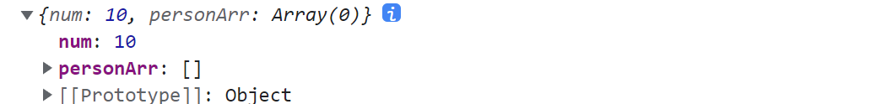
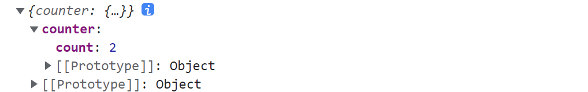

# 第一章 认识 Redux

Redux 是 JavaScript 状态容器，提供可预测化的状态管理，作用：集中式管理 react 应用中多个组件共享的状态

Redux 的数据状态如果想实现响应式，一共有三种方式：仅用 Redux 实现，搭配 React-Redux 实现，使用最新的@reduxjs/toolkit 插件进行编写。


文档前面还是使用 Redux + React-Redux 搭配进行状态管理，后面会用到最新的 @reduxjs/toolkit 进行更新

- 英文官网: https://redux.js.org  中文官网：https://cn.redux.js.org

- 中文文档（未兼容 Redux Toolkit）: http://www.redux.org.cn


Redux + React-Redux 模式安装版本

```json
"react-redux": "7.2.1",
"redux": "4.0.5",
"redux-thunk": "2.3.0",
```


## 1.1 Redux 工作流

Redux 思想其实很简单，我们可以在 `index.js ` 中模拟一下

- `action` 为一个对象，具有 type 属性，type 属性的字段称为 `constants`
- `reducer` 为一个函数，根据 type 处理指定的 `action`，修改仓库数据状态
- 其实仓库数据就是由 `reducer` 维护的，它直接返回仓库数据
- `createStore(reducer)` 创建一个实例仓库，具有 `dispatch`、`getState` 方法

```js
import { createStore } from 'redux'

// 处理指定的action，修改仓库状态
function reducer(state = 10, action) {
    switch (action.type) {
        case 'ADD':
            return state + action.num
    
        case 'SQURE':
            return state * state

        default:
            return state
    }
}

// 实例化仓库
const store = createStore(reducer)

// 读取仓库的状态
console.log(store.getState()) // 10

// 分发action，会调用reducer
store.dispatch({
    type: 'ADD',
    num: 20
})
console.log(store.getState()) // 30
```

```js
// 将action写成函数形式
function myself() {
    const num = 99
    return {
        type: 'MYSELF',
        num
    }
}
store.dispatch(myself())
console.log(store.getState())
```


如果想要引起仓库数据更新视图自动变化，那么纯 Redux 做法是这样的

```jsx
const root = ReactDOM.createRoot(document.getElementById('root'))
root.render(
    <Router><App /></Router>
)

store.subscribe(() => {
    root.render(
        <Router><App /></Router>
    )
})
```


## 1.2 仓库目录拆分

**如果我们将所有的逻辑代码写到一起，那么当redux变得复杂时代码就难以维护**，所以我们最好是有一个单独的文件夹存放这些逻辑。接下来，我会对代码进行拆分，将 store、reducer、action、constants 拆分成一个个文件


**同时也可以变成 reducer、action、constants 文件夹，里面的每个文件对应一个的组件模块！**

参考文档：https://blog.csdn.net/m0_71485750/article/details/126732471


### 1.2.1 进行普通拆分

**创建 store/index.js 文件：**index 文件中, 我们只需要创建 store 即可

```js
import { createStore } from 'redux'
import reducer from './reducer'

export default createStore(reducer)
```

```js
// 最新版 createStore 已经启用改用
import {legacy_createStore as createStore} from 'redux'
```


**创建 store/reducer.js 文件：**在真实项目中, reducer 这个函数我们会越写越复杂, 造成我们 index.js 文件越来越大, 所以我们将 reducer 也抽离到一个单独的文件中

```js
import { ADD, MYSELF } from './constants'

export default function reducer(state = 10, action) {
    switch (action.type) {
        case ADD:
            return state + action.num

        case MYSELF:
            return action.num

        default:
            return state
    }
}
```

> 在 `redux `中的 `reducer `函数规定必须是**一个纯函数**，`reducer `中的`state `对象要求不能直接修改，可以通过扩展运算符把修改路径的对象都复制一遍，然后产生一个新的对象返回（浅拷贝）


**创建 store/constants.js 文件：**将 type 的类型定义为常量（防止写错的情况）, 这些常量最好也防止一个单独的文件中

```js
export const ADD = 'ADD'
export const MYSELF = 'MYSELF'
```


**创建 store/actions.js 文件：**将封装的动态创建 action 的函数放在该文件中, 在需要使用的地方导入即可

 ```js
 import { MYSELF } from './constants'
 // 普通式action
 export const addOne = {
     type: ADD,
     num: 1
 }
 
 // 函数式action
 export function myself() {
     const num = 99
     return {
         type: MYSELF,
         num
     }
 }
 ```


### 1.2.2 reducer 合并

将 reducer 变成一个文件夹，里面封装 `index.js`、`countReducer.js` 等文件

```js
import { combineReducers } from 'redux'
import countReducer from './countReducer'

export default combineReducers({
    countcountReducer
})
```

 ```js
 import reducer from './reducer/index'
 
 export default createStore(reducer, applyMiddleware(thunk))
 ```


**从而导致组件获取仓库数据映射关系时获取到的是一个对象**

```js
const mapStateToProps = state => {
    return {
        state,
    }
}

console.log(this.props.state) // {countReducer: 10}
```

> 这里 state 是一个对象，里面存储了所有 reducer 仓库数据


**因此可以使用简写**

```js
const mapStateToProps = state => {
    return {
        num: state.countReducer
    }
}

console.log(this.props.num) // 10
```


## 1.3 认识 React-redux

前面讲到，我们不会去用纯 Redux 实现仓库数据更新 UI 视图自动变化，而是会用到 React-redux。使用 React-redux 之前肯定必须先配置好 Redux，即 store 文件夹中必须先写好东西

**这里使用的是非 Hooks 版，类组件和函数组件都可以使用**，React-redux 分两个步骤

- 将 APP 组件注册为容器组件

- 普通组件将仓库的 `reducer` 数据和 `action` 函数 映射到 props 当中


### 1.3.1 初始化容器组件

首先进入 index.js ，将 APP 组件注册为容器组件，**目的是让 App 所有的后代的组件都能够获取映射功能**

操作其实很简单，只需要 `Provider` 嵌套和 `store` 作为参数传递即可

```jsx
import store from './store'
import { Provider } from 'react-redux'

const root = ReactDOM.createRoot(document.getElementById('root'))
root.render(
    <Router>
        <Provider store={ store }><App /></Provider>
    </Router>
)
```

下面进行组件映射，将仓库的数据和 action 封装到 props 中


### 1.3.2 组件映射的方法

`mapStateToProps` 、`mapDispatchToProps` 两个 API 的使用下面讲到

```js
import { connect } from 'react-redux'

export default connect(mapStateToProps, mapDispatchToProps)(Count)
```


### 1.3.3 mapStateToProps

在组件中定义一个名为 `mapStateToProps` 的方法，该方法接收一个 `state`

- 如果仓库只有一个 `reducer`，那么 `state` 就等于该 `reducer` 管理的数据
- 如果仓库进行了 `reducer` 合并，那么 `state` 为一个对象，每一个 `reducer` 管理的数据为其中一个属性
- `reducer` 管理的数据的名称就为该 `reducer` 函数名称

```js
// reducer/index.js
import { combineReducers } from 'redux'
import countReducer from './countReducer'
import personReducer from './personReducer'

export default combineReducers({
    countReducer,
    personReducer
})
```

```js
// 只有一个reducerd的写法
const mapStateToProps = state => {
    return {
        num: state,
    }
}

// reducer 合并的写法
const mapStateToProps = state => {
    return {
        num: state.countReducer,
        personArr: state.personReducer
    }
}
```


可以直接通过 props 访问

```js
console.log(this.props)
```



 

### 1.3.4 mapDispatchToProps

在组件中定义一个名为 `mapDispatchToProps` 的对象，通过从 store/action.js 文件中导入 `action` 函数（每个 action 函数返回一个对象）

```js
import { add, asyncAdd } from '@/store/action/countAction'

const mapDispatchToProps = {
    add,
    asyncAdd
}
```


**通过 props 直接调用 action 函数即可，在 React-redux 会自动帮我们 `dispatch` 这个函数**

```jsx
<button onClick={this.increment}>+</button>

increment = () => {
    this.props.add(this.props.num, 1)
}
```


## 1.4 Redux 插件配置项

### 1.4.1 Redux-thunk 的使用

能够使得 `action` 函数处理异步任务，**因为不能直接在 `action` 函数前面加 `async` ！**

- `Redux-thunk` 作为中间件，可以让 `action` 函数返回一个函数，然后在这个函数里处理异步任务
- 返回的函数接收 `dispatch`、`getState` 两个函数
- 组件调用 `asyncAdd` 函数会 `dispatch` 这个函数，然后函数内部又会 `dispatch` 修改状态


**store/index.js：**

```js
import { createStore, applyMiddleware } from 'redux'
import reducer from './reducer/index'
import thunk from 'redux-thunk'

export default createStore(reducer, applyMiddleware(thunk))
```


**action.js**

```js
export function asyncAdd(num) {
    return function(dispatch) {
        setTimeout(() => {
            dispatch({
                type: ADD,
                num
            })
        }, 1000)
    }
}

export function asyncGetData() {
    return async function(dispatch, getState) {
        console.log(getState())
        
        let res = await fetchFn(...)
        if (res == 1) {
            dispatch(...)
        }                        
    }
}
```


组件中和普通函数同样的使用方法

```js
import { asyncAdd } from '@/store/action/countAction'

const mapDispatchToProps = {
    asyncAdd
}

this.props.asyncAdd(1)
```


### 1.4.2 Redux 开发者工具

下载谷歌插件：https://www.extfans.com/web-development/lmhkpmbekcpmknklioeibfkpmmfibljd/

安装中间件依赖：`yarn add redux-devtools-extension`

配置 store/index.js

```js
// 引入 redux-devtools-extension
import { composeWithDevTools } from "redux-devtools-extension"
const store = createStore(
    allReducer,
    composeWithDevTools(applyMiddleware(thunk))
)
```


## 1.5 实现计数器整体流程

实现计数器案例的 Redux + React-redux 完整版流程如下，可以参考：[React-redux 正规使用流程](https://blog.csdn.net/Jie_1997/article/details/128078971)


store/index.js

```js
import { createStore, applyMiddleware } from 'redux'
import reducer from './reducer'
import thunk from 'redux-thunk'

export default createStore(reducer, applyMiddleware(thunk))
```


store/reduer.js

```js
import { ADD } from './constants'

export default function reducer(num = 0, action) {
    switch (action.type) {
        case ADD:
            return num + action.num

        default:
            return num
    }
}
```


store/action.js

```js
import { ADD } from '../constants'

export function add(num) {
    return {
        type: ADD,
        num
    }
}

export function asyncAdd() {
    return function(dispatch) {
        setTimeout(() => {
            dispatch({
                type: ADD,
                num: num
            })
        }, 1000)
    }
}
```


store/constants.js

```js
export const ADD = 'ADD'
```


@/index.js

```jsx
import store from './store'
import { Provider } from 'react-redux'

const root = ReactDOM.createRoot(document.getElementById('root'))
root.render(
    <Router>
        <Provider store={ store }><App /></Provider>
    </Router>
)
```


@/components/Count.jsx

```jsx
import React, { Component, createRef } from 'react'
import { add, asyncAdd } from '@/store/action/countAction'
import { connect } from 'react-redux'

class Count extends Component {
    selectRef = createRef()

    increment = () => {
        this.props.add(Number(this.selectRef.current.value))
    }

    asyncIncrement = () => {
        this.props.asyncAdd(Number(this.selectRef.current.value))
    }

    render() { 
        return (
            <div>
                <h1>{ this.props.num }</h1>
                <select ref={this.selectRef} >
                    <option value="1">1</option>
                    <option value="2">2</option>
                    <option value="3">3</option>
                </select>

                <button onClick={this.increment }>+</button>
                <button onClick={this.asyncIncrement}>异步+</button>
            </div>
        )
    }
}

const mapStateToProps = num => {
    return {
        num
    }
}

const mapDispatchToProps = {
    add,
    asyncAdd
}

export default connect(mapStateToProps, mapDispatchToProps)(Count)
```


## 1.6 Redux 持久化储存方案

Redux-persist：https://blog.csdn.net/hbmern/article/details/124184309

 


# 第二章 认识 Redux Toolkit

在前面我们学习 Redux 的时候应该已经发现，Redux 的编写逻辑过于的繁琐和麻烦。并且代码通常分拆在多个文件中（虽然也可以放到一个文件管理，但是代码量过多，不利于管理）

Redux Toolkit 包旨在成为编写Redux逻辑的标准方式，从而解决上面提到的问题，在很多地方为了称呼方便，也将之称为 `RTK`，**RTK + React-redux Hooks + React Hooks 构成了最新的状态管理模式！**

由于 Redux Toolkit 是最新技术，所以默认是使用 TS 的，VScode 会对部分 API 进行 TS 校验！


只需要安装两个包，即可实现完整功能，包括 Redux-thunk 和 Redux 开发者工具等

```bash
$ npm install @reduxjs/toolkit react-redux --save 
```

参考文档：https://blog.csdn.net/web220507/article/details/127864453


## 2.1 store/index.js 配置

新建 `store/index.js` ，用于创建 store 实例

configureStore 包装了 `createStore` 以提供简化的配置选项和良好的默认值。它可以自动组合你的 `reducer`，添加你提供的任何 Redux 中间件，Redux-thunk 默认包含，并启用 Redux DevTools Extension。reducer 属性将所有导入的 reducer 模块合并 


```js
import { configureStore } from '@reduxjs/toolkit'
import counterReducer from './modules/counter'

const store = configureStore({
    // 将所有的Reducer模块合并
    // 总state里面的各个属性名取决于这里定义的名字
    reducer: {
        counter: counterReducer
    },
    
    // 例如可以关闭redux-devtool
    devTools: false    
})

export default store
```

 

## 2.2 Reducer 模块配置

新建 `modules` 文件夹，用于存储不同的 `Reducer` 模块

- `createSlice`：用于将 `reducer` 和 `action` 进行合并，封装成一个 `reducerSlice` 对象

- `initialState`：当前 `Reducer` 模块的数据对象初始值

- `reducers`：成功将 `reducer` 和 `action` 合并成一个函数，可以直接修改该模块的数据对象的值
- **`reducers` 内部只允许写同步函数，异步函数的编写在后面**
- `reducers` 中的方法必须要导出，以便可以被 `dispatch`


```js
import { createSlice } from '@reduxjs/toolkit'

const counterSlice = createSlice({
    name: 'counter',

    initialState: {
        count: 0
    },

    reducers: {
        addNumber(state, action) {
            // action.payload：dispatch时所传的参数
            // action.type：dispatch时action类型字段
            state.count = state.count + action.payload
            
            // 可直接返回一个值替代state
            return action.payload
        }
    }
})

// reducers当中的方法会放在counterSlice的actions中, 用于派发action
export const { addNumber } = counterSlice.actions

// 注意: 导出的是reducer, 用于在store/index.js中的reducer进行使用
export default counterSlice.reducer
```


## 2.3 React-redux 的使用

首先初始化容器组件的方式和之前一致

```jsx
import store from './store'
import { Provider } from 'react-redux'

const root = ReactDOM.createRoot(document.getElementById('root'))
root.render(
    <Router>
        <Provider store={ store }><App /></Provider>
    </Router>
)
```


React-redux 新增两个  hook，代替之前的 `connect(mapStateToProps, mapDispatchToProps)(Count)`

- `useDispatch`：返回一个 `dispatch` 函数，用于 `dispatch` 导入的 action 函数
- `useSelector`：类似于计算属性，传入一个 `state` 全局状态对象，可对它进行属性提取
- **`dispatch` 函数传入的参数直接封装到了 `action.payload` 当中**
- 因此 `action.payload` 可以实现在一个 reducer 模块中访问其他模块的数据，组件作为桥梁


```jsx
import { useDispatch, useSelector } from 'react-redux'
import { addNumber } from '../store/modules/counter'

const Count = () => {
    const dispatch = useDispatch()
    const state = useSelector(state => state)
    const counter = useSelector(state => state.counter)

    const increment = () => {
        console.log(state)
        dispatch(addNumber(1)))
    }

    return (
        <div>
            <h1>{ counter.count }</h1>
            <button onClick={ increment }>+</button>
        </div>
    )
}
export default Count
```

 

 `state` 全局状态对象




## 2.4 Redux 实现异步函数

Redux 使用异步函数有两种方式：

- 方式一：action 直接作为异步函数，通过 dispatch 该异步函数实现修改仓库数据
- 方式二：action 只作为同步函数使用，在外面用 Hooks 定义异步函数通过 dispatch 同步函数修改仓库数据


**方式一的实现思路：**

由于 `reducerSlice.reducers` 中的函数只能写同步 action 函数，因此我们将异步函数写在外面，但同时也要准备一个同步函数用于 `dispatch` 修改担当前模块数据

store/modules/counter.js

```js
reducers: {
    subNumber(state, action) {
        state.count = state.count - action.payload
    }
}

// 导出异步action
export function asyncSub(payload) {
    return async function(dispatch, getState) {
        console.log(getState()) // 得到当前模块的数据，只读

        setTimeout(() => {
            dispatch(subNumber(payload))
        }, 1000)
    }
}

// 必须要将同步action函数导出才能访问到
export const { subNumber } = counterSlice.actions
```

 

count.jsx 函数组件

```jsx
import React, { useRef } from 'react'
import { useDispatch, useSelector } from 'react-redux'
import { asyncSub } from '../store/modules/counter'

const Count = () => {
    const dispatch = useDispatch()

    const asyncIncrement = () => {
        dispatch(asyncSub(1)))
    }
}
```

> 注意 asyncSub 函数也是要被 dispatch 的！！


**方式二的实现思路：**

在外部 Hooks 文件夹中定义个 hoos 文件


## 2.5 实现计数器整体流程

store/index.js

```js
import { configureStore } from '@reduxjs/toolkit'
import counterReducer from './modules/counter'

const store = configureStore({
    reducer: {
        counter: counterReducer
    }
})

export default store
```

store/modules/counter.js

```js
import { createSlice } from '@reduxjs/toolkit'

const counterSlice = createSlice({
    name: 'counter',

    initialState: {
        count: 0
    },

    reducers: {
        addNumber(state, action) {
            // console.log(action.payload)
            // console.log(action.type)
            state.count = state.count + action.payload
        },

        subNumber(state, action) {
            state.count = state.count - action.payload
        }
    }
})

export function asyncSub(payload) {
    return async function(dispatch, getState) {
        console.log(getState())

        setTimeout(() => {
            dispatch(subNumber(payload))
        }, 1000)
    }
}

export const { addNumber, subNumber } = counterSlice.actions

export default counterSlice.reducer
```

@/index.js

```jsx
import store from './store'
import { Provider } from 'react-redux'

const root = ReactDOM.createRoot(document.getElementById('root'))
root.render(
    <Router>
        <Provider store={ store }><App /></Provider>
    </Router>
)
```

@/components/count.js

```jsx
import React, { useRef } from 'react'
import { useDispatch, useSelector } from 'react-redux'
import { addNumber, asyncSub } from '../store/modules/counter'

const Count = () => {
    const selectRef = useRef(null)
    const dispatch = useDispatch()
    const state = useSelector(state => state)
    const counter = useSelector(state => state.counter)

    const increment = () => {
        console.log(state)
        dispatch(addNumber(Number(selectRef.current.value)))
    }

    const asyncIncrement = () => {
        dispatch(asyncSub(Number(selectRef.current.value)))
    }

    return (
        <div>
            <h1>{ counter.count }</h1>
            <select ref={ selectRef } >
                <option value="1">1</option>
                <option value="2">2</option>
                <option value="3">3</option>
            </select>

            <button onClick={ increment }>+</button>
            <button onClick={ asyncIncrement }>异步+</button>
        </div>
    )
}
export default Count
```


# 第三章 认识 MobX6

Mobox 是一个状态管理库，它通过实现一个类来进行一个仓库的状态管理。创建仓库使用 makeObservable，通过给组件包裹 mobx-react 暴露出的 observer 起到监听效果，从而实现创建到调用的闭环

- 中文文档：https://www.mobxjs.com/
- 参考文档：https://juejin.cn/post/6979095356302688286


如果只使用函数组件，那么直接下载 mobx-react-lite 更轻量级的库（移除了 provider、inject ）

```bash
npm i mobx mobx-react-lite --save
```


如果使用类组件则需要下载  mobx-react

```bash
npm i mobx mobx-react --save
```


## 3.1 用类构建仓库并使用

使用一个类迅速构建一个仓库，makeObservable 标记用到的方法和数据，makeAutoObservable 自动标记

直接支持异步函数，修改数据需要使用 runInAction


**构建仓库：store/modues/counter.js**

```js
import { makeObservable, action, computed, observable, runInAction } from 'mobx'

class CounterStore {
    count = 0

    constructor() {
        makeObservable(this, {
            count: observable,
            increment: action.bound,
            decrement: action,
            reset: action,     
            countAdd: computed,
            incrementAsync: action.bound
        })

        // 参数1：target，把谁变成响应式（可观察）
        // 参数2：排除属性和方法
        // 参数3：利用 autoBind 指定自动绑定 this
        // makeAutoObservable(this, { decrement: true }, { autoBind: true })        
    }

    get countAdd() {
        return this.count + 1
    }

    increment() {
        this.count ++
    }

    decrement() {
        this.count--
    }

    reset() {
        this.count = 0
    }    

    async incrementAsync() {
        setTimeout(() => {
            runInAction(() => {
                this.count++
            })
        }, 1000)
    }    
}

const counterStore = new CounterStore()
export default counterStore // 导出类实例
```


**使用仓库：Count.jsx**

在单个组件中，直接引入仓库，并且使用 mobx-react-lite 导出的 observer 对组件进行监听，类组件也适用

```jsx
import React from 'react'
import counter from '../store/modules/counter'
import { observer } from 'mobx-react-lite'

const Count = () => {

    return (
        <div>
            {counter.count}
            {counter.countAdd}
            <button onClick={() => counter.increment()}>+</button>
            <button onClick={() => counter.incrementAsync()}>异步+</button>
        </div>
    )
}

export default observer(Count)
```


> **自动订阅**在react组件**渲染期间**被使用到的**可观察对象属性**，当他们变化发生时，组件就会自动进行**重新渲染**。 前边在概览篇提到过MobX的核心能力就是能够将数据get中收集到的所有依赖，在set中一次性发布出去。在react场景中，就是要**将状态与组件渲染建立联系**，一旦状态变化，所有使用到此状态的组件都需要重新渲染，而这一切的关键就是observer


## 3.2 仓库模块化的实现

我们可以在 store/index.js 中定义一个公共的仓库，封装好所有的模块化仓库

```js
import counterStore from './modules/counter'
import userStore from './modules/user'

class RootStore {
    constructor() {
        this.userStore = userStore
        this.counterStore = counterStore
    }
}

const rootStore = new RootStore()
export default rootStore
```


**实现仓库之间的通信的方法：**

```js
import { makeAutoObservable } from 'mobx'

class UserStore {
    constructor(rootStore) {
        this.rootStore = rootStore
        makeAutoObservable(this)
    }
    
    uid = 'zyd123'
    roleType = 1
    changeRoleType(val) {
        this.roleType = val
    }
}

class RoleStore {
    constructor(rootStore) {
        this.rootStore = rootStore
        makeAutoObservable(this)
    }
    
    changeUserRoleType(uid, type) {
        // 获取userStore仓库数据
        const { userStore } = this.rootStore
        if (uid === userStore.uid) {
            userStore.changeRoleType(type)
        }
    }
}

// 新建一个上层rootStore，方便Stores间沟通
class RootStore {
    constructor() {
        this.userStore = new UserStore(this)
        this.roleStore = new RoleStore(this)
    }
}

const rootStore = new RootStore()
export default rootStore
```


## 3.3 统一集成化仓库引入

按照上面的写法每一个组件需要通过引入仓库文件的方式来引入一个仓库并使用

```js
import counterStore from '../store/modules/counter'
```

这种方式繁琐且不利于维护，假如 store 文件重新组织，引入的地方则需要处处更改。所以应该设置一个方法在项目开发中 store 只需**一次注入**，就可以在所有组件内非常便捷的引用，**且每个组件依然需要设置 observer 监听**


### 3.3.1 类组件 store 的维护

通过使用 mobx-react 导出的 Provider、inject 来实现类组件中的 mobx 仓库的使用

**src/index.jsx**

```jsx
import { Provider } from 'mobx-react'
import rootStore from './store'

const root = ReactDOM.createRoot(document.getElementById('root'))
root.render(
    <Provider {...rootStore}>
        <App />
    </Provider>
)
```


**单个组件中使用：UserInfo.jsx**

```jsx
import React, { Component } from 'react'
import { inject, observer } from 'mobx-react'

class UserInfo extends Component {
    render() {
        // 直接通在props中访问仓库
        const { roleName } = this.props.userStore
        const { count } = this.props.counterStore

        return (
            <div>{roleName} ## {count}</div>
        )
    }
}

// inject是高阶函数，所以inject('store')返回值还是个函数，最终入参是组件
export default inject('userStore', 'counterStore')(observer(UserInfo))
```


### 3.3.2 函数组件 store 的维护

通过 React 提供的 useContext, createContext 可以实现对响应式数据跨层级传递（即任何组件间传递），从而对 mobx 仓库起到一键封装的作用，**store/index.js 只需要导出一个 useStore 函数即可**

```js
import { useContext, createContext } from 'react'
import userStore from './modules/user'
import counterStore from './modules/counter'

class RootStore {
    constructor() {
        this.userStore = userStore
        this.counterStore = counterStore
    }
}

const rootStore = new RootStore()

const rootStoreContext = createContext(rootStore)

const useStore = (storeName) => {
    const rootStore = useContext(rootStoreContext)
    if (storeName) {
        const childStore = rootStore[storeName]
        if (!childStore) throw new Error('根据传入storeName，找不到对应的仓库')
        return childStore
    }
    return rootStore
}

export default useStore
```


组件中使用

```jsx
import React from 'react'
import { observer } from 'mobx-react-lite'
import useStore from '../store'

const Count = () => {
    const counter = useStore('counterStore')

    return (
        <div>
            {counter.count}
            {counter.countAdd}
            <button onClick={() => counter.increment()}>+</button>
            <button onClick={() => counter.incrementAsync()}>异步+</button>
        </div>
    )
}

export default observer(Count)
```


## 3.4 实现局部状态管理

本章作为 mobx 的拓展使用技巧。如果我们要在组件中实现一个局部仓库的效果，可以使用 mobx-react-lite 中的 `useLocalObservable`,  `useObserver` 来实现，本节只针对函数组件实现。


***全局状态管理***：store 在组件外定义，经常放在全局一个单独的 store 文件夹。适合管理一些公共或者相对某模块是公共的状态。

 ***局部状态管理***：store 常常定义在组件内部，适用于复杂的组件设计场景，用来解决组件多层嵌套下的状态层层传递、组件状态多且更新复杂等问题。


> 相较于使用 useState 管理数据，这个方式多了很多 mobx 特有的功能：action、computed、reaction 等都非常有助于解决那种组件内 useState 繁多，且更新 state 的操作不容易管理和追溯等问题。


**完整使用案例**

```jsx
import React from 'react'
import { useLocalObservable, useObserver } from 'mobx-react-lite'

const Test = () => {
    
    //定义组件内的响应式Store
    const store = useLocalObservable(() => ({
        name: 'cocoon',
        changeName(text) {
            this.name = text
        }
    }))

    return useObserver(() => (
        <div>
            <h2>{store.name}</h2>
            <button onClick={() => store.changeName('小米')}>修改</button>
        </div>
    ))
}

export default Test
```


## 3.5 拓展 Mobx APIs

Mobx 导出的一些副作用函数的使用：https://www.mobxjs.com/reactions


# 第四章 认识 MobX5

MobX6 使用 makeObservable\makeAutoObservable 来对类属性进行响应式监听，而 MobX5 使用装饰器语法

MobX6 使用 observer + Provider + inject 实现把类组件变成响应式组件，MobX5 也一样，只不过是装饰器语法

MobX5 中文文档：https://cn.mobx.js.org/，视频教学：https://www.bilibili.com/video/BV1tL4y1h7ND


## 4.1 装饰器语法的使用

使用装饰器之前需要先让项目支持装饰器，装饰器语法如下：https://juejin.cn/post/7214374960193699877

- 类装饰器：target 为传入的类

```js
const test = (target) => {
    target.sName = 'Tom'
    target.getAge = function () {
        return 20
    }
}

@test
class Student{

}

console.log(Student)
```

>将 Student 类做为参数传入 test 函数中，target 就是 Student 类，在类上挂载属性和方法，如果装饰器 test有返回值，则使用返回值替代 Student 类，没有返回值则为 Student 类 


- 方法装饰器：target 为传入的类，name 为方法名称，descriptor 为一个装饰器

```js
function log(target, name, descriptor) {
  // 保存原始方法
  const original = descriptor.value

  // 修改方法的行为
  descriptor.value = function (...args) {
	// 处理一些业务代码
     
    // 返回原方法的返回值
    return original.apply(this, args)
  }

  // 返回修改后的方法
  return descriptor
}


class Student {
  @log
  myMethod(arg1, arg2) {
    return arg1 + arg2
  }
}

// 测试
const myObject = new Student()
myObject.myMethod(1, 2)
```

> 方法装饰器可以在不改变原有方法的情况下，在方法执行前后插入业务代码，如打印日志、数据校验等。运用了代理模式，可以达到 AOP 切面编程效果


- 属性装饰器：target 为传入的类，key 为属性名称，descriptor 为一个装饰器

```js
function readonly(target, key, descriptor) {
  descriptor.writable = false;
  return descriptor;
}

class Person {
  @readonly
  name = '张三';
}

const p = new Person();
p.name = '李四'; // 抛出 TypeError，只读
```

> descriptor 属性如下：configurable - 可配置，enumerable：可枚举，initializer：初始值 


## 4.2 Mobx5 中的装饰器

Mobx 中封装的常用装饰器如下：https://cn.mobx.js.org/refguide/modifiers.html

另外一般我们通过一个类来实现一个 mobx 仓库，不过也可以直接使用 `observable` 函数创建


**@observable**

对一个属性进行监听，属性可以是数字、字符串、数组、对象、map 等多种类型的数据

```js
import { observable } from "mobx"

class OrderLine {
    @observable price = 0
    @observable amount = 1
}

export const orderLine = new OrderLine()
```


**@computed**

计算属性，当响应式数据改变的时候也跟着改变，同时具有缓存效果

```js
import { observable, computed } from "mobx"

class OrderLine {
    @observable price = 0
    @observable amount = 1

    @computed get total() {
        console.log('111')
        return this.price * this.amount
    }
}
```


**@action**

创建一个动作，通常用于对内部的属性进行变化，因为 Mobx 不推荐使用仓库实例修改仓库属性

```js
import { configure, observable } from 'mobx'

configure({ enforceActions: true }) // 不允许在动作之外进行状态修改

class OrderLine {
    @observable price = 0
    
    @action change() {
        this.price = 100
    }
}

export const orderLine = new OrderLine()
orderLine.change()

// 设置之后直接修改会报错
orderLine.price = 100
```

> @action.bound 可以实现在方法中 this 指向永远是该类实例


**runInAction 工具函数**

该函数可以实现在任何时候都可以自定义修改仓库中的属性，通常用于异步函数中

```js
import { observable, runInAction, configure } from "mobx"

configure({ enforceActions: true })
class OrderLine {
    @observable price = 0
    @observable amount = 1
}

export const orderLine = new OrderLine()

runInAction(() => {
	this.price = 100
})
```


## 4.3 Mobx5 中使用异步函数

这里直接将 action 装饰的函数定义为异步函数即可，然后在异步函数中修改仓库属性有三种方法，这里推荐使用 runInAction 工具函数

Mobx5 中文参考文档：https://cn.mobx.js.org/best/actions.html


```js
mobx.configure({ enforceActions: true })

class Store {
    @observable githubProjects = []
    @observable state = "pending" // "pending" / "done" / "error"

    @action
    async fetchProjects() {
        this.githubProjects = []
        this.state = "pending"
        try {
            const projects = await fetchGithubProjectsSomehow()
            const filteredProjects = somePreprocessing(projects)
            
            // await 之后，再次修改状态需要动作:
            runInAction(() => {
                this.state = "done"
                this.githubProjects = filteredProjects
            })
        } catch (error) {
            runInAction(() => {
                this.state = "error"
            })
        }
    }
}
```


## 4.4 Mobx5 中的副作用

### 4.4.1 autorun

类似于 watch 函数，初始化时执行一次，内部用到的响应式数据改变时也会执行，并且具有缓存效果

官网更详细的介绍：https://cn.mobx.js.org/refguide/autorun.html

```js
import { observable, autorun, action } from "mobx"

class OrderLine {
    @observable price = 0
    @observable amount = 1
    
    @action init() {
        // 简单使用
        autorun(() => {
            console.log('price', this.price)
        })
    }
}

export const orderLine = new OrderLine()
orderLine.init()

orderLine.price = 100
```


Autorun 接收第二个参数，它是一个参数对象，有如下可选的参数:

- `delay`：可用于对效果函数进行去抖动的数字（以毫秒为单位），如果是 0（默认值）的话，那么不会进行去抖
- `onError`：用来处理 reaction 的错误，而不是传播它们
- `scheduler`：设置自定义调度器以决定如何调度 autorun 函数的重新运行


### 4.4.2 when

`when(predicate: () => boolean, effect?: () => void, options?)`

`when` 观察并运行给定的 `predicate` 函数的返回值，直到返回 true。 一旦返回 true，给定的 `effect` 就会被执行，然后会被自动运行程序清理。因此只会执行一次，https://cn.mobx.js.org/refguide/when.html

```js
import { observable, when, action } from "mobx"

class OrderLine {
    @observable price = 0
    @observable amount = 1
    
    @action init() {
        // 简单使用
        when(() => {
            return this.price > 100
        },() => {
            console.log('price > 100')
        })
    }
}

export const orderLine = new OrderLine()
orderLine.init()

orderLine.price = 101
```


### 4.4.3 reaction

`reaction(() => data, (data, reaction) => { sideEffect }, options?)`

第一个参数为一个 data 函数，该函数的返回值作为依赖项，并且直接作为第二个函数的参数传入。第二个参数为响应函数，当第一个函数的依赖项发生改变时执行。第三个参数为配置选项，https://cn.mobx.js.org/refguide/reaction.html


响应函数：第一个参数 data 为依赖项最新的返回值，第二个参数 reaction 为当前的 reaction，可以用来在执行期间清理 `reaction`

```js
import { observable, reaction, action } from "mobx"

class OrderLine {
    @observable price = 0
    @observable amount = 1
    
    @action init() {
        // 简单使用
        reaction(() => [this.price, this.amount],
        (data, reaction) => {
            console.log('data', data)
        })
    }
}

export const orderLine = new OrderLine()
orderLine.init()

orderLine.price = 100
```


Reaction 接收第三个参数，它是一个参数对象，有如下可选的参数:

- `fireImmediately`: 布尔值，用来标识效果函数是否在数据函数第一次运行后立即触发。默认值是 `false` 
- `delay`: 可用于对效果函数进行去抖动的数字(以毫秒为单位)。如果是 0(默认值) 的话，那么不会进行去抖
- `equals`: 默认值是 `comparer.default` 。如果指定的话，这个比较器函数被用来比较由 *数据* 函数产生的前一个值和后一个值。只有比较器函数返回 false *效果* 函数才会被调用。此选项如果指定的话，会覆盖 `compareStructural` 选项
- `onError`: 用来处理 reaction 的错误，而不是传播它们
- `scheduler`: 设置自定义调度器以决定如何调度 autorun 函数的重新运行


# 第五章 认识 zustand

Zustand（德语）：React 全新轻量级状态管理库

可以直接啃英文文档：https://docs.pmnd.rs/zustand/getting-started/introduction


## 5.1 如何更新状态&set

设置状态初始值和重置状态的方式：https://docs.pmnd.rs/zustand/guides/how-to-reset-state


zustand 采用不可变数据状态，简单数据类型可以直接使用 set 函数进行合并，它只会合并 state 最外层的数据

https://docs.pmnd.rs/zustand/guides/updating-state


复杂数据类型推荐使用 immer，可以使用原生 immer，也可以使用中间件

https://docs.pmnd.rs/zustand/guides/updating-state#with-immer

https://docs.pmnd.rs/zustand/integrations/immer-middleware


Map、Set 类型也可以支持更新：https://docs.pmnd.rs/zustand/guides/maps-and-sets-usage


另外附上 set 函数介绍：https://docs.pmnd.rs/zustand/guides/immutable-state-and-merging


## 5.2 如何使用状态

可以直接引入仓库之后通过 state 索引使用，也可以在内部封装一个函数 createSelectors 简化使用

https://docs.pmnd.rs/zustand/guides/auto-generating-selectors


## 5.3 适配 Typescript

**针对状态的 TS 适配**

基础使用：将状态定义为一个 type，在 create 的时候传入即可，在内部、外部使用状态时已经支持 TS

简化使用：不用自己定义状态，而是使用中间件 combine 使其自行推断状态

https://docs.pmnd.rs/zustand/guides/typescript#basic-usage


