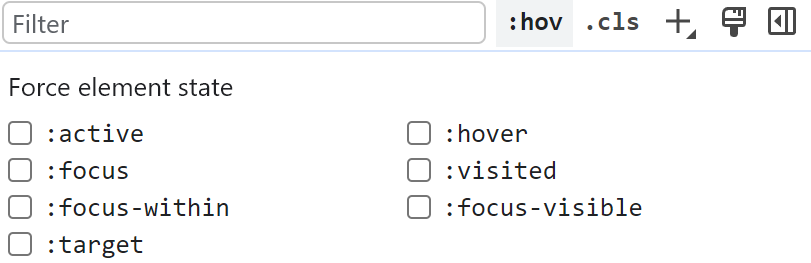

# 第一章 HTML

## 1.1 HTML 备忘清单

HTML 备忘清单

https://wangchujiang.com/reference/docs/html.html

Emmet （HTML、CSS 内置的快捷指令）备忘清单

https://wangchujiang.com/reference/docs/emmet.html

特殊字符及转义参考

https://blog.csdn.net/jack_rose_me/article/details/124603494

> 如果一个元素拥有 ID 属性,那么 ID 属性的属性值就会成为 window 对象的属性名
>
> link 标签是同时加载的，而 script 标签才会加载完一个再加载另一个


## 1.2 IMG 标签知识点

**保持盒子内图片匹配**

```scss
// 使用外层盒子
.imgBx img {
    width: 100%;
    height: 100%;
    object-fit: contain;
}

// 直接使用img
    img {
        width: 35px;
        height: 35px;
        cursor: pointer;
        object-fit: contain;
    }

fill		// 默认，不保证保持原有的比例，内容拉伸填充整个内容容器
contain		// 保持原有尺寸比例。内容被缩放
cover		// 保持原有尺寸比例。但部分内容可能被剪切
none		// 保留原有元素内容的长度和宽度，也就是说内容不会被重置
```


**src为空时，img标签不显示裂图**

```js
img[src=""], img:not([src]) {
    opacity:0;
}
```


**访问网络图片必须添加如下属性**

```html
index.html
<meta name="referrer" content="no-referrer">
```

> https://blog.csdn.net/u011127019/article/details/125169827


**src 绑定 JS 变量**

```js
// 不能直接使用js变量存储地址字符串给src 需要先引入资源

import img from './img.png'
const img = require('./img/clock.svg')
```

```html

```


**背景图片适配**

```css
div {
    width: 300px;
    height: 380px;
    background: url(./fingerprint.png) no-repeat;
    /* 一般指定宽度为盒子宽度 或者cover contain*/
    background-size: 300px;
}
```


## 1.3 静态资源路径

React 脚手架中使用 `%PUBLIC_URL%` 则固定从服务器根路径 `http://localhost:3000` 的文件夹下获取资源

```html
<link rel="apple-touch-icon" href="%PUBLIC_URL%/logo192.png" />
```

> 和 `href="/logo192.png"` 效果是一样


使用 `./` 则从当前服务器路径 `http://localhost:3000/home` 的文件夹下获取资源

```html
<link rel="apple-touch-icon" href="./logo192.png" />
```


## 1.4 HTML 标签介绍

**块元素**

1. 常见的块元素有 `<h1> ~ <h6>`、`<p>`、`<div>`、`<ul>`、`<ol>`、`<li>`、`<dl>`、`<dt>`、`<dd>`、`<table>`、`<tr>`、`<form>` 等
2. 一行只能放一个块级元素


**行内元素**

1. 常见的行内元素有 `<a>`、`<span>`、`<em>`、`i`、`<strong>` 等
2. 一行可以放多个行内元素，设置宽高无效


**行内块元素**

1. 常见的行内块元素有：``、`<input>`、`button`、`<th>`、`<td>` 等，也是行内元素

2. 和相邻行内元素（行内块）在一行上，但是他们之间会有空白缝隙

3. 高度，行高、外边距以及内边距都可以控制（块级元素特点）

   


# 第二章 CSS

## 2.1 CSS 速记链接

CSS 备忘清单：https://wangchujiang.com/reference/docs/css.html

> CSS 样式包含三种类型：行内样式（内联样式）、内部样式（style 标签）、外部样式（link 标签）
>
> 加载页面时，link 标签引入的 CSS 被同时加载；@import 引入的 CSS 将在页面加载完毕后被加载
>
> a 标签不能嵌套 a 标签，p 标签不能嵌套块级元素


## 2.2 CSS 选择器详解

CSS 选择器速记：[https://wangchujiang.com/reference/docs/css.html#css-选择器](https://wangchujiang.com/reference/docs/css.html#css-选择器)

CSS 选择器介绍：https://vue3js.cn/interview/css/selector.html

> 可以同时使用多个伪类，而只能同时使用一个伪元素
>
> nth-of-type(2n + 1)：n 从 0 开始匹配


**带 type 的匹配选择器**

`first-of-type`、`last-of-type`、`nth-of-type(n、even、odd)`：选择第一个、最后一个、第 n 个

`nth-last-of-type(n)`：从末尾开始计数，第 n 个

- 先筛选该父元素下的所有 `p` 标签（仅限直接子元素），再匹配第 n 个 `p` 标签
- 由于是选择所有后代 p 标签，所以还会逐层把直接子元素作为父元素，再进行上面的匹配流程

```css
#father p:nth-of-type(2) {
	color: red
}
```

```html
<div id='father'>
  <div>
      <p>1</p>
      <p>2</p> // red
  </div>
  <h1>3</h1>
  <p>4</p>
  <p>5</p> // red
</div>
```

> 如果是 `#father > p:nth-of-type(2)`，只选择直接子元素，那么就不会再逐层匹配


**带 child 的匹配选择器**

`first-child`、`last-child`、`nth-child(n、even、odd)`：选择第一个、最后一个、第 n 个

- 先选择该父元素下的第 n 个元素（直接子元素），再看下该元素是不是 `p` 标签，如果是则匹配
- 由于是选择所有后代 p 标签，所以还会逐层把直接子元素作为父元素，再进行上面的匹配流程

```css
#father p:nth-child(2) {
	color: red
}
```

```html
<div id='father'>
  <div>
      <p>1</p>
      <p>2</p> // red
  </div>
  <h1>3</h1>
  <p>4</p>
  <p>5</p>
</div>
```

> 只有 2 会亮，因为 5 被认为是第 4 个元素


**其他伪类选择器**

```css
:link 未被访问的链接样式
:visited 已被访问的链接样式
:active 鼠标点击时链接的样式
:hover 鼠标指针浮动在上面的元素
:focus 选择具有焦点的
:root 设置HTML文档
:empty 指定空的元素
:enabled 选择可用元素
:disabled 选择被禁用元素
:checked 选择选中的元素
```


**属性选择器**

```css
[attribute*=value]：选择attribute属性值包含value的所有元素
[attribute^=value]：选择attribute属性开头为value的所有元素
[attribute$=value]：选择attribute属性结尾为value的所有元素
```

```css
/* 选择p标签中id为包含div的所有元素 */
p[id*=div] {
    color: red;
}
```


**:not(selector)**

选择与 `<selector>` 选择器不匹配的所有元素，下面是例子

```css
/* 选择当包含 flipped 的所有元素中不包含 matched 的元素 */
.flipped:not(.matched) {};

/* 当 board-container 中包含了 flipped 对 board 作用 */
.board-container.flipped .board {};
```


## 2.3 CSS 滚动条样式

`::-webkit-scrollbar` 作为一个伪类选择器，设置全局滚动条

参考文档：https://blog.csdn.net/coder_jxd/article/details/124213962

MDN：https://developer.mozilla.org/zh-CN/docs/Web/CSS/::-webkit-scrollbar


全局滚动条模板参考

```css
/* 整个滚动条 */
::-webkit-scrollbar {
    width: 10px;
    height: 10px;
}

/* 垂直滚动条和水平滚动条时交汇的部分 */
::-webkit-scrollbar-corner {
    display: block;
    /* background-color: rgba(0, 0, 0, 0.1); */
    background-color: transparent;
}

/* 滚动条上的滚动滑块 */
::-webkit-scrollbar-thumb {
    border-radius: 10px;
    border-right-color: transparent;
    border-left-color: transparent;
    background-color: rgba(0, 0, 0, 0.3);
}

/* 滚动条轨道 */
::-webkit-scrollbar-track {
    border-right-color: transparent;
    border-left-color: transparent;
    background-color: rgba(0, 0, 0, 0.1);
}
```


单个盒子生效

```scss
// 滚动条隐藏
&::-webkit-scrollbar {
    width: 0px;
}
```


## 2.4 响应式布局介绍

**Rem 布局**

html 默认 font-size 为16px ,  `1rem = html-font-size * 1`


**媒体查询**

概念：通过视口宽度实现不同适配方案

作用：手动设置 `html-font-size `  、  手动修改不同视口宽度的样式

使用方法：

- 先把常规布局写完（视口宽度为1024px）
- 然后从大到下 设置媒体查询   **下面的会继承上面的样式**
- 通过不同视口宽度下 修改某些元素的布局或样式

``` css
/* 常规 css（750 - ） */
...

/* 视口宽度：320 - 750 */
@media screen and (max-width: 750px) {...}

/* 视口宽度：0 - 320 */
@media screen and (max-width: 30px) {...}
```


## 2.5 flex/grid 布局

**flex 布局**

Flex 介绍：https://vue3js.cn/interview/css/flexbox.html
Flex 备忘清单：https://wangchujiang.com/reference/docs/css.html#css-flexbox

```less
/* flex实现居中 */
div {
  display: flex;
  justify-content: center;
  align-items: center;
}

/* flex行列间隙：column-gap  row-gap */
```


**grid 布局**

Grid 介绍：https://vue3js.cn/interview/css/grid.html

Grid 备忘清单：[https://wangchujiang.com/reference/docs/css.html#css-grid-网格布局](https://wangchujiang.com/reference/docs/css.html#css-grid-网格布局)

```less
/* grid实现居中 */
div {
    display: grid;
    place-items: center;
}

/* grid将两个子元素按比例划分 */
div {
    display: grid;
    grid-template-columns: 15% 85%;   
}
```


## 2.6 背景属性与渐变


## 2.7 移动属性与动画


## 2.8 CSS 技巧总结

**父级元素清除浮动的方式**

1. 在父级元素创建 BFC，https://vue3js.cn/interview/css/BFC.html
2. 在最后的浮动元素末尾添加一个空标签，设置 `clear: both` 样式
3. 给父元素添加一个伪元素 `::after`，设置 `clear: both` 样式

 

**HTML 字符串换行方式**

https://blog.csdn.net/TwelveSpring/article/details/123253679


## 2.9 Less 常用技巧

Less 官网：https://less.bootcss.com/

1. 变量
2. 混合
3. @规则嵌套和冒泡
4. 算术运算符
5. calc()
6. 内置函数：https://less.bootcss.com/functions/


# 第三章 JavaScript

推荐阅读文档专栏，包含 JS 大部分语法和知识点复习：https://juejin.cn/column/6991485674788487205

1. JavaScript 八大数据类型：Number、String、Boolean、Null、Undefined、Object、Symbol、BigInt 。其中 Object 为引用类型，其他七项为原始类型（原始值）
2. 变量名必须以字母、下划线 `_` 或美元符号 `$` 开头，不能以数字开头。变量名可以包含字母、数字、下划线或美元符号，但不能包含其他特殊字符
4. JavaScript 的保留字：abstract、double、goto、native、static、boolean、enum、implements、package、super、byte、char、class、const、public等


## 3.1 ES6 使用笔记

**展开运算符**

使用展开运算符进行对数组和对象的复制或者合并，**返回一个新的对象或数组，新地址和原地址不相等**

```js
// 数组
const arr = [1,2,3]
console.log([...arr] === arr);	// false
// 对象
const apple = {
    color: '红色',
    shape: '球形',
    taste: '甜'
};
console.log({...apple});			// { color: '红色', shape: '球形', taste: '甜' }
console.log({...apple} === apple);	// false
```


**更多复杂类型**

Set（引用类型和 NaN 无法去重）：https://juejin.cn/post/7107449385264349191

Map：https://juejin.cn/post/7106898275290054692

遍历 Map：https://blog.csdn.net/qq_41767116/article/details/131161193

WeakMap：https://juejin.cn/post/7107261631859523615

Symbol 内置符号：https://juejin.cn/post/7074608058369835015

Symbol 类型：https://juejin.cn/post/7073852491695128583

RegExp：https://juejin.cn/post/7275550152974221346

Error：https://juejin.cn/post/7169017392016654372

Date：https://juejin.cn/post/6996926386405376037

迭代器/生成器：https://juejin.cn/post/7141685685940912136


**原型和原型链**

- 详细解析：https://juejin.cn/post/6844903989088092174
- 对于 ES6 复杂类型，实例里面都有一个 `__proto__` 属性执行构造函数的 `prototype`
- 构造函数的 `prototype` 里面有多个原型方法，不同复杂类型对应不同方法
- JS 内置的构造函数如下所示

```js
// 可查看原型及其方法
let s = new Set()
console.log(s)
let o = new Object()
console.log(o);
let m = new Map()
console.log(m)
let r = new RegExp()
console.log(r)
let w = new WeakMap()
console.log(w)
let f = new Function()
console.log(f)
let a = new Array()
```

```js
// 构造函数的使用
let a1 = new a.constructor() // 等效于 new Arrar()
console.log(a1);

// 复制内容
let a1 = new a.constructor(a)
```


**经典的原型链**

只要记住三个法则：

- 构造函数和对象实例都是对象，只有构造函数有 prototype（原型对象），任何对象都有 `__proto__`
- 对象的 `__proto__` 指向其构造函数的 prototype
- 构造函数的 prototype 里面有一个属性 constructor，就等于该构造函数。其实例对象直接有该属性

```js
// 构造函数Function（构造函数的构造函数）
// 构造函数Object（对象的构造函数）
function Foo() {} // 构造函数Foo
const foo = new Foo() // 对象实例foo

// 可以得到以下关系
foo.__proto__ == Foo.prototype
Foo.__proto == Function.prototype
Function.__proto__ = Function.prototype

Foo.prototype.__proto__ == Object.prototype // 原型对象也是一个对象，构造函数为Object
Function.prototype.__proto__ == Object.prototype

Object.__proto__ == Function.prototype // Object的构造函数为Function
Object.prototype.__proto__ == null // 原型链的终点
```

```js
Foo.prototype.constructor == Foo
Function.prototype.constructor == Function
Object.prototype.constructor == Object
```

> null 和 undefined 没有原型对象


**例题一**

```js
Object.prototype.foo = 'Object';
Function.prototype.foo = 'Function';
function Animal () {};
var cat = new Animal();
console.log(cat.foo); // Object
console.log(Animal.foo); // Fu
```

> cat -> Animal.prototype -> Object.prototype，原型链查找路径
>
> Animal -> Function.prototype，原型链查找路径


**判断类型的方式**

- `typeof`：基础类型和 function 可以识别，其他引用类型一律返回 object（包括 null）
- `instanceof` 只能判断当前对象的原型链上，是否存在指定类型，返回 true 或 false
- `Object.prototype.toString.call(new Set())`：全能型判断方法，得到字符串 `[object Set]`
- https://juejin.cn/post/7197990402720235576


## 3.2 对象常见函数

这里记录 Object 原型对象所暴露的 API，通常在每个对象下都可以使用

**Object.assign**

用来合并对象。如果存在同名属性则o1被o2覆盖，**返回o1对象**  浅拷贝

```js
const target = { a: 1, b: 2 };
const source = { b: 4, c: 5 };

const returnedTarget = Object.assign(target, source);

console.log(target);
// Expected output: Object { a: 1, b: 4, c: 5 }

console.log(returnedTarget === target);
// Expected output: true
```

> 还可以用来给某个原型对象添加属性：`Object.assign(obj.prototype,{ name, callFn })`


**Object.keys、Object.values 、Object.entries**

返回键、值、键值对数组

```js
const person = {
    name: 'Alex',
    age: 18
};
// 返回键数组
console.log(Object.keys(person));		// [ 'name', 'age' ]
// 返回值数组
console.log(Object.values(person));		// [ 'Alex', 18 ]
// 返回键值二维数组
console.log(Object.entries(person));
```


**for in 循环**

for...in 遍历一个对象的**可枚举属性**，如对象、数组、字符串。针对属性，所以获得 key（数组获得 index ）

注意：key 可以得到该对象所有的属性，**包括原型链上的属性，不按顺序遍历**

```js
for (let key in obj) {}
```

```js
// hasOwnProperty：判断一个对象有某个属性或对象，无法检查到原型链上
for (const key in target) {
    if (target.hasOwnProperty(key)) {

    }
}
```


**Object.defineProperty**

`Object.defineProperty(obj, prop, descriptor)`

用于定义一个对象的新属性或修改对象已有属性的特性（如可写性、可枚举性等）,

obj 是要定义属性的对象，prop 是要定义的属性名，descriptor 是一个包含属性特性的对象。

descriptor 对象可以包含以下属性：

- `value`：属性的值
- `writable`：属性是否可写，默认为 `false`
- `enumerable`：属性是否可枚举，默认为 `false`
- `configurable`：属性是否可配置（delete），默认为 `false`
- `get`：获取属性值的函数
- `set`：设置属性值的函数


**object 实例常用 API**

- delete obj.name：删除对象属性
- obj.hasOwnProperty：只会检查**对象的自有（实例）属性**，对象原形上的属性其不会检测

- 判断是否是空对象：`JSON.stringify(obj) === "{}"`


**toString()**

返回一个表示该对象的字符串，类似于 `String()` 的使用

https://blog.csdn.net/u011140116/article/details/121845262


## 3.3 数组常见函数

数组常见函数：https://vue3js.cn/interview/JavaScript/array_api.html

Array 原型方法大全：https://juejin.cn/post/7028018256266919973

> **会直接改变原数组的方法：push、pop、splice、unshift、shift、sort、reverse**
>
> `arr.length`：数组长度会自动延长到最后一个被赋值的位置，中间没有被赋值的都为 undefined


**普通方法总结**

```js
1、arr.shift：删除数组的第一个元素   

2、arr.unshift：插入数组第一个元素

3、arr.concat：直接将多个数组、多个数字拼接成一个数组 
let a= [].concat(1,2,3,[4,5],[6,7])

4、let newArr = arr.slice(a, b) 截取下标为 a ，到下标为 b（不包括 b）的区间

5、arr.reverse()：用来将一个数组中的全部项顺序置反

6、arr.indexOf(value)：数组存在value则返回其下标 不存在返回-1

7、arr.includes(value)：数组存在value则返回true,否则返回false

8、arr.join(',')：数组转字符串

9、arr.push(1, 2, 3)：只会push最后一项
```


- **arr.concat**

首先会创建一个当前数组的副本，然后再把它的参数添加到副本末尾，最后返回一个新数组，**不会影响原始数组**

```js
let colors = ["red", "green", "blue"];
let colors2 = colors.concat("yellow", ["black", "brown"]);
console.log(colors); // ["red", "green","blue"]
console.log(colors2); // ["red", "green", "blue", "yellow", "black", "brown"]
```


- **arr.splice**

arr.splice(下标，个数，替换的值)：数组值替换（可替换、添加、删除值），**该方法会改变原始数组**

返回被删除的值组成一个数组

```js
// 删除下标为index的项
arr.splice(index, 1)
```


- **arr.slice**

截取数组某个区间并返回，**该方法不会改变原始数组**

```ts
const newArr = arr.slice(a,b) // 截取a-b区间，改变arr同时返回改变之后的数组（不包含b！！）
const newArr = arr.slice() // 经典的浅拷贝！！
```


- **arr.split**

`arr.split('str')`：将数组转化为字符串，以 str 间隔


- **arr.reduce**

使用方法：https://blog.csdn.net/hannah2233/article/details/128367223


- **arr.some**

some() 方法会依次遍历数组的每个元素：

如果有一个元素满足条件，则表达式返回 true , 剩余的元素不会再执行检测

如果没有满足条件的元素，则返回false

```js
var arr = [3,6,9,12];
 
if(arr.some(function checknumber(number){return number == 12;})) {
    console.log(true)
}

// 简写：arr.some(item => item == 12)
 
//因为arr数组中有12的值，所以代码块会执行，而函数checknumber中传的参数number是从数组arr中读取
```


- **arr.find**

遍历查找数组，返回找到的值（只返回一个值），未找到返回 undefined

```js
let num = arr.find(item => item == 12)
```


- **arr.forEach**

遍历操作数组，**没有返回值**，**该方法没有办法终止循环，除非抛出异常或者直接改变原数组**

当数组为简单类型时，不会该变原数组，当为引用类型时，则会改变原数组！！

```js
arr.fonEach((item,index,arr) => {})
```


- **arr.map**

遍历操作数组，将每次返回的结果作为一个新数组返回

当数组为简单类型时，不会该变原数组，当为引用类型时，则会改变原数组！！

```js
let newArr = arr.map((item,index,arr) => item + 1)
```

map 使用方法：https://blog.csdn.net/Anna0115/article/details/103696124


- **arr.filter**

遍历筛选数组，回调函数返回布尔类型，返回一个满足条件的新数组

当数组为简单类型时，不会该变原数组，当为引用类型时，则会改变原数组！！

```js
var newArr = arr.filter(function(item,index,arr) {
    if (item > 4) return true;
})
```


- **arr.flat**

对多维数组进行扁平化处理

```js
// 按照一个可指定的深度递归遍历数组，并将所有元素与遍历到的子数组中的元素合并为一个新数组返回
let newArr = arr.flat(Infinity)
```


- **for of 循环**（效率更高、使用 break 可终止循环）

for...of 遍历一个可迭代对象，如数组、字符串、Map/Set（无object） 。针对一个迭代对象，所以获得 value

```js
for (let v of arr) {}
```


- **arr.sort(compareFn(a,b))**

自定义规则排序数组：[MDN Array.prototype.sort()](https://developer.mozilla.org/zh-CN/docs/Web/JavaScript/Reference/Global_Objects/Array/sort)

如果没有指定比较函数，那么数组按照转换后的字符串的各字符的[Unicode](https://so.csdn.net/so/search?q=Unicode&spm=1001.2101.3001.7020)位点进行排序。

如果指明了比较函数，那么数组按照调用**该函数的返回值**进行排序。规则如下：

- 函数遍历数组，a 和 b 为前一项和后一项

- 如果 `compareFunction(a,b)` 小于0，那么`a`排`b`前面
- 如果 `compareFunction(a,b)` 大于0，那么`a`排`b`后面
- 如果 `compareFunction(a,b)` 等于0，那么`a,b`的相对位置不变

```js
// 默认排序从小到大
arr.sort()

// 自定义排序
var items = [
  { name: 'Edward', value: 21 },
  { name: 'Sharpe', value: 37 },
  { name: 'And', value: 45 },
  { name: 'The', value: -12 },
  { name: 'Magnetic' },
  { name: 'Zeros', value: 37 }
];

items.sort((a, b) => {
	const nameA = a.name.toUpperCase()
	const nameB = b.name.toUpperCase()
	if(nameA < nameB)	return -1
	if(nameA > nameB)	return 1
	return 0
})
```

> 该方法会改变原数组


- **arr.every**

判断数组中是否所有元素都满足条件，所有都满足则返回 true，否则返回 false

```ts
const isOld = columns?.every((item, index) => {
  const oldItem = oldPropsColumnsCurrent?.[index]
  return item.key === oldItem?.key || item?.dataIndex === oldItem?.dataIndex
})
```


- **二维数组去重**（数组为number类型）

利用的是对象添加 `key - values` 时的特性，把数组作为对象的 `key` 值，达到去重的目的

```ts
const TwoDimArrayUnique = (arr) => {
  const obj = {}
  arr.forEach(item => obj[item] = item)
  return Object.values(obj)
}
```


- **Array.form**

将类数组或者 Set 实例转化为数组，https://blog.csdn.net/qq_27674439/article/details/108793223


## 3.4 JavaScript 常用函数

**30 个常用函数**

https://juejin.cn/post/7145036326373425159


**JSON.stringify**

1. 将一个 JavaScript 对象或值转换为 JSON 字符串，详细转化规则参考文章
2. **JSON.parse** 再将 JSON 字符串转化为对象

2. https://juejin.cn/post/7191712569394987065


**valueOf()**

返回指定对象的**原始值**，若对象没有原始值，则将返回对象本身

https://blog.csdn.net/weixin_45242865/article/details/119798783


**Math 和 Number 的 API**

```js
Math.ceil() // 数字向上取整

Math.round() // 整数四舍五入

Math.abs() // 绝对值

Math.floor() // 向下取整

isNaN(value) // value会先被Number()隐式类型转换，转化后不是一个数字则返回true

num.toFixed(n) // 保留n位小数，四舍五入

Math.floor(Math.random() * num)：// 返回0到num-1的整数
```


**`parseInt()` 、 `parseFloat()` 、`Number()` 的区别**

1. 前两个是将字符串根据一定的规则转换为整数或者浮点数，后者是将其他类型隐式转换成 Number
2. `parseInt('111', 16)` 等效于 `parseInt('0x111')`
3. https://blog.csdn.net/qq_41131745/article/details/114663291


**两个浮点数直接相减后不能直接用来判断结果**

```js
0.3 - 0.2 !== 0.1 // 会考虑到精度丢失的问题，部分浮点数计算也是如此 
```


**字符串**

增删改查基础方法：https://vue3js.cn/interview/JavaScript/string_api.html

`str.split`：https://blog.csdn.net/weixin_52844244/article/details/122836185

`String.fromCharCode(ASCII)`：通过 ASCII 码返回字符（A = 65）

`str.charCodeAt(index)`：返回 `str[index]` 的 ASCII 码

`[...new Set(string)].join('')`：字符串去重

`replace(reg, str)`：指定字符替换，https://blog.csdn.net/qq_46658751/article/details


**其他函数**

```js
navigator.clipboard.writeText(123); // 实现用户复制内容为123

// 禁止打开右键
document.oncontextmenu=new Function("event.returnValue=false");

// 禁止滑动选中
document.onselectstart=new Function("event.returnValue=false");

document.onkeydown = function(event){    
    if (event.ctrlKey && window.event.keyCode==67){	//禁用ctrl + c 功能
        return false;
    }
    if (event.ctrlKey && window.event.keyCode==86){	//禁用ctrl + v 功能
        return false;
    }
}

((year % 4 === 0) && (year % 100 !== 0)) || (year % 400 === 0)
```


**获取随机值**

使用 `Mock.Random`：https://github.com/nuysoft/Mock/wiki/Mock.Random

```js
import Mock from 'mockjs'
const Random = Mock.Random
console.log(Random.date())
```


## 3.5 DOM BOM 使用记录

**DOM**

1. 常用操作：https://vue3js.cn/interview/JavaScript/Dom.html
2. 详细解析：https://juejin.cn/post/6875674323042959368

**BOM**  

1. 常用操作：https://vue3js.cn/interview/JavaScript/BOM.html


### 3.5.1 Event 对象属性

MouseEvent MDN：https://developer.mozilla.org/zh-CN/docs/Web/API/MouseEvent

Event MDN：https://developer.mozilla.org/zh-CN/docs/Web/API/Event


`e` 就是鼠标对象 `MouseEvent`，它继承了 `Event` 事件对象，下面是它的常见属性

- `e.target`：触发绑定事件的对象，可以为本体，也可以为子盒子

- `e.clientX`：鼠标在**页面上可视区域的位置**，从浏览器可视区域左上角开始，即是以浏览器滑动条此刻的滑动到的位置为参考点，随滑动条移而变化

- `e.pageX`：鼠标在**页面上的位置**，从页面左上角开始，即是以页面为参考点，不随滑动条移动而变化

- `e.offsetX`：鼠标在 `e.target` **盒子里的位置**，如果该盒子有边框，则可能出现负值

- `e.stopPropagation`：阻止事件冒泡

- `e.preventDefault`：组件事件默认行为


### 3.5.2 DOM 高度宽度属性

https://vue3js.cn/interview/JavaScript/visible.html

主要考察盒子模型，一个 DOM 对象包含如下的高宽度属性：

- offsetHeight offsetWidth：包括盒子的 border + padding + content
- clientHeight clientWidth：包括盒子的 padding + content
- scrollHeight scrollWidth：包括盒子的 padding + 实际内容的尺寸
- scrollTop scrollLeft：DOM 内部元素滚动的距离

> 实际内容是指该盒子可能含有子盒子，子盒子内容尺寸大于该盒子内容尺寸


### 3.5.3 DOM API 使用记录

**document**

推荐文章：https://juejin.cn/post/7029691847060488228

| 方法                                | 功能                        | 兼容性                       |
| ----------------------------------- | --------------------------- | ---------------------------- |
| `document.getElementById()`         | 通过 id 得到**元素**        | IE 6                         |
| `document.getElementsByTagName()`   | 通过标签名得到**元素数组**  | IE 6                         |
| `document.getElementsByClassName()` | 通过类名得到**元素数组**    | IE 9                         |
| `document.querySelector()`          | *通过选择器得到**元素**     | IE 8 部分兼容、IE 9 完全兼容 |
| `document.querySelectorAll()`       | *通过选择器得到**元素数组** | IE 8 部分兼容、IE 9 完全兼容 |


**scrollIntoView**

DOM 实例的 API，MDN：https://developer.mozilla.org/zh-CN/docs/Web/API/Element/scrollIntoView

将调用它的元素滚动到浏览器窗口的可见区域。（可用于锚点操作）

```js
const two = document.getElementById('two')

// block：垂直方向对齐方式    inline：水平方向对齐方式
if (two) two.scrollIntoView({ behavior: "smooth", block: "end", inline: "nearest" })
```


### 3.5.4 事件捕获和事件冒泡

**事件流：有三个阶段**

- 事件捕获阶段：一种从上往下的传播方式，由DOM中最高层的父节点然后逐渐向下传播到触发节点

- 处于目标阶段

- 事件冒泡阶段：一种从下往上的传播方式，由触发节点然后逐渐向上传播到DOM中最高层的父节点


**事件模型可以分为三种**

- 原始事件模型：同一个类型的事件只能绑定一次、只支持冒泡，不支持捕获、btn.onclick = fun
- 标准事件模型：1、使用 addEventListener 进行监听，默认事件冒泡
- 标准事件模型：2、第三个参数决定该元素的事件在捕获还是冒泡中执行，可绑定多个事件
- 标准事件模型：3、事件捕获先执行，再目标元素事件，再事件冒泡
- https://github.com/febobo/web-interview/issues/64

> 原始事件模型、标准事件模型、IE事件模型、Netscape4事件模型


**addEventListener 使用方法**

https://developer.mozilla.org/zh-CN/docs/Web/API/EventTarget/addEventListener

> 如果设置第三个参数为useCapture，则默认为false，事件冒泡执行。为true，事件捕获执


**DOM 事件类型大全**

https://www.runoob.com/jsref/dom-obj-event.html

> 不支持冒泡：妈（mouseenter）妈( mouseleave )不( blur )放( focus )心你( load、unload、resize )


**Vue 里面的事件监听**

- 默认为事件冒泡执行：`@click="doThis"`
- 设置为事件捕获执行：`@click.capture="doThis"`
- 阻止该元素触发事件冒泡：`@click.stop="doThis"`

https://cn.vuejs.org/guide/essentials/event-handling.html#event-modifiers


## 3.6 正则表达式介绍

菜鸟教程：https://www.runoob.com/regexp/regexp-tutorial.html

正则表达式实用大全：https://wangchujiang.com/regexp-example/


**常见的特殊字符匹配**

```
\d     匹配一个数字字符。等价于 [0-9]。
\D     匹配一个非数字字符。等价于 [^0-9]。
\f     匹配一个换页符。等价于 \x0c 和 \cL。
\n     匹配一个换行符。等价于 \x0a 和 \cJ。
\r     匹配一个回车符。等价于 \x0d 和 \cM。
\s     匹配任何空白字符，包括空格、制表符、换页符等等。等价于 [\f\n\r\t\v]。
\S     匹配任何非空白字符。等价于 [^ \f\n\r\t\v]。
\t     匹配一个制表符。等价于 \x09 和 \cI。
\v     匹配一个垂直制表符。等价于 \x0b 和 \cK。
\w     匹配字母、数字、下划线。等价于'[A-Za-z0-9_]'。
\W     匹配非字母、数字、下划线。等价于 '[^A-Za-z0-9_]'。 
```


## 3.7 JavaScript 全局对象

**JavaScript Global 对象：window**

1. 可以理解为浏览器实例，包含多个内置对象和方法，作为浏览器窗口的一个接口
2. 在全局作用域下，this 获取的就是 window 对象，全局定义的变量也会封装在 window 对象下
3. window 对象的所有原生接口对象都可以直接使用，如 `window.location` -> `location` 


**全局构造函数**

1. 类型构造函数：Array、Boolean、Date、Function、Global、Math、Number、Object、RegExp、String

2. 以及错误类型构造函数，包括 Error、EvalError、RangeError、ReferenceError、SyntaxError 和 TypeError


**history 和 location**

1. History 对象保存了当前窗口访问过的所有页面网址，`forword`、`back`、`go`
2. Location 对象是浏览器提供的原生对象，提供 URL 相关的信息和操作方法
3. https://juejin.cn/post/7194478891086381113


**全局实用函数**

在 [JavaScript常用函数](#3.4 JavaScript 常用函数) 这一节有讲到，是一些全局可直接使用的常用函数


**BOM、DOM**
详细介绍查看这一章：[DOM BOM 使用记录](#3.5 DOM BOM 使用记录)


**Blob、Stream、Buffer、URL**
详细介绍查看这一章：[文件流对象数据处理](#3.13 文件流对象数据处理)


## 3.8 变量提升和函数解析

**变量提升和函数提升**

1. var 定义的变量会在**作用域内最顶部**（不含块级作用作用域！）声明一个 `var a`，**但是赋值语句并不会提升**
2. 函数提升是使用 function 定义的整个函数会被提升到最顶部（优先级最高）
3. 其次就是后面的赋值语句会覆盖同名变量：https://www.cnblogs.com/liuhe688/p/5891273.html

4. 例题一

```js
function hoistFunction() {
  foo(); // 2
  var foo = function() {
    console.log(1);
  };
  foo(); // 1
  function foo() {
    console.log(2);
  }
  foo(); // 1
}

// 预编译之后
function hoistFunction() {
  var foo;
  foo = function foo() {
    console.log(2);
  }
  foo(); // 2
  foo = function() {
    console.log(1);
  }
  foo(); // 1
	foo(); // 1
}
```

5. 例题二

```js
var a = 100;
function a() {
  var a = 200;
  console.log(a);
}
a();

// 预编译
var a;
a = function() {
  var a = 200;
  console.log(a);  
}
a = 100
a() // 报错
```

6. 例题三

```js
var a = 1;
function test() {
    console.log(a);
    if(false) {
        var a = 2;
    }
}
test();
  
//其实代码执行过程如下：
var a ；
a = 1;
function test() { //函数会先去找自己内部的变量，内部有就不会往外面找，内部没有才去外面找
    var a; //变量提升 var不分块级作用域
    console.log(a);
    if(false) { //因为false没有满足if的条件，所以不能进入if语句里进行赋值
        a = 2;    //if语句的条件把false改成true，就可以进入if语句赋值
    }
}
test();
```


**函数形参是局部变量同名时**

1. 首先是 var 变量提升，但函数内部再次声明 foo 是无效的，foo 还是那个形参（可以理解为形参优先级更高）

2. 形参为引用类型时，和实参指向通一个地址。但如果被重新赋值则指向一片新地址

```js
var foo = {n:1};
(function(foo){
    console.log(foo.n);
    foo.n = 3;
    var foo = {n:2};
    console.log(foo.n);
})(foo);
console.log(foo.n);
```

```js
var foo = {n:1};
(function(foo){            //形参foo同实参foo一样指向同一片内存空间，这个空间里的n的值为1
    var foo;               //优先级低于形参，无效。
    console.log(foo.n);    //输出1
    foo.n = 3;             //形参与实参foo指向的内存空间里的n的值被改为3
    foo = {n:2};           //形参foo指向了新的内存空间，里面n的值为2
    console.log(foo.n);    //输出新的内存空间的n的值
})(foo);
console.log(foo.n);        //实参foo的指向还是原来的内存空间，里面的n的值为3
```


**块级作用域与异步函数**

1. var 返回 5，而 let 返回 01234，虽然是异步函数但是依然是在块级作用域下执行的！


## 3.9 隐式转换与运算符

**运算符介绍**

1. 基本运算符：https://juejin.cn/post/6993711769281626119
2. `&& 、|| 、??、?.`：https://www.cnblogs.com/jimyking/p/16225335.html

3. `&、|、^、~`（位运算，转换为二进制）：https://blog.csdn.net/qq_34205932/article/details/106481876

> `A && B`：如果 A 为真则返回（执行） B，否则的话返回 A
>
> `??`：空值合并运算符（ ?? ）是一个如果左侧的表达式为 `null`或者 `undefined` 时，返回其右侧表达式，否则返回左侧表达式。
>
> `!a`：可将变量转换成 boolean 类型，null、undefined 和空字符串取反都为 false，其余都为 true
>
> `!!`：因此 `!!a` 等效于 `a!=null && typeof(a)!='undefined' && a!=''`，一步到位取反！


**隐式类型转换**

1. 在执行运算符时，某些变量会进行隐式类型转换 `Boolean()、Number()、String()`，转换规则如下
2. 遇到等于号会转布尔值，字符串和加号转字符串，其他运算符通常会转数字类型
3. https://vue3js.cn/interview/JavaScript/type_conversion.html


**实例类型转换记录**

1. 只有 `0，-0，NaN，""，null，undefined` 可以直接作为 false 判断，**但是像 `[]、{}`  而是返回 true**
2. 一些特殊转换记录：Number([]) = 0, Number(null) = 0, Number(undefined) = NaN


**`==`、`===`、`Object.is` 的区别**

1. `==`：会进行隐式类型转换

2. `====`：不会隐式转换，严格类型判断。但是 `+0 === -0`、`NaN !== NaN`

3. `Object.is`：解决了 `+0 === -0`、`NaN !== NaN` 的问题！更加标准化判断
4. https://blog.csdn.net/MRlaochen/article/details/118557765


**JavaScript 连续赋值的执行顺序问题**

https://blog.csdn.net/gdutRex/article/details/99731550


## 3.10 高阶函数与闭包

首先最好了解一下什么是函数式编程：

https://juejin.cn/post/7231749591691132987?searchId=2023091715391335BD6ECC3FA03B3D4E11


高阶函数：接收函数作为传参或者直接返回一个函数的函数称为高阶函数

1. 高斯函数就是函数式编程的最佳体现
2. 高阶函数具有闭包特性，外部函数可以访问到内部函数的变量和方法


闭包：就是指可以在一个内层函数中访问到其外层函数的作用域

1. 重要的两个功能就是延长变量的生命周期和创建私有变量
2. https://vue3js.cn/interview/JavaScript/closure.html


## 3.11 console 使用方法

参考文档：https://juejin.cn/post/7291861524279410738

```ts
console.time()
// 语句
console.timeEnd() // 可以输出语句执行时间
```

```ts
console.table([{id: 1, name: 'jack'}, {id: 2, name: 'tom'}]) // 打印表格
```

```js
// count() 方法用于计算被调用的次数。当想跟踪特定事件或函数的发生情况时，该方法很有帮助。
console.count('Click'); // Logs "Click: 1"
console.count('Click'); // Logs "Click: 2"
```

```ts
// dirxml() 方法在控制台中显示指定 JavaScript 对象的 XML 表示形式。该方法在处理 XML 数据或可表示为 XML 的对象时特别有用。
console.dirxml(document);
```


## 3.12 异步函数处理与解析

**await/async**

1. await/async 的错误捕捉解决方案：https://juejin.cn/post/7194735739660140603


**同步任务与异步任务**

1. JavaScript 是单线程的，因此执行代码时，一个任务可以分为同步任务和异步任务
2. 同步任务是顺序执行的，异步任务的**回调函数**（注意只是回调函数）会放到任务队列里面去


**宏任务和微任务**

1. 异步任务又可以分为宏任务与微任务，**用来安排任务队列（多个回调函数）里的执行顺序**
2. 常见的微任务：`Promise` 的回调、`process.nextTick(Node.js)`、`MutaionObserver`
3. 常见的宏任务：`UI rendering`、`setTimeout/setInterval`、`script` 外部代码
4. 执行顺序：同步任务 - 微任务（同步任务产生的） - 宏任务（同步任务产生的） - 微任务（上一轮宏任务产生的）- 宏任务（上一轮宏任务产生的）......
5. 所以按照执行顺序可以看出这就形成了一个**事件循环**！


例题一

```js
console.log(1)
setTimeout(()=>{
    console.log(2)
}, 0)
new Promise((resolve, reject)=>{
    console.log('new Promise')
    resolve()
}).then(()=>{
    console.log('then')
})
console.log(3)
```

> 1、new Promise、3、then、2


例题二

```js
let date = new Date()
setTimeout(() => { // setTimeout 设置之后直接开始计时
    console.log('1')
}, 2000)
setTimeout('console.log(2)',1000); // 可以直接是语句字符串
setTimeout(function() {
  console.log('3')
}, 1500);
while((new Date() - date) < 3000) {}
```

> 3s 之后同时输出 2、3、1


## 3.13 Blob、Buffer、URL

Blob、Stream 和 Buffer：https://juejin.cn/post/7291498745624182821

URL 对象：https://juejin.cn/post/7033570440224178189

解析字符串、URL：https://juejin.cn/post/7228967511407673404


# 第四章 Windows 设置

## 4.1 Typora 使用记录

- [x] **图像配置**

去偏好设置中设置图片指定路径：`./mark-img`，另外把下面的框全部勾选上即可

```

[图片描述](网络图片地址)
```


- [x] **图片位置调整**

```html
<!-- 直接作为 html 标签使用即可 -->

```


- [x] **Latex 数学公式语法**

参考文档：https://juejin.cn/post/6844903605720317959


- [x] Markdown 语法学习

1. 设置标题锚点：`[任意内容](#标题名称)`，生成顶部标题栏：右键 - 插入 - 链接引用


## 4.2 VScode 设置


###  4.2.1 VScode 快捷键

```
ctrl + i: 触发建议

ctrl + h: 合并行

ctrl + /: 设置注释

ctrl + `: 打开终端

ctrl + ,: 打开设置

ctrl + j: 切换面板（终端和编辑器）

ctrl + [: 调整缩进

ctrl + d: 删除整行

ctrl + p: Open Live Server

ctrl + l: 选中该行

ctrl + g: 跳转行号

ctrl + '': 移动到行尾

ctrl + ;: 移动到行头

ctrl + shift + z: 取消撤销

ctrl+ shift + v: 预览Markdown

按住 alt 键: 实现多选

ctrl + b: 空了
```


### 4.2.2 VScode 插件介绍

Pritter - Code formatter - 代码格式化，https://blog.csdn.net/qq_45981075/article/details/114551233


Vue Language Features (Volar) + TypeScript Vue Plugin - Vue3 和 TS 代码支持，Vetur - Vue2 代码支持


Tabnine - 免费版 AI 代码自动补全，https://blog.csdn.net/RetroFlux/article/details/125773360


GitHub Copilot：AI 代码自动补全，https://blog.csdn.net/RetroFlux/article/details/124205948


Code Spell Checker - 单词拼写检查，https://blog.csdn.net/qq_42078081/article/details/115014474


DotENV - .env 环境变量文件语法高亮，https://blog.csdn.net/qq_45905655/article/details/130680442


EditorConfig for VS Code - .editorconfig 文件高亮效果


Beautify css/sass/scss/less - css/sass/scss/less 等文件实现格式化


HTML CSS Support - 在 HTML 编写中提示 CSS 的类名和 id 名 


JavaScript (ES6) code snippets - ES6 代码片段，https://github.com/xabikos/vscode-javascript


language-stylus、stylus supremacy：Stylus CSS 预处理器代码支持和一键格式化


npm Intellisense：自动补全引入 node modules 里面所安装的依赖，Path Intellisense：自动补全文件名


Git History - 在文件中右键可以查看该文件的所有 Git 历史


GitLens - 在每行代码后面都会显示最近一次的 Git 提交，另外在终端中还有单独的


Project Manager - 项目管理插件，https://cloud.tencent.com/developer/article/2196913


### 4.2.3 VScode 设置记录

- 在 VScode 中关闭对 js、ts 文件校验：搜索 validate 点击 TypeScript
- Volar 关闭箭头函数和 CSS 的 reference：搜索一下即可
- 关闭 VScode Git 功能： 设置中搜索 `git:Enabled`
- 关闭 VScode ESlint 检查：设置中搜索 `eslint.enable` 
- 显示为文件在上，文件夹在下：搜索 `Explorer Sort Order`，选择 `filesFirst`


### 4.2.4 VScode 配置代码片段

1. 快捷键：Ctrl + Shift + P 打开搜索，搜索 snippets 选择配置用户代码片段

2. 给当前项目单独配置，输入配置文件的名字如 `react` 回车，会在 .vscode 文件夹下指定生成 `react.code-snippets` 文件

3. 进入网站：https://snippet-generator.app，配置之后然后粘贴到哪个文件对象下即可

4. 一个配置文件可以使用多个代码片段。选择 vue.json 可以配置全局的代码片段

5. 自主配置可以参考：https://zhuanlan.zhihu.com/p/475137755


### 4.2.5 终端更新环境变量

问题：修改了windows环境变量，但vscode内置终端并不能获取最新的环境变量。

解决：关闭所有的 vscode 进程，进入 cmd 输入 code 会自动打开 vscode


## 4.3 修改浏览器缓存地址

删除这几个文件夹

```
C:\Users\LENOVO\AppData\Local\Microsoft\Edge\User Data\Default\Cache
C:\Users\LENOVO\AppData\Local\Microsoft\Edge\User Data\Default\Code Cache

C:\Users\LENOVO\AppData\Local\Google\Chrome\User Data\Default\Cache
C:\Users\LENOVO\AppData\Local\Google\Chrome\User Data\Default\Code Cache
```


新建 D 盘

```
D:\Browser_cache\chrome
D:\Browser_cache\edge
```


进入 CMD 输入

```
mklink /d "C:\Users\LENOVO\AppData\Local\Microsoft\Edge\User Data\Default\Cache" "D:\Browser_cache\edge"

mklink /d "C:\Users\LENOVO\AppData\Local\Microsoft\Edge\User Data\Default\Code Cache" "D:\Browser_cache\edge"
```

```
mklink /d "C:\Users\LENOVO\AppData\Local\Google\Chrome\User Data\Default\Cache" "D:\Browser_cache\chrome"

mklink /d "C:\Users\LENOVO\AppData\Local\Google\Chrome\User Data\Default\Code Cache" "D:\Browser_cache\chrome"
```


## 4.4 AOC 显示器设置

显示器型号：Q24P3C  首先下载 I-menu 软件：https://www.aocmonitor.com.cn/download，在软件里实现 OSD 配置的效果。G-menu 是游戏模式下的配置软件，剩下的两个软件在 I-menu 里面已经整合了

- 亮度模式使用标准模式，选择伽马二，色温模式选择正常模式
- DCR 开启之后会自动设置亮度和对比度，通常亮度会设置的很高（无法手动调节亮度了）
- HDR 模式开启后会模拟 HDR 效果，这时候亮度对比度色彩都会被自动调节
- Overdrive 越强，响应时间越短，但是可能产生灰影，非游戏模式下不建议开启
- Clear Vision 越强，文字色彩越重越深，自行判断设置的强度


**色彩校准**

搜索校准显示器颜色和启用 ClearType 文本，使 Window11 对显示器起到更高的支持 

设置原厂色彩校准教程：https://www.bilibili.com/read/cv3013179，感觉原厂的色彩太淡了，建议使用默认


**缩放比例**

首先进入设置 - 屏幕 - 缩放 选择系统推荐的缩放即可。然后进入辅助功能 - 文本大小 设置文本放大，这样文本的锯齿感会降低一点，大小没有定论，自行设置即可


## 4.5 Chrome 调试技巧

参考视频 ：https://www.bilibili.com/video/BV1KM4y1G7EF

**快捷键**

`shift ctrl p`：打开命令菜单

`shift ctrl c`：选择 DOM 节点快捷键

`ctrl f`：打开搜索 DOM 节点


**命令菜单**

screen：获取网页截屏。full screen 为网页全截屏，包括滚动区域。node screen 选择一个 DOM 节点进行截屏

dock：控制控制台的位置


**固定某个 DOM 节点的 CSS 伪类选择器状态**

点击 :hov 再勾选下面的 :hover 可以使该 DOM 元素一直保持 hover 状态



## 4.6 powershell 使用方法

参考文档：https://blog.csdn.net/K346K346/article/details/128793878

PowerShell 和命令提示符（cmd）是 Windows 操作系统中的两种不同的命令行工具。它们之间的主要区别在于以下几点：

1. **语言和架构**：
   - PowerShell 是由 Microsoft 开发的用于自动化任务和配置管理的脚本语言和命令行壳。
   - 命令提示符（cmd）使用 Windows NT 命令处理器，并提供了一些用于执行简单任务和操作系统命令的命令行环境。

2. **脚本语言**：
   - PowerShell 使用基于 .NET Framework 的脚本语言，支持更丰富的数据类型和功能，包括对象、方法、属性和管道等。
   - 命令提示符使用批处理脚本语言，功能相对较弱。

3. **对象导向**：
   - PowerShell 是基于对象的，并支持通过管道传递对象，可以更灵活地处理数据。
   - 命令提示符主要基于文本输出。

4. **兼容性**：
   - PowerShell 更加现代化和功能丰富，在处理任务和管理系统时更加强大和灵活。
   - 命令提示符虽然功能有限，但一些传统的命令和脚本在旧版本的 Windows 上可能更容易迁移和执行。

总的来说，PowerShell 是 Windows 系统中更强大和现代的命令行工具，适用于更丰富的自动化和管理需求，而命令提示符更适用于一些简单的命令执行和批处理操作。


# 第五章 数据结构与算法

设计模式：1-2题

数据库：1-3题

Http协议、计算机网络：1-2题

数据结构与算法：2-4题


## 5.1 二叉树知识点

**二叉树概念**

1. 二叉树的高度（深度）：从根节点到最远叶节点所经过的边的数量
2. 节点的度：节点的子节点的数量，度为  0 的节点称为叶子节点
2. 节点的权：节点的 val，即往这个节点上赋予的数值
3. 节点的深度：从根节点到该节点所经过的边的数量
4. 节点的高度：从最远叶节点到该节点所经过的边的数量
5. https://www.hello-algo.com/chapter_tree/binary_tree/


**树与二叉树的性质**

假设 n0、n1、n2 分别代表节点的度数为 0、1、2。n为总结点数，那么就会满足一下性质

1. 只要是树，就满足 **节点总数 = 所有节点的度之和 + 1**
2. 二叉树满足：**n = n0 + n1 + n2，n = n0 + 2n2 + 1**
3. 二叉树满足：**叶子节点总数 = 度为 2 的节点总数加 1**
3. 拥有 n 个节点的二叉树的种类数为 `N = (2n)! / ((n+1)! * n!)`


**满二叉树的性质**

1. 满二叉树（完美二叉树），每层节点均填满，每层都拥有最大节点数
2. 深度为 H 的满二叉树 **总节点数 N = 2^H - 1** 、**叶子节点数 N0 = 2^(H - 1)**
2. 满二叉树的 **第 K 层的节点数为 2^(K - 1)**


**完全二叉树的性质**

1. 完全二叉树，只有最底层的节点未被填满，且最底层节点尽量靠左填充
2. 具有 N 个节点的完全二叉树深度 **H = [log2N] + 1**（向下取整）


**平衡二叉树和二叉排序树**

1. 平衡二叉树：https://www.hello-algo.com/chapter_tree/binary_tree/#4

2. 二叉排序树：https://www.hello-algo.com/chapter_tree/binary_search_tree/
3. 平衡二叉排序树（AVL 树、平衡二叉树）：https://www.hello-algo.com/chapter_tree/avl_tree/#751-avl
4. 平衡二叉树和二叉排序树一致，各项操作的**时间复杂度为 O(log(n))**
5. 平衡二叉树节点的平衡因子：节点左子树的高度减去右子树的高度
6. 深度为 H 的平衡二叉树最小节点数为 F(H)：**F(n) = F(n - 1) + F(n - 2) + 1，F(0) = 0，F(1) = 1** 
7. 深度为 H 的平衡二叉树最大节点数为：满二叉树的情况 N = 2^H - 1


**哈夫曼树的性质**

1. 节点的带权路径长度 = 根节点到该结点的路径长度（经过的边） * 该结点的权值
2. **树的带权路径长度（WPL）：所有 叶结点 带权路径长度之和**
3. 哈夫曼树是 n 个带权叶子结点构成的所有二叉树中，WPL 最小的二叉树
3. 哈夫曼树的构建思路：https://blog.csdn.net/u012535132/article/details/84331864


**线索二叉树的性质**

1. 在 n 个结点的二叉树中，总链域 2n，有 n+1 个空链域（指针指向空），n - 1 个非空链域
2. n = n0 + n1 + n2，n0 = n2 + 1 => N =2 * n0 + n1 = n + 1（公式推导）
3. 线索二叉树规定：https://blog.csdn.net/weixin_54186646/article/details/124435916


**二叉树遍历**

1. https://www.hello-algo.com/chapter_tree/binary_tree_traversal/

2. 如果是**二叉树**，那么必须要先序+中序，或者中序+后序可以确定一棵树，树的话一般都可以直接确定


**例题一：已知后序、中序，求前序**

已知某二叉树的后序遍历序列是dabec，中序遍历序列是deabc，它的前序遍历序列是什么？

> 关键点一：后序遍历的最后一个节点是根节点
>
> 关键点二：由中序遍历加根节点，可以一分为二分别求左右两个树的，由此可不断简化

由题可推出 c 的左节点树后序遍历为 dabe，中序遍历为 deab，右节点树为空


## 5.2 排序算法知识点

**选择排序**

1. **时间复杂度 O(n^2)**，选取区间 [i, n−1] 中的最小元素，将其与索引 i 处元素交换，前 i 项已完成排序
2. https://www.hello-algo.com/chapter_sorting/selection_sort/


**冒泡排序**

1. **时间复杂度 O(n^2)，当输入数组完全有序时为 O(n)**，通过连续地比较与交换相邻元素实现排序，最大的元素会被移动到数组的最右端
2. https://www.hello-algo.com/chapter_sorting/bubble_sort/


**插入排序**

1. **时间复杂度 O(n^2) ，当输入数组完全有序时为 O(n)**，我们在未排序区间选择一个基准数，将该元素与其左侧已排序区间的元素逐一比较大小，并将该元素插入到正确的位置。**数据量较小的情况下，插入排序通常更快**
2. https://www.hello-algo.com/chapter_sorting/insertion_sort/


**快速排序**

1. 快速排序的核心操作是**哨兵划分**，其目标是：选择数组中的某个元素作为“基准数”，将所有小于基准数的元素移到其左侧，而大于基准数的元素移到其右侧。**分治 + 递归**
2. **时间复杂度 O(nlogn)，最差为 O(n^2)**，空间复杂度 O(n)
3. https://www.hello-algo.com/chapter_sorting/quick_sort/


# 第六章 ECharts 概念入门

只需使用一个 DOM 和配置 echarts 对象，即可快速生成一个图表

https://echarts.apache.org/handbook/zh/basics/import


## 6.1 数据集 dataset

**不使用数据集则是直接在 series 里面的 data 中写数据项**

这样的话就是最直接的写法，数据分离。定义了三个 bar（树状图），分别有四个数据然后映射到 x 坐标


**数据集的使用：https://echarts.apache.org/handbook/zh/concepts/dataset**

在 dataset 里面定义数据集，**可以把它当成是一个二维数组，或者一个二维坐标系**。第一行的有四列，对应了四个维度。xAxis、series 会按顺序自动映射每个维度，默认以第一行作为维度

在 series 使用 seriesLayoutBy 属性可以调整为以第一列作为维度

```js
const option = {
  dataset: {
    source: [
      ['product', '2015', '2016', '2017'],
      ['Matcha Latte', 43.3, 85.8, 93.7],
      ['Milk Tea', 83.1, 73.4, 55.1],
      ['Cheese Cocoa', 86.4, 65.2, 82.5],
      ['Walnut Brownie', 72.4, 53.9, 39.1]
    ]
  },
  xAxis: { type: 'category' }, // 默认映射第一列（第一个维度）
  yAxis: {},
  // 声明多个 bar 系列，默认情况下，每个系列会自动对应到 dataset 的每一列。
  series: [{ type: 'bar' }, { type: 'bar' }, { type: 'bar' }]
};
```


## 6.2 维度 dimensions

**维度可以有单独的名字，便于在图表中显示，**理解：就是把所有数据进行一个整合，然后再作为一个个维度进行分散使用，比如在 series、xAxis 中使用

**维度名通常在定义在 dataset 的第一行**。例如上面的例子中，`'product', '2015', '2016', '2017'` 就是维度名。从第二行开始，才是正式的数据。

`dataset.source` 中第一行到底包含不包含维度名，ECharts 默认会自动探测。当然也可以设置 `dataset.sourceHeader: true` 显示声明第一行就是维度

https://echarts.apache.org/handbook/zh/concepts/dataset/#%E7%BB%B4%E5%BA%A6%EF%BC%88dimension%EF%BC%89

```js
dataset: {
  dimensions: [
    { name: 'score' },
    // 可以简写为 string ，表示 dimension name 。
    'amount',
    // 可以在 type 中指定维度类型。
    { name: 'product', type: 'ordinal' }
  ]
}
```

> 我们定义了维度之后，每个维度都有对应的一列数据，然后在 xAxis、series、tooltip 中分配维度的使用


**在 series 中使用 encode 实现数据到图形的映射**

encode 会默认按顺序进行维度的映射，不过这可以实现自定义

https://echarts.apache.org/handbook/zh/concepts/dataset#%E6%95%B0%E6%8D%AE%E5%88%B0%E5%9B%BE%E5%BD%A2%E7%9A%84%E6%98%A0%E5%B0%84%EF%BC%88series.encode%EF%BC%89


**常用数据格式**

数据可以从 Excel 中导出成 JSON 文件输入到 `dataset.source` 中，因此这边 dataset 只需要定义好维度即可，既取表格的每一列作为一个维度

```ts
dataset: {
  dimensions: [
    'Income',
    'Life Expectancy',
    'Population',
    'Country',
    { name: 'Year', type: 'ordinal' }
  ],
  source: data
},
```


## 6.3 坐标轴 xAxis

我们通常会给 x 轴分配一个维度，该维度一般用来指数据的类别，是观察数据的角度。在 xAxis 属性中进行设置。

不过最好懂的就是直接定义坐标轴的配置，https://echarts.apache.org/handbook/zh/concepts/axis


## 6.4 Echarts 应用

1. 要用哪些图形现查就行，先去示例中找类似的图：https://echarts.apache.org/examples/zh/index.html 
2. 再根据配置项规则，自定义配置即可：https://echarts.apache.org/zh/option.html#title

