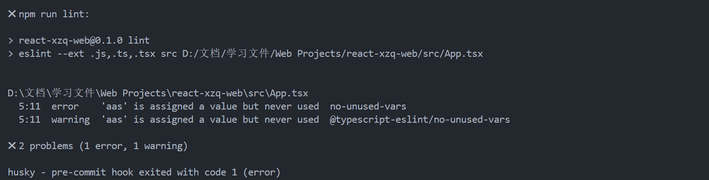
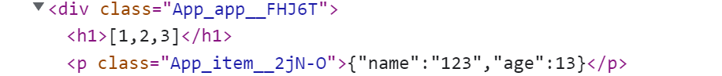

# 第一章 项目初始化配置

## 1.1 ESlint 的详细使用方法

ESLint 是一个可配置的 JavaScript 检查器（实际上可以检查 JS、TS、JSX、TSX、VUE 等主流文件格式）。它可以帮助你发现并修复 JavaScript 代码中的问题。问题可以指潜在的运行时漏洞、未使用最佳实践、风格问题等


关于 .eslintrc.js 文件配置的介绍

- extends：一些拓展封装了它自定义的语法规则，通过下载配置即可继承别人写好的配置规则
- parser：指定一个代码解析器的引擎，让它去检测代码是不是正规合法的，一般情况下使用默认的
- rules：我们自定义的规则，它的优先级是最高的，需要遵循自定义规则规范
- env：指定脚本允许运行的环境，通常 node、browser、es6 全都开启


中文官网：https://zh-hans.eslint.org/docs/latest/

规则大全：https://zh-hans.eslint.org/docs/latest/rules/

自定义规则规范：https://zh-hans.eslint.org/docs/latest/use/configure/rules


安装

```bash
$ npm i eslint -D

$ npx eslint --init # 根据提出的问题会自动生成 .eslintrc.js
```


配置插件：下载 `ESlint` 插件，启用。在 VScode 设置中搜索 `eslint` 可编辑配置（一般不需要编辑）


添加 `lint` 全局检查命令

```json
"lint": "eslint --ext .js,.ts,.tsx src"
```


实现保存时自动进行 ESlint autofix，进入 .vscode/setting.json 添加

```json
"editor.codeActionsOnSave": {
    "source.fixAll.eslint": true
}
```


下面是我自定义的一些规则仅供参考

```js
rules: {
    "indent": ["error", 4], // 缩进

    // "no-unused-vars": [
    //     "error", { "varsIgnorePattern": "Taro|wx" }
    // ], // 检查变量是否有被使用

    "no-unused-vars": 0,

    "no-mixed-spaces-and-tabs": ["error", "smart-tabs"], // 禁止空格和tab的混合缩进

    "no-debugger": 2, //禁止有debugger

    "space-infix-ops": 2, // 要求操作符周围有空格

    "space-before-blocks": 2, // 要求语句块之前有空格

    "import/first": 0, // 消除绝对路径必须要在相对路径前引入的问题

    "semi": ["error", "never"], // 不允许加分号
}
```


ESLint 全方位解析：https://blog.csdn.net/brokenkay/article/details/111106266

React ESlint 报错处理：https://blog.csdn.net/Yuj_l/article/details/125655060


## 1.2 Prettier 的使用和抛弃

Prettier 提供代码格式化方案，**通过下载依赖和插件，设置 .prettierrc.js 的代码格式**。实现保存时自动进行代码格式化。它可以支持 JS、JSX、TS、Flow、JSON、CSS、LESS 等文多种件格式

- 官方文档：https://www.prettier.cn/

- 基本使用指南：https://blog.csdn.net/weixin_44808483

- 代码格式大全：https://blog.csdn.net/weixin_44808483/article/details/118113753
- 到这里实现代码格式化已经基本够用，如果还使用了 ESlint 的话，就会造成冲突！
- 有人 ESlint 就行了，反正我的项目是不会使用 Prettier 的！！！


如果要将 Prettier 集成到 ESLint 当中的话，那么需要下载拓展

```bash
$ npm install prettier eslint-config-prettier eslint-plugin-prettier -D
```


添加拓展，这个拓展会把 ESlint 中可能导致冲突的规则关掉，这样两者就能兼容使用了

```js
"extends": [
    ......
    "plugin:prettier/recommended"
]
```


添加一键格式化命令

```json
"format": "prettier --write src\"/**/*.+(js|ts|tsx|jsx|json|md|json)\""
```


实现保存时自动进行 Prettier 格式化，进入 .vscode/setting.json 添加

```json
"editor.codeActionsOnSave": {
    "source.fixAll.eslint": true
}
```


下面是自定义的一些代码格式仅供参考

```js
//此处的规则供参考，其中多半其实都是默认值，可以根据个人习惯改写
module.exports = {
  printWidth: 100, //单行长度
  tabWidth: 2, //缩进长度
  useTabs: false, //使用空格代替tab缩进
  semi: true, //句末使用分号
  singleQuote: true, //使用单引号
  quoteProps: 'as-needed', //仅在必需时为对象的key添加引号
  jsxSingleQuote: true, // jsx中使用单引号
  trailingComma: 'all', //多行时尽可能打印尾随逗号
  bracketSpacing: true, //在对象前后添加空格-eg: { foo: bar }
  jsxBracketSameLine: true, //多属性html标签的‘>’折行放置
  arrowParens: 'always', //单参数箭头函数参数周围使用圆括号-eg: (x) => x
  requirePragma: false, //无需顶部注释即可格式化
  insertPragma: false, //在已被preitter格式化的文件顶部加上标注
  proseWrap: 'preserve', //不知道怎么翻译
  htmlWhitespaceSensitivity: 'ignore', //对HTML全局空白不敏感
  vueIndentScriptAndStyle: false, //不对vue中的script及style标签缩进
  endOfLine: 'lf', //结束行形式
  embeddedLanguageFormatting: 'auto', //对引用代码进行格式化
}
```


## 1.3 提交代码前的检查

首先介绍 Husky，它可以编写脚本使得在代码提交之前，自动对代码进行格式化、优化、lint 检查。

通过搭配 lint-staged 实现每次提交仅对修改过的代码和未通过检查的文件进行检查。


下载

```bash
$ npm i -D husky lint-staged
```

> 项目版本："lint-staged": "^13.2.2"  "husky": "^8.0.3"

配置 husky

```bash
$ npm pkg set scripts.prepare="husky install"

$ npm run prepare
```

配置 lint-staged

```js
{
    "lint-staged": "lint-staged"
}

// 新建 .lintstagedrc 文件
{
    "src/**/*.{js,ts,tsx,jsx}": "npm run lint"
}
```

添加 pre-commit 钩子

```bash
$ npx husky add .husky/pre-commit "npm run lint-staged" 
```


在提交的时候即可实现报错信息，且提交失败




参考文档：https://blog.csdn.net/huangpb123/article/details/102690412

Husky 入门教程：https://blog.csdn.net/HHoao/article/details/127833268


commitlint：对 commit 提交格式规范检查的工具，使用方式也在参考文档里面

```
单行规范：type(scope?): subject
多行规范：type(scope?): subject 换行 body 换行 footer
例如：chore: run tests on travis ci
例如：fix(server): send cors headers
```

Github：https://github.com/conventional-changelog/commitlint


## 1.4 TS 在项目中的适配

这里会介绍一下项目中对于 TS 的一些适配情况。

tsconfig 配置文件讲解：https://blog.csdn.net/cs23405/article/details/115750351


**React.FC 以及 Props 传参**

React.FC 详细介绍：https://blog.csdn.net/qq_52421092/article/details/127628465，它主要起到一层函数组件规范的作用，如不能用 `setState`，取而代之的是 `useState()`、`useEffect` 等 Hook API

下面介绍 Props 传参方式

```tsx
<CardOption _id={ _id } />
```

```tsx
import React, { FC } from 'react'

interface PropsType {
    _id: string
}

const CardOption: FC<PropsType> = (props: PropsType) => {

    return (
    )
}
```


**useState 的 TS 声明及使用**

```tsx
const [selectedIds, setSelectedIds] = useState<string[]>([])

// 可强制声明类型避免报错
setSelectedIds(value as string[])
```


**指定 event 的类型**

使用 type 进行引入 `ChangeEvent<HTMLInputElement>`、`MouseEvent<HTMLButtonElement>`

```tsx
import React, { FC } from 'react'
import type { ChangeEvent, MouseEvent } from 'react'

const Login: FC = () => {
    const inputChange = (event: ChangeEvent<HTMLInputElement>) => {
        console.log(event.target.value)
    }

    const btnClick = (event: MouseEvent<HTMLButtonElement>) => {
        console.log(event.target)
    }

    return (
        <div className='Login'>
            <input type='text' defaultValue='sdad' onChange={inputChange}/>

            <button onClick={btnClick}>click</button>
        </div>
    )
}
```


## 1.5 组件命名与文件夹规范

这是我在自己的项目里自定义的组件和文件夹命名规范，这里主要做下记录：

- src/layouts：存放 layout 组件，用于页面整体布局，使用 `outlet` 的地方
- src/components：存放公共普通组件
- src/views：存放所有的路由组件

- 有的时候一些公共的普通组件具有相同点的话，还会用一个文件夹进行包裹
- 涉及组件的文件、文件夹都使用驼峰式命名


**路由组件的规范**

首先路由组件放在 `views` 文件夹中，然后创建一个以该路由组件名字命名的文件夹，里面有 `index.tsx`、`index.module.scss`

如果路由组件中有嵌套路由组件，那么该嵌套路由组件也是一样创建一个以该路由组件名字命名的文件夹，里面有 `index.tsx`、`index.module.scss`


**普通组件的规范**

如果是公共的普通组件，那么放到 `components` 文件中，然后创建一个以该组件名字名字的文件夹，里面有 `index.tsx`、`index.module.scss`

如果是普通组件的子组件，那么在当前文件夹下创建 `components` 文件夹，子组件以自己的命名命名在 `components` 文件夹下创建 `JSX` 文件，如果有样式文件，还是在 `components` 文件夹下创建

如果是路由组件下的普通组件，那么在当前文件夹下创建 `components` 文件夹，子组件以自己的命名命名 `components` 文件夹下创建 `JSX` 文件，如果有样式文件，还是在 `components` 文件夹下创建


# 第二章 项目逻辑功能实现

## 2.1 CSS Module 的使用

**CSS Module**

**推荐文章：https://cloud.tencent.com/developer/article/1819624**

我们一般是一个 jsx 文件对应一个 css 文件，但是如果直接这样引入的话，会造成直接引入整个文件，而不是按需加载，这样处理就极有可能对 css 造成全局污染或者冲突，从而就无法达到我们组件化的目的了

```js
import './index.css'
```


Creat React APP 创建的项目原生支持了 CSS Module，**需要规范命名：`*.module.css`**，下面是使用方法

```jsx
import styles from './App.module.css'

(<div className={ styles.app }>
    <p className={ styles.item }>12445</p>
    <p className={ styles['app-black'] }>12445</p>
</div>)
```

```scss
.app {
    color: red;
	
    .app-black {
        color: black;
    }
}

.item {
    color: green;
}   

// 像其他的 CSS 文件一样直接使用类名（也就是普通的设置方法），而不是编译后的哈希字符串
:global(.ant-image-mask) {
    display: none;
}
```

> Creat React APP 创建的项目也原生支持了 SASS Module，直接将后缀名换成 SCSS 即可





**对 TS 的适配**

- 参考文档：https://blog.csdn.net/cs23405/article/details/115752487

- 创建 src/custom.d.ts 声明文件

```js
declare module "*.css" {
    const css : {[key:string]:string};
    export default css;
}

declare module "*.scss" {
    const scss : {[key:string]:string};
    export default scss;
}
```

- **使用 TS 插件使得 VScode 在我们 style. 的时候出现提示**

```bash
$ npm install typescript-plugin-css-modules --save-dev
```

```json
// tsconfig.json
"compilerOptions": {
    ......
    "plugins": [{ "name": "typescript-plugin-css-modules" }]
}
```

```json
// setting.json
{
    ......
    "typescript.tsdk": "node_modules/typescript/lib",
    "typescript.enablePromptUseWorkspaceTsdk": true    
}
```


**CSS in JSX**

有两个推荐的库，可以实现在 jsx 中写 css，但是不推荐在 tsx 中使用因为又要声明一些类型防止报错！

- https://github.com/vercel/styled-jsx
- https://styled-components.com/


## 2.2 项目路由页面介绍

```markdown
## 页面对应的路由

- 首页 MainLayout -> home `/`
- 登录 `/login`
- 注册 `/register`

- 问卷管理 MainLayout -> ManageLayout `/manage`
    - 我的问卷 `/manage/list`
    - 星标问卷 `/manage/star`
    - 回收站 `/manage/trash`
    
- 问卷详情 QuestionLayout `/question`
    - 编辑问卷 `/question/edit/:id`
    - 问卷统计 `/question/stat/:id`
    
- 404 `/*`
```

`MainLayout`：主页面入口

`ManageLayout`：问卷管理页面入口

`QuestionLayout`：新建问卷页面入口


## 2.3 组件编写问题记录

### 2.3.1 React 使用图片相关组件

组件库：https://ant-design.antgroup.com/components/image-cn

```jsx


// antd 图片组件支持预览功能
<Image src={require('@/assets/images/react.png')} />
```

```css
img {
    width: 35px;
    height: 35px;
    cursor: pointer;
    object-fit: contain;
}

:global(.ant-image-mask) {
    display: none;
}
```


### 2.3.2 解决 100vw 出现滚动条

首先我们想让一个容器充满整个浏览器视口，并设置一个最小宽度

```scss
.container {
    width: 100vw;
    min-width: 1200px;
}
```

然后你会发现，当达到一定高度的时候，浏览器出现了纵向滚动条！紧接着横向滚动条也出现了！那是因为 100 vw 也包括了纵向滚动条的宽度

解决办法是**直接将 body 设置为充满整个浏览器视口（不包括纵向滚动条）**

```scss
body {
    width: 100%;
}

// 继承body的宽度即可
.container {
    width: 100%;
    min-width: 1200px;
}
```

> 补充：未指定宽度时，子元素会自动继承父元素的宽度


### 2.3.3 解决 textarea 换行问题

```tsx
// 定义一个文本域受控组件
import React, { FC, useState } from 'react'
import type { ChangeEvent } from 'react'

const Login: FC = () => {

    const textChange = (event: ChangeEvent<HTMLTextAreaElement>) => {
        setText(event.target.value)
    }

    const [text, setText] = useState('')

    return (
            <textarea onChange={textChange}></textarea>
            <div>{ text }</div> // 普通渲染会发现无法显示换行

    )
}
```

```tsx
// 使用这个属性可以成功显示换行
<div dangerouslySetInnerHTML={{ __html: text.replaceAll('\n', '<br>')}}></div>
```


### 2.3.4 搜索框组件设计理念

我们设计搜索框和分页器的时候，要遵循组件解耦原则，既不能修改列表组件里面的内容！于是我们可以通过修改组件之间存在的共同的东西 - 页面 URL，来实现组件间的交互。

**那么搜索框组件的唯一功能就是点击搜索后，将页面 URL 添加 search 参数**，另外这里还实现了受控组件

```tsx
import React, { FC, useState, useEffect } from 'react'
import type { ChangeEvent } from 'react'
import { useLocation, useSearchParams, useNavigate } from 'react-router-dom'
import { LIST_SEARCH_KEY } from '@/constant'
import { Input } from 'antd'
const { Search } = Input

const ListSearch: FC = () => {
    const nav = useNavigate()
    const { pathname } = useLocation()
    const [searchParams] = useSearchParams() 
    const [searchValue, setSearchValue] = useState('')

    // 监测页面url的search参数
    useEffect(() => {
        setSearchValue(searchParams.get(LIST_SEARCH_KEY))
    }, [searchParams])

    // 搜索时改变页面url传入search参数
    const onSearch = () => {
        nav({
            pathname,
            search: `${LIST_SEARCH_KEY}=${searchValue}`       
        })
    }
    
    // 双向数据绑定
    const onChange = (event: ChangeEvent<HTMLInputElement>) => {
        setSearchValue(event.target.value)
    }

    return (
        <Search
            onSearch={onSearch}
            onChange={onChange}
            value={searchValue}
            style={{ width: 280 }}
            placeholder='请输入问卷标题...'
        />
    )
}

export default ListSearch
```


## 2.4 Antd 组件库的使用

### 2.4.1 定制主题和全局语言

一般基于 `ConfigProvider` 这个组件上进行设置，这里只是简单设置

全局主题变量：https://ant-design.antgroup.com/docs/react/customize-theme-cn#theme

```tsx
import { ConfigProvider } from 'antd'
import zhCN from 'antd/locale/zh_CN'

const antdTheme = {
    token: {
        borderRadius: 3, // 设置圆角
    }
}

const root = ReactDOM.createRoot(document.getElementById('root') as HTMLElement)
root.render(
    <ConfigProvider locale={zhCN} theme={antdTheme}>
        <App />
    </ConfigProvider>
)
```


### 2.4.2 Modal 对话框的使用

https://ant-design.antgroup.com/components/modal-cn

```tsx
import React from 'react';
import { ExclamationCircleFilled } from '@ant-design/icons';
import { Button, Modal } from 'antd';

const { confirm } = Modal;

const showConfirm = () => {
  confirm({
    title: 'Do you Want to delete these items?',
    icon: <ExclamationCircleFilled />,
    content: 'Some descriptions',
    onOk() {
      console.log('OK');
    },
    onCancel() {
      console.log('Cancel');
    },
  });
};

const App: React.FC = () => (
    <Button onClick={showConfirm}>Confirm</Button>
);

export default App;
```


### 2.4.3 Table 表格组件的使用

https://ant-design.antgroup.com/components/table-cn

```tsx
// 首先定义列名，一个对象对应一列
const tableColumns = [
    {
        title: '标题',
        dataIndex: 'title',
    },
    {
        title: '是否发布',
        dataIndex: 'isPublished',
        
        // 自定义渲染
        render: (isPublished: boolean) => {
            return isPublished ? <Tag color='processing'>已发布</Tag> : <Tag>未发布</Tag>
        },
    },
    {
        title: '答卷',
        dataIndex: 'answerCount',
    },
    {
        title: '创建时间',
        dataIndex: 'createdAt',
    },
]
```

```jsx
// 数据
const [questionList] = useState([
    {
        _id: 'q1',
        title: '问卷1',
        isPublished: false,
        isStar: false,
        answerCount: 5,
        createdAt: '3月10日 13:23'
    },
    {
        _id: 'q2',
        title: '问卷2',
        isPublished: true,
        isStar: false,
        answerCount: 5,
        createdAt: '3月10日 13:23'
    },
])
```

```tsx
// 渲染
<Table
    rowKey='_id' // 设置唯一key
    pagination={false}
    columns={tableColumns}
    dataSource={questionList}
    style={{ width: '100%' }}
    rowSelection={{ onChange: onSelectedChange }}
/>
```


### 2.4.4 Form 表单的详细使用

#### 2.4.4.1 基础 Form 表单模板

`Form` 组件：最外层必须用 Form 包裹，内部属性如下：

- https://ant-design.antgroup.com/components/form-cn#form
- `labelCol`：设置每一个 Form.Item `label` 标签占总宽度的百分比 8/8+16
- `wrapperCol`：设置每一个 Form.Item 里面的内容（通常为输入框）占总宽度的百分比 
- `onFinish`：当点击 submit 按钮时，表单提交成功的回调函数


`From.Item` 组件，表单的每一项必须用它包裹，内部属性如下：

- https://ant-design.antgroup.com/components/form-cn#formitem

- `rules`：表单项的规则，后面会讲怎么用

- `Input`：输入框组件，有以下选择：`input`、` Input.Password`、` Input.Search`、` Input.TextArea`

- `valuePropName`：指定表单项值的属性（默认将表单项的 **value 属性**映射到了表单内部）

- `wrapperCol`：表单项自定义占总宽度的百分比 ，offset 为在此基础上**向右移动**的百分比距离

  

```tsx
<Form
    name='login'
    labelCol={{ span: 8 }}
    wrapperCol={{ span: 16 }}
    style={{ width: 400 }}
    onFinish={onFinish}
>   
    <Form.Item
        label='用户名'
        name='username'
    >
        <Input />
    </Form.Item>

    <Form.Item
        label='密码'
        name='password'
    >
        <Input.Password />
    </Form.Item>

    <Form.Item name='remember' valuePropName='checked' 
        wrapperCol={{ offset: 8, span: 16 }}
    >
        <Checkbox>记住我</Checkbox>
    </Form.Item>

    <Form.Item wrapperCol={{ offset: 8, span: 16 }}>
        <Button type='primary' htmlType='submit'>
            登录
        </Button>
    </Form.Item>
</Form>
```


#### 2.4.4.2 指定 Form.Item 规则

可新建 `formRules.ts` 文件导出每个表单项所用到的规则，以下规则的类型和使用方式：

https://ant-design.antgroup.com/components/form-cn#rule

```ts
import { Rule } from 'antd/es/form'

export const usernameRulse: Rule[] = [
    { required: true, message: '用户名不能为空！' },
    
    { type: 'string', min: 5, max: 13, message: '用户名长度必须在5-13之间' },
    
    { pattern: /^\w+$/, message: '用户名只能是字母数字下划线' },
]
```

> 一个对象对应一条规则！！


自定义校验规则，通过设置 `validator(rules, value)` 函数，然后返回 promise

```ts
export const confirmPasswordRules: Rule[] = [
    {
        // 这里规定必须输入123，否则报错
        validator(rules, value) {
            if (value == '123') {
                return Promise.resolve()
            } else {
                return Promise.reject(new Error('123'))
            }
        }
    }
]
```

```ts
// 来一个更高级的
export const confirmPasswordRules: Rule[] = [
 
    // 这里使用一个函数来返回一条规则，函数参数接收formRef表单实例
    (formRef) => ({
        validator(rules, value) {
            if (!value || formRef.getFieldValue('password') === value) {
                return Promise.resolve()
            } else {
                return Promise.reject(new Error('两次密码不一致'))
            }
        }
    }),
]
```


组件中对表单项使用规则

```tsx
import { usernameRulse, passwordRules, confirmPasswordRules } from './hooks/formRules'

<Form.Item
    label='用户名'
    name='username'
    rules={usernameRulse}
>
```


#### 2.4.4.3 获取 Form 表单实例

**函数式组件**

```tsx
const [formRef] = Form.useForm()

<Form
    form={formRef}
>   
```


**类组件**

```tsx
import type { FormInstance } from 'antd/es/form'
const formRef = React.useRef<FormInstance>(null)

<Form
  ref={formRef}
>
      
forRef.current | null
```


**Form 表单实例暴露的 API 如下：**https://ant-design.antgroup.com/components/form-cn#forminstance

- `validateFields`：进行表单校验

```ts
const btnClick = () => {
    formRef.validateFields().then((values) => {
        console.log(values)
    }).catch((err) => {
        console.log(err)
    })
}
```

> formRef.validateFields(['username']) 可指定对 username 属性进行校验


其他的自己看文档。。。
