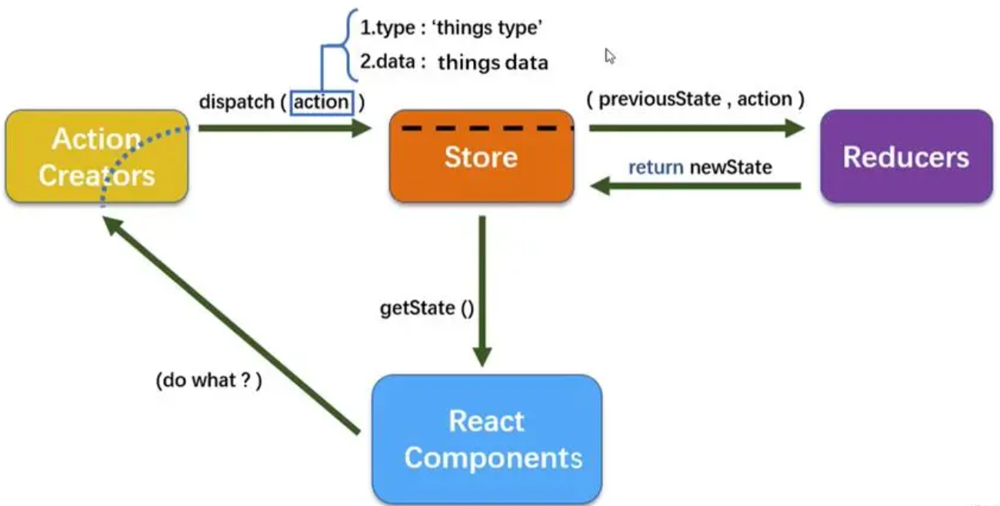
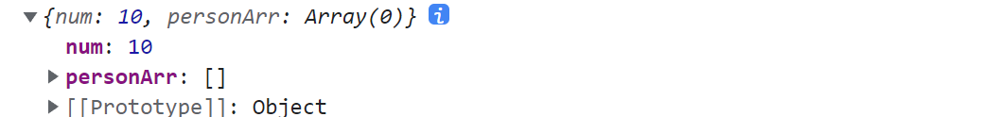
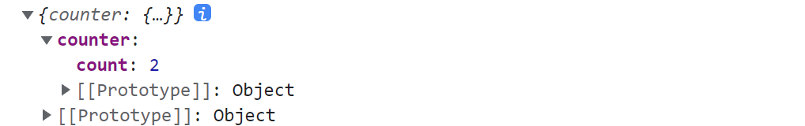

# 第一章 认识 Redux

Redux 是 JavaScript 状态容器，提供可预测化的状态管理，作用：集中式管理 react 应用中多个组件共享的状态

Redux 的数据状态如果想实现响应式，一共有三种方式：仅用 Redux 实现，搭配 React-Redux 实现，使用最新的@reduxjs/toolkit 插件进行编写。


文档前面还是使用 Redux + React-Redux 搭配进行状态管理，后面会用到最新的 @reduxjs/toolkit 进行更新

- 英文官网: https://redux.js.org  中文官网：https://cn.redux.js.org

- 中文文档（未兼容 Redux Toolkit）: http://www.redux.org.cn


Redux + React-Redux 模式安装版本

```json
"react-redux": "7.2.1",
"redux": "4.0.5",
"redux-thunk": "2.3.0",
```


## 1.1 Redux 工作流

Redux 思想其实很简单，我们可以在 `index.js ` 中模拟一下

- `action` 为一个对象，具有 type 属性，type 属性的字段称为 `constants`
- `reducer` 为一个函数，根据 type 处理指定的 `action`，修改仓库数据状态
- 其实仓库数据就是由 `reducer` 维护的，它直接返回仓库数据
- `createStore(reducer)` 创建一个实例仓库，具有 `dispatch`、`getState` 方法

```js
import { createStore } from 'redux'

// 处理指定的action，修改仓库状态
function reducer(state = 10, action) {
    switch (action.type) {
        case 'ADD':
            return state + action.num
    
        case 'SQURE':
            return state * state

        default:
            return state
    }
}

// 实例化仓库
const store = createStore(reducer)

// 读取仓库的状态
console.log(store.getState()) // 10

// 分发action，会调用reducer
store.dispatch({
    type: 'ADD',
    num: 20
})
console.log(store.getState()) // 30
```

```js
// 将action写成函数形式
function myself() {
    const num = 99
    return {
        type: 'MYSELF',
        num
    }
}
store.dispatch(myself())
console.log(store.getState())
```


如果想要引起仓库数据更新视图自动变化，那么纯 Redux 做法是这样的

```jsx
const root = ReactDOM.createRoot(document.getElementById('root'))
root.render(
    <Router><App /></Router>
)

store.subscribe(() => {
    root.render(
        <Router><App /></Router>
    )
})
```




## 1.2 仓库目录拆分

**如果我们将所有的逻辑代码写到一起，那么当redux变得复杂时代码就难以维护**，所以我们最好是有一个单独的文件夹存放这些逻辑。接下来，我会对代码进行拆分，将 store、reducer、action、constants 拆分成一个个文件


**同时也可以变成 reducer、action、constants 文件夹，里面的每个文件对应一个的组件模块！**

参考文档：https://blog.csdn.net/m0_71485750/article/details/126732471


### 1.2.1 进行普通拆分

**创建 store/index.js 文件：**index 文件中, 我们只需要创建 store 即可

```js
import { createStore } from 'redux'
import reducer from './reducer'

export default createStore(reducer)
```

```js
// 最新版 createStore 已经启用改用
import {legacy_createStore as createStore} from 'redux'
```


**创建 store/reducer.js 文件：**在真实项目中, reducer 这个函数我们会越写越复杂, 造成我们 index.js 文件越来越大, 所以我们将 reducer 也抽离到一个单独的文件中

```js
import { ADD, MYSELF } from './constants'

export default function reducer(state = 10, action) {
    switch (action.type) {
        case ADD:
            return state + action.num

        case MYSELF:
            return action.num

        default:
            return state
    }
}
```

> 在 `redux `中的 `reducer `函数规定必须是**一个纯函数**，`reducer `中的`state `对象要求不能直接修改，可以通过扩展运算符把修改路径的对象都复制一遍，然后产生一个新的对象返回（浅拷贝）


**创建 store/constants.js 文件：**将 type 的类型定义为常量（防止写错的情况）, 这些常量最好也防止一个单独的文件中

```js
export const ADD = 'ADD'
export const MYSELF = 'MYSELF'
```


**创建 store/actions.js 文件：**将封装的动态创建 action 的函数放在该文件中, 在需要使用的地方导入即可

 ```js
 import { MYSELF } from './constants'
 // 普通式action
 export const addOne = {
     type: ADD,
     num: 1
 }
 
 // 函数式action
 export function myself() {
     const num = 99
     return {
         type: MYSELF,
         num
     }
 }
 ```


### 1.2.2 reducer 合并

将 reducer 变成一个文件夹，里面封装 `index.js`、`countReducer.js` 等文件

```js
import { combineReducers } from 'redux'
import countReducer from './countReducer'

export default combineReducers({
    countcountReducer
})
```

 ```js
 import reducer from './reducer/index'
 
 export default createStore(reducer, applyMiddleware(thunk))
 ```


**从而导致组件获取仓库数据映射关系时获取到的是一个对象**

```js
const mapStateToProps = state => {
    return {
        state,
    }
}

console.log(this.props.state) // {countReducer: 10}
```

> 这里 state 是一个对象，里面存储了所有 reducer 仓库数据


**因此可以使用简写**

```js
const mapStateToProps = state => {
    return {
        num: state.countReducer
    }
}

console.log(this.props.num) // 10
```


## 1.3 认识 React-redux

前面讲到，我们不会去用纯 Redux 实现仓库数据更新 UI 视图自动变化，而是会用到 React-redux。使用 React-redux 之前肯定必须先配置好 Redux，即 store 文件夹中必须先写好东西

**这里使用的是非 Hooks 版，类组件和函数组件都可以使用**，React-redux 分两个步骤

- 将 APP 组件注册为容器组件

- 普通组件将仓库的 `reducer` 数据和 `action` 函数 映射到 props 当中


### 1.3.1 初始化容器组件

首先进入 index.js ，将 APP 组件注册为容器组件，**目的是让 App 所有的后代的组件都能够获取映射功能**

操作其实很简单，只需要 `Provider` 嵌套和 `store` 作为参数传递即可

```jsx
import store from './store'
import { Provider } from 'react-redux'

const root = ReactDOM.createRoot(document.getElementById('root'))
root.render(
    <Router>
        <Provider store={ store }><App /></Provider>
    </Router>
)
```

下面进行组件映射，将仓库的数据和 action 封装到 props 中


### 1.3.2 组件映射的方法

`mapStateToProps` 、`mapDispatchToProps` 两个 API 的使用下面讲到

```js
import { connect } from 'react-redux'

export default connect(mapStateToProps, mapDispatchToProps)(Count)
```


### 1.3.3 mapStateToProps

在组件中定义一个名为 `mapStateToProps` 的方法，该方法接收一个 `state`

- 如果仓库只有一个 `reducer`，那么 `state` 就等于该 `reducer` 管理的数据
- 如果仓库进行了 `reducer` 合并，那么 `state` 为一个对象，每一个 `reducer` 管理的数据为其中一个属性
- `reducer` 管理的数据的名称就为该 `reducer` 函数名称

```js
// reducer/index.js
import { combineReducers } from 'redux'
import countReducer from './countReducer'
import personReducer from './personReducer'

export default combineReducers({
    countReducer,
    personReducer
})
```

```js
// 只有一个reducerd的写法
const mapStateToProps = state => {
    return {
        num: state,
    }
}

// reducer 合并的写法
const mapStateToProps = state => {
    return {
        num: state.countReducer,
        personArr: state.personReducer
    }
}
```


可以直接通过 props 访问

```js
console.log(this.props)
```



 

### 1.3.4 mapDispatchToProps

在组件中定义一个名为 `mapDispatchToProps` 的对象，通过从 store/action.js 文件中导入 `action` 函数（每个 action 函数返回一个对象）

```js
import { add, asyncAdd } from '@/store/action/countAction'

const mapDispatchToProps = {
    add,
    asyncAdd
}
```


**通过 props 直接调用 action 函数即可，在 React-redux 会自动帮我们 `dispatch` 这个函数**

```jsx
<button onClick={this.increment}>+</button>

increment = () => {
    this.props.add(this.props.num, 1)
}
```


## 1.4 Redux 插件配置项

### 1.4.1 Redux-thunk 的使用

能够使得 `action` 函数处理异步任务，**因为不能直接在 `action` 函数前面加 `async` ！**

- `Redux-thunk` 作为中间件，可以让 `action` 函数返回一个函数，然后在这个函数里处理异步任务
- 返回的函数接收 `dispatch`、`getState` 两个函数
- 组件调用 `asyncAdd` 函数会 `dispatch` 这个函数，然后函数内部又会 `dispatch` 修改状态


**store/index.js：**

```js
import { createStore, applyMiddleware } from 'redux'
import reducer from './reducer/index'
import thunk from 'redux-thunk'

export default createStore(reducer, applyMiddleware(thunk))
```


**action.js**

```js
export function asyncAdd(num) {
    return function(dispatch) {
        setTimeout(() => {
            dispatch({
                type: ADD,
                num
            })
        }, 1000)
    }
}

export function asyncGetData() {
    return async function(dispatch, getState) {
        console.log(getState())
        
        let res = await fetchFn(...)
        if (res == 1) {
            dispatch(...)
        }                        
    }
}
```


组件中和普通函数同样的使用方法

```js
import { asyncAdd } from '@/store/action/countAction'

const mapDispatchToProps = {
    asyncAdd
}

this.props.asyncAdd(1)
```


### 1.4.2 Redux 开发者工具

下载谷歌插件：https://www.extfans.com/web-development/lmhkpmbekcpmknklioeibfkpmmfibljd/

安装中间件依赖：`yarn add redux-devtools-extension`

配置 store/index.js

```js
// 引入 redux-devtools-extension
import { composeWithDevTools } from "redux-devtools-extension"
const store = createStore(
    allReducer,
    composeWithDevTools(applyMiddleware(thunk))
)
```


## 1.5 实现计数器整体流程

实现计数器案例的 Redux + React-redux 完整版流程如下，可以参考：[React-redux 正规使用流程](https://blog.csdn.net/Jie_1997/article/details/128078971)


store/index.js

```js
import { createStore, applyMiddleware } from 'redux'
import reducer from './reducer'
import thunk from 'redux-thunk'

export default createStore(reducer, applyMiddleware(thunk))
```


store/reduer.js

```js
import { ADD } from './constants'

export default function reducer(num = 0, action) {
    switch (action.type) {
        case ADD:
            return num + action.num

        default:
            return num
    }
}
```


store/action.js

```js
import { ADD } from '../constants'

export function add(num) {
    return {
        type: ADD,
        num
    }
}

export function asyncAdd() {
    return function(dispatch) {
        setTimeout(() => {
            dispatch({
                type: ADD,
                num: num
            })
        }, 1000)
    }
}
```


store/constants.js

```js
export const ADD = 'ADD'
```


@/index.js

```jsx
import store from './store'
import { Provider } from 'react-redux'

const root = ReactDOM.createRoot(document.getElementById('root'))
root.render(
    <Router>
        <Provider store={ store }><App /></Provider>
    </Router>
)
```


@/components/Count.jsx

```jsx
import React, { Component, createRef } from 'react'
import { add, asyncAdd } from '@/store/action/countAction'
import { connect } from 'react-redux'

class Count extends Component {
    selectRef = createRef()

    increment = () => {
        this.props.add(Number(this.selectRef.current.value))
    }

    asyncIncrement = () => {
        this.props.asyncAdd(Number(this.selectRef.current.value))
    }

    render() { 
        return (
            <div>
                <h1>{ this.props.num }</h1>
                <select ref={this.selectRef} >
                    <option value="1">1</option>
                    <option value="2">2</option>
                    <option value="3">3</option>
                </select>

                <button onClick={this.increment }>+</button>
                <button onClick={this.asyncIncrement}>异步+</button>
            </div>
        )
    }
}

const mapStateToProps = num => {
    return {
        num
    }
}

const mapDispatchToProps = {
    add,
    asyncAdd
}

export default connect(mapStateToProps, mapDispatchToProps)(Count)
```


## 1.6 Redux 持久化储存方案

Redux-persist：https://blog.csdn.net/hbmern/article/details/124184309

 


# 第二章 Redux Toolkit 入门

在前面我们学习 Redux 的时候应该已经发现，Redux 的编写逻辑过于的繁琐和麻烦。并且代码通常分拆在多个文件中（虽然也可以放到一个文件管理，但是代码量过多，不利于管理）

Redux Toolkit 包旨在成为编写Redux逻辑的标准方式，从而解决上面提到的问题，在很多地方为了称呼方便，也将之称为 `RTK`，**RTK + React-redux Hooks + React Hooks 构成了最新的状态管理模式！**

由于 Redux Toolkit 是最新技术，所以默认是使用 TS 的，VScode 会对部分 API 进行 TS 校验！


只需要安装两个包，即可实现完整功能，包括 Redux-thunk 和 Redux 开发者工具等

```bash
$ npm install @reduxjs/toolkit react-redux
```


## 2.1 store/index.js 配置

新建 `store/index.js` ，用于创建 store 实例

configureStore 包装了 `createStore` 以提供简化的配置选项和良好的默认值。它可以自动组合你的 `reducer`，添加你提供的任何 Redux 中间件，Redux-thunk 默认包含，并启用 Redux DevTools Extension。reducer 属性将所有导入的 reducer 模块合并 


```js
import { configureStore } from '@reduxjs/toolkit'
import counterReducer from './modules/counter'

const store = configureStore({
    // 将所有的Reducer模块合并
    // 总state里面的各个属性名取决于这里定义的名字
    reducer: {
        counter: counterReducer
    },
    
    // 例如可以关闭redux-devtool
    devTools: false    
})

export default store
```

 

## 2.2 Reducer 模块配置

新建 `modules` 文件夹，用于存储不同的 `Reducer` 模块

- `createSlice`：用于将 `reducer` 和 `action` 进行合并，封装成一个 `reducerSlice` 对象

- `initialState`：当前 `Reducer` 模块的数据对象初始值

- `reducers`：成功将 `reducer` 和 `action` 合并成一个函数，可以直接修改该模块的数据对象的值
- **`reducers` 内部只允许写同步函数，异步函数的编写在后面**
- `reducers` 中的方法必须要导出，以便可以被 `dispatch`


```js
import { createSlice } from '@reduxjs/toolkit'

const counterSlice = createSlice({
    name: 'counter',

    initialState: {
        count: 0
    },

    reducers: {
        addNumber(state, action) {
            // console.log(action.payload)
            // console.log(action.type)
            state.count = state.count + action.payload
        }
    }
})

// reducers当中的方法会放在counterSlice的actions中, 用于派发action
export const { addNumber } = counterSlice.actions

// 注意: 导出的是reducer, 用于在store/index.js中的reducer进行使用
export default counterSlice.reducer
```


## 2.3 React-redux 的使用

首先初始化容器组件的方式和之前一致

```jsx
import store from './store'
import { Provider } from 'react-redux'

const root = ReactDOM.createRoot(document.getElementById('root'))
root.render(
    <Router>
        <Provider store={ store }><App /></Provider>
    </Router>
)
```


React-redux 新增两个  hook，代替之前的 `connect(mapStateToProps, mapDispatchToProps)(Count)`

- `useDispatch`：返回一个 `dispatch` 函数，用于 `dispatch` 导入的 action 函数
- `useSelector`：类似于计算属性，传入一个 `state` 全局状态对象，可对它进行属性提取
- **`dispatch` 函数传入的参数直接封装到了 `action.payload` 当中**
- 因此 `action.payload` 可以实现在一个 reducer 模块中访问其他模块的数据，组件作为桥梁


```jsx
import { useDispatch, useSelector } from 'react-redux'
import { addNumber } from '../store/modules/counter'

const Count = () => {
    const dispatch = useDispatch()
    const state = useSelector(state => state)
    const counter = useSelector(state => state.counter)

    const increment = () => {
        console.log(state)
        dispatch(addNumber(1)))
    }

    return (
        <div>
            <h1>{ counter.count }</h1>
            <button onClick={ increment }>+</button>
        </div>
    )
}
export default Count
```

 

 `state` 全局状态对象




## 2.4 异步 action 的使用

由于 `reducerSlice.reducers` 中的函数只能写同步 action 函数，因此我们将异步函数写在外面，当同时也要准备一个同步函数用于 `dispatch` 修改担当前模块数据

store/modules/counter.js

```js
reducers: {
    subNumber(state, action) {
        state.count = state.count - action.payload
    }
}

// 导出异步action
export function asyncSub(payload) {
    return async function(dispatch, getState) {
        console.log(getState()) // 得到当前模块的数据，只读

        setTimeout(() => {
            dispatch(subNumber(payload))
        }, 1000)
    }
}

// 必须要将同步action函数导出才能访问到
export const { subNumber } = counterSlice.actions
```

 

count.jsx 函数组件

```jsx
import React, { useRef } from 'react'
import { useDispatch, useSelector } from 'react-redux'
import { asyncSub } from '../store/modules/counter'

const Count = () => {
    const dispatch = useDispatch()

    const asyncIncrement = () => {
        dispatch(asyncSub(1)))
    }
}
```

> 注意 asyncSub 函数也是要被 dispatch 的！！


## 2.5 实现计数器整体流程

store/index.js

```js
import { configureStore } from '@reduxjs/toolkit'
import counterReducer from './modules/counter'

const store = configureStore({
    reducer: {
        counter: counterReducer
    }
})

export default store
```

store/modules/counter.js

```js
import { createSlice } from '@reduxjs/toolkit'

const counterSlice = createSlice({
    name: 'counter',

    initialState: {
        count: 0
    },

    reducers: {
        addNumber(state, action) {
            // console.log(action.payload)
            // console.log(action.type)
            state.count = state.count + action.payload
        },

        subNumber(state, action) {
            state.count = state.count - action.payload
        }
    }
})

export function asyncSub(payload) {
    return async function(dispatch, getState) {
        console.log(getState())

        setTimeout(() => {
            dispatch(subNumber(payload))
        }, 1000)
    }
}

export const { addNumber, subNumber } = counterSlice.actions

export default counterSlice.reducer
```

@/index.js

```jsx
import store from './store'
import { Provider } from 'react-redux'

const root = ReactDOM.createRoot(document.getElementById('root'))
root.render(
    <Router>
        <Provider store={ store }><App /></Provider>
    </Router>
)
```

@/components/count.js

```jsx
import React, { useRef } from 'react'
import { useDispatch, useSelector } from 'react-redux'
import { addNumber, asyncSub } from '../store/modules/counter'

const Count = () => {
    const selectRef = useRef(null)
    const dispatch = useDispatch()
    const state = useSelector(state => state)
    const counter = useSelector(state => state.counter)

    const increment = () => {
        console.log(state)
        dispatch(addNumber(Number(selectRef.current.value)))
    }

    const asyncIncrement = () => {
        dispatch(asyncSub(Number(selectRef.current.value)))
    }

    return (
        <div>
            <h1>{ counter.count }</h1>
            <select ref={ selectRef } >
                <option value="1">1</option>
                <option value="2">2</option>
                <option value="3">3</option>
            </select>

            <button onClick={ increment }>+</button>
            <button onClick={ asyncIncrement }>异步+</button>
        </div>
    )
}
export default Count
```

