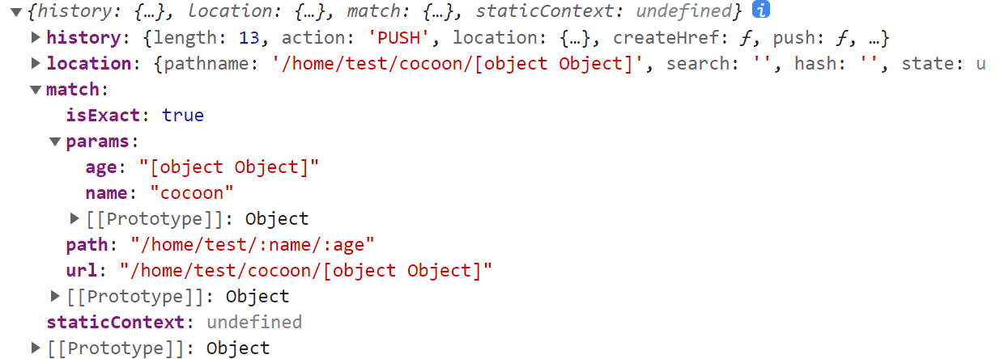
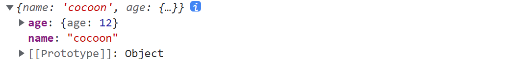
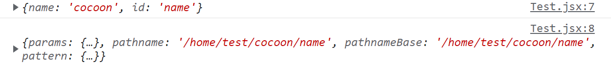
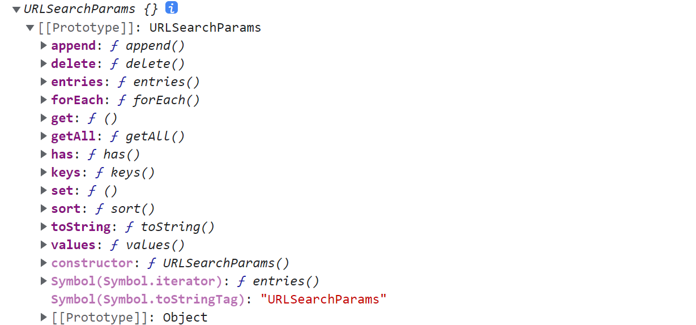
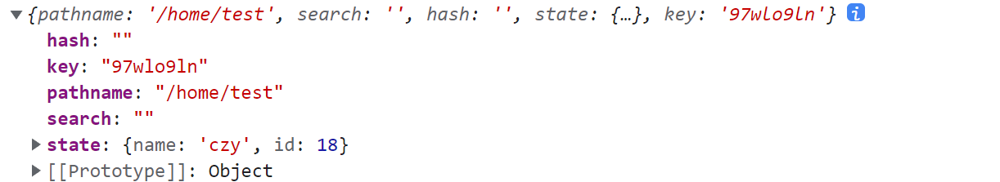
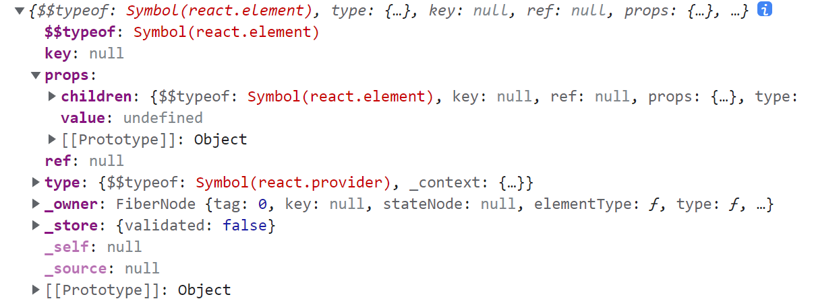

# 第一章 认识 React-Router

组件是 React 的核心功能，其拥有非常强大的声明式编程模型。React Router 是**导航组件**的集合，可与你的应用程序进行声明式的组合。无论你是想为你的 Web 应用程序添加**书签**，还是在 **React Native** 中进行组件化导航，React Router 都可以在 React 的任何位置渲染使用 - 所以请考虑使用！

- 英文官网：https://reactrouter.com/en/main
- 中文官网：http://react-router.docschina.org/web/guides/philosophy


我们 Web 端下载 `React-router-dom` 这个库，现在已经升级到了  V6 版本，如果想下载 V5 版本

```bash
$ npm i react-router-dom@5

$ npm i react-router-dom
```


## 1.1 简单的路由跳转

**首先认识一下路由器**

`BrowserRouter`、`HashRouter`，最好一个应用对应一个路由器！`HashRouter` 其实就是 Vue 路由的哈希模式，理解方式是一样的

- 普通模式：`http://localhost:3000/home`：当前服务器地址就为这个
- 哈希模式：`http://localhost:3000/#/home`：当前服务器地址为 `http://localhost:3000`


**注册全局路由器：**进入入口文件 `index.js`

```jsx
import { BrowserRouter as Router } from 'react-router-dom'

root.render(<Router> <App/> </Router>)   
```


**实现路由跳转**

`Link` 组件实现链接标签的效果，在导航组件中引入，一个 `to` 属性

`Route` 组件实现路由组件占位的效果，也在导航组件中引入，`path`、`component` 属性

```jsx
import React, { memo } from 'react'
import { Link, Route } from 'react-router-dom'

const App = memo(() => {
    return (
        <div>
            <Link to='/about'>about</Link>
            <Link to='/home'>home</Link>
            <Route path='/about' component={About}/>
            <Route path='/home' component={Home} />
        </div>
    )
})

function About(props) {
    console.log(props)
    return (<div>about</div>)
}

function Home() {

    return (<div>home</div>)
}

export default App
```


## 1.2 路由功能点记录

### 1.2.1 NavLink 组件

- `NavLink` 组件也可以实现 `Link` 的功能，并且它支持自动给选中的链接添加一个 `active` 的类名
- 自定义 `active` 类名通过 `activeClassName` 属性设置
- 标签体内容可以通过 `children` 属性实现


**NavLink 的使用**

```jsx
<NavLink to='/about' activeClassName='ggg'>about</NavLink>
<NavLink to='/home' activeClassName='myActive' children='home'/>
```


**封装 NavLink**

 ```jsx
 function MyNavLink(props) {
     return (<NavLink className='link' activeClassName='myActive' {...props} />)
 }
 
 <MyNavLink to='/home'>home</MyNavLink>
 ```

> 使得不用重复写 activeClassName 和 className 等公共属性了


### 1.2.2 Swicth 组件

多个 Route 组件进行匹配的时候，匹配到一个还会继续向下匹配，直到匹配到最后一个组件。Switch 组件可以使得匹配到第一个组件就停止匹配


下面代码匹配到 Home 组件而不是 Test

```jsx
<Switch>
    <Route path='/about' component={About}/>
    <Route path='/home' component={Home} />
    <Route path='/home' component={Test} />
</Switch>
```

 

### 1.2.3 路由匹配规则

**路由默认是进行模糊匹配，下面是匹配规则**

```jsx
<Route path='/about' component={About}/>

<Link to='a/about/b'>a/about/b</Link>
```

会被拆解为 a、about、b，因为 a 没有匹配上 about 所以无法匹配


```jsx
<Route path='/about' component={About}/>

<Link to='about/a/b'>a/about/b</Link>
```

这个会被成功匹配


**通过添加 `exact` 属性可以开启严格匹配，只有 to 和 path 一一对应**

```jsx
<Route exact path='/about' component={About}/>

<Link to='about/a/b'>a/about/b</Link>
```

`Link` 无法匹配，所以这个 `Route` 组件不能作为嵌套路由组件！


### 1.2.4 Redirect 组件

路由重定向：当页面跳转时，若跳转链接没有匹配上任何一个 `Route` 组件，那么就会显示 `404` 页面，所以我们需要一个重定向组件 `Redirect`

```jsx
<Switch>
    <Route path="/home" component={Home} />
    <Route path="/about" component={About} />
    <Redirect to="/home" />    {/* 当以上Route组件都匹配失败时，重定向到/home */}
</Switch>
```


### 1.2.5 replace 属性

浏览器的历史记录有两种写入方式：分别为 ```push``` 和 ```replace```，```push``` 是追加历史记录，```replace``` 是替换当前记录。路由跳转时候默认为 ```push```

```jsx
<Link replace to={{ pathname: '/home/test', state: {name, age} }}>test</Link>
```


## 1.3 嵌套路由的实现

嵌套路由的实现，下面是匹配规则：

- 输入 `http://localhost:3000/home/test`，
- 会先匹配最顶层的 `Route`组件有没有对应的 `home` 路径，
- 若匹配则再进入 `Home` 组件进行匹配里面 `Router` 组件的 `home/test` 路径对应的组件
- **注意：路径必须写全，不能省略上层路径**


**导航组件**

```jsx
import { Link, Route, NavLink, Switch, Redirect } from 'react-router-dom'
import Home from './views/Home'

const App = memo(() => {
    return (
        <div>
            <Link to='/about'>about</Link>
            <Link to='/home'>home</Link>

            <Switch>
                <Route path="/home" component={Home} />
                <Route path="/about" component={About} />
                <Redirect to="/home" />
            </Switch>
        </div>
    )
})

function About(props) {
    console.log(props)
    return (<div>about</div>)
}
```


**Home 组件**

```jsx
import { Link, Route, NavLink, Switch, Redirect } from 'react-router-dom'
import Test from './Test'
import News from './News'

export default function Home() {
    return (
        <div>
            <Link to='/home/test'>test</Link>
            <Link to='/home/news'>news</Link>

            <Switch>
                <Route path="/home/test" component={Test} />
                <Route path="/home/news" component={News} />
                <Redirect to="/home/test" />
            </Switch>            
        </div>
    )
}
```


## 1.4 路由三种传参方式

`BrowserRouter` 路由器会将路由组件的 props 封装，下面是它的一些常见属性

 路由器主要维护的是 `history` 属性，即使页面刷新，路由组件的 `history` 属性依然不变，从而它携带的参数也依然存在


### 1.4.1 params 参数

`Link` 组件传递 params 参数，**参数全部会转化为字符串形式**

```jsx
const name = 'cocoon'
const age = {age: 12}

<Link to='/home/test/cocoon/18/'>test</Link>

<Link to={`/home/test/${name}/${age}`}>test</Link>
```


`Route` 组件接收 params 参数

```jsx
<Route path="/home/test/:name/:age" component={Test} />
```


嵌套路由组件中通过 `this.props.match.params` 获取




### 1.4.2 search 参数

`Link` 组件传递 search 参数，**参数全部会转化为字符串形式**

```jsx
const name = 'cocoon'
const age = {age: 12}

<Link to='/home/test/?name=cocoon&age=21'>test</Link>

<Link to={`/home/test/?name=${name}&age=${age}`}>test</Link>
```


`Route` 组件接收 search 参数，无需任何操作

```jsx
<Route path="/home/test" component={Test} />
```


嵌套路由组件中通过 `this.props.location.search` 获取，返回的是字符串

```js
'?name=cocoon&age=[object Object]'
```

 

通过 `qs` 库进行解析成对象形式

- npm 地址：https://www.npmjs.com/package/qs
- 使用文档：https://blog.csdn.net/weixin_45828332/article/details/120265967

```jsx
import qs from 'qs'

export default function Test(props) {
    console.log(props.location.search)
    const searchObj = qs.parse(props.location.search.slice(1))
    console.log(searchObj)
    return (<div>test1</div>)
}
```


### 1.4.3 state 参数

`Link` 组件传递 search 参数，**参数接收所有数据类型**，传递 state 参数时，路径地址不会显示

```jsx
const name = 'cocoon'
const age = {age: 12}

<Link to={{ pathname: '/home/test', state: {name, age} }}>test</Link>
```


`Route` 组件接收 search 参数，无需任何操作

```jsx
<Route path="/home/test" component={Test} />
```


嵌套路由组件中通过 `this.props.location.state` 获取，页面刷新依然存在




页面刷新后对路由 state 参数的影响

- `BrowserRouter` 没有任何影响，因为 state 保存在 history 对象中
- `HashRouter` 刷新后会导致路由 state 参数丢失
- `HashRouter` 可以用于解决一些路径错误相关的问题


## 1.5 编程式路由导航

### 1.5.1 函数式路由

以上主要都是通过 `react-router-dom` 中的 `Link` 组件来往某个路由组件跳转，但有时，我们需要更灵活的方式进行跳转路由，例如通过调用一个函数，随时随地进行路由跳转，这就叫函数式路由

```jsx
props.history.replace('/about')

props.history.push('/about', state)

props.history.go(n) // 正数为前进

props.history.goBack()

props.history.goForward()
```


### 1.5.2 withRouter

因为路由组件会在 `Route` 组件中定义好，所以路由器会把路由组件的 props 封装好。而普通组件的 props 并没有路由的一些属性，`withRouter` 可以实现这个效果

```jsx
import {  withRouter } from 'react-router-dom'

const Demo = withRouter(function(props) {
    console.log(props)
    return (
        <div>demo</div>
    )
})

// 或者最后，类组件就是这样的
export default withRouter(Demo)
```


# 第二章 React-Router V6

**如果下面的内容没讲到的 V5 API 那么就还可以继续用**。与 React Router 5.x 版本相比，改变了什么？

- 注册路由器 `BrowserRouter` 还是一样的！

- 内置组件的变化：移除 `<Switch/>` ，新增 `<Routes/>` 等

- 语法的变化：`component={About}` 变为 `element={<About/>}`等

- **新增多个 Hook，Hook 只被允许在函数组件中使用！！**

- **官方明确推荐函数式组件了！！！**

  

创建路由阶段依旧可以使用前面用到的在 index.js 里面的操作

```jsx
import { BrowserRouter as Router } from 'react-router-dom'

root.render(<Router> <App/> </Router>)   
```


参考文档：https://blog.csdn.net/qq_45679015/article/details/123767993


## 2.1 Routes 的使用

`Switch` 已经废弃！下面介绍 `Routes` 使用方法

- Routes 和 Route 要配合使用，且必须要用 Routes 包裹 Route
- 相当于一个 if 语句，如果其路径与当前 URL 匹配，则呈现其对应的组件，不再往下查找
- `<Route caseSensitive>` 属性用于指定：匹配时是否区分大小写（默认为 false）
- `component={About}` 变为 `element={<About/>}`

```jsx
import { Route, Routes, NavLink, Navigate } from 'react-router-dom'
import Home from './Views/Home'
import About from './Views/About'

function App() {
    return (
        <div>
            <NavLink to='/home'>home</NavLink>
            <NavLink to='/about'>about</NavLink>

            <Routes>
                <Route path='/home' element={ <Home /> }/>
                <Route path='/about' element={ <About /> } />
            </Routes>
        </div>
    )
}
```


## 2.2 Navigate 的使用

V5 用于重定向的 `Redirect` 组件已经废弃，新增 ``Navigate`` 组件

- 只要 `Navigate` 组件**被渲染，就会修改路径**，切换视图
- 可以理解为执行了一个路径跳转命令，**跳转到指定地址**
- **`to` 属性写的是路由地址，可以写完整路径，也可以写嵌套路由组件的简写**
- `replace` 属性用于控制跳转模式（push 或 replace，默认是push）


重定向的使用

**`path` 属性写上当前路径**，`Navigate` 组件上的 `to` 属性写上重定向路径

```jsx
<Routes>
    <Route path='/home' element={ <Home /> }/>
    <Route path='/about' element={ <About /> } />
    <Route path='/' element={ <Navigate to='/about' /> } />
</Routes>
```


路由表重定向

```js
{
    path: '/home',
    element: <Home />,
},
{
    path: '/about',
    element: <About />
},
{
    path: '/',
    element: <Navigate to='/about' />
}
```


嵌套组件中实现重定向

```js
{
    path: 'home',
    element: <Home />,
    children: [
        {
            path: 'test',
            element: <Test />,
        },
        {
            path: 'news',
            element: <News />,
        },
        {
            path: '/home',
            element: <Navigate to='news' />,
        }
    ]
}
```


其他使用

```jsx
import React,{useState} from 'react'
import {Navigate} from 'react-router-dom'
 
export default function Home() {
	const [sum,setSum] = useState(1)
	return (
		<div>
			<h3>我是Home的内容</h3>
			{/* 根据sum的值决定是否切换视图 */}
			{sum === 1 ? <h4>sum的值为{sum}</h4> : <Navigate to="/about" replace={true}/>}
			<button onClick={()=>setSum(2)}>点我将sum变为2</button>
		</div>
	)
}
```


## 2.3 NavLink 高亮效果

V5 里 `NavLink` 的自定义 `active` 类名通过 `activeClassName` 属性已经废弃，我们通过让 `className` 接收一个函数来实现 `NavLink` 高亮效果。函数参数接收一个对象，里面有 `isActive` 属性

```jsx
<NavLink to='/home' className={
    ({ isActive }) => isActive ? 'myActive' : ''
} >home</NavLink>
```


把函数写在外面会更方便

```jsx
function clickNavLink({isActive}) {
    return isActive ? 'myActive' : ''
}

<NavLink to='/about' className={clickNavLink} >about</NavLink>
```


## 2.4 路由表的使用

### 2.4.1 useRoutes Hook

只能说这个 API 彻底回到 Vue 路由了，哈哈哈！`Routes` 那一堆东西可以直接用路由表来代替

```jsx
<Routes>
    <Route path='/home' element={ <Home /> }/>
    <Route path='/about' element={ <About /> } />
    <Route path='/' element={ <Navigate to='/about' /> } />
</Routes>
```


新建文件夹 `routes` 新建文件 `index.js`，导出一个路由规则数组

```js
import Home from '../views/Home'
import About from '../views/About'
import React from 'react'
import { Navigate } from 'react-router-dom'

export default [
    {
        path: '/home',
        element: <Home />
    },
    {
        path: '/about',
        element: <About />
    },
    {
        path: '/',
        element: <Navigate to='/about' />
    }
]
```


函数组件中定义一个路由表，并放在需要的渲染的位置

```jsx
import React from 'react'
import routes from './routes/index'
import { NavLink, useRoutes } from 'react-router-dom'

function App() {
    const elements = useRoutes(routes)

    function clickNavLink({isActive}) {
        return isActive ? 'myActive' : ''
    }

    return (
        <div>
            <NavLink to='/home' className={clickNavLink} >about</NavLink>
            <NavLink to='/about' className={clickNavLink} >about</NavLink>

            { elements }
        </div>
    )
}
```


### 2.4.2 Outlet 嵌套组件

在路由表中定义嵌套组件，嵌套组件中路径可以简写**（一级路径最好不要简写！！）**

- `path: 'test'` 等效于 `path: './test'`
- 千万不能写成 `path: '/test'` 的形式！！

```js
{
    path: '/home',
    element: <Home />,
    children: [
        {
            path: 'test',
            element: <Test />,
        },
        {
            path: 'news',
            element: <News />,
        },
        // 重定向
        {
            path: '/home',
            element: <Navigate to='news' />,
        }  
        // 还可以直接默认渲染一个子组件
        {
            path: '/home',
            element: <HomeChildren />,
        }          
    ]
}
```


在 Home 路由组件中使用嵌套路由，需要用到 `Outlet` 组件占位，类似于 Vue 里面的 `route-view`

```jsx
import React from 'react'
import { Outlet, NavLink } from 'react-router-dom'

function Home() {
    function clickNavLink({ isActive }) {
        return isActive ? 'myActive' : ''
    }

    return (
        <div>
            <NavLink to='news' className={clickNavLink} >news</NavLink>
            <NavLink to='./test' className={clickNavLink} >test</NavLink>

            <Outlet />
        </div>
    )
}
```


## 2.5 路由组件接收参数

V5 的 `BrowserRouter` 路由器会将路由组件的 props 自动封装，因此我们获取参数直接从路由组件的 `this.props` 中获取即可！但是 V6 路由组件的 props 已经是空的了！

-  路由组件通过 `react-router-dom` 暴露出来的 hooks 来获取参数
- 三种参数的传递方式还是 V5 版本


### 2.5.1 useParams/useMatch

useParams：获取 params 参数

useMatch：获取 match 属性

```jsx
import { useParams, useMatch } from 'react-router-dom'

const params = useParams()
const match = useMatch('/home/test/:name/:id') // 注意要写完整路径！

console.log(params, match)
```




### 2.5.2 useSearchParams

useSearchParams：获取 search 参数

- 通过 `search.get('id')` 获取属性值
- 属性值可以区分数字和字符串类型

```jsx
import React from 'react'
import { useSearchParams } from 'react-router-dom'

function Test() {
    const [search] = useSearchParams()
    const id = search.get('id')
    const name = search.get('name')

    console.log(id,name)

    return (
        <div>
            {id}  {name}
            <button onClick={() => setSearch('?name=czy&id=21')}>click</button>
        </div>
    )
}

export default Test
```

search 对象的一些 API




**搭配 useNavigate 实现跳转时改变路由 search 参数**

```js
// 直接设置参数
import { useLocation, useSearchParams, useNavigate } from 'react-router-dom'

const nav = useNavigate()
const { pathname } = useLocation()
const [searchParams] = useSearchParams() 

const onSearch = () => {
    nav({
        pathname,
        search: `keyword=123`
    })
}
```

```js
// 添加参数，参数已经存在时会自动更新
const onSearch = () => {
    searchParams.set(keyword, 123)
    
    nav({
        pathname,
        search: searchParams.toString() // 所有参数自动转化为 `keyword=123&name=coco`
    })
}
```


### 2.5.3 useLocation

V5 里面传输 state 参数是这样的

```jsx
<Link to={{ pathname: '/home/test', state: {name, age} }}>test</Link>
```

 

V6 变的更简单了

```jsx
<NavLink to='./test' state={{ name: 'czy', id: 18 }} >test</NavLink>
```


然后依然从 location 属性获取 state 参数

```js
import { useLocation } from 'react-router-dom'

const location = useLocation()
console.log(location)
```




## 2.6 useNavigate Hook

V5 的路由组件通过 `this.props.history` 、普通组件通过 `withRouter` 实现函数式路由

V6 不管是普通组件还是路由组件都通过 `useNavigate` 实现

```jsx
import { useNavigate } from 'react-router-dom'

function goTo() {
    const navigate = useNavigate()
    const age = 18
    
    // 传递params参数
    navigate('/about/${age}')

    // 传递search参数
    nav({
        pathname: '/login',
        search: `keyword=${value}`       
    })
        
    // 传递state参数
    navigate('/home/news', {
        replace: true,
        state: { name: 'cocoon' }
    })

    // 前进后退
    navigate(1)
    navigate(-1)
}
```


## 2.7 其他路由 Hooks

### 2.7.1 useInRouterContext

作用：如果组件在 `<Router>` 的上下文中呈现，则 `useInRouterContext` 钩子返回 true，否则返回 false

```jsx
ReactDOM.render(
    // App处于路由组件上下文中，而Demo组件没有处于上下文
    <div>
        <Demo />
        <BrowserRouter >
            <App />
        </BrowserRouter>
    </div>
, document.getElementById('root'))
```


### 2.7.2 useNavigationType

作用：返回当前的导航类型（用户是如何来到当前页面的）

- 返回值：`POP`、`PUSH`、`REPLACE`。

- 备注：`POP` 是指在浏览器中直接打开了这个路由组件（刷新页面）


### 2.7.3 useOutlet

作用：用来呈现当前组件中渲染的嵌套路由，**不知道有啥用**

```jsx
const result = useOutlet()
console.log(result)
// 如果嵌套路由没有挂载，则result为null
// 如果嵌套路由已经挂载，则展示嵌套的路由对象，下面是这个对象
```




### 2.7.4 useResolvedPath

作用：给定一个 URL值，解析其中的：path、search、hash值

```jsx
console.log('useResolvedPath',useResolvedPath('/user?id=001&name=tom#qws'))

 //输出：{pathname: "/user", search: "?id=001&name=tom", hash: "#qws"}
```


## 2.8 创建路由整体流程

index.js

```jsx
import { BrowserRouter as Router } from 'react-router-dom'

root.render(<Router> <App/> </Router>)   
```


router/index.jsx

```jsx
import React from 'react'
import MainLayout from '@/layouts/MainLayout'
import Home from '@/views/Home'
import Login from '@/views/Login'
import NotFound from '@/views/NotFound'

export default [
    {
        path: '/',
        element: <MainLayout />,

        children: [
            {
                path: '/',
                element: <Home />
            },
            {
                path: 'login',
                element: <Login />
            },
            {
                path: '*',
                element: <NotFound />
            },            
        ]
    },
]
```


App.jsx

```jsx
import React, { FC } from 'react'
import { useRoutes } from 'react-router-dom'
import routes from '@/router/index'

const App: FC = () => {
    const elements = useRoutes(routes)

    return (
        <div className='App'>
            { elements }
        </div>
    )
}

export default App
```


MainLayout.jsx

```jsx
import React, { FC } from 'react'
import { Outlet } from 'react-router-dom'


const MainLayout: FC = () => {
    return (
        <div className='main-container'>
            <h1>heater</h1>
            
            <Outlet />
            
            <h1>foot</h1>
        </div>
    )
}

export default MainLayout
```


## 2.9 createBrowserRouter

最新版本还可以用这种方式创建路由器：

- 使用 createBrowserRouter 这个方法可以直接创建一个路由器，与之对应的是 createHashRouter

- 代替之前的 `BrowserRouter`、`HashRouter` 用标签创建路由器

- 通过搭配 RouterProvider 组件进行路由的挂载，代替之前的 useRoutes 创建的 `{ element }`

App.jsx

```jsx
import React, { FC } from 'react'
import { RouterProvider } from 'react-router-dom'
import router from './router'

const App: FC = () => {

    return (
        <div className='App'>
            <RouterProvider router={ router }></RouterProvider>
        </div>
    )
}

export default App
```


router/index.js

```jsx
import React from 'react'
import { createBrowserRouter } from 'react-router-dom'

import MainLayout from '@/layouts/MainLayout'
import Home from '@/views/Home'
import Login from '@/views/Login'
import NotFound from '@/views/NotFound'

export default createBrowserRouter([
    {
        path: '/',
        element: <MainLayout />,

        children: [
            {
                path: '/',
                element: <Home />
            },
            {
                path: 'login',
                element: <Login />
            },
            {
                path: '*',
                element: <NotFound />
            },
        ]
    },
])
```

其他使用没有变化
