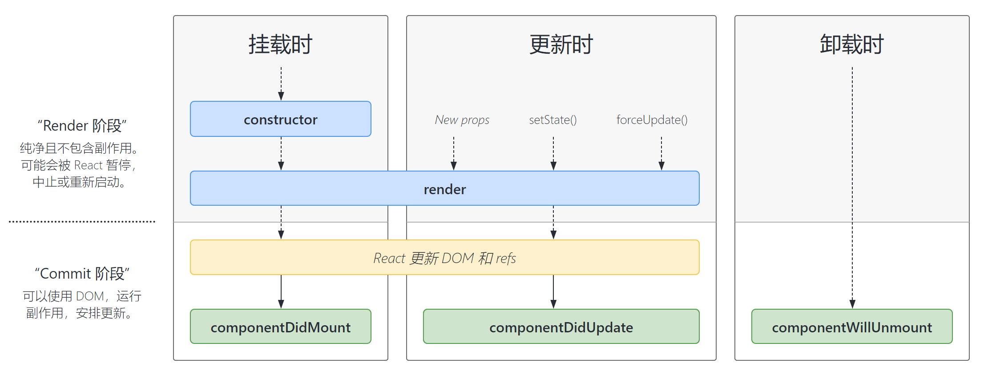
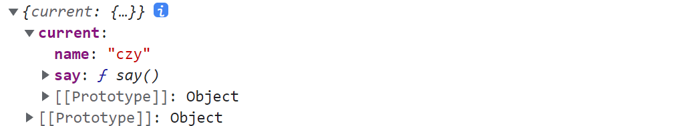

# 第一章 认识 React

A JavaScript library for building user interfaces （用于构建用户界面的 JavaScript 库）


`ReactJS` 是由 Facebook 在 2013年 5 月推出的一款 JS 前端开源框架,推出式主打特点式函数式编程风格。值得一说的是，到目前为止 `ReactJS` 是世界上使用人数最多的前端框架,它拥有全球最健全的文档和社区体系。


ReactJS 的官方英文网站为：https://reactjs.org/

ReactJS 的中文网站为：https://zh-hans.reactjs.org/


## 1.1 项目启动初始化

React 组件文件可以用 `.jsx` 也可以用 `.js` 文件，两者没有区别

主要参考文档：https://lanan.blog.csdn.net/article/details/126923270

Create React App 中文文档：https://create-react-app.bootcss.com/


使用脚手架 `create-react-app` 启动一个项目，默认情况下**脚手架搭建的项目配置文件都是隐藏的**

```bash
$ npx create-react-app react-test
```


- **新建 `jsconfig.json` 使得 VScode 对项目的 JS 代码进行优化**

如果没配置好 `jsconfig.json`，部分报错将无法识别！！目前没有找到解决办法

```js
{
    "compilerOptions": {
        "target": "es3",
        "module": "esnext",
        "baseUrl": "./",
        "moduleResolution": "node",
        "paths": {
            "@/*": [
                "src/*"
            ]
        },
        "jsx": "preserve",
        "lib": [
            "esnext",
            "dom",
            "dom.iterable",
            "scripthost"
        ]
    }
}
```

> 通常 target 选项会报错，根据提示选择项目对应的版本
>
> 参考：https://juejin.cn/post/7079769333471117343


- **安装 VS code 插件**

Simple React Snippets：快速生成代码

```jsx
imr 
import React, { Component } from 'react';

cc
class rcom extends Component {
    state = {  }
    render() { 
        return (  );
    }
}
export default rcom;
```


- **显示 React 项目配置文件**

```bash
$ npm run eject
```

> 仓库必须 Git  初始化命令才会生效

执行之后，会多出以下项目配置文件夹：scripts、config。

通常不需要动这些文件，如果要实现某些配置的业务逻辑，直接现搜即可！！一般会有第三方解决方法


 

## 1.2 JSX 语法规则

JSX 就是 Javascript 和 XML 结合的一种格式。React 发明了 JSX，可以方便的利用 HTML 语法来创建虚拟 DOM，当遇到 `<`，JSX 就当作 HTML 解析，遇到 `{` 就当 JavaScript 解析

文档：https://www.yuque.com/fechaichai/qeamqf/xbai87#M1UW5


**{} 插入内容**

- 可以理解为插入的是 JS 表达式

- 当插入的变量是Number、String、Array、节点等类型时，可以直接插入显示，**其他类型插入会报错**

- 还支持函数、函数调用、 三元表达式、运算表达式

```jsx
const name = '柴柴'

(<h1>你好，我叫{ name }</h1>)
```

> 注意是表达式，所以不能写语句

```jsx
// 如果想直接显示对象类型可以这样写
<p>{ JSON.stringify(user) }</p> 

// 数组类型
<h1>{ countArr }</h1> // 会变成字符串
<h1>{JSON.stringify(countArr) }</h1>
```


**列表渲染**

使用 map 将返回一个数组，每次循环返回的项会放入数组中。JSX 渲染数组时会将每一项逐个渲染出来

```jsx
<div className="App">
    {/* 列表渲染 */}
    {list.map(item => (
        <div key={ item } onClick={ clickMe }>{ item }</div>
    ))}
</div>
```

> 同样列表元素需要加上 key！！使用 map 因为会返回一个充满节点的新数组


**条件渲染**

```jsx
const flag = true

function App() {
  return (
    <div className="App">
      {/* 条件渲染字符串 */}
      {flag ? 'react真有趣' : 'vue真有趣'}

      {/* 条件渲染标签/组件 */}
      {flag ? <span>this is span</span> : null}
      {flag && <span>this is span</span> }
    </div>
  )
}
```


**样式处理**

多个 `class` 动态绑定需要安装插件

```bash
$ npm i classnames
```

```jsx
import React, { Component } from 'react'
import classNames from 'classnames'
 
const classObj = {
    active: true,
    testr: true
}

const flag = true

function App() {
    return (
        <div className="App">

            {/* 使用内联样式 */}
            <div style={ {color: 'red', fontSize: '16px'} }></div>

            {/* 单个动态绑定 */}
            <div className={ flag ? 'avtive' : 'defalut' }></div>

            {/* 多个动态绑定 */}
            <div className={ classNames(classObj) }></div>
            
        </div>
    )
}
```


**幽灵节点**

```jsx
function App() {

    return (
        // 幽灵节点不会被渲染
        <>
        <div className="App">
        </div>
        
        <div></div>
        </>
    )
}
```

也可以使用 Fragment，类似于 Vue 里面的 Fragment，可以接收一个 key 属性

参考文档：https://boboy.blog.csdn.net/article/details/104943812


**lable 标签中的 `for` 要替换成 `htmlFor`**

```jsx
<label htmlFor="jspang">加入服务：</label>
<input id="jspang" className="input" value={this.state.inputValue} />
```


## 1.3 React 组件化

组件化分为两种写法：函数组件、类组件

```jsx
import React, { Component } from 'react'

// 类组件
class Test extends Component {
    state = {  } 
    render() { 
        return (
            <div>hello</div>
        )
    }
}

// 函数组件
function App() {

    return (
        <div className="App">
            <Test />
        </div>
    )
}

export default App
```

函数组件在 React Hook 中再具体使用，后面的默认使用类组件


## 1.4 响应式和事件绑定

这里是 React18 之前的响应式实现方式，React18 之后使用函数组件，下面的 API 被 Hooks 替换了


### 1.4.1 实现响应式数据

初始化数据定义在类组件实例的 `state` 属性上

React 是禁止直接操作 `state` 的！我们一般通过 `setState` 这个 API 进行状态修改

- `setState` 方法是从 `Component` 中继承过来的，所以可以直接 `this.setState`
- `setState` 方法传入的该对象会和 `this.state` 的对象进行一个合并, **相同的属性会进行覆盖**
- **`setState` 的更新是异步的**，我们并不能在执行完 `setState` 之后立马拿到最新的 `state` 的结果


**方式一：`setState` 直接传入一个对象**

```jsx
class Test extends Component {
    state = {
        name: 'cocoon'
    }
    
    clickBtn = () => {
        this.setState({
            name: this.state.name + 'czy'
        })
    }

    ...
    <button onClick={ this.clickBtn }>clickBtn</button>
	...
}
```


**方式二：`setState` 传入一个回调函数，函数直接接收 `stete`、`props` 参数，然后返回一个对象即可**

```jsx
class Test extends Component {

    state =  {
        list: [1,2,4,5,6]
    }
    
    clickBtn() {
        this.setState((state, props) => {
            console.log(state, props)
            const list = this.state.list.filter(item => item > 2)

            return {
                list
            }
        })
    }

    <button onClick={ () => this.clickBtn() }>
        clickBtn
    </button>
    { this.state.list }
}
```


**因为是异步的，所以可接收第二个回调函数获取最新的状态数据**

```jsx
clickBtn() {
    this.setState((state, props) => {
        console.log(state, props)
        const list = this.state.list.filter(item => item > 2)

        return {
            list
        }
    }, () => {
        console.log(this.state.list)
    })
}
```


注意 state 是不可变数据，引用类型遵循不可变数据原则：不去修改 state 的值，而是传入一个新的值

因此解决方式有：PureComponent 组件的浅比较、immer 的使用


### 1.4.2 实现事件绑定

**事件绑定就是事件名称 + 回调函数**

- 首先要绑定事件时要指定 `this` 指向，事件参数默认接收 `e`
- 普通成员函数建议使用箭头函数
- 内置函数可以不适用箭头函数，里面的 this 已经被封装好了 

```jsx
// 类里面定义成员函数
show = (e) => {
    console.log(e)
}
```

```jsx
// 传入参数
<Button type="primary" onClick={(e) => this.show(e, 其他参数)}>按钮</Button>

// 无多余参数
<Button type="primary" onClick={ this.show }>按钮</Button>
```


**事件里面的回调函数最好写成如下格式，不要简写图方便！**

```jsx
<Button onClick={ () => fun() }>按钮</Button>
```


**成员函数不使用箭头函数的后果：没有自己的 this 指向**，有两个方式修正

```jsx
class Test extends Component {
    
    constructor() {
        super()
        // 修正方式一
        this.clickBtn = this.clickBtn.bind(this)
    }

    // 定义普通函数
    clickBtn() {
        console.log(1111)
        console.log(this)
    }

    render() { 
        return (
            <div className="test">
                // 修正方式二
                <button onClick={ () => this.clickBtn() }>clickBtn</button>
                
                <button onClick={ this.clickBtn }>clickBtn</button>
            </div>
        )
    }
}
```


### 1.4.3 实现数据双向绑定 

这里介绍一下受控组件和非受控组件，参考文档：https://juejin.cn/post/6858276396968951822


受控组件：

在HTML的表单元素中，它们通常自己维护一套`state`，并随着用户的输入自己进行`UI`上的更新，这种行为是不被我们程序所管控的。而如果将`React`里的`state`属性和表单元素的值建立依赖关系，再通过`onChange`事件与`setState()`结合更新`state`属性，就能达到控制用户输入过程中表单发生的操作。被`React`以这种方式控制取值的表单输入元素就叫做**受控组件**


- input 受控组件

```jsx
class Test extends Component {

    state =  {
        inputValue: ''
    }
    
    inputChange = (e) => {
        this.setState({
            inputValue: e.target.value
        })
    }

    render() { 
        return (
            <div className="test">
                <input 
                    type="text" 
                    value={ this.state.inputValue } 
                    onChange={ this.inputChange } 
                />
                { this.state.inputValue }
            </div>
        )
    }
}
```

- 其他受控组件使用可以去看文档，比如多选select、单选select、textarea等


非受控组件

我们仅仅是想要获取某个表单元素的值，而不关心它是如何改变的。因此可以用获取`DOM`元素信息的方式来获取表单元素的值呢？也就是使用`ref`。


## 1.5 React 组件通信方法

### 1.5.1 Props 参数传递

父子组件通信一切都基于 `props` 属性发展，props 可以传递数字、字符串、布尔值、数组、对象、JSX、函数等任意类型的数据，类组件 props 自动封装到了 this 里面。

参考文档：https://blog.csdn.net/grooyo/article/details/127844673


**函数组件需要在参数中声明**

```jsx
function ComponentA(props) { 
    return <div>{ props.value }</div>
}
```


**类组件需要在构造函数中声明**

```jsx
constructor(props) {
    super(props)
}
```

> 如果不加的话，在创建组件、设置 state 的时候无法访问 props


以下 props 的使用方法

- **父传子 props 传递数据**

```jsx
// 父组件
<Test content={ item } />

// 批量传递
const p = { name: '老王', age: 30, sex: 'man' }
<Test { ...p } showMsg={ showMsg } />
```

```jsx
// 子组件
<div>{this.props.content}</div>
<div>{this.name}</div>
```


- **子传父 props 传递函数**

```jsx
// 父组件
const showMsg = (msg) => {
    console.log(msg)
}

return (
    <div className="App">
        <Test showMsg={ showMsg } />
    </div>
)
```

```jsx
// 子组件
clickBtn = () => {
    this.props.showMsg('cocoon')
}

render() {
    return (
        <div className="test">
            <button onClick={ this.clickBtn }>123</button>
        </div>
    )
}
```


- **PropTypes 校验传递值**

```js
import PropTypes from 'prop-types' // 不需要另外下载

// 限定 Test 组件的 props 参数类型
Test.propTypes = {
    content: PropTypes.string,
    deleteItem: PropTypes.func,
    index: PropTypes.number.isRequired // 必须传入
}
```

```jsx
// 设置默认 props 参数
Test.defaultProps = {
    content: 'cocoon'
}

// 函数中直接在形参设置默认值
function Test({ name = 'cocoon' }) {
    return (
        <div><div/>
    )
}
```

> 直接将 defaultProps、propTypes 在类里面定义为静态属性 static 也行


### 1.5.2 Context 嵌套传递

`Context` 提供了一种新的组件之间共享数据的方式，允许数据隔代传递，而不必显式的通过组件树逐层传递`props`，具体使用如下面所示。

参考文档：https://blog.csdn.net/qq_34307801/article/details/109774612


**场景一：使用 `Provider` 和 `Consumer` 生产和消费数据**

- 创建一个 `context` 数据对象，父组件和内层组件通用这个对象
- 父组件的根元素在外层套一层 `Provider` 标签
- `Provider` 标签的 value 属性传入 context 数据
- 内层组件通过 `Consumer` 标签的回调函数渲染元素

1、首先新建一个导出 `context` 对象的文件：`ProductContext.js`

```js
import React from 'react'

export const ProductContext = React.createContext({
    // 传入一个默认对象，如果Provider标签中没给就用这里的
    name: 'cocoon',
    age: 18
})

export const { Provider, Consumer } = ProductContext
```


2、父组件通过 `Provider` 标签的 value 属性传入 context 数据

```jsx
import { Provider } from './ProductContext.js'

// 根组件
export default function App() {
    const context = {
        name: 'czy',
        age: 21
    
    return (
        <Provider value={ context }>
            <div className="App">
                <Midcom />
            </div>
        </Provider>
    )
}
// 中间组件
function Midcom() {
    return (
        <div>
            <Test />
        </div>
    )
}
```


3、内层组件在 `Consumer` 中接收数据

```jsx
import { Consumer } from './ProductContext.js'

class Test extends Component {
    render() {
        return (
            <Consumer>
                {context => (
                    <div>
                        { context.name }
                        { context.age }
                    </div>
                )}
            </Consumer>
        )
    }
}
```


**场景二：直接使用 `context` 进行对父组件数据的访问**

- 内层组件可以不使用 `Consumer` 标签进行渲染
- 通过 `static contextType = ThemeContext` 使得实例直接获取 `context` 数据
- 参考文档：https://blog.csdn.net/landl_ww/article/details/93514944

```jsx
import { ProductContext } from './ProductContext.js'

class Test extends Component {
    // 声明一下
    static contextType = ProductContext

    // 任何生命周期下都可访问
    componentDidMount() {
        console.log(this.context)
    }

    render() {
        // @ts-ignore
        const { name, age } = this.context

        return (
            <div>
                { name }{ age }
            </div>
        )
    }
}
```


其他使用场景再查看文档，如消费多个 Context、嵌套组件更新 Context等


## 1.6 React API 使用介绍

### 1.6.1 createRef

React 使用 Ref 属性的使用方法：https://blog.csdn.net/weixin_44827418/article/details/121319268

- 当 ref 属性用于 HTML 元素时，使用 `createRef` 创建的 ref 接收底层 DOM 元素作为其 current 属性
- 当 ref 属性用于自定义类组件时，ref 对象接收组件的挂载实例作为其 current 属性
- **`creatRef` 不能用于获取函数组件的 ref 属性，因为函数组件没有实例**

> 但是某些时候，我们可能想要获取函数式组件中的某个DOM元素，这个时候我们可以通过 React.forwardRef 后面会用到


**获取普通 HTML 元素的 DOM 案例**

```jsx
import React, { Component, createRef } from 'react'

class Test extends Component {

    btnRef = createRef()

    componentDidMount() {
        console.log(this.btnRef.)
    }

    render() { 
        return (
            <div className="test">
                <button ref={ this.btnRef } >111</button>
            </div>
        )
    }
}
```


**`createRef` 与 `useRef` 的不同点**

- useRef 是 Hooks 的一种，一般用于函数组件，而 createRef 一般用于类组件
- 由 useRef 创建的 ref 对象在组件的**整个生命周期内都不会改变，即组件更新不变**
- 由 createRef 创建的 ref 对象，**组件每更新一次，ref 对象就会被重新创建**


### 1.6.2 lazyLoad

代码分割能够创建多个包并在运行时动态加载，它能够帮助我们**懒加载**当前用户所需要的内容，能够显著地提高应用性能。尽管并没有减少应用整体的代码体积，但可以避免加载用户永远不需要的代码，并在初始加载的时候减少所需加载的代码量

- `React.Lazy() `可以通过**代码分割**延迟加载组件，它能让我们像渲染常规组件一样动态引入组件
- `Suspense` 是一个延迟函数所**必须**的组件，通常用来包裹住延迟加载组件
- 参考文档：https://blog.csdn.net/m0_46612221/article/details/127396089


两个 API 搭配使用实现路由组件懒加载的效果

```jsx
const Home = lazy(() => import('./views/Home'))

(<Suspense fallback={(<div>loading</div>)}>
    <Route path="/home" component={Home} />
</Suspense>)
```


### 1.6.3 childrenProps

父组件使用子组件时，在子组件内部写的节点或数据会被封装到子组件 `props` 属性的`children` 当中

- 如果当前组件没有子节点，`this.props.children` 就是 undefined
- 如果有一个子节点，`this.props.children` 数据类型是 object
- 如果有多个子节点，`this.props.children` 数据类型就是 array


**实现类似 Vue 中的插槽功能**

参考文档：https://lanan.blog.csdn.net/article/details/126634054

```jsx
class Parent extends React.Component {
  render() {
    return (
      <Child>
        <div>slot1</div>
        <div>slot2</div>
        <div>slot3</div>
      </Child>
    )
  }
}
```

```jsx
class Child extends React.Component {
 render() {
   return (
    <div>
      <div>{this.props.children[2]}</div>
      <div>{this.props.children[1]}</div>
      <div>{this.props.children[0]}</div>
    </div>
  )
 }
}
```

> 当传入多个子节点时，`props.children` 是一个存放子节点的数组，可以通过下标访问到子节点，并控制其出现的位置


### 1.6.4 randerProps

实现类似 Vue 中的作用域插槽，实现父子数据通信，父组件利用子组件的数据渲染元素

- 父组件定义一个 rander 函数作为 props 参数传递给子组件
-  rander 函数返回元素节点，并接收数据参数

```jsx
import React, { memo, useState } from 'react'

const App = memo(() => {
    
    return (<div>
                
        <TestA rander={(name) => (
            <h1>{ name }</h1>
        )} />
                
    </div>)
})

function TestA(props) {
    const [name] = useState('cocoon')

    return (<div>
        { 'name:' }
        {/* 预留插槽位 */}
        { props.rander(name) }
    </div>)
}

export default App
```


### 1.6.5 PureComponent

在使用类组件式，会继承于React的Component组件，该组件存在两个问题：

- 只要执行 setState()，即使状态数据没有变化，组件也会重新渲染（render）
- 若当前组件重新 render，即使子组件并未发生任何变化，也会重新渲染


这两个问题导致组件经常被渲染，导致效率低下，**因此想要让其当组件的 `props` 或 `state` 数据发生变化时才重新渲染**。导致此问题的原因在于 Component 中的 shouldComponentUpdate 总是返回 true，因此要让其有选择性的进行返回，有两种方法可以做到


**方式一：重写每个组件的 `shouldComponentUpdate(nextProps, nextState)` 方法**

该方法接收未来的 props和 state，将其与目前的 state/props 进行比较，若发生改变才返回 true，否则为 false

但是这个方法必须手动判断每一个更改的属性，不方便！

```jsx
import React, { Component } from 'react'

export default class Test extends Component {
    state = {
        name: '小明',
        age: 10
    }
    show = () => {
        this.setState({ name: '小明', age: 11 })
    }
    
    shouldComponentUpdate(nextProps, nextState) {
        return !(nextState.name === this.state.name && nextState.age === this.state.age)
    }
    render() {
        console.log('是否被渲染')
        const { name, age } = this.state
        return (
            <div>
                <h2>这是学生信息</h2>
                <h3>姓名：{name}</h3>
                <h3>年龄：{age}</h3>
                <button onClick={this.show}>显示学生年龄</button>
            </div>
        )
    }
}
```


**方式二：使用 PureComponent 替换 Component**

PureComponent 重写了shouldComponentUpdate 方法，保证组件只有在 state 或者 props 变化的时候返回true。**使用次方法的缺点：使用了浅比较**

```jsx
import React, { PureComponent } from 'react'

export default class Test extends PureComponent {
    state = {
        name: '小明',
        age: 10
    }
    show = () => {
        this.setState({ name: '小明', age: 10 })
    }
    render() {
        console.log('是否被渲染'); // state中age未改变，所以此行不会被输出
        const { name, age } = this.state
        return (
            <div>
                <h2>这是学生信息</h2>
                <h3>姓名：{name}</h3>
                <h3>年龄：{age}</h3>
                <button onClick={this.show}>显示学生年龄</button>
            </div>
        )
    }
}
```


**浅比较的定义如下：**

如果 `this.state` 和里面的引用类型属性的引用没有变化，则 `PureComponent` 的浅比较无法监测到


- **正确修改方式：使用展开运算符**

```jsx
// 测试代码
import React, { PureComponent } from 'react'

export default class Test extends PureComponent {
    state = {
        name: '小明',
        arr: [1,2,3],
        obj: {car: 'cc'}
    }

    show = () => {
        // 普通属性
        this.setState({ name: 'czy' })

        // 引用类型属性
        const { obj, arr } = this.state
        this.setState({ obj: {...obj, bug: 'fff'} })
        this.setState({ arr: [...arr, 4, 5] })
    }

    render() {
        console.log(this.state.obj)
        return (
            <div>
                <div>{ this.state.name }</div>
                <div>{ this.state.arr }</div>
                <button onClick={this.show}>添加</button>
            </div>
        )
    }
}
```


- **错误方式：使用 `push`、`Object.assgin` 等方法**

```jsx
const newState = this.state
newState.name = 'czy'
this.setState(newState)

const { obj, arr } = this.state
Object.assign(obj, { bug: 'fff' })
arr.push(4, 5)
this.setState({ obj })
this.setState({ arr })
```

> 以上方法三个属性都无法改变！！但是在 `Component` 下全都可以实现改变！！


## 1.7 React 生命周期记录

组件的生命周期是指组件从被创建到挂载到页面中运行起来，再到组件不用时卸载的过程，**注意，只有类组件才有生命周期（类组件 实例化  函数组件 不需要实例化）**


### 1.7.1 常用的生命周期

React 万能参考图：https://projects.wojtekmaj.pl/react-lifecycle-methods-diagram/




**挂载阶段**

| 钩子 函数         | 触发时机                                            | 作用                                                  |
| ----------------- | --------------------------------------------------- | ----------------------------------------------------- |
| constructor       | 创建组件时，最先执行，初始化的时候只执行一次        | 初始化state、创建 Ref、使用 bind 解决 this 指向问题等 |
| render            | 每次组件渲染都会触发                                | 渲染UI、不能在里面调用 setState                       |
| componentDidMount | 组件挂载（完成DOM渲染）后执行，初始化的时候执行一次 | 发送网络请求、DOM操作                                 |


**更新阶段**

| 钩子函数           | 触发时机                  | 作用                                                     |
| ------------------ | ------------------------- | -------------------------------------------------------- |
| render             | 每次组件渲染都会触发      | 渲染UI（与 挂载阶段 是同一个render）                     |
| componentDidUpdate | 组件更新后（DOM渲染完毕） | DOM操作、可以获取到更新后的DOM内容、不要直接调用setState |


**卸载阶段**

| 钩子函数             | 触发时机                 | 作用                               |
| -------------------- | ------------------------ | ---------------------------------- |
| componentWillUnmount | 组件卸载（从页面中消失） | 执行清理工作（比如：清理定时器等） |


### 1.7.2 生命周期详细讲解

参考文档：https://blog.csdn.net/p1967914901/article/details/123939017

视频：https://www.bilibili.com/video/BV1wy4y1D7JT


**React 16.4 之前的生命周期：**

在组件第一次挂载时会经历：

```
`constructor` -> `componentWillMount` -> `render` -> `componentDidMount`
```

组件更新时会经历：

```
`componentWillReceiveProps` -> `shouldComponentUpdate` -> `componentWillUpdate` -> `render` -> `componentDidUpdate`
```

组件卸载时执行：`componentWillUnmount`


**React 16.4 之后的生命周期：**

如图所示，我们可以看到，在组件第一次挂载时会经历：

```
`constructor` -> `getDerivedStateFromProps` -> `render` -> `componentDidMount
```

组件更新时会经历：

```
`getDerivedStateFromProps` -> `shouldComponentUpdate` -> `render` -> `getSnapshotBeforeUpdate` -> `componentDidUpdate`
```

组件卸载时执行：`componentWillUnmount`


从以上生命周期的对比，我们不难看出，React废弃 `componentWillMount` `componentWillReceiveProps` `componentWillUpdate` 三个钩子函数，文档中分别介绍各个生命周期函数


## 1.8 Craco 配置开发环境

craco，一个对 create-react-app 进行自定义配置的社区解决方案

使用`create-react-app` 创建的项目默认是无法修改其内部的`webpack`配置的，不像 `vue-cli `那样可以通过一个配置文件修改。 虽然有一个`eject` 命令可以是将配置完全暴露出来，但这是一个不可逆的操作，同时也会失去`CRA` 带来的便利和后续升级。

如果想要无 `eject` 重写 `CRA` 配置，目前成熟的是下面这几种方式

- 通过 CRA 官方支持的 `--scripts-version` 参数，创建项目时使用自己重写过的 `react-scripts` 包
- 使用 `react-app-rewired` + `customize-cra` 组合覆盖配置
- 使用 `craco` 覆盖配置


更多项目配置可以查看掘金文档（待完成）：https://juejin.cn/post/6871148364919111688

Craco Github：https://github.com/dilanx/craco


### 1.8.1 配置项目根路径

首先安装 Craco

```bash
$ npm i -D @craco/craco
$ npm i @craco/craco@alpha -D // 最新版React兼容 
```

新建文件 `craco.config.js`

```js
const path = require('path')

const reslove = pathname => path.resolve(__dirname, pathname)

module.exports = {
    webpack: {
        alias: {
            "@": reslove("src")
        }
    }
}
```

替换启动命令

```json
"scripts": {
  "start": "craco start",
  "build": "craco build",
  "test": "craco test",
  "eject": "react-scripts eject",
},
```

还要配置 `jsconfig.json`、`tsconfig.json`，VScode 支持根路径引用

```json
"compilerOptions": {
    ......
    "baseUrl": "./",
    "paths": {
        "@/*": [
            "src/*"
        ]
    },    
}
```


参考文档：https://lanan.blog.csdn.net/article/details/126923270


### 1.8.2 webpack 构建优化

参考文档：https://blog.csdn.net/guxin_duyin/article/details/127247755


### 1.8.3 配置 ESlint/Prettier

 https://blog.csdn.net/guxin_duyin/article/details/127048203


# 第二章 认识 React Hooks

Hook 是 React 16.8 的新增特性，它可以让我们在不编写 class 的情况下, 使用 state 以及其他的 React 特性

类组件存在的问题：

- 组件复用状态很难
- 难以理解的 class，所以需要花很多的精力去学习 this
- 复杂组件变得难以理解等
- **函数组件废弃 state 和生命周期函数**，利用其他 Hooks 代替实现

Hooks 可以让我们在不编写 class 的情况下, 使用 state 以及其他的 React 特性(意味着不学习class关键字和this指向依然可以编写 React )，我们可以由此延伸出非常多的用法，来让我们前面所提到的问题得到解决


Hook 的一些局限：

- **只能在函数最外层调用 Hook。**不要在循环、条件判断或者嵌套函数（子函数）中调用
- **只能在 React 的函数组件中调用 Hook。不要在其他 JavaScript 函数中调用**
- 在多个 useState 调用中，渲染之间的调用顺序必须相同


## 2.1 响应式数据与监听

### 2.1.1 useState 状态响应

通过 `useState` 这个 hooks 可以实现响应式数据，具体使用如下

- `useState` 函数可以执行多次，每次执行互相独立，每调用一次为函数组件提供一个状态
- 只能出现在函数组件中，不能再类组件中使用
- 不能嵌套在 if、for 或其它子函数中，只能在顶层语句中使用

```jsx
import { useState } from 'react'

function Test() {
    // 获取数据和修改数据函数
    const [cnt, setCnt] = useState(0)

    return (
        <div>{cnt} <button onClick={() => { setCnt(cnt + 1) } }>click</button></div>
    )
}
```


`useState` 内接收一个函数作为参数，该函数的返回值作为状态对象的初始值

```jsx
const [name, setName] = useState(() => {
    const name = 'cocoon'
    return name + 'czy'
})
```


[使用 useState 需要注意的 5 个问题](https://blog.csdn.net/p1967914901/article/details/127334263)

- **没有使用可选链，例如：`user.names.firstName`，如果丢失了任何链接的对象或属性，就会出现问题**

```jsx
// js中可以使用可选的链接操作符（?.）
<p>User: {user?.names?.firstName}</p>
```


- **setState 尽量使用函数形式，函数的返回值作为最新的 state。普通形式容易进行数据合并**

```jsx
const click = () => {
    setCount(count + 1)
    setCount(count + 1)
}
```

> 实际上只会加1，因为是异步更新的，当时 count 一直是原来的值，这就导致了数据合并


```js
const click = () => {
    setCount(count => count + 1)
    setCount(count => count + 1)
}
```

> 成功实现加2，虽然函数也是异步更新的，但是函数无法进行合并


- **避免只修改对象或数组的属性而不修改引用本身**

遵循不可变数据原则：不去修改 state 的值，而是传入一个新的值

```js
// 修改复杂类型统一使用这种个格式！
const click = () => {
    setCountArr(countArr => ([...countArr, 4,5,6]))

    setUser(user => ({ ...user, name: 'cocoon' }))
    setUser({ ...user, name: 'cocoon' })
}
```

> 记得外层加大括号！


- **管理表单中的多个输入字段时，只用一个 useState 维护！**

```jsx
import { useState, useEffect } from "react";

export default function App() {
    const [user, setUser] = useState({
        firstName: "",
        lastName: "",
        age: "",
    });

    // 更新特定的输入字段
    const handleChange = (e) =>
        setUser(prevState => ({ ...prevState, [e.target.name]: e.target.value }))

    // 渲染 UI
    return (
        <div className='App'>
            <form>
                <input type='text' onChange={handleChange} name='firstName'  />
                <input type='text' onChange={handleChange} name='lastName'  />
                <input type='number' onChange={handleChange} name='age'  />
            </form>
        </div>
    );
}
```


### 2.1.2 immer 的使用方法

由于 React 的 this.setState、useState 遵循不可变数据原则：不去修改 state 的值，而是传入一个新的值，使得我们操作一个引用类型时不敢去使用它的原生 API 了，如数组的 `push` 等。

```js
// 之前修改引用类型的写法
setUser(user => ({ ...user, name: 'cocoon' }))

const { obj, arr } = this.state
this.setState({ obj: {...obj, bug: 'fff'} })
this.setState({ arr: [...arr, 4, 5] })
```


安装：

```bash
$ npm i immer --save
```


优化 useState

```js
import produce from 'immer'

const [user, setUser] = useState({
    name: '123',
    age: 13
})
const [countArr, setCountArr] = useState([1,2,3])

const click = () => {
    setUser(produce(user => {
        user.name = 'cocoon'
    }))

    setCountArr(produce(countArr => {
        countArr.push(1,2,3)
    }))
}
```

> 原理是参数 user 实际是是一个 Proxy 代理对象


优化 this.setState

```js
state = {
    carts: [
        { id: 1, name: 'aa', num: 1 },
        { id: 2, name: 'bb', num: 2 }
    ]
}

this.setState(produce(draft => {
    draft.carts[index].num++
}))
```


优化 Redux reducer

```js
import { createStore } from 'redux'
import { produce } from 'immer'

const initState = {
  count: 100
}

// 之前的写法
const reducer = (state = initState, { type, payload }) => {
  if ('add' === type) {
    return { ...state, count: state.count + payload }
  }
  return state
}

// immer写法：操作数据无需深复制，提升性能
// 第二个参数就是代理对象
const reducer = produce((draft, { type, payload }) => {
    
  if ('add' === type) draft.count += payload
    
}, initState)

export default createStore(reducer)
```


参考文档：https://blog.csdn.net/m0_46672781/article/details/127327796


### 2.1.3 useEffect 状态监听

通常 `useEffect` 函数的作用就是为函数组件提供副作用处理的，常见的副作用：localstorage 操作、手动修改dom、数据请求 ajax 发送等，理解如下

- `useEffect` 第一个参数要求我们传入一个回调函数，执行时机有三种情况
- 第二个参数要求存入一个数组，数组里面为回调函数的**依赖项**
- 回调函数内部可以返回一个函数，该函数在组件销毁时执行，用于清除副作用 
- **一个函数组件中可以使用多个Effect Hook，解决类组件中生命周期经常将很多的逻辑放在一起的问题**
- 参考文档：https://lanan.blog.csdn.net/article/details/126840653


**初始化和重新渲染执行**

当第二个参数不填时，回调函数会在初始化和组件重新渲染的时候执行，会影响性能

```jsx
useEffect(() => {
    console.log("监听的代码逻辑")
})
```


**只在初始化渲染执行**

第二个参数传入一个空数组，在 React 执行完更新 DOM 操作之后，就会执行回调函数。可以等效于 `componentDidMount` 和`componentWillUnmount` 这两个生命周期函数！

```jsx
// 传入空数组表示不受任何数据依赖
useEffect(() => {
    // 这个回调函数相当于componentDidMount
    console.log("监听的代码逻辑")

    // 这个回调函数的返回值函数相当于componentWillUnmount
    return () => {
        console.log("取消的监听代码逻辑")
    }
}, [])
```


**状态监听执行**

初始化执行一次，当依赖项（监听的状态数据）更新后，也会执行回调函数

```jsx
import { useState, useEffect } from 'react'

function Test() {
    const [cnt, setCnt] = useState(0)
	
    // 状态监听执行
    useEffect(() => {
        console.log(cnt)
    }, [cnt])

    return (
        <div>{cnt} <button onClick={() => { setCnt(cnt + 1) } }>click</button></div>
    )
}
```


### 2.1.4 自定义 React hook

有了两个 API，我们可以将响应式数据文件单独抽离出去，形成一个单独的 hook 文件

通常我们会使用第三方 hooks，以便节省我们的时间，这里推荐 ahooks，拿来即用即可！

ahooks 官网：https://ahooks.gitee.io/zh-CN


- 获取 DOM 距离顶部高度的 hook

```js
import { useState } from 'react'

export function useWindowScroll() {
    const [scrollTop, setScrollTop] = useState(0)

    window.addEventListener('scroll', () => {
        setScrollTop(document.documentElement.scrollTop)
    })

    return [scrollTop, setScrollTop]
}
```

```jsx
const [scrollTop] = useWindowScroll()
(<div> { scrollTop } </div>)
```


- 封装一个 LocalStorage 的 hook

```js
import { useState, useEffect } from 'react'

export function useLocalStorage(key, defalutValue) {
    const [data, setData] = useState(defalutValue)
    
    useEffect(() => {
        localStorage.setItem(key, data)
    }, [data])

    return [data, setData]
}
```

```jsx
import { useLocalStorage } from '@/hooks/useLocalStorage'

function Test() {
    const [name, setName] = useLocalStorage('name', 'cocoon')
    const [age, setAge] = useLocalStorage('age', 12)

    setTimeout(() => {
        setName('czy')
        setAge(21)
    },1000)

    return (
        <div>{ name } { age }</div>
    )
}
```


## 2.2 Ref Hooks 介绍

### 2.2.1 useRef

和前面学的 `createRef` 类似，**返回一个 ref 对象，返回的 ref 对象在组件的整个生命周期保持不变**

- 用来获取 DOM 元素, 操作 DOM，获取类组件实例，依然不能获取函数组件的实例
- 还可以用来保存一个数据，这个对象在整个生命周期中可以保存不变，即组件更新也不会改变

```jsx
export default function App() {
    const testRef = useRef(null)

    useEffect(() => {
        console.log(testRef.current)
    }, [])

    return (
        <div className="app">
            <Test ref={ testRef } />
        </div>
    )
}
```


**`createRef` 与 `useRef` 的不同点**

- useRef 是 Hooks 的一种，一般用于函数组件，而 createRef 一般用于类组件
- 由 useRef 创建的 ref 对象在组件的**整个生命周期内都不会改变，即组件更新不变**
- 由 createRef 创建的 ref 对象，**组件每更新一次，ref 对象就会被重新创建**

参考文档：https://blog.csdn.net/m0_71485750/article/details/126859793


### 2.2.2 forwardRef

这个 hook 本质上是解决父组件需要操作函数组件上的 DOM 元素的问题。

- 通过 `forwardRef` 直接创建一个函数组件，使得该函数组件可以接收一个 ref 参数
- 函数组件将接收到的 ref 参数绑定到内部的 DOM 元素身上即可！
- 随后父组件就可以使用到函数组件上的 DOM 元素了

```jsx
import { useEffect, useRef, forwardRef } from 'react'

const Test = forwardRef((props, divRef) => {
    return (
        <div ref={ divRef }>
            <input type="text" />
        </div>
    )
})

export default function App() {
    const divRef = useRef(null)

    useEffect(() => {
        console.log(divRef)
    }, [])

    return (
        <div className="app">
            <Test ref={ divRef } />
        </div>
    )
}
```

> DOM 元素封装在 divRef.current 属性上


### 2.2.3 useImperativeHandle

上面的 forwardRef 的做法本身没有什么问题，但是我们是将子组件的 DOM 直接暴露给了父组件。直接暴露给父组件带来的问题是某些情况的不可控，父组件可以拿到 DOM 后进行任意的操作，我们可以在通过 `useRef`、`forwardRef`、`useImperativeHandle` 搭配使用

- 第一个参数传入一个函数组件接收到的 ref 参数
- 第二个参数传入一个回调函数，要求该回调函数返回一个对象, 该对象会绑定到 ref 的 current 属性中
- 返回的对象函数组件自定义，通常封装一些对自身 DOM 元素操作的方法


```jsx
import { useEffect, useRef, forwardRef, useImperativeHandle } from 'react'

const Test = forwardRef((props, ref) => {
    useImperativeHandle(ref, () => {
        return {
            name: 'czy',
            say() {
                console.log(this.name)
            }
        }
    })

    return (<div className='test'>
    </div>)
})

export default function App() {

    const divRef = useRef(null)

    useEffect(() => {
        console.log(divRef)
        divRef.current.say()
    }, [])

    return (
        <div className='app'>
            <Test ref={ divRef } />
        </div>
    )
}
```

`divRef.current` 得到的就是 `useImperativeHandle` 中的函数返回的那个对象




## 2.3 性能优化 Hooks

### 2.3.1 useCallback

> 前言：定义一个计数器, 我们点击按钮时, counter 数据会发生变化, App 函数组件就会重新渲染, 意味着increment 函数就会被重新定义一次, 每点击一次按钮, increment 函数就会重新被定义。虽然每次定义increment 函数, 垃圾回收机制会将上一次定义的 increment 函数回收, 但是这种不必要的重复定义是会影响性能的

`useCallback` 会返回一个 `memoized`（有记忆的） 的**回调函数**。作用就是在依赖不变的情况下，多次定义的时候，返回的回调函数是相同的。

- 参数一：传入一个回调函数, 如果依赖发生改变会定义一个新的该回调函数使用, 如果依赖没有发生改变, 依然使用原来的回调函数

- 参数二：用于控制依赖的, 第二个参数要求传入一个数组, 数组中可以传入依赖, 传空数组表示没有依赖
- 参考文档：https://lanan.blog.csdn.net/article/details/126856799


**优化方案一：函数不会重新定义**

```jsx
import React, { memo, useState, useCallback } from 'react'

const App = memo(() => {
    const [counter, setCounter] = useState(10)

    const increment = useCallback(() => {
        setCounter(counter + 1)
    }, [counter])

    return (
        <div>
            <h2>{counter}</h2>
            <button onClick={() => increment()}>+1</button>
        </div>
    )
})
```


**优化方案二：父组件修改其他状态数据的时候，子组件不会进行无用的渲染**

通常使用 useCallback 的目的是在向子组件传递函数时, 将要传递的函数进行优化再传递给子组件, 避免父组件修改其他状态数据的时候，子组件进行无用的多次重复渲染

```jsx
import React, { memo, useState, useCallback } from 'react'

const Test = memo((props) => {
    console.log("Test组件被重新渲染")
    return (
        <div>
            <button onClick={props.increment}>Test+1</button>
        </div>
    )
})

const App = memo(() => {
    const [counter, setCounter] = useState(10)
    const [message, setMessage] = useState("哈哈哈哈")

    // 使用useCallback依赖于counter
    const increment = useCallback(() => {
        setCounter(counter + 1)
    }, [counter])

    return (
        <div>
            <h2>{counter}</h2>
            <button onClick={increment}>+1</button>
            <h2>{message}</h2>
            <button onClick={() => setMessage("呵呵呵呵")}>修改message</button>
            <Test increment={increment} />
        </div>
    )
})

export default App

```


**优化方案三：父组件修改自身所有的状态数据（包括 props 参数）的时候，子组件都不会进行重复渲染**

`useCallback` + `useRef` 优化方案模板代码

```jsx
import React, { memo, useState, useCallback, useRef } from 'react'

const Test = memo((props) => {
    console.log("Test组件被重新渲染")
    return (
        <div>
            <button onClick={props.increment}>Test+1</button>
        </div>
    )
})

const App = memo(() => {
    const [counter, setCounter] = useState(10)
    const [message, setMessage] = useState("哈哈哈哈")

    // 组件进行多次渲染, 返回的是同一个ref对象
    const counterRef = useRef()
    // 将最新的counter保存到ref对象current属性中
    counterRef.current = counter

    const increment = useCallback(() => {
        // 在修改数据时, 引用保存到ref对象current属性的最新的值
        setCounter(counterRef.current + 1)
    }, [])

    return (
        <div>
            <h2>{counter}</h2>
            <button onClick={increment}>+1</button>
            <Test increment={increment} />
            <h2>{message}</h2>
            <button onClick={() => setMessage("呵呵呵呵")}>修改message</button>
        </div>
    )
})

export default App
```


### 2.3.2 useMemo

useMemo 返回的也是一个有记忆的值，在依赖不变的情况下，多次定义的时候，返回的值是相同的

- 参数一：传入一个回调函数，具有返回值

- 参数二：传入一个数组，表示依赖，什么都不依赖传入空数组。如果不传则 useMemo 无法起作用，无意义

```jsx
import React, { memo, useMemo, useState } from 'react'

const App = memo(() => {
    const [counter, setCounter] = useState(10)
    const [str] = useState('czy')

    let result = useMemo(() => {
        console.log('我被执行')
        return str + 'cocoon'
    }, [str])

    return (
        <div>
            <h2>计算结果: {result}</h2>

            <h2>当前计数: {counter}</h2>
            <button onClick={() => setCounter(counter + 1)}>+1</button>
        </div>
    )
})

export default App
```


**useMemo 与 useCallback 的区别**

- useMemo 拿到的传入回调函数的返回值，useCallback 拿到的传入的回调函数本身
- 简单来说 useMemo 是对函数的返回值做优化，useCallback 是对函数做优化


### 2.3.3 React.memo

适用函数组件，**React.memo 仅检查 props 变更**，默认情况下其只会对 props 中的复杂对象做浅比较，如果你想要控制对比过程，那么请将自定义的比较函数通过第二个参数传入来实现

```jsx
import React from 'react';

function Child({seconds}){
    console.log('I am rendering');
    return (
        <div>I am update every {seconds} seconds</div>
    )
};

function areEqual(prevProps, nextProps) {
    if(prevProps.seconds===nextProps.seconds){
        return true
    }else {
        return false
    }

}
export default React.memo(Child,areEqual)
```


如果 props 有函数传递就比较麻烦了，如果那么函数没有开启 `useCallback` 那么父组件重新渲染，那么函数也重新编译，React.memo 会认为 props 发生变化，因此子组件会重新渲染！ 


#  第三章 React 进阶知识点

推荐文档专栏：https://blog.csdn.net/p1967914901/category_10164640.html


## 3.1 React 高阶组件

https://blog.csdn.net/weixin_44682587/article/details/121649536


## 3.2 React 实现路由守卫

V5：https://blog.csdn.net/zhangqling/article/details/127451166

V6：https://blog.csdn.net/m0_69838795/article/details/129557342


## 3.3 useEffect 中使用异步

https://blog.csdn.net/p1967914901/article/details/127581065

