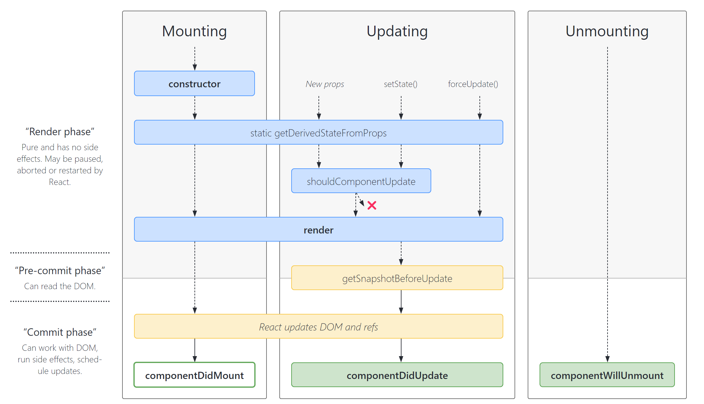

# 第一章 认识 React

A JavaScript library for building user interfaces （用于构建用户界面的 JavaScript 库）


`ReactJS` 是由 Facebook 在 201 3年 5 月推出的一款JS前端开源框架,推出式主打特点式函数式编程风格。值得一说的是，到目前为止 `ReactJS` 是世界上使用人数最多的前端框架,它拥有全球最健全的文档和社区体系。我们这里学习的是 `React Fiber` 版本，也就是 React16 这个版本。


ReactJS 的官方英文网站为：[reactjs.org](https://link.juejin.cn/?target=https%3A%2F%2Freactjs.org) （没有中文！！）

参考教程：https://juejin.cn/post/6844903870213292045#heading-10


## 1.1 项目文件介绍

React 组件文件可以用 `.jsx` 也可以用 `.js` 文件，两者没有区别


- 入口文件 `index.js`

```js
import React from 'react'
import ReactDOM from 'react-dom'
import App from './App'

ReactDOM.render(<App />,document.getElementById('root'))
```


- 根组件 `App.jsx`

```jsx
import React, {Component} from 'react'

class App extends Component{
    render(){
        return (
            <div>
                Hello JSPang
            </div>
        )
    }
}
export default App;
```


- VS code 插件

Simple React Snippets：快速生成代码

```jsx
imr 
import React, { Component } from 'react';

cc
class  extends Component {
    state = {  }
    render() { 
        return (  );
    }
}
export default ;
```


## 1.2 JSX 语法介绍

JSX 就是 Javascript 和 XML 结合的一种格式。React 发明了 JSX，可以方便的利用 HTML 语法来创建虚拟 DOM，当遇到 `<`，JSX 就当作 HTML 解析，遇到 `{` 就当 JavaScript 解析。


```jsx
import React, { Component } from 'react'
// import React from 'react'
// const Component = React.Component


class App extends Component{
    render(){
        return (
            <ul className="my-list">
                <li>{ false ? 'com' : 'cocoon' }</li>
                <li>I love React</li>
            </ul>
        )
    }
}

export default App;
```

> { } 内部填入 JS 表达式


- **Fragment 标签**

React 要求必须在一个组件的最外层用一个标签进行包裹，当我们不需要一个标签时，我们可以用 `Fragment`


- **JSX 注释**

```jsx
render() {
    return (
        // 1111

        {/* <Text>{ this.state.inputValue }</Text> */}
    )
}
```


- **class 类名**

定义 `class` 时，必须写成 `className`

```jsx
import './style.css'

<View className="index" />
```


- **lable 标签**

lable 标签中的 `for` 要替换成 `htmlFor`

```jsx
<label htmlFor="jspang">加入服务：</label>
<input id="jspang" className="input" value={this.state.inputValue} />
```


- 模块化组件


## 1.3 响应式和事件绑定


### 1.3.1 实现响应式数据

定义响应式写在 `this.state` 中，修改响应式写在 `this.setState({})` 中

记住 React 是禁止直接操作 `state` 的！

```jsx
constructor(props) {
    super(props)

    // 一定到写在这个对象里才有响应式
    this.state = {
        inputValue: 'cocoon'
    }
}

<Text>{ this.state.inputValue }</Text>
```


### 1.3.2 实现事件绑定

首先要绑定事件时要指定 `this` 指向，事件参数默认接收 `e`

事件回调函数直接写在类里面，通过 `this.setState` 修改响应式数据

```js
constructor(props) {
}

// 写法一
show(e) {
    console.log(e)
    console.log(e.target.value)

    this.setState({
        inputValue: 'czy'
    })
}   

// 写法二
show = (e) => {
    this.setState({
      inputValue: 'czy'
    })
}

render() {
}
```


JSX 中必须设置 `this` 指向

```jsx
// 写法一
<Button type="primary" onClick={this.show.bind(this)}>按钮</Button>

// 写法二
<Button type="primary" onClick={(e) => this.show(e)}>按钮</Button>
```


或者在构造函数中绑定

```js
constructor(props){
   super(props)
   this.handleClick=this.handleClick.bind(this)
}
```


## 1.4 实现 JSX 循环

```js
constructor(props){
    super(props)
    
    this.state={
        list:['22','11']   
    }
}
```


同样要加上 `key`， JSX 代码中直接使用函数中的参数

```jsx
render(){
    return (
        <ul>
            {
                this.state.list.map((item,index) => {
                    return <li key={ index }>{ item }</li>
                })
            }
        </ul>  
    )
}
```


修改 `list` 数组的方法：

```jsx
<ul>
    {
        this.state.list.map((item,index)=>{
            return (
                <li 
                    key={index+item}
                    onClick={this.deleteItem.bind(this,index)}
                >
                    {item}
                </li>
            )
        })
    }
</ul>  
```

```js
//删除单项服务
deleteItem(index) {
    let list = this.state.list
    list.splice(index,1)
    
    this.setState({
        list:list
    })
}

// 禁止直接修改
this.state.list.splice(index,1)
```


## 1.5 React 组件通信

- **父传子 props 传递数据**

```jsx
// 父组件
<XiaojiejieItem content={item} />
```

```jsx
// 子组件
<div>{this.props.content}</div>
```


> 同样的子组件不能直接改 props 参数


- **子传父 props 传递函数**

注意设置回调函数时要指定 `this`

```jsx
// 父组件
<XiaojiejieItem content={item} deleteItem={this.deleteItem.bind(this)} />

// 回调函数
deleteItem(index){
    let list = this.state.list
    list.splice(index,1)

    this.setState({
        list:list
    })
}
```

```jsx
// 子组件
<div onClick={this.handleClick.bind(this)}>
    {this.props.content}
</div>

handleClick(){
    
    // 触发回调函数
    this.props.deleteItem(this.props.index)
}
```


- **PropTypes 校验传递值**

```js
import PropTypes from 'prop-types'

Item.propTypes = {
    content: PropTypes.string,
    deleteItem: PropTypes.func,
    index: PropTypes.number.isRequired
}

Item.defaultProps = {
    content: 'cocoon'
}
```


## 1.6 Ref 属性和生命周期


Ref 的使用方法：https://blog.csdn.net/weixin_44827418/article/details/121319268


生命周期：https://vue3js.cn/interview/React/life%20cycle.html



> 图源：https://projects.wojtekmaj.pl/react-lifecycle-methods-diagram/


- componentDidMount 相当于 Vue 的 mounted

```js
// 在组件挂在后（插入到dom树中）后立即调用
componentDidMount() {
    // 发送 ajax 请求等
    
    axios.get('xxxx')
        .then((res)=>{
            console.log('axios 获取数据成功:'+JSON.stringify(res))
           
            this.setState({
                list:res.data.data
            })
          })
        .catch((error)=>{console.log('axios 获取数据失败'+error)})    
}
```


- shouldComponentUpdate

在渲染之前被调用，默认返回为 true。返回值是判断组件的输出是否受当前 state 或 props 更改的影响，默认每次 state 发生变化都重新渲染，首次渲染或使用 forceUpdate 时不被调用

```js
// 优化性能
shouldComponentUpdate(nextProps,nextState){
    if(nextProps.content !== this.props.content){
        return true
    }else{
        return false
    }  
}
```


含代码介绍：https://blog.csdn.net/luobo2345/article/details/122818947
