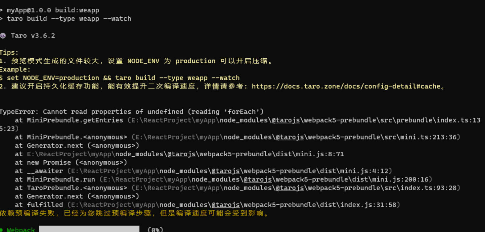
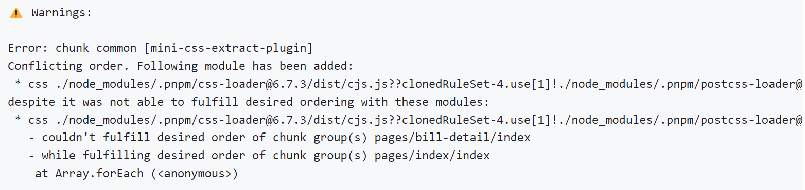
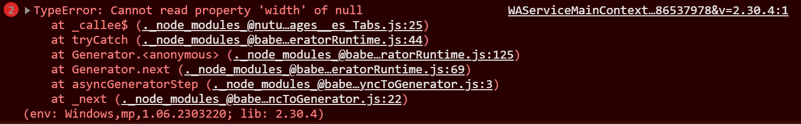

# 第一章 认识 Taro 


官网地址：https://taro-docs.jd.com/docs/

**Taro** 是一个开放式跨端跨框架解决方案，支持使用 React/Vue/Nerv 等框架来开发小程序 / H5 / RN 等应用。

现如今市面上端的形态多种多样，Web、React Native、微信小程序等各种端大行其道。当业务要求同时在不同的端都要求有所表现的时候，针对不同的端去编写多套代码的成本显然非常高，这时候只编写一套代码就能够适配到多端的能力就显得极为需要。


我的项目是 Taro3 + Vue3 + Nut UI 打造的前端页面


## 1.1 安装 Taro 

就按照官方教程，使用 `taro-cli` 新建项目即可，安装 Vue3 + Taro 版本

https://taro-docs.jd.com/docs/GETTING-STARTED


- 将 webpack5 开启持久化缓存配置（二次编译更快）

在 `config/index.js` 设置：`cache: { enable: true }`


- 启用 生产环境打包 可以开启压缩（编译速度会变慢）

在 `package.json` 添加 `"pro:weapp": "npm run build:weapp -- --watch --env production",`


- 设置小程序组件按需注入和用时注入

在 `app.config.ts` 添加 `lazyCodeLoading: 'requiredComponents',`


- 样式里面给盒子添加 `padding ` 的时候一定要注意加上 `box-sizing: boder-box`


## 1.2 Taro 项目目录


微信小程序原装目录：

https://developers.weixin.qq.com/miniprogram/dev/framework/structure.html


Taro 项目目录

```
├── dist                        编译结果目录
|
├── config                      项目webpack编译配置目录
|   ├── index.js                默认配置
|   ├── dev.js                  开发环境配置
|   └── prod.js                 生产环境配置
|
├── src                         源码目录
|   ├── pages                   页面文件目录
|   |   └── index               index 页面目录
|   |       ├── index.js        index 页面逻辑
|   |       ├── index.css       index 页面样式
|   |       └── index.config.js index 页面配置
|   |
|   ├── app.js                  项目入口文件
|   ├── app.css                 项目总通用样式
|   └── app.config.js           项目入口配置（对应微信小程序app.json） 
|
├── project.config.json         微信小程序项目配置
├── project.tt.json             字节跳动小程序项目配置
├── project.swan.json           百度小程序项目配置
├── project.qq.json             QQ 小程序项目配置
|
├── babel.config.js             Babel 配置
├── tsconfig.json               TypeScript 配置
├── .eslintrc                   ESLint 配置
|
└── package.json
```


### 1.2.1 Eslint 配置

Eslint 官网：https://zh-hans.eslint.org/docs/latest/

Eslint 详细使用介绍：https://juejin.cn/post/6974223481181306888#heading-0

```
npm i eslint -D
npx eslint --init
```


在项目中会自动下载 eslint，并生成 `.eslintrc` 文件

```json
{
    "extends": ["taro/react"], // 现成的规则配置包

    "rules": {
        "space-infix-ops": 2, // 要求操作符周围有空格

        "space-before-blocks": 2, // 要求语句块之前有空格
		......
    }
}
```


- VS code 配置

下载 `Eslint` 插件，启用。在设置中搜索 `eslint` 可编辑配置（一般不需要编辑）

配置介绍：https://blog.csdn.net/my_new_way/article/details/105177909


- 配置规则 `"rules"`

配置规则规范：https://zh-hans.eslint.org/docs/latest/use/configure/rules

规则大全：https://zh-hans.eslint.org/docs/latest/rules/


- 指定解析器：https://zh-hans.eslint.org/docs/latest/use/configure/plugins

```
npm i -D @babel/eslint-parser@7.15.0
```

```json
{
  	"parser": "@babel/eslint-parser",

    "parserOptions": {
        "ecmaVersion": 6,
        "sourceType": "module",
        "ecmaFeatures": {
          "jsx": true,
          "legacyDecorators": true, // 允许使用修饰符
          "globalReturn": false // 设置为 true，当 sourceType 为 script 时，允许全局 return
        },
        "requireConfigFile": true, // 是否需要 babel 配置文件
        "allowImportExportEverywhere": false // 设置为 true，import 和 export 声明 可以出现在文件的任务位置，否则只能出现在顶部
  }
}
```


- 执行 Eslint 校验

添加命令：`  "lint": "eslint --ext .js,.tsx,.ts,.jsx src"`

```
npm run lint
```


通过 `husky`、`lint-staged` 进行在 Git 上传时自动进行 Eslint 校验

> 我没搞出来啊！！！https://blog.csdn.net/cookcyq__/article/details/125457031（试一下这篇）
>
> 因为两个包版本的问题，总是会有问题！


### 1.2.2 全局配置

在 `app.config.js` 中设置全局配置，有 tabBar、window、pages 等属性。

官方文档：https://nervjs.github.io/taro-docs/docs/app-config


- tabBar 的 icon 仅支持 .png、.jpg、.jpeg 格式
- 一般 `window` 是设置一些默认配置，主要还是在页面中配置 `window`
- 主要配置 `pages` 和 `tapBar`


### 1.2.3 关于设计稿

在 Taro 中尺寸单位直接使用 `px`，**Taro 默认会对所有单位进行转换。**

官方文档：https://nervjs.github.io/taro-docs/docs/size


Taro 默认以 `750px` 作为换算尺寸标准，如果设计稿不是以 `750px` 为标准则需要修改项目配置 

```js
// config/index.js
const config = {
  projectName: 'myProject',
  date: '2018-4-18',
  designWidth: 640,
  ....
}
```


### 1.2.4 小程序项目配置

对应 Taro 文件：`project.config.json`

配置大全：https://developers.weixin.qq.com/miniprogram/dev/devtools/projectconfig.html


- compileHotReLoad：自动热重载，即每次刷新后不会返回首页，而是操作前的页面
- urlCheck：是否检查安全域名和 TLS 版本


### 1.2.5 小程序全局配置

对应 Taro 项目文件：`app.config.ts`

配置大全：https://developers.weixin.qq.com/miniprogram/dev/reference/configuration/app.html


 ## 1.3 Taro 组件介绍及使用


### 1.3.1 组件与组件库

**Taro3 组件**

在 Taro 框架里不再具有 H5 标签了，这里与之代替的是 Taro 原生组件库，也可以理解为标签

官方组件文档：https://nervjs.github.io/taro-docs/docs/components-desc


- vue 里面直接使用 无需引入
- 快捷生成组件方式：`view>` + 回车即可！


**Nut UI 组件库**

Taro + Vue3 项目使用 Nut UI 安装教程：https://nutui.jd.com/taro/vue/4x/#/zh-CN/guide/start

就按照官网教程来就行，使用组件特别方便，最下面几个注意点也要设置一下

> ps：使用插件 unplugin-vue-components 直接可以不用手动注册了！


**使用问题反馈**

- Nut UI 设计稿一定要和 Taro 的设计稿一致，最好为 750！！


- 出现 `chunk common [mini-css-extract-plugin]` 报错解决方法：

但是如果要引入新组件的时候，就要开启。否则页面无法重构！！

```js
mini{
    miniCssExtractPluginOption: {
      //忽略css文件引入顺序
      ignoreOrder: true
    }
}
```


### 1.3.2 首页样式设计

这里记录一下首页样式的设计：

配置好 index.config.ts 后，页面已经没有导航栏了，然后背景色和居中布局也设置好了。这里我是用一个盒子做背景色，**该盒子高度为 `1300px`** ，图片作为背景。然后再将下面的内容盒子移上来。

接下来在 `home-content` 盒子写页面内容样式


- index.config.ts 页面配置文件

```ts
export default definePageConfig({

    navigationBarTitleText: '出行首页',

    navigationBarTextStyle: 'white',

    // 设置只有导航栏药丸
    navigationStyle: 'custom',
})
```


- index.vue 页面文件

```vue
<template>
<view class="home-container">
    <view class="background"></view>

    <view class="home-content">

        从这里开始写页面内容

    </view>

</view>
</template>


<style lang="scss">
.home-container {
    min-height: 100vh;
    display: flex;
    flex-direction: column;
    align-items: center;
    background: #FAFCFB;

    .background {
        width: 100%;
        height: 1300px;
        background: linear-gradient(180deg, rgba(20, 178, 181, 1) 0%, 
        rgba(20, 178, 181, 0.01) 100%);
    }
    
    .home-content {
        margin-top: -1145px;
        color: #222625;
    }
}
</style>
```


### 1.3.3 components组件记录

记录所有用到的组件，页面组件放在 `page` 中，单独组件放在 `components`，部分单独组件还存在子组件（放在该组件的文件夹中）。`hooks` 的文件夹名对应组件名的 `hook` 函数 


- Home：首页

- Order：订单页

- WeLogin：微信登录页

- QueryTicket：查询订单页

- Calendar：日历页

- OrderDetail：单个订单预定页

  

- BuyFrame：首页 tab 栏

- BuyContent：首页 tab 栏 - 订机票内容组件

- CityChoose：首页城市选择模态框

- OrderItem：首页订单信息组件

- HomeTop：首页顶部显示组件

- SwiperBox：首页轮播图组件

- CalendarTab：查询订单页面的顶部滑动日历栏

- FlightInfo：查询订单页面的内容区域

- FlightItem：查询订单页面的内容区域 - 子组件

- OrderScroll：订单页内容区域

- PageOrder：订单页内容区域 - 订单组件

- OrderFrame：订单页顶部tab栏


### 1.3.4 ScrollView 使用方法

官网：https://nervjs.github.io/taro-docs/docs/components/viewContainer/scroll-view


**横向视图通用样式：**

```vue
<view class="calendar-tab-scroll">
    <scroll-view 
        class="scroll-container" 
        :scroll-x="true" 
        style="width: 100%" 
        :scroll-left="scrollLeft"
        :scrollWithAnimation="true"
        :enhanced="true"
        :showScrollbar="false"
    >

            <view 
                v-for="(item, index) in dateValueArr"
                class="scroll-container-item"
                :class="{ active: pickDateIndex == index }"
                @click="clickDateItem(item, index)"
                :id="`date${index}`"
            >
                <view class="item-date">{{ item.dateValue }}</view>

                <view class="item-week">{{ item.week }}</view>
            </view>

    </scroll-view>
</view>        
```

```scss
.calendar-tab-scroll {
    width: 612px;
    height: 100%;

    .scroll-container {
        white-space: nowrap;

        .scroll-container-item {
            display: inline-block;
            width: 17%;
            height: 92.31px;
        }
    }        
}
```


**注意点：**

1、`scroll-view` 盒子不能使用 `flex、grid` 布局！不然宽度会失效！其子盒子也无法使用。让子盒子使用解决办法是要添加一个属性 `enableFlex`。可以去调试一下


2、`scroll-into-view` 属性可以指定跳转到某个锚点，值应为某子元素id（id不能以数字开头）但是不要使用这个属性进行滚动，有很多bug。。。


3、推荐使用 `scroll-left`  属性控制滚动条位置来实现滚动效果！！


4、`display: inline-block;` `white-space: nowrap;` 两个属性最好加上避免样式出问题


5、其他属性及回调函数等 API 可以自行去官网查看


**纵向视图通用：**

```vue
<view class="fight-content">

    <!-- 竖向滚动 -->
    <scroll-view 
        :scroll-y="true" 
        style="height: 100%;" 
        :scroll-top="scrollTop"
        :scrollWithAnimation="true"
        :enhanced="true"
        :showScrollbar="false"
        class="scroll-view-container"
    >
        <view class="scroll-view-top"></view>

        <view class="scroll-view-item"></view>
        <view class="scroll-view-item"></view>

        <view class="scroll-view-bottom"></view>
    </scroll-view>        

</view>
```

```scss
.fight-content {
    width: 100%;
    height: calc(100vh - 311px);
    padding: 0 46px;
    box-sizing: border-box;

    .scroll-view-top {
        width: 100%;
        height: 31px;
    }

    .scroll-view-item {
        width: 100%;
        height: 311.54px;
        margin-top: 31px;
        border-radius: 15.38px;
        background-color: #fff;

        &:nth-child(2) {
            margin-top: 0;
        }
    }

    .scroll-view-bottom {
        width: 100%;
        height: 60px;
    }
}
```

> 通过首尾各设置一个盒子，来达到首尾 padding 的效果，并且实现盒子之过小时无法滚动的效果


**滚动到顶部的方法：**

```ts
// 滚动条位置 初始化先为-1（默认在顶部）
let scrollTop = ref<number>(-1)
```

当滚动时发现 `scrollTop` 并不会变化，所以并不会双向绑定

但是后期如果改变 `scrollTop` 的值，那么滚动条会跟着变化

```ts
onMounted(function() {

    // 监听事件 点击顶部日历栏时回到顶部
    Taro.eventCenter.on('toTopFlightInfo', () => {
        scrollTop.value = 0
    })

})
```


## 1.4 Taro 项目问题汇总


### 1.4.1 配置项目绝对路径

- **tsconfig.json**

```ts
{
    "compilerOptions": {
        "paths": {
            "@/*": [
                "./src/*"
            ]
        }        
    }
}
```


- **config/index.js**

```js
import path from 'path'

const config = {
    alias: {
        "@": path.resolve(__dirname, "..", "src"),
    }
}
```


必须重启项目才能生效！！


### 1.4.2 登录组件构建流程

- 首先确保服务端 `login` 接口已经实现，创建 `weLogin.vue` 页面组件，通过 `weChatLogin` 函数发送请`loginCallBack` 处理之后的回调。

- 如果登录成功，则前端会将服务端发送的 `loginToken` 进行存储

- 如果登录失败，可以去查看报错信息，通常是 `ip` 地址不是白名单。（只需开发阶段设置，开启后只有白名单内的IP可以调用参数为AppSecret的接口）

- 进入 微信小程序开发者平台 - 开发管理 - 开发设置- 添加**IP白名单**即可


### 1.4.3 项目使用字体问题

一个字体的大小有8MB以上，如果采取动态加载网络字体：

https://nervjs.github.io/taro-docs/docs/apis/ui/fonts/loadFontFace

```js
Taro.loadFontFace({
  family: 'Bitstream Vera Serif Bold',
  source: 'url("https://sungd.github.io/Pacifico.ttf")',
  success: console.log
})
```


加载会很慢，会有明显的默认字体切换到外部字体的过程，体验教差，特别是字体文件越大，加载的速度越慢，有些小程序页面甚至无法加载成功

所以使用的时候肯定是要采取一些压缩措施的！工具：Fontmin

一些文档参考：

https://blog.csdn.net/weixin_41973410/article/details/114732612

https://blog.csdn.net/zhiyan1990/article/details/120366549

> 我这个项目暂时没有使用字体。。。


### 1.4.4 静态资源引用问题

官方文档：https://nervjs.github.io/taro-docs/docs/static-reference

参考官网静态资源引入方式即可，最好要按照自己习惯引入


**特别注意：**

对于本地图片最好不要直接引入

```html
<image src="@/assets/images/down.png"/>
```


而是先 `import` 引入，再作为动态变量使用！

```js
// 引入方式一
import downIcon from '@/assets/images/down.png'

// 引入方式二
let downIcon = require('@/assets/images/down.png')
```

```vue
<image :src="downIcon"/>
```

> 直接引入虽然不会报错，但是同一张图片被引入两次，小程序就会白屏


**图片转Base64编码：**

将小图片转换为 base64 编码字符串，并写入 HTML 或者 CSS 中，**减少 http 请求。**转Base64编码实际上会增大图片的体积，因此不推荐对大图片进行转换。

Taro 默认会对 `1kb` 大小以下的资源进行转换，如果需要修改配置，可以在 `config/index.js` 中进行修改

```js
// 图片转base64
url: {
  enable: true,
  config: {
    limit: 10240 // 设定转换尺寸上限10kb
  }
}
```


使用这个网址可以进行转换：https://www.strerr.com/cn/base64_encode_img.html

新建 `assets/base65` ，将 base65 编码存储为一个 scss 文件，那里需要这张图片在哪里引入 scss 文件即可

```scss
@import "@/assets/base64/backgroundUrl.scss";

.background {
    width: 100%;
    height: 1300px;
    background: url($backgroundUrl) no-repeat;
    background-size: cover;
}
```


### 1.4.5 工具函数使用记录

这里介绍一下 `utils/tools.ts` 的**工具函数的使用方法**，实现代码自行查看


- **tools.request**

**注意：传入的 data 必须是对象类型，并且 post、get 参数通用！！**

封装的 taro 请求函数，设置了默认配置。只有 url 是必传值，返回 promise。使用方法如下：

```ts
// utils/api.ts

import tools from './tools'

const baseURL = 'http://localhost:3000'

export function getTextData() {
    return tools.request({ url: `${baseURL}/test/getUsers` })
}

export function postTextData() {
    return tools.request({
        url: `${baseURL}/test/getUsers` ,
        method: 'POST',
        data: { name: 'cocoon' }
    })
}
```

```js
onMounted(async function() {
    let res = await getTextData() 
    console.log(res)
})
```

https://nervjs.github.io/taro-docs/docs/apis/network/request/


- **tools.showLoading**

显示 loading 提示框，支持不传参，传入title，传入对象

```ts
tools.showLoading()
tools.showLoading({title: 'hhh', mask: true})
tools.showLoading('cocoon')
```

https://nervjs.github.io/taro-docs/docs/apis/ui/interaction/showLoading#option


- **tools.showToast**

显示消息提示，支持不传参，传入title，传入对象

```js
tools.showToast() // 显示成功，无icon
tools.showToast('操作成功')
tools.showToast({
  title: '成功',
  icon: 'success',
  duration: 2000
})
```

https://nervjs.github.io/taro-docs/docs/apis/ui/interaction/showToast


### 1.4.6 在项目中安装Pinia

参考这个仓库：https://github.com/keyding/taro-plugin-pinia

pinia 的使用教程在 Vue3 的学习文档里


### 1.4.7 animate.css使用记录

首先来介绍一下关于样式如何实现响应式，后面介绍 animate.css 的使用方法


**动态绑定 `class`**

方式一：

```vue
<div class="basic" :class="{ 'active': 可填变量也可填JS判断语句 }">{{name}}</div>
```

> 类名必须带引号


方式二：

```vue
<div class="basic" :class="classObj">{{name}}</div>

<script>
classObj: {
    'animate__rubberBand': false
}
    
handleDelete() {
    this.delClass.animate__rubberBand = true;
    setTimeout(()=> {
        this.delClass.animate__rubberBand = false;
    },500)
},
</script>
```


**使用 animate.css**

官网：https://animate.style/    动画演示：https://www.dowebok.com/demo/2014/98/


vue3 中引入 animate.css：

```bash
npm install animate.css --save
```

```ts
// main.ts
import "animate.css/animate.min.css"
```


**简单使用：**

铭记一点：当类名为`animate__animated + animate__动画名字` 时，就会展示动画

```vue
<button 
    class="btn btn-danger animate__animated"
    :class="delClass" 
    @click="handleDelete()"
>删除</button>
```

```js
delClass: {
    'animate__rubberBand': false
}
handleDelete() {
    this.delClass.animate__rubberBand = true;
    setTimeout(()=> {
        this.delClass.animate__rubberBand = false;
    },500)
},
```

> 定时器里面的时间最小为动画时间


**高阶使用：**

还可以自定义动画的样式


### 1.4.8 查询机票流程总结

**服务端：**

先写接口：`server/models/flight.js` 发送请求（参数为城市和起始时间），返回一个模拟的机票信息数组

因为是 mock 数据所以每次查询的数据都不同！这里没有使用数据库存储数据，每次都是产生新的数据。


**前端：**

创建了一个订单仓库来存储每次查询的机票信息数组，再通过组件 `FlightInfo` 下的 `FlightItem` 组件渲染

每次点击查询按钮和切换日历tab栏都会请求这个接口刷新机票信息数组


### 1.4.9 Taro 编译报错记录

- **问题一**

Issues：https://github.com/NervJS/taro/issues/13544



报错原因：官方使用的 `@swc/core` 升级到 1.3.44 后导致的问题，使用这个方式即可解决：

https://github.com/NervJS/taro/issues/13544#issuecomment-1491244715


- **问题二**

Issues：https://github.com/jdf2e/nutui/issues/2126，使用 `NutCalendar` 组件之后报错



报错原因：https://github.com/NervJS/taro/issues/7160

解决方法也在 组件与组件库 那里，但是治标不治本


- **问题三**

Issuses：https://github.com/jdf2e/nutui/issues/1219，使用 `nut-cascader` 组件之后报错



`chooseCity` 组件中 `onMounted` 的出现问题

```ts
if (Taro.getStorageSync('cityList')) {

    cityList.value = Taro.getStorageSync('cityList')

} else {

    cityList.value = await getCityList()
    Taro.setStorageSync('cityList', cityList.value)
}
```

当通过获取缓存的方式给 `cityList` 赋值时，就会报这个错误。太奇怪了！！！

那就不用缓存的方式来减少 `http` 请求了，直接赋值

```ts
cityList.value = await getCityList()
```


## 1.5 项目服务端配置总结

全栈项目需要自己配置服务端，提供后台接口。电脑需要下载 mysql 数据库，服务端框架使用 express 基于 node.js 搭建，连接数据库方面用到 mysql2 这个第三方库。服务端一般使用 CommonJS 规范

Express：https://www.expressjs.com.cn/

mysql2：https://github.com/sidorares/node-mysql2

数据库用户名和密码：root 123456   IP和端口号：localhost 3360


### 1.5.1 服务端初始化配置

**数据库方面：**

安装 mysql 数据库即初始化流程：`D:\文档\Downloads\Software\MySQL for Windows\安装教程\README.md`

进入 navicat 新建数据库 `taro-mysql`，在 `server` 文件夹下新建 `build` 文件夹，当有数据库表需要建立的时候在此文件夹下执行


**服务端方面：**

下载依赖：`npm install --save mysql2 express`

启动 Express 服务：`index.js`

```js
const express = require('express')
const app = express()
const port = 3000

// 直接部署接口
app.get('/', (req, res) => {
  res.send('Hello World!')
})

app.listen(port, () => {
  console.log(`Example app listening on port ${port}`)
})
```

连接数据库：`mysql.js`

```js
// 导入模块
const mysql = require('mysql2')

// 创建一个数据库连接
const options = {
    host: 'localhost',
    user: 'root',
    password: '123456',
    database: 'taro-mysql'
}

// 创建一个数据库连接
const connection = mysql.createConnection(options)

// 查看是否连接成功
connection.connect(err => {
    if(!err) console.log('连接数据库成功')
})

// 简单查询
connection.query(
    'SELECT * FROM users',

    // 错误 结果 额外的元数据
    function (err, results, fields) {
        console.log(results)
    }
)
```


`mysql.js` 的关键是导出一个异步封装的数据库查询函数

```js
// 封装查询函数 存入查询语句即可
function sqlQuery(strSql) {

    return new Promise(function(resolve, reject) {
        connection.query(strSql, function(err, results) {
            if (err) {
                reject(err)
                return 
            }

            resolve(results)
        })
    })
}

// 导出查询函数
module.exports = sqlQuery
```


### 1.5.2 Express 路由配置

我们使用 express 路由来部署接口。新建 `models` 文件夹，一个 JS 文件对应一个路由文件，路由文件内部封装多个接口。`models` 文件夹的 `index.js` 包装所有的路由


- **index.js**

```js
const express = require('express')
const useRouter = require('./models/index')

const app = express()
const port = 3000

useRouter(app)

app.listen(port, () => {
    console.log(`服务器 ${port} 端口已启动`)
})
```


- **models/index.js**

```js
module.exports = function(app) {

    // 根路径  路由配置
    app.use('/test', require('./test'))
}
```


- **models/test.js**

```js
const express = require('express')
const sqlQuery = require('../mysql')
const testRouter = express.Router()

testRouter.get('/getUsers', async function(req, res) {

    try {
        const result = await sqlQuery(`SELECT * FROM users`)

        res.send({
            code: 200,
            message: '请求成功',
            data: result
        })
    } catch (error) {

        console.log(error)
        res.send({
            code: 404,
            message: '请求失败',
            data: null
        })
    }
})

module.exports = testRouter
```


- 执行 `index.js`  成功启动接口：`http://localhost:3000/test/getUsers`


### 1.5.3 服务端发送请求方法

在 node.js 中发送请求有多种方法：https://blog.csdn.net/ccf19881030/article/details/109226150

**项目中主要使用 axios 发送请求**


- **axios**

最强大，最流行的请求方式！结果返回一个 promise

官网：https://axios-http.com/zh/

```
 npm install axios --save
```


- **axios.get**

```javascript
const axios = require('axios')

let res = await axios.get(url, {
    params: {
        // url 参数
    },
    headers: {
        // 请求头
    }
})

// 返回接口数据（响应体）
console.log(res.data)
```


- **axios.post**

```js
axios.post(url, {
    //请求体 json格式  req.body获取
    'user': 'admin',
    'password': 20022002
}, {
    //url参数 请求行
    params: {
    },
    //请求头参数
    headers: {
    }
}).then(response => {
    console.log(response);
    //响应状态码
    console.log(response.status);
    //响应状态字符串
    console.log(response.statusText);
    //响应头信息
    console.log(response.headers);
    //响应体
    console.log(response.data);
})
```


- **后端 axios 接口模板**

```js
const axios = require('axios')

loginRouter.get('/getLoginKey', async function (req, res) {

    const { code } = req.query

    try {
        // @ts-ignore
        const result = await axios.get(url, {
            params: {
                // url 参数
            }
        })

        res.send({
            code: 200,
            message: '请求成功',
            data: result.data
        })

    } catch (error) {

        console.log(error)
        res.send({
            code: 404,
            message: '接口请求失败',
            data: error
        })
    }
})
```


### 1.5.4 Mysql 常用语法

这里主要介绍 Mysql 里的查询语言的语法。通常被包装为变量 `sqlStr`

参考文档：https://blog.csdn.net/liustreh/article/details/123411958


- **数据库操作**

```sql
create database mysql01; //默认创建数据库

create database mysql01 default character set utf8; //创建指定默认字符集为交的数据库

drop database mysql01; //删除数据库

show databases; //查看所有数据库

show create databases; //查看数据库属性
```


- **常用数据类型**

```sql
// 创建一个学生表 编号为整型5个字节，名字为变长字符串类型10个字节，年龄不允许为空默认为20
create table student(id int(5),name varchar(10),age int not null default 20);

// 字符串类型
char(0-255) 定长字符串
varchar(0-65535) 变长字符串

// 日期和时间类型
date[日期 年月日] time[时间 时分秒] datetime[年月日 时分秒 YYYY-MM-DD HH:mm:ss]
```


- **数据库表操作**

```sql
// 查看表
show tables;

// 查看表结构
desc 表名;

// 快速创建一个表结构相同的表 
create table 新表名 like 旧表名;

// 删除表，如果表结构存在的话
drop table if exits 表名;

// 修改表名
rename table 表名 to 新表名;

// 添加字段（新的列属性）
alter table 表名 add [column]  字段名 类型;

// 修改字段名
alter table 表名 change 旧字段名  新字段名 类型;

// 修改字段类型
alter table 表名 modify 字段 新字段类型;
```


- **数据库表的增删改查操作**

insert 插入数据

```sql
// 插入全部数据（值的顺序一定要与字段对应）
insert into user values('张三','30','133324','男');

// 插入部分数据
insert into user(name,age,modile) values('小艾',20,'243252');
```


update 修改数据

```sql
// 一般更新
update 表名 set 字段名1 = 值1， 字段名2 = 值2，......

// 更新时加入计算
update user1 set age = age+1;

// 部分更新
update 表名 set 字段名1 = 值1，字段名2 = 值2，...where 字段条件
update user1 set sex='女' where name = '张三';
```


delete 删除数据

```sql
// 删除全部记录
delete from 表名;

// 按条件删除
delete from 表名 where 字段条件; 
delete from user1 where name = '张三';
delete from user1 where age<23 and name = '小天';

// 快速删除表数据（物理删除）
truncate 表名;
```


select 简单查询数据

```sql
// 取出表中的所有数据
select * from 表名;

// 查询指定列
select 字段名1，字段名2，.... from 表名

// 查询指定列带别名
select 字段名1 as  别名 ，字段名2 as 别名，.....
```


- **条件查询与运算符**

按条件查询：`where` 

相关运算符：`< ` 小于 `=` 等于 `>` 大于 `>=` 大于等于 `<=` 小于等于  `<>`  或  `!=` 不等于

逻辑运算符： `and (&&)` 与 `or(||)` 或  `not(!)` 非

范围关键字：`between and`

`%` 通配符：代表任意长度的任意字符

`_` 通配符 代表一个字符长度的任意字符 用法与 `%` 一样，只不过只代表一个字符

```sql
select *from student where math>60 and ehglish>60;

select * from student where math  not in(66,76);

select * from student where math  between 56  and  66；

select * from student where name like '马%';

select * from student where name like '马_';
```


- **关键词属性**

即指定字符为一些特殊关键词属性

```sql
// 在字段后面确认主键
create table user2(id int primary key,name varchar(10));

// 在字段后面确认自增
create table user3(id int primary key auto_increment,name  varchar(10));

// 其他关键词
create  table  user5 (
    id  int   primary  key   auto_increment，
    name  varchar(10),
    mobile  varchar(11)  unique,   --此字段值唯一
    sex   varchar(2)  not null     --此字段值唯一
    age  int  default  18
)
```

> 一般将 id 确认为主键和自增


- **排序和函数**

排序：`order by [asc] [desc]`， asc 按升排序  desc 降序排序

```sql
// 单列排序
select  *  from  student  order  by  math;        asc 默认可以不写
select  *  from  student  order  by  math  desc;   desc 必须写上

// 多列排序
select  *  from  student  order  by  math  desc, english  desc;
```


后面还有，暂时先不写了！！


### 1.5.5 Express 获取请求参数

**注意请求参数必须是一个对象类型！！**


**GET参数的获取**

Express 框架中使用 `req.query` 即可 获取 GET 参数，`req.query` 为参数对象

```js
flightRouter.get('/getflightList', async function(req, res) {

    console.log(req.query)
    res.send({
        code: 200,
        message: '请求成功',
        data: req.query
    })
})
```

**注意：**

- 如果 `req.query.item` 为一个对象类型，则必须 `JSON.parse(req.query.item)` 一下


**POST参数请求体的获取**

Express 中接收 `POST请求参数` 需要借助第三方包 `body-parser`，然后通过 `req.body` 获取

先在 index.js 中配置

```js
// 引入 express 框架
const express = require('express');
const bodyParser = require('body-parser');

// 创建网站服务器
const app = express();

// 拦截所有请求
// 方法内部使用 querystring 模块处理请求参数的格式
app.use(bodyParser.urlencoded({extended: false}));
```


在接口中获取

```js
flightRouter.post('/getflightList', async function(req, res) {

    console.log(req.body)
})
```


### 1.5.6 服务端创建数据库表

在 `server` 文件夹中新建 `build` 文件夹，执行内部 JS 文件即可爬取数据。


- **爬取城市机场列表数据流程**

`build/airport.js`

```js
const sqlQuery = require('../mysql')
const axios = require('axios')
 
async function buildAirPortList() {

    // @ts-ignore
    let { data } = await axios.get('https://www.brown77.cn/city/airportList')

    // 请求失败则返回
    if (data.code != 1) return

    const strSql1 = `
        create table airportList(
            id int not null auto_increment,
            cityName char(50) not null,
            cityId int not null,
            firstLetter char(50) not null,
            airportName char(50) not null,
            primary key (id)
        );
    `

    // 创建表
    await sqlQuery(`drop table if exists airportList`)
    await sqlQuery(strSql1)

    let promiseAll = []

    // 插入数据
    for (let i = 0; i < data.result.length; i++) {
        
        const { id, cityId, cityName, firstLetter, airportName } = data.result[i]

        const strSql2 = `insert into airportList(id, cityName, cityId, firstLetter, airportName) values(${id},'${cityName}',${cityId},'${firstLetter}','${airportName}');`

        let res = sqlQuery(strSql2)
        promiseAll.push(res)
    }


    // 判断是否成功
    try {
        await Promise.all(promiseAll)
        console.log('成功全部爬取数据！')

    } catch (error) {
        console.log(error)
    }
}

buildAirPortList()
```


1、执行 `node airport.js` 一次即可！本地数据库可更新数据

2、注意模板字符串那里，如果是**字符串类型**那么还需要加一层引号：`'${cityName}'`

3、插入数据的 sql 语句不能换行！！


- **创建用户订单数据表**：`build/useInfo.js`


### 1.5.7 day.js 的使用方法

官网文档：https://dayjs.gitee.io/zh-CN/

Day.js 是一个轻量的处理时间和日期的 JavaScript 库。把 dayjs 对象做为 Date 对象的延伸即可


- **生成 dayjs 对象：在解析模板里面查看**

```js
// 生成当前时间对象
var now = dayjs()


// 通过字符串格式生成
var customParseFormat = require('dayjs/plugin/customParseFormat')
dayjs.extend(customParseFormat)

// 第一个参数为时间字符串 第二个参数为格式
const day = dayjs("12-25-1995", "MM-DD-YYYY")


// 还可以传入时间戳
const day = dayjs(1318781876406)

// 直接用一个 Date 对象
var day = dayjs(new Date(2018, 8, 18))
```


注：最好用 UTC 生成 dayjs 对象，不知道为什么使用默认的本地时间会慢一天。。

```js
var utc = require('dayjs/plugin/utc')
dayjs.extend(utc)

const day = dayjs.utc("12-25-1995", "MM-DD-YYYY")
```


- **从 dayjs 对象取值或操作**

```js
// dayjs 有大量的api可供取值

// 将当前时间增加一个小时一分钟返回一个新的 dayjs 对象
const day = dayjs(new Date()).add(1, 'hour').add(1, 'minute')
```


- **format 将 dayjs 对象格式化**

```js
const dayString = dayjs('2019-01-25').format('[YYYYescape] YYYY-MM-DDTHH:mm:ssZ[Z]') 
// 'YYYYescape 2019-01-25T00:00:00-02:00Z'
```


### 1.5.8 login 接口配置指南

微信小程序实现登录业务流程：https://blog.csdn.net/weixin_41973410/article/details/113241813

- 首先前端通过 `taro.login` 获取到 `code`
- 再将 `code` 发送请求到服务端，地址：`src\pages\WeLogin\index.vue`
- 服务端通过设置 `login` 接口向微信服务器发送请求获取到 `openid`
- `openid` 为微信用户唯一标识，服务端加密成 `token` 字符串返回给前端
- 前端存储 `token`，当发送涉及用户信息的请求时携带


**login 接口实际作用：返回前端一个加密且具有时限的 `openid` 的 `token` 字符串**

对应地址：`server/models/login.js/getLoginKey`


### 1.5.9 开通服务器域名配置

开发阶段并且小程序在电脑端预览的时候，服务端可以使用本地端口调用请求：`http://localhost:3000`

但是在手机端预览或者上线时必须用**云服务器端口！！**

文档说明：https://developers.weixin.qq.com/miniprogram/dev/framework/ability/network.html


进入 微信小程序开发者平台 - 开发管理 - 开发设置 - 配置服务器域名


## 1.6 Taro API 使用记录

官网文档：https://nervjs.github.io/taro-docs/docs/apis/about/desc

文档里面有大量的 API 介绍，这里主要介绍项目中用到的一些 API


### 1.6.1 入口组件生命周期

作为 vue3 的项目，入口组件对应的是文件 `app.ts`。入口组件除了支持 Vue 的生命周期方法外，还根据小程序的标准，额外支持以下生命周期：

```js
import { createApp } from 'vue'

const app = createApp({
  // 可以使用所有的 Vue 生命周期方法
  mounted () {},

  // 对应 onLaunch
  onLaunch () {},

  // 对应 onShow
  onShow (options) {},

  // 对应 onHide
  onHide () {},

  // 入口组件不需要实现 render 方法，即使实现了也会被 taro 所覆盖
})

export app
```


- **onLaunch (options)**

小程序初始化时执行的函数：https://nervjs.github.io/taro-docs/docs/vue-entry#onlaunch-options


- **onShow (options)**

程序启动，或切前台时触发：https://nervjs.github.io/taro-docs/docs/vue-entry#onshow-options


- **onHide ()**：程序切后台时触发


### 1.6.2 页面组件生命周期

因为使用的 setup 语法糖模式，所以生命周期推荐使用 Composition APIs 模式进行调用


Taro 页面所有组件生命周期介绍：https://nervjs.github.io/taro-docs/docs/vue-page

对应的 Composition APIs 使用：https://nervjs.github.io/taro-docs/docs/composition-api

> 后面的链接没有介绍生命周期的含义，要对应到上一个链接中查找


下面介绍在项目中使用到的页面组件生命周期：


### 1.6.3 Taro.Events消息机制

可以理解为全局事件总线，官方文档：https://nervjs.github.io/taro-docs/docs/apis/about/events

**使用方式如下：**

```js
import Taro, { Events } from '@tarojs/taro'
const events = new Events()

// 监听一个事件，接受参数
events.on('eventName', (arg) => {
  // doSth
})

// 监听同个事件，同时绑定多个 handler
events.on('eventName', handler1)
events.on('eventName', handler2)
events.on('eventName', handler3)

// 触发一个事件，传参
events.trigger('eventName', arg)

// 触发事件，传入多个参数
events.trigger('eventName', arg1, arg2, ...)

// 取消监听一个事件
events.off('eventName')

// 取消监听一个事件某个 handler
events.off('eventName', handler1)

// 取消监听所有事件
events.off()
```


**使用方式简化：**

`events` 还可以用一个全局消息中心 `Taro.eventCenter`  来代替

```js
import Taro from '@tarojs/taro'

Taro.eventCenter.on
Taro.eventCenter.trigger
Taro.eventCenter.off
```

> 这样的话体积会不会更大？？


### 1.6.4 Taro 路由使用方法

官方文档：https://nervjs.github.io/taro-docs/docs/apis/route/switchTab/


**Taro.navigateTo(option)**

保留当前页面，跳转到应用内的某个页面。但是不能跳到 tabbar 页面。使用 Taro.navigateBack 可以返回到原页面。小程序中页面栈最多十层。

```js
Taro.navigateTo({ url: '/pages/Calendar/index', })
```

> 注意开头要带斜杠


**Taro.navigateBack(option)**

关闭当前页面，返回上一页面或多级页面。可通过 getCurrentPages 获取当前的页面栈，决定需要返回几层

```js
Taro.navigateBack()
```


还有其他跳转方式自己在官网里面看


**路由传参和获取参数**

可以通过在所有跳转的 `url` 后面添加查询**字符串参数**进行跳转传参。

在目标页面的**生命周期**方法中，可以通过 `Taro.getCurrentInstance().router.params` 获取路由参数。

```js
// 传入参数 id=2&type=test
Taro.navigateTo({
  url: '/pages/page/path/name?id=2&type=test',
})
```

```js
mounted() {
    // 获取路由参数
    console.log(Taro.getCurrentInstance().router.params) 
    // 输出 { id: 2, type: 'test' }
},
```


**EventChannel 的使用**

页面间事件通信通道，成功进入跳转页面后调用监听事件的回调函数

```js
Taro.navigateTo({
  url: 'test?id=1',
    
  events: {
      
    // 监听事件并绑定回调函数  
    acceptDataFromOpenedPage: function(data) {
      console.log(data)
    },
      
  },
    
  // 成功进入跳转页面后执行 
  success: function (res) {
      
    // 触发监听事件
    res.eventChannel.emit('acceptDataFromOpenerPage', { data: 'test' })
  }
})
```


### 1.6.5 腾讯地图逆地址解析

实现进入首页时通过位置经纬度获取城市地址，目录：`components\HomeTop\index.vue`

更多腾讯地图开放 API ：https://lbs.qq.com/service/webService/webServiceGuide/webServiceOverview


首先通过 `Taro.getFuzzyLocation ` 获取位置的经纬度，再通过腾讯地图逆地址解析出具体位置


**腾讯地图 API 使用指南**

腾讯地图逆地址解析文档：https://lbs.qq.com/service/webService/webServiceGuide/webServiceGcoder

```ts
import Taro from '@tarojs/taro'

Taro.getFuzzyLocation({
    type: 'gcj02',

    success: function (res) {
        const latitude = res.latitude
        const longitude = res.longitude

        getCityLocation(latitude, longitude)
    }
})    

// 获取城市位置
function getCityLocation(lat, lng) {

    let key = 'OF2BZ-Z57R3-TLF3M-RHVG3-JQCWE-4WFYY'

    Taro.request({
        url: `https://apis.map.qq.com/ws/geocoder/v1/?key=${key}&location=${lat},${lng}`,

        success: function (res) {
            console.log(res.data)
        }
    })
}
```


### 1.6.6 Taro 实现缓存功能

类似于 H5 浏览器的 LocalStorage，微信小程序也有数据缓存机制。并且**重新编译和重启小程序依然具有缓存**

Taro 的 API 分为同步版本和异步版本，**一般都是用同步版本。**异步版本就是调用 API 时返回的是 Promise。


- 同步版新增、查找和删除缓存数据

```js
import Taro from '@tarojs/taro'

let value = Taro.getStorageSync('key')

Taro.setStorageSync('key', 123)

Taro.removeStorageSync('key')
```


- 异步版新增、查找和删除缓存数据

```js
import Taro from '@tarojs/taro'

Taro.getStorage({
  key: 'key',
  success: function (res) {
    console.log(res.data)
  }
})

await Taro.setStorageSync('key', 'value')

Taro.removeStorage({
  key: 'key',
  success: function (res) {
    console.log(res)
  }
})
```


### 1.6.7 小程序地理位置授权

一些接口 API 需要授权之后才能使用！微信小程序官方文档的授权接口如下：

https://developers.weixin.qq.com/miniprogram/dev/framework/open-ability/authorize.html

左边的是授权字段，右边是授权接口。下面介绍整体授权流程，以 `getFuzzyLocation` 接口为例


- **在微信小程序中查看接口是否开通**

开发 - 开发管理 - 接口设置中查看，未在里面出现的接口都可以直接使用，不能使用则申请开通一下


- **首先在 `app.config.ts` 中添加字段**

```ts
"permission": {
    "scope.userFuzzyLocation": {
        "desc": "为了更好的服务体验，我们希望获取你的位置"
    },
},

"requiredPrivateInfos": ["getFuzzyLocation"]
```

`permission`：小程序获取权限时展示的接口用途说明。下面是介绍链接

https://developers.weixin.qq.com/miniprogram/dev/reference/configuration/app.html#permission

`requiredPrivateInfos`：申明需要使用的地理位置相关接口（其他接口不用填）


- **接下来在 Taro 中设置 API 授权**

先通过 `Taro.getSetting` 中的 `authSetting` 先查询一下用户是否授权了某个 `scope` 字段。

再分已授权和未授权两套逻辑进行代码编写。

若未授权，则通过 `Taro.authorize` 进行授权，通常和 `permission` 一起搭配


`authSetting`：https://nervjs.github.io/taro-docs/docs/apis/open-api/settings/AuthSetting

`Taro.authorize`：https://nervjs.github.io/taro-docs/docs/apis/open-api/authorize/


**通用授权模板：**

```js
// 申请地理位置授权
async function applyLocation() {

    let res = await Taro.getSetting()
    const scope = 'scope.userFuzzyLocation'

    // 未授权
    if (!res.authSetting[scope]) {

        // 申请授权
        Taro.authorize({
            scope,

            success() {          
                // ...调用api 最好将结果存储下来
            },

            fail() {
                console.log('您拒绝了地理位置申请')
            },
        })
    }    

    // 已授权
    if (res.authSetting[scope]) {
        ...
    }
}
```

> 详细的地理位置授权可以去看 `components\HomeTop\index.vue`


**注意事项：**

- 再已授权的情况下调用 `Taro.getFuzzyLocation` 会报错，在**真机调试**下不会报错


### 1.6.8 小程序已回收的接口

获取用户信息三个接口全被回收：

- `getUserProfile`、`getUserInfo`、`UserInfo`，`getUserProfile 只能获取灰色头像和默认名称
- https://developers.weixin.qq.com/community/develop/doc/00022c683e8a80b29bed2142b56c01


获取详细地理位置的接口一般没有使用权限

- `getLocation`，所以用 `getFuzzyLocation` 代替。下面是公告
- https://developers.weixin.qq.com/community/develop/doc/000aee91a98d206bc6dbe722b51801


### 1.6.9 Taro封装发送请求

记录一下封装 Taro.request 的具体模板


`utils/tools.ts`

```ts
// 发送请求函数
export TaroRequest = function(options: any) {

    // 拆解配置参数
    const {
        url, 
        data = {}, 
        method = 'GET', 
        ...rests
    } = options


    // 返回一个 Promise
    return new Promise(function (resolve, reject) {

        // 请求拦截器
        Taro.addInterceptor(function(chain) {
            const requestParams = chain.requestParams
            const { method, data, url } = requestParams

            ...做点什么
            
            return chain.proceed(requestParams).then(res => res)
        })            


        // 发送 Taro.request
        Taro.request({
            url, data, method, ...rests,

            // 请求成功的回调
            success: function ({ data }) {

                if (data.code) resolve(data)
                else reject('发送请求失败！请检查接口地址是否正确')
            },

            // 请求失败的回调
            fail: function(err) {
                reject(err)
                console.log('发送请求失败！请检查接口地址是否合规')
            }
        })

    })
}
```

```ts
const baseURL = 'http://localhost:3000'

export function getUsersData() {
    return taroRequest({ url: `${baseURL}/user/getUsers`})
}
```


## 1.7 Taro 性能编译优化配置

性能优化官方文档：https://nervjs.github.io/taro-docs/docs/optimized

编译优化官方文档：https://nervjs.github.io/taro-docs/docs/compile-optimized

> [taro-plugin-compiler-optimization] 无法在 vue 创框架中使用 


### 1.7.1 长列表渲染优化

前面我们使用 `SrcollView` 组件进行列表渲染，当第一步我们生成或加载的数据量非常大时就可能会产生严重的性能问题，导致视图无法响应操作一段时间。Taro 提供了一种以只渲染 **当前可视区域(visible viewport)** 的视图，非可视区域的视图在用户滚动到可视区域再渲染。


**`virtual-list` 的使用方法：**https://nervjs.github.io/taro-docs/docs/virtual-list#vue


- 页面组件

```vue
<template>
  <virtual-list
    wclass="List"
    :height="500"
    :item-data="list"
    :item-count="list.length"
    :item-size="100"
    :item="Row"
    width="100%"
  />
</template>
```

- 单项组件

```vue
<template>
  <view :id="id" :class="index % 2 ? 'ListItemOdd' : 'ListItemEven'">
      Row {{ index }} : {{ data[index] }} 
  </view>
</template>
```


**`virtual-list` 组件的属性解析：**https://nervjs.github.io/taro-docs/docs/virtual-list#props


### 1.7.2 小程序分包机制

在小程序启动时，默认会下载主包并启动主包内页面，当用户进入分包内某个页面时，客户端会把对应分包下载下来，下载完成后再进行展示。

微信小程序文档：https://developers.weixin.qq.com/miniprogram/dev/framework/subpackages/basic.html

Taro 提供了自动分包编译：https://nervjs.github.io/taro-docs/docs/mini-split-chunks-plugin


**分包机制必须要文件夹对应！！**

```
├── app.js
├── app.json
├── app.wxss
├── packageA
│   └── pages
│       ├── cat
│       └── dog
├── packageB
│   └── pages
│       ├── apple
│       └── banana
├── pages
│   ├── index
│   └── logs
└── utils
```

在 app.json `subpackages` 字段声明项目分包结构：**`root` 对应分包根目录！！**

```json
{
  "pages":[
    "pages/index",
    "pages/logs"
  ],
  "subpackages": [
    {
      "root": "packageA",
      "pages": [
        "pages/cat",
        "pages/dog"
      ]
    }, {
      "root": "packageB",
      "name": "pack2",
      "pages": [
        "pages/apple",
        "pages/banana"
      ]
    }
  ]
}
```


### 1.7.3 多端编译兼容配置

通过使用全局变量：`process.env.TARO_ENV` 来进行多端编译兼容，通常只需要样式兼容

官方文档：https://nervjs.github.io/taro-docs/docs/envs


使用方式

```js
/** 源码 */
if (process.env.TARO_ENV === 'weapp') {
  require('path/to/weapp/name')
} else if (process.env.TARO_ENV === 'h5') {
  require('path/to/h5/name')
}

/** 编译后（微信小程序）*/
if (true) {
  require('path/to/weapp/name')
}
/** 编译后（H5）*/
if (true) {
  require('path/to/h5/name')
}
```


指定文件夹进行同时多端编译输出

```js
// 先将原 dist 文件夹删除
// config/index.ts

const Taro_ENV = process.env.TARO_ENV

outputRoot: `dist${Taro_ENV}`,
```


