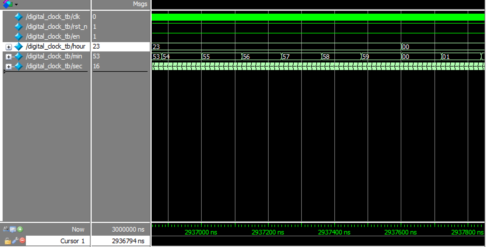
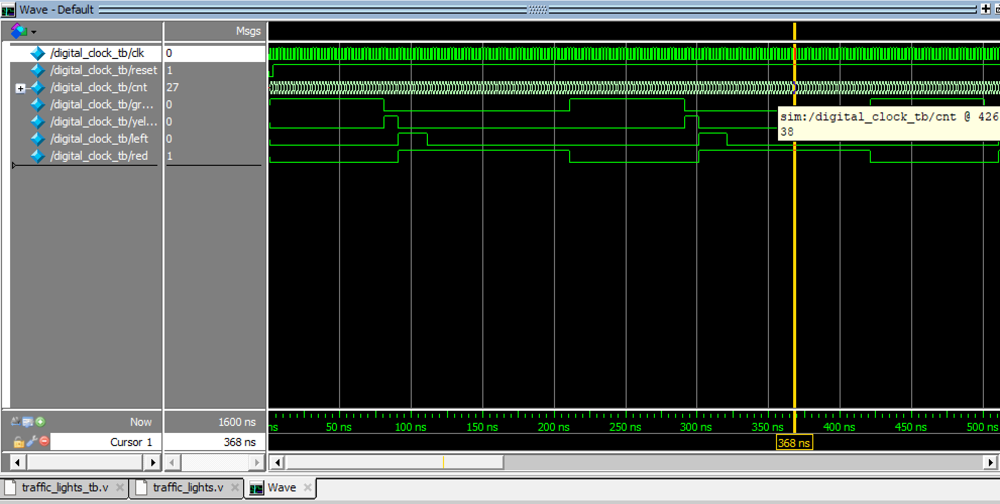

### 调试方法

进入调试：

点击 simulate - startsimulate - 点击work旁边的加号 - 选择测试文件

还要点击右下角的 options - 选择第二个 Apply full - 点击ok 再ok， 之后会弹出几个窗口

选择objects窗口的所有变量点击右键 - 选择 add wave

出现波形图了，再选择波形图类所有变量右键 - 选择radix 为 unsigned

最后在左下角终端中输入 run 1ms - 回车即可


**下面的模块中 Radix 进制一致选择十六进制 HEX**

**参考文档：**

- Verilog 常识：https://blog.csdn.net/Moon_3181961725

- Verilog 语法：https://blog.csdn.net/jac_chao/article/details/123744724

- Verilog 同步复位与异步复位：https://blog.csdn.net/weixin_42066185/article/details/111745416

- 数字钟实验：https://blog.csdn.net/Reborn_Lee/article/details/81358495


**信号介绍：**

- 时钟信号 clk：周期内不断改变上升下降沿

- 复位信号 rst_n：如果为高电平，则系统复位（清零）

- 使能信号 en：当这个信号为高电平时，系统才会工作，为低电平时，系统状态不变


**基础语法：**

- 定义模块：

```verilog
// 里面的变量为input变量加output变量
module counter6(clk, rst_n, en, dout, co);
```

- 使用模块：

```verilog
// 括号内为本模块定义的变量，外部为引用模块变量名
counter6 u1(.clk(clk), .rst_n(rst_n), .en(en), .dout(dout), .co(co));
```


### 模六计数器

```verilog
//模6计数器的Verilog HDL设计
module counter6(clk, rst_n, en, dout, co);
 
input clk, rst_n, en;
output[3:0] dout;
reg [3:0] dout; // 计数器
output co; // 进位
 
always@(posedge clk or negedge rst_n)
begin
	if(!rst_n)
		dout <= 4'b0000;        //系统复位，计数器清零
	else if(en)
		if(dout == 4'b0101)     //计数值达到5时，计数器清零
			dout <= 4'b0000;
		else
			dout <= dout + 1'b1; //否则，计数器加1
	else //计数使能无效时，输出不变
		dout <= dout;
 
end
 
assign co = dout[0]&dout[2];  //当计数达到5(4'b0101)时，进位为1，计数值为其他，都没有进位
endmodule
```

```verilog
//模6计数器的测试文件
`timescale 1ns/1ps
module counter6_tb;
 
reg clk, rst_n, en;
wire[3:0] dout;
wire co;
 
//时钟设计周期为2ns
always
begin
	#1 clk = ~clk;
end
 
//初始化
initial
begin
	clk = 1'b0;
	rst_n = 1'b1;
	en = 1'b0;
	#2 rst_n = 1'b0;
	#2 rst_n = 1'b1; en = 1'b1;    // 两个周期之后系统开始工作	
 
end
 
counter6 u1(.clk(clk), .rst_n(rst_n), .en(en), .dout(dout), .co(co));
 
endmodule
```


### 模十计数器

```verilog
//模10计数器的Verilog HDL设计
module counter10(clk, rst_n, en, dout, co);
 
input clk, rst_n, en;
output[3:0] dout;
reg [3:0] dout;
output co;
 
always@(posedge clk or negedge rst_n)
begin
	if(!rst_n)
		dout <= 4'b0000;        //系统复位，计数器清零
	else if(en)
        if(dout == 4'b1001)     //计数值达到9时，计数器清零
			dout <= 4'b0000;
		else
			dout <= dout + 1'b1; //否则，计数器加1
	else
		dout <= dout;
 
end
 
assign co = dout[0]&dout[3];  //当计数达到9(4'b1001)时，进位为1，计数值为其他，都没有进位
endmodule
```

```verilog
//模10计数器的测试文件
`timescale 1ns/1ps
module counter10_tb;
 
reg clk, rst_n, en;
wire[3:0] dout;
wire co;
 
//时钟设计周期为2ns
always
begin
	#1 clk = ~clk;
end
 
//初始化
initial
begin
	clk = 1'b0;
	rst_n = 1'b1;
	en = 1'b0;
	#2 rst_n = 1'b0;
	#2 rst_n = 1'b1; en = 1'b1;    //计数使能信号有效，且不复位
	
end
 
counter10 u1(.clk(clk), .rst_n(rst_n), .en(en), .dout(dout), .co(co));
 
endmodule
```


### 模六十计数器

```verilog
//模60计数器的Verilog HDL设计
module counter60(clk, rst_n, en, dout, co);
 
input clk, rst_n, en;
output[7:0] dout; // 模60的计数信号（也是输出信号）
output co; // 作为模60的进位信号
wire co10_1;
wire co10; // 作为作为模6计数器的使能信号 .en(co10)
wire co6;  
wire[3:0] dout10, dout6;
 
//模10计数器的进位为co10_1
counter10 u1(.clk(clk), .rst_n(rst_n), .en(en), .dout(dout10), .co(co10_1)); 
    
//co10_1与en的与为co10
and u3(co10,en,co10_1);
    
//co10_1与en的与为co10,作为模6计数器的使能信号
//即模10计数器进1时，模6计数器才会开始计数
counter6 u2(.clk(clk), .rst_n(rst_n), .en(co10), .dout(dout6), .co(co6)); 
    
//模6计数器的进位和模6的使能信号co10的与作为模60计数器的进位
and u4(co, co10, co6); 
 
//模60计数器的输出，高位为模6计数器的输出，低位为模10计数器的输出，读法是8421BCD码读法
assign dout = {dout6,dout10}; 
 
endmodule
 
//模6计数器模块
参考上面的

//模10计数器模块
参考上面的
```

```verilog
//模60计数器的测试文件  和 模10相同
`timescale 1ns/1ps
module counter60_tb;
 
reg clk, rst_n, en;
wire[7:0] dout;
wire co;
 
//时钟设计周期为2ns
always
begin
	#1 clk = ~clk;
end
 
//初始化
initial
begin
	clk = 1'b0;
	rst_n = 1'b1;
	en = 1'b0;
	#2 rst_n = 1'b0;
	#2 rst_n = 1'b1; en = 1'b1;    //计数使能信号有效，且不复位
 
end
 
counter60 u5(.clk(clk), .rst_n(rst_n), .en(en), .dout(dout), .co(co));
 
endmodule
```


### 模二十四计数器

```verilog
//8421BCD码计数器，模24
module bcd_counter(clk, rst_n, en, dout);
 
input clk, rst_n, en;
output[7:0] dout;
reg[7:0] dout;
 
always@(posedge clk or negedge rst_n)          //异步复位
begin
	if(!rst_n)       //复位信号有效时，输出清零
		dout <= 8'b00000000;
	else if(en == 1'b0)   //计数使能无效时，输出不变
		dout <= dout;
	else if( (dout[7:4] == 4'b0010)&&(dout[3:0] == 4'b0011) )  //计数达到23时，输出清零
		dout <= 8'b00000000;
	else if(dout[3:0] == 4'b1001)       //低位达到9时，低位清零，高位加1
	begin
		dout[3:0] <= 4'b0000;
		dout[7:4] <= dout[7:4] + 1'b1;
	end
	else                     //上述情况都没有发生，则高位不变，低位加1
	begin
		dout[7:4] <= dout[7:4];
		dout[3:0] <= dout[3:0] + 1'b1;
	end
end
endmodule
```

```verilog
//模24，8421BCD码计数器的测试文件
`timescale 1ns/1ps
module bcd_counter_tb;
 
reg clk, rst_n, en;
wire[7:0] dout;
 
//时钟信号，周期为20ns
always
begin
	#10 clk = ~clk;
end
 
//初始化
initial
begin
	clk = 1'b0;
	rst_n = 1'b0;
	en = 1'b0;
	#30 rst_n = 1'b1; en = 1'b1;
end
bcd_counter u1(.clk(clk), .rst_n(rst_n), .en(en), .dout(dout));
endmodule
```


### 数字钟计时器

分钟计时器 模60

```verilog
module min60(clk, rst_n, en, dout, co, min_add);
 
input clk, rst_n, en, min_add;
output[7:0] dout; // 模60的计数信号（也是输出信号）
output co; // 作为模60的进位信号
wire co10_1;
wire co10; // 作为作为模6计数器的使能信号 .en(co10)
wire co6;  
wire[3:0] dout10, dout6;
 
//模10计数器的进位为co10_1
min10 u1(.clk(clk), .rst_n(rst_n), .en(en), .dout(dout10), .co(co10_1), .min_add(min_add)); 
    
//co10_1与en的与为co10
and u3(co10,en,co10_1);
    
//co10_1与en的与为co10,作为模6计数器的使能信号
//即模10计数器进1时，模6计数器才会开始计数
min6 u2(.clk(clk), .rst_n(rst_n), .en(co10), .dout(dout6), .co(co6)); 
    
//模6计数器的进位和模6的使能信号co10的与作为模60计数器的进位
and u4(co, co10, co6); 
 
//模60计数器的输出，高位为模6计数器的输出，低位为模10计数器的输出，读法是8421BCD码读法
assign dout = {dout6,dout10}; 
 
endmodule
 
//模6计数器模块
module min6(clk, rst_n, en, dout, co);
 
input clk, rst_n, en;
output[3:0] dout;
reg [3:0] dout; // 计数器
output co; // 进位
 
always@(posedge clk or negedge rst_n)
begin
	if(!rst_n)
		dout <= 4'b0000;        //系统复位，计数器清零
	else if(en)
		if(dout == 4'b0101)     //计数值达到5时，计数器清零
			dout <= 4'b0000;
		else
			dout <= dout + 1'b1; //否则，计数器加1
	else //计数使能无效时，输出不变
		dout <= dout;
 
end
 
assign co = dout[0]&dout[2];  //当计数达到5(4'b0101)时，进位为1，计数值为其他，都没有进位
endmodule

//模10计数器模块
module min10(clk, rst_n, en, dout, co, min_add);
 
input clk, rst_n, en, min_add;
output[3:0] dout;
reg [3:0] dout;
output co;
 
always@(posedge clk or negedge rst_n)
begin
	if(!rst_n)
		dout <= 4'b0000;        //系统复位，计数器清零
	else if(en)
    if(dout == 4'b1001)     //计数值达到9时，计数器清零
		  dout <= 4'b0000;
		else
			dout <= dout + 1'b1; //否则，计数器加1
	
    // 如果en == 0 则计数器暂停
	else
      
	  if(min_add == 1'b0)
		  dout <= dout;
	  else
      // 如果分钟加一处于高电平则加一
 	  begin
		  dout[7:4] <= dout[7:4];
		  dout[3:0] <= dout[3:0] + 1'b1;
	  end	   
 
end
 
assign co = dout[0]&dout[3];  //当计数达到9(4'b1001)时，进位为1，计数值为其他，都没有进位
endmodule
```


秒钟计数器 模60

```verilog
module sec60(clk, rst_n, en, dout, co);
 
input clk, rst_n, en;
output[7:0] dout; // 模60的计数信号（也是输出信号）
output co; // 作为模60的进位信号
wire co10_1;
wire co10; // 作为作为模6计数器的使能信号 .en(co10)
wire co6;  
wire[3:0] dout10, dout6;
 
//模10计数器的进位为co10_1
sec10 u1(.clk(clk), .rst_n(rst_n), .en(en), .dout(dout10), .co(co10_1)); 
    
//co10_1与en的与为co10
and u3(co10,en,co10_1);
    
//co10_1与en的与为co10,作为模6计数器的使能信号
//即模10计数器进1时，模6计数器才会开始计数
sec6 u2(.clk(clk), .rst_n(rst_n), .en(co10), .dout(dout6), .co(co6)); 
    
//模6计数器的进位和模6的使能信号co10的与作为模60计数器的进位
and u4(co, co10, co6); 
 
//模60计数器的输出，高位为模6计数器的输出，低位为模10计数器的输出，读法是8421BCD码读法
assign dout = {dout6,dout10}; 
 
endmodule
 
//模6计数器模块
module sec6(clk, rst_n, en, dout, co);
 
input clk, rst_n, en;
output[3:0] dout;
reg [3:0] dout; // 计数器
output co; // 进位
 
always@(posedge clk or negedge rst_n)
begin
	if(!rst_n)
		dout <= 4'b0000;        //系统复位，计数器清零
	else if(en)
		if(dout == 4'b0101)     //计数值达到5时，计数器清零
			dout <= 4'b0000;
		else
			dout <= dout + 1'b1; //否则，计数器加1
	else //计数使能无效时，输出不变
		dout <= dout;
 
end
 
assign co = dout[0]&dout[2];  //当计数达到5(4'b0101)时，进位为1，计数值为其他，都没有进位
endmodule

//模10计数器模块
module sec10(clk, rst_n, en, dout, co);
 
input clk, rst_n, en;
output[3:0] dout;
reg [3:0] dout;
output co;
 
always@(posedge clk or negedge rst_n)
begin
	if(!rst_n)
		dout <= 4'b0000;        //系统复位，计数器清零
	else if(en)
        if(dout == 4'b1001)     //计数值达到9时，计数器清零
			dout <= 4'b0000;
		else
			dout <= dout + 1'b1; //否则，计数器加1
	else
		dout <= dout;
 
end
 
assign co = dout[0]&dout[3];  //当计数达到9(4'b1001)时，进位为1，计数值为其他，都没有进位
endmodule
```


时钟计数器 模24

```verilog
module counter24(clk, rst_n, en, dout, hour_add);
input clk, rst_n, en, hour_add;
output[7:0] dout;
reg[7:0] dout;
always@(posedge clk or negedge rst_n)        
begin 
  
	if(!rst_n)   
		dout <= 8'b00000000;
		
	else if(en == 1'b0)
	  if(hour_add == 1'b0)
		  dout <= dout;
	  else
  	  begin
		  dout[7:4] <= dout[7:4];
		  dout[3:0] <= dout[3:0] + 1'b1;
	  end	   

	else if( (dout[7:4] == 4'b0010)&&(dout[3:0] == 4'b0011) ) 
		dout <= 8'b00000000;

	else if(dout[3:0] == 4'b1001)  
	begin
		dout[3:0] <= 4'b0000;
		dout[7:4] <= dout[7:4] + 1'b1;
	end

	else            
	begin
		dout[7:4] <= dout[7:4];
		dout[3:0] <= dout[3:0] + 1'b1;
	end
 
end
  
endmodule
```


 时钟计数器

```verilog
//数字时钟计数器
module digital_clock(hour,min,sec,clk,rst_n,en,hour_add,min_add);
 
input clk,rst_n,en,hour_add,min_add;
output[7:0] hour, min, sec;
 
wire co_sec1,co_sec; //co_sec作为分钟计数器使能信号
wire co_min,co_min1; //co_min作为小时计数器使能信号
 
sec60 u1(.clk(clk), .rst_n(rst_n), .en(en), .dout(sec), .co(co_sec1));
and u2(co_sec,en,co_sec1);
min60 u3(.clk(clk), .rst_n(rst_n), .en(co_sec), .dout(min), .co(co_min1), .min_add(min_add));
and u4(co_min,co_sec,co_min1);
counter24 u5(.clk(clk), .rst_n(rst_n), .en(co_min), .dout(hour),.hour_add(hour_add));
 
endmodule
```


测试代码

```verilog
module digital_clock_tb;
 
reg clk,rst_n,en, hour_add, min_add;
wire[7:0] hour,min,sec;
 
always
begin
	#1 clk = ~clk;	
end 
 
initial
begin
	clk = 1'b0;
	rst_n = 1'b0;
	en = 1'b0;
	hour_add = 1'b0;
	min_add = 1'b0;
	
	#3 rst_n = 1'b1; en = 1'b1;
	
	#10 hour_add = ~hour_add; en = ~en;
	
	#2 hour_add = ~hour_add; en = ~en;	
	
	#10 min_add = ~min_add; en = ~en;
	
	#2 min_add = ~min_add; en = ~en;
end
digital_clock u0(.clk(clk),.rst_n(rst_n),.en(en),.hour(hour),.min(min),.sec(sec),.hour_add(hour_add),.min_add(min_add));
endmodule
```




### 交通信号灯

只用一个计数器 cnt，循环倒计时使用，再用4个信号灯高电平，cnt60 为判别红灯阶段但不包含左转

```verilog
module traffic_lights(clk,reset,green,yellow,left,red,cnt);

input clk,reset;
output green,yellow,left,red;
output[5:0] cnt;

reg green,yellow,left,red;
reg[5:0] cnt,cnt60;

always @(posedge clk)
begin
  if(!reset)
    cnt <= 40;
    
  else if(green && (cnt == 1))
    cnt <= 5; 
    
  else if(yellow && (cnt == 1))
    cnt <= 10;
    
  else if(left && (cnt == 1))
    cnt <= 50; 
 
  else if(red && (cnt60 == 1))
    cnt <= 40; 

  else
    cnt <= cnt - 1;
end

always @(posedge clk)
begin
  if(!reset)
    green <= 1;

  else if(red && (cnt60 == 1))
    green <= 1;
    
  else if(green && (cnt == 1))
    green <= 0; 
end

always @(posedge clk)
begin
  if(!reset)
    yellow <= 0;

  else if(green && (cnt == 1))
    yellow <= 1;
    
  else if(yellow && (cnt == 1))
    yellow <= 0; 
end

always @(posedge clk)
begin
  if(!reset)
    left <= 0;

  else if(yellow && (cnt == 1))
    left <= 1;
    
  else if(left && (cnt == 1))
    left <= 0; 
end

always @(posedge clk)
begin
  if(!reset)
    cnt60 <= 0;

  else if(yellow && (cnt == 1))
    cnt60 <= 60;
    
  else if(red)
    cnt60 <= cnt60 - 1;
  
  else 
    cnt60 <= 0;
end

always @(posedge clk)
begin
  if(!reset)
    red <= 0;

  else if(yellow && (cnt == 1))
    red <= 1;
    
  else if(red && (cnt60 == 1))
    red <= 0; 
end

endmodule
```

测试文件

```verilog
module digital_clock_tb;
  
reg clk,reset;
wire[5:0] cnt;
wire green,yellow,left,red;
 
always
begin
	#1 clk = ~clk;
end
 
initial
begin
	clk = 1'b0;
	reset = 1'b0;
	
	#3 reset = 1'b1;
end

traffic_lights u0(.clk(clk),.reset(reset),.green(green),.yellow(yellow),.left(left),.red(red),.cnt(cnt));

endmodule
```


