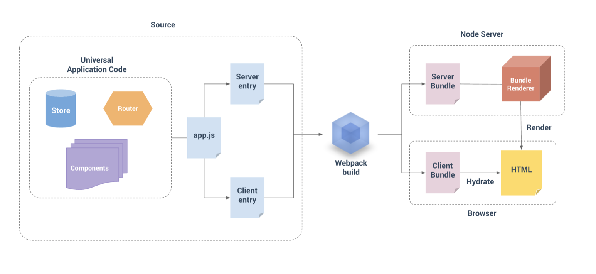
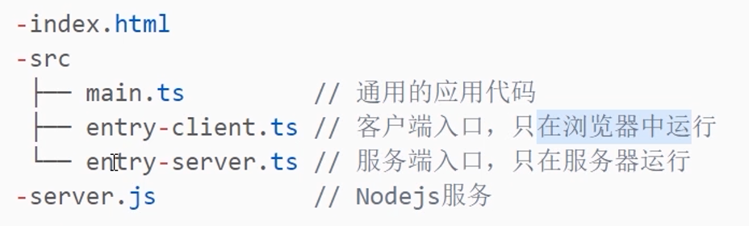
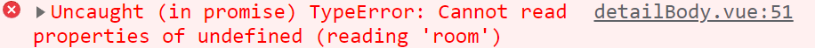
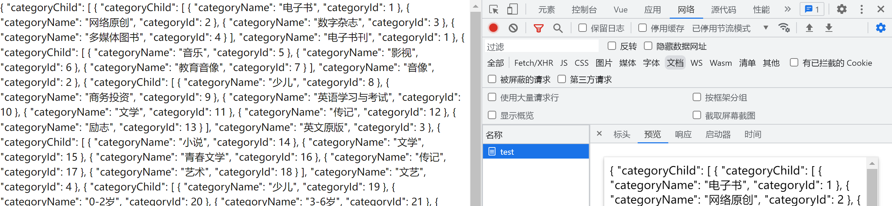
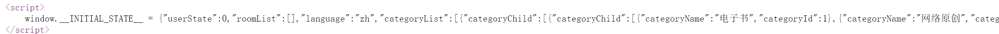
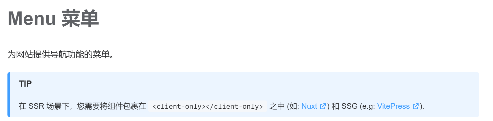
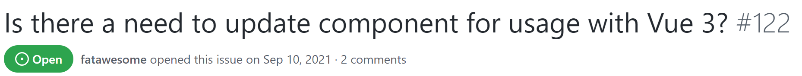
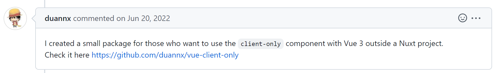
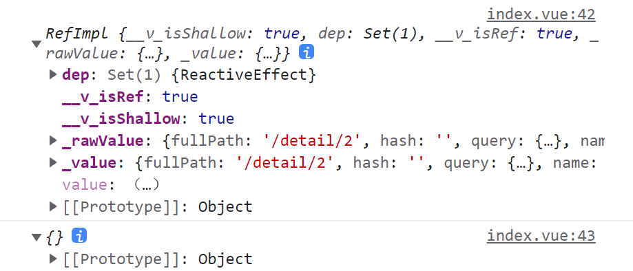
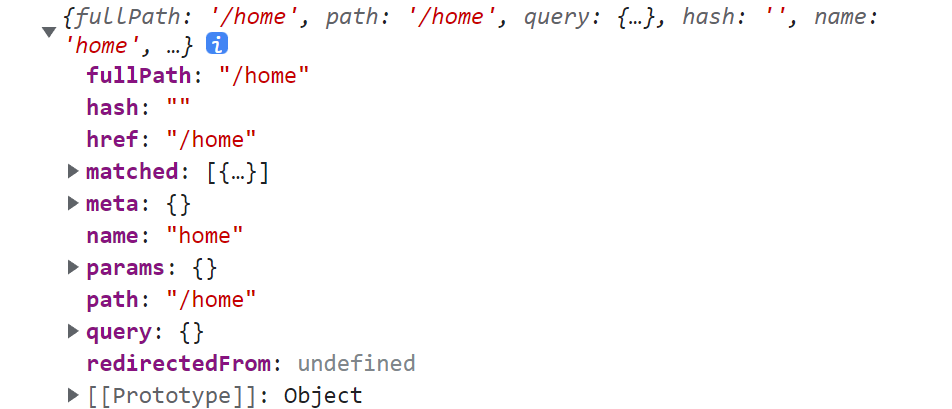

## 一、项目环境配置

以下是项目开发课程步骤及简单笔记

`vue-ssr test`：这个版本是 ssr 改造前的最后一个版本，需要把 `main.ts/index.html` 修改成原样式


`entry-client`：这个版本完成了客户端渲染，对应 8-12 章节


`ssr & vuex`：这个版本完成了 ssr 的第一次改造，实现了 vuex 获取动态数据


`ssr & vuex 2.0`：这个版本修复了 ssr 的报错（将浏览器 api 的首次调动都搬移到 `entry-client.ts` 中），并且将 `entry-client.ts` 与 `vuex` 搭配使用，实现了 vuex 数据的首次加载功能 

 

`fixed 3.0`、`el-menu&ssr&vuex`： 该版本完成了 el-menu 报错，git 报错等问题

 

`finish order`：修复了 ssr 服务端渲染的一些报错，一般都是直接取消服务端渲染... ，解决了 indexed DB 请求的一些报错，实现了完整的订单模块的功能**（未区分用户）**：查询、删除、添加订单


`finish orderByUsers`：通过修改订单模块的三个 mock 接口，实现了登录权限拦截，不同用户拥有不同订单


`airbnb-vue-ssr 1.0`：在开发环境下，网站基础功能已经全部实现！后续可能还会有一定的优化


`airbnb-vue-ssr 1.1`：最后一个处于开发环境的版本，这个版本进行了 SEO 优化，处理了路由 mate 元信息


`airbnb-vue-ssr 1.2`：dist 成功打包，生成环境通过 `server_prod.js` 成功运行！`v-lazy` 无法在生产环境下使用，开发环境照常使用


实现功能：登录、注册，页面重定向，登录权限拦截，订单、历史记录模块的一些功能，切换全局语言功能，首页 ssr 动态数据加载，服务端和客户端 vuex 数据同步，图片懒加载，异步组件的实现，indexed DB 模拟数据库，mock 模拟后端接口，ElementPlus 组件的基本使用


### 1、nvm 管理 node.js 版本

`nvm list`  `nvm use`  `nvm install` `nvm uninstall`

安装低版本的第三方库，可能需要降低版本才能安装成功


### 2、`vue-router4` 使用方法


### 3、vue3 模板

```vue
<script setup lang="ts">
</script>

<template>
</template>

<style scoped>
</style>
```


组件命名规范：**https://blog.csdn.net/weixin_59229847**


### 4、ElementPlus 按需引入

下载依赖：

`npm install element-plus --save`

`npm install -D unplugin-vue-components unplugin-auto-import`


vite.config.ts

```ts
...
import AutoImport from 'unplugin-auto-import/vite'
import Components from 'unplugin-vue-components/vite'
import { ElementPlusResolver } from 'unplugin-vue-components/resolvers'

plugins: [
    vue(),
    AutoImport({
        resolvers: [ElementPlusResolver()],
    }),
    Components({
        resolvers: [ElementPlusResolver()],
    }),
],
...
```


会在根目录下生成 `components.d.ts`、`auto-imports.d.ts` 这两个文件


main.ts

```js
import ElementPlus from 'element-plus'
import 'element-plus/dist/index.css'

app.use(ElementPlus)
```


官方文档：https://element-plus.gitee.io/zh-CN/component/button.html

查看官方文档，基础组件中直接使用即可，反馈组件需要更复杂的引入方式


### 5、ElementPlus 组件模板

- 加载模块

官方文档：https://element-plus.gitee.io/zh-CN/component/loading.html

使用的是全局加载功能，会占满整个屏幕

```ts
import { ElLoading } from 'element-plus'

const loading = ElLoading.service({
    lock: true,
    text: 'Loading',
    background: 'rgba(255, 255, 255, 0.7)',
})

setTimeout(() => { loading.close() }, 500)
```

> 在 mock 接口中直接模拟，在真实接口中得去 store 里面模拟


- 发送消息

```ts
import { ElMessage } from 'element-plus'

ElMessage({
    message: `切换页面成功`,
    type: 'success',
    duration: 1000
})

ElMessage.error(result.data)
```


### 6、Vue3 项目配置 Eslint


- **安装 Eslint**

安装 Eslint

`npm i eslint`


生成 `.eslintrc` 文件

`npx eslint --init`

配置选项按照这个：


- **配置 Eslint**

安装 Eslint 插件，启用即可

vscode 配置：https://blog.csdn.net/my_new_way/article/details/105177909

eslint 官网：https://zh-hans.eslint.org/docs/latest/


### 7、Sass 的使用方法

Sass 帮助我们集中式管理 CSS 样式，但是 Sass 文件的后缀最好用 Scss。Scss 其实是 Sass 的新标准，它更好的适配了 CSS 的书写规范！！中文文档：https://www.sass.hk/docs/

下载依赖：`npm i sass -D` 


使用文档：https://blog.csdn.net/weixin_67745264/article/details/125141904

特性：index.scss

```scss
// 定义变量
$red: red;

$name: name-container;

// 定义函数（css 集中样式）
@mixin background-black {
    background-color: black;
}

// 函数还可以传参！ 如果不传就是绿色
@mixin turn-red($c: green) {
    color: $c;
}

@include turn-red(red) // 传了就变成红色！
    
// 插值语法
#{}
```


组件中使用

```vue
<style lang="scss" scoped>
@import "@/assets/scss/app/index.scss";

div {
    width: 100px;
    height: 200px;
    color: $red;
    @include background-black;
    
    // 插值语法的使用
    color: #{$primaryColor}
}
    
.#{$name} {

}
</style>
```


**将某个 scss 文件注册为全局**

在 `assets` 下新建 `variable.scss` ，里面存放项目全局样式

在 `vite.config.ts` 中添加配置

```ts
// 配置 scss 入口文件
css: {
    preprocessorOptions: {
        scss: {
            additionalData: `@import "@/assets/scss/variable.scss";`
        }
    }
},
```

> 之后其他 scss 文件就不用引入 variable.scss 了


### 8、对 Axios 进行 TS 封装

axios 官网：https://axios-http.com/zh/，如果是 TS 封装，最好下载 `npm i @types/axios`


- 在 untils 下新建 `http.ts` ，下面是封装模板

```ts
import axios, { AxiosRequestConfig, AxiosResponse } from 'axios'

const defaultConfig = {
    timeout: 5000,
    
    // 生产环境
    // baseURL: import.meta.env.PROD ? 'http://110.42.184.111' : 'http://localhost:5137/release'
    
    // 开发环境
    baseURL: 'http://localhost:5173/release'   
    
    // 如果没配置 vite 代理也可以不写 baseURL
}

// TS 封装
class Http {
    constructor() {
        // 实例化请求响应拦截
        this.httpInterceptorsRequest()
        this.httpInterceptorsResponse()
    }

    private static axiosInstance = axios.create(defaultConfig)

    // 请求拦截 config 为一个 axios 请求
    private httpInterceptorsRequest() {
        Http.axiosInstance.interceptors.request.use((config: AxiosRequestConfig) => {
            // 发送请求前可以做的事


            return config
        }, err => {
            return Promise.reject(err)
        })
    }

    // 响应拦截 response 为一个 axios 响应
    private httpInterceptorsResponse() {
        Http.axiosInstance.interceptors.response.use((response: AxiosResponse) => {
            // 响应前可以做的事

            return response
        }, err => {
            
            
            return Promise.reject(err)
        })
    }

    // 封装 get/post 请求函数
    public httpRequestGet<T>(url: string, params: AxiosRequestConfig): Promise<T> {
        return Http.axiosInstance.get(url, { params }).then(res => res.data).catch()
    }

    public httpRequestPost<T>(url: string, params: AxiosRequestConfig): Promise<T> {
        return Http.axiosInstance.post(url, params).then(res => res.data).catch()
    }
}

// 导出 http 实例
export const http = new Http()
```


- 在 `api` 文件夹下新建 `index.js` 专门存放发送请求的接口函数 

```ts
// 请求函数参数：url、参数或参数对象

import { http } from '@/utils/http'

// 真实接口
export const reqgetCategoryList = function () {
    return http.httpRequestGet(`http://gmall-h5-api.atguigu.cn/api/product/getBaseCategoryList`,{});
}
```

> 接口函数返回一个 promise 对象，分为成功态和失败态，需要 `async/await` 函数接收
>
> 没有 baseURL 就要把地址写全来！


- 组件中调用接口

```ts
import { reqgetCategoryList } from '@/api/index'

async function getData() {
    let result = await reqgetCategoryList();

    console.log(result);
}
```


### 9、ElementPlus 配置国际化

直接参考文档，很简单的。就是中英文交换

https://element-plus.gitee.io/zh-CN/guide/i18n.html


- 在 main.ts 中配置默认语言

```ts
// ElementPlus
import ElementPlus from 'element-plus'
import 'element-plus/dist/index.css'
import zhCn from 'element-plus/dist/locale/zh-cn.mjs'
app.use(ElementPlus, {
    locale: zhCn, // 默认中文语言
})
```


- 在 app.vue 中配置语言 用到 `el-config-provider` 通过修改 `locale`

```vue
<script setup lang="ts">
import en from 'element-plus/lib/locale/lang/en'
import zhCn from 'element-plus/lib/locale/lang/zh-cn'
import { ref } from 'vue';

const locale = ref(zhCn)

function changeLan(lan: any) {
    if(lan == '中文') locale.value = zhCn
    if(lan == '英文') locale.value = en
}

const value = ref(new Date())
</script>

<template>
    <el-config-provider :locale="locale">
        <button @click="changeLan('中文')">中文</button>
        <button @click="changeLan('英文')">英文</button>
        <el-calendar v-model="value" />
    </el-config-provider>
</template>
```


### 10、实现网站全局国际化

下载依赖：`npm install vue-i18n@next`

官方文档：https://kazupon.github.io/vue-i18n/zh/

**在 src 下新建 `language `文件夹**

新建 `i18n.ts`  `zn.ts`、`en.ts`

```ts
import { createI18n } from 'vue-i18n'
import zh from './zh'
import en from './en'

// 返回一个语言配置
const i18n = createI18n({
    legacy: false, // 这个不能缺！不然
    locale: 'zh', // 默认语言
    messages: {
        zh,
        en
    }
})

export default i18n
```

```ts
// zn.ts

export default {
    message: {
        name: '陈'
        sex: '男'
    }
}
```

```ts
// en.ts

export default {
    message: {
        name: 'cocoon'
        sex: '女'
    }
}
```


**配置 `main.ts`** 

```ts
// 语言配置
import i18n from '@/language/i18n'
app.use(i18n)
```


**组件中使用**

```vue
<script setup lang="ts">
import { useI18n } from 'vue-i18n'

const { t, locale } = useI18n()

// 改变语言
function changeLan(lan: string) {
    locale.value = lan
}

</script>

<template>
    <button @click="changeLan('zh')">中文</button>
    <button @click="changeLan('en')">英文</button>

    <h1>{{ t('header.orders') }}</h1>
</template>
```


### 11、IndexedDB 数据存储方案

- 前言：IndexedDB 是一种底层 API ，用于在客户端存储大量的结构化数据，该 API 使用索引实现对数据的高性能搜索。 IndexedDB 是一个事务型数据库系统，也是一个基于 JavaScript 的面向对象数据库，它提供了类似数据库风格的数据储存和使用方式，**我们只需要指定数据库模式，打开与数据库的连接，然后检索和更新一系列事务**


- 目的：当我们进行一些较大的SPA页面开发时，我们会需要进行一些数据的本地存储。当数据量不大时，我们可以通过 `SessionStorage` 或者 `LocalStorage` 来进行存储，但是当数据量较大，或符合一定的规范时，我们可以使用数据库来进行数据的存储。


#### 11.1 基本概念和 API

数据库：存储数据的地方，每个域名可以创建多个数据库

对象仓库：也就是 `objectStore` ，每个数据库包含若干个对象仓库

索引：**可以为对象仓库中的属性创建对应的索引**，并且根据索引来查询数据，**一般索引名称和索引属性一致**

事务：数据库里的**增删改查操作都是通过事务（ transaction ）来完成**，作用于 `this.db`

数据记录：每一条数据都是一条记录，有对应的 key 、 value 、主键、索引等属性


推荐文档：https://blog.csdn.net/imagine_tion/article/details/115000245

推荐文档：https://blog.csdn.net/p1967914901/article/details/127123254


**基本步骤：1、创建数据库连接 2、创建 objectStore 3、创建一些索引 4、通过事务来进行数据库操作**


#### 11.2 数据库与对象仓库的创建

`onupgradeneeded`：只有首次调用 `openStore` 时，才会调用。内部用来创建所有的对象仓库


在 `utils` 文件夹下新建 `indexedDB.ts`

```ts
export default class IndexedDB {
    private dbName: string
    private db: any // 数据库实例

    constructor(dbName: string) {
        this.dbName = dbName
    }

    // 打开数据库 + 对象仓库（参数：对象仓库数组、主键名、索引数组） 
    openStore(stores: Array<string>, keyPath: string, indexs?: Array<string>) {

        // 参数：名称、版本号（不可回退）
        let request = window.indexedDB.open(this.dbName, 2) 

        return new Promise((resolve, reject) => {
            // 数据库打开成功的回调
            request.onsuccess = (e) => {
                // 将 this.db 赋值数据库实例
                this.db = e.target.result

                // 返回成功态
                resolve(true)
            }

            // 数据库打开失败的回调
            request.onerror = (e) => {
                console.log('数据库打开失败')

                // 返回失败态
                reject(false)
            }

            // 数据库更新成功的回调（第一次打开数据库才会执行！）
            request.onupgradeneeded = function (e) {
                const { result } = e.target

                // 创建所有的对象仓库
                stores.map((storeName) => {
                    const store = result.createObjectStore(storeName, {
                        autoIncrement: true, keyPath
                    })

                    // 创建该对象仓库属性的索引
                    if (indexs && indexs.length > 0) {
                        indexs.map(function (i: string) {
                            store.createIndex(i, i, { unique: true })
                        })
                    }

                    // 对象仓库创建成功的回调
                    store.transaction.oncomplete = function (e) {
                        // console.log(`${storeName}仓库创建成功`);
                    }
                })

                resolve(true)
            }

        })        
    }
}
```


**实例化数据库在实际使用中讲到**


单独理解一下：`createIndex`能够给当前的存储空间设置一个索引。它接受三个参数

1. 第一个参数，索引的名称。
2. 第二个参数，指定根据存储数据的哪一个属性来构建索引。
3. 第三个属性， options对象，其中属性`unique`的值为`true`表示不允许索引值相等。

```ts
// 创建该对象仓库属性的索引
if(indexs && indexs.length > 0) {
    indexs.map(function(i: string) {
        store.createIndex(i, i, { unique: false })
    })
}
```

> 目前还没理解有什么用...


#### 11.3 对象仓库增删改查操作

通过操作数据库实例 `this.db` 搭配其内部属性 **`transaction` 事务函数**

`indexedDB.ts` 中的类 `indexedDB` 里面添加这些函数


**1、增加、修改数据 put**

```ts
// 增加、修改单条数据
updateItem(storeName: string, data: any) {
    // 打开对象仓库
    const store = this.db.transaction([storeName], 'readwrite').objectStore(storeName)

    // 仓库写入数据 updateTime：使数据唯一化
    let request = store.put({
        ...data, updateTime: new Date().getTime()
    })

    return new Promise((resolve, reject) => {

        // 写入成功的回调
        request.onsuccess = function (e) {
            resolve(true)
        }

        // 写入失败的回调
        request.onerror = function (e) {
            reject(false)
        }

    })

}
```


在实例中增加、修改属性  **参数必须为一个对象！！**

- 增加属性

```ts
// 创建
result = await airbnbDB.updateItem(storeName, { 
    usertoken,
    orderList,
    // keypath id自动会传入
})
```


- 修改属性：
  - 需要根据主键（keypath） id 修改  
  - 后面为属性参数，**进行替换操作**，如果其中属性一个不写，则会消失

```ts
// 更新用户订单
result = await airbnbDB.updateItem(storeName, { id, usertoken, orderList })
```


> 主键（id）也会按递增顺序默认加入数据中！


**2、删除数据 delete**

```ts
// 删除单条数据
deleteItem(storeName: string, keyPath: string | number) {
    // 打开对象仓库
    const store = this.db.transaction([storeName], 'readwrite').objectStore(storeName)

    let request = store.delete(keyPath)

    return new Promise((resolve, reject) => {

        // 删除成功的回调
        request.onsuccess = function (e) {
            resolve(true)
        }

        // 删除失败的回调
        request.onerror = function (e) {
            reject(false)
        }

    })
}

```

```ts
airbnbDB.deleteItem(storeName, 2)
```


**3、查询数据 get**

返回值用到了 `Promise` 对象，那么调用的时候必须用 `async/await`

```ts
// 查询所有数据
getList(storeName: string) {
    const store = this.db.transaction(storeName).objectStore(storeName)

    const request = store.getAll()

    // 返回异步函数结果
    return new Promise((resolve, reject) => {
        request.onsuccess = (event: any) => {
            console.log('查询所有数据成功')

            // 成功得到数据并返回
            resolve(event.target.result) // 成功态
        }

        request.onerror = (event: any) => {
            console.log('查询所有数据失败')

            // 返回失败结果
            reject(event) // 失败态
        }
    })
}

// 查询单条数据
getItem(storeName: string, key: number | string) {
    const store = this.db.transaction(storeName).objectStore(storeName)

    const request = store.get(key)

    // 返回异步函数结果
    return new Promise((resolve, reject) => {
        request.onsuccess = (event: any) => {
            console.log('查询某一条数据成功')

            // 成功得到数据并返回
            resolve(event.target.result) // 成功态
        }

        request.onerror = (event: any) => {
            console.log('查询某一条数据失败')

            // 返回失败结果
            reject(event) // 失败态
        }
    })
}
```


实际调用：

```ts
async function check(storeName: string) {
    let result = await airbnbDB.getList(storeName)

    console.log(result); // 成功态获得数据  失败态为 false   
}
```


#### 11.4 indexedDB 的实际使用

- `db/index.ts`

当我们在 `src/utils/indexedDB` 中定义好了 `indexedDB` 类，我们就需要在 `src` 文件夹下新建 `db` 文件夹，用来导出数据库和对象仓库

```ts
import IndexedDB from '@/utils/indexedDB' 

// 数据库
export const airbnbDB = new IndexedDB('airbnbDB')

// 数据库对象仓库
export default ['language', 'user']
```


> 当需要添加新的对象仓库时，只需要在 export default 数组后面添加新的仓库名即可！！


- 每次进入页面则初始化所有对象仓库

进入 `@/router/index.ts`

```ts
router.beforeEach(async function () {
    let result = await airbnbDB.openStore(stores, 'id')
    
    if(result) console.log('所有对象仓库初始化成功');
}) 
```


- 之后在外部函数中直接引入数据库即可

```ts
import { airbnbDB } from '@/db/index';
```


### 12、indexedDB 搭配 Mock 接口

前言：mock 接口的意思就是申请的数据不是从后台接口获取的，我们这里是从 indexedDB 里获取数据。

实现调用 mock 接口返回的结果和调用真实接口保持一致的效果，所以我们先要有后端接口返回数据的模板，然后让 mock 接口返回差不多的数据


解决的问题：

- 我们可以提前根据后端开发者提供的接口文档，来自行开发一套 Mock 接口，供前端项目来调用
- 需要调用什么接口，直接使用 IndexedDB 自行封装就行，不需要建立 http 连接、处理跨域、联调等等
- **等到自测或者发布测试阶段，直接将 Mock 接口替换成真实线上接口就可以了**
- 这样不仅提升了前后端开发效率，也使得前后端在某种程度上做到解耦


#### 12.1 解决 indexedDB 的异步问题

使用 indexedDB 获取的步骤：

**必须先打开数据库及仓库，才能再增删改查**，所以要解决 indexedDB 的异步问题。

解决方法：

将 indexedDB 类中的函数返回值都改成 promis 类型，暂时列举一个函数

- `openStore()`

```ts
openStore(storeName: string, keyPath: string, indexs?: Array<string>) {
    let request = window.indexedDB.open(this.dbName, 2) // 名称 版本号（不可回退）

    // 数据库更新成功的回调
    request.onupgradeneeded = ...

    // 返回一个异步 打开成功才能执行之后的代码
    return new Promise((resolve, reject) => {
        // 数据库打开成功的回调
        request.onsuccess = (e) => {
            console.log('数据库打开成功')

            // 赋值数据库实例
            this.db = e.target.result

            // 返回成功态
            resolve(true)
        }

        // 数据库打开失败的回调
        request.onerror = (e) => {
            console.log('数据库打开失败')

            // 返回失败态
            reject(false)
        }

    })        
}
```


#### 12.2 实现 mock 接口

以下是查询数据库所有数据 mock 接口函数的模板，首先确保有 `room` 这个对象仓库

而且实现了加载效果，利用 `ElLoading`

```ts
// 引入加载效果
import { ElLoading } from 'element-plus'

// 引入数据库
import { airbnbDB } from '@/db/index';


// mock 接口
export async function fetchMockData() {
    // 创建 mock 加载效果
    const loading = ElLoading.service({
        lock: true,
        text: 'Loading',
        background: 'rgba(255, 255, 255, 0.7)',
    })

    // 再查询所有数据库数据
    const result = await airbnDB.getList('room')

    // 加载结束
    setTimeout(() => { loading.close() }, 1000)

    // 返回对象结果
    if(result) {
        return { code: '200', message: '成功', data: result, ok: true }
    } else {
        return { code: '204', message: '失败', data: false, ok: false }
    }
}
```


`ElLoading`：https://element-plus.gitee.io/zh-CN/component/loading.html


#### 12.3 真实/mock 数据对比

在组件中调用两个接口函数，并打印结果

```ts
import { reqgetCategoryList, fetchMockData } from '@/api/index'

async function getRealData() {
    let result = await reqgetCategoryList();
    console.log('真实数据');
    console.log(result);
}

async function getMockData() {
    let result = await fetchMockData()
    console.log('mock数据');
    console.log(result);
}
```


### 13、SSR/CSR以及同构渲染的区别

**（一） SSR （传统服务端渲染）**

传统的服务端渲染有： asp 、 jsp 、 ejs 等，服务端语言往往通过这些模板引擎将数据和 dom 在服务端渲染完成，返回一个完整的静态 html 页面给客户端，由客户端直接显示

原理：

- 客户端发送 http 请求
- 服务端响应 http 请求，返回拼接好的 html 字符串给客户端
- 客户端渲染 html

缺点：前后端分离，不好维护，用户体验不佳，需要重新加载页面，服务端压力大


**（二）CSR（客户端渲染）**

在现代化的前端项目中，客户端渲染的代表性技术栈是 vue 、 react 、 angular ，我们常常使用它们来构建客户端单页或者多页应用程序。**以 SPA 构建程序为例**，在浏览器端首先渲染的是**一套空的 html** ，**通过 JS 直接进行页面的渲染和路由跳转等操作**，所有的数据通过 ajax 请求从服务器获取后，在进行客户端的拼装和展示

原理：

- 客户端发起 http 请求
- 服务端响应 http 请求，**返回一个空的 html 文件**
- 客户端初始化时加载必须的 js 文件，请求接口
- 将生成的 dom 插入到 html 中

**缺点：首屏加载慢，不利于 SEO**


**（三）同构（现代服务端渲染）**

 Vue 、 React + SSR 方案实际上就是同构渲染，**我们现在讲的服务端渲染概念**，是指在前端范畴或者说在 vue 、 react 等单页面技术栈范畴内，基于 Node.js server 运行环境的服务端渲染方案，**通过在 Node . js 中运行相同应用程序的前端框架**（例如 React 、 Vue 等），将其预渲染成 HTML ，最后在客户端进行注水化处理。

简单来讲，就是应用程序的大部分代码在服务器（Node 服务端）和客户端上运行，这就是所谓的现代服务端渲染

原理：

- 客户端发起 http 请求
- 服务端渲染把 Vue 实例转换成了静态的 html 发送给客户端（CSR则是空的 html）
- 客户端渲染是需要把事件、响应式特性等 Vue 的特性都绑回去

缺点：服务器压力大，涉及构建设置和部署的更多要求，一些三方库可能需要特殊处理

优点：首屏速度快，前后端分离，利于 SEO ，有一些现成框架：Nuxt.js、Next.js


### 14、Nuxt3 入门尝鲜

**SPA应用**：也就是单页应用，这些多是在客户端的应用，不利于进行[SEO优化](https://so.csdn.net/so/search?q=SEO优化&spm=1001.2101.3001.7020)（搜索引擎优化）。

**SSR应用**：在服务端进行渲染，渲染完成后返回给客户端，每个页面有独立的URL，对SEO友好。

Nuxt3 是基于 Vue3 发布的 SSR 框架，致力于将 SPA 应用转化为 SSR 应用（现代服务端渲染）


参考文档：https://blog.csdn.net/zheng_jia_jun/article/details/125793720


## 二、实际功能开发

### 1、ElementPlus 样式修改问题

- 修改 `.el-sub-menu__title` 样式不生效：必须去掉 `style` 中的 `scoped`


### 3、实现切换语言功能

这个是 mock 接口功能实战，就是在组件中发送请求函数；比如申请修改语言，后端返回修改成功或者失败的对象结果。成功的话前端才能修改语言，失败则不能修改


#### 3.1 编写 mock 接口

由此导出两个接口：

`saveLanguageApi(language: any)`：在数据库中保存当前语言，并且存储在 `  localStorage` 中以便 vuex 获取


`fetchLanguageApi()`：返回数据库中当前语言接口


- 实现 mock 接口

```ts
// 修改当前语言包
export async function saveLanguageApi(language: any) {
    // 创建 mock 加载效果
    const loading = ElLoading.service({
        lock: true,
        text: 'Loading',
        background: 'rgba(255, 255, 255, 0.7)',
    })

    // 首先打开数据库及对象仓库
    await airbnbDB.openStore('language', 'id')

    // 再更新仓库中的语言属性（id = 1）
    let result = await airbnbDB.updateItem('language', { id: 1, language })
    localStorage.setItem('language', language)

    if (result) {

        // 加载结束
        setTimeout(() => { loading.close() }, 500)

        return { code: '200', message: '成功', data: '切换语言成功', ok: true }
    } else {

        // 加载结束
        setTimeout(() => { loading.close() }, 500)

        return { code: '204', message: '失败', data: '切换语言失败', ok: false }
    }
}

// 查询当前语言包
export async function fetchLanguageApi() {
    // 创建 mock 加载效果
    const loading = ElLoading.service({
        lock: true,
        text: 'Loading',
        background: 'rgba(255, 255, 255, 0.7)',
    })

    // 首先打开数据库及对象仓库
    await airbnbDB.openStore('language', 'id')


    // 再查询仓库中的语言属性（id = 1）
    let result = await airbnbDB.getItem('language', 1)

    // 加载结束
    setTimeout(() => { loading.close() }, 200)

    if (result) {
        return { code: '200', message: '成功', data: result, ok: true }
    } else {
        return { code: '204', message: '失败', data: false, ok: false }
    }
}
```


#### 3.2 初始化 vuex 全局语言数据

- entry-client.ts

```ts
router.beforeEach(async function () {
    
    // 获取全局语言
    let lang = localStorage.getItem('language') ? localStorage.getItem('language') : 'zh'
    store.commit('fetchLanguage', lang)    
    
}
```


#### 3.3 组件内实例调用

- 初始化查询

`locale`：el 组件语言   `localeI18n`：i18n 全局语言

```ts
import { useI18n } from 'vue-i18n'
import zhCn from 'element-plus/lib/locale/lang/zh-cn'
import en from 'element-plus/lib/locale/lang/en'
const store = useStore()


// 全局语言
const { locale: localeI18n } = useI18n()
const locale = ref(zhCn)

// 刷新之后判断
if (store.state.language == 'en') {
    locale.value = en
    localeI18n.value = 'en'
}
```


- **切换语言函数**

```ts
// 触发函数：点击一个按钮，进行来回切换

const changeLang = async function () {
    let lang: any = await fetchLanguageApi()
    
    // 当页面为英文时
    if (lang.data.language == 'en') {
        let result: any = await saveLanguageApi('zh')
        

        if (result.code = 200) {
            locale.value = zhCn
            localeI18n.value = 'zh'

            // 发送消息
            ElMessage({
                message: result.data,
                type: 'success',
                duration: 1000
            })
        } else {
            ElMessage.error(result.data)
        }
    }

    // 当页面为中文或者首次切换时
    if (lang.data.language == 'zh' || !lang.data) {
        let result: any = await saveLanguageApi('en')

        if (result.code = 200) {
            locale.value = en
            localeI18n.value = 'en'

            // 发送消息
            ElMessage({
                message: result.data,
                type: 'success',
                duration: 1000
            })
        } else {
            ElMessage.error(result.data)
        }
    }
}
```


**HTML 里面的配置**

```html
// el
<el-config-provider :locale="locale">
    // 切换按钮
    <div class="changeLang" @click="changeLang"></div>
    
    // 文本类型模板
    <a class="forgot">{{ t('login.question') }}</a>
    
</el-config-provider>
```


### 4、登录注册业务实现

- indexedDB 存储的用户数据样式


- 前端输入框要实现校验功能，并且反馈信息
- 使用 vuex 存储用户登录状态值
- 用户登录状态值通过 `localStorage.getItem('usertoken') ` 获取


#### 4.1 实现三个 mock 接口

这个也是和数据库对接，来自己模拟用户的登录登出注册功能

```ts
// code 说明
// '000000': 操作成功
// '000001': 手机号已被注册  
// '000002': 密码不正确
// '000003': 手机号不正确  
// '000004': 其他异常  
// '000005': 登录过期

import { ElLoading } from 'element-plus'
import { airbnbDB } from '@/db/index';

// 对象仓库名
const storeName = 'user'
```


- 用户注册接口

```ts
export async function userSignApi(params: any) {
    // 创建 mock 加载效果
    const loading = ElLoading.service({
        lock: true,
        text: 'Loading',
        background: 'rgba(255, 255, 255, 0.7)',
    })


    // 获取仓库中所有的用户数组
    let usersData = await airbnbDB.getList(storeName)

    let hasMobile = false
    usersData.map((user) => {
        if(user.mobile == params.mobile) hasMobile = true
    })


    if (hasMobile) {
        // 加载结束
        setTimeout(() => { loading.close() }, 500)

        return { code: '000001', message: '失败', data: false, ok: false }
    }

    // 将用户加入数据库
    Object.assign(params, { status: 0, token: '' })
    let result = await airbnbDB.updateItem(storeName, params)

    // 加载结束
    setTimeout(() => { loading.close() }, 500)

    if (result) {
        return { code: '000000', message: '成功', data: result, ok: true }
    } else {
        return { code: '000004', message: '失败', data: false, ok: false }
    }

}
```

```ts
// 简单测试

let result = await userSignApi({ mobile: '18579152301', password: '123' })
```


- 用户登录

```ts
export async function usersLoginApi(params: any) {
    // 创建 mock 加载效果
    const loading = ElLoading.service({
        lock: true,
        text: 'Loading',
        background: 'rgba(255, 255, 255, 0.7)',
    })


    // 获取仓库中所有的用户数组
    let usersData = await airbnbDB.getList(storeName)
    
    // 如果没有用户
    if (!usersData) {
        // 加载结束
        setTimeout(() => { loading.close() }, 500)
        return { code: '000003', message: '失败', data: false, ok: false }
    }


    let correct = false
    let codeData = '000003' // 默认手机号不正确

    // 校验手机号和密码
    usersData?.map(async function(user) {
        if (user.mobile == params.mobile && user.password == params.password) {
            correct = true
            codeData = '000000' // 成功

            // 成功后设置该用户 token 并更新状态
            const token = (new Date()).getTime() + ''
            const obj = { status: 1, token, id: user.id }
            localStorage.setItem('usertoken', token)
            Object.assign(params, obj)

            // 更新数据库中用户数据
            await airbnbDB.updateItem(storeName, params)
        }

        if (user.mobile == params.mobile && user.password != params.password) {
            codeData = '000002' // 密码不正确
        }
    })

    // 加载结束
    setTimeout(() => { loading.close() }, 500)

    if(correct) {
        return { code: codeData, message: '成功', data: true, ok: true }
    } else {
        return { code: codeData, message: '失败', data: false, ok: false }
    }

}
```

```ts
// 简单测试

let result = await usersLoginApi({ mobile: '18579152301', password: '123' })
```


- 用户登出

```ts
export async function userLogoutApi() {
    // 创建 mock 加载效果
    const loading = ElLoading.service({
        lock: true,
        text: 'Loading',
        background: 'rgba(255, 255, 255, 0.7)',
    })

    // 获取仓库中所有的用户数组
    let usersData = await airbnbDB.getList(storeName)

    // 获取当前登录用户的 usertoken
    const token = localStorage.getItem('usertoken')
    let hasToken = false

    // 更新当前用户状态
    usersData.map(async function (user) {
        if (user.token == token) {
            hasToken = true
            
            localStorage.removeItem('usertoken');
            Object.assign(user, { status: 0, token: '' })

            // 更新数据库中用户数据
            await airbnbDB.updateItem(storeName, user)
        }
    })

    // 加载结束
    setTimeout(() => { loading.close() }, 500)

    if(hasToken) {
        return { code: '000000', message: '成功', data: true, ok: true }
    } else {
        return { code: '000004', message: '失败', data: false, ok: false }
    }

} 
```

```ts
// 简单测试

let result = await userLogoutApi()
```


#### 4.2 el-form 的使用方法

- **HTML 部分**

```html
<el-form
    status-icon
    ref="ruleFormRef"
    :rules="rules"
    :model="formData"
    :label-position="labelPosition"
>
```


**必填属性：**

`ref` 属性：让 ruleFormRef 变量指代整个表单

内置方法：https://element-plus.gitee.io/zh-CN/component/form.html#form-methods


`rules` 属性：表单校验规则 rules

`model` 属性：表单双向绑定数据对象 formData


**额外属性：**

`label-position` 属性：label 标签位置


```html
<!-- 手机号 -->
<el-form-item :label="t('login.mobile')" prop="mobile">
    <el-input 
        :placeholder="t('login.placeMobile')"
        v-model="formData.mobile" 
    />
</el-form-item>

<!-- 按钮 -->
<el-form-item>
    <el-button 
        class="submit" type="primary" @click="submitForm(ruleFormRef)" 
        v-if="loginSignCheck == 'login'" 
    >
        {{ t('login.loginBtn') }}
    </el-button>
</el-form-item>
```


**form-item 属性：**

`label` 属性：label 标签文字

`prop` 属性：表单校验规则 rules.mobile

`v-model` 属性：表单数据对象 formData.mobile

`submitForm(ruleFormRef)`：点击按钮函数，传入 el-from 表单变量


- **数据部分**

```ts
// 表单数据
const labelPosition = ref('top')

const ruleFormRef = ref<FormInstance>() // 整个表单

// 表单双向绑定对象
const formData = reactive({
    mobile: '',
    password: '',
})

// 表单效验规则
const rules = reactive({
    mobile: [
        {
            min: 11,
            max: 11,
            required: true,
            pattern: /^1[34578]\d{9}$/,
            message: '',
            trigger: 'blur'
        }
    ],
    password: [
        {
            pattern: /^[\w]{6,16}$/, // 弱密码
            required: true,
            message: '',
            trigger: 'blur'
        }
    ]
})
```


- 函数校验部分

模板：`formEl`：el-from 表单变量   `valid`：校验成功返回 true

```ts
async function submitForm(formEl: FormInstance | undefined) {
    if (!formEl) return

    formEl.validate(async function(valid) {
        if(!valid) {
            ElMessage.error('请填入正确信息')
            return false
        }

    	...(校验成功之后的代码)
```


实例：

```ts
async function submitForm(formEl: FormInstance | undefined) {
    if (!formEl) return

    formEl.validate(async function(valid) {
        if(!valid) {
            ElMessage.error('请填入正确信息')
            return false
        }

        if (loginSignCheck.value == 'sign') {
            let result = await userSignApi(formData)

            if (result.code == '000001') ElMessage.error('手机号已被注册')
            if (result.code == '000004') ElMessage.error('注册失败')
            if (result.code == '000000') {
                ElMessage({
                    message: '注册成功',
                    type: 'success',
                    duration: 1000
                })
            }
        }
        
        if (loginSignCheck.value == 'login') {
            let result = await userLoginApi(formData)

            if (result.code == '000002') ElMessage.error('密码不正确')
            if (result.code == '000003') ElMessage.error('手机号不正确')
            if (result.code == '000004') ElMessage.error('登录失败')
            if (result.code == '000000') {
                // 将全局的 userStatus 设置为1
                store.commit('changeUserState', 1)

                ElMessage({
                    message: '登录成功',
                    type: 'success',
                    duration: 1000
                })

                // 跳转路由
                setTimeout(() => { router.replace({ name: 'home' }) }, 500)
            }
        }

    })
}
```


### 5、VUE-SSR 第一次改造方案

实现的效果是页面最开始有服务端渲染的 html 文档呈现到页面，后面再实现客户端渲染进行页面优化

这次改造服务端渲染的 html 数据都是静态的


#### 5.1 SSR 服务的基本框架

Vite + Vue 3+ TS + SSR 的基本原理、构建步骤、目录结构，实现步骤就是先将页面的静态文件在 HTML 中进行展示，随后再渲染 vue 构建好的页面。即**先服务端渲染再客户端渲染**

基本参考 Vite SSR 提供的指南：https://cn.vitejs.dev/guide/ssr.html



- 目录结构




- 基本原理
  - 通过 Vue 的 server - renderer 模块将 Vue 应用实例转换成一段纯文本的 HTML 字符串
  - 通过 Nodejs 创建一个静态 Web 服务器
  - 通过 Nodejs 将服务端所转换好的 HTML 结构发送到浏览器端进行展示


#### 5.2 SSR 服务开发环境实现

##### 5.2.1 报错代码处理总结

- ElementPlus 不能设置按需引入了！


- 某些 ElementPlus 组件比如（el-menu）对SSR支持不全面、不兼容，会报错 `Hydration completed but contains mismatches`


- router 里面的 `history` 必须换成 `import.meta.env.SSR ? createMemoryHistory() : createWebHistory()`


- **不允许在初始化（页面首次加载）**的时候使用到 `indexedDB`、`localStore` 的 api！！！可通过在 `entry-client.ts` 里面实现功能！


- **进度条、el-message** 等消息组件无法在服务端加载，所以尽量避免首次加载使用到！


- **`vue-i18n` 切换语言后服务端渲染无法切换成功**，并且会报出以下警告 `Hydration text content mismatch in` 


#####5.2.2 先实现客户端渲染

- **main.ts** 

实现导出一个 `createApp` 函数，再去 router、vuex 中实现类似的函数 `createSSR...()`

下面是全新的 `mian.ts`

```ts
import { createSSRApp } from 'vue'
import App from './App.vue'
import './style.css'

import { createSSRRouter } from './router'
import { createSSRStore, key } from './store'

import ElementPlus from 'element-plus'
import { ID_INJECTION_KEY } from 'element-plus'
import 'element-plus/dist/index.css'

import { createSSRI18n } from '@/language/i18n'

import '@/mock/mockServe'

export function createApp() {
    const app = createSSRApp(App)
    
    // 路由
    const router = createSSRRouter()
    app.use(router)
    
    // vuex
    const store = createSSRStore()
    app.use(store, key)
    
    // ElementPlus
    app.use(ElementPlus)
    app.provide(ID_INJECTION_KEY, {
        prefix: Math.floor(Math.random() * 10000),
        current: 0,
    })
    
    // 语言配置
    const i18n = createSSRI18n()
    app.use(i18n)

    return { app, router, store }
}
```

`router` 导出长这样

```ts
export function createSSRRouter() {

    return createRouter({
        history: import.meta.env.SSR ? createMemoryHistory() : createWebHistory(),
        routes,
    })

}
```


- **entry-client.ts**

客户端入口文件，（之前一直是 `main.ts`为入口文件，现在入口文件需要区分）

这里主要用于客户端初始化

```ts
import { createApp } from "./main"
import { airbnbDB } from '@/db/index';
import stores from '@/db/index'


const { app, router, store } = createApp()

router.beforeEach(async function () {
    
    // 页面刷新时执行该回调函数
    
    // 一般用于初始化客户端的 vuex 数据
    ...
    
}) 


router.isReady().then(function() {
    app.mount('#app')
})
```


- **index.html**

将首页的渲染方式改成 `entry-client.ts` 客户端渲染

并使用 `<!--ssr-outlet-->` 用作服务端渲染的 HTML 的占位符

```html
<!DOCTYPE html>
<html lang="en">

<head>
    <meta charset="UTF-8" />
    <link rel="icon" type="image/svg+xml" href="/vite.svg" />
    <meta name="viewport" content="width=device-width, initial-scale=1.0" />
    <title>Airbnb</title>
</head>

<body>
    <div id="app"><!--ssr-outlet--></div>
    <script type="module" src="/src/entry-client.ts"></script>
</body>

</html>
```


##### 5.2.3 再实现服务端渲染

这里用的 vite 服务端渲染模板！！


- **server.js**

需要先下载 `express` 服务器框架，下面是模板

```ts
import fs from 'fs'
import path from 'path'
import { fileURLToPath } from 'url'
import express from 'express'
import { createServer as createViteServer } from 'vite'

const __dirname = path.dirname(fileURLToPath(import.meta.url))

async function createServer() {
    const app = express()

    // 以中间件模式创建 Vite 应用，这将禁用 Vite 自身的 HTML 服务逻辑
    // 并让上级服务器接管控制
    const vite = await createViteServer({
        server: { middlewareMode: true },
        appType: 'custom'
    })

    // 使用 vite 的 Connect 实例作为中间件
    // 如果你使用了自己的 express 路由（express.Router()），你应该使用 router.use
    app.use(vite.middlewares)

    app.use('*', async (req, res, next) => {
        const url = req.originalUrl

        try {
            // 1. 读取 index.html
            let template = fs.readFileSync(path.resolve(__dirname, 'index.html'), 'utf-8')

            // 2. 应用 Vite HTML 转换。这将会注入 Vite HMR 客户端，
            //    同时也会从 Vite 插件应用 HTML 转换。
            //    例如：@vitejs/plugin-react 中的 global preambles
            template = await vite.transformIndexHtml(url, template)

            // 3. 加载服务器入口。vite.ssrLoadModule 将自动转换
            //    你的 ESM 源码使之可以在 Node.js 中运行！无需打包
            //    并提供类似 HMR 的根据情况随时失效。
            const { render } = await vite.ssrLoadModule('/src/entry-server.ts')

            // 4. 渲染应用的 HTML。这假设 entry-server.js 导出的 `render`
            //    函数调用了适当的 SSR 框架 API。
            //    例如 ReactDOMServer.renderToString()
            const appHtml = await render(url)

            // 5. 注入渲染后的应用程序 HTML 到模板中。
            const html = template.replace(`<!--ssr-outlet-->`, appHtml)

            // 6. 返回渲染后的 HTML。
            res.status(200).set({ 'Content-Type': 'text/html' }).end(html)
        } catch (e) {
            // 如果捕获到了一个错误，让 Vite 来修复该堆栈，这样它就可以映射回
            // 你的实际源码中。
            vite.ssrFixStacktrace(e)
            next(e)
        }
    })

    app.listen(5173, function() {
        console.log('服务端渲染进行中...');
    })
}

createServer()
```


- **entry-server.ts**

服务端渲染入口！！！

```ts
import { createApp } from "./main"
import { renderToString } from 'vue/server-renderer'

export async function render(url: string) {
    const { app, router } = createApp()

    await router.push(url)
    await router.isReady()

    const appHtml = renderToString(app)
    return appHtml
}
```


##### 5.2.4 最后选择启动服务

服务端渲染：`node server.js` 

客户端渲染：`npm run dev`


只需要启动一次即可！vite 都会帮我们自动更新


### 6、Vuex 获取动态数据流程

我们进入页面时，**发送一个请求，将请求得到的数据存储在 vuex 中**，并在组件中使用 vuex 中的数据

这个请求可以用真实接口获取，也可以用 mock 接口获取（`mockjs` 使用方法在 `vue2_project`）


> 注：这里还是客户端获取 vuex 数据的方法！！ 服务端获取在下一节


- 请求接口  `api/home/index.ts`

```ts
import { http } from '@/utils/http'
import mockHttp from '@/mock/mockHttp'


// 真实接口
export const reqgetRoomList = function () {
    return http.httpRequestGet(`http://110.42.184.111/api/room/room/getRoomList?pageNo=1&pageSize=30`, {});
}


// mock 接口（需要提起封装好 mock 请求）
// export const reqgetRoomList = function () {
//     return mockHttp.get('/roomList');
// }
```


- vuex 获取数据  `store/index.ts`

```ts
state: {
    roomList: []
},

actions: {
    async getRoomList({ state }) {
        let result = await reqgetRoomList()
        console.log(result);


        if (result.code == '000000') {
            state.categoryList = result.data
        } else {
            ElMessage.error('获取房屋列表失败')
        }
    }
},
```


- **组件中调用 `dispath`**

> 使用计算属性的话，这种模式下只能只读！！

```ts
// 组件中简化使用
let roomList = computed(() => store.state.roomList)

// 可读可写
const orderDrawer: any = computed({
    get() {
        return store.state.orderDrawer
    },
    set(newValue) {
        store.commit('fetchorderDrawer', newValue)
    }
})

// 通常在 onMounted 中发送请求
onMounted(async function () {
    await store.dispatch('getRoomList')
})
```


- **entry-client.ts 中调用：**主要用于初始化 vuex 中的数据，集中在这里定义，特别是用到了 浏览器的 api

```ts
router.beforeEach(async function (to, from, next) {

    // 打开所有仓库
    let result = await airbnbDB.openStore(stores, 'id')
    if (result) console.log('所有对象仓库打开成功');


    // 查询并保存全局语言
    let resultLang = await fetchLanguageApi()
    store.commit('fetchLanguage', resultLang)


    // 获取登录状态
    let status = localStorage.getItem('usertoken') ? 1 : 0
    store.commit('getUserStatus', status)

    next()

}) 
```


#### 6.1 解决数据获取报错问题



一般这种报错都是因为我们在中页面渲染数据的时候使用了二次获取、

```ts
// 这是我们从仓库获取的数据
const roomDetail = computed(() => store.state.roomDetail)
```


然后我们使用了**二次获取**

```vue
<span class="room">{{ roomDetail.info.room }} {{ t('detail.rooms') }}</span>
```

因为使用一次获取 `roomDetail.info` 值为 `undefined` ，因此在 `undefined` 上面取值的话就会报错！


解决方法：

```ts
// 再简化一下数据
const roomDetailInfo = computed(() => store.state.roomDetail.info)
```

然后加上问号即可

```vue
<span class="room">{{ roomDetailInfo?.room }} {{ t('detail.rooms') }}</span>
```


#### 6.2 计算属性读写功能实现

在 `setup` 里面读的时候要加上 `.value`

```ts
let roomList = computed(() => store.state.roomList)

let roomListCopy = ref([])
roomListCopy.value = roomList.value
```

> 在 template 中不用点 value ，因为它会自动 .value!


```ts
// 计算属性
const computedMsg: any = computed({
    get() {
        // 这里返回的值是获取计算属性的值
        return msg.value + '-'
    },
    set(newValue) {
        // 参数newValue是被修改后的值
      
        // 这里是修改的具体逻辑
      	/*
		   注意这里不要使用下面的方法修改计算属性的值来达到修改目的
           而应该直接修改源响应数据xxx的值
		*/
        msg.value = newValue        
        // computedMsg.value = newValue
    }
})
```


#### 6.3 vuex 中无法使用el组件

不能再 vuex 中使用 ElMessage, ElLoading 等组件，因为这些组件会用到 dom 元素，而调用一些 vuex 函数（特别是初始化函数）的时候可能 dom 组件还未渲染。


解决办法：只能搬移到组件中调用 vuex 方法时使用这些组件了！！


### 7、VUE-SSR 第二次改造方案

这次改造方案的目的是让服务端获取到 vuex 里的动态数据，使得在**服务端渲染的时候把动态数据也渲染出来**

服务端获取到 vuex 里的动态数据之后，再同步到 客户端的 vuex 中。路由组件里的 `asyncData` 用来更新 Vuex 里的数据，以便服务端获取。 

解释一下为什么服务端渲染的时候也可以把动态数据也渲染出来：

- 服务端渲染的时候调用了 `asyncData` 函数，更新了 Vuex 数据
- 有了 Vuex 数据，不管是直接在 `template` 使用 store
- 还是使用了 compute 简化，都可以直接将数据渲染出来了！！


下面是报错解决：

- 服务端发送的请求不能是 mockjs 请求！
- 服务端发送请求不能使用 `nprogress` 进度条
- `asyncData` 只能在路由组件中使用
- 我的项目 `getRoomlist` 使用的是 mockjs 接口，所以用的是客户端获取 vuex
- `getCategoryList`  真实接口是服务端获取的！（虽然没啥用...）


主要参考 Vue 的 SSR 数据预取方案：https://v2.ssr.vuejs.org/zh/guide/data.html#%E6%9C%8D%E5%8A%A1%E5%99%A8%E7%AB%AF%E6%95%B0%E6%8D%AE%E9%A2%84%E5%8F%96-server-data-fetching

> 其中某些 API 已经废弃，所以重构了一下


#### 7.1 服务端数据预取

- 首先匹配路由组件（**无法匹配路由组件中的子组件！！！**）

  

- **每次刷新页面则对匹配的路由组件调用里面的 asyncData 函数**（这里如果是路由跳转则不会调用）


- 导出的 vuex 的数据 `state`

```ts
import { createApp } from './main'
import { renderToString } from 'vue/server-renderer'

export async function render(url: string) {
    const { app, router, store } = createApp()

    await router.push(url)
    await router.isReady()

    // 匹配路由组件
    const matchedComponents = router.currentRoute.value.matched.flatMap(record =>
        Object.values(record.components)
    )

    // 对所有匹配的路由组件调用里面的 asyncData 函数
    await Promise.all(matchedComponents.map(function(Component) {
        if(Component.asyncData) {

            // asyncData 函数接收这些参数
            return Component.asyncData({ store, route: router.currentRoute })
        }
    }))
    
    
    const appHtml = await renderToString(app)
    const state = store.state

    return { appHtml, state }
}
```


#### 7.2 客户端数据预取

我们发现必须页面刷新才能使服务端获取到 vuex 里的动态数据。这一章讲解如何在路由跳转时服务端也能实现 vuex 数据预取，因此需要实现路由组件**在不刷新的路由跳转下**也能执行 asyncData 函数，以便更新 Vuex 的数据

同时这套逻辑还可以实现防止客户端数据二次预取

```ts
router.isReady().then(function() {
    
    // 实现路由组件在不刷新的路由跳转下也能执行asyncData函数
    router.beforeResolve((to, from, next) => {
        const toComponents = router.resolve(to).matched.flatMap(record =>
            Object.values(record.components)
        )
        const fromComponents = router.resolve(from).matched.flatMap(record =>
            Object.values(record.components)
        )

        // 获取跳转前后不重复的组件
        const actived = toComponents.filter((c, i) => {
            return fromComponents[i] !== c
        })


        if (!actived.length) {
            return next()
        }

        Promise.all(actived.map(function (Component) {
            if (Component.asyncData) {

                return Component.asyncData({ store, route: router.currentRoute })
                // return Component.asyncData({ store, route: to })
            }
        })).then(function () {

            // 结束loading
            next()
        })

    })

    app.mount('#app')
})
```


#### 7.3 将 Vuex 数据嵌入到 HTML 中

- **index.html**

```html
<body>
    <div id="app"><!--ssr-outlet--></div>
    <script type="module" src="/src/entry-client.ts"></script>

    <script>
        window.__INITIAL_STATE__ = '<!--vuex-state-->'
    </script>
</body>
```


- **entry-client.ts**

在 `router.beforeEach` 函数前加入

```ts
if ((window as any).__INITIAL_STATE__) {
    store.replaceState((window as any).__INITIAL_STATE__)
}
```


#### 7.4 改造 server.js

获取服务端入口文件导出的 vuex 的数据 `state` ，并和 html 文档一实现替换效果

```ts
// 4. 渲染应用的 HTML。这假设 entry-server.js 导出的 `render` 函数调用了适当的 SSR 框架 API。
const { appHtml, state } = await render(url)


// 5. 注入渲染后的应用程序 HTML 到模板占位符中（重点！）
const html = template.replace(`<!--ssr-outlet-->`, appHtml)
.replace('\'<!--vuex-state-->\'', JSON.stringify(state))
```


#### 7.5 asyncData 函数的实现

`asyncData` 函数会在路由组件服务端渲染的时候被调用

可惜的是使用这个函数就不能使用 `setup` 语法糖了！！！！


案例：asyncData 函数初始化 vuex 数据，使服务端和客户端同步获取

```vue
<script lang="ts">
import { useStore } from '@/store'

export default ({

    setup() {
        const store = useStore()

        let roomList = store.state.categoryList[0]

        return {
            roomList
        }
    },

    async asyncData({ store, route }: any) {
        await store.dispatch('getCategoryList')
    }
})

</script>

<template>
    <div>{{ roomList }}</div>
</template>
```






### 8、解决el-menu不兼容SSR问题

首先它会报错：`Hydration completed but contains mismatches`，并且发出关于 `Hydration` 的警告！

下面讲下我是如何一步一步解决的：


1、开始是真的不知道怎么解决，网上搜索报错信息也没有结果，只知道是 el-menu 不兼容 ssr


2、然后进入 el-plus 官网终于发现了线索：




3、所以我就直接加上了 `client-only` 标签，结果 vue3 无法识别该标签，才发现这是基于 `Nuxt` 框架的标签


4、那如何让 Vue3 项目使用 `client-only` 呢？百度之后发现了这样一个插件 `vue-client-only`

这是它的 npm 链接：https://www.npmjs.com/package/vue-client-only


5、所以我立马用了起来，结果又报错了...  然后我再进入这个插件的 github 官网：https://github.com/egoist/vue-client-only ，发现这是 4年前的项目，所以这肯定只基于 vue2 不兼容 vue3 ！！


6、然后就在我又又又不知道怎么办的时候，我点开了这个项目的 `Issues` ，发现已经有人问了一个问题




下面这个回答终于拯救了我！




7、进入他封装好且基于 Vue3 的 `vue-client-only` ：https://github.com/duannx/vue-client-only

然后按照使用教程来就解决报错了！！！！

`npm install --save @duannx/vue-client-only`

```ts
import ClientOnly from '@duannx/vue-client-only'
```

```html
<client-only>
    <el-menu
        :default-active="activeIndex"
        mode="horizontal"
        @select="handleSelect"
    >
        <el-menu-item index="orders">{{ t('header.orders') }}</el-menu-item>
        <el-menu-item index="records">{{ t('header.records') }}</el-menu-item>


        <el-sub-menu index="language">
            <template #title>{{ t('header.language') }}</template>
            <el-menu-item index="zh">简体中文</el-menu-item>
            <el-menu-item index="en">English</el-menu-item>
        </el-sub-menu>


        <el-menu-item index="logout" v-if="userStatus">
            {{ t("login.logout") }}
        </el-menu-item>


        <el-menu-item index="login" v-if="!userStatus">
            {{ t("login.loginTab") }}/{{ t("login.signTab") }}
        </el-menu-item>

    </el-menu>
</client-only>
```


> 所以百度查不到就去找官网！！！！


### 9、路由数据同步到 vuex 的方法

使用： `vuex-router-sync`，这个插件作用是将当前路由数据 route 同步到 vuex 中

下载：`npm i vuex-router-sync ` ，需要低版本的 nodejs，`nvm use 12.20.0`

安装完之后，启动服务又报了一个错

需要再执行这个命令`node node_modules/esbuild/install.js`


**main.ts**

```ts
import { sync } from 'vuex-router-sync'

export function createApp() {
	...
    
    sync(store, router)
}
```


### 10、VUE-SSR 打包部署配置

我们在 `package.json` 中添加以下指令用于打包

```json
"build:client": "vite build --outDir dist/client",
"build:server": "vite build --outDir dist/server --ssr src/entry-server.ts",
"build:ssr": "npm run build:client && npm run build:server"
```


所以使用 `npm run build:ssr` 一键打包生产 `dist` 文件夹


我们使用 `server.js` 来运行开发环境的代码

```json
"dev:ssr": "node server"
```

`npm run dev:ssr`


我们新建 `server_prod.js` 来运行生产环境的代码，就是运行 dist 文件夹！

```json
"pro:ssr": "node server_prod"
```

`npm run pro:ssr`


#### 10.1 打包部署报错问题

1、使用 vue-lazyload 图片懒加载时报错，在官网发现它在 SSR 打包的时候会被当成是 vue 指令来解析，目前还没有找到解决方案，所以只能抛弃了


2、在两个 `server.js` 中无法使用 `require` 来导入文件，所以被迫拆分成两个 `server.js`


#### 10.2 process.env 的使用

我们将 `process.env.NODE_ENV` 作为一个全局变量使用

下载依赖：`npm install cross-env -D`


这样在执行命令的时候可以传入全局变量的参数了

```json
"dev:ssr": "cross-env NODE_ENV=development node server",
"prod:ssr": "cross-env NODE_ENV=production node server",
```


在 `server.js` 中定义变量

```ts
// process.env.NODE_ENV 'development' 'production'
const isProd = (process.env.NODE_ENV === 'production')

// isProd 判断是开发环境还是生产环境
```


#### 10.3 vite 环境变量

https://blog.csdn.net/weixin_46769087/article/details/128120034


#### 10.4 gzip 打包压缩

下载依赖：`npm i vite-plugin-compression --save-dev`


在 vite.config.ts 里面配置

```ts
import vitePluginCompression from 'vite-plugin-compression'

plugins: [
	...
    vitePluginCompression()
],
```


然后打包就会把 js 文件变成 gz 文件，压缩了三分之一的体积


但是还得在后端调配置才能使用 gz 文件！


### 11、router.currentRoute问题


1、问题：在客户端渲染时 `entry-client.ts`

**router.currentRoute和 router.currentRoute.value 返回的路径不一样**


在路由跳转时 vuex 数据预取那一章节之后存在一个bug

```ts
Promise.all(actived.map(function(Component) {
    if (Component.asyncData) {

        return Component.asyncData({ store, route: router.currentRoute })
    }
```

这里 asyncData 函数可以获取到 store 和 route


那么我们在组件的 asyncData 函数中接收一下

```ts
async asyncData({ store, route }: any) {
    console.log(route);
    console.log(route.value.params);

    // 获取房屋详细信息
    await store.dispatch('getRoomDetail', route)
}
```

前面输出的时候还有 value，后面取值的时候就没了？？？




2、原因是 `router.currentRoute` 确确实实返回是当前的路由 route

但是 `router.currentRoute.value` 返回的是**上一个路由地址的信息！！**




解决办法：暂时没有找到解决办法.... 只能抛弃这个 api 了！


 ### 12、Vite 配置代理跨域

- **前提是 axios 必须进行过二次封装！！！**


- 配置代理跨域就是使得发送请求时不用把整个 url 写出来，同时解决跨域问题

对于只在开发环境运行的话，单端或多端都知道怎么配置

对于要调试生产环境目前只知道单端


- 单个代理端口的情况

`http://110.42.184.111/api/room/room/getRoomList`  代理成

`http://localhost:5173/release/api/room/room/getRoomList`


在 `vite.config.ts` 加入

```ts
// 配置代理
server: {
    // 本地端口号
    host: 'localhost',
    port: 5173,
        
    proxy: {
        // 自定义前缀
        '/release': {
            
            // 目标端口号
            target: 'http://110.42.184.111',
            
            // 路径重写：去掉自定义前缀
            rewrite: path => path.replace(/^\/release/, '')
        }
    }
}
```


`utils/http.ts`（axios 封装的入口文件）

```ts
const defaultConfig = {
    timeout: 5000,
    
    // 生产环境
    // baseURL: import.meta.env.PROD ? 'http://110.42.184.111' : 'http://localhost:5173/release'
    
    // 开发环境
    baseURL: 'http://localhost:5173/release'
}
```

> 配置 baseURL，生产环境下必须是原域名？！


`api/index.ts`

```ts
// 获取房屋列表
export const reqgetRoomList = function (params) {
    return http.httpRequestGet('/api/room/room/getRoomList', params)
}
```


- 多个端口的情况

```ts
proxy: {
    // 自定义前缀1
    '/release': {

        // 目标端口号1
        target: 'http://110.42.184.111',

        // 路径重写：去掉自定义前缀
        rewrite: path => path.replace(/^\/release/, '')
    },
        
    // 自定义前缀2
    '/release2': {

        // 目标端口号2
        target: 'http://110.42.184.122',

        // 路径重写：去掉自定义前缀
        rewrite: path => path.replace(/^\/release2/, '')
    }
 
}
```


`http.ts`：baseURL 不能写死

```ts
const defaultConfig = {
    timeout: 5000,
       
    // 开发环境
    baseURL: 'http://localhost:5173'
}
```

> 生产环境怎么办？？？？好像是将本地域名改成已上线的域名即可


`api/index.ts`：需要区分前缀！

```ts
export const reqgetRoomList = function (params) {
    return http.httpRequestGet('/replace/api/room/room/getRoomList', params)
}

export const reqgetRoomDetail = function (params) {
    return http.httpRequestGet('/replace2/api/room/room/getRoomDetail', params)
}
```


## 三、Vue3 前端组件开发

### 1、Pagination 组件

官方文档：https://element-plus.gitee.io/zh-CN/component/pagination.html


我们把分页器封装成一个公共组件，普通分页器只需要两个参数：

选择一：`page-size` 每页的数量 +  `total`  总数量

选择二：`page-count`  总页数 +  `total`  总数量

外加一个回调函数：`current-change`  当点击分页器时就会触发


- **Pagination 组件模板**

```vue
<script setup lang="ts">
import { ElLoading } from 'element-plus'


const emits = defineEmits<{
    (e: 'pageChange', num: number): void
}>()

const props = defineProps<{
    total: number,
    pageSize: number
}>()


// 切换页面回调函数
function currentChange(p: any) {
    const loading = ElLoading.service({
        lock: true,
        text: 'Loading',
        background: 'rgba(255, 255, 255, 0.7)',
    })

    // 调用父组件切换页面回调函数
    emits('pageChange', p)

    setTimeout(() => { loading.close() }, 500)
}

</script>

<template>
    <el-pagination 
        :page-size="pageSize"
        :total="total" 
        @current-change="currentChange"
                   
        显示属性           
        layout="prev, pager, next" 
        hide-on-single-page
        next-text="下一页"
        prev-text="上一页"
    />
</template>

<style scoped>
.el-pagination {
    margin: 30px auto;
    justify-content: center;
}
</style>
```


- **父组件引用**

```ts
// 从 vuex 中获取参数（也可以直接在组件中定义）
const roomList = computed(() => store.state.roomList)
const roomTotal = computed(() => store.state.roomTotal)
const roomPageSize = computed(() => store.state.roomPageSize)


// home页数改变回调函数
async function roomPageChange(pageNo: any) {
    const loading = ElLoading.service({
        lock: true,
        text: 'Loading',
        background: 'rgba(255, 255, 255, 0.7)',
    })

    page.value = pageNo
    await store.dispatch('getRoomList', { pageNo, cityCode: city.value })

    setTimeout(() => { loading.close() }, 500)
}
```

```vue
<!-- 分页器 -->
<Pagination 
    @pageChange="roomPageChange" 
    :total="roomTotal" :pageSize="roomPageSize"
/>
```


- 发送请求的过程

在 vuex 发送请求获取数据，保存数据列表及数据总数。例如发送一个**搜索请求**，参数：当前页数、每页数量等等，**获取的数据中会包含数据总数，所以总页数会自动计算**，只需要确定每页数量和数据总数就行。


### 2、vue-lazyload 图片懒加载

官网：https://github.com/hilongjw/vue-lazyload/tree/next


下载：`npm i vue-lazyload -S`

```ts
import VueLazyload from 'vue-lazyload'
import errorimage from './assets/error.png'

// 图片懒加载
app.use(VueLazyload, {
    preLoad: 1.3,
    error: errorimage,
    loading: errorimage,
    attempt: 1
})
```

```html

```


### 3、el-carousel 轮播图的使用

官网：https://element-plus.gitee.io/zh-CN/component/carousel.html


在这里定义一个卡片式的轮播图

```vue
<el-carousel
    v-if="roomDetail.imgs && roomDetail.imgs.length > 0"
    class="imgs-wall"
    height="350px"
    trigger="click"
    :interval="5000"
    indicator-position="none"
    type="card"
>
    <el-carousel-item v-for="(item, index) in roomDetail.imgs" :key="index">
        
    </el-carousel-item>
</el-carousel>
```

几个注意的点：

- `height`：高度必须在这里定义！就是整个控制整个轮播图的高度
- `innterval`：自动切换时间
- `indicator-position`：设置下方指示器是否显示
- `trigger`：切换方式


还需要修改一下样式：

```less
// 整个轮播图样式 宽度默认为 100%
.imgs-wall {
    width: 1200px;
    padding: 50px 0px;
    
    // 居中显示
    margin: 0 auto;

    // 图片样式固定模板
    img {
        width: 100%;
        height: 100%;
        object-fit: cover;
        border-radius: 6px;
    }

    // 卡片样式
    .el-carousel__item--card {
        border: 8px solid #fff;
        border-radius: 6px;
        box-shadow: 0 2px 5px 0 rgba(0,0,0,0.2);
    }
}
```


### 4、Affix 固钉固定定位

官网：https://element-plus.gitee.io/zh-CN/component/affix.html


先将元素样式位置写好，然后外面再套一层 `el-affix` 即可！实现当页面滑到该元素位置时即可实现固定效果

```vue
<template>
  <el-affix :offset="120">
    <el-button type="primary">Offset top 120px</el-button>
  </el-affix>
</template>
```

`offset`：固定到顶部的距离


还可以设置只在盒子中固定的效果

```vue
<template>
  <div class="affix-container">
    <el-affix target=".affix-container" :offset="80">
      <el-button type="primary">Target container</el-button>
    </el-affix>
  </div>
</template>

<style scoped>
.affix-container {
  text-align: center;
  height: 400px;
  border-radius: 4px;
  background: var(--el-color-primary-light-9);
}
</style>
```


### 5、detail 组件开发过程

在 home 页面点击图片后即可进入详情页，将参数 id 传入路由的 params 中


在 detail/index.vue 中的 asyncData 函数中死活获取不到当前的路由信息！！！详细请看

`11、router.currentRoute问题`

还尝试过使用 vuex-router-sync 插件将当前路由数据 route 同步到 vuex 中

结果发现 `store.state.route` 这个居然也不是当前路由信息！！！ **要疯了！！**


**那么只能让详细页抛弃服务端动态数据渲染了！！**

使用传统的 Vuex 获取动态数据流程

```ts
onMounted(async function () {
    await store.dispatch('getRoomDetail', { id: route.params.id })
})
```

```ts
const roomDetail = computed(() => store.state.roomDetail)
const roomDetailInfo = computed(() => store.state.roomDetail.info)
const roomDetailOwner = computed(() => store.state.roomDetail.owner)
```


### 6、订单模块开发过程

#### 6.1 抽屉功能的实现

抽屉：https://element-plus.gitee.io/zh-CN/component/drawer.html


- 在 vuex 里面定义一个全局的变量 `orderDrawer` 用于抽屉的显示与隐藏

```ts
state: {
    orderDrawer: false
},

fetchorderDrawer(state, value) {
    state.orderDrawer = value
}
```


- 在 `order` 组件中使用：**使用计算属性来控制 `orderDrawer` **  **v-model 双向绑定**

```vue
<script setup lang="ts">
import { ref, computed } from 'vue'
import { useStore } from '@/store'
import ClientOnly from '@duannx/vue-client-only'

const store = useStore()

// 显示与隐藏
const orderDrawer: any = computed({
    get() {
        return store.state.orderDrawer
    },
    set(newValue) {
        store.commit('fetchorderDrawer', newValue)
    }
})


</script>

<template>
    <client-only>
    <el-drawer v-model="orderDrawer" title="I am the title" :with-header="false">
        <span>Hi there!</span>
    </el-drawer>
    </client-only>
</template>
```


- 在头部组件中只需要负责开启即可！！

```ts
if (key == 'orders') {
    // 开启订单侧边栏
    store.commit('fetchorderDrawer', true)
}
```

```vue
<!-- 订单侧边栏（放在头部组件中） -->
<Order />
```


#### 6.2 骨架屏与异步组件

骨架屏样式：https://element-plus.gitee.io/zh-CN/component/skeleton.html

Suspense 文档：https://cn.vuejs.org/guide/built-ins/suspense.html


实现 Suspense 的满足条件：

-  组件 `<script setup>` 有顶层 `await` 表达式

- 组件通过异步加载引入


这里正好介绍一下如何使用异步组件并且百分百搭配骨架屏！

- 父组件引入异步组件

```ts
// 引入异步组件方式
import { defineAsyncComponent } from 'vue'

const orderBody = defineAsyncComponent(() => import('./components/orderBody.vue'))
```

```vue
<Suspense>
    <template v-slot:default>
        <orderBody @openDrawer="openDrawer" />
    </template>

    <template v-slot:fallback>
		// 骨架屏作为 loading 效果
        <div class="loading" v-for="item in 3"><el-skeleton :rows="5" animated /></div>
    </template>
</Suspense>
```


- `orderBody`：异步组件

内部必须调用一个存在异步请求的函数！

1、模拟一个延迟接口：

```ts
// 延迟效果接口
export async function delayFetchOrderApi() {

    // 延迟加载
    return new Promise(function (resolve) {
        setTimeout(() => {
            resolve( true )
        }, 1500)
    })
}
```


2、组件内使用

```ts
// 制造延迟效果
await delayFetchOrderApi()
```


#### 6.3 实现三个 mock 接口

分别是查询订单、添加订单、删除订单

`@/api/order/index.ts`


#### 6.4 orderList 动态获取

1、将 `orderList` 存入 vuex 中，并设置 `commit`


2、给抽屉实现每次打开抽屉调用其回调函数 `@open="openDrawer"`  获取 `orderList`

```ts
// 抽屉打开的回调
async function openDrawer() {

    // 获取订单列表
    let result: any = await fetchOrderApi()
    store.commit('fetchOrderList', result.data)
}
```


3、在子组件中实现删除功能

```ts
let orderList: any = computed(() => store.state.orderList)

// 删除订单
async function delOrder(orderId: Number) {
    await deleteOrderApi(orderId)
    
    ElMessage({
        message: `删除订单成功`,
        type: 'success',
        duration: 1000
    })

    // 获取订单列表
    let result: any = await fetchOrderApi()
    store.commit('fetchOrderList', result.data)

}  
```


### 7、Vue3 实现响应式数据

我现在暂时会了在 setup 语法糖实现响应式的一个方法：使用 ref 实现组件内的响应式

将数组，对象，简单数据类型都用 ref 定义

```ts
let arr = ref([])
let obj = ref({})
let a = ref(0)

// 获取或者修改的时候都要 .value
arr.value[0] = 1
obj.value.name = 'cocoon'
```


在 `template` 中不用 .value ，因为它会自动 .value！！


### 8、路由 mate 元信息处理

首先进入路由中给每个路由填写基本的 mate 信息

```ts
let title = 'Airbnb爱彼迎 - 全球民宿_公寓_短租_住宿_预订平台'
let keywords = 'Airbnb,bnb,爱彼迎,爱彼迎官网,民宿,民宿预订平台,名宿,酒店预定,公寓,短租,住宿'
let description = 'Airbnb爱彼迎是全球民宿短租公寓预订平台,全球百万特色民宿、短租、酒店、公寓、客栈房源,价格优惠,更有树屋、海景别墅、花园洋房等多种特色住宿预订供您选择'

const routes = [
    {
        path: '/login',
        name: 'login',
        component: () => import('@/views/login/index.vue'),
        meta: {
            title: 'Airbnb爱彼迎 - 登录注册',
            keywords: '',
            description: '',
            keepAlive: false
        }
    },
    {
        path: '/home',
        name: 'home',
        component: () => import('@/views/home/index.vue'),
        meta: {
            title,
            keywords,
            description,
            keepAlive: false
        }
    },
    {
        path: '/detail/:id/:title',
        name: 'detail',
        component: () => import('@/views/detail/index.vue'),
        meta: {
            title: 'Airbnb爱彼迎 - ',
            keywords: '',
            description: '',
            keepAlive: false
        }
    },
]
```


然后在 index.html 里面填写占位

```html
<title></title>
<meta name="keywords" content="" />
<meta name="description" content="" />
```


**服务端进行 meta 包装**：进入 `server.js`

```ts
// 获取路由中的元信息（服务端渲染时改变标题）            
const { meta } = state.route
const { title, keywords, description } = meta


// 5. 注入渲染后的应用程序 HTML 到模板占位符中（重点！）
const html = template.replace(`<!--ssr-outlet-->`, appHtml)
.replace('\'<!--vuex-state-->\'', JSON.stringify(state))

.replace('<title>', `<title>${title}`)
.replace('<meta name="keywords" content="" />', `<meta name="keywords" content="${keywords}" />`)
.replace('<meta name="description" content="" />', `<meta name="description" content="${description}" />`)
```


**客户端进行 meta 包装**：进入 `entry-client.ts`

实现在不刷新的路由跳转下也能匹配 mate 信息

```ts
// 新增一个路由后置守卫
router.afterEach((to, from, next) => {

    // 填充 mate 元信息
    const { title, keywords, description } = to.meta
    
    // 详情页标题
    const detailTitle = to.params?.title

    if (detailTitle) {
        document.title = title ? `${title}${detailTitle}` : ''
    } else {
        document.title = title ? `${title}` : ''
    }

    const keywordsMeta = document.querySelector('meta[name="keywords"]')
    keywordsMeta?.setAttribute("content", `${keywords}`)

    const descriptionMeta = document.querySelector('meta[name="description"]')
    descriptionMeta?.setAttribute("content", `${description}`)
})
```


到这里我们就实现了路由页面标题等信息的填写，利于 SEO


### 9、二次封装 el-plus 组件

首先下载依赖： el-plus、 sass 、mitt

```
npm install element-plus --save
npm i sass -D
npm install mitt --save
```


样式设置：在 app.vue 中引入 `style/ui.scss` ，


局部使用组件：直接引入 `components` 文件夹下对应的 vue文件即可


**全局使用组件：在 mian.js 中 引入**

```js
// 引入封装的组件库
import mUI from './components/index'
```

> 即可不用注册直接使用


全局使用组件说明：

在对应的 `components` 每一个组件的文件夹下都有一个 index.ts，作用是注册该组件

`components` 文件夹下有一个 index.ts，作用是统一打包且 app.use(组件)


 #### 9.1 图标选择器

知识点：

`component` 标签的使用：**is 中为标签名**

```vue
<component :is="`el-icon-${toLine(item.name)}`"></component>
```


封装 `ChooseIcon` 组件：对应 `components/ChooseIcon` 文件夹


**使用：`  <choose-icon title="选择图标">选择图标</choose-icon>`**


#### 9.2 地区筛选器

封装 `ChooseIcon` 组件：对应 `components/ChooseArea` 文件夹


使用：

```vue
<script setup lang="ts">
import ChooseArea from '@/components/ChooseArea/index.vue'

function getAreaData(areaData: any) {
    console.log(areaData)
}
</script>

<template>
    <choose-area @getAreaData="getAreaData"></choose-area>
</template>
```


#### 9.3 时间选择器

实现了时间、日期的区间选择


#### 9.4 城市选择器

scrollIntoView 用法：https://blog.csdn.net/learn8more/article/details/108047794

这个组件使用的是 Ant Design of Vue 组件库


#### 9.5 表单生成器

**组件介绍**

```html
<el-form 
    v-bind="$attrs" 
    :model="formModel"
    :rules="formRules"
    :validate-on-rule-change="false" 
>

    <el-form-item 
        v-for="item in options"
        :prop="item.prop"
        :label="item.label"
        v-bind="item.attrs"
    >

        <component 
            v-model="formModel[item.prop]"
            :is="`el-${item.type}`"
            :placeholder="item.placeholder"
        ></component>

    </el-form-item>

</el-form>
```


必要属性介绍：

- ` :model="formModel"`：表单双向绑定数据对象

```ts
const formModel = reactive({
    mobile: '',
    password: '',
})
```


- `:rules="formRules"`：表单验证规则对象

```ts
const rules = reactive({
    mobile: [
        {
            min: 11,
            max: 11,
            ...
        }
    ],
    password: [
        {
            pattern: /^[\w]{6,16}$/, // 弱密码
            ...
        }
    ]
})
```


- `:prop="item.prop"`：表单验证规则对象属性名

```ts
rules.mobile  rules.password
```


- ` v-model="formModel[item.prop]"`：表单双向绑定数据对象属性名

```ts
formModel.mobile  formModel.password
```


- `v-bind="item.attrs"`：formItem额外参数

参考：https://element-plus.gitee.io/zh-CN/component/form.html#formitem-attributes


- `v-bind="$attrs"`：el-form额外参数

参考：https://element-plus.gitee.io/zh-CN/component/form.html#form-attributes


**组件的使用**

```vue
<script setup lang="ts">
import { FormOptions } from '@/components/ModalForm/type/types'


// 表单选项数组: 每一项的类型为FormOptions
let options: FormOptions[] = [

    // 用户名输入框
    {
        type: 'input',
        value: '',
        label: '用户名',
        prop: 'username',
        placeholder: '请输入用户名',

        // 验证规则可以有多条
        rules: [
            {
                required: true,
                message: '用户名不能为空',
                trigger: 'blur'
            },
            {
                min: 2,
                max: 6,
                message: '用户名在2-6位之间',
                trigger: 'blur'
            }
        ],

        // formItem额外配置项
        attrs: {
            clearable: true
        }        
    },

    // 密码输入框
]

</script>

<template>
    <!-- 直接添加自定义属性可对el-form添加额外配置项 -->
    <modal-form 
        :options="options" 
        label-width="80px" 
        :show-message="false"
        status-icon
    ></modal-form>
</template>
```


**验证表单和重置表单**

```ts
import type { FormInstance } from 'element-plus'

let formRef = ref<FormInstance>()
```

```vue
<el-form 
    ref="formRef"
    ...
>

<!-- 提交重置按钮 -->
<el-form-item>
    <el-button type="primary" @click="confirmForm(formRef)">提交</el-button>
    <el-button @click="cancelForm(formRef)">重置</el-button>
</el-form-item>
```

```ts
// 提交表单
function confirmForm(formRef: FormInstance | undefined) {
    if (!formRef) return false

    formRef.validate(function(valid) {
        if (!valid) {
            ElMessage.error('请完成表单填写')
            return false
        }

        emits('getForm', formModel.value)
        ElMessage({
            message: `提交成功`,
            type: 'success',
            duration: 1000
        })
    })
}


// 重置表单
function cancelForm(formRef: FormInstance | undefined) {
    if (!formRef) return false

    formRef.resetFields()
    ElMessage({
        message: `重置成功`,
        type: 'success',
        duration: 1000
    })

}
```


#### 9.6 表格生成器

巩固了插槽的使用，熟练了mitt事件总线的使用

表格用 `data` 存入，通过传递 `scope` 行数据进行对表格数据的修改，而且会生效！


### 10、wangEditor 使用方法

wangEditor v4 版本文档：https://www.wangeditor.com/v4/


vue 里面使用

```
npm i wangeditor --save
```


```ts
import E from 'wangeditor'

nextTick(function() {

    const editor = new E('#editor')

    // 富文本编辑器配置选项
    editor.config.height = 200
    
    editor.config.excludeMenus = [
        'video'
    ]                    

    editor.config.placeholder = item.placeholder!

    editor.config.focus = false

    editor.create()

    // 设置初始值
    editor.txt.text(item.value)

    // 设置回调函数
    editor.config.onchange = function (newHtml: string) {
        formModel.value[item.prop!] = newHtml
    }            
})
```


```html
<div id="editor"></div>
```


### 11、Mockjs 使用方法

Mockjs 使用文档：https://github.com/nuysoft/Mock/wiki/Mock.Random


Mock.js用于生成随机数据或者自己模拟数据，然后再通过发送 mock 请求来获取，可实现拦截 ajax 请求，返回 mock 数据的效果


安装：`npm i mockjs -D` （ TS 安装：`npm i mockjs -D  @types/mockjs`）


- **先封装 mockHttp**

我们将 mock 接口和普通接口使用的 Http.js（axios 二次封装入口文件）区分开来

`utils/mockHttp.js`

```js
// mock接口的ajax封装

import axios from 'axios';

// 进度条
import nprogress from 'nprogress'
import 'nprogress/nprogress.css';

const mockHttp = axios.create({

    //基础路径 请求url默认开头会加上baseURL
    baseURL: "/mock",
    
    //请求不能超过5S
    timeout: 5000,

});

//请求拦截器----在项目中发请求前执行的函数
mockHttp.interceptors.request.use(function(config) {

    // 加载进度条
    nprogress.start();

    return config;
})

//响应拦截器----当服务器响应请求后的回调函数
mockHttp.interceptors.response.use(
    // 成功回调
    function(res) {
        // 进度条结束
        nprogress.done();

        // 直接返回响应体的 data 作为 promise对象 的value
        return res.data
    },

    // 失败回调
    function(err) {
        nprogress.done();

        console.log('mock数据请求失败');
        return err;
    }
)

export default mockHttp;
```


- **再自定义 mock 请求**

自定义 mock 请求分为两种： `post`、`get` 请求

新建 mock 文件夹，在 `mockServer.js` 文件设置请求响应


**`get` 请求**

`mockServer.js`

```js
import Mock from 'mockjs'

// 引入 json 数据
import banner from './data/banner.json'

// 设置响应
Mock.mock('/mock/banner',{
    data: banner,    
})
```


**`post` 请求**

`data/list.ts`

```ts
import Mock from 'mockjs'
const Random = Mock.Random

// 数据接口类型
interface DataList {
    date: string,
    name: string,
    address: string
}

// 用于接受生成数据的数组
const dataList: DataList[] = []
for (let i = 0; i < 100; i++) {
    const template = {
        date: Random.date(), // 生成一个随机日期,可加参数定义日期格式
        name: Random.name(), // 生成姓名
        address: Random.province() // 生成地址
    }
    dataList.push(template)
}

export defalut dataList
```

`mockServer.js`

```ts
import dataList from './data/list'

// list 分页接口
Mock.mock('/mock/list', 'post', (params: any) => {

    let info = JSON.parse(params.body)
    let [index, size, total] = [info.current, info.pageSize, dataList.length]
    let len = total / size
    let totalPages = len - parseInt(String(len)) > 0 ? parseInt(String(len)) + 1 : len
    let newDataList = dataList.slice(index * size, (index + 1) * size)

    return {
        'code': '200',
        'message': '获取成功',
        'data': {
            'current': index,
            'pageSize': size,
            'rows': newDataList,
            'total': total,
            'totalPages': totalPages
        }
    }
})
```

> Mock.Random 的使用方法在文档中


- **最后在 main.ts 中激活 mock 服务**

```js
import '@/mock/mockServe'
```


- **请求函数的编写**

`api/index.ts`

```js
import mockHttp from '@/utils/mockHttp'

// get
export const reqgetBannerList = function() {
    return mockHttp.get('/banner');
}

// post
export const fetchTableData = function (currentPage: number, pageSize: number) {
    return mockHttp.post('/list', {
        current: currentPage,
        pageSize: pageSize,
    })
}
```


```ts
let result = await fetchTableData(currentPage.value, pageSize.value)

if (result.data.code == '200') {

    totalData.value = result.data.data.total
    pageSize.value = result.data.data.pageSize
    tableData.value = result.data.data.rows
}
```

