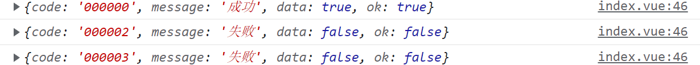

## 一、项目环境配置

以下是项目开发课程步骤及简单笔记


### 1、nvm 管理 node.js 版本

`nvm list`  `nvm use`  `nvm install` `nvm unistall`


### 2、`vue-router4` 使用方法在文档


### 3、vue3 模板

```vue
<script setup lang="ts">
</script>

<template>
</template>

<style scoped>
</style>
```


### 4、ElementPlus 按需引入

下载依赖：

`npm install element-plus --save`

`npm install -D unplugin-vue-components unplugin-auto-import`


vite.config.ts

```ts
...
import AutoImport from 'unplugin-auto-import/vite'
import Components from 'unplugin-vue-components/vite'
import { ElementPlusResolver } from 'unplugin-vue-components/resolvers'

plugins: [
    vue(),
    AutoImport({
        resolvers: [ElementPlusResolver()],
    }),
    Components({
        resolvers: [ElementPlusResolver()],
    }),
],
...
```


main.ts

```js
import ElementPlus from 'element-plus'
import 'element-plus/dist/index.css'

app.use(ElementPlus)
```


官方文档：https://element-plus.gitee.io/zh-CN/component/button.html

查看官方文档，基础组件中直接使用即可，反馈组件需要更复杂的引入方式


### 5、ElementPlus - Message 全局生效

在 main.ts 中配置

```ts
// 全局生效 ElementPlus - Message
import { ElMessage } from 'element-plus'
app.config.globalProperties.$message = ElMessage
```


组件中使用

```ts
import { h,getCurrentInstance } from 'vue'
const { proxy }: any = getCurrentInstance()

// proxy.$message() 等效于 ElMessage()
```

> 感觉更麻烦了...


### 6、配置 Eslint

`npm i eslint`

`npx eslint --init`


最后配置选项按照这个


### 7、sass 的使用方法

sass 帮助我们集中式管理 css 样式

下载依赖：`npm i sass -D`  注意是 SASS ！！！


使用文档：https://blog.csdn.net/weixin_67745264/article/details/125141904

特性：index.scss

```scss
// 定义变量
$red: red;

// 定义函数（css 集中样式）
@mixin background-black {
    background-color: black;
}

// 函数还可以传参！ 如果不传就是绿色
@mixin turn-red($c: green) {
    color: $c;
}

@include turn-red(red) // 传了就变成红色！
```


组件中使用

```vue
<style lang="scss" scoped>
@import "@/assets/scss/app/index.scss";

div {
    width: 100px;
    height: 200px;
    color: $red;
    @include background-black;
}   
</style>
```


**将某个 scss 文件注册为全局**

在 `assets` 下新建 `variable.scss` ，里面存放项目全局样式

在 `vite.config.ts` 中添加配置

```ts
// 配置 scss 入口文件
css: {
    preprocessorOptions: {
        scss: {
            additionalData: `@import "@/assets/scss/variable.scss";`
        }
    }
},
```

> 之后其他 scss 文件就不用引入 variable.scss 了


### 8、对 axios 进行 ts 封装

- 在 untils 下新建 `http.ts` ，下面是封装模板

```ts
import axios, { AxiosRequestConfig, AxiosResponse } from 'axios'

const defaultConfig = {
    timeout: 5000,
    // baseURL: import.meta.env.PROD ? 'http://110.42.184.111' : 'http://localhost:3000/release'
    // baseURL: '/api'
}

// TS 封装
class Http {
    constructor() {
        // 实例化请求响应拦截
        this.httpInterceptorsRequest()
        this.httpInterceptorsResponse()
    }

    private static axiosInstance = axios.create(defaultConfig)

    // 请求拦截 config 为一个 axios 请求
    private httpInterceptorsRequest() {
        Http.axiosInstance.interceptors.request.use((config: AxiosRequestConfig) => {
            // 发送请求前可以做的事


            return config
        }, err => {
            return Promise.reject(err)
        })
    }

    // 响应拦截 response 为一个 axios 响应
    private httpInterceptorsResponse() {
        Http.axiosInstance.interceptors.response.use((response: AxiosResponse) => {
            // 响应前可以做的事

            return response
        }, err => {
            
            
            return Promise.reject(err)
        })
    }


    // 封装 get/post 请求函数
    public httpRequestGet<T>(url: string, params: AxiosRequestConfig): Promise<T> {
        return Http.axiosInstance.get(url, params).then(res => res.data).catch()
    }

    public httpRequestPost<T>(url: string, params: AxiosRequestConfig): Promise<T> {
        return Http.axiosInstance.post(url, params).then(res => res.data).catch()
    }
}

// 导出 http 实例
export const http = new Http()
```


- 在 `api` 文件夹下新建 `index.js` 专门存放发送请求的接口函数 

```ts
// 请求函数参数：url、参数或参数对象

import { http } from '@/utils/http'

// 真实接口
export const reqgetCategoryList = function () {
    return http.httpRequestGet(`http://gmall-h5-api.atguigu.cn/api/product/getBaseCategoryList`,{});
}
```

> 接口函数返回一个 promise 对象，分为成功态和失败态，需要 `async/await` 函数接收


- 组件中调用接口

```ts
import { reqgetCategoryList } from '@/api/index'

async function getData() {
    let result = await reqgetCategoryList();

    console.log(result);
}
```


### 9、ElementPlus 配置国际化

直接参考文档，很简单的。就是中英文交换

https://element-plus.gitee.io/zh-CN/guide/i18n.html


- 在 main.ts 中配置默认语言

```ts
// ElementPlus
import ElementPlus from 'element-plus'
import 'element-plus/dist/index.css'
import zhCn from 'element-plus/dist/locale/zh-cn.mjs'
app.use(ElementPlus, {
    locale: zhCn, // 默认中文语言
})
```


- 在 app.vue 中配置语言 用到 `el-config-provider` 通过修改 `locale`

```vue
<script setup lang="ts">
import en from 'element-plus/lib/locale/lang/en'
import zhCn from 'element-plus/lib/locale/lang/zh-cn'
import { ref } from 'vue';

const locale = ref(zhCn)

function changeLan(lan: any) {
    if(lan == '中文') locale.value = zhCn
    if(lan == '英文') locale.value = en
}

const value = ref(new Date())
</script>

<template>
    <el-config-provider :locale="locale">
        <button @click="changeLan('中文')">中文</button>
        <button @click="changeLan('英文')">英文</button>
        <el-calendar v-model="value" />
    </el-config-provider>
</template>
```


### 10、实现网站全局国际化

下载依赖：`npm install vue-i18n@next`


**在 src 下新建 `language `文件夹**

新建 `i18n.ts` 、`zn.ts`、`en.ts`

```ts
import { createI18n } from 'vue-i18n'
import zh from './zh'
import en from './en'

// 返回一个语言配置
const i18n = createI18n({
    legacy: false, // 这个不能缺！不然
    locale: 'zh', // 默认语言
    messages: {
        zh,
        en
    }
})

export default i18n
```

```ts
// zn.ts

export default {
    message: {
        name: '陈'
        sex: '男'
    }
}
```

```ts
// en.ts

export default {
    message: {
        name: 'cocoon'
        sex: '女'
    }
}
```


**配置 `main.ts`** 

```ts
// 语言配置
import i18n from '@/language/i18n'
app.use(i18n)
```


**组件中使用**

```vue
<script setup lang="ts">
import { useI18n } from 'vue-i18n'

const { t, locale } = useI18n()

// 改变语言
function changeLan(lan: string) {
    locale.value = lan
}

</script>

<template>
    <button @click="changeLan('zh')">中文</button>
    <button @click="changeLan('en')">英文</button>

    <h1>{{ t('header.orders') }}</h1>
</template>
```


### 11、IndexedDB 数据存储方案

- 前言：IndexedDB 是一种底层 API ，用于在客户端存储大量的结构化数据，该 API 使用索引实现对数据的高性能搜索。 IndexedDB 是一个事务型数据库系统，也是一个基于 JavaScript 的面向对象数据库，它提供了类似数据库风格的数据储存和使用方式，**我们只需要指定数据库模式，打开与数据库的连接，然后检索和更新一系列事务**


- 目的：当我们进行一些较大的SPA页面开发时，我们会需要进行一些数据的本地存储。当数据量不大时，我们可以通过 `SessionStorage` 或者 `LocalStorage` 来进行存储，但是当数据量较大，或符合一定的规范时，我们可以使用数据库来进行数据的存储。


#### 11.1 基本概念和 API

数据库：存储数据的地方，每个域名可以创建多个数据库

对象仓库：也就是 `objectStore` ，每个数据库包含若干个对象仓库

索引：**可以为对象仓库中的属性创建对应的索引**，并且根据索引来查询数据，**一般索引名称和索引属性一致**

事务：数据库里的**增删改查操作都是通过事务（ transaction ）来完成**，作用于 `this.db`

数据记录：每一条数据都是一条记录，有对应的 key 、 value 、主键、索引等属性


推荐文档：https://blog.csdn.net/imagine_tion/article/details/115000245


**基本步骤：1、创建数据库连接 2、创建 objectStore 3、创建一些索引 4、通过事务来进行数据库操作**


#### 11.2 数据库与对象仓库的创建

`onupgradeneeded`：只有首次调用 `openStore` 时，才会调用。内部用来创建所有的对象仓库


在 `utils` 文件夹下新建 `indexedDB.ts`

```ts
export default class IndexedDB {
    private dbName: string
    private db: any // 数据库实例

    constructor(dbName: string) {
        this.dbName = dbName
    }

    // 打开数据库 + 对象仓库（参数：对象仓库数组、主键名、索引数组） 
    openStore(stores: Array<string>, keyPath: string, indexs?: Array<string>) {

        // 参数：名称、版本号（不可回退）
        let request = window.indexedDB.open(this.dbName, 2) 

        return new Promise((resolve, reject) => {
            // 数据库打开成功的回调
            request.onsuccess = (e) => {
                // 将 this.db 赋值数据库实例
                this.db = e.target.result

                // 返回成功态
                resolve(true)
            }

            // 数据库打开失败的回调
            request.onerror = (e) => {
                console.log('数据库打开失败')

                // 返回失败态
                reject(false)
            }

            // 数据库更新成功的回调（第一次打开数据库才会执行！）
            request.onupgradeneeded = function (e) {
                const { result } = e.target

                // 创建所有的对象仓库
                stores.map((storeName) => {
                    const store = result.createObjectStore(storeName, {
                        autoIncrement: true, keyPath
                    })

                    // 创建该对象仓库属性的索引
                    if (indexs && indexs.length > 0) {
                        indexs.map(function (i: string) {
                            store.createIndex(i, i, { unique: true })
                        })
                    }

                    // 对象仓库创建成功的回调
                    store.transaction.oncomplete = function (e) {
                        // console.log(`${storeName}仓库创建成功`);
                    }
                })

                resolve(true)
            }

        })        
    }
}
```


**实例化数据库在实际使用中讲到**


单独理解一下：`createIndex`能够给当前的存储空间设置一个索引。它接受三个参数

1. 第一个参数，索引的名称。
2. 第二个参数，指定根据存储数据的哪一个属性来构建索引。
3. 第三个属性， options对象，其中属性`unique`的值为`true`表示不允许索引值相等。

```ts
// 创建该对象仓库属性的索引
if(indexs && indexs.length > 0) {
    indexs.map(function(i: string) {
        store.createIndex(i, i, { unique: false })
    })
}
```

> 目前还没理解有什么用...


#### 11.3 对象仓库增删改查操作

通过操作数据库实例 `this.db` 搭配其内部属性 **`transaction` 事务函数**

`indexedDB.ts` 中的类 `indexedDB` 里面添加这些函数


**1、增加、修改数据 put**

```ts
// 增加、修改单条数据
updateItem(storeName: string, data: any) {
    // 打开对象仓库
    const store = this.db.transaction([storeName], 'readwrite').objectStore(storeName)

    // 仓库写入数据 updateTime：使数据唯一化
    let request = store.put({
        ...data, updateTime: new Date().getTime()
    })

    return new Promise((resolve, reject) => {

        // 写入成功的回调
        request.onsuccess = function (e) {
            resolve(true)
        }

        // 写入失败的回调
        request.onerror = function (e) {
            reject(false)
        }

    })

}
```


在实例中增加、修改属性  **参数必须为一个对象！！**

```ts
// 增加属性
airbnDB.updateItem(storeName, {name: 'cocoon', age: 18})

// 修改属性（通过主键修改）
airbnDB.updateItem(storeName, {id: 1, name: 'czy', age: 21})
```

> 主键（id）也会按递增顺序默认加入数据中！


**2、删除数据 delete**

```ts
// 删除单条数据
deleteItem(storeName: string, keyPath: string | number) {
    // 打开对象仓库
    const store = this.db.transaction([storeName], 'readwrite').objectStore(storeName)

    let request = store.delete(keyPath)

    return new Promise((resolve, reject) => {

        // 删除成功的回调
        request.onsuccess = function (e) {
            resolve(true)
        }

        // 删除失败的回调
        request.onerror = function (e) {
            reject(false)
        }

    })
}

```

```ts
airbnDB.deleteItem(storeName, 2)
```


**3、查询数据 get**

返回值用到了 `Promise` 对象，那么调用的时候必须用 `async/await`

```ts
// 查询所有数据
getList(storeName: string) {
    const store = this.db.transaction(storeName).objectStore(storeName)

    const request = store.getAll()

    // 返回异步函数结果
    return new Promise((resolve, reject) => {
        request.onsuccess = (event: any) => {
            console.log('查询所有数据成功')

            // 成功得到数据并返回
            resolve(event.target.result) // 成功态
        }

        request.onerror = (event: any) => {
            console.log('查询所有数据失败')

            // 返回失败结果
            reject(event) // 失败态
        }
    })
}

// 查询单条数据
getItem(storeName: string, key: number | string) {
    const store = this.db.transaction(storeName).objectStore(storeName)

    const request = store.get(key)

    // 返回异步函数结果
    return new Promise((resolve, reject) => {
        request.onsuccess = (event: any) => {
            console.log('查询某一条数据成功')

            // 成功得到数据并返回
            resolve(event.target.result) // 成功态
        }

        request.onerror = (event: any) => {
            console.log('查询某一条数据失败')

            // 返回失败结果
            reject(event) // 失败态
        }
    })
}
```


实际调用：

```ts
async function check(storeName: string) {
    let result = await airbnDB.getList(storeName)

    console.log(result); // 成功态获得数据  失败态为 false   
}
```


#### 11.4 indexedDB 的实际使用

- `db/index.ts`

当我们在 `src/utils/indexedDB` 中定义好了 `indexedDB` 类，我们就需要在 `src` 文件夹下新建 `db` 文件夹，用来导出数据库和对象仓库

```ts
import IndexedDB from '@/utils/indexedDB' 

// 数据库
export const airbnbDB = new IndexedDB('airbnbDB')

// 数据库对象仓库
export default ['language', 'user']
```


- 每次进入页面则初始化所有对象仓库

进入 `@/router/index.ts`

```ts
router.beforeEach(async function () {
    let result = await airbnbDB.openStore(stores, 'id')
    
    if(result) console.log('所有对象仓库初始化成功');
}) 
```


- 之后在外部函数中直接引入数据库即可

```ts
import { airbnbDB } from '@/db/index';
```


### 12、indexedDB 搭配 Mock 接口

前言：mock 接口的意思就是申请的数据不是从后台接口获取的，我们这里是从 indexedDB 里获取数据。

实现调用 mock 接口返回的结果和调用真实接口保持一致的效果，所以我们先要有后端接口返回数据的模板，然后让 mock 接口返回差不多的数据


解决的问题：

- 我们可以提前根据后端开发者提供的接口文档，来自行开发一套 Mock 接口，供前端项目来调用
- 需要调用什么接口，直接使用 IndexedDB 自行封装就行，不需要建立 http 连接、处理跨域、联调等等
- **等到自测或者发布测试阶段，直接将 Mock 接口替换成真实线上接口就可以了**
- 这样不仅提升了前后端开发效率，也使得前后端在某种程度上做到解耦


#### 12.1 解决 indexedDB 的异步问题

使用 indexedDB 获取的步骤：

**必须先打开数据库及仓库，才能再增删改查**，所以要解决 indexedDB 的异步问题。

解决方法：

将 indexedDB 类中的函数返回值都改成 promis 类型，暂时列举一个函数

- `openStore()`

```ts
openStore(storeName: string, keyPath: string, indexs?: Array<string>) {
    let request = window.indexedDB.open(this.dbName, 2) // 名称 版本号（不可回退）

    // 数据库更新成功的回调
    request.onupgradeneeded = ...

    // 返回一个异步 打开成功才能执行之后的代码
    return new Promise((resolve, reject) => {
        // 数据库打开成功的回调
        request.onsuccess = (e) => {
            console.log('数据库打开成功')

            // 赋值数据库实例
            this.db = e.target.result

            // 返回成功态
            resolve(true)
        }

        // 数据库打开失败的回调
        request.onerror = (e) => {
            console.log('数据库打开失败')

            // 返回失败态
            reject(false)
        }

    })        
}
```


#### 12.2 实现 mock 接口

以下是查询数据库所有数据 mock 接口函数的模板，首先确保有 `room` 这个对象仓库

而且实现了加载效果，利用 `ElLoading`

```ts
// 引入加载效果
import { ElLoading } from 'element-plus'

// 引入数据库
import { airbnbDB } from '@/db/index';


// mock 接口
export async function fetchMockData() {
    // 创建 mock 加载效果
    const loading = ElLoading.service({
        lock: true,
        text: 'Loading',
        background: 'rgba(255, 255, 255, 0.7)',
    })

    // 再查询所有数据库数据
    const result = await airbnDB.getList('room')

    // 加载结束
    setTimeout(() => { loading.close() }, 1000)

    // 返回对象结果
    if(result) {
        return { code: '200', message: '成功', data: result, ok: true }
    } else {
        return { code: '204', message: '失败', data: false, ok: false }
    }
}
```


`ElLoading`：https://element-plus.gitee.io/zh-CN/component/loading.html


#### 12.3 真实/mock 数据对比

在组件中调用两个接口函数，并打印结果

```ts
import { reqgetCategoryList, fetchMockData } from '@/api/index'

async function getRealData() {
    let result = await reqgetCategoryList();
    console.log('真实数据');
    console.log(result);
}

async function getMockData() {
    let result = await fetchMockData()
    console.log('mock数据');
    console.log(result);
}
```


### 13、SSR/CSR以及同构渲染的区别

**（一） SSR （传统服务端渲染）**

传统的服务端渲染有： asp 、 jsp 、 ejs 等，服务端语言往往通过这些模板引擎将数据和 dom 在服务端渲染完成，返回一个完整的静态 html 页面给客户端，由客户端直接显示

原理：

- 客户端发送 http 请求
- 服务端响应 http 请求，返回拼接好的 html 字符串给客户端
- 客户端渲染 html

缺点：前后端分离，不好维护，用户体验不佳，需要重新加载页面，服务端压力大


**（二）CSR（客户端渲染）**

在现代化的前端项目中，客户端渲染的代表性技术栈是 vue 、 react 、 angular ，我们常常使用它们来构建客户端单页或者多页应用程序。**以 SPA 构建程序为例**，在浏览器端首先渲染的是**一套空的 html** ，**通过 JS 直接进行页面的渲染和路由跳转等操作**，所有的数据通过 ajax 请求从服务器获取后，在进行客户端的拼装和展示

原理：

- 客户端发起 http 请求
- 服务端响应 http 请求，**返回一个空的 html 文件**
- 客户端初始化时加载必须的 js 文件，请求接口
- 将生成的 dom 插入到 html 中

**缺点：首屏加载慢，不利于 SEO**


**（三）同构（现代服务端渲染）**

 Vue 、 React + SSR 方案实际上就是同构渲染，**我们现在讲的服务端渲染概念**，是指在前端范畴或者说在 vue 、 react 等单页面技术栈范畴内，基于 Node.js server 运行环境的服务端渲染方案，**通过在 Node . js 中运行相同应用程序的前端框架**（例如 React 、 Vue 等），将其预渲染成 HTML ，最后在客户端进行注水化处理。

简单来讲，就是应用程序的大部分代码在服务器（Node 服务端）和客户端上运行，这就是所谓的现代服务端渲染

原理：

- 客户端发起 http 请求
- 服务端渲染把 Vue 实例转换成了静态的 html 发送给客户端（CSR则是空的 html）
- 客户端渲染是需要把事件、响应式特性等 Vue 的特性都绑回去

缺点：服务器压力大，涉及构建设置和部署的更多要求，一些三方库可能需要特殊处理

优点：首屏速度快，前后端分离，利于 SEO ，有一些现成框架：Nuxt.js、Next.js


### 14、Nuxt3 入门尝鲜

**SPA应用**：也就是单页应用，这些多是在客户端的应用，不利于进行[SEO优化](https://so.csdn.net/so/search?q=SEO优化&spm=1001.2101.3001.7020)（搜索引擎优化）。

**SSR应用**：在服务端进行渲染，渲染完成后返回给客户端，每个页面有独立的URL，对SEO友好。

Nuxt3 是基于 Vue3 发布的 SSR 框架，致力于将 SPA 应用转化为 SSR 应用（现代服务端渲染）


参考文档：https://blog.csdn.net/zheng_jia_jun/article/details/125793720


## 二、实际功能开发

### 1、ElementPlus 样式修改问题

- 修改 `.el-sub-menu__title` 样式不生效：必须去掉 `style` 中的 `scoped`


### 2、defineEmits 实现父子组件通信

- 父组件绑定事件：`@increase="handleIncrease"`

- 父组件回调函数：`const handleIncrease = (num: number) => {}`
- 子组件定义 `emit`：

```ts
// ts 专有
const emit= defineEmits<{
    (e: 'increase', num: number): void
}>()
```

- 子组件调用 `emit`

```ts
emits('increase', 1);
```


父组件

```vue
<template>
  <section class="parent">
    <childVue :num="nums" @increase="handleIncrease"></childVue>
  </section>
</template>

<script setup>
  import childVue from './child.vue';
  import { ref } from 'vue';
  const nums = ref(0);
    
  // 回调函数
  const handleIncrease = (num: number) => {
    nums.value += num;
  };
</script>
```


子组件

```vue
<template>
  <section class="box" @click="handelClick">{{ num }}</section>
</template>

<script setup>
// ts 专有
const emit= defineEmits<{
    (e: 'increase', num: number): void
}>()
            
const handelClick = () => {
    emits('increase', 1);
};
</script>
```


### 3、实现切换语言功能

这个是 mock 接口功能实战，就是在组件中发送请求函数；比如申请修改语言，后端返回修改成功或者失败的对象结果。成功的话前端才能修改语言，失败则不能修改


#### 3.1 编写 mock 接口

由此导出两个接口：

`saveLanguageApi(language: any)`：在数据库中保存当前语言


`fetchLanguageApi()`：返回数据库中当前语言接口


- 实现 mock 接口

```ts
// 修改当前语言包
export async function saveLanguageApi(language: any) {
    // 创建 mock 加载效果
    const loading = ElLoading.service({
        lock: true,
        text: 'Loading',
        background: 'rgba(255, 255, 255, 0.7)',
    })

    // 首先打开数据库及对象仓库
    await airbnbDB.openStore('language', 'id')

    // 再更新仓库中的语言属性（id = 1）
    let result = await airbnbDB.updateItem('language', { id: 1, language })

    if (result) {

        // 加载结束
        setTimeout(() => { loading.close() }, 500)

        return { code: '200', message: '成功', data: '切换语言成功', ok: true }
    } else {

        // 加载结束
        setTimeout(() => { loading.close() }, 500)

        return { code: '204', message: '失败', data: '切换语言失败', ok: false }
    }
}

// 查询当前语言包
export async function fetchLanguageApi() {
    // 创建 mock 加载效果
    const loading = ElLoading.service({
        lock: true,
        text: 'Loading',
        background: 'rgba(255, 255, 255, 0.7)',
    })

    // 首先打开数据库及对象仓库
    await airbnbDB.openStore('language', 'id')


    // 再查询仓库中的语言属性（id = 1）
    let result = await airbnbDB.getItem('language', 1)

    // 加载结束
    setTimeout(() => { loading.close() }, 200)

    if (result) {
        return { code: '200', message: '成功', data: result, ok: true }
    } else {
        return { code: '204', message: '失败', data: false, ok: false }
    }
}
```


#### 3.2 组件中内实例调用

`locale`：el 组件语言   `localeI18n`：i18n 全局语言

**需要导入**

```ts
import { useI18n } from 'vue-i18n'
import { reactive, ref } from 'vue'
import zhCn from 'element-plus/lib/locale/lang/zh-cn'
import en from 'element-plus/lib/locale/lang/en'
import { fetchLanguageApi, saveLanguageApi } from '@/api/index'
import { ElMessage } from 'element-plus'
```


**页面首次加载要查询当前语言**

```ts
// 全局语言
const { t, locale: localeI18n } = useI18n()

// 首次加载语言包 locale: el 语言包  localeI18n: 全局语言包
const locale = ref(zhCn)
async function getLocale() {
    let result: any = await fetchLanguageApi()

    if (result.code == 200 && result.data.language == 'en') {
        locale.value = en
        localeI18n.value = 'en'
    }
}
getLocale()
```


**切换语言函数**

```ts
// 触发函数：点击一个按钮，进行来回切换

const changeLang = async function () {
    let lang: any = await fetchLanguageApi()
    
    // 当页面为英文时
    if (lang.data.language == 'en') {
        let result: any = await saveLanguageApi('zh')
        

        if (result.code = 200) {
            locale.value = zhCn
            localeI18n.value = 'zh'

            // 发送消息
            ElMessage({
                message: result.data,
                type: 'success',
                duration: 1000
            })
        } else {
            ElMessage.error(result.data)
        }
    }

    // 当页面为中文或者首次切换时
    if (lang.data.language == 'zh' || !lang.data) {
        let result: any = await saveLanguageApi('en')

        if (result.code = 200) {
            locale.value = en
            localeI18n.value = 'en'

            // 发送消息
            ElMessage({
                message: result.data,
                type: 'success',
                duration: 1000
            })
        } else {
            ElMessage.error(result.data)
        }
    }
}
```


**HTML 里面的配置**

```html
// el
<el-config-provider :locale="locale">
    // 切换按钮
    <div class="changeLang" @click="changeLang"></div>
    
    // 文本类型模板
    <a class="forgot">{{ t('login.question') }}</a>
    
</el-config-provider>
```


### 4、登录注册业务实现

- indexedDB 存储的用户数据样式


- 前端输入框要实现校验功能，并且反馈信息
- 使用 vuex 存储用户登录状态值


#### 4.1 实现三个 mock 接口

这个也是和数据库对接，来自己模拟用户的登录登出注册功能

```ts
// code 说明
// '000000': 操作成功
// '000001': 手机号已被注册  
// '000002': 密码不正确
// '000003': 手机号不正确  
// '000004': 其他异常  
// '000005': 登录过期

import { ElLoading } from 'element-plus'
import { airbnbDB } from '@/db/index';

// 对象仓库名
const storeName = 'user'
```


- 用户注册接口

```ts
export async function userSignApi(params: any) {
    // 创建 mock 加载效果
    const loading = ElLoading.service({
        lock: true,
        text: 'Loading',
        background: 'rgba(255, 255, 255, 0.7)',
    })


    // 获取仓库中所有的用户数组
    let usersData = await airbnbDB.getList(storeName)

    let hasMobile = false
    usersData.map((user) => {
        if(user.mobile == params.mobile) hasMobile = true
    })


    if (hasMobile) {
        // 加载结束
        setTimeout(() => { loading.close() }, 500)

        return { code: '000001', message: '失败', data: false, ok: false }
    }

    // 将用户加入数据库
    Object.assign(params, { status: 0, token: '' })
    let result = await airbnbDB.updateItem(storeName, params)

    // 加载结束
    setTimeout(() => { loading.close() }, 500)

    if (result) {
        return { code: '000000', message: '成功', data: result, ok: true }
    } else {
        return { code: '000004', message: '失败', data: false, ok: false }
    }

}
```

```ts
// 简单测试

let result = await userSignApi({ mobile: '18579152301', password: '123' })
```


- 用户登录

```ts
export async function usersLoginApi(params: any) {
    // 创建 mock 加载效果
    const loading = ElLoading.service({
        lock: true,
        text: 'Loading',
        background: 'rgba(255, 255, 255, 0.7)',
    })


    // 获取仓库中所有的用户数组
    let usersData = await airbnbDB.getList(storeName)
    
    // 如果没有用户
    if (!usersData) {
        // 加载结束
        setTimeout(() => { loading.close() }, 500)
        return { code: '000003', message: '失败', data: false, ok: false }
    }


    let correct = false
    let codeData = '000003' // 默认手机号不正确

    // 校验手机号和密码
    usersData?.map(async function(user) {
        if (user.mobile == params.mobile && user.password == params.password) {
            correct = true
            codeData = '000000' // 成功

            // 成功后设置该用户 token 并更新状态
            const token = (new Date()).getTime() + ''
            const obj = { status: 1, token, id: user.id }
            localStorage.setItem('usertoken', token)
            Object.assign(params, obj)

            // 更新数据库中用户数据
            await airbnbDB.updateItem(storeName, params)
        }

        if (user.mobile == params.mobile && user.password != params.password) {
            codeData = '000002' // 密码不正确
        }
    })

    // 加载结束
    setTimeout(() => { loading.close() }, 500)

    if(correct) {
        return { code: codeData, message: '成功', data: true, ok: true }
    } else {
        return { code: codeData, message: '失败', data: false, ok: false }
    }

}
```

```ts
// 简单测试

let result = await usersLoginApi({ mobile: '18579152301', password: '123' })
```




- 用户登出

```ts
export async function userLogoutApi() {
    // 创建 mock 加载效果
    const loading = ElLoading.service({
        lock: true,
        text: 'Loading',
        background: 'rgba(255, 255, 255, 0.7)',
    })

    // 获取仓库中所有的用户数组
    let usersData = await airbnbDB.getList(storeName)

    // 获取当前登录用户的 usertoken
    const token = localStorage.getItem('usertoken')
    let hasToken = false

    // 更新当前用户状态
    usersData.map(async function (user) {
        if (user.token == token) {
            hasToken = true
            
            localStorage.removeItem('usertoken');
            Object.assign(user, { status: 0, token: '' })

            // 更新数据库中用户数据
            await airbnbDB.updateItem(storeName, user)
        }
    })

    // 加载结束
    setTimeout(() => { loading.close() }, 500)

    if(hasToken) {
        return { code: '000000', message: '成功', data: true, ok: true }
    } else {
        return { code: '000004', message: '失败', data: false, ok: false }
    }

} 
```

```ts
// 简单测试

let result = await userLogoutApi()
```


#### 4.2 el-form 的使用方法

- **HTML 部分**

```html
<el-form
    status-icon
    ref="ruleFormRef"
    :rules="rules"
    :model="formData"
    :label-position="labelPosition"
>
```

`ref` 属性：让 ruleFormRef 变量指代整个表单


`rules` 属性：表单校验规则 rules


`model` 属性：表单数据对象 formData


`label-position` 属性：label 标签位置


```html
<!-- 手机号 -->
<el-form-item :label="t('login.mobile')" prop="mobile">
    <el-input 
        :placeholder="t('login.placeMobile')"
        v-model="formData.mobile" 
    />
</el-form-item>

<!-- 按钮 -->
<el-form-item>
    <el-button 
        class="submit" type="primary" @click="submitForm(ruleFormRef)" 
        v-if="loginSignCheck == 'login'" 
    >
        {{ t('login.loginBtn') }}
    </el-button>
</el-form-item>
```


`label` 属性：label 标签文字


`prop` 属性：表单校验规则 rules.mobile


`v-model` 属性：表单数据对象 formData.mobile


`submitForm(ruleFormRef)`：点击按钮函数，传入 el-from 表单变量


- **数据部分**

```ts
// 表单数据
const labelPosition = ref('top')
const ruleFormRef = ref<FormInstance>() // 整个表单
const formData = reactive({
    mobile: '',
    password: '',
})


// 表单效验规则
const rules = reactive({
    mobile: [
        {
            min: 11,
            max: 11,
            required: true,
            pattern: /^1[34578]\d{9}$/,
            message: '',
            trigger: 'blur'
        }
    ],
    password: [
        {
            pattern: /^[\w]{6,16}$/, // 弱密码
            required: true,
            message: '',
            trigger: 'blur'
        }
    ]
})
```


- 函数校验部分

模板：`formEl`：el-from 表单变量   `valid`：校验成功返回 true

```ts
async function submitForm(formEl: FormInstance | undefined) {
    if (!formEl) return

    formEl.validate(async function(valid) {
        if(!valid) {
            ElMessage.error('请填入正确信息')
            return false
        }

    	...(校验成功之后的代码)
```


实例：

```ts
async function submitForm(formEl: FormInstance | undefined) {
    if (!formEl) return

    formEl.validate(async function(valid) {
        if(!valid) {
            ElMessage.error('请填入正确信息')
            return false
        }

        if (loginSignCheck.value == 'sign') {
            let result = await userSignApi(formData)

            if (result.code == '000001') ElMessage.error('手机号已被注册')
            if (result.code == '000004') ElMessage.error('注册失败')
            if (result.code == '000000') {
                ElMessage({
                    message: '注册成功',
                    type: 'success',
                    duration: 1000
                })
            }
        }
        
        if (loginSignCheck.value == 'login') {
            let result = await userLoginApi(formData)

            if (result.code == '000002') ElMessage.error('密码不正确')
            if (result.code == '000003') ElMessage.error('手机号不正确')
            if (result.code == '000004') ElMessage.error('登录失败')
            if (result.code == '000000') {
                // 将全局的 userStatus 设置为1
                store.commit('changeUserState', 1)

                ElMessage({
                    message: '登录成功',
                    type: 'success',
                    duration: 1000
                })

                // 跳转路由
                setTimeout(() => { router.replace({ name: 'home' }) }, 500)
            }
        }

    })
}
```

