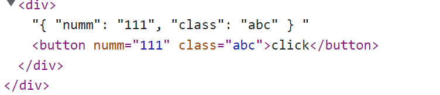

# 一、Vue3

2020年9月18日，Vue.js发布3.0版本，代号：One Piece（海贼王）


未用 `<script setup>` 语法糖：

需要定义组件，props，emits 等等，还要返回变量函数等等

```html
<script>
import { ref } from 'vue'

export default {
    name: 'Demo',

    components: [...],
    props: [...],
    emist: [...],

    async setup() {
        let name = ref('Demo');

        let result = await new Promise(function(resolve) {
            setTimeout(()=>{
                resolve({
                    name,
                });
            },2000)
        })

        return result;
    }
}
</script>
```


`<script setup> 语法糖` 模式：

内置 `defineprops、emts` 等方法，无需注册组件、注册`props、emits`等配置，函数都一样定义，支持 await

```vue
<script setup>
import { ref } from 'vue'
let name = ref('Demo');

let result = await new Promise(function(resolve) {
    setTimeout(()=>{
        resolve({
            name,
        });
    },2000)
})
</script>
```


## 1.1 性能的提升

- 打包大小减少**41%**
- 初次渲染快**55%**, 更新渲染快**133%**
- 内存减少**54%**


## 1.2 源码的升级

- 使用 `Proxy` 代替 `defineProperty` 实现响应式
- 重写虚拟`DOM`的实现和 `Tree-Shaking`


## 1.3 拥抱 TypeScript

- Vue3可以更好的支持`TypeScript`


## 1.4 新的特性

1. Composition API（组合API）
   - `setup`配置
   - `ref`与`reactive`
   - `watch`与`watchEffect`
   - `provide`与 `inject`
2. 新的内置组件
   - `Fragment `
   - `Teleport`
   - `Suspense`
3. 其他改变
   - 新的生命周期钩子
   - `data `选项应始终被声明为一个函数
   - 移除`keyCode`支持作为 `v-on` 的修饰符


# 二、创建一个Vue项目

## 2.1 使用 vue-cli 创建


官方文档：https://cli.vuejs.org/zh/guide/creating-a-project.html#vue-create

```bash
## 查看@vue/cli版本，确保@vue/cli版本在4.5.0以上
vue --version
## 安装或者升级你的@vue/cli
npm install -g @vue/cli
## 创建Vue项目，选择Vue3
vue create vue3_test
## 启动
cd vue_test
npm run serve
```


## 2.3 分析文件目录

**1、main.js**

Vue2项目的main.js

```javascript
import Vue from 'vue'
import App from './App.vue'

Vue.config.productionTip = false

new Vue({
  render: h => h(App),
}).$mount('#app')
```

我们再来看看Vue3项目中的main.js

```js
import { createApp } from 'vue'
import App from './App.vue'

createApp(App).mount('#app')
```

分析一下

```js
// 引入的不再是Vue构造函数了，引入的是一个名为createApp的工厂函数
import { createApp } from 'vue'
import App from './App.vue'

// 创建应用实例对象——app(类似于之前Vue2中的vm，但app比vm更“轻”)
const app = createApp(App)
console.log(app)
// 挂载
app.mount('#app')

// unmount：卸载
```


**2、App.vue**

我们再来看看组件

在 `template` 标签里可以没有根标签了

```html
<template>
	<!-- Vue3组件中的模板结构可以没有根标签 -->
	
	<HelloWorld msg="Welcome to Your Vue.js App"/>
</template>
```


# 三、Composition API

具体概念看看官方文档吧，学完后面的就理解了！

官方文档: https://v3.cn.vuejs.org/guide/composition-api-introduction.html


## 3.1 setup 配置

理解：

1. Vue3.0中一个新的配置项，**代替Vue2 的配置（data、methos、computed...）**
2. 组件中所用到的：数据、方法等等，均要配置在setup中。
3. setup是所有<strong style="color:#DD5145">Composition API（组合API）</strong><i style="color:gray;font-weight:bold">“ 表演的舞台 ”</i>。


简单使用（类似于 class 的定义！）

```js
setup() {
    // 定义非响应式变量
	let name = 'cocoon',
        
    // 定义函数
	function say() {
		console.log('hello')
    }
    
    // 记得 return
    return {name,say}
}
```


注意点：

1. 不要和Vue2.x配置（data、methos、computed...）**混用**！！
2. 在setup中<strong style="color:#DD5145">不能访问到</strong> Vue2.x 配置（data、methos、computed...）。
3. 如果组件不是一个异步组件，那么 setup 不能是一个 async 函数，且不能返回 promise 对象，否则会报错！


##  3.2 ref 函数

作用：setup 中定义的变量定义为响应式变量（**数据为简单类型**）


使用前必须：`  import { ref } from 'vue'`

```js
// 普通变量
let data = 'cocoon'

// 响应式变量（也称为引用对象）
let data = ref('cocoon')
```


响应式变量修改：`data.value = 'cocooonnn'` 

响应式变量 html 中引用：`{{data}}` 


简单实例

```vue
<template>
    <h1>{{name}}</h1>
    <button @click="ChangeName">dianwo</button>
</template>

<script>
    import { ref } from 'vue'
    
    export default {
        name: 'App',

        setup() {
            let name = ref('cocoon');

            function ChangeName() {
                name.value = 'nihao';
            }

            return {name,ChangeName};        
        }   

    }
</script>
```


当数据为对象类型型时（不推荐用 `ref`）

`people.value` ：利用 ```reactive```函数变成了 `Proxy` 实例对象

```js
setup() {
    let people = ref({
        type: 'obj',
        name: 'cocoon'
    })

    // 修改第二层数据
    function ChangeName() {
        people.value.name = 'nihao';
    }

    return {people,ChangeName};        
}   
```


HTML 中还是当作对象读取

```vue
<h1>{{people.name}}</h1>
```


**注意：**

- 创建了一个包含响应式数据的<strong style="color:#DD5145">引用对象（reference对象，简称ref对象）</strong>。

- 接收的数据可以是：基本类型、也可以是对象类型。
- 基本类型的数据：响应式依然是靠 ``Object.defineProperty()`` 的 ```get``` 与 ```set``` 完成的。
- 对象类型的数据：内部 <i style="color:gray;font-weight:bold">“ 求助 ”</i> 了Vue3.0中的一个新函数—— ```reactive```函数。


## 3.3 reactive函数

作用：setup 中定义的变量定义为响应式变量（**数据为复杂类型：对象、数组**）


使用前先引入：`import { reactive } from 'vue'`

```js
setup() {
    // 定义响应式对象
    let people = reactive({
        type: 'obj',
        name: 'cocoon'
    })
    
    let arr = reactive(['1','2','3'])

    // 修改属性
    function ChangeName() {
        people.name = 'neo';
        
        // 也可以新增属性、通过下标修改
        people.sex = 'man';
        arr[0] = '0';
    }

    return {people,ChangeName,};        
}   
```

```vue
<h1>{{people.name}}</h1>
```


**注意：**

- 语法：```const 代理对象 = reactive(源对象)``` 接收一个对象（或数组），返回一个代理对象（Proxy 的实例对象，简称 proxy 对象）

- reactive 定义的响应式数据是“深层次的”。

- 内部基于 ES6 的 Proxy 实现，通过代理对象操作源对象内部数据进行操作。

  

## 3.4 响应式原理

### 3.4.1 vue2 的响应式

- 实现原理（vue2、ref）：
    - 对象类型：通过 ```Object.defineProperty()``` 对属性的读取、修改进行**拦截（数据劫持）**。

    - 数组类型：通过重写更新数组的一系列方法来实现拦截。（对数组的变更方法进行了包裹）。

      ```js
      let p = {}
      
      // 捕获读取
      Object.defineProperty(p,'name',{
          configurable:true,
          get(){ //有人读取name时调用
              return person.name
          },
          set(value){ //有人修改name时调用
              console.log('有人修改了name属性，我发现了，我要去更新界面！')
              person.name = value
          }
      })
      
      // 捕获修改
      Object.defineProperty(p,'age',{
          get(){ //有人读取age时调用
              return person.age
          },
          set(value){ //有人修改age时调用
              console.log('有人修改了age属性，我发现了，我要去更新界面！')
              person.age = value
          }
      })
      
      ```
    
- 存在问题：
    - **新增属性、删除属性, 界面不会更新**
    - **直接通过下标修改数组, 界面不会自动更新**


https://www.bilibili.com/video/BV1Zy4y1K7SH?p=145&vd_source=efb9c3f27a68ec1730be5a5e4e050c4b


### 3.4.2 Vue3 的响应式

首先明确通过代理，不但要对源数据进行修改，还要捕获到其修改。


**实现原理（reactive）**：

- 通过 Proxy（代理）:  拦截对象中任意属性的变化, 包括：属性值的读写、属性的添加、属性的删除等。
- 通过Reflect（反射）:  对源对象的属性进行操作（这个 API 可以返回错误信息）。

```js
// 源数据
let person = {
    name:'张三',
    age:18
}

// Proxy（代理）
const p = new Proxy(person,{
    
    //有人读取p的某个属性时调用
    get(target,propName){
        console.log(`有人读取了p身上的${propName}属性`)
        
        // 普通操作：return target[propName]
        
        // Reflect 操作
        return Reflect.get(target,propName)
    },
    
    //有人修改p的某个属性或给p追加某个属性时调用
    set(target,propName,value){
        console.log(`有人修改了p身上的${propName}属性，我要去更新界面了！`)
        Reflect.set(target,propName,value)
    },
    
    //有人删除p的某个属性时调用
    deleteProperty(target,propName){
        console.log(`有人删除了p身上的${propName}属性，我要去更新界面了！`)
        return Reflect.deleteProperty(target,propName)
    }
})
```

> target：源数据  proName：某个属性  value：修改的值


MDN文档中描述的Proxy与Reflect：

- Proxy：https://developer.mozilla.org/zh-CN/docs/Web/JavaScript/Reference/Global_Objects/Proxy
- Reflect：https://developer.mozilla.org/zh-CN/docs/Web/JavaScript/Reference/Global_Objects/Reflect


https://www.bilibili.com/video/BV1Zy4y1K7SH?p=146&vd_source=efb9c3f27a68ec1730be5a5e4e050c4b


## 3.5 reactive/ref 对比

-  从定义数据角度对比：
    -  ref用来定义：<strong style="color:#DD5145">基本类型数据</strong>。
    -  reactive用来定义：<strong style="color:#DD5145">对象（或数组）类型数据</strong>。
    -  备注：ref也可以用来定义<strong style="color:#DD5145">对象（或数组）类型数据</strong>, 它内部会自动通过 ```reactive``` 转为<strong style="color:#DD5145">代理对象</strong>。
-  从原理角度对比：
    -  ref通过``Object.defineProperty()``的```get```与```set```来实现响应式（数据劫持）。
    -  reactive通过使用<strong style="color:#DD5145">Proxy</strong>来实现响应式（数据劫持）, 并通过<strong style="color:#DD5145">Reflect</strong>操作<strong style="color:orange">源对象</strong>内部的数据。
-  从使用角度对比：
    -  ref定义的数据：操作数据<strong style="color:#DD5145">需要</strong>```.value```，读取数据时模板中直接读取<strong style="color:#DD5145">不需要</strong>```.value```。
    -  reactive定义的数据：操作数据与读取数据：<strong style="color:#DD5145">均不需要</strong>```.value```。


## 3.6 setup 的两个注意点

### 3.6.1 setup 的执行时机

在 beforeCreate 之前执行一次，this 是 undefined。即在所有函数最开始执行


### 3.6.2 setup 的参数

- props

第一个参数为 props，指的是父组件传递的 props 参数。

```js
// 首先接收
props: ['msg'],
    
// setup
setup(props,context) {
    console.log(props,context);
}
```


- context

可以理解为上下文，内部包含 `emit`、`slots`、`attrs`

`attrs` : 值为对象，包含：组件外部传递过来，但没有在props配置中声明的属性, 相当于 ```this.$attrs```。

`slots` : 收到的插槽内容, 相当于 ```this.$slots```。

`emit` : 分发自定义事件的函数, 相当于 ```this.$emit```。


注意 `emit ` 最好提前接收，不然会警告

```vue
// 父组件
<Demo msg="abcd" @hello="show" />
```

```js
props: ['msg'],

emits: ['hello'],

setup(props,context) {
    context.emit('hello');
}
```


## 3.7 计算属性与监视

### 3.7.1 computed 函数

和 Vue2.x 中 computed 配置功能一致，计算属性同样由依赖项决定，必须在 **setup** 里面定义

同样可以实现响应式！！


先引入：`import { computed } from 'vue'`


简写形式（该变量只读）

```js
// 依赖项：person.firstName、person.lastName

let fullName = computed(()=>{
    return person.firstName + '-' + person.lastName
})
```


完整形式（读和写）

```js
// 修改依赖项以便修改该计算属性

let fullName = computed({
    get(){
        return person.firstName + '-' + person.lastName
    },
    
    set(value){
        const nameArr = value.split('-')
        person.firstName = nameArr[0]
        person.lastName = nameArr[1]
    }
})
```


### 3.7.2 watch 函数

和 vue2 配置及功能一致，必须在 **setup** 里面定义

先引入：`import { watch } from 'vue'`


下面有五种使用情况：

- 监视 ref 定义的响应式数据

```js
watch(sum,(newValue,oldValue)=>{
	console.log('sum变化了',newValue,oldValue)
},{ immediate:true })
```


- 监视多个 ref 定义的响应式数据

```js
// 一个一个写
watch(sum,(newValue,oldValue)=>{
	console.log('sum变化了',newValue,oldValue)
})

watch(msg,(newValue,oldValue)=>{
	console.log('msg变化了',newValue,oldValue)
})

// 整合成数组
watch([sum,msg],(newValue,oldValue)=>{
	console.log('sum或msg变化了',newValue,oldValue)
}) 
```


- 监视 reactive 定义的响应式数据

```js
watch(person,(newValue,oldValue)=>{
	console.log('person变化了',newValue,oldValue)
},{ immediate:true })
```

> 默认开启 deep 且无法关闭  oldValue 和 newValue 相等


- 监视响应式对象中的某个属性（重点）

```js
watch(() => person.job, (newValue,oldValue)=>{
	console.log('person的job变化了',newValue,oldValue)
},{ immediate:true, deep:true }) 
```

> 如果 person.job 为一个对象，那么需要开启 deep


### 3.7.3 watchEffect 函数

作用：不用指明监视哪个属性，**监视的回调中用到哪个属性，那就监视哪个属性**


watchEffect 有点像 computed，都有所谓的依赖项，**其回调函数初始化执行一次，依赖项发生变化也执行**

```js
// watchEffect 所指定的回调中用到的数据只要发生变化，则直接重新执行回调。

watchEffect(()=>{
    const x1 = sum.value
    const x2 = person.age
    console.log('watchEffect 配置的回调执行了')
})
```


## 3.8 生命周期钩子

这是 Vue3 生命周期图示：https://cn.vuejs.org/guide/essentials/lifecycle.html


将生命周期钩子作为**配置项**使用和 Vue2 方法一致， 但有有两个被更名
- ```beforeDestroy``` 改名为 ```beforeUnmount```
- ```destroyed``` 改名为 ```unmounted```


使用 Composition API 形式实现生命周期钩子：
- `beforeCreate`===>`setup()`
- `created`=======>`setup()`
- `beforeMount` ===>`onBeforeMount`
- `mounted`=======>`onMounted`
- `beforeUpdate`===>`onBeforeUpdate`
- `updated` =======>`onUpdated`
- `beforeUnmount` ==>`onBeforeUnmount`
- `unmounted` =====>`onUnmounted`


简单使用

```js
import {ref,onMounted...} from 'vue'

setup() {
    onMounted(()=>{
        console.log('---onMounted---')
    })
}
```


## 3.9 自定义 hook 函数

`hook`：一个文件夹，里面都是一些 JS 文件（文件名以 `user` 开头），文件中把 setup 函数中使用的 Composition API 进行了封装。


自定义 hook 的优势: 复用代码, 让 setup 中的逻辑更清楚易懂。


**通过实际案例更容易懂：**

APP.vue（没有用 hook 时）

```js
import {reactive,onMounted,onBeforeUnmount} from 'vue'

export default {
    name: 'App',

    setup() {
        let point = reactive({
            x:0,
            y:0
        })

        //实现鼠标打点相关的方法
        function savePoint(event){
            point.x = event.pageX
            point.y = event.pageY
            console.log(event.pageX,event.pageY)
        }

        //实现鼠标打点相关的生命周期钩子
        onMounted(()=>{
            window.addEventListener('click',savePoint)
        })

        onBeforeUnmount(()=>{
            window.removeEventListener('click',savePoint)
        })
    }   

}
```


在 `src` 中新建 `hook` 文件夹，新建 `usePoint.js`

usePoint.js

```js
// 在这里封装 Composition API

import {reactive,onMounted,onBeforeUnmount} from 'vue'

export default function (){
	//实现鼠标“打点”相关的数据
	let point = reactive({
		x:0,
		y:0
	})

	//实现鼠标“打点”相关的方法
	function savePoint(event){
		point.x = event.pageX
		point.y = event.pageY
		console.log(event.pageX,event.pageY)
	}

	//实现鼠标“打点”相关的生命周期钩子
	onMounted(()=>{
		window.addEventListener('click',savePoint)
	})

	onBeforeUnmount(()=>{
		window.removeEventListener('click',savePoint)
	})

    // 返回一个点的坐标
	return point
}

```


**APP.vue（使用 hook）**

```js
// 引入 hook 函数
import usePoint from '../hooks/usePoint'

export default {
    name: 'App',
    
    setup(){
        // 得到鼠标坐标
        let point = usePoint()

        return { point }
    }
}
```


## 3.10 toRef/toRefs

作用：将**响应式对象中的某个属性简写**（`person.name` => `name`）类似于通过`computed` 简写属性

实质是创建一个 ref 对象，其 value 值指向该对象中的某个属性。


先引入：`  import { toRef,toRefs } from 'vue'` 


使用方法：

```js
setup(){
    let person = reactive({
        name: '张三',
        age: 18,
        job: {
            j1: {
                salary: 20
            }
        }
    })

    return {
        person,
        name: toRef(person,'name'),
        age: toRef(person,'age'),
        salary: toRef(person.job.j1,'salary'),
    }
}

```

```html
// 普通读取
<h2>姓名：{{person.name}}</h2>
<h2>薪资：{{person.job.j1.salary}}K</h2>

// 简写读取
<h2>姓名：{{name}}</h2>
<h2>薪资：{{salary}}K</h2>
```


`toRefs`：传入一个响应式对象，将其内部所有属性 `toRef`

```js
setup(){
    let person = reactive({
        name: '张三',
        age: 18,
    })

    return {
       	// 这是一次性的
        ...toRefs(person)
    }
}
```

```html
<h2>姓名：{{name}}</h2>
<h2>年龄：{{age}}</h2>
```

> `...toRefs(person)`：如果 person 后面添加了其他属性则无法把新添加的属性也 `toRef`


# 四、其它 Composition API


## 4.1 shallowReactive/shallowRef

- shallowReactive：只处理对象**最外层**属性的响应式（浅响应式）。


- shallowRef：只处理基本数据类型的响应式, **不进行对象的响应式处理**。


- 什么时候使用?
    -  如果有一个对象数据，结构比较深, 但变化时只是外层属性变化 ===> shallowReactive。
    -  如果有一个对象数据，后续功能不会修改该对象中的属性，而是生新的对象来替换 ===> shallowRef。


##  4,2 readonly/shallowReadonly

`readonly`：让一个响应式数据变为只读的，当修改数据时会发出警告

```js
let person = reactive({
    name:'张三',
    age:18,
    job:{
        j1:{
            salary:20
        }
    }
})

// 传入一个响应式数据
person = readonly(person)
```


> 使用场景：不希望数据（尤其是这个数据是来自与其他组件时）被修改时


`shallowReadonly`：让一个响应式数据变为只读的**（只影响第一层）**


## 4.3 toRaw/markRaw

- `toRaw`
    - 作用：将一个由 ```reactive``` 生成的**响应式对象转为普通对象**（源对象），使用的较少

```js
let person = reactive({
    name:'张三',
    age:18,
})

function showRawPerson(){
    const p = toRaw(person)
    console.log(p)
}
```


- `markRaw`
    - 作用：标记一个源对象，使其**永远不会再成为响应式对象**。并且最好不要去修改它
    - 应用场景:
        1. 有些值不应被设置为响应式的，例如**复杂的第三方类库**等。
        2. 当渲染不需要变化的数据源时，跳过响应式转换可以**提高性能**。

```js
function addCar() {
    let  car = {
        price: 2000,
        name: 'max'
    }

    // 这里会自动把 car 变成响应式数据
    person.car = car
    
    // 设置为非响应式
    person.car = markRaw(car);
}
```


## 4.4 customRef

作用：创建一个自定义的 `ref`，并对其依赖项跟踪和更新触发进行显式控制。

`customRef`：创建 `myRef` 函数的地基


`track`：get 函数中必须调用这个，否则只会初始化执行一次


`trigger`：set 函数中调用，告诉 Vue 去更新界面


**实现基础的 `ref` 效果**

```vue
<template>
	<input type="text" v-model="keyword">
	<h3>{{keyword}}</h3>
</template>

<script>
	import { customRef } from 'vue'
	export default {
		name: 'Demo',

		setup(){
			// 基础 myRef 模板
			function myRef(value) {
				return customRef((track,trigger) => {
					return {
						get() {
                            // 告诉 Vue 这个 value 值是需要被追踪的
							track() 

							return value
						},

						set(newValue) {
                            value = newValue

                            // 告诉 Vue 去更新界面
                            trigger() 
						}
					}
				})
			}
            
            // myRef 实现 ref 效果
			let keyword = myRef('hello')
            
			return {
				keyword
			}
		}
	}
</script>
```


**实现防抖效果**（1s 之内只能修改数据一次，并以最后一次修改有效）

```vue
<template>
	<input type="text" v-model="keyword">
	<h3>{{keyword}}</h3>
</template>

<script>
	import {ref,customRef} from 'vue'
	export default {
		name:'Demo',
		setup(){
			// let keyword = ref('hello') //使用Vue准备好的内置ref
			//自定义一个myRef
			function myRef(value,delay){
				let timer
				//通过customRef去实现自定义
				return customRef((track,trigger)=>{
					return{
						get(){
							track() //告诉Vue这个value值是需要被“追踪”的
							return value
						},
						set(newValue){
							clearTimeout(timer)
							timer = setTimeout(()=>{
								value = newValue
								trigger() //告诉Vue去更新界面
							},delay)
						}
					}
				})
			}
			let keyword = myRef('hello',500) //使用程序员自定义的ref
			return {
				keyword
			}
		}
	}
</script>
```


## 4.5 provide/inject


- 作用：实现<strong style="color:#DD5145">祖组件与其后代组件间</strong>通信

- 套路：父组件有一个 `provide` 选项来提供数据，后代组件有一个 `inject` 选项来开始使用这些数据

- 具体写法：

    1. 祖组件中：

       ```js
       setup(){
           ......
           // 传递数据
           let car = reactive({name:'奔驰',price:'40万'})
           provide('car',car)
           ......
       }
       ```
    
    2. 后代组件中：
    
       ```js
       setup(props,context){
           ......
           // 接收数据
           const car = inject('car')
           return {car}
           ......
       }
       ```


## 4.6 响应式数据的判断

- isRef: 检查一个值是否为一个 ref 对象
- isReactive: 检查一个对象是否是由 `reactive` 创建的响应式代理
- isReadonly: 检查一个对象是否是由 `readonly` 创建的只读代理
- isProxy: 检查一个对象是否是由 `reactive` 或者 `readonly` 方法创建的代理  


# 六、新的组件与变化

## 6.1 Fragment 标签

- 在Vue2中: 组件必须有一个根标签
- 在Vue3中: 组件可以没有根标签, 内部会将多个标签包含在一个 `Fragment` 虚拟元素中
- 好处: 减少标签层级, 减小内存占用


## 6.2 Teleport 标签

什么是Teleport？—— `Teleport` 是一种能够将我们的<strong style="color:#DD5145">组件html结构</strong>移动到**指定位置**的技术。

指定位置填的是 css 选择器


案例：将 `Teleport` 内部的 HTML 结构放到 body 里面

```vue
<teleport to="body">
	<div v-if="isShow" class="mask">
		<div class="dialog">
			<h3>我是一个弹窗</h3>
			<button @click="isShow = false">关闭弹窗</button>
		</div>
	</div>
</teleport>
```


## 6.3 异步组件和Suspense

首先了解一下异步引入组件，等待异步组件时渲染一些额外内容，让应用有更好的用户体验

```js
import { defineAsyncComponent } from 'vue'
const Child = defineAsyncComponent(() => import('./components/Child.vue'))
```

这样引入组件后，这个组件会异步加载，不会全局加载

**前提条件是异步组件中渲染的变量为异步变量**


再使用 ```Suspense ``` 包裹异步组件实现加载效果（template 里面允许有一个 div）

```vue
<Suspense>
    <template v-slot:default>
        <Demo/>
    </template>
    <template v-slot:fallback>
        <h3>加载中.....</h3>
    </template>
</Suspense>
```


**async setup**

异步的条件：1、网速不好，加载变慢  2、**组件的 setup 返回一个 promise 对象的结果**

将 setup 添加前缀 async，返回 Promise 对象处理的结果


**下面的 name 就是一个异步变量**


App.vue

```vue
<template>
    <Suspense>
        <template v-slot:default>
            <Demo/>
        </template>
        <template v-slot:fallback>
            <h3>加载中.....</h3>
        </template>
    </Suspense>
</template>

<script>
    import { defineAsyncComponent } from 'vue'
    const Demo = defineAsyncComponent(() => import('./components/Demo.vue'))

    export default {
        name: 'App',

        components: { Demo },
    }
</script>
```


Demo.vue

```vue
<template>
    <h1>{{name}}</h1>
</template>

<script>
    import { ref } from 'vue'

	export default {
		name: 'Demo',

		async setup() {
            let name = ref('Demo');

            let result = await new Promise(function(resolve) {
				setTimeout(()=>{
					resolve({
                        name,
                    });
				},2000)
            })

            return result;
		}
	}
</script>
```


## 6.4 全局API的转移

- Vue 2.x 有许多全局 API 和配置。

    - 例如：注册全局组件、注册全局指令等。

      ```js
      //注册全局组件
      Vue.component('MyButton', {
        data: () => ({
          count: 0
        }),
        template: '<button @click="count++">Clicked {{ count }} times.</button>'
      })
      
      //注册全局指令
      Vue.directive('focus', {
        inserted: el => el.focus()
      }
      ```

- Vue3.0中对这些API做出了调整：

    - 将全局的API，即：```Vue.xxx```调整到应用实例（```app```）上

      | 2.x 全局 API（```Vue```） | 3.x 实例 API (`app`)                        |
      | ------------------------- | ------------------------------------------- |
      | Vue.config.xxxx           | app.config.xxxx                             |
      | Vue.config.productionTip  | <strong style="color:#DD5145">移除</strong> |
      | Vue.component             | app.component                               |
      | Vue.directive             | app.directive                               |
      | Vue.mixin                 | app.mixin                                   |
      | Vue.use                   | app.use                                     |
      | Vue.prototype             | app.config.globalProperties                 |


**其他改变：**

- data选项应始终被声明为一个函数。

- 过度类名的更改：

    - Vue2.x写法

      ```css
      .v-enter,
      .v-leave-to {
        opacity: 0;
      }
      .v-leave,
      .v-enter-to {
        opacity: 1;
      }
      ```

    - Vue3.x写法

      ```css
      .v-enter-from,
      .v-leave-to {
        opacity: 0;
      }
      
      .v-leave-from,
      .v-enter-to {
        opacity: 1;
      }
      ```

- <strong style="color:#DD5145">移除</strong> keyCode 作为 v-on 的修饰符，同时也不再支持 ```config.keyCodes```

- <strong style="color:#DD5145">移除</strong> ```v-on.native``` 修饰符

    - 父组件中绑定事件

      ```vue
      <my-component
        v-on:close="handleComponentEvent"
        v-on:click="handleNativeClickEvent"
      />
      ```

    - 子组件中声明自定义事件

      ```vue
      <script>
        export default {
          // 不添加 click ，则默认为原生事件
          emits: ['close']
        }
      </script>
      ```

- <strong style="color:#DD5145">移除</strong>过滤器（filter）

  > 过滤器虽然这看起来很方便，但它需要一个自定义语法，打破大括号内表达式是 “只是 JavaScript” 的假设，这不仅有学习成本，而且有实现成本！建议用方法调用或计算属性去替换过滤器。

- ......


# 七、Vue3 全新模式

新增 setup 语法糖、vite 构建工具、volar 语法检查、TS、pinia等


## 7.1 使用 vite 创建

vite官网：https://vitejs.cn/

- 什么是vite？—— 是Vue团队打造的新一代前端构建工具。
- 优势如下：
  - 开发环境中，无需打包操作，可快速的冷启动。
  - 轻量快速的热重载（HMR）。
  - 真正的按需编译，不再等待整个应用编译完成。
- 传统构建 与 vite构建对比图


> 传统构建模式，是将所有资源都打包好，再上线，而 Vite 是按需加载


接下来我们就用Vite来创建一个Vue3的项目

```powershell
## 创建工程
npm create vite@latest vue3_test-vite --template vue-ts
## 进入工程目录
cd vue3_test-vite
## 安装依赖
npm install
## 运行
npm run dev
```

>直接支持 TS


### 7.1.1 解决报错问题

1、vite-env.d.ts

在 src 下新建文件 `vite-env.d.ts`   用来声明解析 ts 中的 vue 文件

```ts
/// <reference types="vite/client" />

declare module '*.vue' {
    import { DefineComponent } from 'vue'
    // eslint-disable-next-line @typescript-eslint/no-explicit-any, @typescript-eslint/ban-types
    const component: DefineComponent<{}, {}, any>
    export default component
}
```

在 `tsconfig.json` 中有使用， 之后重启 vscode


2、vite 不支持 `commondjs`  的引入方式


3、import 引入必须写在顶端


4、我把 `tsconfig.node.json`  给删了，因为会报错而且还不知道怎么解决，现在暂时没影响

```json
// tsconfig.node.json

{
    "compilerOptions": {
        "composite": true,
        "module": "ESNext",
        "moduleResolution": "Node",
        "allowSyntheticDefaultImports": true
    },
    "include": [
        "vite.config.ts"
    ]
}
```


### 7.1.2 配置端口号

在 `vite.config.ts` 中

```js
export default defineConfig({
    plugins: [vue(), vueJsx()],
  
    server: {
        port: 8080
    }
})
```


### 7.1.3 配置绝对路径

**vite.config.ts**

```ts
import { defineConfig } from 'vite'
import vue from '@vitejs/plugin-vue'
import { resolve } from 'path'

// https://vitejs.dev/config/
export default defineConfig({
    plugins: [vue()],

    resolve: {
        // 配置路径别名
        alias: {
            '@': pathresolve(__dirname, './src'),
        },
    },

    define: {
        'process.env': {},
    },
})
```


**tsconfig.json 增加两个配置项**

```json
"baseUrl": ".",
"paths": {
    "@/*": [
        "src/*"
    ]
}
```


## 7.2 Setup 语法糖

它是在单文件组件 (SFC) 中使用组合式 API的编译时语法糖。相比于普通的 <script> 语法，它具有更多优势：

- 更少的样板内容，更简洁的代码
- 能够使用纯 Typescript 声明 props 和抛出事件。
- 更好的运行时性能 (其模板会被编译成与其同一作用域的渲染函数，没有任何的中间代理)。
- 更好的 IDE 类型推断性能 (减少语言服务器从代码中抽离类型的工作)。


参考文档：https://blog.csdn.net/qq_41880073/article/details/124199104


一些 api 的用法：https://blog.csdn.net/weixin_45547638/article/details/127240591


官方文档：https://cn.vuejs.org/api/sfc-script-setup.html#basic-syntax


### 7.2.1 onMounte/ref/nextTick

**onMounte：页面 dom 挂载完毕后执行（全局使用）**


**nextTick：页面 dom 挂载完毕后执行（局部使用）**

```ts
// 案例：el-input 自动聚焦

// 输入框ref
let editInput = ref(null)

// 点击编辑函数
function clickEdit(scope: any) {
 
    nextTick(() => {
        // @ts-ignore
        editInput.value![0].focus()
        
    })
}
```

```vue
<el-input 
    ref="editInput"
    @blur="exitEdit"
></el-input>
```


**ref 属性：获取单个或多个 dom 元素**

```ts
// 首先定义一个空值
const box = ref(null);

// 在 onMounte 函数中输出
onMounte(() => {
    console.log(box.value) // 如果是多个则为一个数组
})

// 作为参数接收
function show(box) {
    console.log(box.value)
}

// 直接获取则为 null！！
```

> 只能在 onMounte、nextTick中输出或者作为参数接收！！！


```html
<div ref="box">box</div>

<button @click="show(box)"></button>
```

> 注意 ref 不用加引号！


### 7.2.2 可以直接使用 await 


### 7.2.3 动态组件的使用

`component` 标签的使用：**is 中获取标签名称**  即会生成一个该名称的标签

```vue
<component :is="`el-icon-${toLine(item.name)}`"></component>
```


### 7.2.4 defineEmits/defineProps

这两个 api 都是在 setup 语法糖里面使用的，并且不需要引入

`defineProps`：父组件给子组件传递参数

`defineEmits`：在子组件中调用父组件的回调函数，并且可传参

https://cn.vuejs.org/api/sfc-script-setup.html#defineprops-defineemits


#### 7.2.4.1 defineEmits

**父组件绑定在子组件中绑定自定义事件，子组件可用 `emits` 执行**

- 父组件绑定事件：`@increase="handleIncrease"`

- 父组件回调函数：`const handleIncrease = (num: number) => {}`
- 子组件定义 `emit`：

```ts
// ts 专有
const emits= defineEmits<{
    (e: 'increase', num: number): void
}>()

// js
let emits = defineEmits(['startChange', 'endChange'])
```

- 子组件调用 `emit`

```ts
emits('increase', 1);
```


父组件

```vue
<template>
  <section class="parent">
    <childVue :num="nums" @increase="handleIncrease"></childVue>
  </section>
</template>

<script setup>
  import childVue from './child.vue';
  import { ref } from 'vue';
  const nums = ref(0);
    
  // 回调函数
  const handleIncrease = (num: number) => {
    nums.value += num;
  };
</script>
```


子组件

```vue
<template>
  <section class="box" @click="handelClick">{{ num }}</section>
</template>

<script setup>
// ts 专有
const emits= defineEmits<{
    (e: 'increase', num: number): void
}>()
            
const handelClick = () => {
    emits('increase', 1);
};
</script>
```


#### 7.2.4.2 defineProps

**父组件可直接向子组件传值（只读）**

父组件

```vue
<template>
    <div class="Father">
        <p>我是父组件</p>
        <!--  -->
        <son :ftext="ftext"></son>
    </div>
</template>
    
<script setup>
import {ref} from 'vue'
import Son from './son.vue'
const ftext = ref('我是父组件-text')
</script>
```


子组件

```vue
<template>
    <div class="Son">
        <p>我是子组件</p>
       <!-- 展示来自父组件的值 在这里直接使用-->
       <p>接收到的值：{{ftext}}</p>
    </div>
</template>
    
<script setup>
import {ref} from 'vue'
// se

//defineProps 来接收组件的传值
const props = defineProps<{
    ftext: string,
}>()

// 复杂写法
const props = defineProps<{
    ftext: {
        type: string,
        required: false,
        default: 'hhh'
    }
}>()


// 在这里就用 props.sideCollapse
</script>
```


#### 7.2.4.3 props 双向绑定

当我们想把父组件传过来的参数变成双向绑定时，**即可读也可写**

- `v-model:sideCollapse="sideCollapse"`
- 相当于多绑定了一个自定义事件 `update:sideCollapse`
- `emits('update:sideCollapse', 要变成的值)`


父组件

```vue
<script setup lang="ts">
import { ref } from 'vue'

let sideCollapse = ref(false)
</script>

<template>
    <nav-header v-model:sideCollapse="sideCollapse"></nav-header>
</template>
```


子组件

```ts
const props = defineProps<{
    sideCollapse: boolean,
}>()

// let emits = defineEmits(['update:sideCollapse'])  js写法

// ts写法
const emits = defineEmits<{
    (e: 'update:sideCollapse', sideCollapse: boolean): void
}>()


function toggle() {
    // props.sideCollapse = !props.sideCollapse  不能直接修改！
    
    // 要这样修改
    emits('update:sideCollapse', !props.sideCollapse)
}
```


### 7.2.5 defineExpose

子组件导出的参数，父组件可通过 ref 属性获取到


子组件

```vue
<template>
  <div>子组件helloword.vue</div>
</template>

<script setup lang="ts">
import { ref } from 'vue'
const count = ref(123456)
defineExpose({
  count
})
</script>

```


父组件

```vue
<template>
  <div @click="helloClick">父组件</div>
  <helloword ref="hello"></helloword>
</template>

<script setup lang="ts">
import { ref } from 'vue'
import helloword from './components/HelloWorld.vue'
const hello = ref(null)
const helloClick = () => {
  console.log(hello.value.count) // 123456
}
</script>
```


注：无法直接在 setup 函数中获取！


### 7.2.6 $attrs 与 Attributes 继承

官方文档：https://cn.vuejs.org/guide/components/attrs.html#attribute-inheritance


首先介绍一下什么是 Attributes 继承，即属性继承！

当一个父组件给子组件绑定属性时（props属性、class属性、自定义事件、style属性等等）

```vue
// 父组件
<Demo
    @click="fn1"
    @getname="fn2"
    numm="111"
    :name="slotName"
    class="abc"
>
</Demo>
```

子组件的根元素（即最外层的元素）会自动继承除去 `props`、`emits` 之外的属性

**而这些属性都被封装到了 `$attrs` 对象上**

```vue
// demo.vue
<template>
    <div>
        {{ $attrs }}
    </div>
</template>

<script setup>
import { ref, useAttrs } from 'vue'

const props = defineProps({
    name: String
})

let attrs = useAttrs()
console.log(attrs)
</script>
```

> attrs = Proxy {numm: '111', class: 'abc', __vInternal: 1, onClick: ƒ, onGetname: ƒ}


**$attrs：**

这个 `$attrs` 对象包含了除组件所声明的 `props` 和 `emits` 之外的所有其他 attribute，例如 `class`，`style`，`v-on` 监听器等等。


**禁用 Attributes 继承**：取消根节点自动继承

```vue
// 需要额外加上一个配置
<script>
export default {
    inheritAttrs: false,
}
</script>

<script setup>
import { ref, useAttrs } from 'vue'

const props = defineProps({
    name: String
})
 ref(12)
let attrs = useAttrs()
console.log(attrs)
</script>
```


**v-bind=$attrs**

实现孙组件的 Attribute 继承

我们想要所有的透传 attribute 都应用在内部的元素中， 而不是外层的根节点上。我们可以通过设定 `inheritAttrs: false` 和使用 `v-bind="$attrs"` 来实现

```vue
<div class="btn-wrapper">
  <button class="btn" v-bind="$attrs">click me</button>
</div>
```

> [没有参数的 `v-bind`](https://cn.vuejs.org/guide/essentials/template-syntax.html#dynamically-binding-multiple-attributes) 会将 $attrs 的所有属性都作为 attribute 应用到目标元素上





### 7.2.7 v-model+defineProps

当父组件要控制 el 组件的显示与隐藏时，以下是步骤和方法：

继承了上面 `props 双向绑定  ` 这个知识点，还多了一个步骤


父组件: ` v-model:dialogVisible="dialogVisible"`

```vue
<script setup lang="ts">
import { ref } from 'vue'

const dialogVisible = ref<boolean>(false)


function handleClick() {
    dialogVisible.value = true
}

</script>

<template>
    <el-button @click="handleClick" type="primary">
        弹出框表单
    </el-button>

    <dialog-form v-model:dialogVisible="dialogVisible"></dialog-form>
</template>
```


 子组件：内部还要定义一个 `dialogVisibleIn`

```vue
<script setup lang="ts">
import { ref, watch } from 'vue'

const props = defineProps<{
    dialogVisible: boolean,
}>()

let emits = defineEmits(['update:dialogVisible'])

// 初始化
let dialogVisibleIn = ref<boolean>(props.dialogVisible)


// 同时监听两个显示变量的变化
watch(() => props.dialogVisible, (newValue) => {
    dialogVisibleIn.value = props.dialogVisible
})

watch(() => dialogVisibleIn.value, (newValue) => {
    emits('update:dialogVisible', newValue)
})

</script>

<template>
	// v-model 用内部的显示变量
    <el-dialog v-model="dialogVisibleIn" >
        
        <el-button type="primary" @click="emits('update:dialogVisible', false)">
            确认
        </el-button>
        
    </el-dialog>
</template>
```


## 7.3 Vue-router4 的使用

官网：https://router.vuejs.org/zh/


下载： `npm i vue-router@4 `


router/index.ts

```ts
import { createRouter } from 'vue-router'
import { createWebHashHistory } from 'vue-router' // mode: 'hash'
import { createWebHistory } from 'vue-router' // mode: 'history'


const routes = [
    {
        path: '/',
        component: () => import('@/views/home/index.vue')
    },
    {
        path: '/hello',
        name: 'hello',
        component: () => import('@/views/HelloWorld.vue')
    }
]

const router = createRouter({
    // history: createWebHashHistory(),
    history: createWebHistory(),
    routes,
})

export default router
```


main.ts

```js
import router from './router'
app.use(router)
```


组件中使用

```ts
import { useRouter, useRoute } from 'vue-router';
const router = useRouter() // 全局 router
const route = useRoute() // 当前路由 route
```


跳转和参数使用和 vue2 一致


## 7.4 tsconfig.json 常用配置

如果一个目录下存在一个 `tsconfig.json` 文件，那么它意味着这个目录是 TypeScript 项目的根目录。 

- `tsconfig.json`文件中指定了用来编译这个项目的根文件和编译选项
- `tsconfig.json`文件可以是个空文件，那么所有默认的文件都会以默认配置选项编译。

参考文档：

https://blog.csdn.net/qq_16051405/article/details/126671093


## 7.5 Vue3 使用事件总线

参考文档：

https://blog.csdn.net/qq_52013792/article/details/125803290


Mitt是一个微型的 EventEmitter 库，在[Vue3](https://so.csdn.net/so/search?q=Vue3&spm=1001.2101.3001.7020)中，官方推荐使用它替代已经移除的EventBus

```javascript
npm install mitt --save
```


main.ts 注册

```ts
// 引入事件总线
import mitt from 'mitt'

// 安装事件总线
const bus = mitt()
app.config.globalProperties.$bus = bus
```


B组件绑定事件，回调函数接收参数

```ts
import { getCurrentInstance, onMounted, onBeforeUnmount } from 'vue'
const cxt = getCurrentInstance()
const bus = cxt!.appContext.config.globalProperties.$bus

onMounted(() => {

    // 绑定事件
    bus.on('printMessage', (message: string) => {
        alert(message)
    })
})

onBeforeUnmount(() => {
    bus.off('printMessage')
})
```


A组件触发绑定事件，传递参数

```ts
import { getCurrentInstance } from 'vue'
const cxt = getCurrentInstance() //相当于Vue2中的this
const bus = cxt!.appContext.config.globalProperties.$bus

function emitMitt() {
    // 触发绑定事件事件
    bus.emit('printMessage', '111')
}
```


如果报错试一试这样引入：

```ts
// 定义事件总线
import { getCurrentInstance } from 'vue'
const cxt = getCurrentInstance()
let bus: any = null
if (cxt) bus = cxt.appContext.config.globalProperties.$bus
```


注：这个不能抽离成单独的函数或者 hook


## 7.6 Vue3 中使用 Vuex4

为了符合 vue3 中 ts 的特性，我们把 vuex 仓库的数据也要进行类型管理，作用是在使用 vuex 仓库数据的时候可以看到它是什么类型

> 下面的代码已经实现了 ts 支持


- **store/index.ts**

```ts
import { createStore, Store, useStore as baseUseStore } from 'vuex'
import { InjectionKey } from 'vue'

// 声明仓库数据类型
export interface AllStateTypes {
    userState: number
}


// injection key
export const key: InjectionKey<Store<AllStateTypes>> = Symbol()


// 导出自定义 useStore
export function useStore() {
    return baseUseStore(key)
}


// 导出 store
export const store = createStore({
    state: {
        userState: 0
        categoryList: []
    },
    
    getters: {
        // 记得加问号不然会报错！
        book: state => state.categoryList[0]?.categoryName
    },

    // 在这里直接修改仓库的值
    mutations: {
        changeUserState(state, value) {
            state.userState = value
        }
    },
  
    // 一般异步函数放在这里
    actions: {  
        incrementWait({ commit, state }, parms) {
        }
    },

    // 模块化
    modules: {
    }
})
```


- **main.ts**

```ts
// vuex
import { store, key } from './store'
app.use(store, key)
```


- 组件中使用

```ts
import { useStore } from '@/store'
const store = useStore()

// 获取仓库的值
store.state.xxx
let name = computed(() => store.getters.book)

// 调用 actions
store.dispatch('incrementWait', parms)

// 调用 mutations
store.commit('increment', parms)
```


- 计算属性中使用 `mapState` 方法也保留了，为了方便读取数据

文档：https://vuex.vuejs.org/zh/guide/state.html

```ts
computed: mapState({
    // 箭头函数可使代码更简练
    count: state => state.count,

    // 传字符串参数 'count' 等同于 `state => state.count`
    countAlias: 'count',

    // 为了能够使用 `this` 获取局部状态，必须使用常规函数
    countPlusLocalState (state) {
      return state.count + this.localCount
    }
})
```

```ts
// 或者更简洁一点
computed: mapState([
  // 映射 this.count 为 store.state.count
  'count'
])
```


## 7.7 TS 使用方法总结


**忽略下一行的 TS 校验**

`  // @ts-ignore`


**定义接口类型：用于规范对象**

一般另外定义一个 `types.ts` 专门定义接口类型

```ts
import { RuleItem } from './rule'

// 表单每一项的配置选项
export interface FormOptions {
    // 表单项显示的元素
    type: 'cascader' | 'checkbox' | 'checkbox-group' 

    // 表单项的值
    value?: any,
    
    ...
}
```


**接口的使用**

```ts
// 作为对象
let optionsItem: FormOptions = {}

// 作为对象数组
let options: FormOptions[] = [{}, {}]
```


**属性不存在或类型报错**

如果确定该属性存在则：`item.props!`


**Vue3 中 TS 的类型声明总结**

- props 参数中声明类型

```ts
// 必须用大写的 String Boolean 来 new 一个type变量

let props = defineProps({
    startPlaceholder: {
        type: String,
        default: '请选择开始日期'
    },
  
    disableToday: {
        type: Boolean,
        default: true
    }
})
```


- **PropType 的使用**

用于在用运行时 props 声明时给一个 prop 标注更复杂的类型定义。

```ts
import type { PropType } from 'vue'

interface Book {
  title: string
  author: string
  year: number
}

let props = defineProps({
    // 对象数组
    option: {
        type: Array as PropType<Book[]>,
        require: true
    },

    // 对象
    book: {
      type: Object as PropType<Book>,
      required: true
    }
})
```


- 简单的 ref

```ts
let num = ref<number>(0)
let numArr = ref<Book[]>([])
let numObj = ref<Book>()
```


## 7.8 vue3 插槽使用方法

让父组件可以向子组件指定位置插入html结构，也是一种组件间通信的方式，适用于 <strong style="color:red">父组件 ===> 子组件</strong> 。


包含：默认插槽、具名插槽、作用域插槽、具名作用域插槽


### 7.8.1 默认插槽

没有名字的插槽，**只有一个slot**    Category标签的内容会替代slot标签


App.vue

```vue
  <Category>
       <div>html结构1</div>
       <div>html结构2</div>
      
      // 通过具名插槽的方式填写
      <template #default>
        <p>A paragraph for the main content.</p>
        <p>And another one.</p>
      </template>
      
  </Category>
```

Category.vue


```vue
<template>
  <div>
     <!-- 定义插槽 -->
     <slot>插槽默认内容...</slot>
  </div>
</template>
```


### 7.8.2 具名插槽

1、在可以在子组件中用多个插槽，**子组件用 name，**

2、父组件填写方式一：`slot="list"`

3、**方式二：`v-slot:list` 或者简写为 `#list`**


父组件


```vue
<Category title="foods">
    // 多个标签
    <template slot="list">
        <h1>111</h1>
        <h1>222</h1>
    </template>
    <template v-slot:l>
        <h1>111</h1>
        <h1>222</h1>
    </template>    
    <template #list>
        <h1>111</h1>
        <h1>222</h1>
    </template>
    
    // 单标签
    <a href="#" slot="ad" >我是广告</a>
</Category>
```

子组件 Category.vue

```vue
<template>
    <div class="category">
        具名插槽
        <slot name="list">列表</slot>
        
        <slot name="ad">广告</slot>    
    </div>  
</template>
```


父组件还可以用用动态插槽名：

```vue
<base-layout>
  <template v-slot:[slotName]>
    ...
  </template>

  <!-- 缩写为 -->
  <template #[slotName]>
    ...
  </template>
</base-layout>

<script setup>
let slotName = ref('demo')
</script>
```


### 7.8.3 作用域插槽

可以通过插槽完成组件通信，特别是传递 DOM 元素的时候


**父组件插槽中可以接收子组件的参数（默认插槽）**

```vue
<!-- <MyComponent> 子组件（默认插槽） -->
<div>
  <slot :text="greetingMessage" :count="1"></slot>
</div>
```

```vue
<!-- 父组件（默认插槽） -->
<MyComponent v-slot="slotProps">
  {{ slotProps.text }} {{ slotProps.count }}
</MyComponent>

<!-- 还可以解构 -->
<MyComponent v-slot="{ text, count }">
  {{ text }} {{ count }}
</MyComponent>
```


**具名插槽写法**

```vue
<!-- <MyComponent> 子组件（具名插槽） -->
<slot name="header" message="header"></slot>
<slot name="footer" message="footer"></slot>
<slot message="defalut"></slot>
```

```vue
<MyComponent>
  <template #header="headerProps">
    {{ headerProps }}
    {{ headerProps.message }}
  </template>

  <template #default="defaultProps">
    {{ defaultProps }}
  </template>

  <template #footer="footerProps">
    {{ footerProps }}
  </template>
</MyComponent>
```


`v-slot:name="slotProps"` 简写为 `#name="slotProps"`


**useSlots**

```js
import { useSlots } from 'vue'

// 获取插槽内容
let slots = useSlots()
```


## 7.9 v-model 详细介绍


**基础的 v-model 理解：**

https://cn.vuejs.org/guide/essentials/forms.html

当使用表单数据双向绑定时，手动绑定会比较麻烦：

```vue
<input
  :value="text"
  @input="event => text = event.target.value"
>
```

使用 v-model 会自动将**表单的 value 值**进行双向绑定

```vue
<input v-model="text">
```


除了 input 表单，还可以自动绑定其他表单类型的值，例如：

- 多行文本

```vue
<textarea v-model="message" placeholder="add multiple lines"></textarea>
```


- 复选框

```vue
<input type="checkbox" id="checkbox" v-model="checked" />
<label for="checkbox">{{ checked }}</label>
```


- 单选框

```vue
<input type="radio" id="one" value="One" v-model="picked" />
<label for="one">One</label>
```


>另外还有 v-model 修饰符：https://cn.vuejs.org/guide/essentials/forms.html#lazy


**组件上的 v-model：**

https://cn.vuejs.org/guide/components/v-model.html


如果对组件进行 v-model，会默认对一个 `modelValue` 变量进行绑定

```vue
<CustomInput v-model="searchText" />

// 等效于
<CustomInput
  :modelValue="searchText"
  @update:modelValue="newValue => searchText = newValue"
/>
```

因此子组件需要接收 props、emits

```js
props: ['modelValue'],
emits: ['update:modelValue'],
    
this.$emit('update:modelValue', value)
```


同时还可以指定变量名进行绑定

```vue
<MyComponent v-model:title="bookTitle" />
```

```js
props: ['title'],
emits: ['update:title'],
    
this.$emit('update:title', value)
```


# 八、Pinia 使用教程

官方网址：https://pinia.vuejs.org/zh/

参考文档：https://blog.csdn.net/weixin_42365757/article/details/123848276


## 8.1 创建仓库

在 `store` 下新建 `index.ts` 文件

```ts
import { defineStore} from 'pinia'

export const useMainStore = defineStore('main',{
  state:()=>{
    return {}
  },
  getters:{},
  actions:{}
})
```

> 这就是一个仓库的基础结构了


## 8.2 实现响应式数据

这里介绍在组件中使用 store 中的数据，第一种方式直接可修改，后两种方式把变量当成 ref 就行了


- 直接使用

```ts
import { useMainStore } from '@/store'
const store = useMainStore()

// 使用
console.log(store.count)

// 直接修改
store.count++
```


- 通过计算属性简化

```ts
import { useMainStore } from '@/store'
const store = useMainStore()

const doubleValue = computed(() => store.doubleCount)
console.log(doubleValue.value)
```

> doubleValue 本质是一个 ref 响应式代理


- 通过解构赋值简化

```js
import { useMainStore } from '@/store'
import { storeToRefs } from 'pinia'
const store = useMainStore()

const { helloPinia, count } = storeToRefs(store)
console.log(count.value)
console.log(helloPinia.value)
```

> helloPinia, count 本质是一个 ref 响应式代理


## 8.3 $patch 修改仓库数据

可在组件中使用 $patch 直接修改仓库数据


- 使用方式一：对象形式

```js
const handleClickPatch = () => {
    store.$patch({
        count: store.count + 2,
        helloPinia: store.helloPinia === 'Hello Pinia!' ? 'Hello World!' : 'Hello Pinia!' 
    })
}
```


- 使用方式二：函数形式

```js
const handleClickMethod = ()=> {
    store.$patch((state)=>{
        state.count ++
        state.helloPinia = state.helloPinia + 'Hello Pinia!'
    })
}
```

> state 就是 store 仓库里的 state


## 8.4 action 的使用

如果你有一个修改的过程非常复杂，你可以先在store里，定义好actions中的函数，然后在组件里再调用函数。

```js
actions: {
    changeState() {
        this.count++
        this.helloPinia = 'change helloPinia!!!'
    }
}
```

> this 直接指向仓库对象


组件中直接调用 action

```js
const handleClickActions = ()=>{
    store.changeState()
}
```


## 8.5 getters 的使用 

就是当成计算属性使用即可


- 普通定义

```js
state:() => { 
    return {
        helloPinia: 'Hello Pinia!',
        count: 0,
        phone:'17808098401'
    } 
},

getters:{
  phoneHidden(state) {
    return state.phone.toString().replace(/^(\d{3})\d{4}(\d{4})$/, '$1****$2')
  }
},
```

```js
console.log(store.phoneHidden)
```


getters 的缓存特性：只有当所依赖项 `state.phone` 发生改变时，`phoneHidden()` 才会被执行，普通调用并不会被执行


- 可接收参数

```js
export const useStore = defineStore('main', {
  getters: {
      
    getUserById: (state) => {
      return (userId) => state.users.find((user) => user.id === userId)
    },
      
  },
})
```

```vue
<script setup>
import { useUserListStore } from './store'
const userList = useUserListStore()

console.log(store.getUserById(2))
</script>

<template>
  <p>{{ getUserById(2) }}</p>
</template>
```


## 8.6 创建多个仓库

在 `store` 下再新建 `home.ts` 

```js
import { defineStore} from 'pinia'

export const useHomeStore = defineStore('home',{
  state:()=>{
    return {}
  },
  getters:{},
  actions:{}
})
```


在组件中或者在其他仓库中使用都是可以的

```js
import { useHomeStore } from './home.ts'
const homeStore = useHomeStore()
```


## 8.7 TypeScript 支持


**state 数据**

- 接口形式

```ts
interface State {
  userList: UserInfo[]
  user: UserInfo | null
}

const useStore = defineStore('storeId', {
  state: (): State => {
    return {
      userList: [],
      user: null,
    }
  },
})

interface UserInfo {
  name: string
  age: number
}
```


- 普通形式

```ts
const useStore = defineStore('storeId', {
  state: () => {
    return {
        
      userList: [] as UserInfo[],
      user: null as UserInfo | null,
        
    }
  },
})

interface UserInfo {
  name: string
  age: number
}
```

