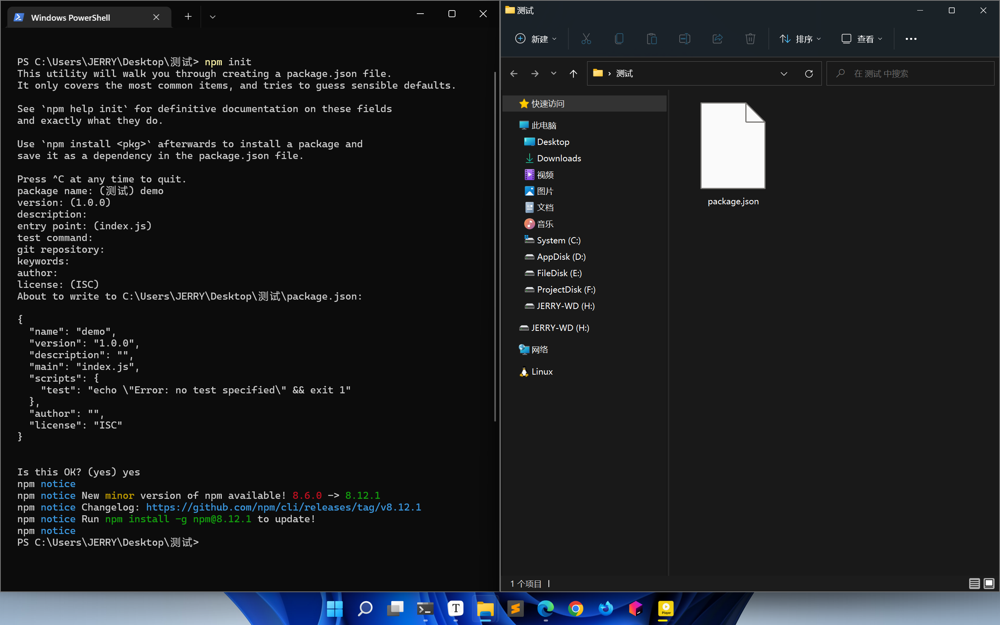
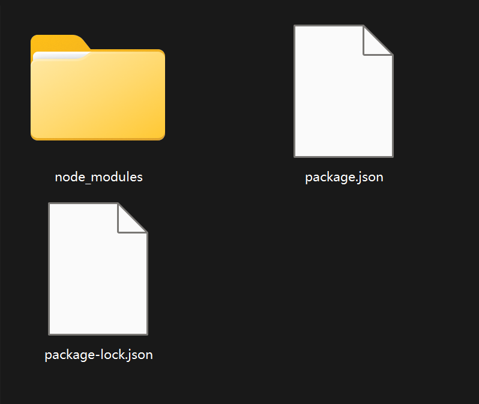
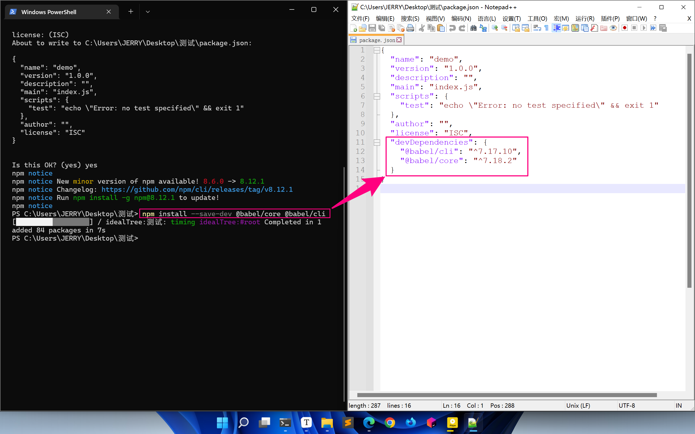

# 一、Babel

## 2.1 认识Babel

官网：[Babel · The compiler for next generation JavaScript https://babel.dev/](https://babel.dev/)

在线编译：[Babel · The compiler for next generation JavaScript https://babel.dev/repl](https://babel.dev/repl)

Babel 是 JavaScript 的编译器，**用来将 ES6 代码转换成 ES6 之前的代码**。

Babel 本身可以编译 ES6 的大部分语法，比如：let、const、箭头函数、class，……，但是对于 ES6 新增的 API，比如：Set、Map、Promise 等全局对象，以及一些定义在全局对象上的方法（比如 Object.assign/Array.from）都不能直接编译，需要借助其它的模块，Babel 一般需要配合 Webpack 来编译 Module 模块语法。

## 2.2 Babel的使用方式

使用方式说明：[Babel · The compiler for next generation JavaScript https://babel.dev/setup](https://babel.dev/setup)

目前，我们主要关注：CLI 及 Webpack。

注意：我们一般不考虑 [In the browser](https://babel.dev/setup#installation) 方式，因为此种方式代码每次被浏览器执行时都要先转换为 ES6 之前的代码，这样的转换影响了性能，而 CLI 及 Webpack 的方式是提前就将 ES6 代码转化为 ES6 之前的代码，浏览器在运行时已经是 ES6 之前的代码了，不影响性能。

## 2.3 Babel自主编译步骤


**这里讲解Babel自主编译步骤，不是基于webpack的（在后面有）**


### 2.3.1 安装Node.js

Node.js 中文官网：[Node.js (nodejs.org)](https://nodejs.org/zh-cn/)

我们下载长期支持版，并双击安装包根据提示进行安装即可。

可以通过在终端中依次输入：`node -v` 及 `npm -v` 来查看版本，如果查看成功，即表明安装成功。

### 2.3.2 初始化项目

- 初始化项目：`npm init`

- 进行项目配置

- 确认配置并正式生成项目



> 当依次正确完成以上步骤后，项目路径下就会生成一个 `package.json` 文件，里面最初记录了我们 npm 项目的初始化配置信息，往后我们利用 npm 安装的依赖及包都会记录在这个文件中。
>
> 往后当我们需要迁移项目时，我们只需要拷贝这个 `package.json` 文件，然后在新的项目中使用相应的命令，便可恢复文件中的环境、依赖及包。
>
> 【初始时的 package.json】
>
> ```json
> {
>    "name": "demo",
>    "version": "1.0.0",
>    "description": "",
>    "main": "index.js",
>    "scripts": {
>     	"test": "echo \"Error: no test specified\" && exit 1"
>    },
>    "author": "",
>    "license": "ISC"
> }
> ```

### 2.3.3 安装Babel需要的包

安装命令：`npm install --save-dev @babel/core @babel/cli`

注意：`--save-dev` 表示这是一个开发环境的依赖，即上线之后是用不到的。

当我们安装成功后，会得到一个依赖及包代码的放置目录和两个 json 文件，其中 package.json 文件会新增一个 `devDependencies` （开发依赖）属性，并记录下我们的安装记录。





- @babel/cli：CLI 中使用 Babel 必须的包，实现了命令行中 Babel 命令的识别与执行等
- @babel/core：Babel 中用于完成 “发号施令” 的包，即：指挥控制其它 Babel 包的行为

> 注意：我们在安装时，要特别注意一下依赖及包的版本号，不能随意的依赖最新版本，因为最新版本可能会不兼容某些旧版本。

> 当我们迁移了项目环境时，也许项目的依赖及包代码（node_modules 文件夹）已经不在了或者错误了，那么只要 package.json 文件还在，那么我们只需要执行 `npm install` 命令，即可根据 package.json 内容重新生成项目的依赖及包代码（node_modules 文件夹）。
>
> 注意：`npm install` 可以简写为：`npm i`
>
> 注意：在平时的项目开发中，我们在拷贝项目或者迁移项目时，通常不会把 node_modules 文件夹一同拷贝或迁移，因为该文件夹的文件数量级太大了，所以拷贝或迁移的时间会特别长，而且还容易出错，我们一般都是通过 `npm install` 来重新生成。

### 2.3.4 使用Babel编译ES6代码

首先，我们需要手动在 package.json 文件中添加以下代码：

```json
"scripts": {
    "build": "babel src -d lib"
}
```

其中 `"build": "babel src -d lib"` 表示：通过 babel 命令将 src 下的文件编译并输出到 lib 目录下。

附：`-d` 实际表示的就是：`--out-dir` 的缩写，其实就是输出目录的意思。

注意：由于我们通常不放在 `lib` 目录下，而是放在 `dist` 目录下，所以我们把 package.json 文件中添加的代码修改为：

```json
"scripts": {
    "build": "babel src -d dist"
}
```

**（1）编译的命令**

当配置好上述步骤后，我们即可通过命令进行编译。

编译命令：`npm run build`

当我们编译成功后，便会多出一个 `dist` 目录，里面便放置有编译后的文件。

> 当我们把编译好的文件打开后，发现里面的代码依旧是 ES6 版本的，这是因为我们在正式编译代码之前还需要设置一个 Babel 的配置文件。

**（2）Babel的配置文件**

首先，我们需要额外安装一个包：`npm install @babel/preset-env --save-dev`，这个包能告诉编译器具体如何转换编译 ES6 的语法。

安装成功后，在项目目录下，创建一个 `.babelrc`。

在文件中写入：

```json
{
    "presets": ["@babel/preset-env"]
}
```

> 配置之后，我们再次执行 `npm run build` 命令，那么 dist 目录中的文件就是编译完成的 ES6 之前版本的代码了！


# 二、Webpack


（1）认识 Webpack

简介：Webpack 是静态模块打包器，当 Webpack 处理应用程序时，会将所有这些模块打包成一个或多个文件。


问题：在index.html中我们会引入多个js文件，而且js文件引入的顺序还有规定，这样就造成很大的麻烦


**解决：我们用webpack把多个js文件打包成一个js文件，这样问题直接解决！！**


（2）什么是 Webpack 模块？

除了 JavaScript 外，还有 CSS、图片、图标字体等。

（3）什么是静态？

开发过程中存在于本地的 js/css/图片/图标字体 等文件，就是静态的；而从远程服务器获取的就是动态的。

Webpack 没办法处理动态的部分，只能处理静态的部分。

[webpack 中文文档 | webpack 中文网 (webpackjs.com)](https://www.webpackjs.com/)


## 2.1 Webpack初体验

**（1）初始化项目**

`npm init`


**（2）安装Webpack需要的包**

`npm i webpack-cli webpack -D`  在当前目录下安装（开发环境）


**（3） 简单配置：webpack.config.js**

```js
const path = require('path')

module.exports = {
    entry: './src/index.js', // 入口文件（解析该文件）

    output: {
        filename: 'bundle.js', // 生成文件
        path: path.resolve(__dirname, './dist') // dist/bundle.js
    },

    mode: 'development', // 开发模式
}
```

```js
// 打包命令
npx webpack
```


## 2.2 entry、output

**1、entry**

在 webpack.config.js 中 entry 指定了 webpack 打包时的入口文件！

```javascript
const path = require('path');

module.exports = {

    // 入口文件
    // 写法一（单文件入口）
    // entry: './src/index.js',
   
    // 写法二（单文件或多文件入口）
    // 多个页面，一般都对应独立的 js 文件，都需要多个入口
    entry: {
        main: './src/index.js',
        search: './src/search.js'
    },
    
};
```


**2、output**

在 webpack.config.js 中 entry 指定了 webpack 打包时的出口文件！

```javascript
const path = require('path');

module.exports = {
    entry: './src/index.js',
    
    output: {
        // __dirname，表示当前所在路径
        // path.resolve，可以拼接路径
        // path: 当前路径/dist
        path: path.resolve(__dirname, 'dist'),
       
        // 输出的文件名（单出口）
        filename: 'bundle.js',
    },
};
```


```javascript
const path = require('path');

module.exports = {
    mode: 'development',
    entry: {
        main: './src/index.js',
        search: './src/search.js'
    },
    output: {
        path: path.resolve(__dirname, 'dist'),
        // 输出的文件名（多出口）
        // name 会自动替换为对应的入口文件，针对不同的入口有不同的输出
        filename: '[name].js',
    },
};
```


## 2.3 html-webpack-plugin

作用：可以帮我们自动生成index.html！！！   


1、安装html-webpack-plugin：

```
npm install --save-dev html-webpack-plugin@4.3.
```


2、配置 webpack.config.js （包含参数说明）

```javascript
const HtmlWebpackPlugin = require('html-webpack-plugin');

module.exports = {
    plugins: [
        new HtmlWebpackPlugin({
            template: './src/index.html', // 指定html模板：src/index.html

            filename: 'app.html',

            inject: 'body', // js文件插入body中				
        })
    ]
};
```


其他参数

```js
//压缩html文件
minify:{   
    caseSensitive: true,   //是否对大小写敏感，默认false         
    collapseBooleanAttributes: true,   //是否简写boolean格式的属性     
    collapseWhitespace: true,  //是否去除空格，默认false           
    minifyCSS: true,  //是否压缩html里的css（使用clean-css进行的压缩） 默认值false；
    minifyJS: true,  //是否压缩html里的js（使用uglify-js进行的压缩）           
    preventAttributesEscaping: true,  //Prevents the escaping of the values of attributes            
    removeAttributeQuotes: true,  //是否移除属性的引号 默认false           
    removeComments: true,  //是否移除注释 默认false           
    removeCommentsFromCDATA: true,  //从脚本和样式删除的注释 默认false           
    removeEmptyAttributes: true,  //是否删除空属性，默认false           
    removeOptionalTags: false,  //  若开启此项，生成的html中没有 body 和 head，html也未闭合           
    removeRedundantAttributes: true,   //删除多余的属性      
    removeScriptTypeAttributes: true,  //删除script的类型属性，在h5下面script的type默认值：text/javascript 默认值false        
    removeStyleLinkTypeAttributes: true,   //删除style的类型属性， type="text/css" 同上
    useShortDoctype: true,  //使用短的文档类型，默认false
},

favicon: './public/logo.ico'
```


以上是单入口的情况，下面展示多入口：

```javascript
const path = require('path');
const HtmlWebpackPlugin = require('html-webpack-plugin');

module.exports = {
    mode: 'development',
    entry: {
        main: './src/index.js',
        search: './src/search.js'
    },
    output: {
        path: path.resolve(__dirname, 'dist'),
        filename: '[name].js'
    },
    module: {
        rules: [
            {
                test: /\.js$/,
                exclude: /node_modules/,
                loader: 'babel-loader'
            }
        ]
    },
    plugins: [
        // 多入口：有几个入口就实例化几次
        new HtmlWebpackPlugin({
            template: './index.html',
            // 多个对象要加上名字进行区分
            filename: 'index.html',
            chunks: [
                'index'
            ]
        }),
        new HtmlWebpackPlugin({
            template: './search.html',
            filename: 'search.html',
            chunks: [
                'search'
            ]
        }) 
    ]
};
```


## 2.4 devtool

创建开发环境，给webpack.config.js添加新配置devtool

- 处理报错时最好添加这个配置

```js
devtool: 'inline-source-map'
```


## 2.5 资源模块类型

webpack5可通过四种资源模块类型**实现本地资源**的引入，webpack4都是用loader实现的

在 src/asset 文件夹下储存静态资源


### 2.5.1 asset/resource

发送一个单独的文件并导出 URL，文件会被存到dist里面

1、配置 webpack.config.js

```js
    module: {
        rules: [
            { 
                test: /\.jpg$/, 
                type: 'asset/resource',
                
                // 安排打包目录和文件名
                generator: {
                	// filename: 'image/[name][ext]
                    
                    filename: 'image/[contenthash][ext]',
                }
            },

        ]
    }
```


2、引入资源

```js
// js文件中

import img1src from "./asset/img1.jpg";

// img1src为url
```

```css
body {
    background-image: url(../asset/img1.jpg);
}

/* icon图标 */
@font-face {
    font-family: 'iconfont',
    src: url('./assets/icon.ttf')
}
```


### 2.5.2 asset/inline

导出一个资源的 data URI，不会保存到dist中

使用方法和上一个一样


### 2.5.3 asset/source

导出资源的源代码（原文本）


### 2.5.4 asset

在导出一个 data URI 和发送一个单独的文件之间自动选择（通过文件大小）


设置选择大小： 图片大小大于4M时才使用asset/resource

```js
parser: {
    dataUrlCondition: {
        maxSize: 4 * 1024 * 1024
    }
}
```


## 2.6 处理CSS、LESS

### 2.6.1 打包 CSS

作用：方便我们引入css、less文件和打包这些文件


首先我们安装三个包：css-loader、less-loader、less （如果不用less，则后面两个包不用安装）

```
npm install css-loader less-loader less -D
```


再安装一个可以帮我们**引入css到html**的一个包（直接以style样式引入html）

```
npm i style-loader
```


配置 webpack.config.js

```js
module: {
    rules: [
        {
            // test: /\.css$/,
            test: /\.(css|less)$/,
            use: [ 'style-loader','css-loader','less-loader' ]
        }
    ]
},
```


最后在index.js（入口文件）中引入

```js
import './css/index.css'
import './css/main.less'
```

```
npx webpack 查看结果
```


### 2.6.1 抽离 CSS

前面是利用`style-loader` 将 css 以 <style> 的方式引入了 HTML 中

mini-css-extract-plugin：在实际场景中，我们更倾向于**将 css 以 <link> 的方式来引入**


安装一个插件 mini-css-extract-plugin

```
npm install mini-css-extract-plugin -D
```


配置 webpack.config.js

```javascript
const MiniCssExtractPlugin = require('mini-css-extract-plugin');

plugins: [

    new MiniCssExtractPlugin({
        // 打包目录和命名方式
        filename: 'css/[name].css'
    })

],

module: {
    rules: [
        {
            // test: /\.css$/,
            test: /\.(css|less)$/,
            use: [ MiniCssExtractPlugin.loader,'css-loader','less-loader' ]
        }
    ]
}, 
```


再次 `npm run webpack`：会在dist下生成一个css文件，index.html以<link>形式引入


### 2.6.3 压缩 CSS

在生产模式下，我们需要压缩css


安装：`npm i css-minimizer-webpack-plugin -D`


配置 webpack.config.js

```js
const CssMinimizerPlugin = require("css-minimizer-webpack-plugin")

mode: 'production', // 生产模式

// 一个新配置
optimization: {
    minimizer: [
        new CssMinimizerPlugin()
    ]
},
```


最后`npx webpack` 发现css、html都进行了压缩！


## 2.7 处理HTML图片

我们需要在index.html中引入图片就必须借助插件！


例如：index.html

```html
<!DOCTYPE html>
<html lang="en">

<head>
    <meta charset="UTF-8" />
    <title>处理HTML图片</title>
</head>

<body>
    
</body>

</html>
```


安装：html-withimg-loader、file-loader

```
npm install --save-dev html-withimg-loader file-loader
```


配置 webpack.config.js：

```javascript
module: {
    rules: [
        {
            test: /\.(jpg|jpeg|png|apng|gif|tif|svg|bmp|webp)$/,
            use: {
                loader: 'file-loader',
                options: {
                    name: 'img/[name].[ext]',
                    // html-withimg-loader 处理 HTML 图片是依赖于 file-loader 的
                    esModule: false
                }
            }
        },
        {
            test: /\.(htm|html)$/,
            loader: 'html-withimg-loader'
        }

    ]
},
```


打包后的 html：

```html
<!DOCTYPE html>
<html lang=en>

<head>
    <meta charset=UTF-8>
    <title>处理HTML图片</title>
    <link href=css/index.css rel=stylesheet>
</head>

<body>
    
    <script src=index.js></script>
</body>

</html>
```


## 2.8 webpack-dev-server

为什么需要 webpack-dev-server？  答案：自动执行打包命令！（每次修改都会自动打包）

**如果当修改了 webpack.config.js 则必须重启服务**


**安装：**

```
npm install webpack-dev-server -D
```


**配置 webpack.config.js**

```js
devServer: {
    static: './dist'
},
```


**执行：**

方法一：`npx webpack-dev-server`


方法二：

修改 package.json

```js
"scripts": {"dev": "webpack-dev-server"}
```

执行：`npm run dev`


**注意：**

`npm run dev` 会在内存中生成打包后的文件，**但在项目中是不可见的！**

如果在开发完后需要生成 dist 目录，那么最后 `npx webpack` 即可。


## 2.9 babel-loader

loader：加载器

webpack 本身是用来打包 js 的（主要就是来解决 JS 模块化问题），如果需要用到其他模块的功能，那么就需要各种各样的 loader。[loaders | webpack 中文网 (webpackjs.com)](https://www.webpackjs.com/loaders/)


**babel-loader**

在 webpack 中使用 babel 就需要借助 babel-loader。

安装：babel-loader + babel/core + babel/preset-env

```
npm install --save-dev babel-loader @babel/core @babel/preset-env
```


想要完整功能即必须再安装两个包。。

```
npm i @babel/runtime @babel/plugin-transform-runtime -D
```


配置 babel，`.babelrc` 

```json
{
    "presets": ["@babel/preset-env"],
    "plugins": [["@babel/plugin-transform-runtime"]]
}
```


配置 webpack.config.js 

```javascript
module.exports = {
    module: {
        rules: [
            {
                test: /\.js$/,
                exclude: /node_modules/,
                loader: 'babel-loader'
            }
        ]
    }
};
```


最后打包后会自动将ES6代码编译！可以在出口 js 文件中查看

测试代码：

```javascript
let name = 'Alex';
const age = 18;

const add = (x, y) => x + y;

new Promise((resolve, reject) => {
    resolve('成功');
}).then(value => {
    console.log(value);
});

Array.from([1, 2]);

class Person {
    constructor(name, age) {
        Object.assign(this, {name, age});
    }
}

new Person('Alex', 18);
```


## 2.10 resolve

该配置指定哪些文件可以被识别为模块引入

```js
// 用来设置引用模块，可以将这些文件识别为模块
resolve: {
    extensions: ['.ts', '.js']
}
```

