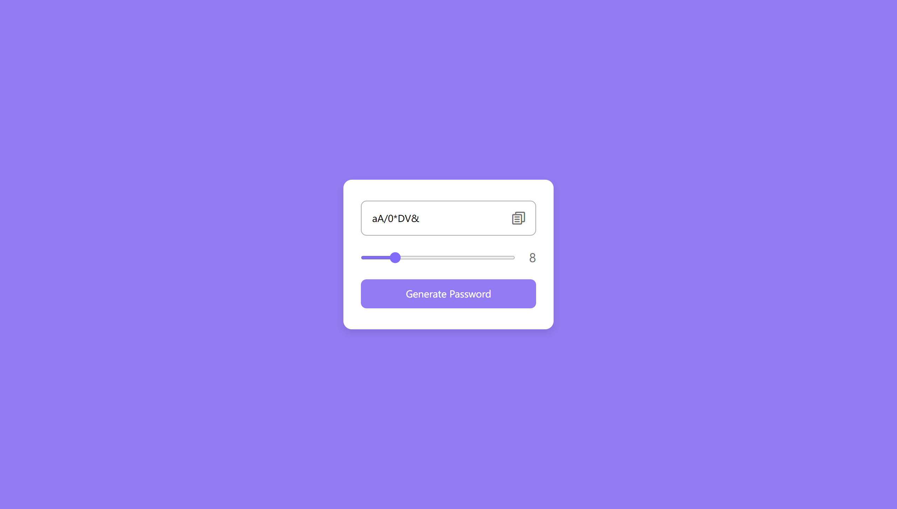
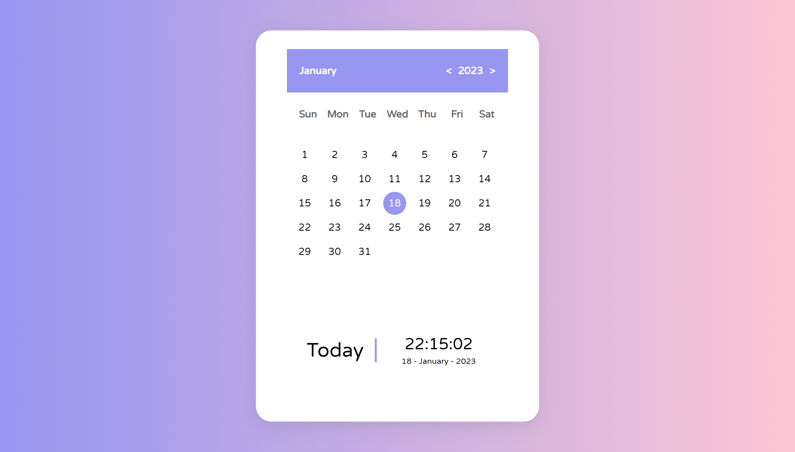
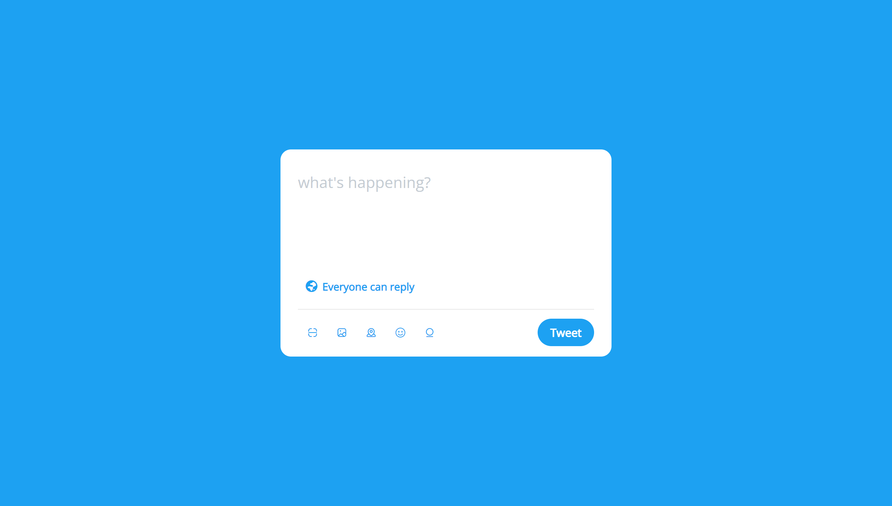
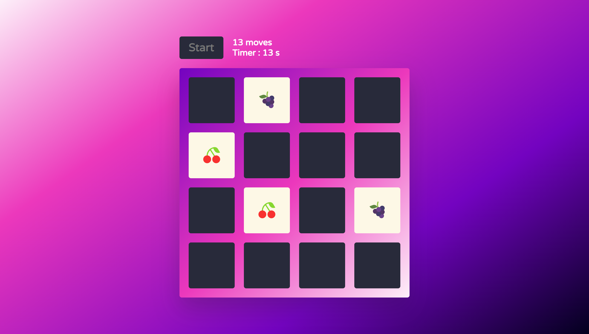
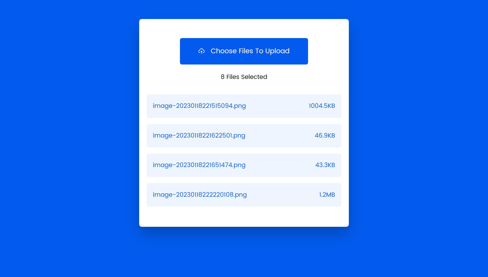

这个文件夹里的静态网页的代码都是自己手敲的，模板和设计稿是在网上找的。主要用于学习和巩固 HTML 、CSS    的语法和知识点。

#### 静态页面预览

1、随机密码生成器

2、Calender日历

3、Twitter推文框

4、图片记忆游戏

> 这个小游戏很有趣，写的过程当中碰到了很多根本想不到的 bug。这个主要考察对 JavaScript 各种语法和 API 的掌握！ 

5、自定义文件上传

